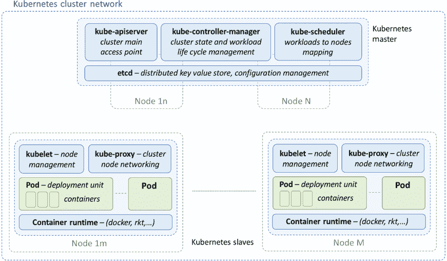
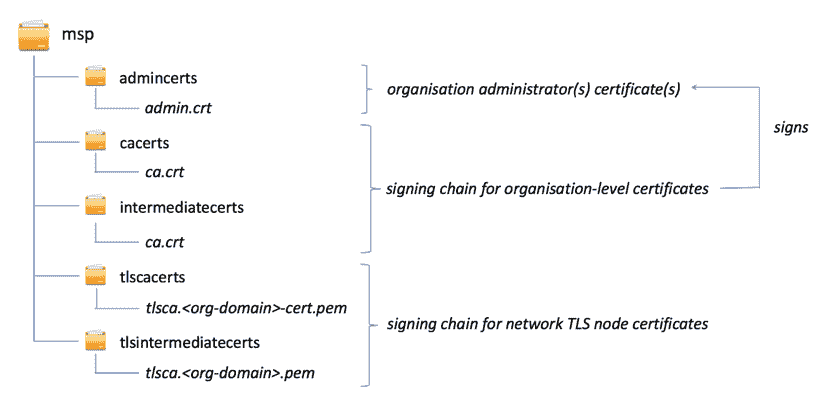
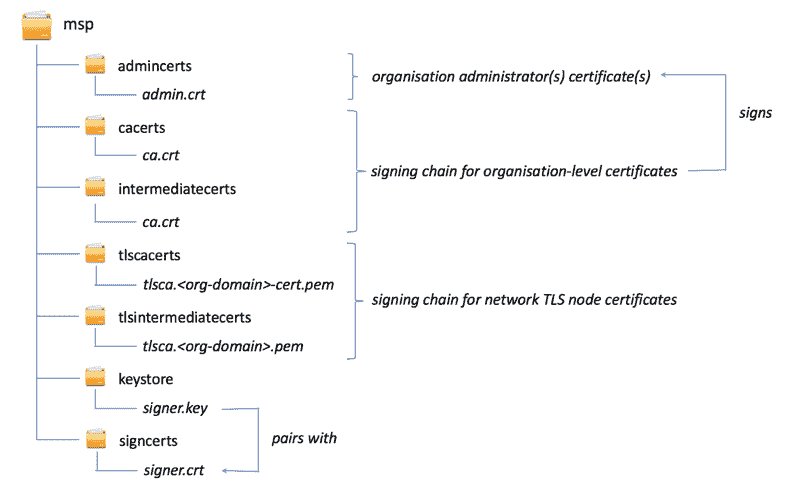
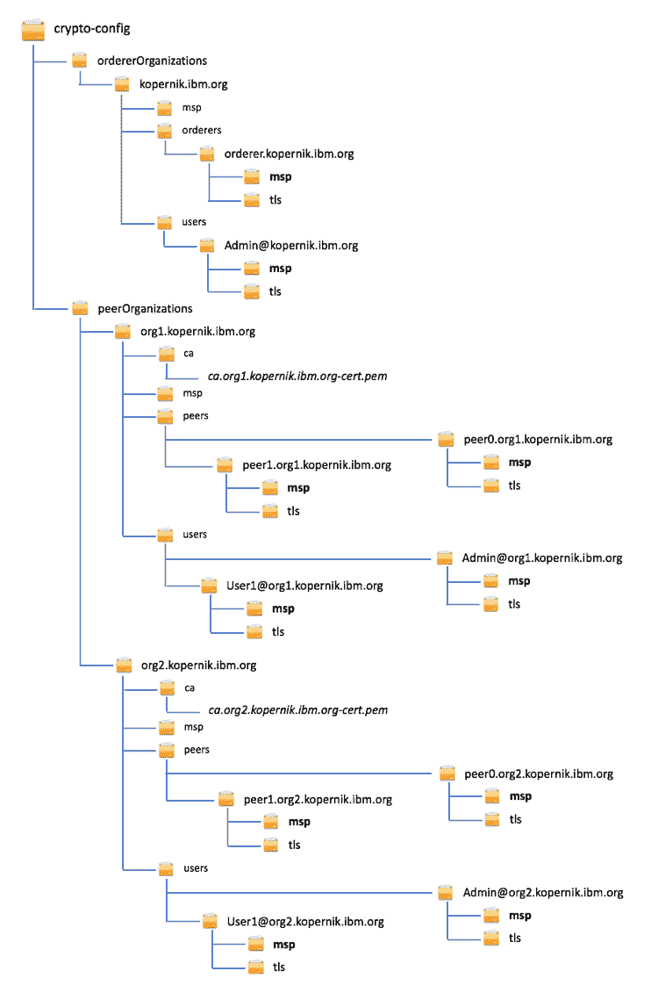
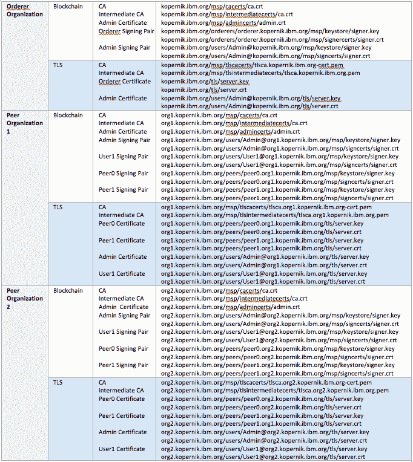
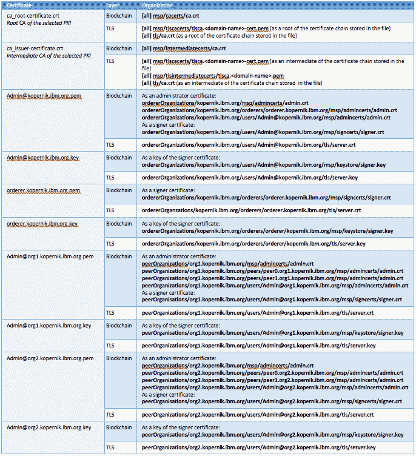
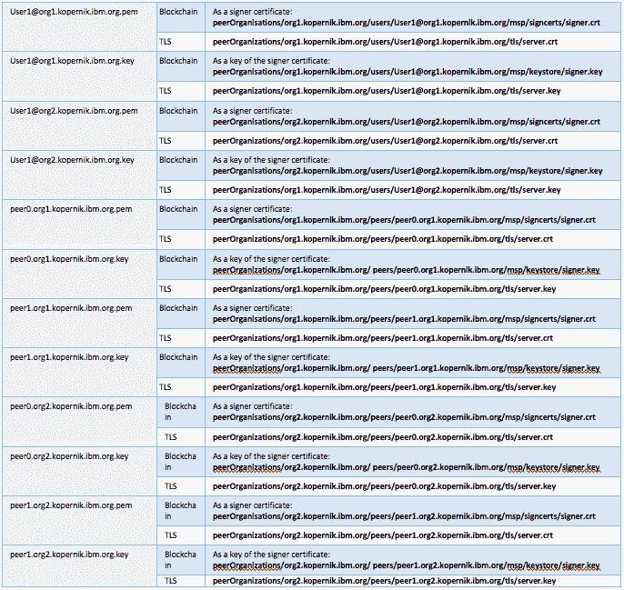

# 使用自定义 CA 保护 Hyperledger Fabric 样本应用并将其部署到 Kubernetes 集群

> 原文：[`developer.ibm.com/zh/tutorials/hyperledger-fabric-kubernetes-cluster-tls-rhel/`](https://developer.ibm.com/zh/tutorials/hyperledger-fabric-kubernetes-cluster-tls-rhel/)

本教程介绍如何为 Red Hat Enterprise Linux (RHEL) 上的 Kubernetes 集群中部署的 Hyperledger Fabric 网络节点之间的关键通信启用传输层安全性 (TLS)。我们选择 RHEL 作为目标发行版，因为它是在企业环境中运行生产系统的最常见的企业级 Linux 发行版之一，可以提供支持服务。

通过执行这些步骤，您将能够在本地开发环境中模拟缩小版的生产网络。为此，必须使用真正的公钥基础架构 (PKI) 签名证书保护集群内的通信。TLS 使用加密可以保护数据和信息的传输。除了 TLS 配置之外，本教程还展示了如何将从 PKI 获得的不同数字证书引入 Fabric 区块链网络。

## 学习目标

*   在 Red Hat Enterprise Linux 上设置单节点 Kubernetes 集群，其中主节点和次节点在同一物理单服务器节点上运行。
*   部署 Hyperledger Fabric 区块链网络。
*   修改默认集群配置以集成自定义 TLS，以便在 Fabric 网络组件之间进行通信。
*   部署一个简单的应用程序来测试网络和 TLS 的配置是否正确。
*   重现配置步骤，将真实公钥基础架构 (PKI) 发布的数字证书用于 Kubernetes 上运行的 Hyperledger Fabric 应用程序。

## 前提条件

您将需要安装以下软件。本教程中的步骤将引导您完成安装过程。

*   [Kubernetes](https://kubernetes.io)
*   [Red Hat Enterprise Linux (RHEL)](https://www.redhat.com/en/technologies/linux-platforms/enterprise-linux)
*   [Docker Enterprise Edition (EE)](https://www.docker.com/products/docker-enterprise)
*   [Docker Compose](https://docs.docker.com/compose/)

以下基本知识将有助于您充分利用本教程：

*   Linux 管理，最好是 Red Hat Enterprise Linux
*   公钥加密
*   Hyperledger Fabric 和相关工具，如 crypto-gen、configtxgen 和 configtxlator

别害怕！您无需成为这些方面的专家。在本教程中，如果必须理解这些技术的某些方面才能继续后续步骤，我们将会深入讲解。如果您已准备好了，那就赶快行动吧！

## 预计花费时间

完成本教程大约需要 4 小时。

## 入门

容器编排技术（如 Kubernetes）对于在生产中运行现代微服务应用程序至关重要。在生产网络中部署、连接、扩展和创建容器化应用程序时，这些技术可以解决主要难题。

将应用程序分解为一组不同的互操作服务时，保护这些服务之间的通信与保护来自外部客户端或服务的访问同样重要。为了保护各方（无论他们是在解决方案的内部还是外部）之间通信，一种极为常见的方法就是引入由知名证书颁发机构 (CA) 签署的证书。

在概念验证和试应用阶段，通常先使用适于开发环境的样本配置来自运行 Fabric 网络部署，而不是使用业务级“区块链即服务”平台。随着这些解决方案逐渐过渡到生产阶段，在选定的容器编排平台上安全实施 Fabric 网络就成为一个主要关注点。

虽然互联网上有大量关于 Kubernetes 的文档，甚至还有更多关于传输层安全性的文档，但我们发现有关如何使用针对 Hyperledger Fabric 区块链应用程序的自定义 TLS 来配置 Kubernetes 集群的信息却少之又少。最近，我们在将为本地开发而设计的 Vanilla Hyperledger 部署移植到生产级 QoS 环境时，就遇到了这一挑战。正是由于缺少如何完成这一过渡的分步指导方法，促使我们编写本教程，分享我们在此过程中的经历和心得。

### 教程资料

除了这些分步说明之外，我们还在以下存储库中提供了重复本教程中讨论的步骤所需的全部材料：[`github.com/hyp0th3rmi4/hlf-k8s-custom-crypto`](https://github.com/hyp0th3rmi4/hlf-k8s-custom-crypto)

该存储库包含 Kubernetes 清单和相关配置文件，这些是使用基于 Kafka 的集群排序节点和传输层安全性（以便网络中节点进行通信）设置 Fabric 样本网络（2 个组织，2 个 CA，每个组织有 2 个对等节点）时所必需的。

对于节点身份和传输层安全性，非生产 Fabric 网络通常使用由组织 CA 颁发的数字证书，而组织 CA 本身则使用自签名根证书。这些通常是由 Fabric 提供的 cryptogen 工具生成的。但在生产方案中，这些证书要么直接由已知公共 PKI 的信任链签名，要么包含在其中。本教程介绍如何集成此类证书，以代替 Fabric 网络的组织 CA 颁发和签署的证书。

### 样本应用程序

在本教程中，您将使用[命令行端到端应用程序](https://github.com/hyperledger/fabric/tree/release-1.1/examples/e2e_cli) (e2e_cli)作为测试应用程序，以验证您的网络配置。本教程演示了在类似于生产部署的设置中设定 Kubernetes 和运行 Fabric 应用程序时遇到的种种挑战。样本应用程序演示了 Fabric 的所有基础知识，可作为您的设置的有用测试，而不会过于复杂。

在我们向您展示此应用程序的设置时，您可以对自己的应用程序使用相同的方法。

### 《绿野仙踪》和 Kubernetes 拯救行动

*“托托，我想我们再也回不去堪萨斯了。”*

电影《绿野仙踪》中的这一句著名台词经常被用来比喻许多人在不寻常的地方或环境下所感到的不适。当您从开发环境步入生产环境时，您就会像电影中的多萝西一样，发现自己在可伸缩性、可用性、应用程序监控、可跟踪性和安全性方面处理完全不同的需求。 在微服务时代，由于需要协调、连接和相互关联的组件数量日益增加，这个问题更加严重。大多数应用程序都面临这一状况，这肯定也与基于 Hyperledger 而构建的应用程序密切相关，对于 Hyperledger 来说，最低只需要部署几个容器便可开始使用，所以您获得的只是一个玩具一样的网络。

基于 Docker Compose 的常规单文件设置部署（例如 Yeasy 提供的部署）已不再够用，因此我们需要更多生产级方法。这时，Kubernetes 就派上用场了。

Kubernetes 是一个在集群上运行容器化应用程序的平台，可以在异构基础架构中构建。Kubernetes 即取即用，支持滚动更新、扩展和收缩服务以及高可用性设置，并可控制路由到不同版本服务的流量。Kubernetes 支持精细地控制部署情况，并通过一系列可补充和支持容器引擎（如 Docker、rkt 或其他）操作的系统组件来实现。这种复杂性使您能够拥有强大的功能和灵活性，但如果您不了解基本概念，可能也会感觉无从下手。图 1 概述了 Kubernetes 集群的架构。本教程简要说明了一些关键概念，有助于您理解后续步骤。

##### 图 1\. Kubernetes 架构



Kubernetes 遵循主次/工作程序架构：主节点协调集群的活动，管理其状态，并根据用户定义的需求和集群的内部状态，在次节点/工作节点之间调度工作负载。主节点的功能是通过一系列可以分发到不同节点的服务来实现的。正如主节点一样，次节点/工作节点由一系列服务组成，如图 1 所示。

除了这些关键的架构组件之外，Kubernetes 还使用其他抽象来编排集群中容器的执行情况。对于本教程，我们最感兴趣的是以下方面：

*   **Pod：**Pod 是 Kubernetes 使用的最小部署单元，旨在用于托管紧密耦合的容器（一个或多个）。主容器表示应用程序服务，而支持容器则用于监视其生命周期以及与其他服务的连接。Pod 意味着是无状态部署单元，可以终止并可重新调度，以在集群的任何节点上执行。

*   **服务：**服务通常代表已部署应用程序的有意义的实体，它可以跨越多个执行相同功能的 Pod。在 Kubernetes 的世界中，服务是指在 Pod 中部署的相应功能的入口点，并充当所有映射部署中的负载均衡器。

*   **部署：**部署用于指定 Kubernetes 服务到 Pod 的映射。当服务定义到节点端口的映射时，相应的部署包含有关服务所需的容器和要部署的副本数量的信息。

*   **标签：**标签是 Kubernetes 使用的一种机制，用于将附加信息追加到集群中使用的任何实体。它们用于实现集群功能，并使最终用户能够扩充与服务、部署或任何其他实体相关联的元数据。例如，标签用于将服务定义与对应部署配对。

*   **代理：**要使 Pod 中部署的服务可供架构的其他组件使用，代理发挥着重要作用。代理的功能由图 1 中所示的 *kube-proxy* 组件实现，该组件负责在主机级别进行子网划分，并根据定义服务的清单在节点外部公开服务。

*   **名称空间：**名称空间是一种在同一物理集群中创建多个虚拟集群的机制。这种抽象还提供了服务范围和可视性方面的界限；所有服务都部署在名称空间中，并且可以访问同一名称空间中的所有其他服务。Kubernetes 有三个默认名称空间：*default*、*kube-system* 和 *kube-public*。第一个是默认名称空间，第二个用于部署系统服务，第三个是一个特殊名称空间，用于部署需要在所有集群中显示和可访问的资源。

*   **域名服务 (DNS)：**除了基于集群的基本名称解析功能外，Kubernetes 还允许集成其他 DNS 解析功能。这本质上是一种服务，像任何其他应用程序级服务一样部署到集群上。唯一的区别是它部署在系统名称空间中，并对某些 Kubernetes 系统组件具有特许访问权限。

对架构的每个组件一一描述，已超出了本教程的范围。有关 Kubernetes 的更完整概述，可查看 [Kubernetes 文档](https://kubernetes.io/docs/concepts/)或教程，如 [Digital Ocean](https://www.digitalocean.com/community/tutorials/an-introduction-to-kubernetes) 中的教程。

## 1\. 在 RHEL 上启动并运行 Kubernetes

首先要做的是，为运行基于 Kubernetes 的应用程序准备环境。我们选择 Red Hat Enterprise Linux (RHEL) 作为目标发行版，因为它是在企业环境中运行生产系统的最常见的 Linux 发行版之一。我们的目标是基于 Red Hat Enterprise Linux 提供功能齐全的单节点 Kubernetes 集群。

Red Hat Enterprise Linux 提供 [OpenShift](https://www.openshift.com/) 作为容器编排的默认解决方案。OpenShift 基于 Kubernetes，在网络、多租户、镜像注册、日志记录和监控方面，为框架的核心功能提供附加服务。此平台与 Kubernetes 完全兼容：可以在 OpenShift 上透明地部署为 Kubernetes 集群定义的服务和部署项。OpenShift 以两种方式提供：开源平台和企业级产品，后者提供 24/7 式支持。因此，Kubernetes 和 Docker 目前不可用于 RHEL 发行版，需要手动安装。

为了建立功能齐全的 Kubernetes 集群，您需要安装两个组件：Docker Enterprise Edition 和 Kubernetes。

### a. 安装 Docker Enterprise Edition

1.  **删除系统上以前的所有 Docker 版本：**

    ```
     sudo yum remove docker \
                      docker-client \
                      docker-client-latest \
                      docker-common \
                      docker-latest \
                      docker-latest-logrotate \
                      docker-logrotate \
                      docker-selinux \
                      docker-engine-selinux \
                      docker-engine \
                      docker-ce 
    ```

2.  **找到将用于安装的 Docker EE 存储库。**这可以通过访问 Docker Store 的在线配置文件来完成，其中列出了您可以使用的所有试用和订阅：

    *   登录 [`store.docker.com/my-content`](https://store.docker.com/my-content)。
    *   单击 **Docker Enterprise Edition for Red Hat Enterprise Linux** 所对应的 **Setup**。
    *   复制 **Copy and paste this URL to download your edition** 中显示的 URL。

        我们将此 URL 称为 `<DOCKER_REPO_URL>`。以下过程将配置您的环境，以从上述存储库下载 Docker EE。

        ```
        # remove existing docker repositories
        sudo rm /etc/yum.repos.d/docker*.repo

        # store the url to the docker repository as a YUM variable
        export DOCKER_URL="<DOCKER_REPO_URL>"
        sudo -E sh -c 'echo "$DOCKER_URL/rhel" > /etc/yum/vars/dockerurl'

        # store the OS version string as a YUM variable.We assume here that RHEL
        # version is 7.You can also use a more specific version.
        sudo -E sh -c 'echo "7" > /etc/yum/vars/dockerosversion'

        # install the additional packages required by the devicemapper storage driver
        sudo yum install yum-utils \
                       device-mapper-persistent-data \
                       lvm2

        # enable the extras RHEL repository.This provides access to the
        # container-selinux package required by docker-ee
        sudo yum-config-manager --enable rhel-7-server-extras-rpms

        # add the Docker EE stable repository
        sudo -E yum-config-manager --add-repo "$DOCKER_URL/rhel/docker-ee.repo" 
        ```

3.  **安装 Docker Enterprise Edition：**

    ```
     sudo yum install docker-ee
     sudo systemctl start docker 
    ```

    系统可能会提示您接受 GPG 密钥。验证指纹是否与以下值匹配，如果匹配，则接受该指纹。Docker EE 安装现已完成。

    **指纹：**77FE DA13 1A83 1D29 A418 D3E8 99E5 FF2E 7668 2BC9

4.  **测试 Docker 安装是否正常。**您可以运行 hello-world 容器进行验证：

    ```
     sudo docker run hello-world 
    ```

    如果 Docker 运行时安装成功，您应该会看到以下输出：

    ```
     Pulling from library/hello-world
     9bb5a5d4561a：Pull complete
     Digest:sha256:f5233545e43561214ca4891fd1157e1c3c563316ed8e237750d59bde73361e77
     Status: Downloaded newer image for hello-world:latest

     Hello from Docker!
     This message shows that your installation appears to be working correctly.

     To generate this message, Docker took the following steps:
      1\. The Docker client contacted the Docker daemon.
      2\. The Docker daemon pulled the "hello-world" image from the Docker Hub.
         (amd64).
      3\. The Docker daemon created a new container from that image which runs the
         executable that produces the output you are currently reading.
      4\. The Docker daemon streamed that output to the Docker client, which sent it
         to your terminal.

     To try something more ambitious, you can run an Ubuntu container with:
      $ docker run -it ubuntu bash

     Share images, automate workflows, and more with a free Docker ID:
      https://hub.docker.com/

     For more examples and ideas, visit:
      https://docs.docker.com/engine/userguide/ 
    ```

[Docker 文档](https://docs.docker.com/install/linux/docker-ee/rhel/)中更详细地介绍了如何在 Red Hat Enterprise Linux 上安装 Docker EE。

### b. 安装 Kubernetes

*注意：*Kubernetes 经常发布新版本，因此以下说明很快会过期。如果您在使用这些说明时遇到任何问题，应参阅以下链接中有关安装的 Kubernetes 官方文档。

1.  **安装 Kubernetes 基础包：**

    *   **kubelet：**这是 Kubernetes 基本服务，用于执行基本的节点管理功能，如创建 Pod 和容器部署。
    *   **kubeadm：**该包负责引导单节点 Kubernetes 集群，该集群符合 [Kubernetes 一致性测试](https://kubernetes.io/blog/2017/10/software-conformance-certification/)所确定的最佳实践。
    *   **kubectl：**此包安装用于与 Kubernetes 集群交互的命令行工具。

        此脚本使用 Kubernetes 存储库来配置 YUM 并安装所需的包：

        ```
        # configure YUM to access the Kubernetes repository
        sudo cat <<EOF > /etc/yum.repos.d/kubernetes.repo
        [kubernetes]
        name=Kubernetes
        baseurl=https://packages.cloud.google.com/yum/repos/kubernetes-el7-x86_64
        enabled=1
        gpgcheck=1
        repo_gpgcheck=1
        gpgkey=https://packages.cloud.google.com/yum/doc/yum-key.gpg https://packages.cloud.google.com/yum/doc/rpm-package-key.gpg
        EOF

        # disable SELinux, you need to do this in order to allow containers to access
        # the file system, this is needed for instance by pod networks
        sudo setenforce 0

        # install the packages
        sudo yum install -y kubelet kubeadm kubectl

        # enable the kubelet service
        sudo systemctl enable kubelet
        sudo systemctl start kubelet 
        ```

2.  **配置 Docker 的 cgroup 驱动程序。**由于您使用 Docker EE 作为容器运行时，因此需要确保 kubelet 使用与 Docker 相同的 cgroup 驱动程序。您可以使用以下命令来验证驱动程序是否相同：

    ```
     docker info | grep -i cgroup
     cat /etc/systemd/system/kubelet.service.d/10-kubeadm.conf 
    ```

    如果 cgroup 驱动程序不同，将 kubelet 的配置修改为与 Docker 使用的 cgroup 驱动程序相匹配。应更改的标志是 `--cgroup-driver`。如果已经设置，可以按如下方式进行更改：

    ```
     sudo sed -i "s/cgroup-driver=systemd/cgroup-driver=cgroupfs/g" /etc/systemd/system/kubelet.service.d/10-kubeadm.conf 
    ```

    更新后，需要重新启动 kubelet：

    ```
     sudo systemctl daemon-reload
     sudo systemctl restart kubelet 
    ```

3.  **引导集群并将其配置为在单个节点中运行。**`kubeadm` 在这里派上了用场。要引导集群，只需发出以下命令：

    ```
     sudo kubeadm init --pod-network-cidr=192.168.0.16 
    ```

    您稍后将添加的网络插件需要附加标志 `--pod-network-cidr`。此标志的值取决于您要安装的特定网络插件。在这种情况下，您将安装 [Calico CNI](https://docs.projectcalico.org/v3.2/introduction/)。

4.  **将 Kubernetes 配置复制到主目录中。**此步骤允许非 root 用户（当前用户）将服务部署到集群上。

    ```
     mkdir -p $HOME/.kube
     sudo cp -i /etc/kubernetes/admin.conf $HOME/.kube/config
     sudo chown $(id -u):$(id -g) $HOME/.kube/config 
    ```

5.  **安装网络附加组件。**Kubernetes 支持多个网络插件。在本教程中，您将使用[快速入门指南](https://docs.projectcalico.org/v3.2/getting-started/kubernetes/)中所述的 Calico CNI 插件。

    ```
     # install the etcd service...
     kubectl apply -f https://docs.projectcalico.org/v3.2/getting-started/kubernetes/installation/hosted/etcd.yaml

     # install the role-based access control (RBAC) roles...
     kubectl apply -f https://docs.projectcalico.org/v3.2/getting-started/kubernetes/installation/rbac.yaml

     # install the role-based access control (RBAC) roles...
     kubectl apply -f https://docs.projectcalico.org/v3.2/getting-started/kubernetes/installation/hosted/calico.yaml 
    ```

    如果安装成功，键入以下命令时 —

    ```
     kubectl get pods --all-namespaces 
    ```

    — 应该会看到类似如下的输出：

    ```
     NAMESPACE    NAME                                READY  STATUS   RESTARTS  AGE
     kube-system  calico-etcd-x2482                   1/1    Running  0         2m
     kube-system  calico-kube-controllers-6f8d4-tgb   1/1    Running  0         2m
     kube-system  calico-node-24h85                   2/2    Running  0         2m
     kube-system  etcd-jbaker-virtualbox              1/1    Running  0         6m
     kube-system  kube-apiserver                      1/1    Running  0         6m
     kube-system  kube-controller-manager             1/1    Running  0         6m
     kube-system  kube-dns-545bc4bfd4-67qqp           3/3    Running  0         5m
     kube-system  kube-proxy-8fzp2                    1/1    Running  0         5m
     kube-system  kube-scheduler                      1/1    Running  0         5m 
    ```

6.  **移除对主节点的限制。**默认情况下，Kubernetes 不允许您在主节点上调度 Pod。要运行单节点集群，需要移除这一限制。为此，可以通过使用以下命令将主节点标记为安全的：

    ```
     kubectl taint nodes –all node-role.kubernetes.io/master- 
    ```

    如果命令成功执行，您应该看到以下消息：

    ```
     node “<your-hostname>” untainted 
    ```

    可以通过执行以下操作，确认您的集群现在有一个节点：

    ```
     kubectl get nodes 
    ```

    此命令应在表中显示一个返回的条目。

7.  **测试 Kubernetes 安装：**

    ```
     kubectl run my-nginx --image=nginx --replicas=2 --port=80 
    ```

    此命令创建一个部署，用于在两个 Pod 上运行 NginX Web 服务器，并在端口 80 上公开该服务。如果命令成功执行，您应该能够看到一个部署和两个 Pod 正在运行，如下所示：

    ```
     $ kubectl get deployments
     NAME       DESIRED   CURRENT   UP-TO-DATE   AVAILABLE   AGE
     my-nginx   2         2         2            2           15s
     $ kubectl get pods
     NAME                       READY     STATUS        RESTARTS   AGE
     my-nginx-568fcc5c7-2p22n   1/1       Running       0          20s
     my-nginx-568fcc5c7-d6j6x   1/1       Running       0          20s 
    ```

    可以通过发出以下命令来删除测试部署：

    ```
     kubectl delete deployment my-nginx 
    ```

有关使用 `kubeadm` 设置 Kubernetes 集群的更多详细信息，可查看 [Kubernetes 文档](https://kubernetes.io/docs/setup/independent/install-kubeadm/)。

## 2\. 安装 Hyperledger Fabric 并针对 Kubernetes 进行配置

鉴于本文撰写时所发布的正式版本，我们为本教程选择了 Hyperledger Fabric V1.1.0 版本。但是，为实现本教程目标而描述的方法同样适用于未来版本。

### a. 下载教程材料和 Hyperledger Fabric

下载上述“教程材料”部分中指定的 Git 存储库，这将为您提供运行 Fabric 网络所需的全部代码对象。运行以下一组命令来克隆存储库，建立工作目录并检索 Fabric 1.1.0 Docker 镜像：

```
git clone https://github.com/hyp0th3rmi4/hlf-k8s-custom-crypto
cp -r hlf-k8s-custom-crypto/* /home/hlbcadmin/Downloads/mysolution/fabric-e2e-custom/
cd /home/hlbcadmin/Downloads/mysolution/fabric-e2e-custom/
./download-dockerimages.sh -c x86_64-1.1.0 -f x86_64-1.1.0 
```

### b. 为 Kubernetes 创建 Hyperledger Fabric 清单

Hyperledger Fabric 附带预配置的 Docker Compose 文件，可用于在运行 Docker 的本地计算机上启动区块链网络。要在 Kubernetes 上运行相同的网络，您需要生成相应的 Kubernetes 清单。我们使用了 Hyperledger Fabric 分发版提供的[样本端到端命令行界面配置](https://github.com/hyperledger/fabric/tree/release-1.1/examples/e2e_cli)。

您可以使用 [kompose](https://github.com/kubernetes/kompose) 命令行工具执行此操作（该工具会自动为您应用转换），也可以手动执行该过程。对于 Docker Compose 文件中提到的每个服务，您需要创建两个工件：**服务**和**部署**。服务和部署通过选择器标签来连接。以下清单显示了将 **fabric-zookeeper0** 组件转换为 Kubernetes 所需的相应服务和部署清单的示例：

```
# fabric-zookeeper0-service.yaml

apiVersion: v1
kind: Service
metadata:
  annotations:
    kompose.cmd: ./kompose convert -f docker-compose-e2e.yaml
    kompose.version: 1.12.0 (0ab07be)
  creationTimestamp: null
  labels:
    io.kompose.service: fabric-zookeeper0
  name: fabric-zookeeper0
spec:
  ports:
  - name: "2181"
    port: 2181
    targetPort: 2181
  - name: "2888"
    port: 2888
    targetPort: 2888
  - name: "3888"
    port: 3888
    targetPort: 3888
  selector:
    io.kompose.service: fabric-zookeeper0
status:
  loadBalancer: {}

# fabric-zookeeper0-deployment.yaml

apiVersion: extensions/v1beta1
kind: Deployment
metadata:
  annotations:
    kompose.cmd: ./kompose convert -f docker-compose-e2e.yaml
    kompose.version: 1.12.0 (0ab07be)
  creationTimestamp: null
  labels:
    io.kompose.service: fabric-zookeeper0
  name: fabric-zookeeper0
spec:
  replicas: 1
  strategy: {}
  template:
    metadata:
      creationTimestamp: null
      labels:
        io.kompose.service: fabric-zookeeper0
    spec:
      containers:
      - env:
        - name: ZOO_MY_ID
          value: "1"
        - name: ZOO_SERVERS
          value: server.1=0.0.0.0:2888:3888 server.2=zookeeper1.kopernik.ibm.org:2888:3888 server.3=zookeeper2.kopernik.ibm.org:2888:3888
        image: hyperledger/fabric-zookeeper
        name: zookeeper0
        ports:
        - containerPort: 2181
        - containerPort: 2888
        - containerPort: 3888
        resources: {}
      dnsConfig:
        options:
          - name: ndots 
```

用于转换的 Docker Compose 文件是 `docker-compose-e2e.yaml`，作为本教程的附件可供下载。文件中定义的网络包含以下内容：

*   2 个组织，每个组织两个对等节点
*   2 个 MSP，每个组织一个
*   1 个排序节点
*   1 个用于账本的持久层，基于 CouchDb（4 个服务器，每个对等节点 1 个）
*   1 个 Kafka 集群，其中包含 4 个节点
*   1 个 ZooKeeper 集群，其中包含 3 个节点

参考配置的完全转换会生成以下工件，您可以在 git 存储库中找到它们：

*   适用于 zookeeper 集群组件的 `fabric-zookeeper<N>-service.yaml` 和 `fabric-zookeeper<N>-deployment.yaml`
*   适用于 zookeeper 集群组件的 `fabric-kafka<N>-service.yaml` 和 `fabric-kafka<N>-deployment.yaml`
*   适用于 MSP 的 `fabric-ca1.yaml` 和 `fabric-ca2.yaml`（服务和部署）
*   适用于排序节点的 `fabric-orderer.yaml`（服务和部署）
*   适用于对等节点的 `fabric-peer<N>-org<M>.yaml`（服务和部署）
*   适用于对等节点账本数据库的 `fabric-couchdb.yaml`（服务和部署）
*   Fabric CLI `fabric-cli-job.yaml` 和 `fabric-cli-deployment.yaml`

为方便起见，Kubernetes 允许您将多个清单合并为一个文件或将它们分开。在这种情况下，将区块链网络核心组件（MSP、排序节点和对等节点）的服务清单和部署清单集合在一起，同时将 ZooKeeper 和 Kafka 组件的相应清单分开。最后，您还将合并持久层（CouchDb 服务器）的所有清单。

### c. 连接 Docker 和 Kubernetes 网络

您通过设置生成了 Kubernetes 清单，这些清单意在以原生方式与 Docker 一起使用。因此，他们依靠 Docker 网络来解析主机。在 Kubernetes 中运行此类设置时，可能会遇到在不同网络上运行相同容器的问题。因此，自然主机名解析过程不能立即使用。特别是，这是由对等节点产生的链码容器问题。这仍然使用 Docker 引擎（而不是 Kubernetes）来创建容器，而网络中的所有其他容器都已通过 Kubernetes 进行了部署。

在 Fabric 架构中，对等节点在隔离的容器环境中运行智能合约（链码），它可以通过 Docker 守护进程的 Unix 套接字接口直接部署容器来实现这一点。此链码容器需要一种联系对等节点的方法，以便可以通过它进行管理，但无法解析在 Docker 网络上对 Kubernetes 上运行的对等节点的 DNS 查询。您需要使用 Kubernetes 集群的 DNS 服务器 IP 地址配置链码容器，以便它可以回调。对于网络中的每个对等节点，您需要指定环境变量 `CORE_VM_DOCKER_HOSTCONFIG_DNS`，该变量用于在启动期间将 DNS 服务器的 IP 地址注入链码容器。下面的代码片段显示了网络中一个对等节点的配置（参考：fabric-peer0-org1.yaml）。

```
 ……
      - env:
        - name: CORE_VM_DOCKER_HOSTCONFIG_DNS
          value: "10.96.0.10" # this must be replaced with actual IP of the
                              # Kubernetes DNS service
    …… 
```

下面的代码显示了如何提取 Kubernetes DNS 服务的 IP 地址：

```
$ kubectl get svc kube-dns -n kube-system

NAME       TYPE        CLUSTER-IP   EXTERNAL-IP   PORT(S)         AGE
kube-dns   ClusterIP   10.96.0.10   <none>        53/UDP,53/TCP   18d 
```

上述方法代表了桥接 Docker 容器虚拟覆盖网络和 Kubernetes 网络之间流量的重要方式，这使得各个网络组件之间的名称解析能够以可发现的稳健方式成功完成。对等节点和链码组件保持隔离，但通过网络相互连接，这与其容器编排方法和运行时环境无关。鉴于对等节点和链码之间的应用程序通信协议的性质，它们的生命周期高度一致 – 例如，当服务器端组件停止时，连接到服务器端组件或与之关联的客户端组件将正确关闭，而不会被孤立或挂起。这种网络桥接还降低了 Docker-in-Docker 方法从对等节点启动链码容器的漏洞风险。

## 3\. 启用自定义传输层安全性

本节重点介绍如何为 Fabric 网络的不同组件之间的通信启用传输层安全性。如前所述，我们之所以决定编写本教程，就是因为我们需要在本地开发环境中复制缩小版的生产设置。为此，使用真正 PKI 保护集群内通信是必不可少的步骤。

### a. Hyperledger Fabric TLS 基本设置

Hyperledger Fabric 内置了将 TLS 纳入以下 Fabric 构成服务的功能：排序节点、对等节点和和证书颁发机构 (CA)。默认情况下，这些组件从相应镜像内置的配置文件中检索其 TLS 设置。可以在 Hyperledger Fabric 存储库的[样本配置](https://github.com/hyperledger/fabric/tree/release-1.1/sampleconfig)文件夹中找到对等节点和排序节点的默认配置设置：

*   对于对等节点 (hyperledger/fabric-peer)，默认配置设置位于 core.yaml 文件中。
*   对于排序节点 (hyperledger/fabric-orderer)，默认配置设置位于 orderer.yaml 文件中。

这些设置会被启动期间传递给容器的环境变量所覆盖，这些变量会映射到要更改的配置设置。例如，对于对等容器，您可以定义以下内容：

*   `CORE_PEER_TLS_ENABLED (=true|false)`
*   `CORE_PEER_TLS_CERT_FILE`：用于对等容器的证书文件的路径
*   `CORE_PEER_TLS_KEY_FILE`：与证书关联的密钥文件的路径
*   `CORE_PEER_TLS_ROOTCERT_FILE`：根 CA 证书文件的路径

同样，对于排序节点，可以通过定义以下环境变量来控制 TLS 设置：

*   `ORDERER_GENERAL_TLS_ENABLED (=true|false)`
*   `ORDERER_GENERAL_TLS_CERTIFICATE`：用于排序节点的证书文件的路径
*   `ORDERER_GENERAL_TLS_PRIVATEKEY`：与证书关联的密钥文件的路径
*   `ORDERER_GENERAL_TLS_ROOTCAS`：根 CA 证书文件的路径

对于证书颁发机构，配置是在启动 CA 容器时[动态生成的](https://github.com/hyperledger/fabric-ca/blob/release-1.1/cmd/fabric-ca-server/config.go#L42)，而不是让一个静态文件来存储默认设置。可以使用以下环境变量来修改这些设置：

*   `FABRIC_CA_TLS_ENABLED (=true|false)`
*   `FABRIC_CA_TLS_CERTFILE`：用于 CA 的证书文件的路径
*   `FABRIC_CA_TLS_KEYFILE`：与证书关联的密钥文件的路径

通过使用这些设置并将容器名称正确映射到相应证书中使用的完全限定域名，您可以全面地为 Fabric 组件配置 TLS。可以在工作目录 `fabric-e2e-custom` 中找到配置的网络文件，以便使用传输层安全性。

### b. 获得 PKI 证书

Cryptogen 是 Hyperledger Fabric 附带的默认实用程序，用于为 Fabric 网络创建所有必需证书。这些证书是自签名的，您希望将它们替换为由真实 PKI 签名的自定义证书。在本教程中，您将使用通过 IBM 内部证书颁发机构配置的证书，但对于通过 PKI（如 Digital Ocean、Verisign 或 Symantec）获取的证书，这些步骤基本相同。

在开始使用自定义 TLS 之前，您应知道需要多少证书以及它们的存储位置。这基本上归结为了解加密工具的工作方式，并将其行为与对应真实 PKI 证书的配置相匹配（如果您选择保持 cryptogen 生成的密码材料布局与自定义配置的密码材料布局一致）。此工具负责为网络中的所有身份创建密码材料，并由 `crypto-config.yaml` 文件驱动，此文件确定需要多少证书和相关私钥。您可以在 `fabric-e2e-custom` 工作目录的根目录中找到样本应用程序的 `crypto-config.yaml`：

```
OrdererOrgs:
  - Name: Orderer
    Domain: kopernik.ibm.org
    CA:
         Country: US
         Province: California
         Locality: San Francisco
    Specs:
      - Hostname: orderer

PeerOrgs:
  - Name: Org1
    Domain: org1.kopernik.ibm.org
    EnableNodeOUs: true
    CA:
         Country: US
         Province: California
         Locality: San Francisco
    Template:
      Count: 2
    Users:
      Count: 1

  - Name: Org2
    Domain: org2.kopernik.ibm.org
    EnableNodeOUs: true
    CA:
         Country: US
         Province: California
         Locality: San Francisco
    Template:
      Count: 2
    Users:
      Count: 1 
```

您将使用的配置是在 Hyperledger Fabric 默认设置的基础上稍作修改得来的：根据其默认行为，您可以为排序节点创建两个组织和一个单独的组织。这其中的每一个组织都有一个单独的证书颁发机构 (CA)，用于管理代表该组织中的用户和系统身份的证书。您只需更改组织的名称，使其与您将要提供的证书保持一致。

`crypto-config.yaml` 文件还提供有关在每个组织中创建多少个对等节点的说明。这由 `Template.Count` 参数控制，该参数定义了在组织中创建的最大对等节点数量。在没有进一步指定主机名模板的情况下，将使用 `fabric-peer<N>-<org>` 模板来创建名称，其中 `N` 的范围从 `0` 到 `Template.Count-1`。与 `Template` 部分类似，`User` 部分控制为每个组织创建的身份数量。此设置将创建以下身份：

*   排序节点
*   排序组织的 CA 和管理员
*   每个对等组织包含 2 个对等节点、1 个 CA、1 个管理员和 1 个用户

除了在组织级别使用的身份之外，Hyperledger Fabric 还需要 x509 证书形式的身份来管理网络连接，以实现 TLS。

上述加密身份集合是成员资格服务提供者 (MSP) 配置的一部分。这是 Fabric 组件，负责提供网络参与成员身份定义、身份验证和身份认证，涉及签名生成和验证步骤。为了方便起见，将这些信息以文件夹结构形式进行排列，如图 2 所示。

##### 图 2\. MSP 文件夹基本结构



文件夹结构还突出显示了组织级别身份和网络级别身份存在的中间证书，它们会对使用的证书进行签名，而不是直接依赖于根证书。

##### 图 3\. 包含签名材料的 MSP 文件夹结构



这些信息由 Hyperledger Fabric 网络的不同组件使用，不包含任何敏感信息（即私钥）。对于那些需要签署或背书事务的实体，会生成以下两个额外的文件夹：`keystore` 和 `signercerts`。这两个文件夹分别包含私钥和用于签名的关联证书。这些文件夹对于节点（排序节点或对等节点）和用户来说非常重要。图 3 显示了此类实体的更新文件夹结构。

##### 图 4\. cryptogen 生成的文件夹结构



这是 cryptogen 在自动设置 Hyperledger Fabric 网络证书时生成的所有信息。参考之前显示的 `crypto-config.yaml` 文件，cryptogen 将生成如图 4 所示的文件夹结构。`msp` 文件夹反映了上述结构。以粗体显示的内容还包含 `keystore` 和 `signercerts` 文件夹。存储在这些文件夹中的信息由节点用于背书事务，并由用户用于对提交的事务进行签名。

图 4 还显示了每个节点和每个用户都存在 `tls` 文件夹。这些文件夹包含不同实体用于建立 TLS 连接的密码材料。

总之，对于 `crypto-config.yaml` 中显示的配置，cryptogen 将创建表 1 中所示的证书。

##### 表 1\. 通过 cryptogen 生成的密码材料



该表显示了任何 Hyperledger Fabric 网络运行所需的证书集合（参考：Blockchain 行），以及使用 TLS 保护通信而专门需要的证书集合（参考：TLS 行）。

如果您决定使用真正 PKI 来保护网络通信，可以使用相同 PKI 为组织、其组件和用户提供证书。可以在应用层使用用于保护网络通信的相同证书，从而减少要提供的证书总数。表 2 描述了要提供的证书以及如何将它们映射到文件夹结构中的对应证书。

##### 表 2\. 将证书和密钥映射到 cryptogen 生成的文件夹结构

 

此过程可以自动执行，并且 `scripts / script.sh` 文件夹中存储的脚本会自动将 `ibm-files` 源目录中存储的所有证书复制到 `crypto-config` 目录树下的相应路径中。

### c. 在 Kubernetes 上运行 TLS

上面讨论的配置设置不足以使您的 Kubernetes 设置生效，因为在 Docker Compose 网络和 Kubernetes 集群中实现服务解析的方式存在根本差异。

默认情况下，Kubernetes 将服务发现功能推迟到附加组件上。因此，Kubernetes 的基本安装不提供服务相互查找和交互功能。这个问题并不大，因为有几个附加组件可用于提供此功能，其中最受欢迎的一个组件就是 DNS 附加组件 [KubeDNS](https://github.com/kubernetes/kubernetes/tree/master/cluster/addons/dns/kube-dns)。您可以使用[附加组件管理器](https://github.com/kubernetes/kubernetes/tree/master/cluster/addons/addon-manager)在集群中部署附加组件，也可以通过手动部署服务来完成部署，如下所示：

```
sudo kubectl create -f <pointer-to-kube-dns.yaml> 
```

KubeDNS 是一个位于 `kube-system` 名称空间内的服务，它负责通过上游名称服务器执行集群范围的服务解析和外部 DNS 名称解析。部署服务清单时，Kubernetes 会为集群中的服务创建对应的 DNS 条目，条目的完全限定名称为 `<service-name>.<namespace>.cluster.local`。您由此能够通过同一名称空间中部署的任何服务，以 `<service-name>` 方式引用该服务，以及通过同一集群中的其他名称空间中部署的任何服务，使用完全限定名称来引用该服务。由于服务的完全限定名称是自动派生的，因此 Kubernetes 不允许您在服务名称中添加句点。

安装 KubeDNS 为您提供了查找服务的机制，但在将“句点分割的名称”分配给与您可能要使用的证书的完全限定名称相对应的服务方面，您没有完全的自由。这导致即使是最简单的 Fabric 网络也不能即取即用，因为不同的服务在 `example.org` 域下具有完全限定的名称；当不同的组件彼此之间尝试建立连接时，由于服务名称和对应证书之间的名称不匹配，连接会失败。

您可以尝试几种不同的方法来解决此问题：

*   使用名称与服务名称匹配的证书
*   使用证书的主体别名 (SAN) 字段来存储服务的名称

这两种方法都不是特别好用。第一种方法阻止您实际使用具有正确域名的真正 PKI，而第二种方法则会附加到与集群内服务部署相关的证书详细信息。

### d. CoreDNS 拯救行动

一种更强大的服务名称解析方法就是集成了 [CoreDNS](https://coredns.io/) 的附加组件。这是一个非常灵活的域名服务器实现，可以使用多个插件进行扩展，允许 DNS 管理员在域名解析和管理方面执行任何操作。

CoreDNS 可以使用 Corefile 进行配置，Corefile 可定义多个 DNS 服务器，并为每个服务器激活和配置插件。以下是配置文件的示例：

```
.:53 {
   log
   errors
   health
   rewrite {
      …
   }
   kubernetes … {
      …
   }
   prometheus :9153
   proxy ./etc/resolv.conf
   cache 30
} 
```

上面的清单显示了一个 DNS 服务器，它对端口 53 的任何对应域的名称解析具有权威性。此服务器配置块激活 `log`、`errors`、`health`、`prometheus`、`proxy`、`cache`、`rewrite` 和 `kubernetes` 插件。`log`、`errors` 和 `health` 插件都具有明显的功能，但其他插件需要稍加注意。`prometheus` 插件配置为允许公开以下指标：CoreDNS 的指标，以及通过相同节点和端口 9153 上 `/metrics` 端点支持此协议的所有插件的指标。`proxy` 插件配置为依赖本地文件 `/etc/resolv.conf` 来解析 DNS 名称。`cache` 插件配置为将 DNS 条目保留 30 秒。

[`rewrite`](https://coredns.io/plugins/rewrite/) 插件具有有趣的 CoreDNS 功能，在这里很有用：它使您能够编写域名转换映射，解决 KubeDNS 遇到的名称不匹配问题。通过重写域名，您可以使用与证书匹配的服务完全限定名称来引用服务，并可将其转换为服务使用集群的完全限定名称。例如，您可以按如下方式重新编写服务的预期名称：

```
rewrite name peer0.org1.kopernik.ibm.org fabric-peer0-org1.default.svc.cluster.local 
```

此配置允许转换查询，但响应仍将基于服务的原始名称。因此，这仍然会导致与服务关联的证书名称发生命名冲突。要实现完全透明，您需要转换回返回的 DNS 名称，映射到原始服务名称的 IP。您可以通过添加指令来转换 DNS 应答并将它们集合在一起实现此操作：

```
rewrite {
  name peer0.org1.kopernik.ibm.org fabric-peer0-org1.default.svc.cluster.local
  answer fabric-peer0-org1.default.svc.cluster.local peer0.org1.kopernik.ibm.org
} 
```

为了让 CoreDNS 与 Kubernetes 交互，您还需要配置 [Kubernetes](https://coredns.io/plugins/kubernetes/) 插件。此插件告诉 CoreDNS 如何处理集群中的 DNS 解析请求。此用例所需设置如下所示：

```
 kubernetes kopernik.ibm.org in-addr.arpa ip6.arpa {
    pods insecure
    upstream
    fallthrough in-addr.arpa ip6.arpa
 } 
```

您可以在“dns”类别下的 Kubernetes 发行版的附加组件集合中找到 CoreDNS 的附加组件。要部署 CoreDNS，您可以使用以下命令：

```
# only needed if kube-dns was previously installed
sudo kubectl remove kube-dns

sudo kubectl create -f <pointer-to-coredns.yaml> 
```

**注意：**从 Kubernetes 版本 1.11 之后，使用 kubeadm 创建的集群默认使用 CoreDNS 进行服务发现，因此它们不需要上述配置。

要配置 CoreDNS，您需要将 Corefile 传递给刚部署的服务。可以通过为服务定义 ConfigMap 并将其部署到集群来完成此操作。ConfigMap 本质上是一个键值存储，可以与 Kubernetes 使用的任何抽象相关联。

在 `fabric-e2e-custom` 文件夹中的 `coredns-config.yaml` 文件中，可以找到包含 Corefile 配置的 `ConfigMap`，它提供了为部署的 Fabric 网络启用连接所需的名称转换表。您可以按如下方式部署 CoreDNS 的配置：

```
sudo kubectl create -f coredns-config.yaml 
```

此命令将替换先前与服务一起部署的配置映射，并使 CoreDNS 能够透明地转换域名。

## 4\. 启动网络和样本应用程序

现在执行以下位于工作文件夹中的脚本，以便部署网络并运行一组测试，验证网络是否正常运行：

```
./start-fabric.sh 
```

此脚本创建以下内容：

*   Kafka 集群的服务和部署
*   ZooKeeper 集群的服务和部署
*   对等节点的 CouchDb 数据库的服务和部署
*   排序服务的 1 个服务和 1 个部署
*   所有对等节点的服务和部署
*   CLI 容器的 1 个作业和 1 个部署

CLI 容器通过尝试执行以下操作进行一组测试，验证 Hyperledger Fabric 网络是否正常工作：

*   联系排序服务
*   创建名为 `mychannel` 的通道
*   让所有对等节点加入此通道
*   安装并实例化测试链码
*   执行查询并调用事务

如果成功执行测试，在执行结束时，脚本的输出应包含以下消息：

```
================== All GOOD, End-2-End execution completed =================== 
```

您可以在 `fabric-e2e-custom/scripts` 文件夹中的 `script.sh` bash 文件中找到有关测试的更多详细信息。这是 CLI 容器的主要入口点。

您现在已在 Kubernetes 集群上成功部署了 Hyperledger Fabric，并确认了网络配置正确。

## 结束语

在本教程中，您学习了如何在 Red Hat Linux Enterprise 上设置单节点 Kubernetes 集群，以及如何在其中部署 Hyperledger Fabric。我们还向您展示了如何修改默认集群配置以集成自定义 TLS，特别是网络层和 DNS 配置。要让集群能够使用真实 PKI，这是基本要求。作为完整功能设置的演示，您部署了 Hyperledger Fabric 提供的命令行端到端应用程序。虽然这很简单，但是这个应用程序可以运行所有基本功能来测试 TLS 配置。

现在，您应该能够再现为 Kubernetes 上运行的 Hyperledger Fabric 应用程序提供实际 PKI 支持所需的配置步骤。

本文翻译自：[Secure a Hyperledger Fabric sample app with a custom CA and deploy it to a Kubernetes cluster](https://developer.ibm.com/tutorials/hyperledger-fabric-kubernetes-cluster-tls-rhel/)（2018-11-01）