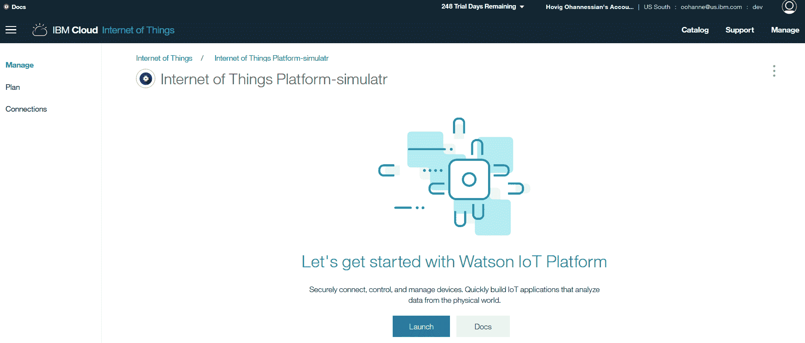

# 如何在 IBM Watson IoT Platform 中生成 API 密钥和令牌

> 原文：[`developer.ibm.com/zh/tutorials/iot-generate-apikey-apitoken/`](https://developer.ibm.com/zh/tutorials/iot-generate-apikey-apitoken/)

众所周知的物联网 (IoT) 这一概念，指的就是由能够相互通信的设备构成的网络。Watson IoT Platform 是一种 IBM Cloud 服务，能够帮助您将支持 IoT 的设备连接到 IBM Cloud。Watson IoT Platform 可以通过已注册的 IoT 设备执行各种任务，例如远程执行操作，实时收集数据或查找旧数据（使用 Historian 工具）。

## 学习目标

本教程演示了如何创建必要的 API 密钥和令牌，以便在 IBM Cloud 上 注册支持 IoT 的设备。API 密钥和 令牌为设备提供对 IBM Cloud 组织的 特定级别的委派访问权限。仅当创建了 API 密钥和令牌时， 注册的设备才能够与应用程序交互。

## 前提条件

在开始本教程之前，您需要以下内容：

*   一个 IBM Cloud 帐户。如果没有，可[注册一个帐户](https://console.bluemix.net/docs/admin/account.html#signup)
*   一个 Watson IoT Platform 实例，或者从 [IBM Cloud Services Catalog](https://console.bluemix.net/catalog/services/internet-of-things-platform/?env_id=ibm%3Ayp%3Aus-south) 创建一个
*   已向 Watson IoT Platform 注册的设备或网关。或者，注册您的[设备](https://developer.ibm.com/recipes/tutorials/how-to-register-devices-in-ibm-iot-foundation/)或[网关](https://developer.ibm.com/recipes/tutorials/how-to-register-gateways-in-ibm-watson-iot-platform/)，以便为平台创建 API 密钥和令牌。

## 预计花费时间

完成此操作指南大约需要 30 分钟。

## 步骤

### 使用 Watson IoT Platform 创建新的 API 密钥和令牌

让我们先来创建一个新的 API 密钥和令牌：

1.  进入 IBM Cloud，单击 `Launch` 打开 IoT 仪表板。

    

2.  在仪表板的左侧，转到 **Apps**。

    

3.  在 **`API Keys`** 选项卡中，单击 **`+ Generate API Key`** 按钮以生成新的 API 密钥和令牌。

    

    *   API 密钥示例：”a-organization_id-a84ps90Ajs”
    *   令牌示例：”MP$08VKz!8rXwnR-Q*”
4.  复制生成的 API 密钥和令牌，然后粘贴到空文件或空白笔记中，以便稍后使用。注意：API 密钥和令牌不可恢复。离开此页面后，您将无法再次查看。如果丢失，您始终可以创建新的 API 密钥和令牌进行替换。

    

5.  选择一个或多个 **API Role(s)**，或保持选中 **Standard Application**。有关其他详细信息，请参阅 [Watson IoT Platform 文档](https://console.bluemix.net/docs/services/IoT/roles_index.html#user-application-and-gateway-roles)。

    

6.  （可选）输入注释以标识 API 密钥和令牌的用途，或者设置 API 密钥和令牌将失效的到期日期。单击窗口底部的 **Generate** 按钮来完成该过程。

    

7.  现在已经创建了 API 密钥和令牌。API 密钥开头的 `a-` 代表应用程序。

    

### 在应用程序中使用 API 密钥和令牌

Watson IoT Platform 团队为许多流行编程语言提供客户端库。有关示例、文档和支持的功能，请参阅以下公共存储库：

*   [Node.JS](https://github.com/ibm-watson-iot/iot-nodejs)
*   [C++](https://github.com/ibm-watson-iot/iot-cpp)
*   [C Sharp](https://github.com/ibm-watson-iot/iot-csharp)
*   [Embedded C](https://github.com/ibm-watson-iot/iot-embeddedc)
*   [Java](https://github.com/ibm-watson-iot/iot-java)
*   [Node Red](https://github.com/ibm-watson-iot/iot-nodered)
*   [Python](https://github.com/ibm-watson-iot/iot-python)

可以在 Node.js 中创建一个简单的示例，其中包含几行代码：

```
var Client = require("ibmiotf");
var appClientConfig = {
    "org" : orgId,
    "id" : appId,
    "auth-key" : apiKey,
    "auth-token" : apiToken
};

var appClient = new Client.IotfApplication(appClientConfig); 
```

## 结束语

感谢您阅读本操作指南！我们希望您已经学会了如何为支持 IoT 的设备生成 API 密钥以在 IBM Cloud 上运行。

本文翻译自：[How to generate API key and token in IBM Watson IoT Platform](https://developer.ibm.com/tutorials/iot-generate-apikey-apitoken/)（2017-11-28）