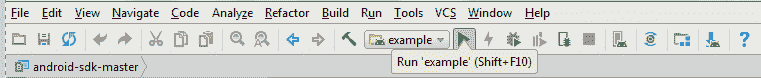

# 通过 Android Studio 中的 Watson Android SDK 构建应用程序

> 原文：[`developer.ibm.com/zh/tutorials/use-watson-android-sdk-in-android-studio/`](https://developer.ibm.com/zh/tutorials/use-watson-android-sdk-in-android-studio/)

IBM Watson 因为参加了美国知识问答节目 Jeopardy 而闻名，但这项技术远不只是简单的问题和答案。Watson 是全新的计算形式，承诺根据我们周围丰富的数据发现至今仍未发掘的洞察。传统的计算机模型依赖于严谨的数学原理，利用基于规则和逻辑构建的软件，而 Watson 则依赖于 IBM 所说的“认知计算”。IBM Watson 具有众多服务，包括 Assistant、Discovery、Personality Insights [等等](https://cloud.ibm.com/catalog/?taxonomyNavigation=apps&category=watson&cm_sp=ibmdev-_-developer-tutorials-_-cloudreg)。

Watson 团队还提供了多种软件开发工具包 (SDK)，帮助开发者将 Watson 与各种编程语言配合使用。[watson-developer-cloud](https://github.com/watson-developer-cloud/) GitHub 组织具有可用 SDK 的完整列表。

## 学习目标

学完本指南后，读者将会了解如何：

*   下载和安装 Watson Android SDK
*   将 Android Studio 与 Watson Android SDK 配合使用
*   在 Android Studio 中通过其服务凭证和 API 来利用 Watson 服务
*   构建并运行使用 Watson 的样本 Android 应用程序

## 前提条件

**免费试用 IBM Cloud**

利用 [IBM Cloud Lite](https://cocl.us/IBM_CLOUD_GCG) 快速轻松地构建您的下一个应用程序。您的免费帐户从不过期，而且您会获得 256 MB 的 Cloud Foundry 运行时内存和包含 Kubernetes 集群的 2 GB 存储空间。[了解所有细节](https://www.ibm.com/cloud/blog/announcements/introducing-ibm-cloud-lite-account-2)并确定如何开始。

要遵循本操作指南进行操作，您需要具备：

*   一个 IBM Cloud 帐户 – 如果您还没有帐户，可在此[注册](https://cocl.us/IBM_CLOUD_GCG)。
*   本地机器上安装的 [Android Studio](https://developer.android.com/studio/index.html)。
*   IBM Cloud 上已配置的 [Language Translator](https://cloud.ibm.com/catalog/services/language-translator?cm_sp=ibmdev-_-developer-tutorials-_-cloudreg) 服务。
*   IBM Cloud 上已配置的 [Speech to Text](https://cloud.ibm.com/catalog/services/speech-to-text?cm_sp=ibmdev-_-developer-tutorials-_-cloudreg) 服务
*   IBM Cloud 上已配置的 [Text to Speech](https://cloud.ibm.com/catalog/services/text-to-speech?cm_sp=ibmdev-_-developer-tutorials-_-cloudreg) 服务。

## 预估时间

完成本操作指南大约需要 1 小时。三十分钟用于完成必要的准备工作，另外三十分钟用于完成本指南。

## 步骤

*注意：*本操作指南已使用 Android Studio 3.0.1、Watson Android SDK V0.4.3 和 macOS High Sierra 进行了测试

### 下载 Watson Android SDK

浏览至 [Github 上的 Watson Android SDK](https://github.com/watson-developer-cloud/android-sdk)，单击 **Clone or Download** 按钮下载 ZIP 文件格式的存储库。

（可选）我们鼓励读者查看 Watson 团队所维护的 [watson-developer-cloud](https://github.com/watson-developer-cloud/) GitHub 组织，了解所有其他可用 SDK。

### 在 Android Studio 中创建新的 Watson Android SDK 项目

现在，我们将使用 Watson Android SDK 中的示例文件夹作为起点。

*   将新下载的 ZIP 文件（可能名为 `android-sdk.zip`）解压到新工作区文件夹中。
*   启动 Android Studio。
*   单击菜单栏中的 **File** > **Open**，并提供已解压文件的 `example` 文件夹。
*   Android Studio 现在将使用 [Gradle](https://gradle.org/) 构建项目

*注意*：如果您看到 `Install missing platform(s) and sync project` 错误或 `Install Build-Tools 26.0.1 and sync project` 错误，可单击提供的超链接安装缺失的平台或工具。安装完成后，该构建应重新启动并成功完成。


### 浏览样本应用程序

我们现在来看下 SDK 中提供的样本应用程序。具体来说，让我们打开 `MainActivity.java` 文件，它位于 `example > java > com.ibm.watson.developer_cloud.android.myapplication > MainActivity` 下。

您可在此看到已为样本应用程序导入了许多库。要使用其他可用库，可如下所示导入这些库：

单击 `import ...` 展开文件顶部的导入部分，即可看到 `MainActivity.java` 中使用的各种导入内容。注意 `watson_developer_cloud` 包所使用的导入，该包即 Watson Android SDK。要快速查看可用的其他 Watson 服务的完整列表，可输入 `import com.ibm.watson.developer_cloud.`，自动补全功能会显示可用服务。


现在，我们来看下 `activity_main.xml`，它位于 `example > res > layout > activity_main.xml` 下。此 XML 文件包含 `MainActivity.java` 的布局。双击 `activity_main.xml` Android Studio 将会自动生成该应用程序活动的设计样本。您还可单击位于选项卡左下角的 **Text** 来编辑此设计，查看所编写的 XML 文件。


最后，让我们来看下 `credentials.xml`，它位于 `example > res > values > credentials.xml` 下。此 XML 文件包含模板，用于为应用程序使用的各种 Watson 服务提供凭证。在此示例中，使用了三种不同的 Watson 服务：Watson Language Translator、Speech to text 和 Text to Speech。此 XML 文件中的每个值均包含一个资源名称，随后可从 `MainActivity.java` 引用此名称。


### 向 credentials.xml 添加服务凭证

现在，我们将每个 Watson 服务的凭证都复制并粘帖到 `credentials.xml` 中。参阅先前的*前提条件*部分，获取有关如何创建特定 Watson 服务的说明。

要查找服务凭证的值，可登录 IBM Cloud 并在仪表板中查找服务，选中服务后，转至 **Service Credentials** 选项卡。下图即 Language Translator 服务的 **Service Credentials** 选项卡。


将每个服务的 `url`、`username` 和 `password` 复制并粘帖到 Android Studio 中的 `credentials.xml`，如下所示。对其他服务执行相同操作。


### 构建并运行应用程序

#### 构建应用程序

为全部三项 Watson 服务（Language Translator、Speech to Text 和 Text to Speech）提供凭证后，即可构建并运行项目。我们可以通过连接的设备运行应用程序，也可以先构建 APK，然后将其传输至手机，以便手动安装。让我们来分别试试这两种方法。

#### 将应用程序传输至连接的设备

在连接的设备上运行 Android 项目，是一种有效的项目调试方法。它需要在移动设备和 Android Studio 上都安装相关驱动程序。它还需要用户在移动设备上启用开发者模式。

首先必须[在 Android Studio 上下载并安装 Google USB 驱动程序](https://developer.android.com/studio/run/win-usb.html)。须注意，如果您正在 macOS 或 Linux 上进行开发，那么**无需**安装 USB 驱动程序，而是参考[使用硬件设备](https://developer.android.com/studio/run/device.html)。

在某些情况下，还需要其他驱动程序。创建本指南时，在运行 Android V7.0 的 Samsung Galaxy S8+ 上进行了测试，这种情况下，我们必须[在 Windows 上为 Samsung 安装 USB 驱动程序](http://developer.samsung.com/galaxy/others/android-usb-driver-for-windows)。

最后，要将我们的设备用作为连接的调试设备，需要完成的最后一步就是启用 USB 调试。为此，我们需要启用“开发者模式”。先进入设备的**设置**，选择**关于手机**，然后选择**软件信息**，并点击七 (7) 次**版本号**。现在转至**设置**，这将显示新菜单**开发者选项**，启用 **USB 调试**继续操作。

现在，我们即可在连接的设备上运行并调试项目了。只需单击 Android Studio 菜单栏中的 **Play** 按钮即可，如以下截屏中所示：



您应该会在 **Select Deployment Target** 对话框中看到连接的设备，如下图所示。


单击 **OK**，即可开始在连接的设备上构建并运行该项目。

#### 生成并安装 APK

要将应用程序作为 APK 进行安装，必须先生成 APK。为此，转至 **Build** 并选择 **Build APK**。Android Studio 将开始构建项目并生成 APK。此过程完成后，您可单击 **Event Log** 中的 `Show in Explorer` 转至 APK 所在位置，如下图所示。


通过您喜欢的任何方式（电子邮件、SD 卡、Google Drive 等），将此 APK 文件传输到移动设备上。在移动设备上打开文件资源管理器，并浏览至传输的 APK 所在位置。打开该 APK 文件。Android 可能会提示您允许从未知来源安装，确认此选择后，应用程序将开始在您的手机上进行安装。

#### 运行应用程序

在以下截屏中，使用 *Watson Language Translator* 服务翻译了一个样本文本。您可以选择文本翻译的目标语言。


您还可以通过 *Watson Speech to Text* 服务，使用麦克风记录自己的输入。要执行此操作，可单击文本框旁的麦克风按钮，说几句话，然后再次单击该按钮以停止录音。您还可单击播放按钮，收听使用 *Watson Text to Speech* 服务转换的文本。

### 了解后端和 API 调用

在本节中，我们将介绍如何翻译输入以及如何调用 API 以将文本翻译为所选语言。我们将查看 `LanguageTranslator` API 调用案例。

首先执行以下操作来导入 Language Translator 分类：

```
import com.ibm.watson.developer_cloud.language_translator.v2.LanguageTranslator; 
```

现在，执行以下操作来创建该分类的实例：

```
private LanguageTranslator translationService; 
```

我们需要使用凭证对其进行初始化。注意使用 `username`、`password` 和 `endpoint`/`url`：

```
private LanguageTranslator initLanguageTranslatorService() {
LanguageTranslator service = new LanguageTranslator();
String username = getString(R.string.language_translator_username);
String password = getString(R.string.language_translator_password);
service.setUsernameAndPassword(username, password);
service.setEndPoint(getString(R.string.language_translator_url));
return service;
} 
```

现在，我们将看到 Translate 按钮后端所执行的操作。当用户单击 Translate 按钮时，会调用以下函数：

```
translate.setOnClickListener(new View.OnClickListener() {

@Override
public void onClick(View v) {
    new TranslationTask().execute(input.getText().toString());
    }
}); 
```

单击事件会调用 TranslationTask() 以通过以下代码实现 AsyncTask：

```
private class TranslationTask extends AsyncTask<String, Void, String> {

@Override
protected String doInBackground(String... params) {
    showTranslation(translationService.translate(params[0], Language.ENGLISH, selectedTargetLanguage).execute()
        .getFirstTranslation());
    return "Did translate";
    }
} 
```

如果您仔细查看此后台异步任务，会发现在该函数中调用了一个 API 来设置翻译文本，如下所示：

```
translationService.translate(params[0], Language.ENGLISH, selectedTargetLanguage).execute()
.getFirstTranslation() 
```

这调用了 Language Translator 服务，我们在此提供 1) 输入文本，2) 其输入语言（默认情况下设置为 English），以及 3) 所选目标语言。

此 Translator API 调用会以字符串格式返回翻译结果，即当前提供给函数 `showTranslation(final string translation)` 的结果，如下所示：

```
private void showTranslation(final String translation) {
runOnUiThread(new Runnable() {
    @Override
    public void run() {
    translatedText.setText(translation);
    }
});
} 
```

由于 `showTranslation` 函数位于另一个线程上，与 Translation API 调用分离，因此我们必须添加 `runOnUiThread` 以将其置于队列中，并在执行 Translation API 调用之后执行，同时设置返回的翻译文本。

其他 API 调用的运行方式与此类似。敬请参阅 Watson 服务文档及其 API 参考资料相关资源中提供的链接。

## 结束语

在本指南中，我们学会了如何：开始使用 Watson Android SDK、使用 Android Studio 和 Watson 服务构建样本应用程序，并且深入分析了代码库。请参阅资源中提供的链接，查看其他 SDK 和 Watson API 参考资料。谢谢阅读！

*   [Watson 可用 SDK](https://github.com/watson-developer-cloud)
*   [Watson Android SDK](https://github.com/watson-developer-cloud/android-sdk)
*   [Watson 服务文档和 API 参考资料](https://cloud.ibm.com/developer/watson/documentation?cm_sp=ibmdev-_-developer-tutorials-_-cloudreg)

本文翻译自：[Build an application with the Watson Android SDK in Android Studio](https://developer.ibm.com/tutorials/use-watson-android-sdk-in-android-studio/)（2018-01-03）