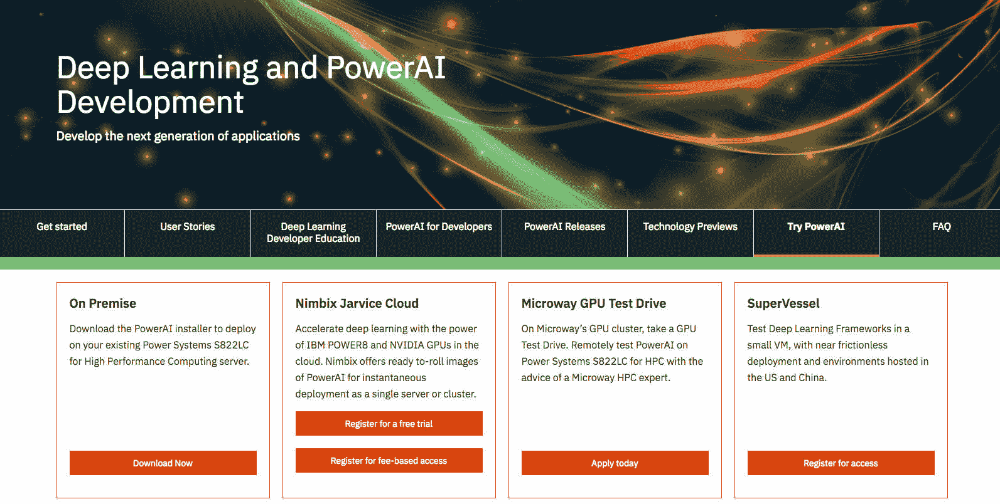
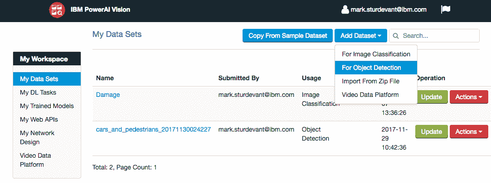
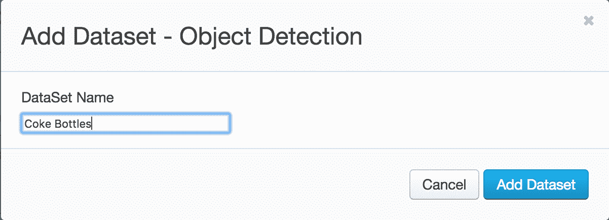
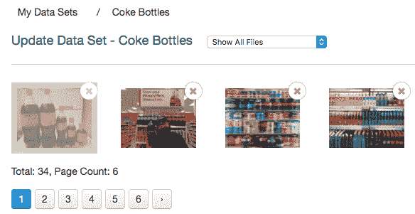
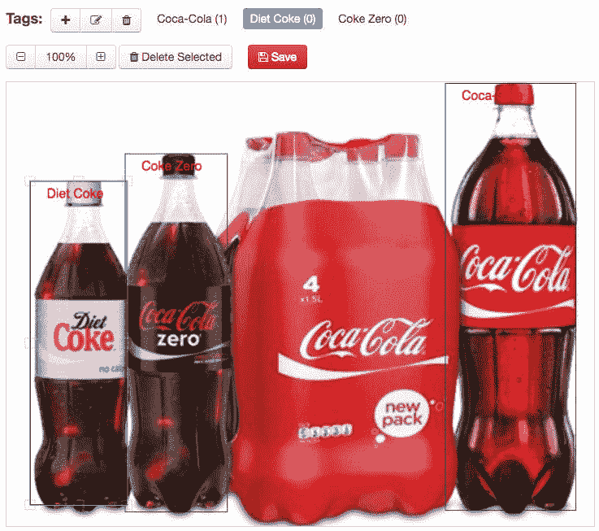
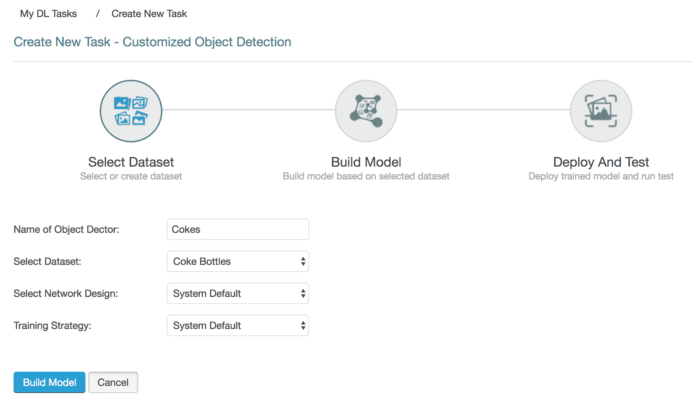
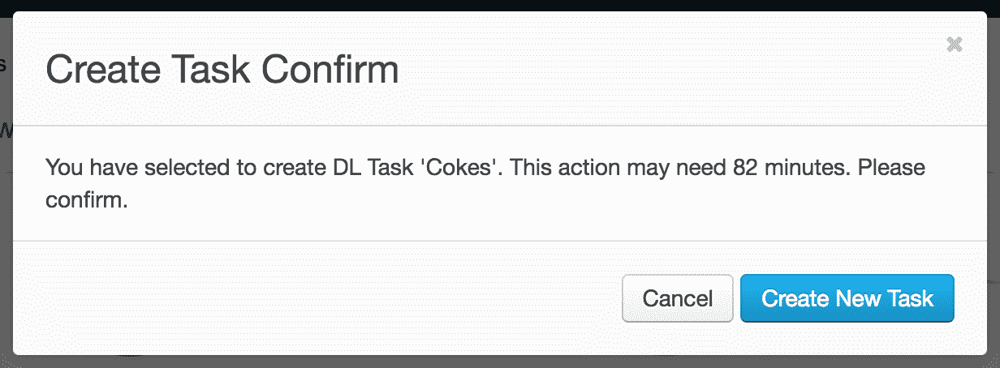
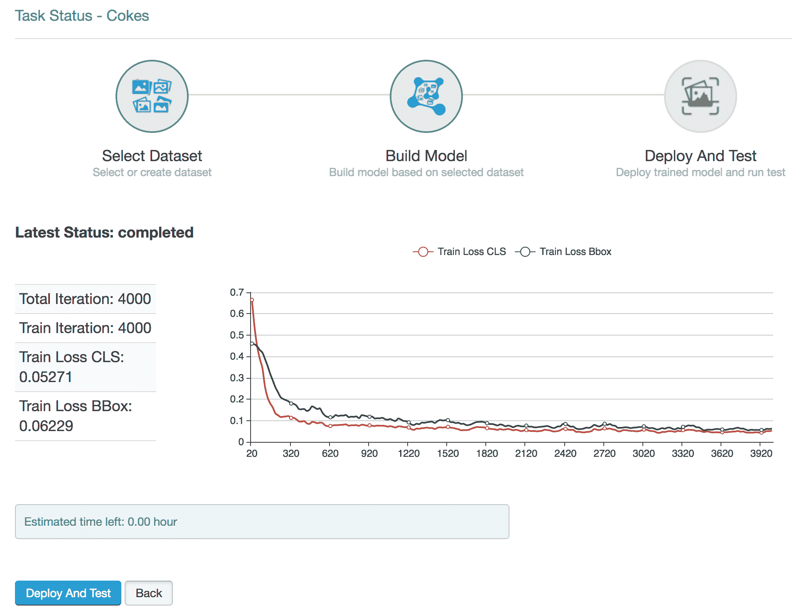
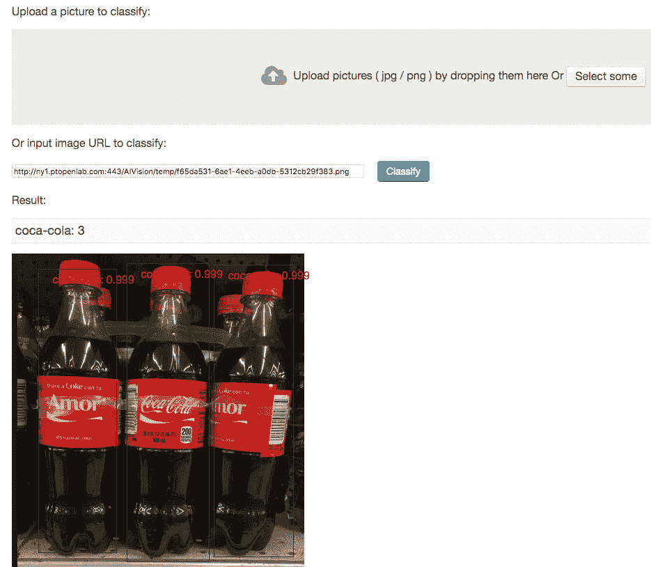

# 使用 IBM Maximo Visual Inspection 检测对象

> 原文：[`developer.ibm.com/zh/tutorials/powerai-vision-object-detection/`](https://developer.ibm.com/zh/tutorials/powerai-vision-object-detection/)

开发者可以利用深度学习框架，构建计算机视觉和对象检测应用。通过使用 IBM Maximo Visual Inspection 来训练和部署您的模型，无需专业知识，且省时省力。Maximo Visual Inspection 提供了一个 UI，您无需具备任何深度学习知识，即可在此训练、部署和测试自己的对象检测模型。

在此操作指南中，您将学习如何使用 Maximo Visual Inspection UI 将示例图像转变为可用于对象检测应用的 REST 端点。

截止 2017 年 12 月，Maximo Visual Inspection 提供了技术预览版，该预览版可以安装在 Power Systems 上，也可以在云端通过试用帐户来使用。

*注意：此操作指南编写时采用的是 Maximo Visual Inspection 技术预览版 v3.0。*

## 学习目标

本教程的目标是向您展示对象检测的深度学习基础知识，同时演示如何利用 Maximo Visual Inspection UI 来及其轻松地进行对象检测。这种实践方法旨在完成以下目标：

*   创建并标记一个用于对象检测的数据集
*   基于该数据集训练和部署模型
*   通过 REST 调用来测试该模型

框架搭建、利用 GPU 计算能力和提供您的模型作为 REST 端点的详细信息大都处于隐藏状态，因为这些都是由 Maximo Visual Inspection 来处理的。

最终结果就是一个随时可用的定制对象检测 API。

## 前提条件

*   **示例图像集合**：您可以选择自己的图像 集合。应记住对象检测用例。您需要了解用例在 以下一方面或两方面的信息：

    *   图像中的目标对象位于何处？
    *   图像中的目标对象数量有多少？

    在示例图像中，您将看到我们已经收集了可乐瓶的 图像。这样即可创建应用来计算瓶子数量 及其位置。

*   **对 Maximo Visual Inspection 的预览访问权**：访问 [试用 Power AI](https://developer.ibm.com/linuxonpower/deep-learning-powerai/try-powerai/)， 使用 `On Premise` 下载安装程序以在您的 Power Systems 上部署预览版，或者使用 `SuperVessel` 并注册访问 SuperVessel 云，您可以在该云中试用预览版。

    

*注意：此操作指南中的步骤和示例假定您使用的是 SuperVessel。*

## 预估时间

交互步骤耗时不超过一小时，但训练任务可能需要超过一小时才能完成（预计 90 分钟，具体时间因您的数据集和其他因素而异）。您可根据情况制定相应的计划，开始练习、中途休息，稍后再完成练习。

## 步骤

1.  登录到 Maximo Visual Inspection
2.  创建数据集
3.  创建标签并标记对象
4.  创建深度学习任务
5.  部署并测试

### 登录到 Maximo Visual Inspection

如果使用的是 SuperVessel，请通过以下地址登录：[`developer.ibm.com/linuxonpower/deep-learning-powerai/vision/access-registration-form/`](https://developer.ibm.com/linuxonpower/deep-learning-powerai/vision/access-registration-form/)

### 创建数据集

Maximo Visual Inspection Object Detection 可发现并标记图像中的对象，支持用户和开发者根据定制训练对图像内的对象实例进行计数。

通过以下操作为对象检测训练创建新数据集：

*   在 `My Data Sets` 视图中，单击 `Add Dataset` 按钮，然后在下拉列表中选择 `For Object Detection`。

    

*   为数据集提供名称，然后单击 `Add Dataset`。

    

*   使用拖放功能或 `Select some` 来上传一个或多个图像。您可以使用 zip 文件或者使用多选一次性上传多个文件。如果要下载可乐瓶示例数据集，可[单击此处](https://github.com/IBM/powerai-vision-object-detection/raw/master/data/coke_bottles.zip)。

    

    *注意：如果您使用的是自己的 zip 文件，并且上传后看不到文件缩略图，那么表示上传失败。文件名应使用不含特殊字符或空格的小写字母。您还可以上传单个文件或者一次性多选几个文件，以确定导致上传失败的文件。*

### 创建标签并标记对象

*   单击 `+` 图标添加新标签，以便创建一个或多个标签。每个标签都根据特定用例表示图像内的训练对象。

*   选择标签并框选图像中的对象来标记每个图像中的对象。对每个图像完成操作后都按 `Save`。

*   针对所有标签和图像重复此过程。

    

    *提示：使用 `Only Show Unlabeled Files` 下拉列表来帮助您确定自己是否已完成操作。*

*   单击 `Export As Zip File` 以保存工作副本。现在您已花了些时间进行标记，此 zip 可用于从头开始而不会丢失工作进度。

### 创建深度学习任务

*   单击 My Workspace 下的 `My DL Tasks`，然后单击 `Create New Task` 按钮。单击 `Object Detection`。

*   为 Object Detector 命名，确保已选中您的数据集，然后单击 `Build Model`。

    

*   将显示一个确认对话框，其中给出了预计所需时间。 单击 `Create New Task` 开始操作。

    

### 部署和测试

*   构建模型后，单击 `Deploy and Test`。

    

*   在 Maximo Visual Inspection UI 中测试模型。使用 `Select some` 来选择测试图像。结果会显示检测到的对象数量，并且显示带有边框、标签和置信度评分的图像。

    

*   通过命令行，您可使用图像文件和 `curl` 命令来测试部署的 REST 端点。注意，输出 JSON 会显示检测到多个瓶子，并提供每个瓶子的置信度、标签和位置。

    *警告：为方便起见，此示例使用了 `--insecure`。*

    ```
    $ curl --insecure -i -F files=@coke_bottle_23.png https://ny1.ptopenlab.com/AIVision/api/dlapis/9f9d6787-0183-4a1b-be49-751b6ca16724
    HTTP/1.1 100 Continue

    HTTP/1.1 200 OK
    Server: nginx/1.9.13
    Date: Thu, 14 Dec 2017 21:58:26 GMT
    Content-Type: application/json
    Content-Length: 508
    Connection: keep-alive
    Access-Control-Allow-Origin: *
    Access-Control-Allow-Headers: origin, content-type, accept, authorization
    Access-Control-Allow-Credentials: true
    Access-Control-Allow-Methods: GET, POST, PUT, DELETE, OPTIONS, HEAD
    Access-Control-Allow-Origin: *

    { "classified" : [ { "confidence" : 0.9986369013786316 , "ymax" : 578 , "label" : "coca-cola" , "xmax" : 755 , "xmin" : 588 , "ymin" : 29} , { "confidence" : 0.9954010248184204 , "ymax" : 592 , "label" : "coca-cola" , "xmax" : 601 , "xmin" : 437 , "ymin" : 10} , { "confidence" : 0.8161203265190125 , "ymax" : 567 , "label" : "coca-cola" , "xmax" : 426 , "xmin" : 259 , "ymin" : 17}] , "imageUrl" : "http://ny1.ptopenlab.com:443/AIVision/temp/5a26dd3b-d8ba-4e01-8b93-5a43f28e97c7.png" , "result" : "success"} 
    ```

## 结束语

现在您已了解了深度学习技术如何从标记的示例图像中学习，并创建对象检测 API。由于您已创建了以 JSON 格式返回结果的 REST 端点，因此它非常便于在任何应用中使用。

Maximo Visual Inspection 简化了所有操作，并利用 GPU 计算能力加速了训练进程。

对象检测的准确性将取决于所提供的示例。用于试验的数据集大部分情况下都太小，无法提供生产级结果。训练需要时间和良好的训练数据。您可以增大自己的数据集，进而改进结果。

本文翻译自：[Detect objects with Maximo Visual Inspection](https://developer.ibm.com/tutorials/powerai-vision-object-detection/)（2017-12-22）