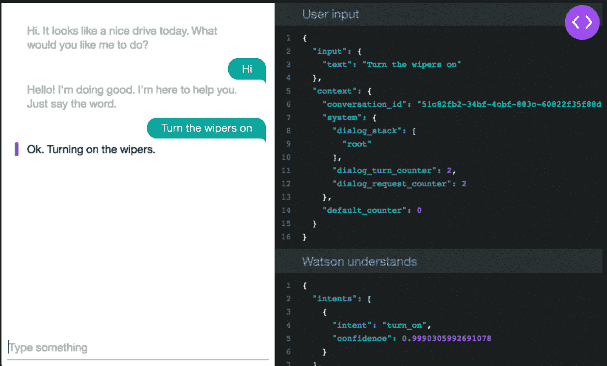
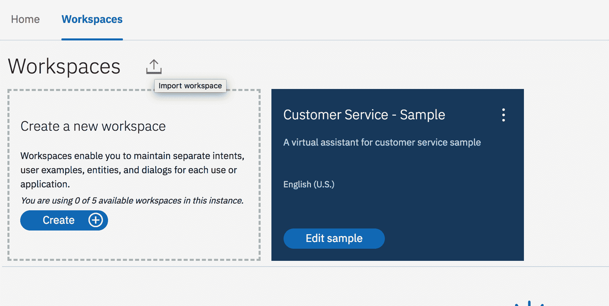
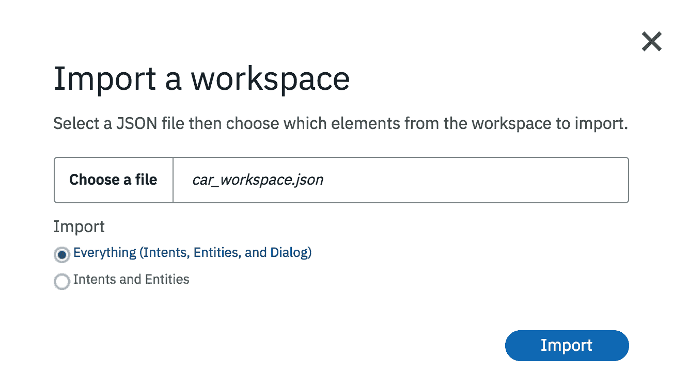
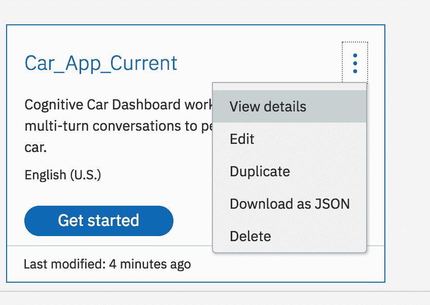
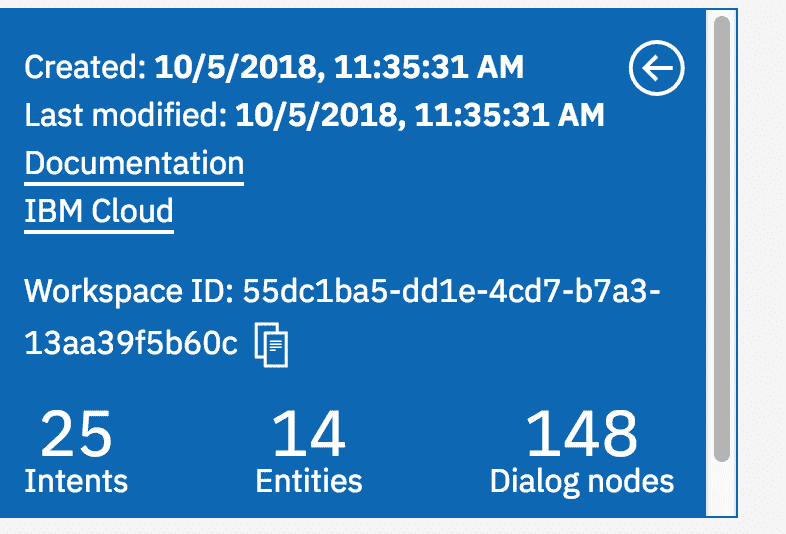
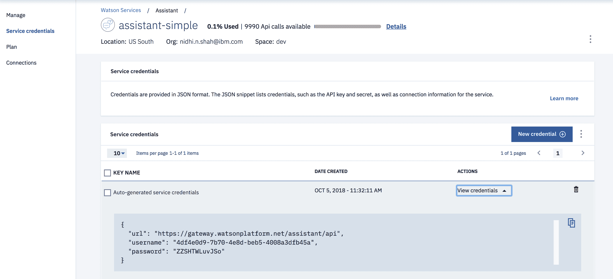
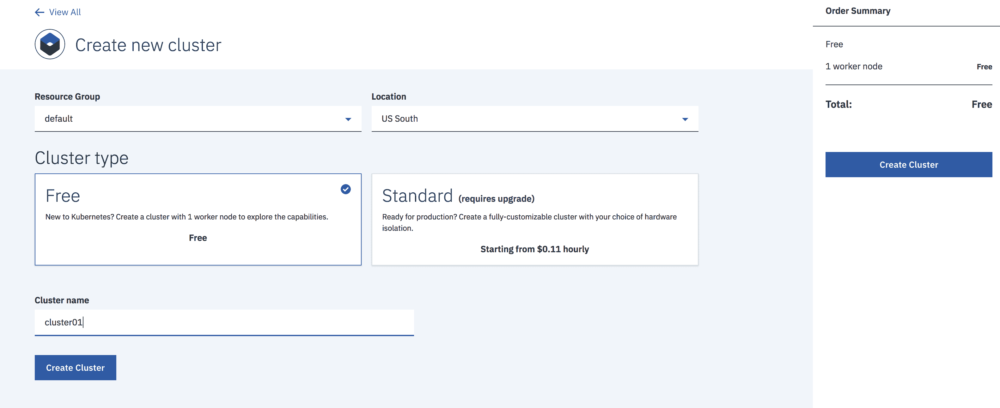
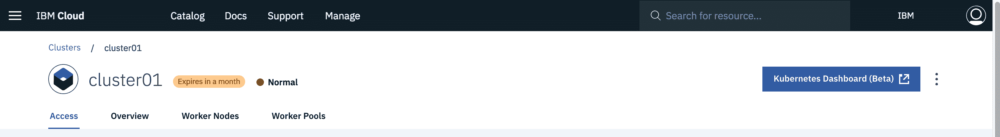

# 设置您自己的聊天机器人实例并部署至 IBM Cloud 上的 Kubernetes 环境

> 原文：[`developer.ibm.com/zh/tutorials/set-up-your-own-instance-of-a-chatbot-and-deploy-it-to-the-kubernetes-environment-on-ibm-cloud/`](https://developer.ibm.com/zh/tutorials/set-up-your-own-instance-of-a-chatbot-and-deploy-it-to-the-kubernetes-environment-on-ibm-cloud/)

**免费试用 IBM Cloud**

利用 [IBM Cloud Lite](https://cocl.us/IBM_CLOUD_GCG) 快速轻松地构建您的下一个应用程序。您的免费帐户从不过期，而且您会获得 256 MB 的 Cloud Foundry 运行时内存和包含 Kubernetes 集群的 2 GB 存储空间。[了解所有细节](https://www.ibm.com/cloud/blog/announcements/introducing-ibm-cloud-lite-account-2)并确定如何开始。

[IBM Watson Assistant](https://cloud.ibm.com/docs/services/assistant?topic=assistant-index#index&cm_sp=ibmdev-_-developer-tutorials-_-cloudreg) 是一个强大的平台，支持您协作构建对话式人工智能 (AI) 解决方案。它的图形化 UI、强大的自然语言处理和熟悉的开发者功能，支持快速创建一切内容，从简单的聊天机器人到复杂的企业级客户服务解决方案等皆涵盖在内。

[Kubernetes](https://kubernetes.io/) 是一个开源项目，可在多种不同环境内运行，从笔记本电脑到高可用性多节点集群，从公共云到本地部署，以及从虚拟机到裸机都不在话下。

## 为何使用 Watson 服务创建的应用适合在 Kubernetes 中部署

Kubernetes 托管产品可提供强大的工具、直观的用户体验和内置的安全功能，以便快速交付应用程序，供您绑定到 IBM Watson 相关的云服务。作为经过认证的 Kubernetes 提供商，IBM Cloud Kubernetes Service 可提供智能调度、自我修复、横向扩展、服务发现和负载均衡、自动部署和回滚以及密钥和配置管理功能。此 Kubernetes Service 还具备适用于简化集群管理、容器安全性和隔离策略的高级功能，您可自行设计集群，并且具有集成操作工具，用于实现部署一致性。

本教程将为您提供分步说明，介绍如何设置自己的使用 Watson 服务的聊天机器人实例 ([Cognitive Car Dashboard](https://watson-assistant-demo.ng.bluemix.net/))，并使用 IBM Cloud Developer Tools 命令行界面将其部署至 IBM Cloud 上的 Kubernetes 环境，从而精简部署流程。

## Watson Assistant 样本应用程序

此 Node.js 应用在模拟 Cognitive Car Dashboard 的简单交谈界面中演示了 Watson Assistant 服务。



## 您将学到的知识

*   如何使用 IBM Watson Assistant 服务创建 Cognitive Car Dashboard 应用
*   如何将应用打包为一个 Docker 容器
*   如何在 IBM Cloud Kubernetes Service 环境中创建 Kubernetes 集群
*   如何将 Cognitive Car Dashboard 应用部署到 IBM Cloud Kubernetes Service 集群

## 前提条件

在开始之前，您需要具备：

*   一个 [IBM Cloud 帐户](https://cocl.us/IBM_CLOUD_GCG)
*   [Git](https://git-scm.com/downloads)
*   [Node](https://nodejs.org/en/)

## 克隆或下载 Watson Assistant 应用程序

**注意**：本教程中使用了 Watson Assistant 样本应用。您可以使用自己选择的 Watson Assistant 工作区。

`git clone https://github.com/watson-developer-cloud/assistant-simple`

## 配置应用程序

1.  登录到您的 [IBM Cloud 帐户](https://cocl.us/IBM_CLOUD_GCG)。

2.  创建 [Watson 工作区](https://cloud.ibm.com/catalog/services/watson-assistant?cm_sp=ibmdev-_-developer-tutorials-_-cloudreg)。

3.  启动工具。

4.  单击 Watson Assistant 服务工具中的 **Import workspace** 图标，并在应用项目的本地副本中指定工作区 JSON 文件的位置：`<project_root>/training/car_workspace.json`

    

    

5.  确保您位于工作目录中：`cd assistant-simple`.

6.  创建一个 .env 文件： `cp .env.example .env`.

7.  打开 .env 文件，并在文件中添加所需的环境变量。单击 **View Details** 即可获得 **Workspace ID**。复制 Workspace ID，并将其粘贴到 .env 文件中的 Workspace ID 下。

    

    

8.  单击 **Show** 以查看 Service Credentials。复制 `apikey` 值，如果服务实例未提供 `apikey`，那么复制 `username` 和 `password` 值。同时还复制 `url` 值。将这些值粘贴到 .env 文件中。保存此文件并将其关闭。

    

### .env 文件示例

```
# Environment variables
WORKSPACE_ID=55dc1ba5-dd1e-4cd7-b7a3-13aa39f5b60c
# You need to provide either username and password
ASSISTANT_USERNAME=4df4e0d9-7b70-4e8d-beb5-4008a3dfb45a
ASSISTANT_PASSWORD=ZZSHTWLuvJSo
# OR IAM API key and URL
ASSISTANT_IAM_APIKEY=
ASSISTANT_IAM_URL=
ASSISTANT_URL=https://api.us-south.assistant.watson.cloud.ibm.com/api 
```

## 将应用程序部署至 IBM Cloud Kubernetes Service

1.  确保您位于工作目录中：`cd assistant-simple`.

2.  确保您已登录到 IBM Cloud 和 IBM Cloud Container：`ibmcloud login`.对于单点登录，使用 `ibmcloud login --sso`。

3.  登录到容器注册表服务：`ibmcloud cr login`.

4.  创建 Dockerfile，用于为本地 ibmcloud dev build/run 和远程 ibmcloud 开发部署创建 Docker 镜像：`vi Dockerfile`.

    **注意：**您可以使用任意 cli 命令来创建文件。此文件无扩展名。

5.  将以下代码粘贴到 Dockerfile 中并保存更改。

    ```
    FROM node:6-alpine
    ADD ./app
    RUN cd /app; npm install

    ENV NODE_ENV production
    ENV PORT 8080
    EXPOSE 8080

    WORKDIR "/app"
    CMD [ "npm", "start" ] 
    ```

6.  如果还没有 [Docker 引擎](https://www.docker.com/products/docker-engine#/download)，安装该引擎。

7.  确定您是否正在运行 Docker 引擎：`docker version`.

    如果收到以下错误，那么您必须检查自己的安装：

    ```
    ERRO[0005] failed to dial gRPC: cannot connect to the Docker daemon.Is 'docker daemon' running on this host?: dial unix /var/run/docker.sock: connect: no such file or directory context canceled 
    ```

8.  运行以下命令，查找您的容器注册表名称空间：`ibmcloud cr namespaces`。

9.  如果没有名称空间，使用以下命令创建一个名称空间：`ibmcloud cr namespace-add <name>`。

10.  运行以下命令识别容器注册表：`ibmcloud cr info`（例如，registry.ng.bluemix.net）。

11.  通过运行以下命令，并将 REGISTRY 和 NAMESPACE 替换为相应的值，构建并标记 (-t) Docker 镜像。

    ```
    docker build .-t <REGISTRY>/<NAMESPACE>/myapp:v1.0.0` (Example: `docker build .-t registry.ng.bluemix.net/mynamespace/myapp:v1.0.0`) 
    ```

12.  将 Docker 镜像推送到 IBM Cloud 上的容器注册表：`docker push <REGISTRY>/<NAMESPACE>/myapp:v1.0.0`。

13.  创建 [Kubernetes 集群](https://cloud.ibm.com/kubernetes/catalog/cluster?cm_sp=ibmdev-_-developer-tutorials-_-cloudreg)（有关更多详细信息，可参阅[在 IBM Cloud 中创建 Kubernetes 集群](https://cloud.ibm.com/docs/containers?topic=containers-getting-started#container_index)）。选择 **Cluster Type – Free**，为集群提供唯一名称，并单击 **Create Cluster**。

    

    这需要一些时间。如果您看到以下图像，表明已准备就绪，可供使用：

    

14.  按照 **Access** 选项卡中的说明来设置 `kubectl` CLI。

15.  确保您位于自己的工作目录中：`cd assistant-simple`.

16.  创建名为 **kubernetes** 的文件夹：`mkdir kubernetes`.

17.  创建 deployment.yaml 文件：`vi deployment.yaml`，复制并粘贴以下代码：

    **注意**：如果使用其他 Watson Assistant 应用，那么必须在 deployment.yaml 文件中替换 Watson Assistant 应用的名称。

    ```
    # Update <REGISTRY> <NAMESPACE> values before use
    apiVersion: apps/v1
    kind: Deployment
    metadata:
    name: assistant-simple
    labels:
      app: assistant-simple
    spec:
    replicas: 1
    selector:
      matchLabels:
        app: assistant-simple
    template:
      metadata:
        labels:
          app: assistant-simple
      spec:
        containers:
        - name: assistant-simple
          image: <REGISTRY>/<NAMESPACE>/myapp:v1.0.0
          ports:
          - containerPort: 8080
          imagePullPolicy: Always 
    ```

18.  创建部署：`kubectl create -f kubernetes/deployment.yaml`。

19.  使用工作节点 IP 和 NodePort 创建服务：`kubectl expose deployment assistant-simple --type NodePort --port 8080 --target-port 8080`。

    **注意** 如果您使用其他 Watson Assistant 应用，使用您的 Watson Assistant 应用名称来代替 `assistant-simple`。

## 访问应用程序

1.  验证 pod 的状态是否为 RUNNING：`kubectl get pods -l app=assistant-simple`。

    **注意** 如果您使用其他 Watson Assistant 应用，使用您的 Watson Assistant 应用名称来代替 `assistant-simple`。

    它应类似如下：

    ```
    NAME                                READY     STATUS    RESTARTS   AGE
    assistant-simple-58b5f4688f-twztt   1/1       Running   0          2m 
    ```

2.  访问聊天机器人应用程序：

    1.  使用 `ibmcloud cs workers YOUR_CLUSTER_NAME` 识别您的工作节点公共 IP。
    2.  使用 `kubectl describe service assistant-simple` 识别节点端口。

        **注意** 如果您使用其他 Watson Assistant 应用，使用您的 Watson Assistant 应用名称来代替 `assistant-simple`。

    3.  通过以下地址访问您的应用程序：`http://<WORKER-PUBLIC-IP>:<NODE-PORT>/`。

## 清理

使用以下命令进行清理。

`kubectl delete deployment,service -l app=assistant-simple`

## 结束语

本教程向您介绍了在 IBM Cloud Kubernetes Service 环境中部署聊天机器人的流程。通过将 Watson Assistant 与 IBM Cloud Kubernetes Service 相结合，您可帮助团队实现 24/7 式全天候客户互动。我建议您在 IBM Cloud Kubernetes Service 环境中使用至少三个工作节点来扩展自己的 Watson 服务应用程序，使其更加可靠。我从一个节点开始着手，但具有更多节点意味着该应用可以处理流量上的波动。从头开始部署并牢记高可用性至关重要。

本文翻译自：[Set up your own instance of a chatbot and deploy it to the Kubernetes environment on IBM Cloud](https://developer.ibm.com/tutorials/set-up-your-own-instance-of-a-chatbot-and-deploy-it-to-the-kubernetes-environment-on-ibm-cloud/)（2018-11-01）