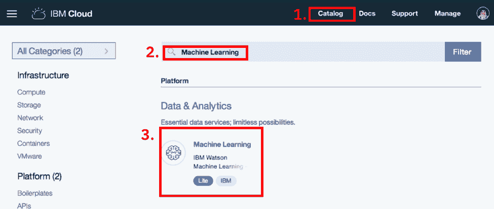
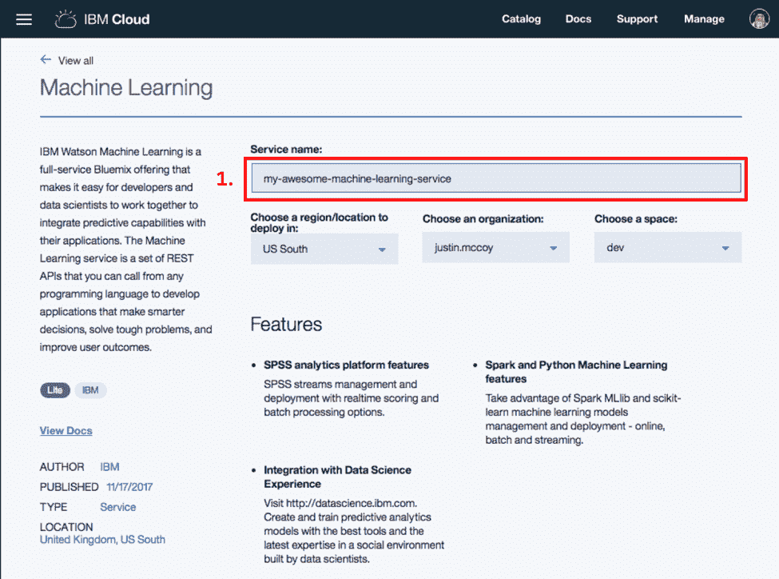
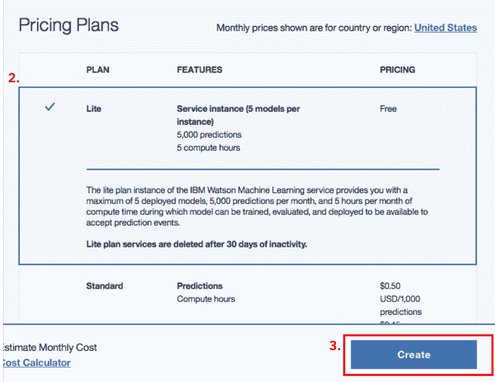
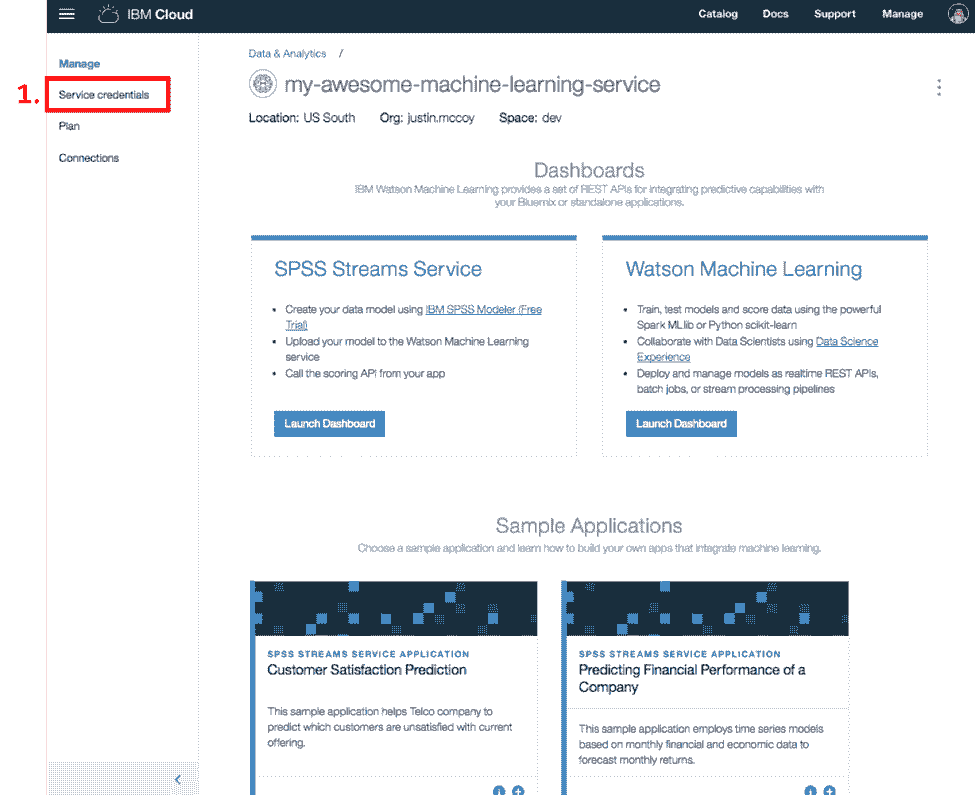
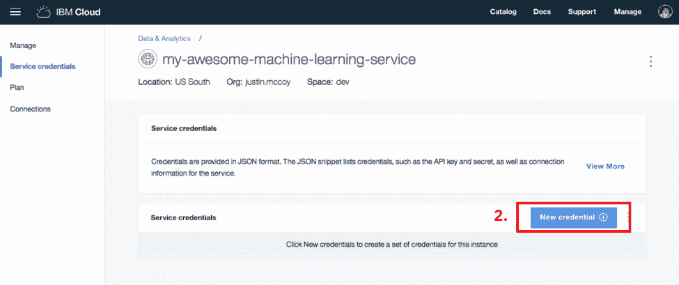
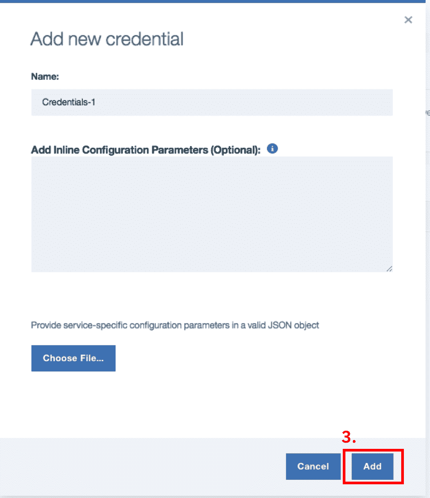
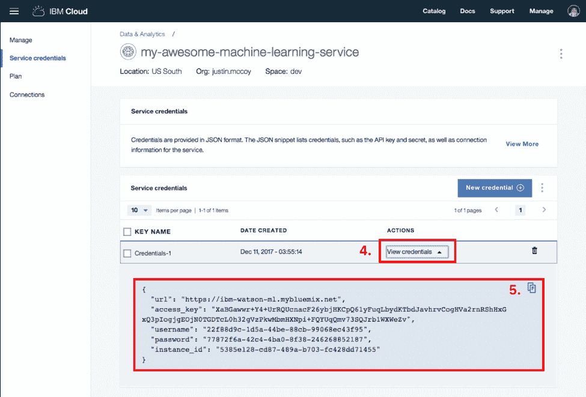

# 将机器学习洞察应用于生产

> 原文：[`developer.ibm.com/zh/tutorials/ml-into-production/`](https://developer.ibm.com/zh/tutorials/ml-into-production/)

作为非常智慧且能干的数据科学家，或者是努力适应 不同角色的新来乍到者，您训练了一个模型 用于对客户进行分类，又训练了另一个模型用于预测影响采购决定 的激励因素。您如何将这些洞察运用于生产当中？当今的 大部分指南和文档都聚焦于查找数据、清理数据和 训练模型，而将在生产中运用洞察这一繁重的工作 丢给了开发和基础架构团队。IBM 的 Watson Machine Learning 服务 支持您在开发环境中直接进行保存、部署和测试。

Watson Machine Learning 是一项云服务，可用于根据您的数据构建最适合的模块， 然后在线部署这些模型。它还支持 导入以 Spark MLLib 和 Scikit-Learn 编写的自定义模型， 也可以自动为您选择并训练模型。它将机器学习带到了公众视野中， 使不具备开发背景的任何人都可以 轻松部署模型。

## 学习目标

演示如何在 IBM 的机器学习即服务产品 Watson Machine Learning (WML) 上， 将经过训练的机器学习模型和管道部署到生产环境中。 在线部署后，您将具有一个处理 ML 模型的 自动缩放 API 端点，可供公众使用。

## 前提条件

一个经过训练的机器学习模型，使用以下任一受[支持的 框架](https://console.bluemix.net/docs/services/PredictiveModeling/pm_service_supported_frameworks.html#supported-frameworks)进行训练。

## 预估时间

创建 WML 服务、保存经过训练的模型、部署模型并 测试部署需耗时约 10-15 分钟。

## 步骤

**作为后起之秀，您训练了一个新 模型、评估了模型的准确性，并且希望将它迁移至生产环境。**

以下 6 个步骤将指导您完成 在生产环境中部署机器学习模型的整个过程：

1.  创建 Watson ML 服务
2.  创建一组凭证以使用该服务
3.  下载 SDK
4.  认证并保存模型
5.  部署模型
6.  调用模型

### 创建 Watson ML 服务

要开始操作，先创建 Watson ML 服务的新实例，用于 托管模型。使用 Watson ML 服务，它可从 IBM Cloud 免费获取。此 免费层为您提供了托管 5 个模型和 5000 次预测的服务； 就不需要付费的服务而言，这已不错了。 创建或登录 [IBM Cloud](https://cloud.ibm.com/login?redirect=%2Fregistraion%3Fcm_sp%3Ddwchina-cloud-_-cloudhome-_-bigtile&cm_sp=ibmdev-_-developer-tutorials-_-cloudreg) 帐户。

1.  登录后，选择右上角菜单中的 **Catalog**
2.  搜索“Machine Learning”服务
3.  选择显示的 **Machine Learning** 服务



在服务详细信息页面下，为您提供了概述、 对应于服务运行位置的部分配置选项，以及 定价套餐菜单。

*   为新机器学习服务命名
*   选择 **Lite Plan**
*   单击 **Create**





### 创建一组凭证以使用此服务

Watson Machine Learning 服务已创建完成， 您将转至包含新创建服务相关信息的面板。但在返回代码前， 我们需要创建一组凭证， 用于通过 SDK 或 HTTP API 调用向此服务进行认证。

1.  从左侧菜单中选择 *Service Credentials*
2.  选择 *New Credential*
3.  保留默认设置，并选择 *Add*
4.  查看 *New Credentials*
5.  将凭证复制到剪贴板并保存供稍后使用









### 下载 Python SDK

创建 Watson Machine Learning 服务并保存凭证后， 剩下的一切都可以通过编程方式来执行； 对于像我这样的开发者，现在就可以戴上耳机听音乐了。

`watson-machine-learning-client` 库还要求安装以下 任一库：`pyspark、scikit-learn、xgboost、mlpipelinepy` 和 `ibmsparkpipeline`；在此示例中，我使用的是 `scikit-learn`。此库的相关文档 位于 [`wml-api-pyclient.mybluemix.net/`](http://wml-api-pyclient.mybluemix.net/)

```
pip install watson-machine-learning-client scikit-learn 
```

### 认证并保存模型

使用您先前保存的凭证向 Watson Machine Learning 服务 进行认证。

```
from watson_machine_learning_client import WatsonMachineLearningAPIClient
wml_credentials = {
"url": "https://ibm-watson-ml.mybluemix.net",
"access_key": "*****",
"username": "*****",
"password": "*****",
"instance_id": "*****"
   }
client = WatsonMachineLearningAPIClient(wml_credentials) 
```

将机器学习管道和模型保存在 Watson Machine Learning 服务中。 重要的是在模型中包含管道，并且在执行任何预测之前先 转换数据。构建了管道之后， 通过对数据调用 fit 函数来保存模型

```
model = pipeline.fit(train_data) 
```

在开发环境内，您可通过对模型调用预测方法执行预测， 但这并不能轻松地 应用于生产部署。Watson Machine Learning 服务可在此 简化部署，只需将经过训练的模型保存并导出到 Watson Machine Learning 服务即可。

```
model_props = {"authorName":"IBM", "authorEmail":"ibm@ibm.com"}
model_artifact = client.repository.store_model(model, name="My Awesome Prediction Model", meta_props=model_props, training_data=train_data) 
```

这样就可以了，您的模型已保存， 通过调用 get_details 方法即可获取模型的详细信息。

```
print(json.dumps(client.repository.get_details(model_artifact.uid), indent=2)) 
```

### 部署模型

该模型已保存在 Watson Machine Learning 服务中，但在开始 执行预测前，需对其进行部署。 通过部署已保存的模型， 由 API 评分端点对其进行处理。

```
deployed_model  = client.deployments.create(model_artifact.uid, “Deployment of My Awesome Prediction Model”) 
```

显示新近部署模型的 API 端点以及已部署模型的 详细信息。

```
print(client.deployments.get_scoring_url(deployed_model)) 
```

### 调用模型

部署完模型后，可调用端点，在 HTTP 请求中 传递相关功能。 以下样本方法演示了如何构造一个 HTTP POST 请求，其中包含指定模型管道所需字段的 有效负载。

```
def get_prediction_ml(featureA, featureB, featureC, featureD):
scoring_url = client.deployments.get_scoring_url(deployed_model))
scoring_payload = { "fields":["FEATUREA","FEATUREB"," FEATUREC"," FEATURED],"values":[[ featureA,featureB, featureC, featureD]]}
header = {'authorization': 'Bearer ' + watson_ml_token, 'content-type': "application/json" }
scoring_response = requests.post(scoring_url, json=scoring_payload, headers=header)
return (json.loads(scoring_response.text).get("values")[0][18]) 
```

## 结束语

以上就是全部内容，只需短短几行代码即可获得具有管道的经过培训的 ML 模型， 并将其作为服务进行部署，且能够按需自动缩放。接下来， 如果您想将发掘的洞察快速运用于生产环境， 只需向该 Notebook 再添加几行代码，而不必再进行 容量规划工作、基础架构扩建，也不必配置网络以使用 API 来处理 您的模型。

虽然这一切适用于任何开发环境， 但借助 IBM 的 [Watson Studio](https://www.ibm.com/cn-zh/cloud/watson-studio) 这一基于云的数据科学 IDE， 这甚至能够进一步加以简化。这里的 Watson ML 集成了多种 开源工具，如 Juypter Notebooks、Zeppelin Notebooks，以及 围绕数据治理、协作与缩放的其他增强功能，从而简化了 数据科学和开发团队的工作流程。

本文翻译自：[Move your Machine Learning insights into production](https://developer.ibm.com/tutorials/ml-into-production/)（2018-01-04）