# Archived | 利用 Kubernetes 部署简单的 Python 应用程序

> 原文：[`developer.ibm.com/zh/tutorials/scalable-python-app-with-kubernetes/`](https://developer.ibm.com/zh/tutorials/scalable-python-app-with-kubernetes/)

**本文已归档**

**归档日期：:** 2021-01-07

此内容不再被更新或维护。 内容是按“原样”提供。鉴于技术的快速发展，某些内容，步骤或插图可能已经改变。

Kubernetes 推出已有数年（初始发行版可追溯至 2014 年 6 月），虽然其强大的功能早已为程序员社群所熟知并认可，但很多人仍然尚未使用。如果您还没有使用过 Kubernetes，这并不稀奇。我曾听闻一些开发者说过，让他们踌躇不前的原因包括：没有真正合适的指南可供使用（大量文章分散于多个网站，而不是集中于一处），或者他们对学习新事物感到畏惧。在本教程中，我将通过利用 Docker 构建 Python 应用程序并将其部署到 Kubernetes 服务这一基本理念，帮助您一定程度上化繁为简。

## 学习目标

完成本教程后，您将能够：

*   通过使用 Docker 实现 Flask 应用程序容器化，并将其部署至 IBM Cloud Kubernetes Service。

## 前提条件

**免费试用 IBM Cloud**

利用 [IBM Cloud Lite](https://cocl.us/IBM_CLOUD_GCG) 快速轻松地构建您的下一个应用程序。您的免费帐户从不过期，而且您会获得 256 MB 的 Cloud Foundry 运行时内存和包含 Kubernetes 集群的 2 GB 存储空间。[了解所有细节](https://www.ibm.com/cloud/blog/announcements/introducing-ibm-cloud-lite-account-2)并确定如何开始。

为完成本教程，您需要具备以下前提条件：

*   一个 IBM Cloud™ 帐户 -（[注册免费帐户](https://cocl.us/IBM_CLOUD_GCG)）

*   [IBM Cloud CLI](https://cloud.ibm.com/docs/cli?topic=cloud-cli-overview#getting-started)

*   [Docker CLI](https://docs.docker.com/install/)

*   [Kubernetes CLI](https://kubernetes.io/docs/tasks/tools/install-kubectl/)

## 预计花费时间

完成本教程大约需要 45 分钟。

## 步骤

### 创建 Kubernetes 集群

*   登录 [IBM Cloud Dashboard](https://cloud.ibm.com/dashboard/apps/?cm_sp=ibmdev-_-developer-tutorials-_-cloudreg)。
*   打开 **IBM Kubernetes Service**。

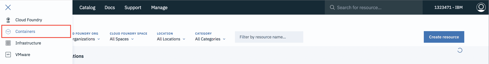

*   单击 **Create Cluster**。

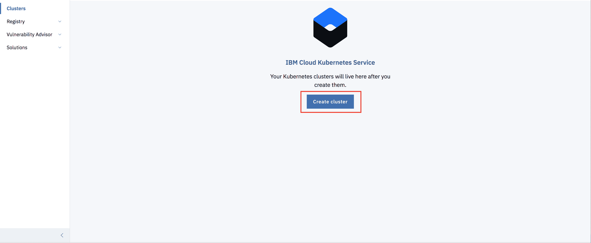

*   选择要部署集群的区域 (**Region**)，输入集群的名称 (**name**)，然后单击 **Create Cluster**。
*   根据您的帐户（**Paid 或 Free**），选择相应的集群类型。
*   集群需要一些时间才能准备就绪（约 30 分钟）。

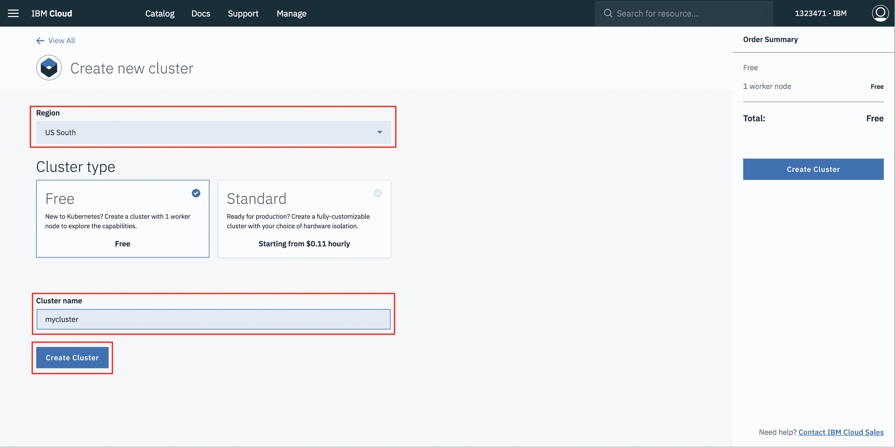

*   集群准备就绪后，单击集群名称，这样会将您重定向至包含集群和工作节点相关信息的新页面。

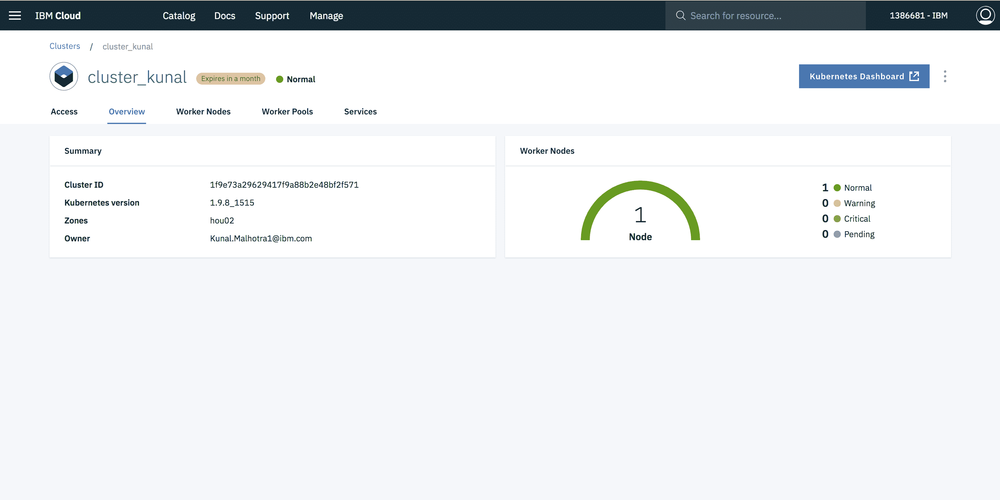

*   单击 **Worker Nodes** 选项卡以记录集群的公共 IP。

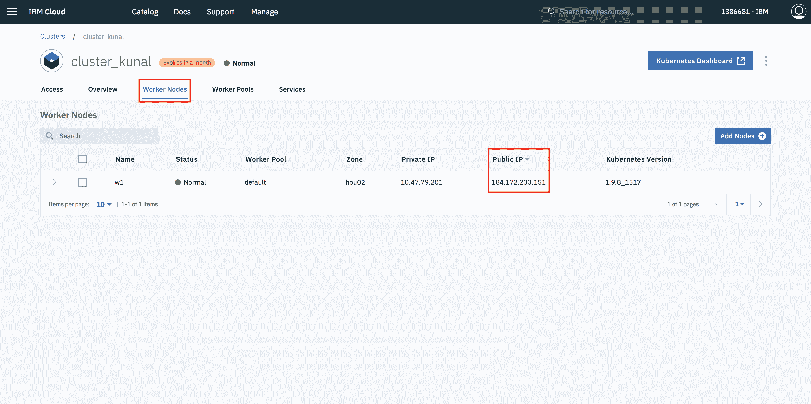

### 实现 Flask 应用程序的容器化

*   在项目目录中，创建名为“Dockerfile”的文件。*建议：将您的文件准确命名为“Dockerfile”，而不使用其他任何字符。*

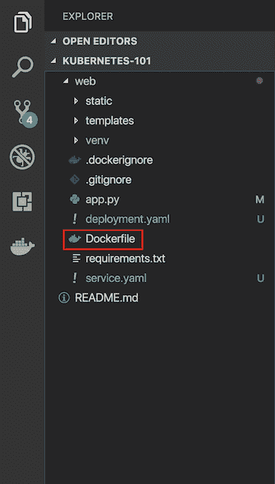

> “Dockerfile”用于向 Docker 指示基本镜像、所需 Docker 设置，以及为准备和启动新容器您希望已执行的命令列表。

*   在此文件中，粘帖以下代码：

    ```
     FROM python:2.7
      LABEL maintainer="Kunal Malhotra, kunal.malhotra1@ibm.com"
      RUN apt-get update
      RUN mkdir /app
      WORKDIR /app
      COPY ./app
      RUN pip install -r requirements.txt
      EXPOSE 5000
      ENTRYPOINT [ "python" ]
      CMD [ "app.py" ] 
    ```

#### 以上 Dockerfile 代码的说明和分解

1.  以上代码的第一部分为：

    ```
     FROM python:2.7 
    ```

    由于此 Flask 应用程序使用 Python 2.7，我们需要支持并且已安装该程序的环境。幸运的是，DockerHub 具有在 Ubuntu 之上安装的官方镜像。只需一行代码即可获取包含 Python 2.7、virtualenv 和 pip 的基本 Ubuntu 镜像。DockerHub 上有大量镜像，但只要您愿意，您也可以从全新 Ubuntu 镜像开始，并在此基础上进行构建。

2.  让我们来看下一段代码：

    ```
     LABEL maintainer="Kunal Malhotra, kunal.malhotra1@ibm.com"
     RUN apt-get update 
    ```

3.  记录维护程序，并更新 Ubuntu 程序包索引。命令为 `RUN`，此函数用于运行它后面的命令。

    ```
     RUN mkdir /app
     WORKDIR /app
     COPY ./app 
    ```

4.  现在即可将 Flask 应用程序添加到镜像中。为简便起见，将应用程序复制到 Docker 镜像上的 `/app` 目录下。

    `WORKDIR` 本质上是 Bash 中的 **cd**，而 `COPY` 则会将某个目录复制到镜像中提供的目录。`ADD` 命令与 `COPY` 执行相同的操作，但它允许您从 URL 添加存储库。因此，如果您要克隆自己的 git 存储库，而不是从本地存储库进行复制（用于登台和生产目的），那么可以使用该命令。除非您有 URL，否则大部分情况下应使用 `COPY`。

5.  既然我们已将存储库复制到镜像，接下来就将安装所有依赖项，代码的 `requirements.txt` 部分中对此进行了定义。

    ```
     RUN pip install --no-cache-dir -r requirements.txt 
    ```

6.  我们使用 `EXPOSE` 来公开用于运行 Flask 应用程序的端口 (5000)。

    ```
     EXPOSE 5000 
    ```

7.  `ENTRYPOINT` 用于指定应用程序的入口点。

    ```
     ENTRYPOINT [ "python" ]
     CMD [ "app.py" ] 
    ```

### 从 Dockerfile 构建镜像

打开终端，并输入以下命令以从 Dockerfile 构建镜像：`docker build -t <image_name>:<tag> .`（注意句点，它指示我们位于应用顶层目录中）。例如：`docker build -t app:latest .`

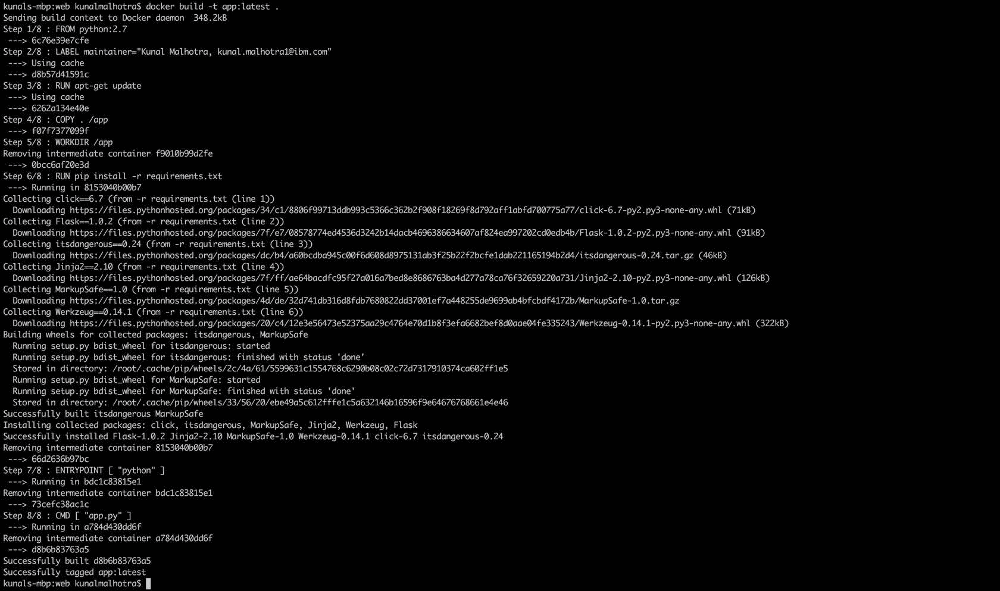

### 在本地运行容器并进行测试

成功构建镜像后，输入：`docker run -d -p 5000:5000 app`

此命令将创建一个包含镜像中所有应用程序代码和依赖项的容器，并在本地运行该容器。

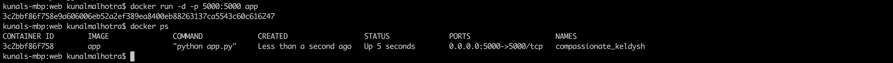

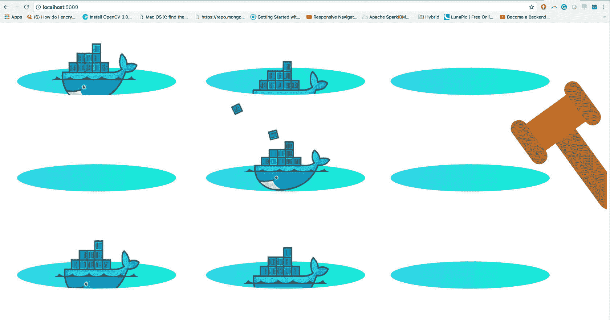

### 将镜像推送至 IBM Cloud Registry

1.  从帐户仪表板转至 **IBM Cloud Kubernetes Service**。
2.  在左侧导航菜单中选择 **Private Repositories**。

    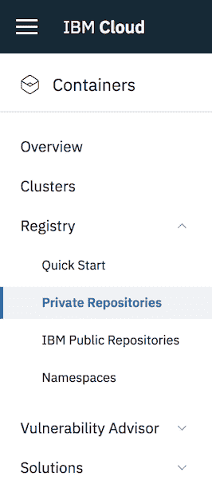

3.  安装 Container Registry 插件。

    ```
     ibmcloud plugin install container-registry -r Bluemix 
    ```

4.  登录到您的 IBM Cloud 帐户。

    ```
     ibmcloud login -a <cloud_foundary_end_point_for_the_region> 
    ```

5.  命名并创建名称空间。快速入门的其余部分都将使用此名称空间。

    ```
     ibmcloud cr namespace-add <namespace> 
    ```

6.  将本地 Docker 守护程序登录到 IBM Cloud Container Registry 中。

    ```
     ibmcloud cr login 
    ```

7.  选择存储库和用于识别镜像的标签。

    ```
     docker tag <image_name> <region_url>/<namespace>/<image_name>:<tag> 
    ```

8.  推送镜像。

    ```
     docker push <region_url>/<namespace>/<image_name>:<tag> 
    ```

    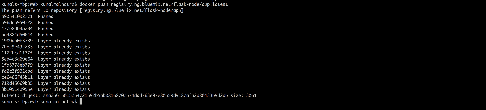

9.  验证您的镜像是否位于专用注册表中。

    ```
     ibmcloud cr image-list 
    ```

    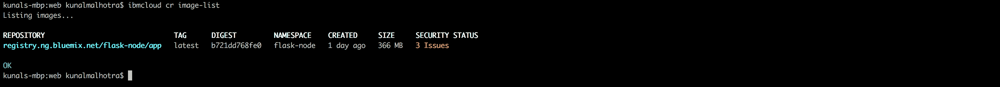

### 为 Kubernetes 创建配置文件

将镜像成功上传至专用注册表后，转至项目目录并创建以下两个文件： **Deployment.yaml** 和 **service.yaml**。

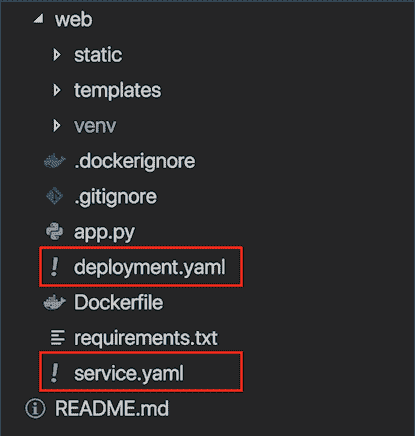

1.  在 **deployment.yaml** 文件中，粘帖以下代码：

    ```
     apiVersion: extensions/v1beta1
     kind: Deployment
     metadata:
       name: flask-node-deployment
     spec:
       replicas: 1
       selector:
         matchLabels:
           app: flasknode
       template:
         metadata:
           labels:
             app: flasknode
         spec:
           containers:
           - name: flasknode
             image: registry.ng.bluemix.net/flask-node/app
             imagePullPolicy: Always
             ports:
             - containerPort: 5000 
    ```

2.  在 **service.yaml** 文件中，粘帖以下代码：

    ```
     apiVersion: v1
     kind: Service
     metadata:
       name: flask-node-deployment
     spec:
       ports:
       - port: 5000
         targetPort: 5000
       selector:
         app: flasknode 
    ```

#### deployment.yaml 代码的说明和分解

1.  创建名为 `flask-node-deployment` 的部署，此部署由 `.metadata.name` 字段来指示。
2.  此部署会创建一个复制 pod，由 `replicas` 字段来指示。
3.  Selector 字段用于定义部署查找要管理的 pod 的方式。在此情况下，我们只需选择 Pod 模板中定义的一个标签即可 (app: `flasknode`)。但是，也可以使用更复杂的选择规则，只要 Pod 模板本身满足此规则即可。
4.  Pod 模板规范 `.template.spec` 指示 pod 在运行容器 `flasknode`，该容器运行应用专用注册表镜像。
5.  该部署会打开 `port 5000` 以供 Pod 使用。

#### service.yaml 代码的说明和分解

1.  `Service.yaml` 规范将创建名为 `flask-node-deployment` 的新服务对象，目标为具有“app=flasknode”标签的任意 Pod 上的 TCP 端口 5000。同时还会为此服务分配 IP 地址（有时称为`集群 IP`），供服务代理使用（请参阅下文）。将持续评估此服务的选择器，并将结果通过 POST 操作发布到同样名为 `flask-node-deployment` 的端点对象。

2.  须注意，此服务可将传入端口映射到任意 targetPort。默认情况下，targetPort 将设置为与 port 字段相同的值。可能更有趣的是，targetPort 可以是字符串，表示后端 Pod 中的端口名称。分配给该名称的实际端口号可与每个后端 Pod 中的端口号不同。这就为服务部署和演变提供了诸多灵活性。例如，您可在后端软件的下一个版本中更改 Pod 公开的端口号，而无需中断客户端。

### 将应用程序部署至 Kubernetes

1.  锁定要在其中工作的 IBM Cloud Kubernetes Service 区域。

    ```
     ibmcloud cs region-set us-south 
    ```

2.  在 CLI 中为集群设置上下文。

    A. 获取命令以设置环境变量并下载 Kubernetes 配置文件。

    ```
     ibmcloud cs cluster-config cluster_kunal 
    ```

    B. 设置 KUBECONFIG 环境变量。复制上一条命令的输出，并将其粘帖到您的终端内。命令输出应类似如下：

    ```
    > export KUBECONFIG=/Users/$USER/.bluemix/plugins/container-service/clusters/< cluster_name >/< cluster_configuration_file.yaml> 
    ```

3.  列出您的工作节点，验证您是否可以连接到自己的集群。

    ```
     kubectl get nodes 
    ```

4.  创建部署。

    ```
     kubectl create -f deployment.yaml 
    ```

    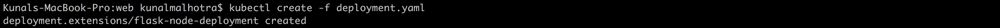

5.  创建服务。

    ```
     kubectl create -f service.yaml 
    ```

    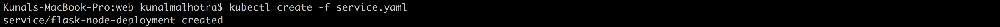

6.  从 IBM Kubernetes Service 概述页面查看 Kubernetes 仪表板。

    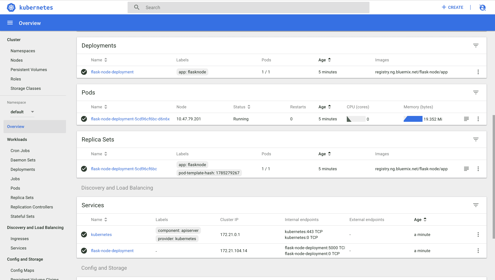

7.  最后，转至浏览器，并 ping 工作节点的公共 IP。

    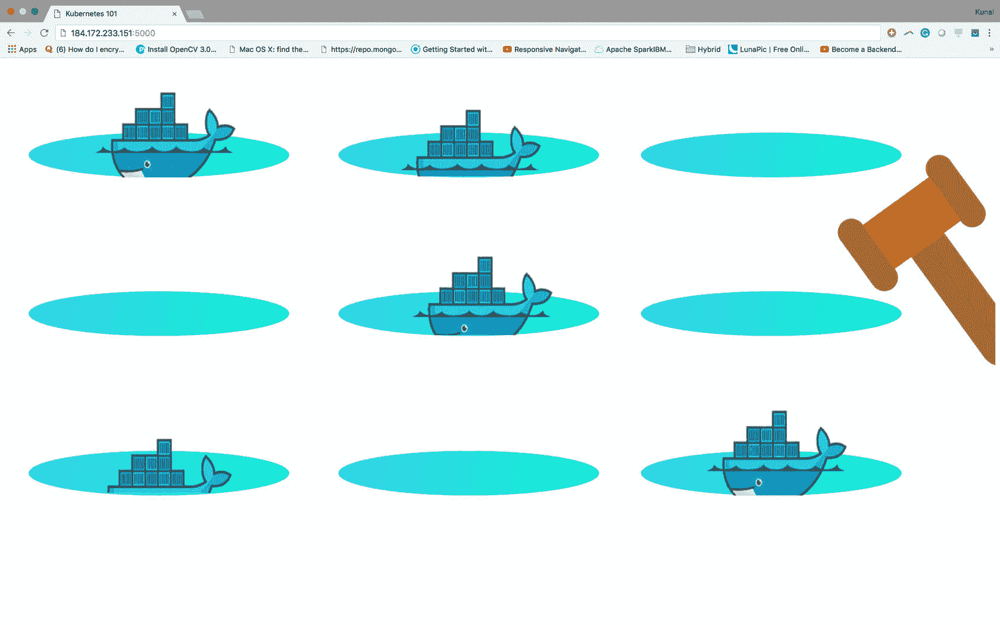

## 资源与参考资料

1.  [Kubernetes 文档](https://kubernetes.io/docs/home/?path=users&persona=app-developer&level=foundational)
2.  [使用 Kubernetes 在 IBM Cloud 上部署微服务应用](https://www.ibm.com/cloud/garage/tutorials/microservices-app-on-kubernetes/)
3.  [教程：将应用程序部署到 Kubernetes 集群](https://cloud.ibm.com/docs/containers/cs_tutorials_apps.html#cs_apps_tutorial)

本文翻译自：[Deploy a simple Python application with Kubernetes](https://developer.ibm.com/tutorials/scalable-python-app-with-kubernetes/)（2018-09-12）