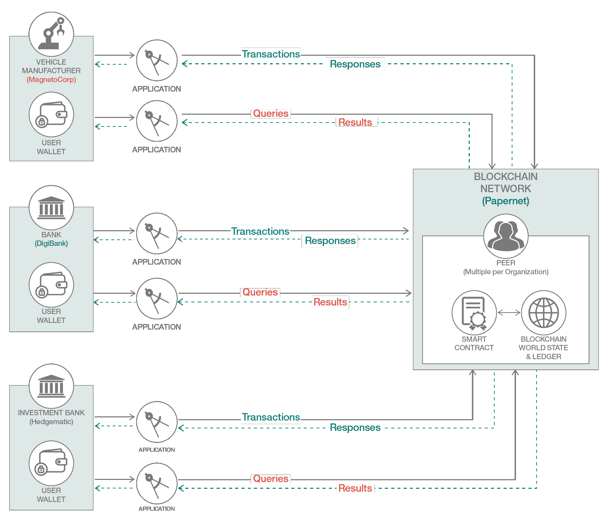
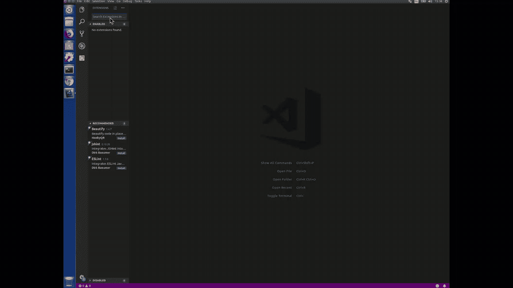
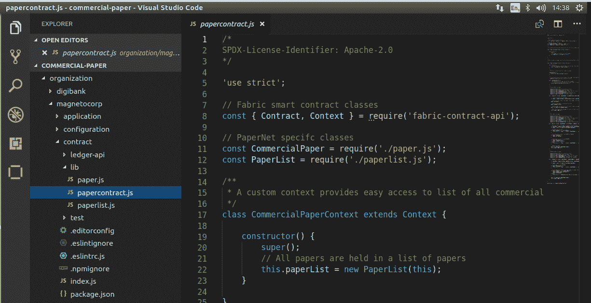
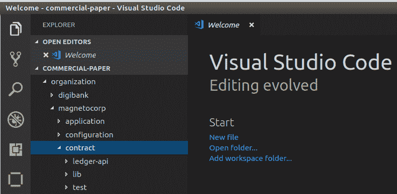
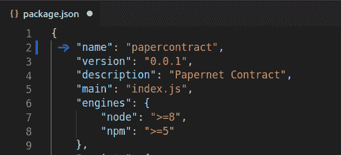
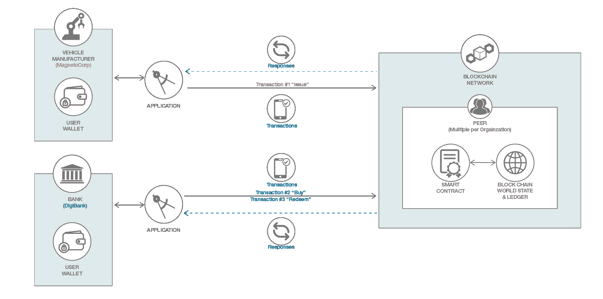

# 使用 IBM BlockChain VS Code 扩展来运行商业票据智能合约

> 原文：[`developer.ibm.com/zh/tutorials/run-commercial-paper-smart-contract-with-ibm-blockchain-vscode-extension/`](https://developer.ibm.com/zh/tutorials/run-commercial-paper-smart-contract-with-ibm-blockchain-vscode-extension/)

通过使用全新 IBM Blockchain Platform VS Code 扩展和 Hyperledger Fabric 的最新功能，开发区块链应用程序和智能合约简直易如反掌！此扩展是一个直观的工具，使开发人员能够在单个工具中发现智能合约，对其进行编码、测试、调试和打包，并将其部署到区块链网络中。为了更清楚地加以说明，我们来实际操作一下！您可以阅读[本声明](https://developer.ibm.com/announcements/ibm-blockchain-platform-vscode-smart-contract/)了解详情。此外，如果您使用下面的本地 Fabric 环境，您很快就可以将这里构建的示例部署到自己的 IBM Blockchain Platform 云实例中。

本教程展示如何使用 IBM BlockChain Platform VS Code 扩展将商业票据智能合约样本部署到 Fabric 区块链，然后运行此样本。您还将与合约进行交互，并使用简单的命令行应用程序来执行交易。可以在 [GitHub](https://github.com/hyperledger/fabric-samples) 中获取此样本。

**注意：**这是一个教程系列的第 1 部分，该系列共有 3 部分。[第 2 部分](https://developer.ibm.com/zh/tutorials/queries-commercial-paper-smart-contract-ibm-blockchain-vscode-extension/)基于第 1 部分，但增加了对合约的查询，以报告账本中存储的商业票据的完整交易历史记录。

**图 1：“Papernet”— 本教程系列中所用商业票据组织的概述** 

## 背景

至少从 19 世纪开始，商业票据就已经存在了。那么它是什么呢？最新的 [Fabric Developing Applications](https://hyperledger-fabric.readthedocs.io/en/release-2.2/tutorial/commercial_paper.html) 文档中对此有着精彩描述，所描绘的场景的确引人入胜。简而言之，这是大型机构获得资金以偿还短期债务的一种方式。例如，假设 MagnetoCorp 在 4 月 1 日发行一张面值为 100 万美元的商业票据（简称“CP”）。它承诺在 6 个月后（到期日为 10 月 1 日）向持票人付款（“票据”可以转让，因此可以转售）。然而，在 5 月 1 日，一家投资银行 (DigiBank) 以 96 万美元（6 个月后价值 100 万美元）的折扣价格购买了这张 CP。如果 DigiBank 持有这张票据直至到期日（同时管理其投资风险），那么作为持票人，它可以向 MagnetoCorp 赎回它的面值（100 万美元），利润为 40,000 美元。这实际上是 96 万美元投资在 6 个月内获得的利息。大多数商业票据市场的投资者都倾向于在票据到期之前一直持有该票据，但由于市场、选择和策略的不同，实际情况要远比这复杂。

## 前提条件

您需要安装以下软件才能使用此扩展：

*   [Node v8.x 或更高版本以及 npm v5.x 或更高版本](https://nodejs.org/en/download/)
*   [Yeoman (yo) v2.x](http://yeoman.io/)
*   [Docker v17.06.2-ce 或更高版本](https://www.docker.com/get-started)
*   [Docker Compose v1.14.0 或更高版本](https://docs.docker.com/compose/install/)
*   [VS Code 1.28.2 或更高版本](https://code.visualstudio.com/download)

您可以使用以下命令来检查版本：

*   node –version
*   npm –version
*   yo –version
*   docker –version
*   docker-compose –version

## 预估时间

安装必备软件后，大约需要 45 分钟才能完成。

## 准备

在开始之前，您需要先进行一些内务处理。运行以下命令以终止任何过时或活动的容器：

```
docker rm -f $(docker ps -aq) 
```

清除任何高速缓存的网络和卷：

```
docker network prune ; docker volume prune 
```

最后，如果您已经运行过本教程或之前尝试过，那么还需要删除商业票据智能合约的底层链码镜像。如果您是第一次浏览此内容，那么系统上将不会存在此链码镜像（因此无需执行此后续步骤）。使用以下命令获取容器 ID：

```
docker rmi $(docker images -q dev*) 
```

此命令将移除与先前实例化的 `papercontract` 容器（前缀为 `dev-peer0`）相关的任何延迟容器镜像。

## 场景

MagnetoCorp 发行商业票据；这由 MagnetoCorp 员工 Isabella 来执行。投资者 DigiBank（通过其投资交易员 Balaji）购买商业票据。DigiBank 持有该商业票据一段时间后，向 MagnetoCorp 赎回其面值，从而获得小额利润。您可以阅读[本 Hyperledger Fabric 文档教程](https://hyperledger-fabric.readthedocs.io/en/release-2.2/tutorial/commercial_paper.html)，详细了解这一商业票据示例。

## 步骤

### 第 1 步. 获取商业票据样本

在终端窗口中，将 Fabric 样本存储库（特别是“master”分支）克隆到您的 $HOME 目录：

```
git clone https://github.com/hyperledger/fabric-samples 
```

### 第 2 步. 启动 VS Code，并安装 IBM Blockchain Platform Extension for VS Code

您可以从任务栏启动 VS Code，也可以在终端窗口中键入 `code`。

现在您需要安装 IBM Blockchain Platform VS Code 扩展 – 您需要安装最新版本的 VS Code 才能执行此操作。要查看您是否具有最新版本，可转至 `Help` -> `Check for updates`。如果 VS Code 此时退出，可能意味着您没有最新版本。如果是这样，更新您的 VS Code（使用前面提供的链接），完成后，单击屏幕左侧边栏中的 `extensions`。在顶部的扩展市场中搜索 `IBM Blockchain Platform`，然后单击 `Install`。您应该看到状态为“Installing”，最终变为“Installed”- 然后单击 `reload`。

**图 2\. 在 VS Code 市场中查找扩展并安装**



### 第 3 步. 打开商业票据合约

1.  在 VS Code 中，选择 **File** > **Open Folder**，然后导航到 `$HOME/fabric-samples/commercial-paper/organization/magnetocorp` 目录，选择 `contracts` 文件夹。这是本教程的顶级项目文件夹。

2.  单击 `Explorer` 图标（左上角），然后打开 `$HOME/fabric-samples/commercial-paper/organization/magnetocorp/` 下的 `contract` 文件夹。

    **图 3\. 在 VS Code 中打开商业票据样本项目** 

3.  浏览位于 `lib` 子文件夹中的 `papercontract.js` 文件。它有效地协调了不同智能合约交易功能（发行、购买、赎回等）的逻辑，并以和账本交互的基本核心功能（在样本合约中）为基础。上面的介绍部分中提供的链接解释了使用商业票据场景编写合约的概念、主题和编程方法。花点时间阅读讲解部分，然后再继续此处的内容。

4.  单击 VS Code Explorer 左侧的文件夹名称，返回到 `contract` 文件夹。在继续下一步之前，采取此操作十分重要。

    **图 4\. 选择 contract 文件夹** 

### 第 4 步. 打包智能合约

1.  单击 Explorer 面板中的 `package.json` 文件并编辑“name”字段；将名称更改为 `papercontract`。

    **图 5\. 编辑 package.json 文件**

    

2.  编辑这些现有的“依赖项”条目（根据需要）。它们应如下所示：

    ```
     "fabric-contract-api": "~1.4.0",
     "fabric-shim": "~1.4.0" 
    ```

    现在保存 (CTRL + S) 此文件。

3.  单击 IBM Blockchain Platform 侧边栏图标。第一次执行此操作时，您可能会在输出窗格中看到一条消息，表明扩展“正在激活”。

4.  单击“Smart Contract packages”面板下的“+”符号（“Package a Smart Contract”），打包商业票据智能合约包，以便安装到对等节点上。它将被命名为类似 `papercontract@0.0.1` 的名称。

### 第 5 步. 在运行的 Fabric 上安装智能合约

1.  使用左侧边栏中的 IBM Blockchain Platform，启动本地开发运行时 Fabric 环境 – IBM Blockchain Platform VS Code 扩展可方便地为您提供这些本地开发操作（如启动、停止、清除、重新启动等等）。如果您已经运行了 IBM Blockchain Platform VS Code 扩展 Fabric 开发环境，那么也可以使用此环境（这是扩展最近启动的环境）。单击“Local Fabric Ops”和“Start Fabric Runtime”部分中的省略号（“…”）按钮。查看底部的 **Output** 终端窗格；您应该会看到一条消息，表明您已成功提交加入通道的提议。如果是这种情况，您可以继续操作。

2.  现在单击 **Smart Contracts** 侧边栏面板下的 **+ Install** 项目，在弹出窗口（顶部）中，您将看到一条消息，提示您选择要安装合约的对等节点。选择提供的对等节点。

3.  接下来，选择 `papercontract` 版本 0.0.1（参阅弹出提示）作为要安装的合约。然后，您应该会在“Output”中收到一条消息，表明合约已成功安装。

4.  在 IBM Blockchain Platform 侧边栏面板 **Fabric Local Ops** 下，选择“mychannel”通道，然后右键单击并选择“instantiate a smart contract”。

5.  选择 `papercontract` 版本 0.0.1 作为要实例化的合约。

6.  当系统提示输入要调用的函数名时，粘贴字符串 `org.papernet.commercialpaper:instantiate`，然后按 Enter 键。

7.  当系统提示输入参数时，按 Enter 键将其留空（没有参数）。

    大约一分钟后，您应该会在右下方看到一条进度消息，指示合约正在实例化。检查输出窗格，查看合约是否已成功实例化。

### 第 6 步. 从客户端应用程序执行商业票据智能合约交易：MagnetoCorp 和 DigiBank

至此，您已经在区块链上安装并实例化了智能合约。现在是时候尝试智能合约交易了。

商业票据场景描述了由 MagnetoCorp 和 DigiBank 这两个不同组织的员工运行的合约交易。对于本教程，您将使用 VS Code 扩展中默认的身份依次执行交易。图 6 总结了他们如何使用客户端应用程序和钱包进行交互（以每个公司组织的员工身份提供）。

**图 6.“Papernet”– 交易流程概述** 

#### 交易 1：以 Isabella@MagnetoCorp 的身份执行 `issue` 交易。

1.  在 IBM Blockchain Platform VS Code 侧边栏面板中，找到“Fabric Gateways”子面板，然后单击“local_fabric”下的“Admin”身份。

2.  依次展开“mychannel”下拉菜单和“papercontract”下拉菜单。您应该会看到交易名称列表，其中一个是“issue”。

3.  突出显示“issue”交易，然后右键单击“Submit Transaction”。顶部应该会显示一个弹出窗口。

4.  当系统提示输入参数时，复制并粘贴以下参数（须注意，每个参数都有单引号，并且用逗号分隔）：

    ```
    MagnetoCorp,00001,2020-05-31,2020-11-30,5000000 
    ```

5.  按 Enter 键，您随后应该会看到一条消息（在 *Output* 窗格中），表明交易已成功提交。

#### 交易 2\. 以 Balaji@DigiBank 的身份执行 `buy` 交易。

1.  现在，突出显示交易列表中的 `buy` 交易，然后右键单击“Submit Transaction”。此时将显示一个弹出窗口。

2.  在系统提示时，复制并粘贴以下参数字符串：

    ```
    MagnetoCorp,00001,MagnetoCorp,DigiBank,4900000,2020-05-31 
    ```

3.  按 Enter 键，然后应该会看到一条消息（在 *Output* 窗格中），表明交易已成功提交。

#### 交易 3\. 六个月后，以 Balaji @ DigiBank 身份执行 `redeem` 交易。

这个商业票据的生命周期已经到期，所有者 (DigiBank) 以面值赎回商业票据并收回投资支出。名为 `redeem.js` 的客户端应用程序使用 Balaji 的证书（来自他的钱包）执行此任务，从而执行此交易。

1.  现在突出显示交易列表中的 `redeem` 交易，然后右键单击“Submit Transaction”。此时将显示一个弹出窗口。

2.  在系统提示时，复制并粘贴以下参数字符串：

    ```
    MagnetoCorp,00001,DigiBank,2020-11-30 
    ```

3.  按 Enter 键，然后应该会看到一条消息（在 *Output* 窗格中），表明交易已成功提交。

做得不错！您已完成本教程并成功与智能合约进行交互，该合约演示了区块链上商业票据实例（包含 3 笔交易）的简单生命周期。

## 结束语

您现在已经学会了如何将简单但实质性的商业票据智能合约样本部署到 Fabric 区块链网络。您已经了解如何创建、打包、安装和实例化使用 Hyperledger Fabric 最新编程模型开发的智能合约。（显然，该扩展提供了更多功能，例如开发者的开发/调试/测试生命周期，但这超出了本特定教程的范围。）

[我的下一个教程](https://developer.ibm.com/zh/tutorials/queries-commercial-paper-smart-contract-ibm-blockchain-vscode-extension/)将关注另一个应用程序视角：查询账本，例如，获取特定资产的交易历史记录。我将回答如下问题：

*   什么是“票据”跟踪？（已明白？）
*   谁执行了交易（涉及的身份）？
*   交易究竟何时发生？
*   对于该历史记录中的每笔交易，究竟进行了哪些更改（即“增量”）？

这意味着向智能合约添加查询功能，以及一些 getter，以便从历史交易中获取正确的信息。这些结果将发送回各自的应用程序客户端。

要完成下一个教程（第 2 部分和第 3 部分），您需要从 GitHub 克隆一些样本工件（代码、脚本文件等）。为此，可打开终端窗口，找到所需目录，然后粘贴以下命令：

```
cd $HOME
git clone https://github.com/mahoney1/commpaper 
```

现在应该已经成功克隆了存储库，为下一阶段做好了准备。

如果您还没有这样做，我建议您阅读 Horea Porutiu 的优秀入门教程：[使用 IBM Blockchain Platform VS Code 扩展开发智能合约](https://developer.ibm.com/zh/tutorials/ibm-blockchain-platform-vscode-smart-contract/)，并尝试创建自己的小型入门级智能合约。

感谢您加入我的行列！

本文翻译自：[Run a commercial paper smart contract with the IBM Blockchain VS Code extension](https://developer.ibm.com/tutorials/run-commercial-paper-smart-contract-with-ibm-blockchain-vscode-extension/)（2019-02-28）