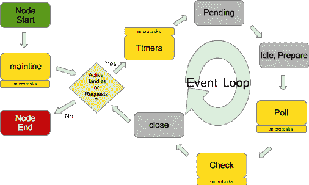

# Node.js 中的事件循环介绍

> 原文：[`developer.ibm.com/zh/tutorials/learn-nodejs-the-event-loop/`](https://developer.ibm.com/zh/tutorials/learn-nodejs-the-event-loop/)

## 前言

事件循环支持 Node 的非阻塞 I/O 模型，该模型是 Node 根据负载进行扩展的关键（如第 4 单元所述）。本教程会更详细地介绍事件循环，它由一些明确定义的阶段组成，这些阶段在事件循环中按特定顺序运行。

##### Node.js 学习路径

本教程是 Node.js 学习路径的一部分。各个单元相辅相成，所以请参阅 Node.js 学习路径概述来从头开始学习。

具体来讲，我将介绍：

*   事件循环的阶段：它们的作用、运行顺序，以及回调如何在这些阶段中运行。
*   如何设计事件循环以及各种编写在事件循环内运行的代码的方式，其中包括：
    *   与计时器一起使用的任务回调。我会详细介绍这些回调在哪些阶段运行。
    *   在（创建微服务回调的）阶段之后立即运行的微任务回调。
*   Events API，包括如何使用 Node 的事件驱动 API，以及如何创建自定义事件
*   如何使用 Stream 来处理文件。我将介绍 File Streams 事件何时在事件循环的阶段中运行。

作为 Node 开发人员，您编写的大部分代码都是某种类型的回调。只有在了解哪些类型的回调在哪些阶段中运行之后，您的回调才会按预测的方式运行，或者按您希望的顺序运行。

学完本教程后，您应该牢牢掌握了事件循环的工作方式，以及如何编写代码来使用它。您还会了解如何自行设计事件循环。

## 获取代码

与以往一样，您在本单元中看到的每个示例的代码都包含在[本课程的 GitHub 存储库](https://github.com/jstevenperry/IBM-Developer/tree/master/Node.js/Course)的 Node.js/Course/Unit-5 目录中。

[获取代码](https://github.com/jstevenperry/IBM-Developer/tree/master/Node.js/Course)

## 线程池/工人线程池

很难抛开*工人线程池*（也称为*线程池*）来讨论 Node。我把这两个术语当作同义词来使用。

### 不要担心工人线程池

我想非常明确地讲：不要担心工人线程池。为什么？原因如下：

*   作为 Node 开发人员，您不能直接访问工人线程池。
*   运行 JavaScript 代码的线程**不是**工人线程池的一部分。
*   通过 [libuv](http://libuv.org) 内部使用线程池，以改善多处理器架构上的性能。

所以，没有理由担心线程池。

### 如果您担心工人线程池

如果您像我一样，那么现在可能对工人线程池感到疑惑。这里简单介绍了一些让工人线程池运行 JavaScript 代码的方法。

我按困难程度从低到高列出了它们，并提供了一些链接来供您进一步研究。

*   您可以使用一个来自 NPM 注册表的模块，比如 [worker pool](https://www.npmjs.com/package/workerpool) 或 [Hamsters.js](https://www.npmjs.com/package/hamsters.js)，这些模块允许您在工人线程上运行 JavaScript 代码。您还可以[在 npmjs.com 上搜索“worker pool”](https://www.npmjs.com/search?q=worker%20pool)，查看有其他哪些工人线程池。
*   Node API 中有一个名为 [Worker Threads](https://nodejs.org/dist/latest-v10.x/docs/api/worker_threads.html) 的试验特性，可用来在工人线程池上运行 JavaScript 代码（请访问[此链接](https://nodejs.org/dist/latest-v10.x/docs/api/documentation.html#documentation_stability_index)来了解 Node 团队将哪些特性视为“试验”特性）。
*   您可以自行编写 C++ 扩展来利用 Node Core、V8 引擎、libuv 等。如果想进一步了解此方法，推荐[从这里开始](https://nodejs.org/dist/latest-v10.x/docs/api/addons.html)。

我们已经介绍了如何在线程池上运行 JavaScript 代码。接下来将介绍本课程的重点部分。

## 为什么需要了解事件循环

业务流程包含明确定义的步骤，这些步骤中又包含一些小步骤。编写良好的软件可以确保计算机按正确的顺序执行这些步骤，以及其中的小步骤。

Node 采用了异步和循环执行方式。它的核心是一个事件循环，该循环以极快的速度不断循环执行，在循环的每个阶段中处理回调。根据我的经验，如果 Node 应用程序没有按照顺序执行这些步骤，那是因为开发者没有清楚了解事件循环。他们认为自己的代码应该按某种顺序执行，当代码实际上并未按该顺序执行时，就会引起混淆。如果没有真正了解事件循环，能否编写 Node 应用程序？当然能。但是，了解这一重要概念后，会编写出更好的 Node 应用。

## 事件循环阶段概述

当我编写本系列教程时，Node.js 网站上只有一张插图：[事件循环详解](https://nodejs.org/en/docs/guides/event-loop-timers-and-nexttick/#event-loop-explained)。如果这是该网站上唯一的图片，那么 Node 团队肯定会认为理解事件循环概念很重要。

我复制了这幅插图，使之与我脑海中的 Node 生命周期（包括事件循环的各个阶段）模型相匹配。



我将事件循环的 Pending、Idle/Prepare 和 Close 阶段涂成灰色，因为这些是 Node 在内部使用的阶段。Node 开发者编写的代码仅以微任务形式在主线、计时器（Timers） 阶段、轮询（Poll） 阶段和 查询（Check） 阶段中运行。

这*到底*是什么意思？让我来解释一下。首先，我们会大体概述每个阶段，然后会更详细地介绍 Timers、Poll 和 Check 阶段。

### 在开始事件循环 node mynodeapp 之前

在启动 Node 时，需要向它提供一个要处理的 JavaScript 文件的名称，比如 `mynodeapp`。然后，Node 会处理这个脚本，将它转交给 V8 来执行*上下文化*，这包括将 JavaScript 代码转换为可运行的 C++ 等效代码，以及本课程不会介绍的其他代码（如果您想了解更多信息，请访问[此链接](https://nodejs.org/api/vm.html#vm_what_does_it_mean_to_contextify_an_object)或 [StackOverflow 问题](https://stackoverflow.com/questions/36491385/how-is-asynchronous-javascript-interpreted-and-executed-in-node-js)）。

然后，在 *Node 线程*上运行经过上下文化的 JavaScript 代码。从现在开始，我将把运行 V8 引擎的线程、事件循环和所有经过上下文化的 JavaScript（包括 Node API 和第三方模块中的 JavaScript 代码）称为 **Node 线程**。

您脚本的“主线”（用户的 JavaScript 代码；在本例中为 `mynodeapp`）按照自上而下的顺序运行。如果在您脚本的主线中，哪怕仅调用了某段非阻塞代码一次（用于创建计时器、读取文件等），您在该调用中传递的回调也会由 Node 线程上的事件循环（在主线完成后）运行。

##### Node 线程、V8 线程，还是事件循环线程？

我选择将运行所有 JavaScript 代码的线程称为 *Node 线程*，虽然 libuv 的事件循环（即 `uv_run()`）也在其中运行。我本可以简单地将其称为事件循环线程或 V8 线程，但是由于 Node 是运行时，所以我采用了这种称呼。 记住，只有一个线程可以运行您所有的 JavaScript，而且无论您将它称为 Node 线程、V8 线程，还是事件循环线程，指的都是同一个东西。

如果您的代码没有执行非阻塞调用，那么事件循环不会执行任何操作，Node 进程将会结束。此外，当事件循环处理完要执行的回调时，如果没有要执行的操作，Node 进程同样也会结束。

### 回调队列

每个阶段都会有一个在该阶段执行的 [FIFO](https://en.wikipedia.org/wiki/FIFO_(computing_and_electronics)) 回调队列。在图 1 中，为了节省空间，我没有展示每个阶段的回调队列，所以您可以想象一下每个阶段中的队列。

一般而言，特定于某个阶段的所有逻辑都会在该阶段开始时执行。在此之后，队列中的回调会一直运行，直到队列变空或达到系统相关限制。Node 文档没有明确说明这一点。

### 微任务

微任务紧跟在主线之后和事件循环的每个阶段之后执行。

如果您熟悉 [JavaScript 事件循环](https://developer.mozilla.org/en-US/docs/Web/JavaScript/EventLoop)，那么也应该熟悉微任务，它们在 Node 中的工作方式相同。如果您想复习一下事件循环和微任务队列，可以访问[此链接](https://html.spec.whatwg.org/multipage/webappapis.html#event-loop)（但我要提醒您，介绍很简单）。

在 Node 领域，微任务是来自以下位置的回调：

*   `process.nextTick()`
*   已解决或被拒绝的 Promise 的 `then()` 处理函数（handler）

为了强调回调函数在事件循环的各阶段间运行，我会将**微任务**和**微任务回调**作为同义词来使用。是的，我知道微任务回调从技术上讲是多余的。

在主线和事件循环的每个阶段完成后，会立刻运行微任务回调。

在本教程后面的示例中，您会使用微任务回调作为分隔符来设计事件循环的各个阶段。

### Timers 阶段

任何过期的计时器回调都会在事件循环的这个阶段中运行。

计时器分为两类：

*   [`Immediate`](https://nodejs.org/dist/latest-v10.x/docs/api/timers.html#timers_class_immediate)
*   [`Timeout`](https://nodejs.org/dist/latest-v10.x/docs/api/timers.html#timers_class_timeout)

*Immediate 计时器*是一个 Node 对象，它在下一个 Check 阶段立即运行。`Immediate` 计时器将在本单元的后面部分进行介绍。

*Timeout 计时器*是一个 Node 对象，它在计时器过期后尽快运行回调。在创建该计时器时，您需要提供该回调和一个可选的 `delay` 参数（值以毫秒为单位），如果没有提供值或指定的值为 0，那么该参数值默认情况下为 1 毫秒。

一旦该计时器过期，就会在事件循环的下一个 Timers 阶段调用该回调。根据下一个 Timers 阶段运行的时间，这可能比实际的超时值更晚。

`Timeout` 计时器有两种类型：

*   Interval：该计时器是使用 `setInterval()` 创建的。每次该计时器过期时，都会（在 `delay` 毫秒后）运行一次回调，只要 Node 进程仍在运行，就会重复此过程：(1) 除非您在它首次运行前调用 `clearInterval()`，或者 (2) 直到它运行一次或多次后调用 `clearInterval()`。

*   Timoout：该计时器是使用 `setTimeout()` 创建的。超过 `delay` 后，运行一次回调，除非您在回调有机会运行前调用了 `clearTimeout()`。

当不再有过期的计时器回调需要运行时，事件循环就会运行所有微任务。运行微任务后，事件循环就会进入 Pending 阶段。

### Pending 阶段

一些系统级回调将会在此阶段执行。您实际上不必担心此阶段（老实说，关于此阶段的信息并不多），但是我希望您知道它的存在。

### Idle 和 Prepare 阶段

显然，此阶段[“仅供内部使用”](https://nodejs.org/en/docs/guides/event-loop-timers-and-nexttick/#phases-overview)，所以我不会介绍它。同样地，只需要知道它的存在就行了。

### Poll 阶段

I/O 回调在此阶段执行。您在第 3 和第 4 单元已经看到过这些回调，其中的 `fs.readFile()` 函数调用期望您在 I/O 操作完成时提供一个回调，以便传递该文件的内容：

```
.
.
    fs.readFile(fileName, 'utf8', function(err, fileContents) {
        if (err) throw err;
        logger.debug('File read complete.File contents length: ' + fileContents.length);
.
.
        logger.trace('fs.readFile(): END', startTime);
    });
}; 
```

上面清单中的匿名回调是在 Poll 阶段运行的。

通常，如果轮询队列为空，则会阻塞并等待任何正在执行的 I/O 操作完成，然后立刻执行这些操作的回调。但是，*如果调度了计时器*，则 Poll 阶段将会结束。在必要时运行微任务，然后事件循环会进入 Check 阶段。

### Check 阶段

此阶段是一种“后 I/O”阶段，只有 `setImmediate()` 回调会在该阶段中执行。这使您能够在 Poll 阶段变得空闲时立即执行一些代码。

Check 阶段的回调队列为空后，会运行所有微任务，然后事件循环将进入 Close 阶段。

### Close 阶段

如果某个套接字（socket）或句柄突（handle）然关闭（例如，如果调用了一个套接字的 `socket.destroy()` 方法），则会执行此阶段，这种情况下会触发其“close”事件。

因为这种情况不太可能发生，所以我在详细讨论时会省略此阶段（我只会讨论您可能在其中执行回调的阶段）。

## 事件循环阶段的更详细介绍

现在您已大概了解了所有阶段，让我们更详细地了解一下通常会调用回调的 3 个阶段：

*   Timers
*   Poll
*   Check

我将向您展示在每个阶段运行的回调示例。本节中的示例的源代码包含在[本课程的 GitHub 存储库](https://github.com/jstevenperry/IBM-Developer/tree/master/Node.js/)的 /Course/Unit-5 目录中。公共代码（比如 `logger`）包含在 Node.js/Course/common 目录中。

### Timers 阶段的回调

在 Timers 阶段，将会运行过期的 Interval 和 Timeout 计时器的回调。让我们先来看看 Interval 计时器。

#### setInterval()

如果需要对计时器进行重复循环，那么 Interval 计时器就是最佳选择。要创建一个 Interval 计时器，可以使用如下所示的简单代码：

**示例 1\. setInterval()**

```
01 const logger = require('../common/logger');
02 const ITERATIONS_MAX = 5;
03 let iteration = 0;
04 logger.info('START', 'MAINLINE');
05 const timeout = setInterval(() => {
06     logger.info('START: setInterval', 'TIMERS PHASE');
07     if (iteration >= ITERATIONS_MAX) {
08         logger.info('Max interval count exceeded.Goodbye.', 'TIMERS PHASE');
09         // Kill the interval timer
10        clearInterval(timeout);
11     }
12     iteration++;
13     logger.info('END: setInterval', 'TIMERS PHASE');
14 }, 10);
15 logger.info('END', 'MAINLINE'); 
```

`setInterval()` 创建一个重复计时器，该计时器重复 5 次，而且运行间隔不低于 10 毫秒（`delay` 是在第 14 行中指定的）。每次该计时器过期，都会运行回调（第 6-13 行），直到调用 `clearInterval()`（第 10 行）。

`example1.js` 的输出如下所示：

```
$ node example1
1530377268828:INFO: mainline: START
1530377268830:INFO: mainline: END
1530377268843:INFO: TIMERS PHASE: START: setInterval
1530377268844:INFO: TIMERS PHASE: END: setInterval
1530377268856:INFO: TIMERS PHASE: START: setInterval
1530377268856:INFO: TIMERS PHASE: END: setInterval
1530377268866:INFO: TIMERS PHASE: START: setInterval
1530377268866:INFO: TIMERS PHASE: END: setInterval
1530377268878:INFO: TIMERS PHASE: START: setInterval
1530377268879:INFO: TIMERS PHASE: END: setInterval
1530377268891:INFO: TIMERS PHASE: START: setInterval
1530377268892:INFO: TIMERS PHASE: END: setInterval
1530377268903:INFO: TIMERS PHASE: START: setInterval
1530377268903:INFO: TIMERS PHASE: Max interval count exceeded.Goodbye.
1530377268904:INFO: TIMERS PHASE: END: setInterval
$ 
```

要清除该计时器，必须保留从 `setInterval()` 调用返回的 `Timeout` 对象的引用，并将该引用传递给 `clearInterval()` 函数（第 10 行）。如果没有调用 `clearInterval()`，该计时器将会永久运行。

#### setTimeout()

`setTimeout()` 计时器是一次性计时器。您可以创建一个类似以下示例的计时器（第 8-10 行）：

**示例 2\. 展示了 Timers 阶段的回调的 `setTimeout()` 示例**

```
01 const logger = require('../common/logger');
02 const ITERATIONS_MAX = 5;
03 let iteration = 0;
04 logger.info('START', 'MAINLINE');
05 const timeout = setInterval(() => {
06     logger.info('START: setInterval', 'TIMERS PHASE');
07     if (iteration < ITERATIONS_MAX) {
08         setTimeout(() => {
09             logger.info('setInterval.setTimeout', 'TIMERS PHASE');
10         });
11     } else {
12         logger.info('Max interval count exceeded.Goodbye.', 'TIMERS PHASE');
13         clearInterval(timeout);
14     }
15     iteration++;
16     logger.info('END: setInterval', 'TIMERS PHASE');
17 }, 0);
18 logger.info('MAINLINE: END'); 
```

请注意，这个示例以上一个示例为基础。我的每个示例都会按此方式构建，直到示例 6。您很快就会知道我为什么这样做。

一次性计时器很枯燥，所以我将它添加到 `setInterval()` 示例的代码中。我将间隔超时更改为 0，而且没有设置 `setTimeout()` 调用的 `delay`，所以它会在创建 1 毫秒后过期。

运行 `example2.js` 时，您会看到以下输出：

```
$ node example2
1530377605443:INFO: MAINLINE: START
1530377605446:INFO: MAINLINE: END
1530377605447:INFO: TIMERS PHASE: START: setInterval
1530377605447:INFO: TIMERS PHASE: END: setInterval
1530377605449:INFO: TIMERS PHASE: setInterval.setTimeout
1530377605449:INFO: TIMERS PHASE: START: setInterval
1530377605449:INFO: TIMERS PHASE: END: setInterval
1530377605450:INFO: TIMERS PHASE: setInterval.setTimeout
1530377605450:INFO: TIMERS PHASE: START: setInterval
1530377605450:INFO: TIMERS PHASE: END: setInterval
1530377605452:INFO: TIMERS PHASE: setInterval.setTimeout
1530377605452:INFO: TIMERS PHASE: START: setInterval
1530377605452:INFO: TIMERS PHASE: END: setInterval
1530377605454:INFO: TIMERS PHASE: setInterval.setTimeout
1530377605454:INFO: TIMERS PHASE: START: setInterval
1530377605454:INFO: TIMERS PHASE: END: setInterval
1530377605455:INFO: TIMERS PHASE: setInterval.setTimeout
1530377605455:INFO: TIMERS PHASE: START: setInterval
1530377605455:INFO: TIMERS PHASE: Max interval count exceeded.Goodbye.
1530377605456:INFO: TIMERS PHASE: END: setInterval
$ 
```

这里实际发生的情况是，您已经设置了一个以尽可能快的频率运行（超时设置为 1 毫秒）的 Interval 计时器。当其回调运行时，它会创建另一个一次性计时器，该计时器也将在创建 1 毫秒后过期。

您已设计了事件循环的开头部分。要继续完成后面的构建，可以添加一些 I/O 操作，这意味着添加一些 Poll 阶段回调！

### Poll 阶段回调

所有非阻塞 I/O 请求回调都会在 Poll 阶段运行。下面给是一个 Poll 阶段回调的 `fs.readdir()` 示例：

**示例 3\. 展示了 Poll 阶段回调的 `fs.readdir()` 示例**

```
 01 const fs = require('fs');
 02 const logger = require('../common/logger');
 03 const ITERATIONS_MAX = 3;
 04 let iteration = 0;
 05 logger.info('START', 'MAINLINE');
 06 const timeout = setInterval(() => {
 07     logger.info('START: setInterval', 'TIMERS PHASE');
 08     if (iteration < ITERATIONS_MAX) {
 09         setTimeout(() => {
 10             logger.info('TIMERS PHASE', 'setInterval.setTimeout');
 11         });
 12         fs.readdir('../data', (err, files) => {
 13             if (err) throw err;
 14             logger.info('fs.readdir() callback: Directory contains: ' + files.length + ' files', 'POLL PHASE');
 15         });
 16     } else {
 17         logger.info('Max interval count exceeded.Goodbye.', 'TIMERS PHASE');
 18         clearInterval(timeout);
 19     }
 20     iteration++;
 21     logger.info('END: setInterval', 'TIMERS PHASE');
 22 }, 0);
 23 logger.info('END', 'MAINLINE'); 
```

对 `fs.readdir()` 的非阻塞 I/O 回调从第 12 行开始，它的回调会在 I/O 操作完成后在 Poll 阶段执行。

`example3.js` 的输出如下所示：

```
$ node example3
1530377719473:INFO: MAINLINE: START
1530377719475:INFO: MAINLINE: END
1530377719477:INFO: TIMERS PHASE: START: setInterval
1530377719477:INFO: TIMERS PHASE: END: setInterval
1530377719477:INFO: POLL PHASE: fs.readdir() callback: Directory contains: 7 files
1530377719477:INFO: setInterval.setTimeout: TIMERS PHASE
1530377719478:INFO: TIMERS PHASE: START: setInterval
1530377719478:INFO: TIMERS PHASE: END: setInterval
1530377719478:INFO: POLL PHASE: fs.readdir() callback: Directory contains: 7 files
1530377719479:INFO: setInterval.setTimeout: TIMERS PHASE
1530377719479:INFO: TIMERS PHASE: START: setInterval
1530377719479:INFO: TIMERS PHASE: END: setInterval
1530377719480:INFO: POLL PHASE: fs.readdir() callback: Directory contains: 7 files
1530377719481:INFO: setInterval.setTimeout: TIMERS PHASE
1530377719481:INFO: TIMERS PHASE: START: setInterval
1530377719481:INFO: TIMERS PHASE: Max interval count exceeded.Goodbye.
1530377719482:INFO: TIMERS PHASE: END: setInterval
$ 
```

为了限制输出量，我将 `setInterval()` 计时器回调的迭代次数减少到 3 次（参见示例 3 的第 3 行）。

如果在 Poll 阶段回调期间调度了任何微任务，它们会立即在 MacOS 上执行（而不是等到 Poll 阶段完成后再运行微任务）。本单元后面的“微任务回调”部分，会看到更多这方面的内容。

当 Poll 阶段回调队列变空时，Poll 阶段就会变得空闲。

如果**没有**调度任何计时器，Poll 阶段会等待未完成的 I/O 请求完成，然后立即执行它们的回调。

如果**有**调度过任何计时器，事件循环会继续执行 Check 阶段。

### Check 阶段回调

`Immediate` 计时器的回调在 Check 阶段运行。下面的示例给出了一个 Check 阶段回调；这个示例同样以上一个示例为基础。

**示例 4\. 展示了 Check 阶段回调的 `setImmediate()` 示例**

```
 01 const fs = require('fs');
 02 const logger = require('../common/logger');
 03 const ITERATIONS_MAX = 3;
 04 let iteration = 0;
 05 logger.info('START', 'MAINLINE');
 06 const timeout = setInterval(() => {
 07     logger.info('START: setInterval', 'TIMERS PHASE');
 08     if (iteration < ITERATIONS_MAX) {
 09         setTimeout(() => {
 10             logger.info('setInterval.setTimeout', 'TIMERS PHASE');
 11         });
 12         fs.readdir('../data', (err, files) => {
 13             if (err) throw err;
 14             logger.info('fs.readdir() callback: Directory contains: ' + files.length + ' files', 'POLL PHASE');
 15         });
 16         setImmediate(() => {
 17             logger.info('setInterval.setImmediate', 'CHECK PHASE');
 18         });
 19     } else {
 20         logger.info('Max interval count exceeded.Goodbye.', 'TIMERS PHASE');
 21         clearInterval(timeout);
 22     }
 23     iteration++;
 24     logger.info('END: setInterval', 'TIMERS PHASE');
 25 }, 0);
 26 logger.info('END', 'MAINLINE'); 
```

`Immediate` 计时器在第 16 行中创建（**在 Timers 阶段**）（因为第 16 行是作为 `setInterval()` 回调的一部分来执行的），但是它的回调**在 Check 阶段**执行。

`example4.js` 的输出如下所示：

```
$ node example4
1530377921982:INFO: MAINLINE: START
1530377921985:INFO: MAINLINE: END
1530377921986:INFO: TIMERS PHASE: START: setInterval
1530377921986:INFO: TIMERS PHASE: END: setInterval
1530377921987:INFO: POLL PHASE: fs.readdir() callback: Directory contains: 7 files
1530377921987:INFO: CHECK PHASE: setInterval.setImmediate
1530377921989:INFO: TIMERS PHASE: setInterval.setTimeout
1530377921989:INFO: TIMERS PHASE: START: setInterval
1530377921989:INFO: TIMERS PHASE: END: setInterval
1530377921989:INFO: CHECK PHASE: setInterval.setImmediate
1530377921989:INFO: POLL PHASE: fs.readdir() callback: Directory contains: 7 files
1530377921990:INFO: TIMERS PHASE: setInterval.setTimeout
1530377921991:INFO: TIMERS PHASE: START: setInterval
1530377921991:INFO: TIMERS PHASE: END: setInterval
1530377921991:INFO: CHECK PHASE: setInterval.setImmediate
1530377921991:INFO: POLL PHASE: fs.readdir() callback: Directory contains: 7 files
1530377921992:INFO: TIMERS PHASE: setInterval.setTimeout
1530377921992:INFO: TIMERS PHASE: START: setInterval
1530377921992:INFO: TIMERS PHASE: Max interval count exceeded.Goodbye.
1530377921993:INFO: TIMERS PHASE: END: setInterval
$ 
```

为了限制输出量，我将 `setInterval()` 计时器回调的迭代次数减少到 4 次（参见示例 4 的第 3 行）。

### 微任务回调

微任务是提供给 `process.nextTick()` 或 `Promise.resolve().then()` 的回调，会在主线或事件循环的某个阶段中执行。调度微任务后，它们会加入在该阶段完成后执行的微任务回调队列中。

下面是 `process.nextTick()` 和 `Promise.resolve().then()` 的示例：

#### process.nextTick()

在设计事件循环时，可以使用微任务作为一种“阶段分隔符”。下面的 `process.nextTick()` 示例展示了如何使用微任务回调作为阶段分隔符**

**示例 5\. 展示了如何使用微任务回调作为阶段分隔符的 `process.nextTick()` 示例**

```
01 const fs = require('fs');
02 const logger = require('../common/logger');
03 const ITERATIONS_MAX = 2;
04 let iteration = 0;
05 process.nextTick(() => {
06     logger.info('process.nextTick', 'MAINLINE MICROTASK');
07 });
08 logger.info('START', 'MAINLINE');
09 const timeout = setInterval(() => {
10     logger.info('START iteration ' + iteration + ': setInterval', 'TIMERS PHASE');
11
12     if (iteration < ITERATIONS_MAX) {
13         setTimeout((iteration) => {
14             logger.info('TIMER EXPIRED (from iteration ' + iteration + '): setInterval.setTimeout', 'TIMERS PHASE');
15             process.nextTick(() => {
16                 logger.info('setInterval.setTimeout.process.nextTick', 'TIMERS PHASE MICROTASK');
17             });
18         }, 0, iteration);
19         fs.readdir('../data', (err, files) => {
20             logger.info('fs.readdir() callback: Directory contains: ' + files.length + ' files', 'POLL PHASE');
21             process.nextTick(() => {
22                 logger.info('setInterval.fs.readdir.process.nextTick', 'POLL PHASE MICROTASK');
23             });
24         });
25         setImmediate(() => {
26             logger.info('setInterval.setImmediate', 'CHECK PHASE');
27             process.nextTick(() => {
28                 logger.info('setInterval.setTimeout.process.nextTick', 'CHECK PHASE MICROTASK');
29             });
30         });
31     } else {
32         logger.info('Max interval count exceeded.Goodbye.', 'TIMERS PHASE');
33         clearInterval(timeout);
34     }
35     logger.info('END iteration ' + iteration + ': setInterval', 'TIMERS PHASE');
36     iteration++;
37 }, 0);
38 logger.info('MAINLINE: END'); 
```

每个回调中都有一个 `process.nextTick()` 调用，用来标记运行该回调的阶段的结束。

例如，从第 14 行开始的 `setTimeout()` 回调在 Timers 阶段运行，并在第 16 行调度了一个微任务，该任务仅包含一个 `logger()` 调用。

类似地，其他所有阶段（包括主线）也有 `process.nextTick()` 分隔符。

示例 5 的输出如下所示：

```
$ node example5
1530401857782:INFO: MAINLINE: START
1530401857784:INFO: MAINLINE: END
1530401857785:INFO: MAINLINE MICROTASK: process.nextTick
1530401857786:INFO: TIMERS PHASE: START iteration 0: setInterval
1530401857786:INFO: TIMERS PHASE: END iteration 0: setInterval
1530401857787:INFO: POLL PHASE: fs.readdir() callback: Directory contains: 8 files
1530401857787:INFO: POLL PHASE MICROTASK: setInterval.fs.readdir.process.nextTick
1530401857787:INFO: POLL PHASE: fs.readdir() callback: Directory contains: 8 files
1530401857787:INFO: POLL PHASE MICROTASK: setInterval.fs.readdir.process.nextTick
1530401857787:INFO: CHECK PHASE: setInterval.setImmediate
1530401857787:INFO: CHECK PHASE MICROTASK: setInterval.setTimeout.process.nextTick
1530401857787:INFO: TIMERS PHASE: TIMER EXPIRED (from iteration 0): setInterval.setTimeout
1530401857787:INFO: TIMERS PHASE: START iteration 1: setInterval
1530401857788:INFO: TIMERS PHASE: END iteration 1: setInterval
1530401857788:INFO: TIMERS PHASE MICROTASK: setInterval.setTimeout.process.nextTick
1530401857788:INFO: POLL PHASE: fs.readdir() callback: Directory contains: 8 files
1530401857788:INFO: POLL PHASE MICROTASK: setInterval.fs.readdir.process.nextTick
1530401857788:INFO: POLL PHASE: fs.readdir() callback: Directory contains: 8 files
1530401857788:INFO: POLL PHASE MICROTASK: setInterval.fs.readdir.process.nextTick
1530401857788:INFO: CHECK PHASE: setInterval.setImmediate
1530401857788:INFO: CHECK PHASE MICROTASK: setInterval.setTimeout.process.nextTick
1530401857788:INFO: TIMERS PHASE: TIMER EXPIRED (from iteration 1): setInterval.setTimeout
1530401857788:INFO: TIMERS PHASE: START iteration 2: setInterval
1530401857788:INFO: TIMERS PHASE: Max interval count exceeded.Goodbye.
1530401857788:INFO: TIMERS PHASE: END iteration 2: setInterval
1530401857788:INFO: TIMERS PHASE MICROTASK: setInterval.setTimeout.process.nextTick
$ 
```

首先，主线运行，然后运行它的微任务。接下来依次是 Timers 阶段、Poll 阶段、Check 阶段等。为了限制输出量，我将迭代次数限制为 2 次（参见示例 5 的第 3 行），这足以展示该模式。

事件循环的每个阶段后面都有一个 `process.nextTick()` 分隔符回调，用来标记该阶段的结束。您知道，阶段分隔符回调必须在该阶段后运行，因此接下来的输出肯定来自事件循环中的后续阶段。

#### Promise.resolve().then()

一个已解析的 Promise 的 `then()` 回调被作为微任务执行，就像 `process.nextTick()` 一样。但是，如果二者在同一个微任务队列，`process.nextTick()` 的回调会先执行。

例如，如果有一个 Promise 已在 Timers 阶段解析，而且有一个绑定的 `then()` 处理函数，那么它会在 Timers 阶段后立即运行，然后才会执行事件循环的剩余阶段。

参见示例 6，其中的 `Promise.resolve().then()` 示例展示了如何使用微任务回调作为阶段分隔符。

**示例 6\. 展示了如何使用微任务回调作为阶段分隔符的 `Promise.resolve().then()` 示例**

```
01 const fs = require('fs');
02 const logger = require('../common/logger');
03 const ITERATIONS_MAX = 2;
04 let iteration = 0;
05 Promise.resolve().then(() => {
06     // Microtask callback runs AFTER mainline, even though the code is here
07     logger.info('Promise.resolve.then', 'MAINLINE MICROTASK');
08 });
09 logger.info('START', 'MAINLINE');
10 const timeout = setInterval(() => {
11     logger.info('START iteration ' + iteration + ': setInterval', 'TIMERS PHASE');
12     if (iteration < ITERATIONS_MAX) {
13         setTimeout((iteration) => {
14             logger.info('TIMER EXPIRED (from iteration ' + iteration + '): setInterval.setTimeout', 'TIMERS PHASE');
15             Promise.resolve().then(() => {
16                 logger.info('setInterval.setTimeout.Promise.resolve.then', 'TIMERS PHASE MICROTASK');
17             });
18         }, 0, iteration);
19         fs.readdir('../data', (err, files) => {
20             if (err) throw err;
21             logger.info('fs.readdir() callback: Directory contains: ' + files.length + ' files', 'POLL PHASE');
22             Promise.resolve().then(() => {
23                 logger.info('setInterval.fs.readdir.Promise.resolve.then', 'POLL PHASE MICROTASK');
24             });
25         });
26         setImmediate(() => {
27             logger.info('setInterval.setImmediate', 'CHECK PHASE');
28             Promise.resolve().then(() => {
29                 logger.info('setInterval.setTimeout.Promise.resolve.then', 'CHECK PHASE MICROTASK');
30             });
31         });
32     } else {
33         logger.info('Max interval count exceeded.Goodbye.', 'TIMERS PHASE');
34         clearInterval(timeout);
35     }
36     logger.info('END iteration ' + iteration + ': setInterval', 'TIMERS PHASE');
37     iteration++;
38 }, 0);
39 logger.info('END', 'MAINLINE'); 
```

示例 6 类似于示例 5，但它使用了已解析的 Promise 处理函数作为阶段分隔符。输出如下所示：

```
$ node example6
1530402106144:INFO: MAINLINE: START
1530402106146:INFO: MAINLINE: END
1530402106147:INFO: MAINLINE MICROTASK: Promise.resolve.then
1530402106148:INFO: TIMERS PHASE: START iteration 0: setInterval
1530402106148:INFO: TIMERS PHASE: END iteration 0: setInterval
1530402106149:INFO: POLL PHASE: fs.readdir() callback: Directory contains: 8 files
1530402106149:INFO: POLL PHASE MICROTASK: setInterval.fs.readdir.Promise.resolve.then
1530402106149:INFO: CHECK PHASE: setInterval.setImmediate
1530402106149:INFO: CHECK PHASE MICROTASK: setInterval.setTimeout.Promise.resolve.then
1530402106151:INFO: TIMERS PHASE: TIMER EXPIRED (from iteration 0): setInterval.setTimeout
1530402106151:INFO: TIMERS PHASE: START iteration 1: setInterval
1530402106151:INFO: TIMERS PHASE: END iteration 1: setInterval
1530402106151:INFO: TIMERS PHASE MICROTASK: setInterval.setTimeout.Promise.resolve.then
1530402106151:INFO: POLL PHASE: fs.readdir() callback: Directory contains: 8 files
1530402106151:INFO: POLL PHASE MICROTASK: setInterval.fs.readdir.Promise.resolve.then
1530402106151:INFO: CHECK PHASE: setInterval.setImmediate
1530402106151:INFO: CHECK PHASE MICROTASK: setInterval.setTimeout.Promise.resolve.then
1530402106153:INFO: TIMERS PHASE: TIMER EXPIRED (from iteration 1): setInterval.setTimeout
1530402106153:INFO: TIMERS PHASE: START iteration 2: setInterval
1530402106153:INFO: TIMERS PHASE: Max interval count exceeded.Goodbye.
1530402106153:INFO: TIMERS PHASE: END iteration 2: setInterval
1530402106153:INFO: TIMERS PHASE MICROTASK: setInterval.setTimeout.Promise.resolve.then
$ 
```

如您所料，该输出与示例 5 的输出非常相似。我希望展示的是，这两种类型的微任务都会在调度它们的阶段后立即执行。

## 事件

*事件*是应用程序中发生的重要事情。Node 这样的事件驱动运行时会在某些位置触发事件，并在其他位置响应它们。

创建自定义事件超级简单，如示例 7 所示：

**示例 7\. 使用自定义事件：`simpleEvent`**

```
01   // The Node EventEmitter
02   const EventEmitter = require('events');
03   // Create an instance of EventEmitter
04   const eventEmitter = new EventEmitter();
05
06   // The common logger
07   const logger = require('../common/logger');
08
09   logger.info('START', 'MAINLINE');
10
11   logger.info('Registering simpleEvent handler', 'MAINLINE');
12   eventEmitter.on('simpleEvent', (eventName, message, source, timestamp) => {
13       logger.info('Received event: ' + timestamp + ': ' + source + ':[' + eventName + ']: ' + message, 'EventEmitter.on()');
14   });
15
16   // Get the current time
17   let hrtime = process.hrtime();
18   eventEmitter.emit('simpleEvent', 'simpleEvent', 'Custom event says what?', 'MAINLINE', (hrtime[0] * 1e9 + hrtime[1] ) / 1e6);
19
20   logger.info('END', 'MAINLINE'); 
```

首先，您需要一个对 `events` 模块的引用（第 2 行），以及 `EventEmitter` 对象的一个实例（第 4 行）。

然后，使用 [`EventEmitter.on()`](https://nodejs.org/dist/latest-v10.x/docs/api/events.html#events_emitter_on_eventname_listener) 函数（第 12 行）注册一个事件监听器 [`Function`](https://developer.mozilla.org/en-US/docs/Web/JavaScript/Reference/Global_Objects/Function)。在触发 `simpleEvent` 事件时，会调用该监听器函数并记录一条消息（第 13 行）。

然后触发 `simpleEvent`，以及其他一些参数（第 18 行），这些参数需要与该处理函数的参数列表相匹配。

运行该示例时，输出如下所示：

```
$ node example7
1530379926998:INFO: MAINLINE: START
1530379927000:INFO: MAINLINE: Registering simpleEvent handler
1530379927000:INFO: EventEmitter.on(): Received event: 553491474.966337: MAINLINE:[simpleEvent]: Custom event says what?
1530379927000:INFO: MAINLINE: END
$ 
```

这非常简单。看到了吗？我说过这超级简单。

但是，这段代码中有一些问题困扰着我。我很想澄清以下几点：

*   重复的字符串文字：将它们移动到一个公共模块中
*   Timestamp 函数：将此函数移动到 `simple-utils` 中，因为您可能希望重用它
*   事件属性（`eventName`、`message` 等）可以移动到一个公共模块中，并当作对象来重用
*   将控制台记录器 (`logger`) 替换为具有相同接口的基于事件的记录器，以实现向后兼容
*   创建一个包含主线代码的立即执行函数表达式 (IIFE) `mainline`，以便明确说明主线的位置。

重构后的代码如下所示：

**示例 8\. 重构后的示例 7 代码**

```
01 const EventEmitter = require('events');
02 const eventEmitter = new EventEmitter();
03
04 // EventInfo module
05 const { EventInfo } = require('../common/event-info');
06 // Event Logger module
07 const logger = require('../common/event-logger');
08 // Simple utilities module
09 const simpleUtils = require('../common/simple-utils');
10
11 // Constants (from constants module)
12 const { MAINLINE, START, END } = require('../common/constants');
13
14 // The custom event name
15 const EVENT_NAME = 'simpleEvent';
16
17 /**
18  * The mainline function.
19  */
20 (function mainline() {
21
22     logger.info(START, MAINLINE);
23
24     logger.info('Registering ' + EVENT_NAME + ' handler', MAINLINE);
25     eventEmitter.on(EVENT_NAME, (eventInfo) => {
26         logger.info('Received event: ' + eventInfo.toString(), 'EventEmitter.on()');
27     });
28     // Emit the event
29     eventEmitter.emit(EVENT_NAME, new EventInfo(EVENT_NAME, 'Custom event says what?', MAINLINE, simpleUtils.hrtimeToMillis(process.hrtime())));
30
31     logger.info(END, MAINLINE);
32
33 })(); 
```

请继续研究并亲自运行它（稍后会有一个小测试）。

输出如下所示：

```
$ node example8
553643510.792406: MAINLINE:[INFO]: START
553643510.975569: MAINLINE:[INFO]: Registering simpleEvent handler
553643511.05733: EventEmitter.on():[INFO]: Received event: 553643510.994694: MAINLINE:[simpleEvent]: Custom event says what?
553643511.060924: MAINLINE:[INFO]: END 
```

该输出与上一个示例的输出非常相似，但时间戳现在为从 [`process.hrtime()`](https://nodejs.org/dist/latest-v10.x/docs/api/process.html#process_process_hrtime_time) 开始的毫秒值，而不是从 epoch 开始的毫秒值。

我已经解决了我的所有问题：

*   重复的字符串文字（第 12、22、24、29、31 行）：移动到公共模块中
*   Timestamp 函数（第 9、29 行）：移动到 `simple-utils`（您可能希望重用它）
*   事件属性（`eventName`、`message` 等）可以移动到一个公共模块中，并当作 `EventInfo` 对象（第 5、29 行）来重用
*   将控制台记录器 (`logger`) 替换为具有相同接口的基于事件的记录器（第 7、22、24、26、31 行）
*   创建一个包含主线代码的立即执行函数表达式 (IIFE) `mainline`（第 20-33 行）

##### 如何编写代码

在编写代码时，我倾向于：
1\. 编写一些能运行的代码，用作一种概念证明，然后
2\. 重构该代码，以便利用我所使用堆栈的炫酷特性（例如 Node 模块）
3\. 执行一般的清理和代码注释

您应该研究一下示例 8，以及我移动到模块中的所有重构的代码。后文的测试题中会有一些关于该代码（包括它所使用的模块）及其工作原理的问题。

如果您想了解关于事件的更多信息，[参阅 Node 文档](https://nodejs.org/dist/latest-v10.x/docs/api/events.html)。

研究完示例 8 后，您应该对 Node 事件的工作原理有所了解。现在该看看如何使用事件和 Stream API 了。

## Stream

[Stream](https://nodejs.org/dist/latest-v10.x/docs/api/stream.html) 是一种 [EventEmitter](https://nodejs.org/dist/latest-v10.x/docs/api/events.html#events_class_eventemitter)，用于处理“可流化”的实体。例如文件和 HTTP 连接。

如果将它们完整展示出来，示例可能会变得非常大，所以我将分成几个部分进行展示和介绍。下面的 `example9.js` 中每段代码中的行号仅与该代码段和后面的解释文字相关。

现在看看示例 9，从 `mainline()` 开始：

**示例 9\. `example9.js` 的 `mainline()` 函数**

```
01 /**
02  * The mainline function - IIFE
03  */
04 (function mainline() {
05     // Create the ReadableStream
06     const readableStream = fs.createReadStream(appSettings.inputFileName, 'utf8');
07     // Register event listeners for the input file
08     registerReadableStreamEventListeners(readableStream);
09     // The output file (WritableStream)
10     const writableStream = fs.createWriteStream(appSettings.outputFileName, 'utf8');
11     // Register event listeners for the output file
12     registerWritableStreamEventListeners(writableStream, readableStream);
13 })(); 
```

您在示例 8 中已经看到，当运行 `node example9.js` 时，`mainline()` 函数是作为立即执行函数表达式 (IIFE) 来执行的。从此刻一直到本课程结束，我会对所有输入脚本都使用这种模式。

上述代码将完成 4 件事：

1.  第 6 行：使用指定的设置创建一个 [`ReadableStream`](https://nodejs.org/dist/latest-v10.x/docs/api/stream.html#stream_readable_streams)（该设置来自一个名为 `appSettings` 的新模块，也是我从现在开始要遵循的模式）。
2.  第 8 行：注册 `ReadableStream` 的事件监听器
3.  第 10 行：使用来自 `appSettings` 模块的指定设置创建一个 [`WritableStream`](https://nodejs.org/dist/latest-v10.x/docs/api/stream.html#stream_writable_streams)。
4.  第 12 行：注册 `WritableStream` 的事件监听器

注册 `ReadableStream` 的事件监听器的代码如下所示：

**示例 9\. `Example9.js` 中的 `registerReadableStreamEventListeners()` 函数**

```
01 function registerReadableStreamEventListeners(readableStream) {
02     readableStream.on('open', (fd) => {
03         logger.info('open event received, file descriptor: ' + fd, 'ReadableStream.on(open).callback');
04     });
05     readableStream.on('data', (chunk) => {
06         logger.info('data event received: chunk size: ' + chunk.length, 'ReadableStream.on(data).callback');
07     });
08     readableStream.on('error', (err) => {
09         logger.info('Something has gone horribly wrong: ' + err.message, 'ReadableStream.on(error).callback');
10     });
11     readableStream.on('close', () => {
12         logger.info('close event received', 'ReadableStream.on(close).callback');
13     });
14 } 
```

此代码注册 4 个事件监听器回调：

1.  第 2 行：[`open`](https://nodejs.org/dist/latest-v10.x/docs/api/fs.html#fs_event_open) 事件，在打开支持该流的文件时会触发此事件。它使用了 `fd`，这是一个整数文件描述符
2.  第 5 行：[`data`](https://nodejs.org/dist/latest-v10.x/docs/api/stream.html#stream_event_data) 事件，每当读取了一“块”数据（在我的 Mac 上为 64kb，您的情况可能有所不同）时，会触发此事件。它使用 `chunk` 来表示已读取的数据块
3.  第 8 行：[`error`](https://nodejs.org/dist/latest-v10.x/docs/api/stream.html#stream_event_error_1) 事件，在出现错误时会触发此事件（您应始终提供一个错误处理函数，除非有非常合理的理由不这么做）。它使用了 `err` – [`Error`](https://developer.mozilla.org/en-US/docs/Web/JavaScript/Reference/Global_Objects/Error) 对象
4.  第 11 行：[`close`](https://nodejs.org/dist/latest-v10.x/docs/api/fs.html#fs_event_close_1) 事件，在关闭流时会触发此事件。它没有使用任何参数。

现在看看 `WritableStream` 的事件监听器：

**示例 9\. `Example9.js` 中的 `registerWritableStreamEventListeners()` 函数**

```
01 function registerWritableStreamEventListeners(writableStream, readableStream) {
02     writableStream.on('open', (fd) => {
03         logger.info('open event received, file descriptor: ' + fd, 'WritableStream.on(open).callback');
04         // Connect the readableStream to the writableStream
05         readableStream.pipe(writableStream);
06     });
07     writableStream.on('pipe', (src) => {
08         logger.info('pipe event received, let the data flow!', 'WritableStream.on(pipe).callback');
09     });
10     writableStream.on('error', (err) => {
11         logger.info('Something has gone horribly wrong: ' + err.message, 'WritableStream.on(error).callback');
12     });
13     writableStream.on('close', () => {
14         logger.info('close event received', 'WritableStream.on(close).callback');
15     });
16 } 
```

`registerWritableStreamEventListeners()` 函数的功能与其对应函数非常相似，但有两处不同。您能找出这两处不同吗？

在第 5 行的 [`open`](https://nodejs.org/dist/latest-v10.x/docs/api/fs.html#fs_event_open_1) 事件处理函数中，此代码通过 [`ReadableStream.pipe()`](https://nodejs.org/dist/latest-v10.x/docs/api/stream.html#stream_readable_pipe_destination_options) 函数将 `ReadbleStream` 直接连接到 `WritableStream`，这样会生成输入文件的一个副本。第二个不同之处在于，此代码为 [`pipe`](https://nodejs.org/dist/latest-v10.x/docs/api/stream.html#stream_event_pipe) 事件注册了一个处理函数，并记录了一条表明该事件已收到的消息。

作为练习，剩余代码将留给您自行研究。对您已在示例 8 中看到的支持模块的唯一补充是，使用一个名为 `appSettings` 的应用程序设置模块，该模块提供了一个将这些设置集中在一起的方法，而不是像我到目前为止所做的那样在节点输入脚本中硬编码这些设置。

当您运行 `example9.js` 时，输出如下所示：

```
$ node example9
527160650.291643: ReadableStream.on(open).callback:[INFO]: open event received, file descriptor: 13
527160650.956652: WritableStream.on(open).callback:[INFO]: open event received, file descriptor: 14
527160651.230392: WritableStream.on(pipe).callback:[INFO]: pipe event received, let the data flow!
527160651.686702: ReadableStream.on(data).callback:[INFO]: data event received: chunk size: 65536
527160653.008806: ReadableStream.on(data).callback:[INFO]: data event received: chunk size: 3009
527160654.401119: ReadableStream.on(close).callback:[INFO]: close event received
527160654.459593: WritableStream.on(close).callback:[INFO]: close event received 
```

这涵盖了对 Stream 的介绍。我在整个单元中提供了一些资源链接，鼓励您查阅这些链接中的 Node 文档，以加深对这些概念的理解。

## 使用 Stream 来设计事件循环

正如在示例 5 和示例 6 中所看到的，您可以利用大量关于 Node 的内容来了解事件循环的作用。

现在您也可以使用 Stream API 这么做。示例 10 使用了示例 9（不含 `WritableStream`）的修改版来设计事件循环。运行 `example10.js` 时，输出如下所示：

**示例 10\. 使用 `Stream` API 来设计读取输入流时的事件循环**

```
$ node example10
528214326.789891: setInterval:[DEBUG]: TIMERS PHASE: GREETINGS
528214327.081744: ReadableStream.on(open).callback(process.nextTick):[DEBUG]: TIMERS PHASE DONE
528214327.303483: ReadableStream.on(open).callback:[INFO]: open event received
528214331.93755: ReadableStream.on(open).callback(process.nextTick):[DEBUG]: POLL PHASE DONE
528214332.141504: ReadableStream.on(ready).callback(setImmediate):[DEBUG]: CHECK PHASE: GREETINGS
528214332.176539: ReadableStream.on(ready).callback(setImmediate.process.nextTick):[DEBUG]: CHECK PHASE DONE
528214332.205251: setInterval:[DEBUG]: TIMERS PHASE: GREETINGS
528214332.245918: ReadableStream.on(ready).callback(setTimeout):[DEBUG]: TIMER EXPIRED
528214332.261408: ReadableStream.on(open).callback(process.nextTick):[DEBUG]: TIMERS PHASE DONE
528214332.28407: ReadableStream.on(ready).callback(setTimeout.process.nextTick):[DEBUG]: TIMERS PHASE DONE
528214332.795419: ReadableStream.on(data).callback:[INFO]: data event received: chunk size: 65536
528214332.870552: ReadableStream.on(data).callback(process.nextTick):[DEBUG]: POLL PHASE DONE
528214333.019428: ReadableStream.on(data).callback(setImmediate):[DEBUG]: CHECK PHASE: GREETINGS
528214333.046891: ReadableStream.on(data).callback(setImmediate.process.nextTick):[DEBUG]: CHECK PHASE DONE
528214333.057797: setInterval:[DEBUG]: TIMERS PHASE: GREETINGS
528214333.089672: ReadableStream.on(data).callback(setTimeout):[DEBUG]: TIMER EXPIRED
528214333.101422: ReadableStream.on(open).callback(process.nextTick):[DEBUG]: TIMERS PHASE DONE
528214333.117819: ReadableStream.on(data).callback(setTimeout.process.nextTick):[DEBUG]: TIMERS PHASE DONE
528214333.161942: ReadableStream.on(data).callback:[INFO]: data event received: chunk size: 3009
528214333.181389: ReadableStream.on(data).callback(process.nextTick):[DEBUG]: POLL PHASE DONE
528214333.228088: ReadableStream.on(data).callback(setImmediate):[DEBUG]: CHECK PHASE: GREETINGS
528214333.235674: ReadableStream.on(data).callback(setImmediate.process.nextTick):[DEBUG]: CHECK PHASE DONE
528214333.770969: ReadableStream.on(close).callback:[INFO]: close event received
528214336.751145: ReadableStream.on(close).callback(process.nextTick):[DEBUG]: POLL PHASE DONE
528214336.790267: ReadableStream.on(close).callback(setImmediate):[DEBUG]: CHECK PHASE: GREETINGS
528214336.819611: ReadableStream.on(close).callback(setImmediate.process.nextTick):[DEBUG]: CHECK PHASE DONE
528214336.832176: ReadableStream.on(data).callback(setTimeout):[DEBUG]: TIMER EXPIRED
528214336.858322: ReadableStream.on(close).callback(setTimeout):[DEBUG]: TIMER EXPIRED
528214336.873914: ReadableStream.on(data).callback(setTimeout.process.nextTick):[DEBUG]: TIMERS PHASE DONE
528214336.889914: ReadableStream.on(close).callback(setTimeout.process.nextTick):[DEBUG]: TIMERS PHASE DONE 
```

您能找出各个阶段，以及它们是何时运行的吗？您能找出分隔符吗？

请自行分析 `example10.js`，体验如何将事件循环与 Stream 一起使用。后文测试中会有一些与 Stream 和事件循环映射相关的问题。

## 向计时器传递参数

在本教程单元的最后，我会展示如何向各种计时器函数传递参数，因为您有时需要这么做。在后续单元中，这些操作会派上用场。

我已经举了一个示例来展示如何将参数传递给以下计时器函数（我还将包含 `process.nextTick()`，尽管它不是计时器函数）。源文件为 `example11.js`，您可以自行查看。这个文件有点长，无法在这里完整提供，所以我将分几部分来介绍。

### setInterval() 计时器

以下代码展示了如何将参数传递给 `setInterval()`：

```
01 const timeout = setInterval((startTime) => {
02     logger.info('START iteration ' + iteration + ': setInterval', 'TIMERS PHASE');
03
04     // Run for about 10 ms
05     if (Date.now() < startTime + 10) {
06 .
07 .
08     } else {
09         logger.info('Max interval count exceeded.Goodbye.', 'TIMERS PHASE');
10         // Kill the interval timer
11         clearInterval(timeout);
12     }
13     logger.info('END iteration ' + iteration + ': setInterval', 'TIMERS PHASE');
14     iteration++;
15 }, 0, Date.now()); 
```

Interval 计时器是在第 1 行中创建的，它的参数列表位于第 15 行，其中包括：(1) `delay`（0 毫秒）和 (2) 以毫秒数表示的当前时间（来自 `Date.now()`）。在第 1 行中，将当前时间作为 `startTime` 参数传递给回调，回调使用该参数帮助确定何时调用 `clearInterval()`（第 11 行）。

### setTimeout() 计时器

以下代码展示了如何将参数传递给 `setTimeout()`：

```
01 const timeout = setInterval((startTime) => {
02     logger.info('START iteration ' + iteration + ': setInterval', 'TIMERS PHASE');
03
04     // Run for about 10 ms
05     if (Date.now() < startTime + 10) {
06         setTimeout((currentIteration) => {
07             logger.info('TIMER EXPIRED (from iteration ' + currentIteration + '): setInterval.setTimeout', 'TIMERS PHASE');
08             process.nextTick(() => {
09                 logger.info('setInterval.setTimeout.process.nextTick', 'TIMERS PHASE MICROTASK');
10             });
11         }, 0, iteration);
12 .
13 .
14     logger.info('END iteration ' + iteration + ': setInterval', 'TIMERS PHASE');
15
16     iteration++;
17 }, 0, Date.now()); 
```

`setTimeout()` 是在第 6 行中调用的，它的参数列表位于第 11 行，其中包含 (1) `delay`（0 毫秒）和 (2) 当前迭代值。在创建该计时器时，传递当前迭代，并创建一个闭包，以便在运行 `setTimeout()` 的回调期间传递参数时，计时器可以报告在对其自身进行调度时，间隔循环位于哪个迭代上。

### setImmediate() 计时器

您还可以向这些计时器函数中的任意一个传递多个参数，我将通过 `setImmediate()` 展示这一点：

```
01 const timeout = setInterval((startTime) => {
02     logger.info('START iteration ' + iteration + ': setInterval', 'TIMERS PHASE');
03
04     // Run for about 10 ms
05     if (Date.now() < startTime + 10) {
06 .
07 .
08         setImmediate((startTime, currentIteration) => {
09             logger.info('Callback executed (scheduled during iteration ' + currentIteration + '): setInterval.setImmediate', 'CHECK PHASE');
10             logger.info('Elapsed time: ' + (Date.now() - startTime) + 'ms', 'CHECK PHASE');
11             process.nextTick((startTime) => {
12                 logger.info('setInterval.setTimeout.process.nextTick', 'CHECK PHASE MICROTASK');
13                 logger.info('Elapsed time: ' + (Date.now() - startTime) + 'ms', 'CHECK PHASE');
14             }, startTime);
15         }, startTime, iteration);
16     } else {
17 .
18 .
19     iteration++;
20 }, 0, Date.now());
21
22 logger.info('END', 'mainline'); 
```

Immediate 计时器是在第 8 行中创建的，它的参数列表位于第 15 行，其中包含 (1) `startTime` 和 (2) `iteration`（即当前迭代）。同样地，创建该计时器时，这些参数值会成为回调的闭包的一部分，以便在调用它时，会获得创建该闭包时的变量值。

### process.nextTick() 计时器

您也可以向 `process.nextTick()` 传递任意多个参数。参考前面的清单，在第 11 行，调用了 `process.nextTick()`，在第 14 行，传递了 `startTime` 值。调用该回调时，传递了 startTime，该回调将使用此值生成一个所用时间 (elapsed time)。

## 结束语

在本单元中，我们详细介绍了事件循环。您学习了如何使用计时器、I/O、`process.nextTick()` 和 Promise 的回调来设计事件循环的各个阶段。

接下来，您学习了 Node 事件以及如何创建自定义事件。然后，您学习了 Stream，甚至还使用这些流来设计事件循环的阶段。最后，您学习了如何向计时器回调传递参数。

您目前学到的所有知识都是在为第 6 单元做准备，您将在第 6 单元中构建您的第一个 Node 应用程序：一个在线购物清单（Shopping List）。

## 视频

[https://cdnapisec.kaltura.com/p/1773841/sp/177384100/embedIframeJs/uiconf_id/39954662/partner_id/1773841?iframeembed=true&playerId=kplayer&entry_id=0_5kr7ueqq&flashvars[streamerType]=auto](https://cdnapisec.kaltura.com/p/1773841/sp/177384100/embedIframeJs/uiconf_id/39954662/partner_id/1773841?iframeembed=true&playerId=kplayer&entry_id=0_5kr7ueqq&flashvars[streamerType]=auto)

## 测试您的掌握情况

请完成以下测试来检验您掌握的 Node 知识。答案在下方。

### 判断题

1.  对/错：如果事件循环没有要处理的回调，Node 应用程序将终止。

2.  对/错：Node 包含许多预定义的事件，您必须在代码中重用它们，因为您不能创建自己的事件。

3.  对/错：在抛出一个您必须捕获的异常 `StreamClosedException` 来关闭一个流时，Stream I/O API 会自动通知您的应用程序。

4.  对/错：只要您愿意，可以向计时器传递任意多个参数。

查看答案

### 选择最佳答案

1.  以下哪个不是事件循环的阶段？

    **A** – Timers

    **B** – Closure

    **C** – Poll

    **D** – Immediate

    **E** – A 和 B

    **F** – B 和 D

2.  以下哪些关于 `event-logger` 模块（参见 `event-logger.js`）的陈述是错误的？

    **A** – `event-logger` 模块有一个与 `logger` 不同的接口。

    **B** – `event-logger` 维护着一个内部消息数组，在达到预设的限制时，该数组会被清除，以尽量减少在运行时上占用的空间。

    **C** – `event-logger` 是一个事件监听器，它为每种可能的日志消息类型（例如 `TRACE`、`WARN` 等）注册一个事件监听器。

    **D** – `event-logger` 缺少 `off()` 方法，该方法是 `logger` 接口的必要部分。

    **E** – A 和 D

    **F** – B 和 D

    **G** – A 和 C

3.  假设您希望取消一个已调度的 Interval 计时器。以下哪种做法是正确的？

    **A** – 在计时器上调用 `cancel()` 函数来取消它的下一个循环。

    **B** – 保留从 `setInterval()` 调用返回的 `Timeout` 对象，并将它传递给 `clearInterval()` 函数。

    **C** – 您不需要执行任何操作。Interval 计时器最终会自己过期。

    **D** – 您无法执行任何操作。Interval 计时器是针对 Node 进程的整个生命周期而设计运行的，不可能取消。

查看答案

### 填空题

1.  要在计时器过期时，创建一个重复执行回调的计时器，可以使用 ***__*** 函数。

2.  要在 `ReadableStream` 打开时获得通知，您需要为 ***__*** 事件注册一个监听器处理函数。

3.  Node 中的事件需要两个参与者（尽管两个参与者可能在同一个模块中）：***__*** 发送事件，***__*** 接收事件。

查看答案

### 编程练习

1.  分析下面的清单。每个 `logger` 语句都包含一个字母。根据您对事件循环的了解，预测输出中字母的顺序。

    `quiz-listing-problem-12.js`:

    ```
     const fs = require('fs');
     (function mainline() {
         process.nextTick(() => {
             console.log('A');
         });
         console.log('B');
         setTimeout(() => {
             console.log('C');
         }, 5000);
         setImmediate(() => {
             console.log('D');
         });
         fs.readdir('./', 'utf8', (err, files) => {
             console.log('E');
             setTimeout(() => {
                 console.log('F');
             }, 0);
             setImmediate(() => {
                 console.log('G');
             });
             process.nextTick(() => {
                 console.log('H');
             });
         });
         console.log('I');
     })(); 
    ```

2.  编写一个程序来明确证明 Check 阶段始终在 Poll 阶段之后。

3.  编写一个程序来执行以下操作：

    *   创建一个运行 6 次的 Interval 计时器
    *   该计时器的回调将在 `INFO` 级别将所用时间 (elapsed time) 记录到控制台。`source` 参数是 `setInterval callback`。
    *   使用 `event-logger` 执行记录。
    *   使用 10 毫秒作为 Interval 计时器的 `delay`。
    *   将所有代码（除了对 `require()` 的调用）打包在一个名为 `mainline` 的 IIFE 中
    *   使用 `process.hrtime()` 获取系统时间，而不是 `Date.now()`

查看答案

## 查看答案

### 判断题的答案

1.  **对** – 如果没有要运行的回调，事件循环将无事可做，Node 将退出。

2.  **错** – 尽管 Node 确实定义了许多事件（比如 I/O Stream 的“open”、“error”和“close”事件），但您可以创建自定义事件，以便在您的应用程序中使用。

3.  **错** – 如果您希望在某个流关闭时收到通知，需要向该流注册一个 `on('close')` 监听器。如果发生错误，还可以通过注册一个 `on('error')` 监听器来获取通知。

4.  **对** – 可以传递给任何计时器函数的参数数量是没有限制的（只要合理，而且未超过 ES6 规范的限制）。

### 多选题的答案

1.  **F** – 事件循环中没有名为 Closure 和 Immediate 的阶段。

2.  **E** – `event-logger` 的接口与 `logger` 相同（这是特意设计的），而且 `logger` 模块中没有 `off()` 方法（尽管可以调用 `setLogLevel(Level.OFF)`）。

3.  **B** – 调用 `clearInterval()`，并将 `setInterval()` 调用返回的 `Timeout` 对象传递给它。

### 填空题的答案

1.  **`setInterval()`** – 要在计时器过期时，创建一个重复执行某个回调的计时器，可以使用 `setInterval()` 函数。

2.  **`open`** – 要在 `ReadableStream` 打开时获得通知，您需要为 `open` 事件注册一个监听器处理函数。

3.  **发送者、监听者** – Node 中的事件需要两个参与者（尽管两个参与者可能在同一个模块中）：*发送者*发送事件，*监听者*接收事件。

### 编程题的答案

1.  这些字母按以下顺序输出：

    B I A E H D G F C

    **B、I** – 在主线代码路径上执行。 **A** – 在执行任何事件循环回调之前，作为一个主线微任务来执行 **E** – 回调是在 Poll 阶段执行的 **H** – 回调是作为 Poll 阶段微任务来执行的 **D、G** – 这些回调在 Check 阶段执行，并按照将它们添加到 Check 阶段回调队列中的顺序来执行 **F** – 在调度后立即过期，并在下一个 Timers 阶段执行 **C** – 在 50 毫秒后过期并在最后执行

2.  编写一个程序来明确证明 Check 阶段始终在 Poll 阶段之后。 答案：

    ```
     const fs = require('fs');

     const logger = require('../common/event-logger');

     (function mainline() {
         const ITERATIONS_MAX = 3;

         let iterationNumber = 0;

         let intervalTimeout = setInterval(() => {
             if (iterationNumber < ITERATIONS_MAX) {
                 fs.readdir('../data', (err, files) => {
                     logger.info('setInterval.fs.readdir', 'POLL');
                     // In poll phase
                     process.nextTick(() => {
                         logger.info('setInterval.fs.readdir.process.nextTick', 'POLL MICROTASK');
                     });
                     setTimeout(() => {
                         logger.info('setInterval.fs.readdir.setTimeout', 'TIMERS');
                         process.nextTick(() => {
                             logger.info('setInterval.fs.readdir.setTimeout.process.nextTick', 'TIMERS MICROTASK')
                         });
                     });
                     setImmediate(() => {
                         logger.info('setInterval.fs.readdir.setImmediate', 'CHECK');
                         process.nextTick(() => {
                             logger.info('setInterval.fs.readdir.setImmediate.process.nextTick', 'CHECK MICROTASK')
                         });
                     });
                 });
             } else {
                 clearInterval(intervalTimeout);
                 logger.flush();
             }
             iterationNumber++;
         });
     })(); 
    ```

    输出如下所示：

    ```
     $ node exercise1
     576564554.279092: POLL:[INFO]: setInterval.fs.readdir
     576564554.960544: POLL MICROTASK:[INFO]: setInterval.fs.readdir.process.nextTick
     576564555.164437: CHECK:[INFO]: setInterval.fs.readdir.setImmediate
     576564555.214067: CHECK MICROTASK:[INFO]: setInterval.fs.readdir.setImmediate.process.nextTick
     576564555.314071: TIMERS:[INFO]: setInterval.fs.readdir.setTimeout
     576564555.356228: TIMERS MICROTASK:[INFO]: setInterval.fs.readdir.setTimeout.process.nextTick
     576564555.376874: POLL:[INFO]: setInterval.fs.readdir
     576564555.420391: POLL MICROTASK:[INFO]: setInterval.fs.readdir.process.nextTick
     576564555.434952: CHECK:[INFO]: setInterval.fs.readdir.setImmediate
     576564555.4429: CHECK MICROTASK:[INFO]: setInterval.fs.readdir.setImmediate.process.nextTick
     576564556.935556: TIMERS:[INFO]: setInterval.fs.readdir.setTimeout
     576564556.966728: TIMERS MICROTASK:[INFO]: setInterval.fs.readdir.setTimeout.process.nextTick
     576564557.048783: POLL:[INFO]: setInterval.fs.readdir
     576564557.084104: POLL MICROTASK:[INFO]: setInterval.fs.readdir.process.nextTick
     576564557.100706: CHECK:[INFO]: setInterval.fs.readdir.setImmediate
     576564557.109529: CHECK MICROTASK:[INFO]: setInterval.fs.readdir.setImmediate.process.nextTick
     576564561.335471: TIMERS:[INFO]: setInterval.fs.readdir.setTimeout
     576564561.417681: TIMERS MICROTASK:[INFO]: setInterval.fs.readdir.setTimeout.process.nextTick 
    ```

    `setInterval()` 计时器有 3 次完整的迭代，以及事件循环中的相应阶段。Check 阶段的输出始终在 Poll 阶段微任务（分隔符）之后立即出现。Check 阶段微任务（分隔符）总是在 Timers 阶段输出之前立即执行，Timers 阶段的微任务（分隔符）在 Poll 阶段之前立即执行。所有 3 次迭代中都会重复此模式，证明事件循环中的顺序与我们预期的一样。

3.  编写一个程序来执行以下操作：

    *   创建一个运行 6 次的 Interval 计时器
    *   该计时器的回调将在 `INFO` 级别将所用时间 (elapsed time) 记录到控制台。`source` 参数是 `setInterval callback`。
    *   使用 `event-logger` 执行记录。
    *   使用 10 毫秒作为 Interval 计时器的 `delay`。
    *   将所有代码（除了对 `require()` 的调用）打包在一个名为 `mainline` 的 IIFE 中
    *   使用 `process.hrtime()` 获取系统时间，而不是 `Date.now()`

        答案：

        ```
        'use strict'
        const logger = require('../common/event-logger');
        const simpleUtils = require('../common/simple-utils');

        (function mainline() {
          const ITERATIONS_MAX = 6;

          var iterationNumber = 0;

          var intervalTimeout = setInterval((startTime) => {

              let currentTime = simpleUtils.hrtimeToMillis(process.hrtime());

              if (iterationNumber < ITERATIONS_MAX) {
                  logger.info('Elapsed time: ' + (currentTime - startTime), 'setInterval callback');
              } else {
                  clearInterval(intervalTimeout);
                  logger.flush();
              }
              iterationNumber++;
          }, 10, simpleUtils.hrtimeToMillis(process.hrtime()));
        })(); 
        ```

        输出如下所示：

        ```
        $ node exercise2
        576695873.629884: setInterval callback:[INFO]: Elapsed time: 14.082288026809692
        576695884.074989: setInterval callback:[INFO]: Elapsed time: 24.693628072738647
        576695894.912868: setInterval callback:[INFO]: Elapsed time: 35.545942068099976
        576695907.607486: setInterval callback:[INFO]: Elapsed time: 48.227020025253296
        576695917.756489: setInterval callback:[INFO]: Elapsed time: 58.388832092285156
        576695928.921889: setInterval callback:[INFO]: Elapsed time: 69.5587830543518 
        ```

        `setInterval()` 循环有 6 个迭代，而且它的回调（使用 `process.hrtime()`）输出了所用时间 (elapsed time)。

本文翻译自：[Introduction to the event loop in Node.js](https://developer.ibm.com/tutorials/learn-nodejs-the-event-loop/)（2018-12-07）