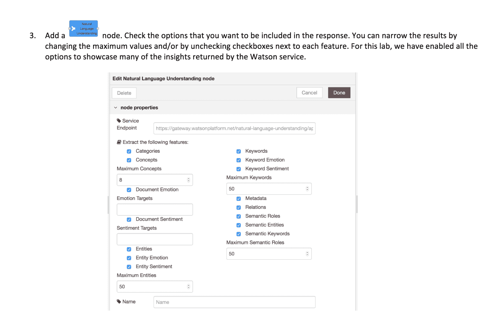
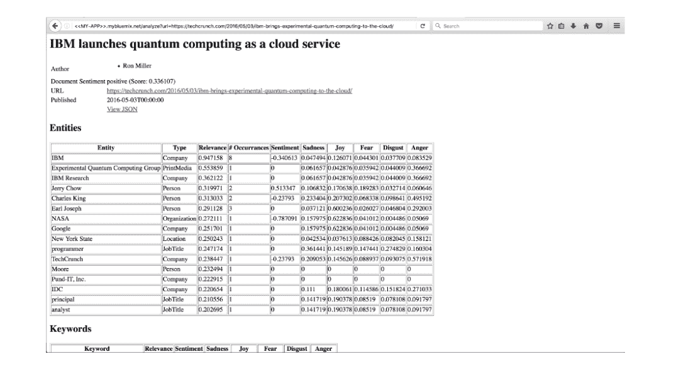

# 利用 Watson Natural Language Understanding 和 Node-RED 拯救生命

> 原文：[`developer.ibm.com/zh/tutorials/tutorial-save-lives-with-natural-language-understanding-and-node-red/`](https://developer.ibm.com/zh/tutorials/tutorial-save-lives-with-natural-language-understanding-and-node-red/)

**免费试用 IBM Cloud**

利用 [IBM Cloud Lite](https://cocl.us/IBM_CLOUD_GCG) 快速轻松地构建您的下一个应用程序。您的免费帐户从不过期，而且您会获得 256 MB 的 Cloud Foundry 运行时内存和包含 Kubernetes 集群的 2 GB 存储空间。[了解所有细节](https://www.ibm.com/cloud/blog/announcements/introducing-ibm-cloud-lite-account-2)并确定如何开始。

## 简介

Watson™ Natural Language Understanding 服务能够提取正文或可公开访问的网站进行分析。在本教程中，我们将分析可通过 URL 访问的一篇新闻文章。您还可以选择分析其他包含正文的 URL。

## 学习目标

完成本教程后，您将能够：

*   在 IBM Cloud 上将 Node-RED Starter Kit 和 Watson Cloud 服务 (Natural Language Understanding API) 实例化
*   将 Watson 服务与 Node-RED 应用程序绑定
*   将新闻文章 URL 发送至 NLU API，并在包含概念、实体、关键字、类别、观点、情感、关系和语义角色的表中检索响应表

## 前提条件

1.  创建一个 [IBM Cloud 帐户](https://cocl.us/IBM_CLOUD_GCG)。
2.  登录到 [IBM Cloud](https://cloud.ibm.com/login?cm_sp=ibmdev-_-developer-tutorials-_-cloudreg)。

## 预估时间

完成本教程大约需要 45-60 分钟。

## 动手实验室

### 第 1 步. 设置 Node-RED Starter Kit

登录并单击导航栏右上角中的 **Catalog**。

单击左侧菜单中的 **Starter Kits**，然后单击 Starter Kit 的 **Node-RED Starter** 选项。Starter Kit 随附有：

*   一个 Cloudant 数据库实例，用于存储流程配置
*   节点集合，便于访问各种 IBM Cloud 服务，包括 Watson、IoT 和区块链服务等等

为您的 Node-RED Starter Kit 写下一个名称。您可在标题中包含“node red”，这样就不会与将来的其他 IBM Cloud 应用程序混淆。

实例化过程需要几分钟（5–15 分钟）时间。完成实例化后，您将在应用程序名称旁看到一个绿色圆圈，旁边显示状态“Running”。单击 **Visit App URL** 以访问您的新 Node-RED Starter Kit。

按照一些设置说明进行操作，即可进入新的 Node-RED 应用程序。您可选择添加用户名或密码，或者保持无保护状态。这由您自行决定。

这里提供了其他一些选项；一直单击 **Next**，直至进入以下最后一个页面。单击 **Go to your Node-RED flow editor**。

您将看到自己的第一个流程。现在即可开始启动自己的首个 Node-RED 流程。大功告成！

### 第 2 步. 在 IBM Cloud 中添加 Natural Language Understanding

单击 IBM Cloud 仪表板右上角的 Catalog 链接。在 AI 部分下，单击 Natural Language Understanding 磁贴。

您可以选择为服务提供定制名称，或者保留给定名称。单击 **Create**。

单击左侧菜单中的 **Connections**。

单击右侧的 **Create connection**。

单击先前创建的 Node-RED 应用程序旁的 **Connect**。

IBM Cloud 将提示重新载入应用程序。单击 **Restage**，应用程序将重新启动，并且在环境中包含新服务凭证。

当应用程序完成重新载入后，打开 Node-RED Flow Editor。如果已打开 Node-RED，那么刷新页面。

### 第 3 步. 在 Node-RED 中分析新闻文章

Watson Natural Language Understanding 服务能够提取正文或可公开访问的 URL，从而提供此服务可分析的内容。在本部分中，我们将分析可通过 URL 访问的一篇新闻文章。您还可以选择分析其他包含正文的 URL。

获取代码片段。

打开浏览器选项卡，并访问应用程序端点，传入内容的 URL：`http://<<MY-APP>>.mybluemix.net/analyze?url=<<URL-TO-STORY>>`。

*   将 `<>` 替换为您选择的 Node-RED 应用程序主机以命名您的应用。
*   将 `<>` 替换为内容的 URL。

根据此 URL 处的内容，您可能会看到属性列表，其中包含概念、实体、关键字、类别、观点、情感、关系、语义角色以及文本中提到的更多内容。

要查看内容的 JSON 表示格式，可在 URL 查询字符串中插入 `format=json`。

最后，返回步骤 3，通过禁用部分功能进行试验，查看生成的结果如何改变。尝试分析其他 URL，查看返回的结果如何。

## 结束语

本教程中说明了如何分析可通过 URL 访问的新闻文章。在本教程中，您学会了如何在 IBM Cloud 上将 Node-RED Starter Kit 和 Watson Cloud 服务实例化，如何将 Watson 服务与 Node-RED 应用程序绑定，以及将新闻文章 URL 发送到 Natural Language Understanding API。查看所有 [Watson 服务](https://cloud.ibm.com/catalog?category=ai?cm_sp=ibmdev-_-developer-tutorials-_-cloudreg)，了解如何在应用中使用这些服务。

本文翻译自：[Save lives with Watson Natural Language Understanding and Node-RED](https://developer.ibm.com/tutorials/tutorial-save-lives-with-natural-language-understanding-and-node-red/)（2019-01-18）