# 深度学习框架 Caffe2 在 Kubernetes 上的实践

> 原文：[`developer.ibm.com/zh/tutorials/cc-lo-deep-learning-framework-caffe2-practice-on-kubernetes/`](https://developer.ibm.com/zh/tutorials/cc-lo-deep-learning-framework-caffe2-practice-on-kubernetes/)

## 前言

**免费试用 IBM Cloud**

利用 [IBM Cloud Lite](https://cocl.us/IBM_CLOUD_GCG) 快速轻松地构建您的下一个应用程序。您的免费帐户从不过期，而且您会获得 256 MB 的 Cloud Foundry 运行时内存和包含 Kubernetes 集群的 2 GB 存储空间。[了解所有细节](https://developer.ibm.com/dwblog/2017/building-with-ibm-watson/)并确定如何开始。

据统计，2020 年人类将创造 44 个 zettabytes（即 44 万亿千兆字节）的数据。如何围绕数据进行挖掘从而创造出价值，是值得思考的。人工智能、机器学习和深度学习都是基于大量的数据、充分挖掘数据的价值。目前，在深度学习领域有诸多算法。本文将介绍的 Caffe2 最大的特点就是轻量、模块化和扩展性好，它可以方便地为手机等移动终端设备带来 AI 加持，让 AI 从云端走向终端。接下来，本文会展示如何基于 Kubernetes 部署和应用深度学习中的神经网络 Caffe2。

## 工具概览

### Caffe2 介绍

Caffe2 是一个开源神经网络框架，也是一个深度学习框架，由 Facebook 推出。Caffe2 是盛名已久的开源框架 Caffe 的升级版本。Caffe2 在 Caffe 基础上集成了诸多新出现的算法和模型，加强了框架在轻量级硬件平台的部署能力，利于让开发者在移动设备上部署 AI 模型，快速准确地处理相关分析任务。Caffe2 使我们可以用简单直接的方式来体验深度学习，您可在 [github](https://github.com/facebookarchive/caffe2) 上了解更多 Caffe2 相关内容。 Caffe2 本身是不带数据可视化功能。我们可以 Jupyter Notebook 来实现 Caffe2 的接口可视化。

### Jupyter Notebook 介绍

Jupyter 类似于一个 IDE 工具，将 Python 代码搬到浏览器上去执行，以富文本方式显示，使得整个工作可以以笔记的形式展现、存储，对于交互编程、学习非常方便。本文实验会基于 Jupyter 做展现。

接下来，我们展示在 Kubernetes 集群上部署 Caffe2。

## 在 Kubernetes 集群中部署 Caffe2

查看已经部署好 Kubernetes 集群。

##### 图 1\. 查看 Kubernetes 集群

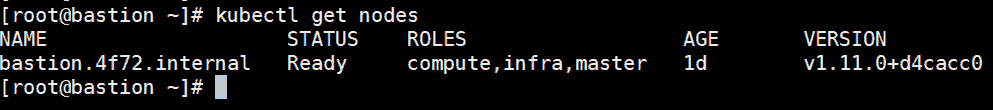

我们确认 Kubernetes 集群中已经有 GPU 的资源，型号是 NVIDIA Tesla K80。

##### 图 2\. 查看 Kubernetes 集群中 GPU 的型号

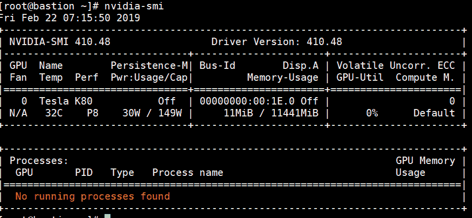

接下来，使用如下模板在 Kubernetes 集群中部署 Caffe2 的 pod：

##### 清单 1\. Caffe2 部署模板

```
kind: List
apiVersion: v1
metadata: {}
items:
- apiVersion: v1
  kind: Service
  metadata:
    name: caffe2
    labels:
      app: caffe2
  spec:
    ports:
    - name: caffe2
      port: 80
      targetPort: 8888
      protocol: TCP
    selector:
      app: caffe2
- apiVersion: v1
  kind: Pod
  metadata:
    name: caffe2
    labels:
      app: caffe2
  spec:
    containers:
      - name: caffe2
        image: "caffe2ai/caffe2"
        command: ["Jupyter"]
        args: ["notebook", "--allow-root", "--ip=0.0.0.0", "--no-browser"]
        ports:
        - containerPort: 8888
        securityContext:
          privileged: true
        resources:
          limits:
            nvidia.com/gpu: 1 # requesting 2 GPU
    tolerations:
    - key: "nvidia.com/gpu"
      operator: "Equal"
      value: "value"
      effect: "NoSchedule" 
```

上面模板用到了 [caffe2 docker image](https://hub.docker.com/r/caffe2ai/caffe2/) 。docker image 中包含了 Jupyter。接下来，将模板下载到本地，部署到 Kubernetes 集群中。

##### 图 3\. 在 Kubernetes 集群中部署 caffe2

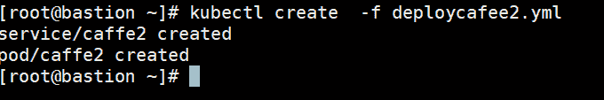

确认 pod 部署成功。

##### 图 4\. 确认 caffe2 pod 部署成功

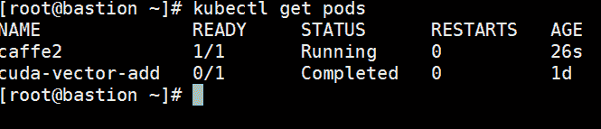

获取 Caffe2 中 Jupyter 访问路径。

##### 清单 2\. 获取 caffe2 pod 中 Jupyter 访问路径

```
[root@bastion ~]# ROUTE=$(kubectl get routes -n nvidia-device-plugin | grep caffe2 | awk '{print $2}')
[root@bastion ~]# TOKEN=$(kubectl logs -n nvidia-device-plugin pod/caffe2|head -4|grep token=|awk -Ftoken= '{print $2}')
[root@bastion ~]# echo http://$ROUTE/notebooks/caffe2/caffe2/Python/tutorials/MNIST.ipynb?token=$TOKEN
http://david-nvidia-device-plugin/notebooks/caffe2/caffe2/Python/tutorials/MNIST.ipynb?token=c2e5cb4b1ba9610b05401ee61c19abae6d21f8eaa473c17e 
```

通过浏览器访问获取到的 Jupyter 的地址：

##### 图 5\. Jupyter 页面访问

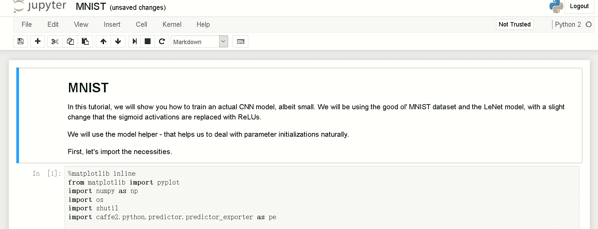

我们需要初始化环境。在 Jupyter 中单击 Kernel，然后单击 Restart＆Clear Output。

##### 图 6\. 重启 kernel 并清空输出

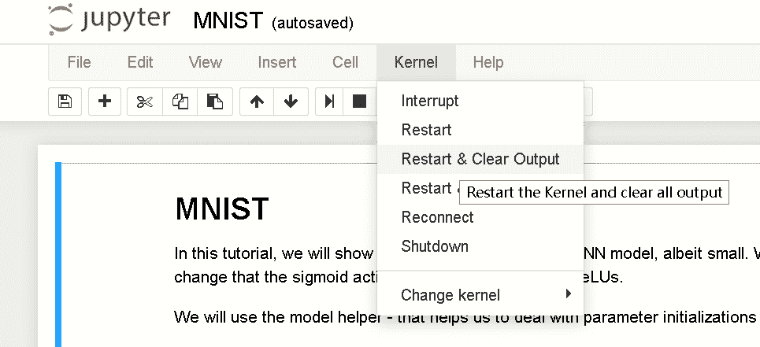

单击 Kernel、单击 Restart＆Run All，触发 Jupyter 按顺序开始执行笔记本中的每行代码。

##### 图 7\. 重启 kernel 并重新运行代码

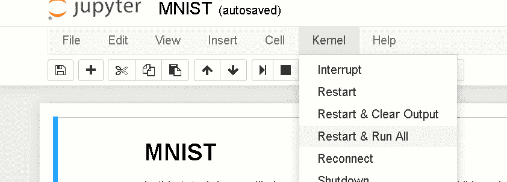

Jupyter 中一共有 17 段代码，接下来我们进行详细分析。

## 代码分析

### 整体代码逻辑

在实验中，我们先导入需要的模块，然后加载 MNIST 数据源（一个入门级的计算机视觉数据集）。

接下来我们定义四个重要的模块：

*   定义输入模块：模块作用是加载训练样本。
*   定义主要计算部分（AddLeNetModel 函数）：模块作用是将神经网络的预测转换为概率。
*   定义训练部分，即添加梯度算子等（AddTrainingOperators 函数）。
*   定义了记录模块（AddBookkeepingOperators 函数）：收集统计信息并将其打印到文件或日志。

在定义了四个模块以后，我们创建训练模型。加载 MNIST 作为训练的样本。加载的模型经过训练（训练 200 次）后，可以判断输入的图片是哪个数字的概率，以此来帮助我们确认图片中的数字。当识别的准确率到达我们预期时，保存模型，以便使用。

接下来，我们进入正题，介绍整个实验的实现过程。

### 导入模块

如下面清单 3 所示，该代码段的作用是导入实验所需的模块。

##### 清单 3\. 导入模块

```
%matplotlib inline
from matplotlib import pyplot
import numpy as np
import os
import shutil
import caffe2.Python.predictor.predictor_exporter as pe

from caffe2.Python import core, model_helper, net_drawer, workspace, visualize, brew

# If you would like to see some really detailed initializations,
# you can change --caffe2_log_level=0 to --caffe2_log_level=-1
core.GlobalInit(['caffe2', '--caffe2_log_level=0'])
print("Necessities imported!") 
```

接下来，我们对导入的模块做简单的介绍。

[Matplotlib](https://matplotlib.org/) ，是一个 Python 2D 绘图库，可以生成各种硬拷贝格式和跨平台的交互式环境的出版物质量数据。Matplotlib 可用于 Python 脚本，Python 和 IPython shell、Jupyter 笔记本等。

##### 图 8\. Matplotlib 绘图库

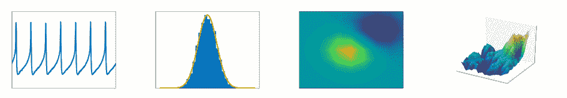

matplotlib.pyplot 是命令样式函数的集合，使 matplotlib 像 MATLAB 一样工作。每个 pyplot 函数对图形进行一些更改：例如，创建图形，在图形中创建绘图区域，在绘图区域绘制一些线条，用标签装饰图形等。

Numpy 是 Python 的一个科学计算的库，提供了矩阵运算的功能，其一般与 Scipy、matplotlib 一起使用

shutil 模块对文件和文件集合提供了许多高级操作，如支持文件复制和删除的功能。

import caffe2 的 package，用于做预测。详细内容请参考链接 [`caffe2.ai/doxygen-Python/html/namespaces.html`](https://caffe2.ai/doxygen-python/html/namespaces.html) 。

本段代码的执行结果是导入成功，如下所示。

`Necessities imported!`

### 加载源数据

MNIST 是一个入门级的计算机视觉数据集，它包含各种手写数字图片。我们现在将数据集压缩包 mnist-lmdb.zip 解压。

##### 图 9\. mnist-lmdb.zip 解压缩

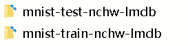

打开目录，里面是.mdb 文件。

##### 图 10\. .mdb 文件

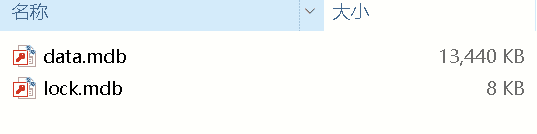

本段代码最终的执行了如下操作：从 [`download.caffe2.ai/databases/mnist-lmdb.zip`](http://download.caffe2.ai/databases/mnist-lmdb.zip) 下载数据集到/root/caffe2_notebooks/tutorial_data/mnist 目录，然后解压缩成两个目录。代码内容如下。

##### 清单 4\. 第二段代码

```
# This section preps your image and test set in a lmdb database
def DownloadResource(url, path):
    '''Downloads resources from s3 by url and unzips them to the provided path'''
    import requests, zipfile, StringIO
    print("Downloading... {} to {}".format(url, path))
    r = requests.get(url, stream=True)
    z = zipfile.ZipFile(StringIO.StringIO(r.content))
    z.extractall(path)
    print("Completed download and extraction.")

current_folder = os.path.join(os.path.expanduser('~'), 'caffe2_notebooks')
data_folder = os.path.join(current_folder, 'tutorial_data', 'mnist')
root_folder = os.path.join(current_folder, 'tutorial_files', 'tutorial_mnist')
db_missing = False

if not os.path.exists(data_folder):
    os.makedirs(data_folder)
    print("Your data folder was not found!! This was generated: {}".format(data_folder))

# Look for existing database: lmdb
if os.path.exists(os.path.join(data_folder,"mnist-train-nchw-lmdb")):
    print("lmdb train db found!")
else:
    db_missing = True

if os.path.exists(os.path.join(data_folder,"mnist-test-nchw-lmdb")):
    print("lmdb test db found!")
else:
    db_missing = True

# attempt the download of the db if either was missing
if db_missing:
    print("one or both of the MNIST lmbd dbs not found!!")
    db_url = "http://download.caffe2.ai/databases/mnist-lmdb.zip"
    try:
        DownloadResource(db_url, data_folder)
    except Exception as ex:
        print("Failed to download dataset. Please download it manually from {}".format(db_url))
        print("Unzip it and place the two database folders here: {}".format(data_folder))
        raise ex

if os.path.exists(root_folder):
    print("Looks like you ran this before, so we need to cleanup those old files...")
    shutil.rmtree(root_folder)

os.makedirs(root_folder)
workspace.ResetWorkspace(root_folder)

print("training data folder:" + data_folder)
print("workspace root folder:" + root_folder) 
```

本段代码执行结果如下，数据加载成功。

##### 图 11\. 第二段代码执行结果

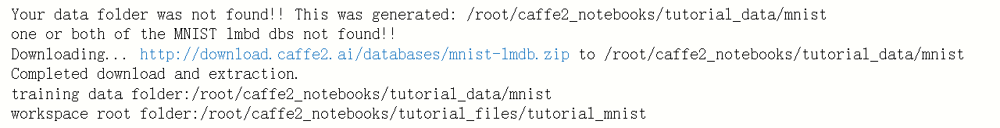

### 定义输入模块

为了将整个实验代码模块化，实验一共定义了四个模块。本段代码是定义了模型的数据输入部分。

##### 清单 5\. 第三段代码

```
def AddInput(model, batch_size, db, db_type):
    # load the data
    data_uint8, label = model.TensorProtosDBInput(
        [], ["data_uint8", "label"], batch_size=batch_size,
        db=db, db_type=db_type)
    # cast the data to float
    data = model.Cast(data_uint8, "data", to=core.DataType.FLOAT)
    # scale data from [0,255] down to [0,1]
    data = model.Scale(data, data, scale=float(1./256))
    # don't need the gradient for the backward pass
    data = model.StopGradient(data, data)
    return data, label 
```

本段代码一共由四部分组成。

1.  AddInput 从 DB 加载数据。
2.  把数据转换为浮点数据类型。
3.  出于数值稳定性考虑，数据表示的范围从[0,255]缩小为[0,1]。
4.  StopGradient 作用是：不参与前向传播后反向传播。

### 定义计算部分模块

第四段代码中定义了主要计算部分（AddLeNetModel 函数），它的作用是将神经网络的预测转换为概率

##### 清单 6\. 第四段代码

```
def AddLeNetModel(model, data):
    '''
    This part is the standard LeNet model: from data to the softmax prediction.

    For each convolutional layer we specify dim_in - number of input channels
    and dim_out - number or output channels. Also each Conv and MaxPool layer changes the
    image size. For example, kernel of size 5 reduces each side of an image by 4.

    While when we have kernel and stride sizes equal 2 in a MaxPool layer, it divides
    each side in half.
    '''
    # Image size: 28 x 28 -> 24 x 24
    conv1 = brew.conv(model, data, 'conv1', dim_in=1, dim_out=20, kernel=5)
    # Image size: 24 x 24 -> 12 x 12
    pool1 = brew.max_pool(model, conv1, 'pool1', kernel=2, stride=2)
    # Image size: 12 x 12 -> 8 x 8
    conv2 = brew.conv(model, pool1, 'conv2', dim_in=20, dim_out=50, kernel=5)
    # Image size: 8 x 8 -> 4 x 4
    pool2 = brew.max_pool(model, conv2, 'pool2', kernel=2, stride=2)
    # 50 * 4 * 4 stands for dim_out from previous layer multiplied by the image size
    fc3 = brew.fc(model, pool2, 'fc3', dim_in=50 * 4 * 4, dim_out=500)
    fc3 = brew.relu(model, fc3, fc3)
    pred = brew.fc(model, fc3, 'pred', 500, 10)
    softmax = brew.softmax(model, pred, 'softmax')
return softmax 
```

预测过程使用了 LeNet，这是一种用于手写体字符识别的非常高效的卷积神经网络。在模型中，输入的二维图像，先经过两次卷积层到池化层、再经过全连接层，最后使用 softmax 分类作为输出层的预测结果。预测结果将在 0 到 1 之间的范围。概率越接近 1，预测的匹配度越高。

在代码中，dim_in 是输入通道的数量，dim_out 是输出通道的数量。conv1 有 1 个通道进入（dim_in），20 个进入（dim_out），而 conv2 有 20 个进入，50 个出去，fc3 有 50 个进入，500 个出去。沿着每个卷积，图像将会被转换为更小的尺寸。

### 增加精确运算符

本段代码定义了 AddAccuracy 函数，为模型添加了精度运算符。我们将在下一个函数中使用它来跟踪模型的准确性。

##### 清单 7\. 第五段代码

```
def AddAccuracy(model, softmax, label):
    """Adds an accuracy op to the model"""
    accuracy = brew.accuracy(model, [softmax, label], "accuracy")
    return accuracy 
```

### 增加梯度算子

第六段代码中定义训练部分，定义 AddTrainingOperators 函数。

##### 清单 8\. 第六段代码

```
def AddTrainingOperators(model, softmax, label):
    """Adds training operators to the model."""
    xent = model.LabelCrossEntropy([softmax, label], 'xent')
    # compute the expected loss
    loss = model.AveragedLoss(xent, "loss")
    # track the accuracy of the model
    AddAccuracy(model, softmax, label)
    # use the average loss we just computed to add gradient operators to the model
    model.AddGradientOperators([loss])
    # do a simple stochastic gradient descent
    ITER = brew.iter(model, "iter")
    # set the learning rate schedule
    LR = model.LearningRate(
        ITER, "LR", base_lr=-0.1, policy="step", stepsize=1, gamma=0.999 )
    # ONE is a constant value that is used in the gradient update. We only need
    # to create it once, so it is explicitly placed in param_init_net.
    ONE = model.param_init_net.ConstantFill([], "ONE", shape=[1], value=1.0)
    # Now, for each parameter, we do the gradient updates.
    for param in model.params:
        # Note how we get the gradient of each parameter - ModelHelper keeps
        # track of that.
        param_grad = model.param_to_grad[param]
        # The update is a simple weighted sum: param = param + param_grad * LR
        model.WeightedSum([param, ONE, param_grad, LR], param) 
```

### 定义记录模块

本段代码定义了记录部分（AddBookkeepingOperators 函数）。作用是方便后续检查的操作日志。本段代码只收集统计信息并将其打印到文件或日志中，不会影响训练过程：

##### 清单 9\. 第七段代码

```
def AddBookkeepingOperators(model):
    """This adds a few bookkeeping operators that we can inspect later.

    These operators do not affect the training procedure: they only collect
    statistics and prints them to file or to logs.
    """
    # Print basically prints out the content of the blob. to_file=1 routes the
    # printed output to a file. The file is going to be stored under
    #     root_folder/[blob name]
    model.Print('accuracy', [], to_file=1)
    model.Print('loss', [], to_file=1)
    # Summarizes the parameters. Different from Print, Summarize gives some
    # statistics of the parameter, such as mean, std, min and max.
    for param in model.params:
        model.Summarize(param, [], to_file=1)
        model.Summarize(model.param_to_grad[param], [], to_file=1)
    # Now, if we really want to be verbose, we can summarize EVERY blob
    # that the model produces; it is probably not a good idea, because that
    # is going to take time - summarization do not come for free. For this
    # demo, we will only show how to summarize the parameters and their
# gradients. 
```

### 创建训练模型

本段代码创建用于训练和测试的模型。即调用上面代码定义的四个模块，完成训练。

##### 清单 10\. 第八段代码

```
arg_scope = {"order": "NCHW"}
train_model = model_helper.ModelHelper(name="mnist_train", arg_scope=arg_scope)
data, label = AddInput(
    train_model, batch_size=64,
    db=os.path.join(data_folder, 'mnist-train-nchw-lmdb'),
    db_type='lmdb')
softmax = AddLeNetModel(train_model, data)
AddTrainingOperators(train_model, softmax, label)
AddBookkeepingOperators(train_model)

test_model = model_helper.ModelHelper(
    name="mnist_test", arg_scope=arg_scope, init_params=False)
data, label = AddInput(
    test_model, batch_size=100,
    db=os.path.join(data_folder, 'mnist-test-nchw-lmdb'),
    db_type='lmdb')
softmax = AddLeNetModel(test_model, data)
AddAccuracy(test_model, softmax, label)

# Deployment model. We simply need the main LeNetModel part.
deploy_model = model_helper.ModelHelper(
    name="mnist_deploy", arg_scope=arg_scope, init_params=False)
AddLeNetModel(deploy_model, "data")
# You may wonder what happens with the param_init_net part of the deploy_model.
# No, we will not use them, since during deployment time we will not randomly
# initialize the parameters, but load the parameters from the db. 
```

##### 图 12.代码执行结果

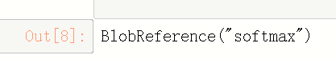

本段代码执行输出：

### 展示模型外观

本段代码使用 Caffe2 具有的简单图形可视化工具，展示训练模型。

##### 清单 11\. 第九段代码

```
from IPython import display
graph = net_drawer.GetPydotGraph(train_model.net.Proto().op, "mnist", rankdir="LR")
display.Image(graph.create_png(), width=800) 
```

执行结果：

##### 图 13\. 代码执行结果

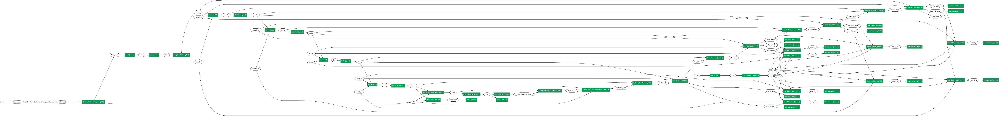

### 展示训练过程

通过本段代码，展示训练阶段的过程。

##### 清单 12\. 第十段代码

```
graph = net_drawer.GetPydotGraphMinimal(
    train_model.net.Proto().op, "mnist", rankdir="LR", minimal_dependency=True)
display.Image(graph.create_png(), width=800) 
```

##### 图 14\. 训练过程

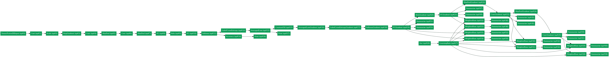

### 运行神经网络

接下来，我们运行神经网络：

##### 清单 13\. 第十一段代码

```
print(str(train_model.param_init_net.Proto())[:400] + '\n...') 
```

输出结果如下图。

##### 图 15\. 输出结果

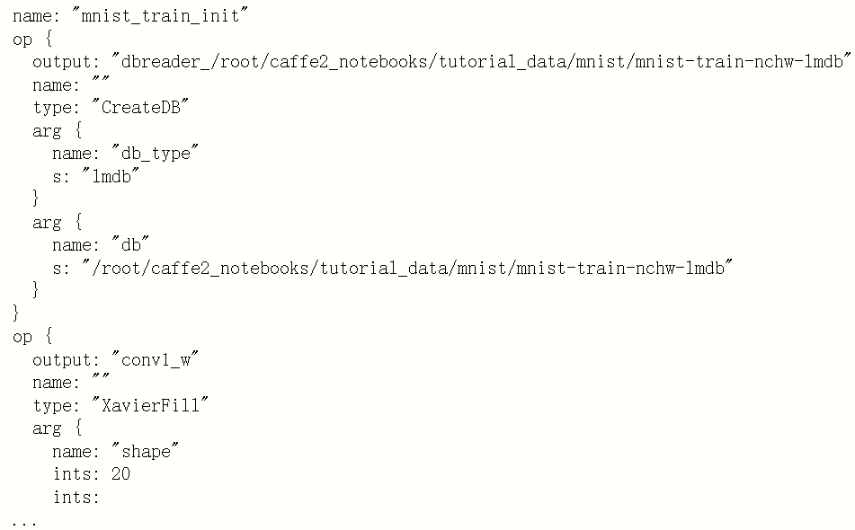

### 存储协议缓存

本段代码将协议缓冲区转储到磁盘，以便后续查看。

##### 清单 14\. 第十二段代码

```
with open(os.path.join(root_folder, "train_net.pbtxt"), 'w') as fid:
    fid.write(str(train_model.net.Proto()))
with open(os.path.join(root_folder, "train_init_net.pbtxt"), 'w') as fid:
    fid.write(str(train_model.param_init_net.Proto()))
with open(os.path.join(root_folder, "test_net.pbtxt"), 'w') as fid:
    fid.write(str(test_model.net.Proto()))
with open(os.path.join(root_folder, "test_init_net.pbtxt"), 'w') as fid:
    fid.write(str(test_model.param_init_net.Proto()))
with open(os.path.join(root_folder, "deploy_net.pbtxt"), 'w') as fid:
    fid.write(str(deploy_model.net.Proto()))
print("Protocol buffers files have been created in your root folder: " + root_folder) 
```

#### 输出结果：

##### 清单 15\. 执行结果

```
Protocol buffers files have been created in your root folder: /root/caffe2_notebooks/tutorial_files/tutorial_mnist 
```

### 运行训练程序

接下来我们将运行训练程序，迭代 200 次。

##### 清单 16\. 第十三段代码

```
# The parameter initialization network only needs to be run once.
workspace.RunNetOnce(train_model.param_init_net)
# creating the network
workspace.CreateNet(train_model.net, overwrite=True)
# set the number of iterations and track the accuracy & loss
total_iters = 200
accuracy = np.zeros(total_iters)
loss = np.zeros(total_iters)
# Now, we will manually run the network for 200 iterations.
for i in range(total_iters):
    workspace.RunNet(train_model.net)
    accuracy[i] = workspace.FetchBlob('accuracy')
    loss[i] = workspace.FetchBlob('loss')
# After the execution is done, let's plot the values.
pyplot.plot(loss, 'b')
pyplot.plot(accuracy, 'r')
pyplot.legend(('Loss', 'Accuracy'), loc='upper right') 
```

代码输出，展示的是预测的准确率。在下图中，横坐标是训练的次数，纵坐标是比率。我们可以看到，随着训练次数的增加，准确率越来越高，Loss 的比率越来越低。

##### 图 16\. 输出结果

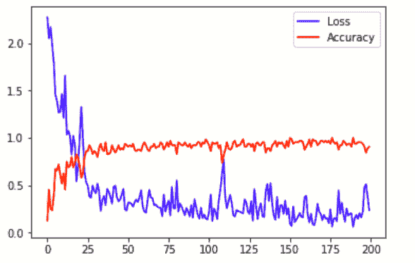

### 预测抽样

现在我们可以对一些数据和预测进行抽样。预测第一张图片。

##### 清单 17\. 第十四段代码

```
# Let's look at some of the data.
pyplot.figure()
data = workspace.FetchBlob('data')
_ = visualize.NCHW.ShowMultiple(data)
pyplot.figure()
softmax = workspace.FetchBlob('softmax')
_ = pyplot.plot(softmax[0], 'ro')
pyplot.title('Prediction for the first image') 
```

输出结果中，我们可以看到，被预测的第一张图片（下图第一个图右上角的 5），被预测的结果是：它是 5（横坐标代表数字，纵坐标代表识别率）的概率是最高的，接近 1.

##### 图 17\. 输出结果

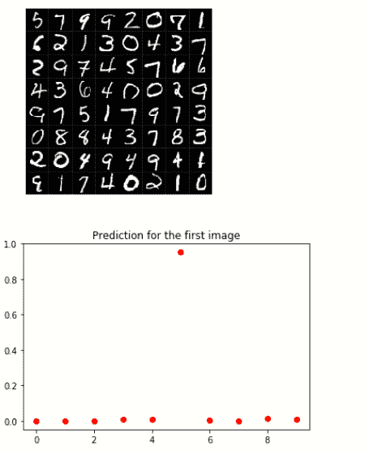

### 运行 100 次测试

接下来，运行 100 次迭代，查看预测的准确性。

##### 清单 18\. 第十五段代码

```
# run a test pass on the test net
workspace.RunNetOnce(test_model.param_init_net)
workspace.CreateNet(test_model.net, overwrite=True)
test_accuracy = np.zeros(100)
for i in range(100):
    workspace.RunNet(test_model.net.Proto().name)
    test_accuracy[i] = workspace.FetchBlob('accuracy')
# After the execution is done, let's plot the values.
pyplot.plot(test_accuracy, 'r')
pyplot.title('Acuracy over test batches.')
print('test_accuracy: %f' % test_accuracy.mean()) 
```

输出结果，可以看到，准确与为 94.51%。

##### 图 18\. 输出结果

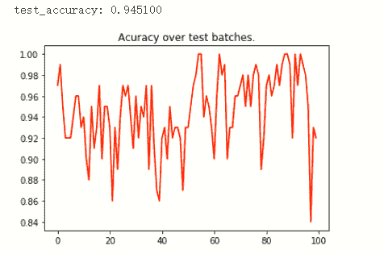

### 保存数据

让我们将部署模型与经过训练的权重和偏差保存到文件中。

##### 清单 19\. 第十七段代码

```
# construct the model to be exported
# the inputs/outputs of the model are manually specified.
pe_meta = pe.PredictorExportMeta(
    predict_net=deploy_model.net.Proto(),
    parameters=[str(b) for b in deploy_model.params],
    inputs=["data"],
    outputs=["softmax"],
)

# save the model to a file. Use minidb as the file format
pe.save_to_db("minidb", os.path.join(root_folder, "mnist_model.minidb"), pe_meta)
print("The deploy model is saved to: " + root_folder + "/mnist_model.minidb") 
```

输出结果：

##### 图 19\. 输出结果

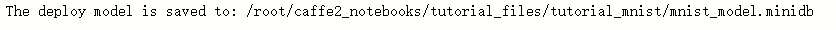

### 加载模型

现在我们可以加载模型并运行预测来验证它的工作原理。

##### 清单 20\. 第十七段代码

```
# we retrieve the last input data out and use it in our prediction test before we scratch the workspace
blob = workspace.FetchBlob("data")
pyplot.figure()
_ = visualize.NCHW.ShowMultiple(blob)

# reset the workspace, to make sure the model is actually loaded
workspace.ResetWorkspace(root_folder)

# verify that all blobs are destroyed.
print("The blobs in the workspace after reset: {}".format(workspace.Blobs()))

# load the predict net
predict_net = pe.prepare_prediction_net(os.path.join(root_folder, "mnist_model.minidb"), "minidb")

# verify that blobs are loaded back
print("The blobs in the workspace after loading the model: {}".format(workspace.Blobs()))

# feed the previously saved data to the loaded model
workspace.FeedBlob("data", blob)

# predict
workspace.RunNetOnce(predict_net)
softmax = workspace.FetchBlob("softmax")

# the first letter should be predicted correctly
pyplot.figure()
_ = pyplot.plot(softmax[0], 'ro')
pyplot.title('Prediction for the first image') 
```

输出结果中，我们可以看到第一张图片（左上角的 8），被识别成数字 8 的概率是最高的，接近 1。

##### 图 20\. 输出结果

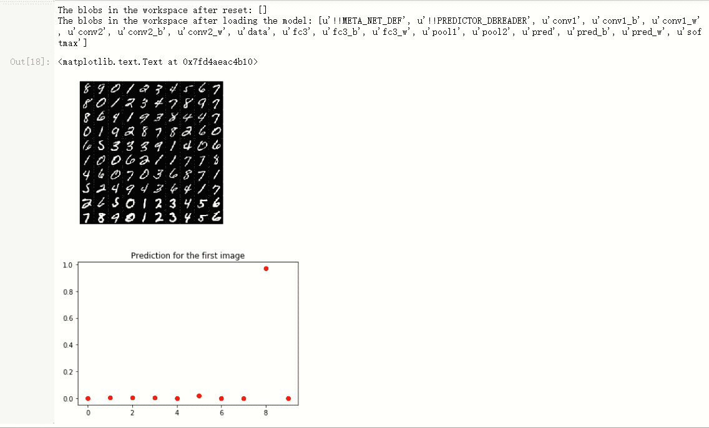

接下来我们可以修改第十七段代码，再预测第二张（softmax[1]）、第十张图片（softmax[9]）。

第二张图片是 9，其预测结果可以看出，数字是 9 的概率是最高的。

##### 图 21\. 输出结果

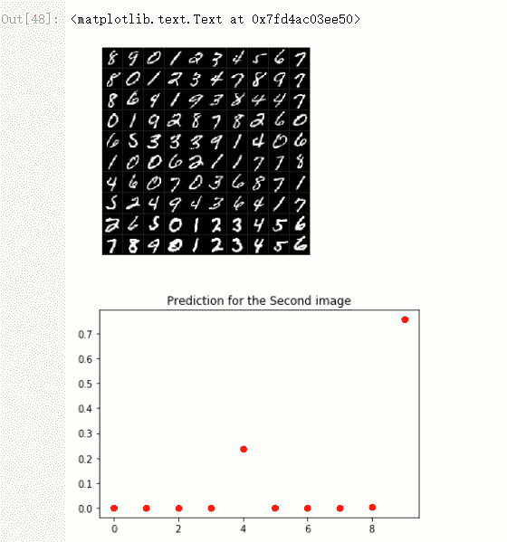

第十张图片是 7，我们进行预测，从输出结果可以看到，图标预测它为 7 的概率是最高的。

##### 图 22\. 输出结果

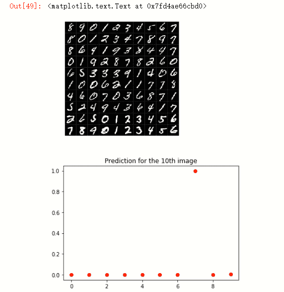

由此可知，训练完的模型识别率很高，是可用的。

## 结束语

通过本文，相信读者对 Caffe2 的功能有了一定的了解。随着 Kubernetes 的普及，GPU 生产厂商也纷纷支持容器化，很多 AI 相关的算法也都支持 Kubernetes。相信会有越来越多 AI 相关的场景运行在 Kubernetes 上。

## 参考资源

*   [Caffe2 测试代码](https://gist.github.com/thoraxe/09679a3daa20614a1069b59becca6d25)
*   [人工智能在邮件领域的应用](http://www.ibm.com/developerworks/cn/cloud/library/cl-lo-application-of-artificial-intelligence-in-mail/index.html)
*   [卷积神经网络](http://www.ibm.com/developerworks/cn/cognitive/library/cc-convolutional-neural-network-vision-recognition/index.html)