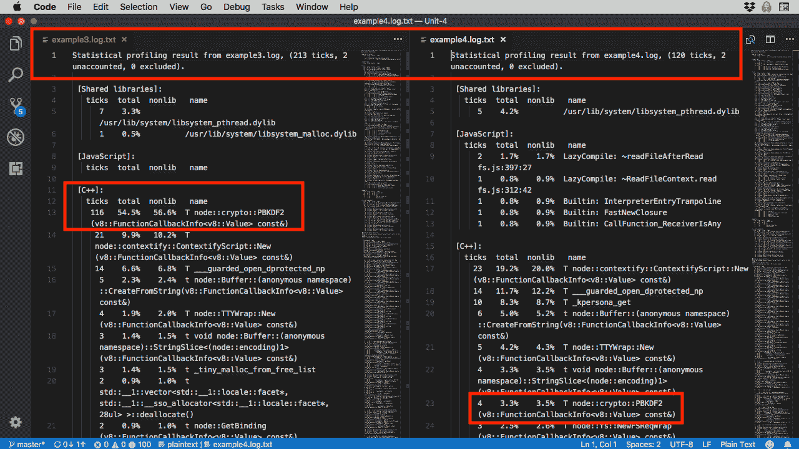
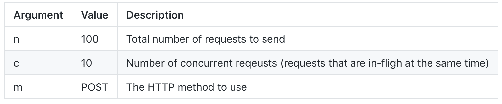
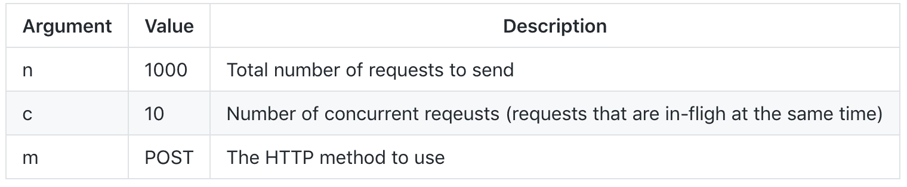
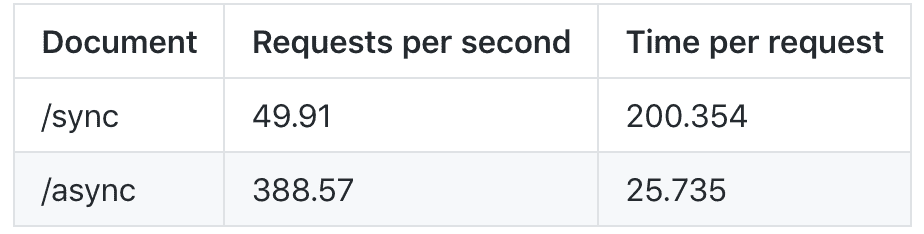

# 探索 Node.js 基本概念

> 原文：[`developer.ibm.com/zh/tutorials/learn-nodejs-node-basic-concepts/`](https://developer.ibm.com/zh/tutorials/learn-nodejs-node-basic-concepts/)

在 Node.js 学习路径的第 4 单元中，我将深入介绍异步和同步编程。为充分理解这一概念，我将展示三种不同场景对这两种编程模型进行比较，并演示 Node 的异步编程模型如此强大的原因。

##### Node.js 学习路径

本教程已纳入 Node.js 学习路径。各单元之间相辅相成，查看 Node.js 学习路径概述，以便从头开始学习。

在整个学习过程中，我们还涵盖了一些关键的概念，包括 Node.js 的模块系统、性能概要分析以及 Node 的 `http` 模块。

## 获取代码

您在此学习路径中要运行的代码及相关示例位于我的 GitHub 存储库中。

[获取代码](https://github.com/jstevenperry/IBM-Developer/tree/master/Node.js/Course)

## Node 编程风格

如果您在网上搜索 Node.js，不必浏览众多搜索结果便可得知：Node.js 使用**非阻塞**（异步）编码风格。您可能会想：“Node 为何要迫使开发者这样做？”我将在此单元中回答这个问题，并为您再提供一些 Node 工具。

首先，我想通过一个案例来解释阻塞（同步）编码与非阻塞（异步）编码之间的差异。

## 银行和咖啡店

这个案例与银行和咖啡店这两种常见的商业类型有关。虽然它们的服务目的大相径庭，但基本上，它们都是出于为我们服务而存在的，只是服务方式截然不同。

### 银行（阻塞）

您走进当地一家银行分行，一群客户在您前面排队。队伍前面是几个柜员窗口，每个开放窗口后面都坐着一位柜员，正在为一名客户服务。

银行的交易处理模型采用**阻塞**方式：

*   一名柜员每次只能帮助一名客户。
*   此柜员按顺序处理交易中的所有步骤。
*   如果柜员无法处理交易中的某个步骤（假设需要经过监管人员审批），此柜员的服务进程将会**被阻塞**，并等待审批，经过审批后才能继续处理业务。
*   当整个交易完成后，您会离开柜员窗口。

为服务更多客户或者加速为客户服务，此模型可通过两种方式进行扩展：

*   垂直 – 添加更多柜员
*   水平 – 添加更多银行分行

银行业务交易的本质是**同步**交易。柜员必须独自完成交易中的所有步骤，然后才能帮助另一名客户。

### 咖啡店（非阻塞）

您走进当地一家咖啡店，一群客户在您前面排队。队伍前面是一名柜台员工，他负责接单并处理付款，柜台后有一名或两名咖啡调配师在准备订单。

咖啡店的交易处理模型采用**非阻塞**方式：

*   一名柜台员工每次只能帮助一名客户。
*   一名咖啡调配师每次准备一份订单。
*   柜台员工和咖啡调配师*共享*所有步骤以完成客户订单。
*   在咖啡调配师准备订单时，柜台员工服务进程**不受阻塞**，他仍可接取另一名客户的订单。
*   稍后，当您的订单准备就绪时，就会叫您的名字，您上前取咖啡。

为服务更多客户或者加速为客户服务，此模型可通过两种方式进行扩展：

*   垂直 – 添加更多咖啡调配师
*   水平 – 添加更多咖啡店

咖啡店交易的本质是**异步**交易。柜台员工仅接单、处理付款并收集足够的信息，以便在客户订单准备就绪时可通知客户。随后，此柜台员工便可帮助下一位客户，而与此同时，咖啡调配师则负责履行订单。

### 阻塞式与非阻塞式的对比

阻塞式：在银行，柜员会自始至终为您提供帮助。排在您后面的客户必须等待您完成整个交易。如果柜员无法完成交易中的某个步骤，那么在完成该步骤期间，该柜员的服务进程会被阻塞。

非阻塞式：在咖啡店，柜台员工和咖啡调配师协同工作来完成您的订单。柜台员工接取您的订单，在咖啡调配师完成您的订单时，其服务进程不会被阻塞。

我知道这种类比并非无懈可击（有些银行通过多名柜员完成交易，有些咖啡店则有多人接单），我只是希望您由此能够理解这两种编程模型之间的差异。

Node 使用咖啡店模型。通过单一执行线程运行所有 JavaScript 代码，并且由您提供回调以等待结果。

其他软件堆栈使用银行模型。为进行扩展，将创建更多线程（或进程）。Apache Web 服务器就是一个使用银行可扩展性模型的示例。

当然，这两种模型均可通过添加更多服务器来实现水平可扩展性。

### 异步编程的“黑暗面”：“善于沟通”的咖啡店柜台员工

现在要说的是非阻塞式模型的“黑暗面”：“善于沟通”的咖啡店柜台员工。如果柜台员工更喜欢与每位客户闲聊，而不是积极接单和处理付款，那会怎样？队伍会越排越长，咖啡调配师无所事事，整个流程也会渐渐停滞不前。

Node 编程同样也可能发生这种情况，只要某个应用程序没有正常运行，就会导致整个流程停滞或运行速度放缓。在本教程中，我将向您展示如何对 JavaScript 代码进行概要分析，找出性能欠佳的“热点”。

## 同步与异步的对比 – 场景一

Node.js 官网关于[阻塞式 I/O 的定义](https://nodejs.org/en/docs/guides/blocking-vs-non-blocking/#blocking)如下：

> “**阻塞**表示 Node.js 进程中其他 JavaScript 的执行必须等到非 JavaScript 操作完成后才能继续的情况。发生这种情况的原因在于，当发生**阻塞**操作时，事件循环无法继续运行 JavaScript。
> 
> 在 Node.js 中，由于 CPU 占用率高而不是等待非 JavaScript 操作（如 I/O）导致性能欠佳的 JavaScript 通常并不被称为**阻塞**。”

在第一个示例（场景一）中，为了介绍此主题，我随意改动了这一定义。在讨论阻塞与非阻塞方式的真实对比示例之前，我要先感谢您的理解。稍后我们会谈到这个话题。

### 获取代码

在学习路径的 [GitHub 存储库](https://github.com/jstevenperry/IBM-Developer/tree/master/Node.js/Course/Unit-4)中提供了以下所有源代码示例。为节省清单空间，我移除了注释并添加了行号，以便于我对一些具体的代码行进行解释。我鼓励您从 GitHub 克隆代码，并在学习本课程的每个单元时，与我一起运行这些示例。

[获取代码](https://github.com/jstevenperry/IBM-Developer/tree/master/Node.js/Course/Unit-4)

### 同步编程风格

示例 1 是一个普通的同步风格程序。它在 V8 线程上自上而下运行，仅占用少量 CPU（容许我再次强调一下，这并非技术层面的*阻塞*）。

**示例 1\. 普通同步编程风格**

```
'use strict'
console.log(Date.now().toString() + ': mainline: BEGIN');
const startTime = Date.now();
let endTime = startTime;
while (endTime < startTime + 20) {
    endTime = Date.now();
}
console.log(Date.now().toString() + ': mainline: END'); 
```

如果运行“example1.js”（无须担心，随意尝试！），其输出类似如下：

```
$ node example1
1529596824055: mainline: BEGIN
1529596824077: mainline: END 
```

消耗 20 秒 CPU 时间（通过不断检查系统时间）后，此循环即告终止。由于此事件循环中不存在回调，此程序终止。

### 异步编程风格

示例 2 与上述示例相似，但它使用的是异步编程。

**示例 2\. 异步编程风格**

```
'use strict'
console.log(Date.now().toString() + ': mainline: BEGIN');
setTimeout(() => {
    console.log(Date.now().toString() + ':event loop (callback): Asynchronous processing complete.');
}, 20);
console.log(Date.now().toString() + ':mainline: END'); 
```

如果运行“example2.js”，其输出类似如下：

```
$ node example2
1529597656500: mainline: BEGIN
1529597656502:mainline: END
1529597656525:event loop (callback): Asynchronous processing complete. 
```

此输出明确显示了异步代码的运行轨迹：输出并非按照自上而下的顺序（我是指源文件中的显示顺序）。此程序：

1.  输出 `BEGIN` 消息。
2.  调用 `setTimeout()`，告知它在 20 毫秒后超时。
3.  输出 `END` 消息。
4.  在不少于 20 毫秒后，此事件循环会调用提供给 `setTimeout()` 的匿名回调函数，然后运行，输出 `Asynchronous processing complete` 消息。

### 场景一小结

二者有何差异？如果您查看示例 1 的输出，就会发现同步代码运行了约 22 毫秒，而异步代码（示例 2）则运行了约 25 毫秒。每条消息均包含以毫秒为单位的时间戳记。

异步速度更慢！您要为此担心吗？完全没必要！

在学习本单元的过程中，谨记：异步编程风格并不关乎单纯的速度，而是关乎可扩展性（考虑咖啡店，而不是银行）。

## Node 的模块系统

在对这两种编程模型进行下一轮比较之前，我们需要讨论一下 [Node 的模块系统](https://nodejs.org/dist/latest-v10.x/docs/api/modules.html)。在先前单元中，我提到了模块，但没有实际加以定义，现在我们就来对其进行定义。

### 定义 Node 模块

简单地说，*Node 模块*就是在 Node 运行时上执行的任何 JavaScript 文件。您已见过以下两个示例：`example1.js` 和 `example2.js`。

可以通过两种方法使 Node 发现模块：

1.  将模块名称传递至 Node，以便在其中执行 JavaScript 代码：

    ```
     $ node example1 
    ```

    这是运行示例 1 和 2 的方式。

2.  通过 `require()` 函数从其他模块拉入 JavaScript。

    ```
     const fs = require('fs'); 
    ```

    此方法可告知 Node 您要通过 `require()` 函数使用 `fs` 模块，我们将对此稍作说明。

### Node 模块系统为何而存在

模块化是现代软件开发中的一个关键概念。它使我们能够构建更健壮的代码，并在多处复用代码，而无需重复编写相同的代码。

Node 模块化不仅为我们提供了上述所有好处，还提供了：

*   **自动封装**。默认情况下，一个模块中的所有代码都被打包到[函数包装程序](https://nodejs.org/dist/latest-v10.x/docs/api/modules.html#modules_the_module_wrapper)中，以便对模块外部的其他 JavaScript 代码隐藏。
*   **一种公开模块接口的方式**。模块中的函数、变量和其他构造必须通过 [`module.exports`](https://nodejs.org/dist/latest-v10.x/docs/api/modules.html#modules_exports)（或者其简短表示：[`exports`](https://nodejs.org/dist/latest-v10.x/docs/api/modules.html#modules_exports_shortcut)）对模块外部的 JavaScript 模块显式公开。

### Node 模块类型

Node 模块有多种不同类别，即使这些模块全都包含 JavaScript 代码也如此：

*   Node API 内置模块。示例包括：
    *   [文件系统模块](https://nodejs.org/dist/latest-v10.x/docs/api/fs.html) – `fs`
    *   [加密模块](https://nodejs.org/dist/latest-v10.x/docs/api/crypto.html) – `crypto`
    *   [HTTP 模块](https://nodejs.org/dist/latest-v10.x/docs/api/http.html) – `http`
*   社区贡献模块。示例包括：
    *   [express](https://www.npmjs.com/package/express) – `express`
    *   [loadtest](https://www.npmjs.com/package/loadtest) – `loadtest`
    *   [MongoDB](https://www.npmjs.com/package/mongodb) – `mongodb`
*   定制模块，如此单元中使用的这些模块：
    *   [文件处理程序](https://github.com/jstevenperry/IBM-Developer/blob/master/Node.js/Course/Unit-4/file-processor.js) – `file-processor`
    *   [简单记录程序](https://github.com/jstevenperry/IBM-Developer/blob/master/Node.js/Course/Unit-4/simple-logger.js) – `simple-logger`

在整个学习路径中，我们将详细分析以上每种类型的模块。

### 如何使用 Node 模块

要使用模块，就需要对该模块的引用，可通过 `require()` 函数来获取。

考虑第 3 单元中的这个示例：

```
 var fs = require('fs');
var fileContents = fs.readFileSync('../data/50Words.txt', 'utf8');
var numberOfWords = fileContents.split(/[ ,.\n]+/).length; 
```

要访问文件系统 API，可通过对其调用 `require()` 来获取对 `fs` 模块的引用。届时，您可以使用其接口，例如，调用 `readFileSync()`。

### 如何创建 Node 模块

1.  首先创建 JavaScript 文件。我们将其称为 `foo.js`：

    ```
     'use strict'
     function hello() {
         console.log('Hello from ' + __filename + '!');
     } 
    ```

2.  然后，创建第二个 JavaScript 文件，例如，`bar.js`。要从 `bar` 模块引用 `foo` 模块，使用 `require()`：

    `bar.js`：

    ```
     'use strict'
     const foo = require('./foo');
     foo.hello(); 
    ```

创建这些文件，并将以上 JavaScript 代码粘贴到相应的文件中，然后运行 `node bar`（这些文件同样也位于此学习路径的 GitHub 存储库中）。您将看到类似如下的信息：

```
 $ node bar
/Users/sperry/home/development/projects/IBM-Code/Node.js/Course/Unit-4/bar.js:5
foo.hello();
    ^

TypeError: foo.hello is not a function
    at Object.<anonymous> (/Users/sperry/home/development/projects/IBM-Code/Node.js/Course/Unit-4/bar.js:5:5)
    at Module._compile (internal/modules/cjs/loader.js:702:30)
    at Object.Module._extensions..js (internal/modules/cjs/loader.js:713:10)
    at Module.load (internal/modules/cjs/loader.js:612:32)
    at tryModuleLoad (internal/modules/cjs/loader.js:551:12)
    at Function.Module._load (internal/modules/cjs/loader.js:543:3)
    at Function.Module.runMain (internal/modules/cjs/loader.js:744:10)
    at startup (internal/bootstrap/node.js:238:19)
    at bootstrapNodeJSCore (internal/bootstrap/node.js:572:3) 
```

如何修复此 `TypeError`？使用 `module.exports` 和 `require('./foo')` 即可。

#### 使用 module.exports

还记得我先前曾说过吗，默认情况下，模块中的所有代码均对外部代码隐藏？您可在此看到实际操作：`foo` `hello()` 函数对 `bar` 代码不可见。

要向外界公开 `hello()` 函数，就必须将其**导出**。将以下行添加到 `foo.js` 底部：

```
 modules.export.hello = hello; 
```

现在，再次运行 `bar`：

```
 $ node bar
Hello from /Users/sperry/home/development/projects/IBM-Code/Node.js/Course/Unit-4/foo.js! 
```

#### 需要所引用模块的相对路径

您可能已经注意到，在引用 Node 内置模块（如 `fs`）时，我们对其使用了 `require()`，如下所示：

```
 const fs = require('fs'); 
```

但在先前示例中，您必须通过 `bar` 针对 `foo` 模块使用 `require()`，如下所示：

`bar.js`：

```
 .
.
const foo = require('./foo'); 
```

为何必须指定 `foo` 模块的相对路径？

`require()` 具有[相当冗长的搜索算法](https://nodejs.org/dist/latest-v10.x/docs/api/modules.html#modules_all_together)，需要装入该模块时，此算法用于解析模块的位置。对于定制模块，如果要从一个已编写的模块 (`bar`) 引用另一个已编写的模块 (`foo`)，那么引用模块必须使用被引用模块的相对路径作为 `require()` 的参数。

#### 补充一点：`__filename`

正如我先前提到过的，每个 Node 模块都打包在[类似如下的函数包装程序](https://nodejs.org/dist/latest-v10.x/docs/api/modules.html#modules_the_module_wrapper)中：

```
 (function(exports, require, module, __filename, __dirname) {
// Module code actually lives in here
}); 
```

`foo.js` 经 Node 实现模块化后，实际上类似如下：

```
 (function(exports, require, module, __filename, __dirname) {
    // Module code actually lives in here
    'use strict'
    function hello() {
        console.log('Hello from ' + __filename + '!');
    }
    module.exports.hello = hello;
}); 
```

[`__filename`](https://nodejs.org/dist/latest-v10.x/docs/api/modules.html#modules_filename) ，即模块的 JavaScript 源文件的标准名称，此名称由 Node 随其他几个参数一起传递到函数包装程序：

*   [`exports`](https://nodejs.org/dist/latest-v10.x/docs/api/modules.html#modules_exports_shortcut) – `module.exports` 的简短表示形式
*   [`require`](https://nodejs.org/dist/latest-v10.x/docs/api/modules.html#modules_require) – 大家很熟悉的用于包含其他模块的函数
*   [`module`](https://nodejs.org/dist/latest-v10.x/docs/api/modules.html#modules_the_module_object) – 对当前模块的引用
*   [`__dirname`](https://nodejs.org/dist/latest-v10.x/docs/api/modules.html#modules_dirname) – 模块的 JavaScript 源文件所在目录的完整路径

如果您要进一步了解 Node 模块系统，我建议您查看[模块 API 文档](https://nodejs.org/dist/latest-v10.x/docs/api/modules.html#modules_modules)。

### 此单元中使用的模块

接下来，我展示的示例将使用模块来封装通用代码，尤其是：

*   文件处理逻辑：读取并处理文件的所有代码都位于 `file-processor` 模块中。

*   消息日志记录：向控制台输出消息的所有代码都位于 `simple-logger` 模块中。

在我们再次对编程模型的性能进行直接比较（场景二）之前，让我们来详细介绍下这两个模块，如果您要自行编写 Node 模块，它们可为您提供一种可遵循的模式。

### 文件处理模块：file-processor

`file-processor` 模块包含本教程中示例的大部分业务逻辑。我对 `file-processor` 中的函数进行了命名，使其与 Node API 的命名风格相匹配：同步运行的函数在其函数名称中附加了 `Sync` 一词，而异步函数则没有附加任何内容。

清单 1 展示了其业务逻辑用于同步“处理”文件的函数。此函数称为 `processFileSync()`：

**清单 1\. `process-file` 模块的 processFileSync() 函数（同步运行）**

```
 01 function processFileSync(fileName) {
02    let startTime = process.hrtime();
03    logger.trace('processFileSync(): START', startTime);
04    let fileContents = fs.readFileSync(fileName, 'utf8');
05    let derivedKey = crypto.pbkdf2Sync(fileContents.toString(), SALT, NUMBER_OF_ITERATIONS, KEY_LENGTH, DIGEST);
06    let derivedKeyAsString = derivedKey.toString('hex');
07    logger.debug('processFileSync(): Computed hash: \'' + derivedKeyAsString + '\'', startTime);
08    logger.trace('processFileSync(): END', startTime);
09    return derivedKeyAsString;
10 }; 
```

*注意：常量 `SALT`、`NUMBER_OF_ITERATIONS` 等位于 `file-processor.js` 之上。这些常量的值实际上与这些示例无关，但是如果您感兴趣，我想为您指出源代码的查找位置。*

正如我所说的，Node API 中的异步函数没有名称限定符，因为异步方式是 Node 的默认方式。

`processFileSync()`（清单 1 中所示）对应的异步函数为 `processFile()`。清单 2 展示了此函数：

**清单 2\. processFile() 函数（异步运行）**

```
 01 function processFile(fileName, resultsCallback) {
02    const startTime = process.hrtime();
03    logger.trace('fs.readFile(): START', startTime);
04    fs.readFile(fileName, 'utf8', function(err, fileContents) {
05        if (err) throw err;
06        crypto.pbkdf2(fileContents, SALT, NUMBER_OF_ITERATIONS, KEY_LENGTH, DIGEST, (err, derivedKey) => {
07            var derivedKeyAsString;
08            if (err) {
09                logger.error('Something went horribly wrong: ' + err.message);
10            } else {
11                derivedKeyAsString = derivedKey.toString('hex');
12                logger.debug('crypto.pbkdf2(): derivedKey: \'' + derivedKeyAsString + '\'', startTime);
13            }
14            resultsCallback(err, derivedKeyAsString);
15        });
16        logger.trace('fs.readFile(): END', startTime);
17    });
18 }; 
```

### 消息日志记录模块 – simple-logger

`simple-logger` 模块包含用于处理本单元中示例的消息日志记录的所有代码。消息仅记录至控制台，但详细信息隐藏在实现背后，这也是尽可能将 JavaScript 代码模块化的另一个理由。

`simple-logger` 包含四个内部组件：

*   日志级别 – 由 `Level` 对象实现，与每条消息关联，并且允许依赖于该模块的任何调用程序对消息日志记录进行调速。
*   当前日志级别 – 默认情况下设置为 `INFO`，但可由调用程序进行更改。
*   `log()` 函数 – 选择性记录到控制台的内部实现。
*   助手函数 – 如用于记录参考消息的 `info()`、用于对调试消息进行更精细调整的 `debug()`、用于警告的 `warn()` 等。

为使用 `simple-logger`，模块会调用 `require(./simple-logger)` 以获取对该模块的引用。如果默认值 `Level.INFO` 不可接受，可选择调用 `setLogLevel()` 以设置当前日志级别。最后，调用各种助手函数来执行实际日志记录。

清单 3 展示了日志 `Level` 的定义方式：

**清单 3\. simple-logger 支持的各种级别**

```
 const Level = {
    TRACE : { priority : 0, outputString : 'TRACE' },
    DEBUG : { priority : 100, outputString : 'DEBUG' },
    INFO :  { priority : 200, outputString : 'INFO' },
    WARN :  { priority : 300, outputString : 'WARN' },
    ERROR :  { priority : 400, outputString : 'ERROR' },
    FATAL :  { priority : 500, outputString : 'FATAL' },
    OFF : { priority : 1000, outputString : 'OFF'}
}; 
```

作为日志记录候选项的每条消息都具有关联的 `Level`。如果消息的 `Level.priority` 等于或高于当前*日志级别*的 `priority`，那么将记录此消息。否则会将其忽略。

希望对 `simple-logger` 使用 `require()` 的任何模块均可通过 `setLogLevel()` 函数来设置当前日志级别，如清单 4 所示：

**清单 4\. setLogLevel() 函数**

```
 .
.
// The current Log level
var logLevel = Level.INFO;
.
.
function setLogLevel(newLevel) {
    logLevel = newLevel;
} 
```

`setLogLevel()` 函数用于设置当前日志阈值，该阈值存储在名为 `logLevel` 的模块范围的变量中。

清单 5 展示了专用的 `log()` 函数。该函数不会被导出，因此仅显示在 `simple-logger` 模块内：

**清单 5\. log() 函数**

```
 function log(messageLogLevel, message, startTime) {
    if (messageLogLevel.priority >= logLevel.priority) {
        let now = Date.now();
        let outputString = now.toString() + ':'+ messageLogLevel.outputString;
        let computedMessage;
        if (startTime) {
            let stopTime = process.hrtime(startTime);
             computedMessage = outputString + ':'+ message + ': (elapsed time: ' + `${1000 * (stopTime[0] + stopTime[1] / 1e9)}` + 'ms)';
        } else {
            computedMessage = outputString + ':'+ message;
        }
        console.log(computedMessage);
    }
} 
```

对于每个 `Level`，都有一个助手函数，每个函数都委派给 `log()` 方法，传递其对应的 `Level`。清单 6 展示了助手函数。

**清单 6\. 来自 simple-logger.js 的助手方法**

```
 function trace(message, startTime) {
    log(Level.TRACE, message, startTime);
}
function debug(message, startTime) {
    log(Level.DEBUG, message, startTime);
}
function info(message, startTime) {
    log(Level.INFO, message, startTime);
}
function warn(message, startTime) {
    log(Level.WARN, message, startTime);
}
function error(message, startTime) {
    log(Level.ERROR, message, startTime);
}
function fatal(message, startTime) {
    log(Level.FATAL, message, startTime);
} 
```

这涵盖了您在此单元中使用的定制模块（但在整个学习路径中，`simple-logger` 将定期出现）。

现在，该再一次对同步编码与异步编码风格进行直接比较了，我称之为第 2 部分。

## 同步与异步的对比 – 场景二

我们先前查看的示例过于简单，并非现实世界示例。现实世界代码使用模块，并且可执行读取文件和加密等有趣的操作。

### 同步

在清单 1 中，我们在第 4 行和第 5 行上看到了 `processFileSync()` 执行的两次同步 Node API 调用：

```
 01 function processFileSync(fileName) {
...
04    let fileContents = fs.readFileSync(fileName, 'utf8');
05    let derivedKey = crypto.pbkdf2Sync(fileContents.toString(), SALT, NUMBER_OF_ITERATIONS, KEY_LENGTH, DIGEST);
...
10 }; 
```

执行第 4 行上的代码时，V8 会被阻塞，等待 I/O 完成后才能执行第 5 行。

现在，使用我提供的名为 `example3.js` 的示例包装程序来运行这行代码。

您会看到类似如下的输出：

```
 $ node example3
1529618304278:INFO:mainLine(): Start processFile() calls...***
1529618304280:DEBUG:mainline(): Processing file: ../data/1mWords.txt...
1529618304442:DEBUG:processFileSync(): Computed hash: '77da510b16c1503d47b6afadda86a039499547485ee4c10c5a3b3a3ce4f2c64e': (elapsed time: 161.794277ms)
1529618304442:DEBUG:mainline(): Derived key as string: '77da510b16c1503d47b6afadda86a039499547485ee4c10c5a3b3a3ce4f2c64e'
1529618304442:INFO:mainline(): End ***: (elapsed time: 164.579688ms) 
```

*注意：您可能已经注意到，我对日志记录输出稍微进行了一些补充，包括计算耗用时间，以便我们可以对同步和异步之间耗用的时间进行比较。这里运行的是 `simple-logger` 模块。*

让我们将 `example3` 的性能与其对应的异步操作进行比较。

### 异步

清单 2 包含多行代码，用于演示异步编码风格，如下所示：

```
 01 function processFile(fileName, resultsCallback) {
...
04    fs.readFile(fileName, 'utf8', function(err, fileContents) {
05        if (err) throw err;
06        crypto.pbkdf2(fileContents, SALT, NUMBER_OF_ITERATIONS, KEY_LENGTH, DIGEST, (err, derivedKey) => {
07            var derivedKeyAsString;
...
14            resultsCallback(err, derivedKeyAsString);
15        });
16        logger.trace('fs.readFile(): END', startTime);
17    });
18 }; 
```

当 V8 在 `example4.js` 的主线上执行此函数时，第 4 行会执行并传递匿名回调函数（以供在 I/O 完成时调用），然后此方法会返回结果。

稍后 I/O 完成时，开始执行第 5 行上的代码，在第 6 行上，对 `crypto` API 执行另一次异步 Node API 调用（同样传递匿名回调函数），使用文件内容作为“密码”来创建派生的密钥。然后执行第 16 行，该函数将返回结果。

稍后，`crypto` 函数完成时，开始执行第 7 行上的代码，最终在第 14 行上调用 `resultsCallback`，将结果（和一个 `err` 对象一起）传递至调用程序。

哇！实际上，`processFile()` 中的代码并非只执行一次，而是三次（当然，每次执行的代码行都是不同的）！欢迎使用 Node 和异步编程！

现在，让我们来运行一下。我已提供了另一个包装程序，名为 `example4.js`，用于运行 `processFile()` 函数（参阅清单 2）。

您会看到类似如下的输出：

```
 $ node example4
1529618298372:INFO:mainline(): Start...***: (elapsed time: 0.146585ms)
1529618298374:DEBUG:mainline(): Processing file: ../data/1mWords.txt...
1529618298375:INFO:mainline(): End.***: (elapsed time: 2.887165ms)
1529618298551:DEBUG:crypto.pbkdf2(): Derived key: '77da510b16c1503d47b6afadda86a039499547485ee4c10c5a3b3a3ce4f2c64e': (elapsed time: 176.644805ms)
1529618298552:INFO:(callback)(): Derived key as string: '77da510b16c1503d47b6afadda86a039499547485ee4c10c5a3b3a3ce4f2c64e': (elapsed time: 179.45526ms) 
```

### 场景二小结

在我的 Macbook Pro 上，`example3.js`（同步）运行了约 165 毫秒，相比之下，`example4.js`（异步）运行了约 180 毫秒。看起来，同步代码运行速度更快。

如果您担心异步代码性能不佳，我完全理解。但我鼓励您保留意见，看完第 3 部分再做判断。

### 使用内置 V8 概要分析器

在我们继续之前，需要先谈一谈性能概要分析。

作为专业 Node 开发者，您应了解如何在自己的代码上运行性能分析（即所谓的*概要分析*）。此概要分析可表明 V8 在代码中的哪些位置执行耗时最长。这些位置有时被称为“热点”。

V8 概要分析内容丰富，可以用一整套教程来专门介绍，所以我在此处仅介绍一些基础知识：

*   如何运行概要分析器
*   如何读取概要分析器输出

V8 引擎具有内置概要分析器，以供 Node.js 连接使用。要运行概要分析器，在运行 `node` 器时，将 `--prof` 参数传递至该 `node` 程序。此概要分析器还需要其他几个参数，我建议您使用这些参数来调整输出：

*   `--no-logfile-per-isolate` – 每次运行 V8 实例 `node` 时，都称为一次*隔离*，因为每个 V8 实例的状态都与所有其他实例**隔离**，并且都分配有一个 ID。默认情况下，此 ID 包含在日志文件名称中。此参数可告知概要分析器在每次运行时都生成一个日志文件（称为 `v8.log`），并覆盖前一个日志文件。
*   `--log` – 创建最少量的日志记录（例如，无垃圾回收样本）
*   `--logfile=exampleX.log` – 在当前目录中创建名为 `exampleX.log` 的日志文件。与 `--no-logfile-per-isolate` 标志结合使用，它可覆盖默认文件名（即 `v8.log`），并使用 `--logfile` 参数的值。

现在，通过执行以下命令对 `example3.js` 运行概要分析器：

```
 node --prof --no-logfile-per-isolate --log --logfile=example3.log example3 
```

这样会在当前目录中生成一个名为 `example3.log` 的文件。我们来看看这个文件，放松一下心情。它包含如下行：

```
 v8-version,6,7,288,45,-node.7,0
shared-library,/Users/sperry/.nvm/versions/node/v10.4.1/bin/node,0x100001000,0x100c59dba,0
shared-library,/System/Library/Frameworks/CoreFoundation.framework/Versions/A/CoreFoundation,0x7fff54ef8860,0x7fff550eb9ac,759017472
shared-library,/usr/lib/libSystem.B.dylib,0x7fff7aaa194a,0x7fff7aaa1b2e,759017472
shared-library,/usr/lib/libc++.1.dylib,0x7fff7acd5f40,0x7fff7ad1d2b0,759017472
shared-library,/usr/lib/libDiagnosticMessagesClient.dylib,0x7fff7a72af08,0x7fff7a72b90c,759017472
shared-library,/usr/lib/libicucore.A.dylib,0x7fff7b800fd4,0x7fff7b9b82e6,759017472
shared-library,/usr/lib/libobjc.A.dylib,0x7fff7c159000,0x7fff7c17a65a,759017472
.
.
code-creation,Builtin,3,6831,0xfc7d5d21840,2456,HasProperty
code-creation,Builtin,3,6842,0xfc7d5d22220,1036,DeleteProperty
code-creation,Builtin,3,6852,0xfc7d5d22680,25,Abort
code-creation,Builtin,3,6862,0xfc7d5d226e0,40,AbortJS
code-creation,Builtin,3,6872,0xfc7d5d22760,15,EmptyFunction
code-creation,Builtin,3,6882,0xfc7d5d227c0,15,Illegal
code-creation,Builtin,3,6896,0xfc7d5d22820,15,StrictPoisonPillThrower
code-creation,Builtin,3,6907,0xfc7d5d22880,15,UnsupportedThrower
code-creation,Builtin,3,6918,0xfc7d5d228e0,21,ArrayConstructor
code-creation,Builtin,3,6928,0xfc7d5d22940,9,InternalArrayConstructor
code-creation,Builtin,3,6939,0xfc7d5d229a0,15,ArrayConcat
.
.
code-creation,LazyCompile,10,272952,0x1cdb2ff4e60a,57,finishMaybe _stream_writable.js:635:21,0x1cdb269306c0,~
code-creation,LazyCompile,10,272998,0x1cdb2ff4e82a,55,emitAfterScript internal/async_hooks.js:354:25,0x1cdb00e391c8,~
code-creation,LazyCompile,10,273064,0x1cdb2ff4eaa2,198,popAsyncIds internal/async_hooks.js:402:21,0x1cdb00e393d0,~
code-creation,LazyCompile,10,273210,0x1cdb2ff4efaa,287,emitPromiseRejectionWarnings internal/process/promises.js:88:38,0x1cdb2694aec8,~
tick,0x7fff7ced6a1e,273422,0,0x0,6
delete,MemoryChunk,0x1cdb6be80000
delete,MemoryChunk,0x1cdbc2a00000
delete,MemoryChunk,0x1cdb2b600000
delete,MemoryChunk,0x1cdb0a780000
delete,MemoryChunk,0x1cdba3200000
delete,MemoryChunk,0x1cdb51c00000
delete,MemoryChunk,0x1cdb40f00000
delete,MemoryChunk,0x1cdbfff80000
delete,MemoryChunk,0x1cdbb7880000
delete,MemoryChunk,0x1cdb00e00000
delete,MemoryChunk,0x1cdb9dc00000
delete,MemoryChunk,0x1cdb32b00000
delete,MemoryChunk,0x1cdb26900000
delete,MemoryChunk,0x1cdb86b00000
delete,MemoryChunk,0x1cdb2ff00000
delete,MemoryChunk,0xfc7d5d00000
delete,MemoryChunk,0xfc7d5d80000
delete,MemoryChunk,0x1cdb9fe00000
delete,MemoryChunk,0x1cdbc8300000
delete,LargeObjectChunk,0x1cdb16400000
delete,MemoryChunk,0x1cdb16400000
profiler,end 
```

哎呀！这并没有多大用处。幸运的是，将 `--prof-process` 参数传递至 Node 即可创建经过分析的输出：

```
node --prof-process example3.log > example3.log.txt 
```

以上命令可调用概要分析器，传递 `example3.log` 概要分析器信息，然后进行格式化。输出类似如下：

```
 Statistical profiling result from v8.log, (215 ticks, 1 unaccounted, 0 excluded).

 [Shared libraries]:
   ticks  total  nonlib   name
      4    1.9%          /usr/lib/system/libsystem_pthread.dylib
      2    0.9%          /usr/lib/system/libsystem_malloc.dylib

 [JavaScript]:
   ticks  total  nonlib   name
      1    0.5%    0.5%  Script: ~<anonymous> console.js:1:11

 [C++]:
   ticks  total  nonlib   name
    118   54.9%   56.5%  T node::crypto::PBKDF2(v8::FunctionCallbackInfo<v8::Value> const&)
     24   11.2%   11.5%  T node::contextify::ContextifyScript::New(v8::FunctionCallbackInfo<v8::Value> const&)
     16    7.4%    7.7%  T ___guarded_open_dprotected_np
      5    2.3%    2.4%  t node::Buffer::(anonymous namespace)::CreateFromString(v8::FunctionCallbackInfo<v8::Value> const&)
.
. 
```

| 提示 |
| --- |
| 要仅通过一条命令来运行概要分析器并处理输出，执行以下操作：`node –prof –no-logfile-per-isolate –log –logfile=example3.log example3 && node –prof-process example3.log \ | less && rm example3.log`。这使您能够查看经过分析的概要文件，然后移除原始`example3.log` 概要分析器输出文件，避免源目录凌乱不堪。 |

`tick` 表示一段采样时间间隔，默认情况下为 1000 微秒（1 毫秒）。注意，V8 采用了 215 个样本，这表明 V8 运行 JavaScript 代码的时间至少为 215 个 tick（毫秒）。

其中一些节显示了用于共享库、JavaScript 代码和 C++ 代码的时间量（以 tick 数量来表示）。每个表中的 tick 数量都可告诉我们在 `name` 下列出的代码中耗费的采样时间间隔数量。结果按概要分析所耗费的时间从长到短的顺序进行排序。

您可立即看到在名为 `crypto::PBKDF2` 的 Node 核心库中耗费了 118 个 tick（或占总时间的 54.9%），此核心库用于处理基于密码的密钥派生（记得清单 1 的第 5 行代码吗？）。

接下来，将 JavaScript 转变为可运行代码（在 V8 术语中称为“实现上下文”）所用时间超过了总时间的 1/10。

如果向下滚动 `v8.log.txt` 文件，就可以看到另一节，其中包含汇总信息，后跟一个“自下而上”的概要文件：

```
 [Summary]:
   ticks  total  nonlib   name
      1    0.5%    0.5%  JavaScript
    207   96.3%   99.0%  C++
      3    1.4%    1.4%  GC
      6    2.8%          Shared libraries
      1    0.5%          Unaccounted

 [C++ entry points]:
   ticks    cpp   total   name
    164   86.8%   76.3%  T v8::internal::Builtin_HandleApiCall(int, v8::internal::Object**, v8::internal::Isolate*)
     13    6.9%    6.0%  T v8::internal::Runtime_CompileLazy(int, v8::internal::Object**, v8::internal::Isolate*)
.
.
      1    0.5%    0.5%  T v8::internal::Runtime_KeyedLoadIC_Miss(int, v8::internal::Object**, v8::internal::Isolate*)

 [Bottom up (heavy) profile]:
  Note: percentage shows a share of a particular caller in the total
  amount of its parent calls.
  Callers occupying less than 1.0% are not shown.

   ticks parent  name
    118   54.9%  T node::crypto::PBKDF2(v8::FunctionCallbackInfo<v8::Value> const&)
    118  100.0%    T v8::internal::Builtin_HandleApiCall(int, v8::internal::Object**, v8::internal::Isolate*)
    118  100.0%      LazyCompile: ~_pbkdf2 internal/crypto/pbkdf2.js:37:17
    118  100.0%        LazyCompile: ~pbkdf2Sync internal/crypto/pbkdf2.js:33:20
    118  100.0%          LazyCompile: ~processFileSync /Users/sperry/home/development/projects/IBM-Code/Node.js/Course/Unit-4/file-processor.js:89:25
    118  100.0%            Script: ~mainline /Users/sperry/home/development/projects/IBM-Code/Node.js/Course/Unit-4/example3.js:31:19

     24   11.2%  T node::contextify::ContextifyScript::New(v8::FunctionCallbackInfo<v8::Value> const&)
     24  100.0%    T v8::internal::Builtin_HandleApiCall(int, v8::internal::Object**, v8::internal::Isolate*)
     22   91.7%      LazyCompile: ~NativeModule.compile internal/bootstrap/loaders.js:220:44
.
. 
```

此信息非常直观，但您可能需要仔细查看一会儿才能理清头绪。需要说明的是，自下而上的概要文件采用类似调用堆栈的缩进格式，以便您可查看函数的调用顺序（每个嵌套调用都会在 `name` 列下进一步缩进）。

### 实际运用

**练习：** 对 `example4.js` 代码运行概要分析器。提示：确保 `node --prof-process` 的输出重定向到的日志文件不同于 `example3` 输出到的文件。我建议将其重定向到 `example4.log.txt`。

完成此练习后，让我们对 `exercise3` 和 `exercise4` 的结果进行比较，看看能否解释为何同步仍比异步快的原因。

既然已对这两个文件运行了概要分析器，就将其加载到编辑器中（我将使用 [VSCode](https://code.visualstudio.com)，因为它具有强大的内置分屏编辑器）。以下是我所观察到的这两个文件的比较结果：

 **图 1\. 比较：同步与异步**

我突出显示了两个可能难以理解的要点：

1.重新调用运行时：同步代码 (`example3.js`)：165 毫秒，异步代码 (`example4.js`)：180 毫秒。但对于异步代码，tick 数量**少**了近 100。 1.用于执行加密的时间：同步代码约占总时间的 55%，而异步代码只占 4% 左右。

乍看起来，这些结果可能难以理解。

为何异步代码生成的 V8 概要分析器的**样本数少了 90 余个**，运行速度却慢了近 15 毫秒（对应的 `example4` 代码的**运行速度慢了约 15 毫秒**）？您可能认为程序响应时间越长，V8 概要分析器获取样本的机会就越多，对吗？

执行相同加密的情况下，为何异步代码使用的 V8 线程数量却少得多？（查看结果，您将看到两个示例计算所得的派生密钥是相同的）。

答案很简单，这也正是 Node.js 如此强大的原因所在。大部分异步代码都不在 V8 线程上运行。它在事件循环中运行（从技术角度来讲，它在属于 [libuv](https://libuv.org/) 的一部分的工作程序池中运行）！

这不是魔术。代码必须在某个地方运行！它只是不在 V8 线程上运行。为何异步代码运行更慢呢？运行时的差异可能只与 libuv 开销有关。

因此，如果是这样，并且在 V8 中未执行异步代码的加密处理，而是在线程池中执行，那么负载测试工具就可演示这种情况，并且异步代码将轻易超越同步代码（从响应时间的角度来看）。

要查看此演示过程，我们需要使此代码适合在可对其进行负载测试的环境中运行（即，将其打包在简单的 HTTP Server 中）。场景三显示了此负载测试场景。

## 同步与异步的对比 – 场景三

在此教程中，我先前曾指出，异步编程并不关乎单纯的速度，而是关乎可扩展性。我们将对此进行测试。

在同步与异步较量的最后一个场景，我们将对 `file-processor` 施加负载。为什么？为了查看针对*同时进入的大量请求*进行压力测试时这些示例的执行情况。毕竟，这才是 Node.js 的本质：服务器端高网络吞吐量 JavaScript 运行时。

在单一请求的直接比较中，同步代码单纯以速度取胜。但是，在针对大量同时发生的请求运行异步代码时，其可扩展性应该会表现出来。

要以可进行负载测试的方式为示例 3 和 4 部署代码，必须将其打包到 HTTP Server 中，并使用负载测试工具对其进行压力测试。

### Node 的 http 模块

您需要先了解 Node 的 `http` 模块，然后才能深入探索负载测试。

我已编写了使用 Node 内置 `http` 模块的 HTTP Server，并提供了两个有效的请求 URL，稍后将会对其施加负载：

*   `/processFileSync` – 在 HTTP Server 内运行 `file-processor.processFileSync()`。
*   `/processFile` – 在 HTTP Server 内运行 `file-processor.processFile()`。

此代码位于 `Unit-4` 目录中名为 `example5.js` 的文件内。我将在下面完整展示此代码（事实上，我能作此展示也证明了 Node API 卓越的简洁性）：

```
 01 'use strict'
02 const PORT = 8080;
03 const DATA_DIR = '../data';
04 const FILE_NAME = "1mWords.txt";
05 const http = require('http');
06 const logger = require('./simple-logger');
07 const fileProcessor = require('./file-processor');
08 const server = http.createServer((request, response) => {
09     const { method, url } = request;
10     if (method === 'POST') {
11         request.on('error', (err) => {
12             logger.error('ERROR processing request: ' + err.message);
13         });
14         if (url === '/processFile') {
15             fileProcessor.processFile(DATA_DIR + '/' + FILE_NAME, (err, derivedKeyAsString) => {
16                 if (err) {
17                     logger.error('Something has gone horribly wrong: ' + err.message);
18                 } else {
19                     writeServerResponse(response, 'File contents:\n' + derivedKeyAsString, 200);
20                 }
21             });
22         } else if (url == '/processFileSync') {
23             let derivedKeyAsString = fileProcessor.processFileSync(DATA_DIR + '/' + FILE_NAME);
24             writeServerResponse(response, 'File contents:\n' + derivedKeyAsString, 200);
25         } else {
26             writeServerResponse(response, 'The requested URL \'' + url + '\' is not recognized.\nOnly one of these URLS:\n\t/processFile\n\t/processFileSync.\nPlease try your request again.\n', 404);
27         }
28     } else {
29         writeServerResponse(response, 'Only POST method is allowed and either one of these URLS:\n\t/processFile\n\t/processFileSync.\nPlease try your request again.\n', 400);
30     }
31     response.on('error', (err) => {
32         logger.error('ERROR on response: ' + err.message);
33     });
34 }).listen(PORT);
35
36 var writeServerResponse = function(response, responseMessage, statusCode) {
37     logger.debug(responseMessage);
38     response.statusCode = statusCode;
39     response.write(responseMessage);
40     response.end();
41 } 
```

我不会对 `example5.js` 详加解释，但要指出三点：

*   第 22 行：在执行 `POST` 以提交至 `http://localhost:8080/processFileSync` 时，将调用 `file-processor` 模块的 `processFileSync()` 函数

*   第 14 行：在执行 `POST` 以提交至 `http://localhost:8080/processFile` 时，将调用 `file-processor` 模块的 `processFile()` 函数

*   第 28-30 行：仅支持我先前向您展示的 `POST` 方法和两个 URL。将拒绝任何其他消息，并显示 HTTP 400 错误消息

我要向您介绍两个您应该已熟悉的负载测试工具：

*   [Apache Bench](http://httpd.apache.org/docs/2.4/programs/ab.html)
*   [loadtest](https://www.npmjs.com/package/loadtest)

### Apache Bench

Apache Bench 是 HTTP 负载测试工具。[`ab` 文档页面提供了十分恰当的描述](https://httpd.apache.org/docs/2.4/programs/ab.html)：

> “ab 是用于对 Apache 超文本传输协议 (HTTP) 服务器进行基准测试的工具。它旨在帮助您了解当前 Apache 安装的执行情况，尤其显示了 Apache 安装每秒能够处理的请求数。”

有一点很酷，虽然 `ab` 旨在对 Apache Web 服务器进行负载测试，但它却适用于任何 HTTP Server。这对我们很有用。

#### MacOS

Apache Web 服务器（包括 Apache Bench）应已安装在您的 Mac 上。

#### 其他平台

如果在 Windows、Linux 或其他平台上运行，并且需要安装 Apache Web 服务器，查看[此页面以获取安装说明](https://httpd.apache.org/docs/2.4/platform/)。

#### 验证安装

使用 `ab -V` 来验证 ab 是否已安装。

您将看到类似如下的输出：

```
 $ ab -V
This is ApacheBench, Version 2.3 <$Revision: 1826891 $>
Copyright 1996 Adam Twiss, Zeus Technology Ltd, http://www.zeustech.net/
Licensed to The Apache Software Foundation, http://www.apache.org/
$ 
```

### loadtest

[loadtest](https://www.npmjs.com/package/loadtest) 是非常热门的负载测试工具，可通过 `npm` 以程序包形式进行安装。

它使用的基本运行时选项与 `ab` 相同，并且[这是设计使然](https://www.npmjs.com/package/loadtest#basic-usage)，因此，如果您能够熟练使用 `ab`，应该也会对 loadtest 感到很熟悉。

使用以下命令全局安装 loadtest（它位于您的 `PATH` 上）：`npm install -g loadtest`

要验证 loadtest 是否已安装，使用 `loadtest -V`。

您将看到类似如下的输出：

```
 $ loadtest -V
Loadtest version: 3.0.3
$ 
```

### 执行负载测试

1.  要开始负载测试，运行 `example5.js`：`node example5`

2.  现在，使用您所选的负载测试工具（无论使用何种工具，我建议您提供的参数都是相同的）：

    

    最终参数为 URL：

    ```
     * `http://localhost:8080/processFileSync` - 执行同步代码
     * `http://localhost:8080/processFile` - 执行异步代码 
    ```

3.  启动首次测试 – 同步：

    `ab -n 100 -c 10 -m POST http://localhost:8080/processFileSync`

    您会看到类似如下的输出：

    ```
     $ ab -n 100 -c 10 -m POST http://localhost:8080/processFileSync
     This is ApacheBench, Version 2.3 <$Revision: 1826891 $>
     Copyright 1996 Adam Twiss, Zeus Technology Ltd, http://www.zeustech.net/
     Licensed to The Apache Software Foundation, http://www.apache.org/

     Benchmarking localhost (be patient).....done

     Server Software:
     Server Hostname:        localhost
     Server Port:            8080

     Document Path:          /processFileSync
     Document Length:        79 bytes

     Concurrency Level:      10
     Time taken for tests:   15.600 seconds
     Complete requests:      100
     Failed requests:        0
     Total transferred:      15400 bytes
     HTML transferred:       7900 bytes
     Requests per second:    6.41 [#/sec] (mean)
     Time per request:       1560.037 [ms] (mean)
     Time per request:       156.004 [ms] (mean, across all concurrent requests)
     Transfer rate:          0.96 [Kbytes/sec] received

     Connection Times (ms)
                   min  mean[+/-sd] median   max
     Connect:        0    0   0.1      0       1
     Processing:   157 1491 298.9   1562    1726
     Waiting:      152 1234 303.4   1252    1573
     Total:        157 1491 298.8   1563    1726

     Percentage of the requests served within a certain time (ms)
       50%   1563
       66%   1573
       75%   1704
       80%   1708
       90%   1721
       95%   1725
       98%   1726
       99%   1726
      100%   1726 (longest request)
     $ 
    ```

    Apache Bench 共发送了 100 个请求，以确保无论何时都存在 10 个并发请求，直至测试完成为止。100 个测试总计耗时 15.6 秒。

4.  现在，让我们使用异步代码来运行。

    `ab -n 100 -c 10 -m POST http://localhost:8080/processFile`

    输出为（见证真相的时刻！）：

    ```
     $ ab -n 100 -c 10 -m POST http://localhost:8080/processFile
     This is ApacheBench, Version 2.3 <$Revision: 1826891 $>
     Copyright 1996 Adam Twiss, Zeus Technology Ltd, http://www.zeustech.net/
     Licensed to The Apache Software Foundation, http://www.apache.org/

     Benchmarking localhost (be patient).....done

     Server Software:
     Server Hostname:        localhost
     Server Port:            8080

     Document Path:          /processFile
     Document Length:        79 bytes

     Concurrency Level:      10
     Time taken for tests:   5.123 seconds
     Complete requests:      100
     Failed requests:        0
     Total transferred:      15400 bytes
     HTML transferred:       7900 bytes
     Requests per second:    19.52 [#/sec] (mean)
     Time per request:       512.334 [ms] (mean)
     Time per request:       51.233 [ms] (mean, across all concurrent requests)
     Transfer rate:          2.94 [Kbytes/sec] received

     Connection Times (ms)
                   min  mean[+/-sd] median   max
     Connect:        0    0   0.0      0       0
     Processing:   173  474  67.4    471     635
     Waiting:      173  472  67.0    471     634
     Total:        174  474  67.3    472     635

     Percentage of the requests served within a certain time (ms)
       50%    472
       66%    514
       75%    524
       80%    529
       90%    536
       95%    544
       98%    634
       99%    635
      100%    635 (longest request)
     $ 
    ```

太棒了！看起来这段完整的异步代码终究有些成果了。从结果可以看出，在运行单一 Node 程序时，如 `node example3` 对比 `node example4`，同步代码单纯以速度取胜。但在负载情况下，可扩展性才是王道，异步代码在这方面无疑独领风骚。

我鼓励您多尝试示例 5，包括对负载测试工具进行设置，相信您能够说服自己，在对异步运行的代码施加负载时，其可扩展性远高于其对应的同步代码。

### 再进行一次负载测试

还记得示例 1 和 2 吗？如果让这两个示例一较高下，结果会怎样？我也为此场景提供了一个示例 HTTP Server。查看 `example6.js`，按照在上一部分中运行 `example5.js` 的方式来运行。

1.  首先，启动 HTTP Server（如果 `example5.js` 仍在运行，务必先将其关闭，因为这两个示例的 HTTP Server 均使用端口 8080）：

    `node example5`

2.  现在，启动 `ab` 或 `loadtest` 以使用这些设置运行负载测试：

    

    最终参数为 URL：

    *   `http://localhost:8080/sync` – 执行同步代码
    *   `http://localhost:8080/async` – 执行异步代码
3.  启动首次测试 – 纯同步：

    `ab -n 1000 -c 10 -m POST http://localhost:8080/sync`

    您会看到类似如下的输出（我已跳过一系列序言输出以节省空间）：

    ```
     $ ab -n 1000 -c 10 -m POST http://localhost:8080/sync
     .
     .
     .
     Percentage of the requests served within a certain time (ms)
       50%     20
       66%     20
       75%     20
       80%     21
       90%     22
       95%     22
       98%     24
       99%     24
      100%     27 (longest request)
     $ 
    ```

    很好，请求耗时 20 到 27 毫秒。

4.  现在，启动纯异步测试：

    `ab -n 1000 -c 10 -m POST http://localhost:8080/async`

    ```
     $ ab -n 1000 -c 10 -m POST http://localhost:8080/async
     .
     .
     .
     Percentage of the requests served within a certain time (ms)
       50%     26
       66%     27
       75%     27
       80%     27
       90%     28
       95%     28
       98%     29
       99%     30
      100%     30 (longest request)
     $ 
    ```

您可能会疑惑为什么异步测试变慢了？！这是如何发生的？我忘了告诉您，我作弊了。我将异步代码在唤醒之前等待的时间设置为同步代码等待时间的 10 倍。查看 `example6.js` 接近顶部的位置，我在其中定义了用于设置睡眠时间（异步）和 CPU 满载运行时间（同步）值的常量。注意，它们是相同的：

```
 .
.
const MS_TO_SLEEP = 20; // For async
const MS_TO_BURN = 2; // For sync
. 
```

`example6.js` – 用于定义睡眠时间（异步）和 CPU 满载运行时间（同步）的常量。

## nodemon

您需要了解的另一个 Node 核心工具是 [nodemon](https://www.npmjs.com/package/nodemon)。

`nodemon` 可检测对项目源文件的更改，如果检测到任何更改，那么它会重新启动 Node.js，从而加速“编码-测试-重复”开发周期。

1.  从终端窗口或命令提示符处，终止运行 `example6` 的 Node 进程，然后以安装 `loadtest` 的相同方式来安装 nodemon，即，以全局方式进行安装：

    ```
     npm install -g nodemon 
    ```

2.  完成安装后，对其进行验证：

    ```
     $ nodemon -v
         1.17.5 
    ```

3.  现在，可按照使用 Node 的方式对其加以使用：

    ```
     nodemon example6 
    ```

    您将看到类似如下的输出：

    ```
     $ nodemon example6
     [nodemon] 1.17.5
     [nodemon] to restart at any time, enter `rs`
     [nodemon] watching: *.*
     [nodemon] starting `node example6.js` 
    ```

4.  将 `example6.js` 中的 `MS_TO_SLEEP` 和 `MS_TO_BURN` 常量更改为相同值（我建议为 `20`），并保存 `example6.js`。`nodemon` 将检测更改并自动重新启动 Node：

    ```
     $ nodemon example6
     [nodemon] 1.17.5
     [nodemon] to restart at any time, enter `rs`
     [nodemon] watching: *.*
     [nodemon] starting `node example6.js`
     [nodemon] restarting due to changes...
     [nodemon] starting `node example6.js` 
    ```

    （注意保存 `example6.js` 后出现在底部的两行内容）。

5.  现在，重新运行测试。我已在下表中总结了我的结果。

    

    差得太远。

既然 `nodemon` 已在运行，对等待时间进行测试，直至您说服自己：异步代码才是正确的方法。或者，换一种方式：尽可能减少在 V8 线程上运行的代码量。每次更改代码时，`nodemon` 都将自动重新启动 Node。

## 金字塔厄运

我们已经了解了异步代码在负载情况下如何战胜同步代码。这确实不错，但异步代码也有“黑暗面”：代码复杂性。

当有超过两个进程连续出现（即，这些进程**必须**依次完成）时，这可能会导致[金字塔厄运](https://en.wikipedia.org/wiki/Pyramid_of_doom_(programming)。

我将展示清单 7 供您检验（来自 `file-processor.js`）：

**清单 7\. 类似现实世界应用的 `processFile()` 方法版本，此版本会导致混乱的代码金字塔**

```
 01 function processFilePyramid(fileName, resultsCallback) {
02     fs.readFile(fileName, 'utf8', function(err, fileContents) {
03         if (err) throw err;
04         crypto.pbkdf2(fileContents, SALT, NUMBER_OF_ITERATIONS, KEY_LENGTH, DIGEST, (err, derivedKey) => {
05             if (err) throw err;
06             let derivedKeyAsString = derivedKey.toString('hex');
07             let outputFileName = fileName + '.sha512';
08             fs.writeFile(outputFileName, derivedKeyAsString, 'utf8', (err) => {
09                 if (err) {
10                     logger.error('fe.writeFile(): Something went horribly wrong: ' + err.message);
11                 }
12                 resultsCallback(err, outputFileName);
13             });
14         });
15     }); // Bottom of the pyramid (sigh)
16 } 
```

金字塔：

*   第 2 行：异步读取文件，当完成 I/O 时：
    *   第 4 行：加密文件内容，加密完成后：
        *   第 8 行：将派生的密钥写入文件，完成后：
            *   第 12 行：使用结果调用回调
        *   第 13 行：结束写入块
    *   第 14 行：结束加密块
*   第 15 行：结束读取块

现在，以上每个步骤均依赖于其前一个步骤，因此无法并行完成。结果就出现了此类高度缩进的三角形状。

如何避免出现此类情况？毕竟，业务逻辑决定了步骤顺序。答案就是：[Promise](https://developer.mozilla.org/en-US/docs/Web/JavaScript/Guide/Using_promises)。

现在，我们来看一看使用 Promise 重新编写的 `processFilePyramid()` 版本：

**清单 8\. 使用 JavaScript `Promise` 重新编写 `processFilePyramid()`**

```
 function processFilePromise(fileName) {
    const startTime = process.hrtime();
    return new Promise((resolve, reject) => {
        fs.readFile(fileName, 'utf8', function(err, fileContents) {
            if (err) {
                reject(err);
            } else {
                resolve(fileContents);
            }
        });
    }).then(fileContents => {
        return new Promise((resolve, reject) => {
            crypto.pbkdf2(fileContents, SALT, NUMBER_OF_ITERATIONS, KEY_LENGTH, DIGEST, (err, derivedKey) => {
                if (err) {
                    reject(err);
                } else {
                    resolve(derivedKey.toString('hex'));
                }
            });
        });
    }).then(derivedKeyAsString => {
        return new Promise((resolve, reject) => {
            let outputFileName = fileName + '.sha512';
            fs.writeFile(outputFileName, derivedKeyAsString, 'utf8', (err) => {
                if (err) {
                    reject(err);
                } else {
                    resolve(outputFileName);
                }
            });
        });
    });
} 
```

虽然有更多代码行，但此代码显然更整洁。

Promise 背后的概念和动机不在本教程讨论范围内。我只想介绍一下 Promise，让您知道使用 Promise 可以使代码中连续的处理步骤变得更直观。

我已提供了一些示例包装程序，这样您可根据需要运行清单 7 和 8 中的代码。

*   清单 7 – 运行 `example7.js`
*   清单 8 – 运行 `example8.js`

在总结这部分内容之前，我还需要说明一点：查看 `file-processor.processFilePromise()` 中的代码后，您可能会认为其中创建了大量 Promise。为何我们需要多个（顶级）Promise？

毕竟，使用 `then()` 就可以强制代码按顺序执行，对吗？

没错，`then()` 确实可以按顺序执行，但很遗憾，由于底层代码是必须按顺序执行的异步逻辑链（参阅本部分开头的“金字塔”图示），执行 `then()` 时，先前的异步调用结果尚未准备就绪，这会导致出现 `undefined` 变量。

因为这个原因，我们绝对不希望在结果准备就绪之前 Promise 就与其解析回调绑定，因此在每个异步代码块中，必须创建新的 `Promise`，以强制仅在使用结果值调用 `resolve()` 之后才能对顺序链中的下一个 `then()` 执行绑定。

为了说明这一点，我在 `file-processor` 中创建了一个 `processFileBrokenPromise()` 函数，并将其与 `example9.js` 打包在一起，以便于您运行。随意尝试，直至您充分了解异步代码如何与 Promise 配合运行为止。

### 进一步了解 Promise

我可以单独为 Promise 编写一整套教程，但很遗憾，这里的空间有限。不过，我在下面提供了一些资源链接，可用于进一步了解 Promise，包括使用 Promise 的原因和方法。

*   [Promise 简介](https://developers.google.com/web/fundamentals/primers/promises)
*   [使用 Promise](https://developer.mozilla.org/en-US/docs/Web/JavaScript/Guide/Using_promises)
*   [了解 Promise](https://codeburst.io/javascript-learn-promises-f1eaa00c5461)

## 结束语

在此单元中，您学习了：

*   用于处理请求的同步模型与异步模型之间的差异，并查看了直观的示例 – 银行与咖啡店的对比。
*   同步与异步 JavaScript 编码风格的对比
*   Node 的模块系统、其本质及其使用方式

您还见证了使用同步与异步 Node API 的代码的直接比较：

*   单纯从速度角度来看，同步代码每次都胜出
*   在施加负载时，异步代码的扩展能力远高于同步代码

在此过程中，您还熟悉了一些新工具：

*   Apache Bench
*   loadtest
*   nodemon

最后，我还向您展示了 Promise 如何使大量顺序异步操作代码看上去更美观、更整洁。

在下一单元中，我们将进一步深入研究事件循环，您必须真正充分理解事件循环才能成为最出色的 Node 开发者。

## 视频

[https://cdnapisec.kaltura.com/p/1773841/sp/177384100/embedIframeJs/uiconf_id/39954662/partner_id/1773841?iframeembed=true&playerId=kplayer&entry_id=0_4xaxwud6&flashvars[streamerType]=auto](https://cdnapisec.kaltura.com/p/1773841/sp/177384100/embedIframeJs/uiconf_id/39954662/partner_id/1773841?iframeembed=true&playerId=kplayer&entry_id=0_4xaxwud6&flashvars[streamerType]=auto)

## 测试您的理解情况

### 判断题

1.  **回调函数**在阻塞式 I/O 操作后执行，并且属于同步编码风格。

2.  Node.js 模块系统用于扩展 Node 的功能，可配合内置模块以及您编写的定制模块使用。

3.  nodemon 是一种负载测试工具，用于测试 Node 应用程序的可扩展性。

查看答案

### 选择最佳答案

1.  异步编码风格：

    A. 使用特殊格式注释来告知 V8 优化程序在后台线程上运行指定代码。

    B. 最适用于不使用大量 CPU 的短期任务。

    C. 使用在完成非阻塞式操作（如 I/O）后执行的回调函数。

    D. 不存在异步编码风格。

2.  阻塞式 I/O：

    A. 一种 I/O 风格，在此操作会阻塞请求线程直至操作完成。

    B. 使用在完成非阻塞式操作（如 I/O）后执行的回调函数。

    C. 在特殊规划的块（称为“区块”）中执行 I/O 操作以优化吞吐量。

    D. 上述选项都不是。

3.  如果您的应用程序代码使用 Node API 调用来执行非阻塞式操作，此调用中只有少部分内容会出现在 V8 概要文件中。代码在何处运行？

    A. 代码实际上在 libuv 的工作程序池中的独立线程中运行。

    B. 代码在 V8 线程上运行，概要文件占用空间较少是因为异步代码比同步代码更快。

    C. 代码在由 V8 管理的特殊线程池中运行。

    D. Node 核心库（如用于加密的库）专为异步代码而优化，因此这些库的 V8 概要文件占用空间较少。

查看答案

### 填空

1.  从 V8 概要分析器读取经过分析的输出时，单一样本时间间隔称为 *****_*****，通常持续时间为 ****__**** 毫秒。

2.  如果编写 Promise，在实现 Promise 时将调用 *****__***** 方法。

3.  实现 Promise 后，调用 *****_***** 方法来处理结果。

查看答案

### 编程练习

1.  编写 JavaScript 程序以执行以下操作：

    *   读取名为 `foo.txt` 的文件（假定此文件采用 UTF-8 编码格式）
    *   将其内容写入名为 `newfoo.txt` 的新文件
    *   将所有主线逻辑打包到名为 `mainline()` 的 IIFE 中
    *   如果写 I/O 操作成功，那么向控制台写入一条消息。
2.  使用名为 `echo()` 的单一方法编写名为 `echo` 的模块，此方法采用单一参数，并将 `echo` 和此参数写入控制台。编写名为 `echo-requester` 的另一个模块，此模块使用 `echo`，并向其传递您所选的一个文本参数。假定 `echo.js` 和 `echo-requester.js` 驻留在同一个目录中。

查看答案

## 测试答案

### 判断题的答案

1.  **错**。回调函数用作为异步编码风格的一部分。

2.  **对**。此外，Node 的模块系统还适用于第三方模块，这些第三方模块可扩展模块注册表（例如，npmjs.com）中可用的 Node 功能。

3.  **错**。nodemon 是用于监视您的项目源文件是否发生更改的实用程序，如果检测到任何更改，它就会重新启动 Node。它可用于加速开发周期。

### 选择题的答案

1.  **C**。异步编码风格使用回调来处理异步调用的结果。

2.  **A**。阻塞式 I/O 可阻塞当前操作（阻止其运行），直至该操作完成为止。

3.  **A**。此代码在 libuv 的工作程序池（即线程池）中运行。由于 V8 无法对 libuv 进行概要分析，因此只有将调用交给 libuv 的 Node 核心代码才会显示在 V8 概要文件中。

### 填空题的答案

1.  从 V8 概要分析器读取经过分析的输出时，单一样本时间间隔称为 **_** **tick** **_**，通常持续时间为 *****1** _*** 毫秒。

2.  如果编写 Promise，在实现 Promise 时将调用 **_** **resolve()** ***_*** 方法。

3.  实现 Promise 后，调用 **_** **then()** **__** 方法来处理结果。

### 编程练习的答案

1.  编写 JavaScript 程序以执行以下操作：

    *   读取名为 `foo.txt` 的文件（假定此文件采用 UTF-8 编码格式）
    *   将其内容写入名为 `newfoo.txt` 的新文件
    *   将所有主线逻辑打包到名为 `mainline()` 的 IIFE 中
    *   如果写 I/O 操作成功，那么向控制台写入一条消息。

        **答案：**

        ```
        const fs = require('fs');
        (function mainline() {
          fs.readFile('foo.txt', 'utf8', (err, fileContents) => {
              if (err) throw err;
              fs.writeFile('newfoo.txt', fileContents, (err) => {
                  if (err) throw err;
                  console.log('Operation successful');
              })
          })
        })(); 
        ```

2.  使用名为 `echo()` 的单一方法编写名为 `echo` 的模块，此方法采用单一参数，并将 `echo` 和此参数写入控制台。编写名为 `echo-requester` 的另一个模块，此模块使用 `echo`，并向其传递您所选的一个文本参数。假定 `echo.js` 和 `echo-requester.js` 驻留在同一个目录中。

    **答案：**

    `echo.js`：

    ```
     'use strict'
     function echo(textToEcho) {
         console.log('echo ' + textToEcho);
     }
     module.exports.echo = echo; 
    ```

`echo-requester.js` ：

```
 'use strict'
const echo = require('./echo');

echo.hello('echo echo echo');//echo echo echo echo 
```

本文翻译自：[Explore Node.js basic concepts](https://developer.ibm.com/tutorials/learn-nodejs-node-basic-concepts/)（2018-11-14）