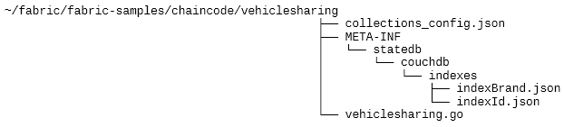
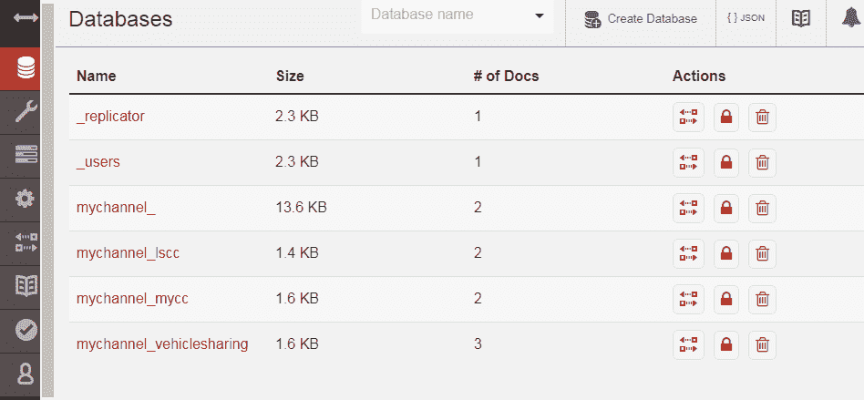
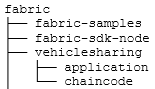

# Fabric 区块链智能合约 Chaincode 与客户端程序开发全新实例教程

> 原文：[`developer.ibm.com/zh/tutorials/cl-lo-hyperledger-fabric-practice-analysis2/`](https://developer.ibm.com/zh/tutorials/cl-lo-hyperledger-fabric-practice-analysis2/)

## 前言

在本系列第一部分《 [分步详解 Fabric 区块链网络的部署](https://www.ibm.com/developerworks/cn/cloud/library/cl-lo-hyperledger-fabric-practice-analysis/index.html) 》中，我们讲解了如何部署一个示例的 Fabric 区块链网络，并初步了解了 Fabric 中的一些基础内容。

本文将进一步讲解如何开发、部署一个 Fabric Chaincode（智能合约），以及如何基于 Fabric Node SDK 开发一个区块链 Client Application（客户端应用）。

## 环境准备

本文所依赖的系统环境与前文相同。

Fabric 当前最新版本为 1.4.0（2019 年 1 月 10 日发布），这也是第一个 Fabric LTS（Long Term Support）版本。相较以前的版本，它提供了更好的稳定性与易用性。该版本也是被推荐可用于生产环境的版本。与 1.3 相比，这个版本增强了日志操作，增强了对节点的监测与管理；并提供了更易用的编程模型与开发接口。

在前一篇文章中，Fabric Sample 位于~/fabric/fabric-samples/，在此基础上进行操作。

##### 清单 1\. 安装 Fabric Sample 1.4.0

```
cd ~/fabric
mv fabric-samples fabric-samples-1.3
curl -sSL https://bit.ly/2ysbOFE | bash -s 1.4.0 
```

安装完毕后，可通过 docker images 命令查看新的 Docker 镜像文件。

## 开发与部署 Chaincode

### 基础知识

#### Chaincode 的重要特点

区块链技术中经常讲到的智能合约，在 Fabric 中的实现被称为 Chaincode，有如下特点：

*   它是一个实现了 Chaincode 接口（包括 Init、Invoke 两个方法）的程序。
*   它需要被安装在 Endorsing Peer 上，一般情况下会在一个独立的 Docker Container 中执行。
*   Client Application 发出请求后，Chaincode Init 或者 Invoke 接口方法会被调用，返回执行结果，并产生 read set 和 write set；Chaincode 可以读取 State Database，但不能直接修改 State Database，也不会直接将结果提交给 Orderer Node。
*   Chaincode 执行产生的结果并不是最终的结果，它只是这个分布式系统诸多节点产生的一个结果，这个结果是否会被这个区块链网络（Channel）接受，需要各个 Endorsing Peer 达成 Consensus。
*   现在，Fabric 提供的 Chaincode 接口可支持三种开发语言：Go，node.js，Java。

在 Fabric 文档里，有这几个内容可供详细参考：

*   [`hyperledger-fabric.readthedocs.io/en/release-1.4/understand_fabcar_network.html`](https://hyperledger-fabric.readthedocs.io/en/release-1.4/understand_fabcar_network.html)
*   [`hyperledger-fabric.readthedocs.io/en/latest/txflow.html`](https://hyperledger-fabric.readthedocs.io/en/latest/txflow.html)

#### Go 语言

Fabric 核心部分是用 Go 语言开发的，我们也将使用 Go 开发示例 Chaincode。读者可以在 [这里](https://golang.org/doc/) 了解更多关于 Go 语言的知识。

### Vehicle Sharing 示例项目基本介绍

为了更好地研究与学习，我们设想了一个区块链项目 – [Vehicle Sharing（共享汽车）](https://github.com/tomxucnxa/vehiclesharing/tree/pub_1.4_2.2) 。它的主要目的是通过这个网络，实现共享汽车的上线、租用、归还、账务结算等相关业务。

这个 Chaincode 是一个单独的 Go 语言程序，定义了 VehicleSharing（实现 Chaincode 接口），以及两个将要被存储在 State Database 中的数据类型（struct），或者称之为 Asset：

*   Vehicle：汽车；
*   Lease：租借交易。

这个程序还定义了其他了业务逻辑。

##### 清单 2\. Vehicle Sharing Chaincode 主要代码

```
// VehicleSharing Chaincode
type VehicleSharing struct

// 汽车
type Vehicle struct

// 租借交易
type Lease struct

// Chaincode Init 接口方法，会在执行命令行工具 peer chaincode instantiate 或 upgrade 时被调用
func (t *VehicleSharing) Init(stub shim.ChaincodeStubInterface) peer.Response

// Chaincode Invoke 接口方法，响应 peer chaincode invoke|query 命令
func (t *VehicleSharing) Invoke(stub shim.ChaincodeStubInterface) peer.Response

// Chaincode 程序入口
func main()

// 一些业务逻辑处理方法
func createVehicle(stub shim.ChaincodeStubInterface, args []string) (string, error)
func findVehicle(stub shim.ChaincodeStubInterface, args []string) (string, error)
func deleteVehicle(stub shim.ChaincodeStubInterface, args []string) (string, error
func updateVehiclePrice(stub shim.ChaincodeStubInterface, args []string) (string, error)
func queryVehiclesByBrand(stub shim.ChaincodeStubInterface, args []string) (string, error)
func queryVehicles(stub shim.ChaincodeStubInterface, args []string) (string, error)
func getVehicleHistory(stub shim.ChaincodeStubInterface, args []string) (string, error)
func createLease(stub shim.ChaincodeStubInterface, args []string) (string, error
func findLease(stub shim.ChaincodeStubInterface, args []string) (string, error) 
```

我们将用 CouchDB 作为每个 Peer 所使用的 Ledger State 数据库，为提高效率，要建立一些索引。

##### 清单 3\. CouchDB 数据库索引

```
indexId.json
{"index":{"fields":["objectType","id"]},"ddoc":"indexIdDoc", "name":"indexId","type":"json"}

indexBrand.json
{"index":{"fields":["objectType","brand"]},"ddoc":"indexBrandDoc", "name":"indexBrand","type":"json"} 
```

我们认为一些数据（如 Lease）是隐私数据，只应该在特定的 Peer 上保存，并会在达到一定条件后删除。所以，我们需要定义 Private Data Collection。

##### 清单 4\. collections_config.json

```
[
 {
   "name": "leaseRecords",
   "policy": "OR('Org1MSP.member', 'Org2MSP.member')",
   "requiredPeerCount": 2,
   "maxPeerCount": 4,
   "blockToLive":3,
   "memberOnlyRead": true
 }
] 
```

这个文件的内容将在下文 Private Data 部分讲解。

#### 下载 Vehicle Sharing Chaincode 示例文件

```
git clone -b pub_1.4_2.2 https://github.com/tomxucnxa/vehiclesharing.git
cp -R vehiclesharing/chaincode/ fabric-samples/chaincode/vehiclesharing/
cp vehiclesharing/utils/setparas.sh fabric-samples/first-network/scripts/
chmod 755 fabric-samples/first-network/scripts/setparas.sh 
```

完成后，~/fabric/fabric-samples/chaincode/vehiclesharing 目录结构如下：



setparas.sh 是一个测试工具脚本，简化了一些测试用的命令。

### 部署与使用 VehicleSharing Chaincode

#### 启动 first-network

为方便起见，我们继续以第一部分的示例网络 byfn 为基础进行部署，并启动 CouchDb，作为 State Database。

```
cd ~/fabric/fabric-samples/first-network
./byfn.sh generate
./byfn.sh up -c mychannel -s couchdb 
```

#### 部署 Vehicle Sharing Chaincode

**登录 cli Container：**

```
docker exec -it cli bash 
```

**之后如无特殊说明，这些命令 均 于 cli Container 内执行。**

##### 清单 5\. 设置环境变量（在 cli Container 中）

```
export CC_SRC_PATH="github.com/chaincode/vehiclesharing"
export VERSION="1.0"
export CC_NAME="vehiclesharing"
source ./scripts/setparas.sh 
```

注意：

*   这些环境变量会影响所有的 peer chaincode 等命令，所以，重新启动系统、新建 Terminal 窗口或者单独执行下文中某一段操作时，请先执行这一段环境变量设置命令。
*   其中的 VERSION 需要根据实际情况修改。

##### 清单 6\. 安装、初始化 Chaincode（在 cli Container 中）

```
source ./scripts/setparas.sh peerenv 0 1
peer chaincode install -n $CC_NAME -v $VERSION -l $LANGUAGE -p $CC_SRC_PATH

source ./scripts/setparas.sh peerenv 0 2
peer chaincode install -n $CC_NAME -v $VERSION -l $LANGUAGE -p $CC_SRC_PATH

source ./scripts/setparas.sh peerenv 1 1
peer chaincode install -n $CC_NAME -v $VERSION -l $LANGUAGE -p $CC_SRC_PATH

source ./scripts/setparas.sh peerenv 1 2
peer chaincode install -n $CC_NAME -v $VERSION -l $LANGUAGE -p $CC_SRC_PATH

peer chaincode instantiate -o $ORDERER_ADDRESS --tls --cafile $ORDERER_CA -C $CHANNEL_NAME -n $CC_NAME -l $LANGUAGE -v $VERSION -c '{"Args":[""]}' -P "$DEFAULT_POLICY" 
```

注意：

*   我们通过 setparas.sh 执行了一些环境变量操作，以简化命令行操作，可以查看这个文件以了解详细情况。
*   这里设置两个 Peer 的参数只是针对这个示例的。

如果需要更新 Chaincode，我们需要通过 export VERSION 为它设置一个新的版本号，并再次安装、初始化。

在下文操作中，如果需要重新安装、升级 Chaincode，请按以下步骤更新即可。如果没有错误，则”更新 Chaincode” 操作暂时不须执行。

##### 清单 7\. 更新 Chaincode（在 cli Container 中）

```
export CC_SRC_PATH="github.com/chaincode/vehiclesharing"
export VERSION="1.1"
export CC_NAME="vehiclesharing"
source ./scripts/setparas.sh

source ./scripts/setparas.sh peerenv 0 1
peer chaincode install -n $CC_NAME -v $VERSION -l $LANGUAGE -p $CC_SRC_PATH

source ./scripts/setparas.sh peerenv 0 2
peer chaincode install -n $CC_NAME -v $VERSION -l $LANGUAGE -p $CC_SRC_PATH

source ./scripts/setparas.sh peerenv 1 1
peer chaincode install -n $CC_NAME -v $VERSION -l $LANGUAGE -p $CC_SRC_PATH

source ./scripts/setparas.sh peerenv 1 2
peer chaincode install -n $CC_NAME -v $VERSION -l $LANGUAGE -p $CC_SRC_PATH

peer chaincode upgrade -o $ORDERER_ADDRESS --tls --cafile $ORDERER_CA -C $CHANNEL_NAME -n $CC_NAME -v $VERSION -c '{"Args":[""]}' -P "$DEFAULT_POLICY" 
```

注意：

*   export VERSION=”1.1″ 这里的 “1.1” 需要按情况更换为实际需要的版本号。
*   这里使用了 peer chaincode upgrade 命令，而不是 peer chaincode instantiate。

#### 执行 Chaincode（在 cli Container 中）

下面通过一系列 peer chaincode 命令执行 Chaincode，并了解其结果，以进一步理解 Fabric 的运行机制。

**添加 Vehicle：**

```
source ./scripts/setparas.sh peerconn 0 1 0 2
peer chaincode invoke -o $ORDERER_ADDRESS --tls --cafile $ORDERER_CA -C $CHANNEL_NAME -n $CC_NAME $PEER_CONN_PARMS -c '{"Args":["createVehicle", "C123", "FBC"]}' 
```

**查询 Vehicle：**

```
source ./scripts/setparas.sh peerenv 0 1
peer chaincode query -C $CHANNEL_NAME -n $CC_NAME -c '{"Args":["findVehicle","C123"]}' 
```

**更新 Vehicle 价格：**

```
source ./scripts/setparas.sh peerconn 0 1 0 2
peer chaincode invoke -o $ORDERER_ADDRESS --tls --cafile $ORDERER_CA -C $CHANNEL_NAME -n $CC_NAME $PEER_CONN_PARMS -c '{"Args":["updateVehiclePrice", "C123", "123.55"]}' 
```

**根据 Brand 查询 Vehicle：**

```
source ./scripts/setparas.sh peerenv 0 1
peer chaincode query -C $CHANNEL_NAME -n $CC_NAME -c '{"Args":["queryVehiclesByBrand","FBC"]}' 
```

**查询 Vehicle History ：**

```
source ./scripts/setparas.sh peerenv 0 1
peer chaincode query -C $CHANNEL_NAME -n $CC_NAME -c '{"Args":["getVehicleHistory","C123"]}' 
```

命令 “peer chaincode query” 会得到区块链分布式账本中背书过的结果，但并不会产生或提交 Transaction。而命令 “peer chaincode invoke” 则会生成并背书 Transaction，并提交给 Channel Network。

#### CouchDB Rich Query（在 cli Container 中）

Fabric 内嵌的默认 State Database 是 LevelDB，它提供了简单的 Key-Value pairs 操作。CouchDB 则对 JSON 格式数据提供了很好支持，并支持 Rich Query。

在启动 byfn 网络时，我们使用了 -s couchdb 参数，根据 docker yaml 文件中的定义，每个 Peer 都会连接一个独立的 CouchDB 数据库。

在 vehiclesharing.go 中，我们定义了 queryVehicles 方法，这个方法提供了 Rich Query 查询入口。

**查询条件： objectType=”VEHICLE”**

```
source ./scripts/setparas.sh peerenv 0 1
peer chaincode query -C $CHANNEL_NAME -n $CC_NAME -c '{"Args":["queryVehicles","{\"selector\":{\"objectType\":\"VEHICLE\"}}"]}' 
```

**查询条件： objectType=”VEHICLE” and price>100**

```
source ./scripts/setparas.sh peerenv 0 1
peer chaincode query -C $CHANNEL_NAME -n $CC_NAME -c '{"Args":["queryVehicles","{\"selector\":{\"objectType\":\"VEHICLE\",\"price\":{\"$lt\":200}}}"]}' 
```

#### Chaincode Container 和日志操作（在 host 中）

通过以上操作，peer0.org1.example.com 和 peer0.org2.example.com 这两个 Endorsing Peer 中所安装的 Chaincode 已经在独立的 Docker Container 中启动。在 host 中执行：

```
docker ps --format "{{.Names}}\t {{.Ports}}"|grep dev- 
```

返回结果类似如下：

```
dev-peer0.org2.example.com-vehiclesharing-1.0
dev-peer0.org1.example.com-vehiclesharing-1.0 
```

我们可以分别再打开两个 Terminal 窗口，查看它们输出的 Log，并保持窗口，为下文中的测试作准备。

在 Terminal 1 中：

```
docker logs -f dev-peer0.org1.example.com-vehiclesharing-1.0 
```

在 Terminal 2 中：

```
docker logs -f dev-peer0.org2.example.com-vehiclesharing-1.0 
```

请注意：

Container ID 结尾的 Chaincode 版本号需要与实际版本号保持一致。

#### Proposal 和 Proposal Response

在 Fabric 架构中，Chaincode 对 Ledger 的”读”操作是通过 State Database 获得数据的。而每个 Peer 都有自己的独立的 State Database，它的内容”应该”是经过背书的一致的 Transaction 产生的结果。

Chaincode 对于 Ledger 的”写”操作（添加、更新、删除）并不是直接修改数据库（这是区块链技术一个显著特点）。而是先由 Client Application 提交 Proposal 给若干满足 Endorsement Policy 条件的 Peer，由 Chaincode 执行并经由 Endorsing Peer（背书节点）得到 Proposal Response，经 Client Application 验证一致，原始的请求才会被封装为 Transaction，并提交给 Orderer，Orderer 处理后将 Transaction 分发给所有 Peer，这时 Peer 才会更新 State Database。在这个过程中，Transaction 会被收集并打包成为 Block，再被追加到 Blockchain 上，成为不可更改的内容。

请参考 Fabric 文档中以下内容，可以获得更多细节，如：Blockchain，World State，Transaction：

[`hyperledger-fabric.readthedocs.io/en/latest/txflow.html`](https://hyperledger-fabric.readthedocs.io/en/latest/txflow.html)

[`hyperledger-fabric.readthedocs.io/en/latest/ledger/ledger.html`](https://hyperledger-fabric.readthedocs.io/en/latest/ledger/ledger.html)

我们通过下面的案例来展示当 Chaincode 处理一个 Proposal，因为有随机值参与而导致在不同 Peer 上产生不同的 Proposal Response 时，会发生什么。

查看 vehiclesharing.go 中的 wronglyTxRandValue 方法。这个方法会生成一个新的 Vehicle 实例，并赋予一些随机值，再尝试加入 Ledger。

按我们在 peer chaincode instantiate 命令中定义的 Endorsement Policy（位于 setparas.sh 中：export DEFAULT_POLICY=”AND (‘Org1MSP.peer’,’Org2MSP.peer’)”），通过这个 Chaincode 提交的 Proposal Response 需要得到 Org1、Org2 两个 Organization 中 Endorsing Peer 的背书。也就是说，在当前部署环境下，我们需要在命令行中将操作提交到至少两个 Peer。

“setparas.sh peerconn 0 1 0 2” 命令会设定将要提交的 Peer 为：peer0.org1.example.com 和 peer0.org2.example.com。

##### 清单 8\. 执行错误示例（在 cli Container 中）

```
source ./scripts/setparas.sh peerconn 0 1 0 2
peer chaincode invoke -o $ORDERER_ADDRESS --tls --cafile $ORDERER_CA -C $CHANNEL_NAME -n $CC_NAME $PEER_CONN_PARMS -c '{"Args":["wronglyTxRandValue"]}' 
```

这个操作不会成功，会得类似以下的错误信息：

```
Error: could not assemble transaction: ProposalResponsePayloads do not match - proposal response: version:1 response:<status:200 payload:"R990761" > payload: 
```

这时再通过刚才已经打开的窗口查看两个 Chaincode 输出的日志，可以发现这个 Invoke 操作在两个 Chaicode 中分别都执行成功了（Result 是随机值）：

```
Invoke wronglyTxRandValue [] get succeed. Result: R321579
Invoke wronglyTxRandValue [] get succeed. Result: R990761 
```

Chaincode 只是独立地处理 Proposal Request，所以，这个操作在不同的 Chaincode Container 里都”分别”成功了。但是 Client Application（就是命令行客户端）会对比 Endorsing Peer 返回的 Proposal Response，当它发现结果不符合时，就返回了上述错误。

希望能通过这个例子帮助大家加深对于分布式 Ledger 和 Proposal Response 的理解。也可以参考 [Transaction Flow](https://hyperledger-fabric.readthedocs.io/en/latest/txflow.html) 一文中的 “Proposal responses are inspected” 章节获取更多细节。

### CouchDB 管理

docker-compose-couch.yaml 中定义了 4 个 CouchDB Container 并分别与 4 个 Peer 对应。在 host 中执行：

```
docker ps --format "{{.Names}}\t {{.Ports}}" |grep couchdb 
```

返回内容类似如下：

```
couchdb0     4369/tcp, 9100/tcp, 0.0.0.0:5984->5984/tcp
couchdb1     4369/tcp, 9100/tcp, 0.0.0.0:6984->5984/tcp
couchdb2     4369/tcp, 9100/tcp, 0.0.0.0:7984->5984/tcp
couchdb3     4369/tcp, 9100/tcp, 0.0.0.0:8984->5984/tcp 
```

打开浏览器，输入 `http:// **<HOST>**:5984/_utils/`（请将 `<HOST>` 替换为部署 Fabric 的主机域名或 IP 地址），就可以访问 couchdb0 的管理界面了。

也可以通过 `http:// **<HOST>**:6984/_utils/`，`http:// **<HOST>**:7984/_utils/`，`http:// **<HOST>**:8984/_utils/` 访问其他数据库。



每一个 Chaincode 都会被分配一个单独的 CouchDB Database，如这里的 mychannel_vehiclesharing，点击进入，可以看到每一个之前添加的 Vehicle 都是这个数据库中一个 JSON 文档。

*   JSON 文档中的字段名与 Asset 定义中的 JSON tag 一致，如 Vehicle.Id。
*   JSON 文档中的顶级字段名不能以下划线 “_” 开头，这是系统内部保留字段名。
*   JSON 文档中的顶级字段名不能是 ~version，这是一个系统内部保留字段名。
*   JSON 文档的 Key，Chaincode 中调用 stub.PutState 方法时的第一个参数，即本文示例中的 Vehicle.Id，不能以下划线 “_” 开头。

### Private Data

有一些场景下，区块链需要处理一些敏感或隐私的数据，我们希望只有经过授权的特定 Peer 才能保存、背书、提交、查询它们，Fabric 提供了一种称之为 Private Data 的机制，并提供了一系列特别的 API，如：ChaincodeStubInterface.PutPrivateData、ChaincodeStubInterface.GetPrivateData。通过这个机制，这些数据只对经过授权的 Peer 可见，而未经授权的 Peer 只能操作这部分数据的 Hash 值。

在我们的 Vehicle Sharing 示例项目中，Lease 数据都会存储在 Private Data 中。

操作 Private Data 前需要先定义 Data Collection，如清单 4 中所展示的 collections_config.json。详细意义如下：

```
[
 {
   "name": "leaseRecords",    Private Data Collection 名称
   "policy": "OR('Org1MSP.member', 'Org2MSP.member')",    指定哪些 Peer 可以存储 Private Data
   "requiredPeerCount": 2,    需要将 Private Data 分发到至少几个 Peer
   "maxPeerCount": 4,    最多分发的节点数量
   "blockToLive":3,    按 Block 计数的 Private Data 存续时间，0 表示永久存储
   "memberOnlyRead": true    是否强制只允许属于指定 Organization 的客户端读数据
 }
] 
```

##### 清单 9\. 更新 Chaincode 以应用 Private Data Collection（在 cli Container 中）

```
export CC_SRC_PATH="github.com/chaincode/vehiclesharing"
export VERSION="1.2"
export CC_NAME="vehiclesharing"
source ./scripts/setparas.sh

source ./scripts/setparas.sh peerenv 0 1
peer chaincode install -n $CC_NAME -v $VERSION -l $LANGUAGE -p $CC_SRC_PATH

source ./scripts/setparas.sh peerenv 0 2
peer chaincode install -n $CC_NAME -v $VERSION -l $LANGUAGE -p $CC_SRC_PATH

source ./scripts/setparas.sh peerenv 1 1
peer chaincode install -n $CC_NAME -v $VERSION -l $LANGUAGE -p $CC_SRC_PATH

source ./scripts/setparas.sh peerenv 1 2
peer chaincode install -n $CC_NAME -v $VERSION -l $LANGUAGE -p $CC_SRC_PATH

peer chaincode upgrade -o $ORDERER_ADDRESS --tls --cafile $ORDERER_CA -C $CHANNEL_NAME -n $CC_NAME -v $VERSION -c '{"Args":[""]}' -P "$DEFAULT_POLICY" --collections-config $GOPATH/src/$CC_SRC_PATH/collections_config.json 
```

请注意以上操作中的 –collections-config 参数。

通过 createLease 方法添加 Lease 数据：

```
source ./scripts/setparas.sh peerconn 0 1 0 2
peer chaincode invoke -o $ORDERER_ADDRESS --tls --cafile $ORDERER_CA -C $CHANNEL_NAME -n $CC_NAME $PEER_CONN_PARMS -c '{"Args":["createLease", "L001", "C123", "U1001"]}' 
```

通过 findLease 方法查询 Lease 数据：

```
source ./scripts/setparas.sh peerenv 0 1
peer chaincode query -C $CHANNEL_NAME -n $CC_NAME -c '{"Args":["findLease","L001"]}' 
```

在 collections_config.json 中，我们配置了 “blockToLive”:3。我们可以试着执行几个添加 Vehicle 或者 Lease 的操作，以增加 Block 数量。然后，再次查询 L001，会发现已经没有返回结果了，说明这个 Private Data 已经被移除。

在测试过程中，我们可以同时查看 CouchDB 中新增加的两个数据库：mychannel_vehiclesharing$$hlease$records 和 mychannel_vehiclesharing$$please$records，它们分别存储了 Hash 值与原始数据。

## 开发 Client Application

### 准备环境

在之前的文章中，我们对 Channel、Chaincode 的操作都是通过 peer 命令行工具在 cli Container 中完成的。但这样的过程会比较繁琐，显然不能满足现实应用的需要。

Fabric 提供了应用程序开发接口，我们可以通过自己编写的程序，调用 Fabric SDK，实现几乎所有对于 Fabric 区块链网络的操作。现在，Fabric SDK 主要支持以下几种编程语言：

*   Node.js
*   Java
*   Python
*   Go
*   REST

其中，后三种尚未正式发布。下面，我们将以 Fabric SDK for Node.js 作为基础，讲解如何开发一个 Client Application。

Fabric SDK for Node.js 主要分为两大部分：

*   Fabric-Client API，提供了底层 API，例如：对于 Peer、Channel、Chaincode、CA 的管理、交互功能。
*   Fabric-Network API，属于高级 API。目前主要提供与 Chaincode（Smart Contract）的交互功能，使用比较方便。

我们设计了三个示例程序，分别应用了 Fabric-Client 与 Fabric-Network，主要是与 Chaincode 的交互（Invoke，Query），可以帮助我们开始更复杂的应用开发，也可以帮助我们更深刻地理解 Fabric 架构中的一些概念与思想。

**退出前文中的 cli Container， 回 到 host terminal 。**

##### 清单 10\. 下载 SDK

```
cd ~/fabric
git clone -b release-1.4 https://github.com/hyperledger/fabric-sdk-node.git 
```

其实我们也可以使用 Fabric SDK npm Modules，但为了获取最新版本，并保持版本一致，我们直接从 GitHub 上下载 SDK 源码并使用。

#### 下载示例程序

示例在前文中已经下载过，位于 ~/fabric/vehiclesharing 目录，如果未下载，请重新下载。

```
cd ~/fabric
git clone -b pub_1.4_2.2 https://github.com/tomxucnxa/vehiclesharing.git 
```

下载完成后，主要目录结构如下：



##### 清单 11\. 安装 npm Dependencies

```
cd ~/fabric/fabric-sdk-node
cd fabric-common && npm install && cd ..
cd fabric-ca-client && npm install && cd ..
cd fabric-client && npm install && cd ..
cd fabric-network && npm install && cd ..

cd ~/fabric/fabric-sdk-node
npm install

cd ~/fabric/vehiclesharing/application
npm install 
```

在执行 npm install 过程中，可能会遇到错误，请尝试删除 node_modules 目录，以及 package-lock.json 文件，并重试。

如果您遇到一个类似 “not found: make” 的错误，请尝试安装 build-essential 并重试：

```
apt install build-essential 
```

### 第一个 Client Application（基于 Fabric-Client API）

这个程序应用了 Fabric-Client API，主要有两个方法 queryChaincode 与 invokeChaincode。

#### 配置网络连接参数

在 vstest.js 里，我们通过 Client.addConfigFile 方法使用了 networksettings.json。vstest.js 通过这个配置文件获取 Peer，Orderer 等节点的 URL，TLS CA 证书，以及管理员用户证书、私钥文件等；并将这些内容作为参数生成 Client，Peer，Orderer，User 等实例。

注意：

这里的 networksettings.json 是一个完全自定义的 JSON 文件，它的作用就是提供配置给 vstest.js。 **它不是 Connection Profile** 。我们甚至故意修改了其中的键名，并在 vstest.js 中应用，以此示范对于 Fabric Client low level API 的使用。

##### 清单 12\. queryChaincode 主要代码

```
// 新建 Client 实例
const client = new Client();
// 获取 Channel 实例
const channel = client.newChannel(channelName);
// 设置用户
await client.createUser(initUser(networkCfg, client, orgId, userId));
// 确定 Target Peer
const targetPeers = getTargetPeers(channel.getPeers(), targets);
// 新建 Query Request
const request = {...};
// 调用 Channel 方法，查询 Chaincode 并返回结果
return channel.queryByChaincode(request); 
```

请查看 [vstest.js](https://github.com/tomxucnxa/vehiclesharing/blob/pub_1.4_2.2/application/vstest.js) 获取更多细节。

##### 测试 query 方法

```
cd ~/fabric/vehiclesharing/application
node vstest.js query C123 
```

##### 清单 13\. invokeChaincode 主要代码

```
// 新建 Transaction ID
const txId = client.newTransactionID();
// 新建 Proposal Request
const proposalRequest = {chaincodeId,txId, targets};
// 将 Proposal 提交给 Endorsing Peer
const proposalResults = await channel.sendTransactionProposal(proposalRequest);
// 验证并比较从多个 Peer 返回的 Proposal Response 一致
channel.compareProposalResponseResults(proposalResponses)
// 将 Transaction 提交给 Orderer
const sendPromise = channel.sendTransaction(transactionRequest);
// 通过 ChannelEventHub 接口响应 Peer 得到的 Block 通知
handleEvents(eventHubs, txId).forEach(p => allPromises.push(p));
// 返回 Transaction 结果
return transactionResult[0]; 
```

##### 测试 invoke 方法

```
cd ~/fabric/vehiclesharing/application
node vstest.js invoke 
```

### 第二个 Client Application（应用 Connection Profile）

这个程序应用了 Fabric-Client API，只是一个 query 测试，但不同的是它应用了 Connection Profile。

#### Connection Profile

在 vstest2.js 里，我们通过 Client.loadFromConfig 方法使用了 connprofile.json。这个配置文件将为 Client 实例提供完整的规定结构的区块链网络参数。我们不再需要 vstest.js 里的那样，单独设置每个实例。

**注意：**

这里的 connprofile.json 就是 Fabric SDK 文档中所描述的 **Connection Profile** 。请查看 [`hyperledger.github.io/fabric-sdk-node/release-1.4/index.html`](https://hyperledger.github.io/fabric-sdk-node/release-1.4/index.html) 获取关于 Connection Profile 的更多细节。

**为了运行这个示例， 需要 修改以下内容：**

*   connprofile.json：organizations.Org1.adminPrivateKey（请使用实际文件名）。
*   connprofile.json：organizations.Org2.adminPrivateKey（请使用实际文件名）。
*   vstest2.js：initAdmin 方法中 keyPath 变量所使用的 keyStore 文件（请使用实际文件名）。

##### 清单 14\. vstest2.js 主要代码

```
// 新建 Client 实例
const client = Client.loadFromConfig(path.join(__dirname, './connprofile.json'));
// 从 Client 实例中获取 Channel 实例
const channel = client.getChannel('mychannel');
await client.createUser(initAdmin());
// 查询 Chaincode
const result = await channel.queryByChaincode(request); 
```

我们可以看到，这个测试程序比之前的程序简便了很多。请查看 [vstest2.js](https://github.com/tomxucnxa/vehiclesharing/blob/pub_1.4_2.2/application/vstest2.js) 获取更多细节。

##### 测试 vstest2.js

```
cd ~/fabric/vehiclesharing/application
node vstest2.js 
```

### 第三个 Client Application（基于 Fabric-Network API）

这个程序应用了 Fabric-Network API，也是目前推荐的 Client Application 开发方式。它主要应用了两个概念：Wallet 与 Gateway。

与 vstest2.js 一样，它也需要使用 Connection Profile。

**为了运行这个示例， 需要 修改以下内容：**

*   connprofile.json：organizations.Org1.adminPrivateKey（请使用实际文件名）。
*   connprofile.json：organizations.Org2.adminPrivateKey（请使用实际文件名）。
*   vstest3.js：initAdminWallet 方法中 keyPath 变量所使用的 keyStore 文件（请使用实际文件名）。

##### 清单 15\. vstest3.js 主要代码

```
// 新建 Wallet 实例，以存储用户加密相关内容
const wallet = await initAdminWallet(identityLabel);
// 新建 Gateway 实例
const gateway = new Gateway();
// 利用 Wallet,Connection Profile 初始化 Gateway 连接
await gateway.connect(path.join(__dirname, './connprofile.json'),
        {
            wallet: wallet,
            identity: identityLabel
        });
// 从 Gateway 中获取 Network 实例
const network = await gateway.getNetwork('mychannel');
// 获取 Smart Contract，即 Chaincode
const contract = await network.getContract('vehiclesharing');
// evaluateTransaction 接口，等同 Query,并不会提交 Transaction
const result = await contract.evaluateTransaction('findVehicle', 'C123');
// 关闭 Gateway 连接
gateway.disconnect(); 
```

基于 Fabric-Network API 的这个测试程序比之前的两个程序更容易理解，能让开发人员能更好地关注业务逻辑，而不用再重复进行网络设置。请查看 [vstest3.js](https://github.com/tomxucnxa/vehiclesharing/blob/pub_1.4_2.2/application/vstest3.js) 获取更多细节。

##### 测试 vstest3.js

```
cd ~/fabric/vehiclesharing/application
node vstest3.js 
```

## 结束语

至此，我们在 First Network 基础上部署了一个 Chaincode，并基于 Fabric SDK for Node.js 开发了一个区块链 Client Application。希望能帮助大家进一步了解 Fabric 这个区块链平台。当然，所涉及的内容还是比较基础，有些重要内容（比如 CA、Block）没有涉及，希望能在以后的研究过程中再介绍。

## 参考资源

*   参考 [IBM Blockchain Dev Center](https://developer.ibm.com/cn/blockchain/)，查看 IBM 在区块链领域的最新信息。
*   参考 [Hyperledger Fabric Documentation](http://hyperledger-fabric.readthedocs.io/en/latest/index.html)，了解开源项目 Fabric 的主要内容。
*   参考 [Fabric on GitHub](https://github.com/hyperledger/fabric)，了解 Fabric 源代码。
*   参考 [Fabric SDK on GitHub](https://github.com/hyperledger/fabric-sdk-node)，了解 Fabric SDK 源代码。
*   参考 [Vehicle Sharing（共享汽车）](https://github.com/tomxucnxa/vehiclesharing/tree/pub_1.4_2.2)，这是本文的示例代码。
*   参考[分步详解 Fabric 区块链网络的部署](https://www.ibm.com/developerworks/cn/cloud/library/cl-lo-hyperledger-fabric-practice-analysis/index.html)，这是本系列的第一篇文章。