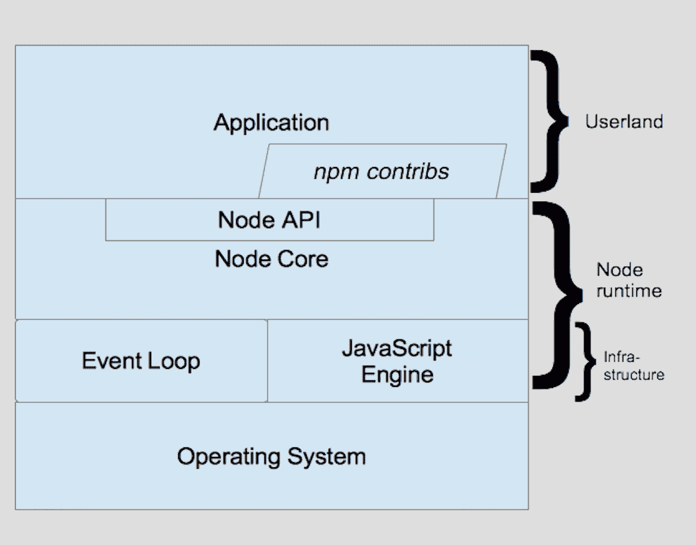
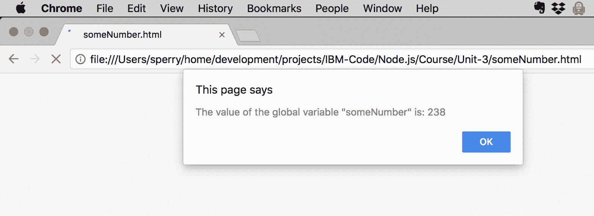
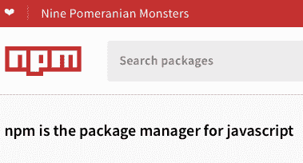

# Node.js 之旅

> 原文：[`developer.ibm.com/zh/tutorials/learn-nodejs-tour-node/`](https://developer.ibm.com/zh/tutorials/learn-nodejs-tour-node/)

Node 通常被描述为“服务器上的 JavaScript”，但这种描述有失公允。事实上，我找不到任何辞藻来公正地描述 Node.js，因此，我先引用 Node 团队提供的一种描述：

“Node.js 是基于 Chrome V8 JavaScript 引擎构建的 JavaScript 运行时。”（[来源](https://nodejs.org/en/)）

##### Node.js 学习路径

本教程是 Node.js 学习路径的一部分。各个单元相辅相成，查看 Node.js 学习路径概述以便从头开始学习。

这种描述很好，但最好配上一张图片，对吧？当访问 Node.js 网站时，您会注意到上面没有 Node.js 架构的高级图表。但如果您搜索 “Node.js architecture diagram”，将会显示约 1780 亿张不同的图表，这些图表都试图勾勒出 Node 的全貌（在下文中，我将 Node.js 简称为 Node）。在查看了其中一些图表后，我找不到任何一张图表能与我撰写本课程材料的思路相吻合，因此，我想出了如下架构：

 **图 1\. Node.js 架构堆栈**

在下文中，我将使用图 1 作为讨论基础。让我们来详细了解其中的每一项，从 JavaScript 运行时开始。

不过首先，需要进行一些梳理。

## 如何阅读本文

简言之：根据需要多次反复阅读，直至理清头绪为止。您应理解这里介绍的所有概念，因为第 4 单元和第 5 单元都是基于这些概念构建的。要想成为一名更优秀的 Node 开发者，您需要充分理解 Node 是如何运作的。

具有异步架构的 Node 之所以难以描述，是因为要准确描述某些部分，就需要介绍其他一些尚未描述的部分。例如，要描述回调函数（稍后介绍），就需要介绍回调函数的作用，以及事件循环（稍后介绍）如何在后台完成您通过 Node API 使其执行任何操作时调用回调函数。

事件驱动型异步架构本质上是一种循环架构（因此才有所谓的事件 *循环*），它们的描述也是如此（这令我想起了“先有鸡还是先有蛋”这个问题）。这需要足够的耐心，但最重要的是：通过反复学习，这些概念就会变得越来越清晰。

我有如下建议：要想成为最好的 Node 开发者，完整学习本单元，然后学习第 4 单元和第 5 单元。然后再返回到本单元完整地学习一遍，确保您对这些概念有了深刻的理解。

## 获取代码

您在此学习路径中跟随其中示例一起进行操作所需的代码可在我的 GitHub 存储库中找到。

[获取代码](https://github.com/jstevenperry/IBM-Developer/tree/master/Node.js/Course)

## 说一说 ECMAScript

[**Ecma 国际**](https://en.wikipedia.org/wiki/Ecma_International)是一家负责诸多标准如 ECMAScript 的 IT 标准机构，JavaScript 是 ECMAScript 标准最常见的实现。

ECMAScript 标准（也称为 ECMA-262）[最新版本为 ES2017](https://en.wikipedia.org/wiki/ECMAScript#Versions)（这是 Ecma Script 2017 的简称）。Node 支持 ES2016（也称为 ES6，因为它是所发布标准的第六版）。要了解有关 ECMAScript 的更多信息，查看[维基百科页面](https://en.wikipedia.org/wiki/ECMAScript)。

Chrome 的 V8 JavaScript 引擎[支持最新版本](https://github.com/v8/v8/wiki)的 ECMA-262（ES2017，也称为 ES8），而 Node 将[不断改进](https://nodejs.org/en/docs/es6/)，力求支持 V8 所支持的所有 ECMA-262 版本。Node 目前（撰写本文时）支持 ECMAScript 到 ES6 (ES2015)，但它会不断改进，力求支持 V8 所支持的最新 ECMAScript 版本。[node.green](https://node.green) 页面将跟踪 Node 团队在支持最新版本的 ECMAScript 方面所取得的进展。

虽然编写 Node 应用程序使用的语言是 JavaScript，但我希望您了解 ECMAScript 规范控制着 JavaScript 编程语言的演变过程。

## Node.js 中的 JavaScript – 可能不是您所熟悉的 JavaScript

在 Node 中开始编写 JavaScript 应用程序后，您会注意到：在极少情况下，编写的 JavaScript 代码没有按期望的方式运行。

例如：全局变量。在这里，我不会讨论“是否应该使用全局变量？”这个问题。您可以在网上找到关于这方面的大量信息，并自行决定。

许多 JavaScript 编程人员都习惯于使用全局变量，但在切换到 Node 后，却发现全局变量似乎无效。原因在于，Node 应用程序中的每个 JavaScript 文件都是具有自己作用域的实体（称为 *模块* ）。（有关 Node 如何实现这一点的更多信息，查看[模块 API 文档](https://nodejs.org/dist/latest-v10.x/docs/api/modules.html#modules_the_module_wrapper)中的“模块打包程序”部分）。

您可能会遇到下列情况：您有两个 JavaScript 文件： `A.js` 和 `B.js`，在 `A.js` 中将一个变量声明为全局变量，并尝试在 `B.js` 中引用此变量：

**`A.js`**

```
var someNumber = 238; 
```

**`B.js`**

```
function sayIt() {
    alert('The value of the global variable "someNumber" is: ' + someNumber);
} 
```

**`someNumber.html`**

```
<script src="./A.js"></script>
<script src="./B.js"></script>
<script>
    // Invoke the sayIt() function from B.js:
    sayIt();
</script> 
```

正如我所预见，在 Chrome (V67.0.3396.87) 中运行此代码时，出现了以下警报：



但是，这在 Node 中无效。`someNumber` 变量限定在 `A.js` 内，而在 `B.js` 中不可见。我稍后将在本课程中展示它 **为何** 无效。

为浏览器编写 JavaScript 代码与为 Node 编写 JavaScript 代码的方式存在一些细微差异。在课程中遇到这些差异时，我会明确地指出来。

现在，返回到图 1。

## Node 运行时

Node 运行时是表示实际运行 Node 应用程序的可执行程序的另一个术语，由以下几个部分（堆栈中间，参阅图 1）组成：

*   [Node API](https://nodejs.org/dist/latest-v10.x/docs/api/)：JavaScript 实用程序（如文件和网络 I/O）以及其他许多实用程序（如加密和压缩）
*   Node Core：一组 JavaScript 模块，用于实现 Node API。（显然，有些模块依赖于 libuv 和其他 C++ 代码，但这属于实现细节。）
    *   JavaScript 引擎：Chrome 的 V8 引擎：一个快速的“JavaScript 到机器”代码编译程序，用于加载、优化和运行 JavaScript 代码
    *   事件循环：使用称为 libuv 的事件驱动型非阻塞 I/O 库来实施，使其实现轻量化和高效 （且可扩展）

### Node API

[Node API](https://nodejs.org/dist/latest-v10.x/docs/api/) 是由 Node.js 提供的一组现成的内置模块，可用于构建应用程序。其中许多模块，如文件系统 (fs) API，基于那些与底层操作系统通信的较低级别的程序 (Node Core) 之上。使用 Node API 内置模块时，通过在代码中添加 `require()` 来将其包含在项目中，然后调用其函数。

本课程中使用的内置模块包括：

*   [文件系统](https://nodejs.org/dist/latest-v10.x/docs/api/fs.html)
*   [加密](https://nodejs.org/dist/latest-v10.x/docs/api/crypto.html)
*   [事件](https://nodejs.org/dist/latest-v10.x/docs/api/events.html)
*   [HTTP](https://nodejs.org/dist/latest-v10.x/docs/api/http.html)
*   [流](https://nodejs.org/dist/latest-v10.x/docs/api/stream.html)

Node API 基于 Node Core 之上，下面介绍一下 Node Core。

### Node Core

Node Core 由 Node API 与一个 C++ 程序组成，基于与 libuv（详见下文）绑定的多个库和 JavaScript 引擎（Chrome V8，详见下一节）构建。

## 基础架构

Node 运行时的基础架构由两大组件构成：

*   JavaScript 引擎
*   非阻塞 I/O 库

### JavaScript 引擎

Node 使用的 JavaScript 引擎是 Chrome 的 V8 引擎，该引擎可运行所有 JavaScript 代码（您自己的代码、Node API 代码以及您从 npm 注册表获取的程序包中的所有 JavaScript 代码）。启动 Node 时，它会运行一个 V8 引擎实例。这看起来像是一项严格的限制，但 Node 实际上可以充分利用这一个 V8 引擎实例，您马上就可以看到。

V8 引擎可嵌入（或*绑定*）到任何 C++ 程序（如 Node）中或诸如 Chrome 的 Web 浏览器中。这意味着，除了[纯 JavaScript 库](https://developer.mozilla.org/en-US/docs/Web/JavaScript/Reference)外，还可以扩展 V8 来创建全新的函数（或[函数模板](https://github.com/v8/v8/wiki/Embedder%27s-Guide#templates)），方法是将其与 V8 绑定在一起。注册新函数时，将传递一个指向 C++ 方法的指针，当 V8 运行其中一个新的定制 JavaScript 函数时，就会调用对应的 Template 方法。这就是 Node Core 如何实现许多 Node API 的 I/O 函数方式 （如果您想知道）。

##### 只能使用 V8 作为 JavaScript 引擎吗？

理论上，Node 可修改为使用任何 JavaScript 引擎，但默认情况下使用的是 V8（它实际上与 V8 的关系 *非常紧密*）。 尽管如此，还是有些人尝试使用 V8 的替代项，如果您对在其他常用 JavaScript 引擎上运行 Node 有兴趣，查看 [node-chakracore 项目](https://github.com/nodejs/node-chakracore) 以及 [spidernode 项目](https://github.com/mozilla/spidernode)。我期待 JavaScript 引擎终将成为 Node 的一个可插拔组件（虽然还有很长的路要走）。

#### 事件循环

CPU 芯片运行程序指令的速度要比从磁盘或网络等 I/O 设备中检索数据的速度快得多。但是，如果没有这些 I/O 设备提供的数据，程序就无法正常运行。由于 V8 是在单个线程上运行，因此所有一切（您的程序、其他程序、实例中运行的一切 – 甚至 V8 引擎的[上下文](https://github.com/v8/v8/wiki/Embedder%27s-Guide#contexts)）都会被阻塞，直至数据可用且完成 I/O 操作为止。

Node 使用 [libuv](http://libuv.org) 来实施事件循环。要使用 Node 异步 API，可将回调函数作为参数传递到该 API 函数，在事件循环期间会执行该回调函数。

事件循环包含多个调用回调函数的阶段：

*   计时器阶段：将运行 `setInterval()` 和 `setTimeout()` 过期计时器回调函数
*   轮询阶段：将轮询操作系统以查看是否完成了所有 I/O 操作，如果已完成，将运行回调函数
*   检查阶段：将运行 `setImmediate()` 回调函数

将在以下两个执行“线路”之一上执行您编写的 JavaScript 代码：

*   主线 – 这是 Node 首次运行程序时运行的 JavaScript 代码。它将从开始运行直到结束，并在完成后将控制权交给事件循环
*   事件循环 – 这是用于运行所有回调函数的地方

一个常见的误区是，认为 V8 和事件循环回调函数在不同线程上运行。但事实并非如此。V8 在同一个线程上运行所有 JavaScript 代码。

如果没有充分理解 Node 是如何使用 V8 运行 JavaScript 代码的，那么尝试调试复杂计时问题将令您不胜其烦。在跟随本学习路径进行操作的过程中，牢记这一点。如果现实的事件循环与您的思维模式不符，那么可能是您的思维模式出现了错误。没关系，继续努力（记住，这是一个反复学习的过程）。

##### 线程池

事件循环允许 Node 主要通过其非阻塞 I/O 模型来提供强大的可扩展性。但我们假定 Node API 提供的部分功能并非 I/O 密集型功能，而是 CPU 密集型功能。那么事件循环有用吗？当然有用！libuv 使用称为“工人池”的线程池，即用于卸载 I/O 密集型任务和 CPU 密集型任务的线程池。

每当 V8 检测到一个绑定的 Node API 函数调用时，就会调用 Node 函数模板以将控制权传递给 libuv，随后 libuv 会将工作卸载到工人池。此外，在发出 Node API 调用时，会将其作为回调函数来传递，当工人池线程完成此工作后，事件循环会请求 V8 调用回调函数并提供结果。

我们将在本学习路径的第 5 单元中详细介绍线程池。

### 用户空间

“用户空间”这个术语是指使用非平台、运行时或库运行代码的代码。在 Node 的上下文中，用户空间代码表示非 Node 运行时提供的所有代码，例如：

*   应用程序 – 堆栈最上面的是用 JavaScript 编写且使用 Node API 和（可能使用）某些 npm 社区贡献（程序包）的应用程序。

*   npm 贡献 – 虽然可从头开始编写整个应用程序，但我建议不要这样做。您可以利用 Node 社区内成千上万的开发者的工作成果，因为这些开发者的贡献是 Node 的核心。随着您在使用 Node 方面变得越来越专业，您将会广泛使用这些贡献。

我们将在第 7 单元中全面介绍 npm（尤其是 npm 实用程序）。

## REPL

好了，理论到此为止。准备好来写一些 JavaScript 代码了吗？

安装 Node 时，会自动建立 Read-Eval-Print-Loop (REPL) 环境。这并不是 Node 仿真器。实际上，它 *就是* Node，只是形式不太正式，但非常适合作为起点。

打开终端窗口或命令提示符，输入 `node`，然后按 `Enter` 键。您会看到如下内容：

```
$ node
> 
```

我承认，这不算特别令人兴奋。输入 `.help` 并按 `Enter` 键，您将看到以下内容：

```
> .help
.break    Sometimes you get stuck, this gets you out
.clear    Alias for .break
.editor   Enter editor mode
.exit     Exit the repl
.help     Print this help message
.load     Load JS from a file into the REPL session
.save     Save all evaluated commands in this REPL session to a file
> 
```

在 REPL 行中，可输入以下两种内容之一：一行 JavaScript 代码或以上某条命令。它们一目了然，但如果您想要了解有关它们的更多信息，查看 [Node REPL API 文档](https://nodejs.org/dist/latest-v10.x/docs/api/repl.html)。

在 REPL 中逐行输入以下行（确保在输入每一行后按 `Enter` 键）：

### 示例 1\. Hello World

```
let hello = "Hello"
let world = "world"
hello + ' ' + world 
```

您会看到以下输出：

```
> let hello = "hello"
undefined
> let world = "world"
undefined
> hello + ' ' + world
'hello world'
> 
```

REPL 针对前两个语句打印 `undefined`（因为对它们求值无法得到任何结果）。输入表达式 `hello + ' ' + world` 时，REPL 对其求值的结果为字符串字面值 `'hello world'`。

要退出 REPL：输入 `.exit`，并按 `Enter` 键。

REPL 提供了“编辑器”模式。返回到 REPL，输入 `.editor` 并按 `Enter` 键。然后再次输入示例 1 的代码。准备好使用 REPL 来运行此代码后，按 `Ctrl+D`。您将看到如下输出：

```
$ node
> .editor
// Entering editor mode (^D to finish, ^C to cancel)
let hello = "Hello"
let world = "world"
hello + ' ' + world
'Hello world'
> 
```

如果需要输入多行语句，那么 REPL 在遇到不匹配的左括号 (`{`) 时会检测到此语句，并打印 (`...`) 来指示此语句。例如，在 REPL 中逐行输入以下代码：

### 示例 2\. 多行语句

```
var array = ['Hello' , ' ', 'there', ' ', 'REPL'];
var message = '';
for (let word of array) {
    message += word;
}
message += '!'; 
```

您会看到如下输出：

```
$ node
> var array = ['Hello' , ' ', 'there', ' ', 'REPL'];
undefined
> var message = '';
undefined
> for (let word of array) {
...     message += word;
...}
'Hello there REPL'
> message += '!';
'Hello there REPL!'
> 
```

如果要运行包含 JavaScript 文件的脚本，可以使用 `.load` 命令来将其载入 REPL。

退出 REPL，浏览至克隆本课程源代码的目录（如果需要回顾相关操作，参阅第 2 单元），浏览至 `IBM-Developer/Node.js/Course/Unit-3` 目录，然后启动 REPL（我已将代码直接克隆到位于主文件夹下一层的 `src/projects` 目录中）：

```
$ cd src/projects/IBM-Developer/Node.js/Course/Unit-3/
$ node
> .load example2.js
var array = ['Hello' , ' ', 'there', ' ', 'REPL'];
var message = '';
for (let word of array) {
    message += word;
    }
    message += '!';

'Hello there REPL!'
> 
```

*注意：对 `example2.js` 运行 `.load` 命令时，您会看到 Apache 2.0 版权声明，为节省空间，我从上述清单中移除了该版权声明。*

现在，您可以开始编写首个使用 Node API 的程序了。在此例中，使用的是文件系统 API （File System API）。

退出然后重启 REPL，以获取全新的 Node 实例。

在 REPL 中逐行或以编辑器模式输入以下代码行（或者可以使用 `.load` 命令从 `example3.js` 中加载这些代码行）：

```
var fs = require('fs');
var fileContents = fs.readFileSync('../data/50Words.txt', 'utf8');
var numberOfWords = fileContents.split(/[ ,.\n]+/).length; 
```

让 REPL 对 `numberOfWords` 变量进行求值，然后对 `fileContents` 变量进行求值。您会看到如下输出（在此示例中，使用的是编辑器模式）：

```
$ node
> .editor
// Entering editor mode (^D to finish, ^C to cancel)
var fs = require('fs');
var fileContents = fs.readFileSync('../data/50Words.txt', 'utf8');
var numberOfWords = fileContents.split(/[ ,.\n]+/).length;
undefined
> numberOfWords
51
> fileContents
'Lorem ipsum dolor sit amet, consectetur adipiscing elit.Praesent scelerisque libero nec nulla aliquet, faucibus efficitur massa sollicitudin.Aliquam hendrerit hendrerit est, sed dictum lectus.Nulla eu placerat elit, at volutpat dui.Mauris gravida tortor quis tempus posuere.Vestibulum ultrices leo quis nisi suscipit pellentesque.Nullam congue maximus odio, eu.'
> 
```

如您所见，REPL 会按照您的要求打印 `numberOfWords` 和 `fileContents` 的值（注意：`readFileSync()` 的返回值是包含文件内容的字符串）。如果要求 REPL 对 `fs` 变量进行求值，会怎样呢？正确答案是：它将以 JavaScript 对象表示法 (JSON) 格式打印对象的最佳字符串表示形式。我们来试一试吧（为节省空间，我在这里不展示输出）。

REPL 可总结如下：

*   非图形化交互式环境
*   适合学习和构建原型

有关 REPL 的更多信息，参阅 [REPL API 文档](https://nodejs.org/api/repl.html)。

## 非阻塞 I/O

我们已简要介绍了非阻塞 I/O 模型以及事件循环如何在完成通过 Node API 执行的任何操作时调用您提供的回调函数。

在此部分中，您将编写一些代码。我建议您浏览一遍源代码，并在 VSCode 中运行示例。务必在 VSCode 中选择 `File > Open` 以打开 *对应于您正在学习的单元*（在此例中为第 3 单元） 的目录，这样便可以在 VSCode 中正常运行这些示例。***如果不这样做，就必须将源代码中的首个参数相应调整为`fs.readFile()`***。

### 异步 I/O

1.  在 VSCode 中，选择 `File > Open`，并选择 `IBM-Developer/Node.js/Course/Unit-3` 目录。然后打开 `example3.js`，此示例如下所示（在以下清单中，为节省空间，我移除了注释并添加了行号）：

### 示例 3.（同步）读取文件

```
01  var fs = require('fs');
02  console.log('Starting program...');
03  var fileContents = fs.readFileSync('../data/50Words.txt', 'utf8');
04  var numberOfWords = fileContents.split(/[ ,.\n]+/).length;
05  console.log('There are ' + numberOfWords + ' words in this file.');
06  console.log('Program finished.'); 
```

将生成如下输出（为节省空间，已从 VSCode DEBUG OUTPUT 窗口中省略了序言行）：

```
...
Debugger attached.
Starting program...
There are 51 words in this file.
Program finished. 
```

让我们再来看一下相关代码。

*   第 2 行：主线上的 `console.log()` 调用会按我们期望的那样显示在控制台上。
*   第 3 行：请求 Node 同步读取文件，以便阻塞 V8 线程（谨记，有且只有一个 V8 线程），直至读取完该文件并从 `readFileSync()` 调用返回了此文件内容为止。
*   第 5-6 行：接下来执行第 5 行上的 `console.log()` 语句，然后执行第 6 行上的另一个语句。

这就解释了输出的顺序。将此示例与下面的 `example4.js` 进行对比。此外，为节省空间，我省略了注释并添加了行号：

### 示例 4.（异步）读取文件

```
```
01  var fs = require('fs');
02  console.log('Starting program...');
03  fs.readFile('../data/50Words.txt', 'utf8', function(err, fileContents) {
04      if (err) throw err;
05      let numberOfWords = fileContents.split(/[ ,.\n]+/).length;
06      console.log('There are ' + numberOfWords + ' words in this file.');
07  });
08  console.log('Program finished');
``` 
```

1.  单击 VSCode 左侧的 **Debug View**，确保在编辑器中已打开 `example4.js` 并且此示例处于活动状态。

2.  然后单击 **Run** 按钮。此时会在 VScode 底部弹出 Debugger 窗口，您应该会在 `DEBUG CONSOLE` 窗口中看到如下输出：

    ```
     /Users/sperry/.nvm/versions/node/v10.4.1/bin/node --inspect-brk=20417 example4.js
     Debugger listening on ws://127.0.0.1:20417/de1172f6-f226-44c7-9d0d-fd8bd1691544
     For help, see: https://nodejs.org/en/docs/inspector
     Debugger attached.
     Starting program...
     Program finished
     There are 51 words in this file. 
    ```

发生了什么？让我们从上到下完整浏览一遍 `example4.js`。

*   第 1 行：通过 `require()` 函数检索对 `fs` 模块的引用
*   第 2 行：主线上的 `console.log()` 调用会按我们期望的那样显示在控制台上。
*   第 3 行：主线调用 `fs.readFile()`，传递要读取的文件 (`../data/50Words.txt`)、该文件的编码是 `'utf8'` ，在读取该文件后执行匿名回调函数。
*   第 8 行：由于主线上的所有代码都是在事件循环运行前从开始执行直到完成，第 8 行上的 `console.log()` 是在主线上执行的。
*   第 4-6 行：读取此文件后，事件循环会调用回调函数，此回调函数最终会在第 6 行上调用 `console.log()`。

建议您尝试运行示例 3 和 4，感受一下两者的差异，并了解控制台输出不同的原因。

### 什么情况下使用同步 I/O

如示例 3 中所示，同步 I/O 将阻塞 V8 线程，直至 I/O 操作完成为止。

为何要使用阻塞 V8 线程的 I/O 调用？

有时候适合使用同步 I/O。事实上，同步 I/O 通常比异步 I/O 更快，原因在于设置和使用回调函数、轮询操作系统来获取 I/O 状态等操作都涉及到一定的开销。

假设您使用 Node 编写一个一次性实用程序，仅用于处理一个文件（将在第 6 单元中执行此操作）。您从命令行中启动 Node，并向其传递 JavaScript 实用程序的文件名。此时，该实用程序是唯一运行的程序，因此，即使它阻塞了 V8 线程，也没有任何影响。在此情况下，适合使用同步 I/O。

建议采用以下经验法则：如果在运行 I/O 操作时需要在后台运行其他代码，使用异步 I/O。否则，使用同步 I/O。如果您不确定，使用异步 I/O。事实上，Node 的设计理念是“[即使没有必要，API 也应始终为异步](https://nodejs.org/en/docs/guides/event-loop-timers-and-nexttick/)”。

只要是谨慎使用同步 Node API 调用，就不会出现什么问题。

## npm 程序包生态系统

在 Node 早期阶段，npm 是表示 *N*ode *P*ackage *M*anager 的首字母缩略词。现在仍可以这样看待 npm（但很明显，[npm 不是首字母缩略词](https://twitter.com/npmjs/status/105690425242820608?lang=en)），但在其演变过程中，已删除了这个首字母缩略词。

是否不确定在应用程序中应使用哪些模块？查看 [CloudNativeJS.io Module Insights 页面](https://github.com/CloudNativeJS/module-insights)，以获取更多信息。

根据 npmjs.com 官网上的定义：“npm 是 JavaScript 的程序包管理器”。



Node 使用越频繁，对 Node 开发者贡献的依赖就越多，Node 开发者为 npmjs.com 上的中央存储库贡献了成千上万的模块。要在 Node 项目中使用这些模块（也称为“程序包”），您需要使用 `npm install` 来安装这些模块，然后使用 `require()` 获取任何 JavaScript 程序中所需的模块。

我们将在第 7 单元和第 8 单元中更详细地介绍 npm 以及如何管理 Node 项目的依赖项。

## 视频

[https://cdnapisec.kaltura.com/p/1773841/sp/177384100/embedIframeJs/uiconf_id/39954662/partner_id/1773841?iframeembed=true&playerId=kplayer&entry_id=0_6f5cmhif&flashvars[streamerType]=auto](https://cdnapisec.kaltura.com/p/1773841/sp/177384100/embedIframeJs/uiconf_id/39954662/partner_id/1773841?iframeembed=true&playerId=kplayer&entry_id=0_6f5cmhif&flashvars[streamerType]=auto)

## 结束语

在本教程中，您学到了：

*   Node.js 的架构及其构成：
    *   Node 运行时
    *   用户空间
*   您了解了 Node 运行时的构成：
    *   事件循环 (libuv)
    *   Chrome V8 JavaScript 引擎
*   您使用了 REPL
*   您简要地了解了 npm

在第 4 单元中，您将深入了解 Node 的异步编程风格。

## 测试您的理解情况

做此测试来检验您对 Node 知识的掌握情况。在下方提供了答案。

### 判断题

1.  对/错：Node 将在多个线程中运行 JavaScript 代码，以便利用事件循环的线程池。

2.  对/错：在多个并行线程中运行的 Chrome V8 引擎将调用 JavaScript 回调函数来实现 JavaScript 可扩展性。

查看答案

### 选择最佳答案

1.  Chrome V8 是：

    **A** – Node 开发者喜欢的一种提神健康饮料

    **B** – 一种内燃机，供 Node 开发者用来避免会议迟到

    **C** – 由 Node 使用的一种高性能 JavaScript 引擎

    **D** – 上述选项都不是

2.  事件循环：

    **A** – 启用 Node 非阻塞 I/O 模型

    **B** – 具有单个多线程阶段：I/O 子循环

    **C** – 包含多个可调用回调函数的阶段

    **D** – 仅 A

    **E** – A 和 B

    **F** – A 和 C

    **G** – 上述选项都不是

3.  REPL：

    **A** – 不是真正的 Node，而是可用于构建原型的独立程序

    **B** – 表示 REPLicate，用于生成 JavaScript 副本并编译副本以供 V8 引擎运行

    **C** – 无意义，这是 Steve 编造的。

    **D** – 基于控制台的交互式 Node 环境，您可在其中运行 JavaScript 代码

    **E** – A 和 B

    **F** – C 和 D

    **G** – 上述选项都不是

4.  事件循环：

    **A** – 永久运行，直至 V8 引擎显式指示它退出

    **B** – 只要需要调用回调函数就会运行，然后退出

    **C** – 运行一次，然后休眠 10 秒、唤醒并再次运行，周而复始

    **D** – 上述选项都不是

查看答案

### 填空

1.  导致执行的 V8 线程等待直至出现结果的 I/O 称为 ***_*** I/O。

2.  为事件循环提供要在 I/O 操作完成时调用的回调函数的 I/O 称为 ***_*** I/O。

查看答案

### 从以下选项中选择最佳答案

A. 同步 B. 异步

1.  阻塞 I/O 通常被称为 ***_*** I/O。

2.  非阻塞 I/O 通常被称为 ********__******** I/O。

3.  回调函数用于支持 *********__********* 编程方法。

查看答案

### 研究以下清单并提供您的答案

```
00 // Top of file
01 var fs = require('fs');
02 var fileContents = fs.readFileSync('../data/50Words.txt', 'utf8');
03 console.log('Synchronous read finished.');
04 //
05 fs.readFile('../data/50Words.txt', 'utf8', function(err, fileContents) {
06    if (err) throw err;
07    console.log('File contents: ' + fileContents);
08 });
09 console.log('Program finished');
10 // Bottom of file 
```

1.  在 JavaScript 主线上运行哪些代码行？***********_***********

2.  在事件循环上运行哪些代码行？**********_**********

3.  V8 引擎将运行哪些代码行？**********_**********

查看答案

## 答案

### 判断题的答案

1.  **错**。JavaScript 代码是在 **单个线程** 中运行的。JavaScript 对 Node API（和其他 C++ 扩展）发出的请求在后台可能（但不一定）由 libuv 并行运行。

2.  **错**。JavaScript 回调函数 **由事件循环调用，并由 V8 引擎运行**。

### 多选题的答案

1.  **C** – Chrome V8 是由 Node 使用的高性能 JavaScript 引擎。所有 JavaScript 代码均由 Chrome V8 JavaScript 引擎运行。

2.  **F** – 事件循环会启用 Node 的非阻塞 I/O 模型，包含多个可调用回调函数（如果有）的阶段。

3.  **D** – REPL 表示 Read-Eval-Print-Loop，是基于控制台的全功能交互式 Node 环境。可以使用 REPL 来快速测试 JavaScript 语法、构建原型、加载并执行 JavaScript 文件等等。

4.  **B** – 事件循环仅在有需要时才运行：即用于执行您让其调用的任何回调函数。如果没有其他要调用的回调函数，它就会退出。

### 填空题的答案

1.  **阻塞** – V8 线程必须等待 I/O 操作完成，并且在此期间会被阻塞，直至出现结果为止。

2.  **非阻塞** – 通过提供回调函数，JavaScript 代码稍后会在 I/O 操作完成并且事件循环调用回调函数后异步接收结果。

### 单选题的答案

1.  **A** – 阻塞 I/O 为同步操作，因为它会阻止 V8 引擎运行其他 JavaScript 代码。

2.  **B** – 非阻塞 I/O 本质上为异步操作，因为当 I/O 在后台执行时，它不会阻止 V8 引擎运行其他 JavaScript 代码。

3.  **B** – 回调函数是用于支持异步（非阻塞）I/O 的编码方法。

### 代码题的答案

```
00 // Top of file
01 var fs = require('fs');
02 var fileContents = fs.readFileSync('../data/50Words.txt', 'utf8');
03 console.log('Synchronous read finished.');
04 //
05 fs.readFile('../data/50Words.txt', 'utf8', function(err, fileContents) {
06    if (err) throw err;
07    console.log('File contents: ' + fileContents);
08 });
09 console.log('Program finished');
10 // Bottom of file 
```

1.  **第 1-5 行和第 9 行** – Node 加载此文件后，会立即执行这些 JavaScript 代码行（包括对 `fs.readFile()` 的调用）。

2.  **第 6-7 行** – 这些代码行包含在匿名回调函数中，在读取该文件后，事件循环的轮询阶段会立即执行此回调函数。

3.  **第 1-9 行** – V8 引擎运行 Node 应用程序中的 **所有的** JavaScript 代码。

本文翻译自：[Take a tour of Node.js](https://developer.ibm.com/tutorials/learn-nodejs-tour-node/) （2018-11-07）