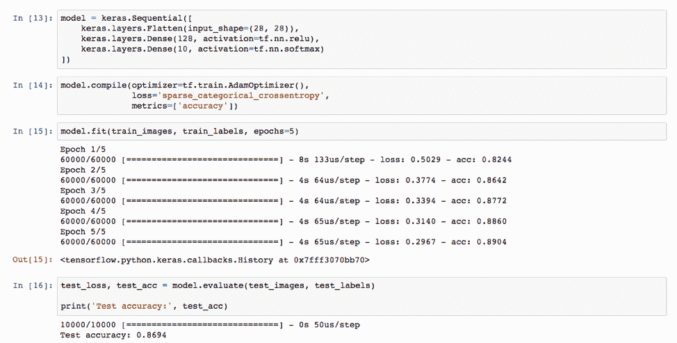

# 在 Watson Machine Learning Accelerator 定制 Notebook 中训练 Keras 和 MLlib 模型

> 原文：[`developer.ibm.com/zh/tutorials/training-keras-and-mllib-model-with-watson-machine-learning-accelerator/`](https://developer.ibm.com/zh/tutorials/training-keras-and-mllib-model-with-watson-machine-learning-accelerator/)

IBM Watson Machine Learning Accelerator 是捆绑了 IBM PowerAI、IBM Spectrum Conductor 和 IBM Spectrum Conductor™ Deep Learning Impact 的软件解决方案，由 IBM 为包括开源深度学习框架在内的整个堆栈提供支持。Watson Machine Learning Accelerator 为数据科学家提供了端到端的深度学习平台。这包含完整的生命周期管理，从安装和配置到数据摄取和准备，再到训练模型的构建、优化和分配，以及将模型移至生产环境。在您要将自己的深度学习环境扩展为包含多个计算节点时，Watson Machine Learning Accelerator 即可大显身手。现在甚至有免费评估版本可供使用。参阅我们的首个简介教程[利用 PowerAI 对图像进行分类](https://www.ibm.com/developerworks/cn/analytics/library/use-computer-vision-with-dli-watson-machine-learning-accelerator)，了解各项前提条件。

## 学习目标

这是此次 [IBM Watson Machine Learning Accelerator 系列培训](https://developer.ibm.com/zh/series/learn-watson-machine-learning-accelerator/)中的第二个教程：

*   任务：
    *   定制 Notebook 包以包含 Anaconda 和 sparkmagic。
    *   在 Watson Machine Learning Accelerator 上安装定制 Notebook 包。
    *   为 Notebook 创建 Spark 实例组。
    *   启动 Notebook 服务器并上传 Notebook 以训练 Keras 模型。
    *   从 Notebook 连接到 Hadoop 集群并执行 Spark MLlib 模型。

## 预估时间

完成本教程需要约 2 小时，包括近 30 分钟的模型训练、安装、配置以及通过 GUI 获取模型。

## 前提条件

本教程需要访问 GPU 加速的 IBM Power® Systems AC922 型或 S822LC 型服务器。除获取服务器外，还有多种方法可访问 [IBM PowerAI 开发者门户网站](https://developer.ibm.com/linuxonpower/deep-learning-powerai/try-powerai/)上列出的 Power Systems 服务器。

我们将使用现有定制 Notebook，其中包含用于安装 Watson Machine Learning Accelerator 1.1.2 随附的 PowerAI 1.5.4.1 的脚本。

## 任务 1：定制 Notebook 包以包含 Anaconda 和其他包

1.  从此 [github 存储库](https://github.com/IBMRedbooks/SG24-8535-AI-and-Hortonworks-Redbook)下载 `PowerAI-1.5.4.1-Notebook-Base.tar.gz` **注意：**可能有更高版本的包可用，如 1.5.4.2。 使用以下说明中的更高版本，将 1.5.4.1 版本号替换为最新版本。

2.  创建 `custom` 工作目录，并解压缩 PowerAI-1.5.4.1-Notebook-Base.tar.gz 包。

    ```
     mkdir custom
     tar -C custom -xzvf PowerAI-1.5.4.1-Notebook-Base.tar.gz 
    ```

3.  下载 Anaconda 存储库

    ```
    cd custom/package
    wget https://repo.continuum.io/archive/Anaconda3-5.2.0-Linux-ppc64le.sh
    cd .. 
    ```

4.  （可选）编辑 build.version 文件以包含当前日期。 此示例展示了使用 vi 编辑器执行的编辑。

    ```
     vi build.version
     enter insert mode (a) and edit the build data and number, for example

     Build Date: "Jan 17 2019"
     Build Number: 20190117

     esc and save the update (:qw) 
    ```

5.  （可选）更新 added_packs 文件，为定制 Notebook 添加其他感兴趣的 pip 包。

    ```
     vi scripts/added_packs
     enter insert mode (a) and scroll down to the bottom and add additional packages (one per line).  The current list of included packages are shown below.

       theano
       keras
       pandas
       sparkmagic

     esc and save the update (:qw) 
    ```

6.  对先前创建的 `custom` 目录中的包执行 `Tar` 操作。

    ```
     tar -czvf PowerAI-1.5.4.1-Notebook.tar.gz . 
    ```

此 Notebook 包现在即可安装在 Watson Machine Learning Accelerator 上。

## 任务 2：在 Watson Machine Learning Accelerator 上安装定制 Notebook

1.  使用 Spectrum Conductor 管理控制台打开 Spark Notebook Management 面板。

    

2.  添加新的 Notebook。

    

3.  填写 PowerAI-1.5.4.1-Notebook.tar.gz Notebook 的详细信息，然后单击 **Add**。

     

    *   为其提供名称（如 PowerAI）和版本（如 1.5.4.1，与 Notebook TAR 文件的版本匹配）。

    *   使用 **Browse** 按钮查找在任务 1 中创建的 PowerAI-1.5.4.1-Notebook.tar.gz 文件。

    *   勾选 **Enable collaboration for the notebook** 框。

    *   为 **Start**、**Stop** 和 **Monitor** 命令填入以下内容：

        ```
         ./scripts/start_jupyter.sh
          ./scripts/stop_jupyter.sh
          ./scripts/jobMonitor.sh 
        ```

    *   为 **Longest update interval for a job monitor** 指定秒数。我们使用的是 180 秒。

4.  单击 **Add** 开始上传 Notebook。 上传时间因网速而异。

Notebook 添加完成后，可进行配置，以便在新的或现有 Spark 实例组 (SIG) 中使用。在下一步中，我们将展示如何创建新的 SIG。

## 任务 3：为 Notebook 创建 Spark 实例组 (SIG)

1.  创建新的 SIG，并包含已添加的 Notebook。

    

    提供 SIG 名称、Spark 部署目录和执行用户。部署目录通常与执行用户（在此示例中为 demouser）关联。

2.  勾选新定制 Notebook PowerAI 1.5.4.1 所对应的框。

     

3.  为 Spark 执行器（GPU 插槽）更新 GPU 资源组。

    

4.  单击 **Create and Deploy Instance Group**。这样即可创建并部署 SIG。

5.  部署完成后，单击 **Start** 来启动 SIG。

    

## 任务 4：为用户创建 Notebook 服务器并上传 Notebook 以训练 Keras 模型

1.  启动 SIG 后，转至 **Notebook** 选项卡，单击 **Create Notebooks for Users**。

    

2.  为 Notebook 服务器选择用户。

    

3.  创建 Notebook 后，刷新屏幕以查看 **My Notebooks**。单击它即可显示为此 SIG 创建的 Notebook 服务器列表。

    

4.  选择 **PowerAI 1.5.4.1** Notebook 以显示 Notebook 服务器 URL。

5.  登录 Notebook 服务器。

    

6.  下载 [tf_keras_fashion_mnist.ipynb Notebook](https://github.com/IBMRedbooks/SG24-8535-AI-and-Hortonworks-Redbook/blob/master/tf_keras_fashion_mnist.ipynb)，并单击 **Upload** 将其上传到 Notebook 服务器。 指定要上传的 Notebook 后，必须再次单击该按钮。

    

7.  选择 Notebook，并开始执行各单元。Keras 模型在单元 [13] 中定义，并在单元 [15] 中训练。

    

模型测试显示经过五个训练回合后，准确性超过 86%。

## 任务 5：从 Notebook 连接到 Hadoop 集群并执行 Spark MLlib 模型

接下来这部分解释了如何使用 Notebook 连接到已部署 Apache Livy 服务的 Hadoop 数据湖。下图显示了 Hadoop 集成情况。


[Apache Livy](https://livy.incubator.apache.org/) 是支持通过 REST 接口轻松与 Spark 集群进行交互的服务。它支持长期运行的 Spark 会话和多租户。要将其安装到您的 Hadoop 集群上，可参阅您的 Hadoop 供应商文档，如此处来自 [Hortonworks](https://docs.hortonworks.com/HDPDocuments/HDP3/HDP-3.0.1/configuring-spark/content/configuring_the_livy_server.html) 的文档。可在 Hortonworks HDP 集群上完成以下两项更改，使 Spark MLlib Notebook 实现连接并运行。

1.  在 HDP Spark2 配置中设置 `livy.server.csrf_protection.enabled=false`，以禁用 Livy CSRF 检查。停止并重新启动所有服务以使更改生效。
2.  通过 pip 安装 Numpy 包。
    1.`yum -y install python-pip` 1.`pip install numpy`

[Sparkmagic](https://github.com/jupyter-incubator/sparkmagic) 在 Jupyter Notebook 中运行。它包含一组工具，用于以交互方式通过 Livy 处理远程 Spark 集群。它通过 pip 进行安装，并通过运行 Jupyter 命令在 Notebook 中启用。

登录 Notebook 服务器，导入本教程提供的 [hadoop_livy2_spark_mllib_test.ipynb](https://github.com/IBMRedbooks/SG24-8535-AI-and-Hortonworks-Redbook/blob/master/hadoop_livy2_spark_mllib_test.ipynb) Notebook 并执行。

*   Notebook 单元 [1] 用于验证是否可加载 sparkmagic 模块。
*   Notebook 单元 [2] 用于验证是否可创建 Spark 会话。编辑 URL 以指向 Livy 服务的 Hadoop 主机和端口。
*   Notebook 单元 [3] 用于下载数据并将其放在 hdfs /tmp 目录下。
*   Notebook 单元 [4] 用于运行 Spark MLlib kmeans 聚类模型。
*   Notebook 单元 [5] 用于清除 Livy 服务上运行的 Spark 会话。清除会话和关联的 Hadoop 集群资源至关重要。


## 结束语

现在，您已了解了如何在 Watson Machine Learning Accelerator 上定制和安装 Notebook 包。 随后即可使用此包将 Notebook 与 Keras 模型配合运行，运行可连接到 Hadoop 数据湖的 Notebook，并执行 Spark MLlib 模型。

本文翻译自：[Train Keras and MLlib models within a Watson Machine Learning Accelerator custom notebook](https://developer.ibm.com/tutorials/training-keras-and-mllib-model-with-watson-machine-learning-accelerator/)（2019-02-04）