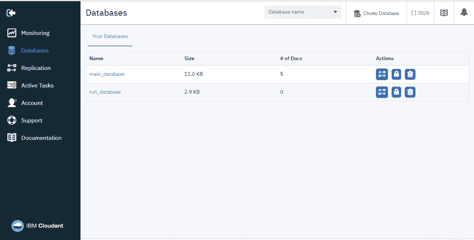

# 为 Android 开发全栈移动应用

> 原文：[`developer.ibm.com/zh/tutorials/developing-full-stack-mobile-apps-for-android/`](https://developer.ibm.com/zh/tutorials/developing-full-stack-mobile-apps-for-android/)

在本教程中，我们将使用 Android SDK 和 Kotlin 语言构建一个简单的跑步跟踪移动应用。这个应用应能跟踪用户的跑步数据，包括跑步时间、持续时长、距离和位置。为此，我们将访问设备的 GPS，使用它在 Google Maps 上显示用户的位置。随后，该数据会备份到云中，因此用户无需担心数据丢失。我们将使用 IBM Cloudant NoSQL DB 服务提供该应用程序的后端。

想好要构建何种应用程序后，让我们从开发流程开始吧。

如果您之前从未使用 Android Studio 构建过应用程序，您可能需要先阅读“[开发第一个 Android 应用程序](https://developer.ibm.com/tutorials/develop-android-applications-with-android-studio/)”教程。

## 构建应用需要做的准备工作

*   [Android Studio 3.0 或更高版本](https://developer.android.com/studio/)
*   [IBM Cloud™ 帐户](https://cloud.ibm.com/registration?cm_sp=ibmdev-_-developer-tutorials-_-cloudreg/)
*   [Google Map API 密钥](https://cloud.google.com/maps-platform/#get-started)

1

## 创建一个新的 Android 项目

像往常一样，创建 Android 应用的第一步是设置开发环境。幸运的是，可以使用 Android SDK 轻松完成此操作。您只需[下载 Android Studio](https://developer.android.com/studio/) 并将其安装在您的系统上。完成安装和初始化后，您将拥有创建 Android 项目所需的所有工具。

下一步是使用 Android Studio 创建一个新的 Android 项目。在弹出的对话框菜单中，不要忘记激活 Kotlin 支持，因为这是我们将要使用的语言。我们将使用 [Kotlin](https://kotlinlang.org/) 而不是 Java™ 来开发我们的应用程序是因为与 Java 相比，Kotlin 需要的代码要少得多，因此可以更快地编写代码。

在 API 层面，您应该使用 API level 15，因为我们的应用程序不需要最新 SDK 中的高级功能。

项目创建过程的最后一部分是该应用的主活动 （Activity）。对于我们的跑步跟踪应用程序，该主活动应显示一个历史跑步数据列表和一个跟踪新跑步的按钮。考虑到这些，我们将该活动命名为 HomeActivity，并使用 Basic Activity 作为初始活动的模板（参见图 1）。

**图 1\. 新建活动模板对话框**


这样，我们就有了一个准备好工作的新 Android 项目。

来讲讲我们的应用程序的工作原理吧。我们的应用程序有 3 个独立的活动：

*   一个活动显示用户历史跑步数据的列表
*   一个活动跟踪用户的跑步数据
*   一个活动显示每次跑步的详细数据

我们将使用刚创建的 HomeActivity 活动来显示跑步列表。但是，我们还没有任何跑步数据能够列出，因此，我们先来创建跟踪该数据的活动。

2

## 跟踪跑步数据

创建一个新活动，这次将它命名为 TrackActivity，并使用 Empty Activity 作为模板。现在，项目文件夹中应该有两个活动文件，如图 2 所示。

**图 2\. 活动文件**


开始处理 `TrackActivity` 之前，需要为用户提供一种导航至第二个活动的方法。为此，请在 `TrackActivity` 文件上，将以下代码添加到 fab 对象单击监听器：

```
fab.setOnClickListener {
startActivity(Intent(this, TrackActivity::class.java))
} 
```

现在，当单击 HomeActivity 上的 Floating Action Button (FAB) 时，应用将会打开 `TrackActivity`。

2a

### 创建一个计时器来跟踪跑步持续时间

创建一个新活动，这次将它命名为 TrackActivity，并使用 Empty Activity 作为模板。现在，项目文件夹中应该有两个活动文件，如图 2 所示。

在 `TrackActivity` 屏幕中，有两种我们将要跟踪的主要信息。第一类是跑步持续时间，第二类是跑步路线。让我们从跟踪跑步持续时间开始。

要跟踪跑步持续时间，需添加一个按钮，用户可以使用该按钮来开关跟踪过程，另外还需添加一个计时器来计算跑了多长时间。我们可以通过以下清单中的 XML 代码行，将必要的界面组件添加到 res/layout/activity_track.xml。

```
<TextView
   android:id="@+id/text_duration"
   android:layout_width="wrap_content"
   android:layout_height="wrap_content"
   android:layout_marginBottom="4dp"
   android:layout_marginLeft="16dp"
   android:layout_marginStart="16dp"
   android:text="00:00:000"
   android:textSize="36sp"
   android:textStyle="bold"
   app:layout_constraintBottom_toTopOf="@+id/button_track"
   app:layout_constraintStart_toStartOf="parent" />

<Button
   android:id="@+id/button_track"
   android:layout_width="0dp"
   android:layout_height="wrap_content"
   android:layout_marginBottom="16dp"
   android:layout_marginLeft="16dp"
   android:layout_marginRight="16dp"
   android:enabled="false"
   android:paddingBottom="20dp"
   android:paddingTop="20dp"
   android:text="Start"
   android:textSize="20sp"
   app:layout_constraintBottom_toBottomOf="parent"
   app:layout_constraintEnd_toEndOf="parent"
   app:layout_constraintStart_toStartOf="parent" /> 
```

如果运行该应用程序并打开 `TrackActivity`，则会显示一个类似于图 3 的用户界面。

**图 3\. 计时器用户界面**


由于我们的 `TrackActivity` 有一些用户界面元素，因此我们要访问它们进行进一步配置。使用 `findViewById` 函数获取界面对象，然后向该按钮添加一个监听器，以处理计时器的启动和停止。要完成此操作，将以下清单中的代码添加到 `TrackActivity` 类：

```
class TrackActivity : AppCompatActivity() {
   private var mTracking: Boolean = false

   override fun onCreate(savedInstanceState: Bundle?){
       super.onCreate(savedInstanceState)
       setContentView(R.layout.activity_track)
       setSupportActionBar(toolbar)

       var buttonTrack: Button = findViewById(R.id.button_track)
       var textDuration: TextView = findViewById(R.id.text_duration)

       buttonTrack.setOnClickListener {
           if (mTracking) {
               //Stop tracking process
           } else {
               //Start tracking process              
           }

           mTracking = !mTracking
       }
   }
} 
```

有了 text 用户界面元素后，在其上实现计时器系统。在 Android 应用程序中实现计时器稍微有点复杂，因为 Android 应用程序通常基于事件运行，而不是实时运行。因此，要获取有效的计时器，必须依靠多线程技术并使用 `Handler` 类，如以下代码清单中所示：

```
var duration: Long = 0

var handler: Handler = Handler()

buttonTrack.setOnClickListener {
   if (mTracking) {
       handler.removeCallbacksAndMessages(null)
   } else {
       startTime = System.currentTimeMillis()

       handler.post(object: Runnable {
           override fun run() {
               duration = System.currentTimeMillis() - startTime
               var formatter = SimpleDateFormat("mm:ss:SSS")
               textDuration.text = formatter.format(Date(duration))

               handler.postDelayed(this, 20)
           }
       })    
   }
} 
```

那么，我们的计时器系统是如何运作的呢？在启动 `Handler` 循环之前，它首先使用 `System.currentTimeMillis` 函数记录系统的当前毫秒值。然后，在 `Handler` 循环内，它仅计算当前时间差来跟踪持续时间并更新 text。之后，我们以 20 毫秒的延迟再次调用同一个 `Handler` 函数。最后，在用户停止跟踪时，请不要忘记使用 `removeCallbacksAndMessages` 函数停止该处理程序。

2b

### 显示一个用来跟踪用户位置的地图

介绍了跟踪的时间部分后，我们将介绍位置跟踪。对于位置跟踪，需要添加两个界面组件：Google Maps 组件（它的类在代码中名为 `MapView`）和距离计数器。为此，将以下代码行添加到 activity_track.xml 文件：

```
<TextView
   android:id="@+id/text_distance"
   android:layout_width="wrap_content"
   android:layout_height="wrap_content"
   android:layout_marginBottom="4dp"
   android:layout_marginEnd="16dp"
   android:layout_marginRight="16dp"
   android:text="0.00 m"
   android:textSize="36sp"
   android:textStyle="bold"
   app:layout_constraintBottom_toTopOf="@+id/button_track"
   app:layout_constraintEnd_toEndOf="parent" />

<com.google.android.gms.maps.MapView
   android:id="@+id/map"
   android:layout_width="0dp"
   android:layout_height="0dp"
   android:layout_marginBottom="8dp"
   android:layout_marginEnd="16dp"
   android:layout_marginLeft="16dp"
   android:layout_marginRight="16dp"
   android:layout_marginStart="16dp"
   android:layout_marginTop="16dp"
   app:layout_constraintBottom_toTopOf="@+id/text_duration"
   app:layout_constraintEnd_toEndOf="parent"
   app:layout_constraintStart_toStartOf="parent"
   app:layout_constraintTop_toTopOf="parent" /> 
```

将 `MapView` 和距离计数器添加到 `TrackActivity` 后，该活动应该类似于图 4。

**图 4\. TrackActivity 上的 MapView**


默认情况下，`MapView` 未包含在 Android SDK 中，但幸运的是，Android Studio 会自动下载所需的库并将正确的依赖项添加到项目。但是，要进一步使用 `MapView`，我们必须注册一个 Google Map API 密钥。为此，在 `<application>` 标签下插入以下代码行，将我们先前创建的 Google Map API 在 app/manifests/AndroidManifest.xml 中注册：

```
<meta-data
   android:name="com.google.android.geo.API_KEY"
   android:value="INSERT API KEY HERE" /> 
```

要正确使用 `MapView` 并跟踪用户的位置，必须向用户请求权限。这个过程包含两个部分：第一部分将需要的权限添加到应用清单中，我们可以通过添加以下代码行来完成此操作：

```
<uses-permission android:name="android.permission.INTERNET" />
<uses-permission android:name="android.permission.ACCESS_NETWORK_STATE" />
<uses-permission android:name="android.permission.ACCESS_FINE_LOCATION" />
<uses-permission android:name="android.permission.ACCESS_COARSE_LOCATION" /> 
```

另一部分是在应用运行时主动向用户请求权限。在此应用中，请求权限的最佳时间是在用户进入 `TrackActivity` 之前。因此，让我们暂时返回 `HomeActivity`，修改 FAB 单击监听器，使其包含权限检查，如以下清单所示。

```
var permission = Manifest.permission.ACCESS_FINE_LOCATION
var granted = PackageManager.PERMISSION_GRANTED

if (ActivityCompat.checkSelfPermission(this, permission) == granted) {
   startActivity(Intent(this, TrackActivity::class.java))
} else {
   ActivityCompat.requestPermissions(this, arrayOf(permission), 1)
} 
```

现在，每当我们尝试在应用中打开 `TrackActivity` 时，如果之前没有提供位置权限，系统会要求用户提供位置权限（参见图 5）。这样，我们就不会在 `TrackActivity` 中遇到任何权限问题。

**图 5\. 请求位置权限的对话框**


处理了权限部分后，我们应将注意力放回到 `MapView` 上。与其他用户界面元素不同，将 `MapView` 集成到我们的活动中需要做一些额外的工作。要使 MapView 正常工作，必须在处理活动生命周期的同时处理其生命周期。为此，我们需要覆盖 `TrackActivity` 上的 `onStart`、`onStop` 等生命周期函数，然后从 `MapView` 调用相应的函数，如下面的清单所示：

```
override fun onStart() {
   super.onStart()
   findViewById<MapView>(R.id.map).onStart()
}

override fun onResume() {
   super.onResume()
   findViewById<MapView>(R.id.map).onResume()
}

override fun onPause() {
   findViewById<MapView>(R.id.map).onPause()
   super.onPause()
}

override fun onStop() {
   super.onStop()
   findViewById<MapView>(R.id.map).onStop()
}

override fun onDestroy() {
   findViewById<MapView>(R.id.map).onDestroy()
   super.onDestroy()
}

override fun onSaveInstanceState(outState: Bundle) {
   super.onSaveInstanceState(outState)
   findViewById<MapView>(R.id.map).onSaveInstanceState(outState)
}

override fun onLowMemory() {
   super.onLowMemory()
   findViewById<MapView>(R.id.map).onLowMemory()
} 
```

然后，您应该初始化 `MapView`，并在完成初始化后进一步配置它。对于此应用，我们希望用户无法与 `MapView` 交互，因此我们将禁用其上的各种控制选项。所有这些都可以通过将以下清单中的代码添加到 `TrackActivity` 类来完成：

```
var mapView: MapView = findViewById(R.id.map)

var map: GoogleMap? = null

mapView.onCreate(savedInstanceState)
mapView.getMapAsync(object : OnMapReadyCallback {
   override fun onMapReady(googleMap: GoogleMap?){
       map = googleMap;

       if (map != null) {
           map!!.setMinZoomPreference(16f)
           map!!.isMyLocationEnabled = true
           map!!.uiSettings.isZoomControlsEnabled = false
           map!!.uiSettings.isScrollGesturesEnabled = false
           map!!.uiSettings.isMyLocationButtonEnabled = false
       }
   }

}) 
```

2c

### 通过跟踪用户位置来更新地图

实现 `MapView` 之后，我们可以继续跟踪用户的位置或跑步路线。可以使用 `FusedLocationProviderClient` API 并调用 `requestLocationUpdates` 函数来获得用户的连续位置。调用该函数之前，我们应该配置应用所需的位置数据，以及我们需要的频率。为此，我们可以实例化一个 `RequestLocation` 对象，然后指定 `interval` 和 `priority` 参数。

然后，在获取位置数据后，应该使用 `map.moveCamera()` 函数来更新 `MapView` 位置。我们还应保存最新的位置数据，并使用 `Location.distanceBetween` 函数来将其与以前的数据进行比较，以便计算用户自上次位置更新以来移动了多远。

当然，在用户关闭跟踪时，我们应该通过调用 `removeLocationUpdates` 函数来停止连续位置请求。可以使用以下代码行来实现所有这些功能：

```
var textDistance: TextView = findViewById(R.id.text_distance)

var duration: Long = 0
var startCoordinate: LatLng? = null
var finishCoordinate: LatLng? = null

var locationListener: LocationCallback = object : LocationCallback(){
   override fun onLocationResult(result: LocationResult?){
       if (result != null) {
           var previousCoordinate: LatLng? = finishCoordinate

           var lastLoc = result.lastLocation
           finishCoordinate = LatLng(lastLoc.latitude, lastLoc.longitude)

           if (startCoordinate == null) {
               startCoordinate = finishCoordinate;
           }

           if (map != null) {
               map!!.moveCamera(CameraUpdateFactory.newLatLng(finishCoordinate))
           }

           if (previousCoordinate != null) {
               var results: FloatArray = floatArrayOf(0.0f)
               Location.distanceBetween(
                       previousCoordinate.latitude,
                       previousCoordinate.longitude,
                       finishCoordinate!!.latitude,
                       finishCoordinate!!.longitude,
                       results)

               distance += results[0]
               textDistance.text = String.format("%.2f m", distance)
           }
       }
   }
}

buttonTrack.setOnClickListener {
   if (mTracking) {       
       var locationProvider = LocationServices.getFusedLocationProviderClient(this)
       locationProvider.removeLocationUpdates(locationListener)
   } else { 
       distance = 0f
       startCoordinate = null
       finishCoordinate = null       

       var request: LocationRequest = LocationRequest().apply {
           priority = LocationRequest.PRIORITY_HIGH_ACCURACY
           fastestInterval = 1000
           interval = 10000
       }

       var builder = LocationSettingsRequest.Builder()
       builder.addLocationRequest(request)
       LocationServices.getSettingsClient(this).checkLocationSettings(builder.build())

       var provider = LocationServices.getFusedLocationProviderClient(this)
       provider.requestLocationUpdates(request, locationListener, Looper.myLooper())
   }
} 
```

这就是跑步跟踪功能。如果运行该应用并跟踪一次跑步，则会显示一个类似图 6 的屏幕。

**图 6\. TrackActivity 跟踪一次跑步**


3

## 显示跑步数据

既然我们的应用已能捕捉跑步数据，那么它还应该能够显示它们，下面我们来为应用实现数据显示功能。为此，我们应该创建第三个活动来显示一次跑步的详细信息。

在创建此活动之前，我们先创建一个用来暂存跑步数据的类，并能导出和导入该数据的 `HashMap`。后一点很重要，因为我们将以 `HashMap` 形式在活动之间和客户端-服务器之间移动数据。我们将这个类命名为 `RunData`，该类的完整实现可以在我的 [runlover Github 存储库](https://github.com/LegACy99/runlover/blob/master/app/src/main/java/com/raka/runlover/RunData.kt)的 RunData.kt 文件中找到，该存储库包含本项目的所有代码。

创建另一个名为 `DetailActivity` 的活动，该活动使用 Empty Activity 作为模板。在完成跑步跟踪后，用户应该能够通过单击 `TrackActivity` 中的 Save 按钮来导航到此活动。为此，请将以下代码插入到按钮单击监听器中，以便打开 `DetailActivity` 并发送记录的跑步数据：

```
var buttonSave: Button = findViewById(R.id.button_save)

buttonSave.setOnClickListener {
   var data: HashMap<String, Any> = RunData.CreateMap(
         startTime, duration, distance, startCoordinate, finishCoordinate)

   var detailIntent: Intent = Intent(this, DetailActivity::class.java)
   detailIntent.putExtra(DetailActivity.EXTRA_DATA, data)

   finish()
   startActivity(detailIntent)
} 
```

在 `DetailActivity` 中，应该使用从 `TrackActivity` 发送的数据并在屏幕上显示它们。要实现此操作，第一步是检索数据并利用这些数据构造一个 `RunData` 对象，这可通过将以下代码添加到 `DetailActivity` 来完成：

```
class DetailActivity : AppCompatActivity() {
   companion object {
       const val EXTRA_DATA = "data"
   }

   private lateinit var mData: RunData

   override fun onCreate(savedInstanceState: Bundle?){
       super.onCreate(savedInstanceState)
       setContentView(R.layout.activity_detail)
       setSupportActionBar(toolbar)

       var extra = intent.getSerializableExtra(EXTRA_DATA) as Map<String, Any>
       mData = RunData(extra)
   }
} 
```

在可以显示数据之前，需要在该活动上添加一些界面组件。`DetailActivity` 的布局类似于 `TrackActivity`，包含一个 `MapView` 和一些文本视图，以显示跑步数据。可以使用[我的 activity_detail.xml 文件中的 XML 代码](https://github.com/LegACy99/runlover/blob/master/app/src/main/res/layout/activity_detail.xml) 来设置 `DetailActivity` 的必要界面。

现在，您已拥有 `DetailActivity` 的用户界面，可以向 `DetailActivity` 添加以下代码，使其显示正确的数据：

```
var textDate: TextView = findViewById(R.id.text_date)
var textDuration: TextView = findViewById(R.id.text_duration)
var textDistance: TextView = findViewById(R.id.text_distance)

var dateFormatter = SimpleDateFormat("dd/MM/yyyy")
var timeFormatter = SimpleDateFormat("mm:ss:SSS")
var durationString = timeFormatter.format(Date(mData.getDurationInMillis()))

textDate.text = dateFormatter.format(Date(mData.getDateInMillis()))
textDistance.text = String.format("Distance: %.2f m", mData.getDistance())
textDuration.text = "Duration: $durationString" 
```

如果运行该应用并保存跑步数据，那么该应用应类似于图 7。

**图 7\. 显示跑步细节的 DetailActivity**


到此，我们已实现了应用的数据显示功能。

4

## 连接到云

该应用程序不应该仅捕捉和显示用户的跑步数据，还应该将数据存储到云中。要添加此功能，首先需要设置用来存储此数据的后端服务器。

我们不会创建自己的后端系统，而是使用 IBM Cloudant NoSQL DB 服务作为应用的后端。通过使用此服务，您不必担心提供或配置远程服务器，您可以全神专注于构建移动应用。

4a

### 设置 Cloudant NoSQL DB 服务

设置 Cloudant NoSQL DB 服务很简单。首先，[从此处](https://cloud.ibm.com/catalog/services/cloudant?cm_sp=ibmdev-_-developer-tutorials-_-cloudreg)登录到您的 IBM Cloud 帐户，使用它创建一个 Cloudant NoSQL DB 服务实例。然后，在创建该服务后，启动服务仪表板并访问左侧的 Databases 菜单。这里需要至少一个数据库，因此请使用顶部的 Create Database 按钮来创建一个新的数据库，并记住这个新数据库的名称。

**图 8\. Cloudant NoSQL DB 服务仪表板**



该服务的设置已完成。后端已准备好检索和存储数据。尽管如此，目前还不要关闭仪表板，因为我们很快将再次需要它。

4b

### 将 Cloudant Sync 添加到我们的 Android 项目

在准备好远程数据库后，需要从移动应用程序访问它。幸运的是，Cloudant 提供了一个名为 [Cloudant Sync](https://github.com/cloudant/sync-android) 的 Android 库来提供该访问功能。要将 Cloudant Sync 库添加到我们的项目，请打开 `build.gradle(Project)` 并插入以下代码行：

```
allprojects {
   repositories {
       mavenLocal()
       mavenCentral()
   }
} 
```

将以下代码行插入到 build.gradle(App) 中：

```
dependencies {   
   implementation 'com.cloudant:cloudant-sync-datastore-android:latest.release'
} 
```

Cloudant Sync 库提供了我们在项目中将会用到的两个主要功能。第一个是处理在本地设备上存储和检索数据的 `DocumentStore` API，它允许应用即使在离线时也能正常运行。另一个是处理复制或同步本地和远程数据的 `Replicator` API。正确使用这两个功能是将我们的应用连接到后端的关键。

要将我们的移动应用程序与 Cloudant NoSQL DB 服务相连接，必须为这个库提供正确的 URL。可以从我们先前打开的 IBM Cloud 仪表板中获取此 URL。转到左侧的 Service credentials 菜单，打开列表中的一个凭证条目；我们需要的 URL 地址应该在此处写入。

4c

### 将数据发送到后端

我们已准备好连接到后端，是时候在应用中实现云功能了。在 Save 按钮中，单击 `TrackActivity` 上的监听器，添加以下代码来将跑步数据保存到本地，然后将它上传到远程数据库。

```
buttonSave.setOnClickListener {
   var data: HashMap<String, Any> = RunData.CreateMap(
         startTime, duration, distance, startCoordinate, finishCoordinate)

   var document: DocumentRevision = DocumentRevision()
   document.body = DocumentBodyFactory.create(data)

   var directory = getDir("DocumentStore", Context.MODE_PRIVATE)
   var store: DocumentStore = DocumentStore.getInstance(directory)
   store.database().create(document)

   var databaseURI: URI = URI("$BACKEND_URL/$DATABASE_NAME")
   var uploader = ReplicatorBuilder.push().from(store).to(databaseURI).build()
   uploader.start()
} 
```

要将该数据存储在后端，可以先创建一个包含跑步数据的 `DocumentRevision` 对象。然后，通过调用 `DocumentStore` API 的 `database.create` 函数，将此对象存储在本地文件上。接着，通过调用 Replicator API 的 `push` 函数，将其同步到远程数据库。这些就是将数据发送到后端所需的所有操作。

4d

### 从后端检索数据

现在，我们的应用能够在云中存储数据，但如果不打算重新检索数据，为什么还要这样做呢？这正是我们接下来要做的。 让我们返回到创建的第一个活动 `HomeActivity` 上，并让它显示包含用户所有跑步数据的列表。

在显示该列表之前，首先需要检索所有数据。将以下代码添加到 `HomeActivity` 中，以调用 `DocumentStore` API 的 `database.read` 函数来读取保存在本地的所有跑步数据：

```
class HomeActivity : AppCompatActivity() {
   private var mStore: DocumentStore? = null

   private var mHistory: ArrayList<RunData> = ArrayList<RunData>()

   override fun onCreate(savedInstanceState: Bundle?){
       super.onCreate(savedInstanceState)
       setContentView(R.layout.activity_home)
       setSupportActionBar(toolbar)  

       var directory = getDir("DocumentStore", Context.MODE_PRIVATE)
       mStore = DocumentStore.getInstance(directory)       
   }

   override fun onStart() {
       super.onStart()

       readHistoryData()
   }

   private fun readHistoryData() {
       if (mStore != null) {
           var database = mStore!!.database();

           if (mHistory.count() != database.documentCount) {
               mHistory.clear()

               var documentList = database.read(0, database.documentCount, true)
               for (document in documentList) {
                   mHistory.add(RunData(document.body.asMap()))
               }
           }
       }
   }
} 
```

我们还需要检查远程数据库并下载其存储的所有新跑步数据。为此，只需调用 `Replicator` API 的 `pull` 函数，并创建监听器函数来检测下载何时完成，如以下清单所示：

```
override fun onCreate(savedInstanceState: Bundle?){
   //Other initialization here

   var databaseURI: URI = URI("$BACKEND_URL/$DATABASE_NAME")
   mDownloader = ReplicatorBuilder.pull().from(databaseURI).to(mStore).build()
   mDownloader!!.eventBus.register(this)
   mDownloader!!.start()
}

@Subscribe
public fun onComplete(event: ReplicationCompleted) {
   mDownloader!!.eventBus.unregister(this)
   mDownloader = null

   readHistoryData()
}

@Subscribe
public fun onError(event: ReplicationErrored) {
   mDownloader!!.eventBus.unregister(this)
   mDownloader = null
} 
```

5

## 显示跑步数据列表

现在，我们有一个跟踪用户跑步数据的有效 `TrackActivity` 和一个显示用户跑步数据的有效 `DetailActivity`。剩下的工作就是显示应用已跟踪的所有历史跑步数据。因此，让我们返回到 `HomeActivity`，并使其显示一个跑步数据列表。

5a

### 准备用户界面

我们需要使用 `HomeActivity` 上的一个用户界面来显示已捕捉的所有数据。要完实现操作，通过添加以下代码行到 res/layout/content_home.xml 中，将一个 `RecyclerView` 插入该活动中：

```
<android.support.v7.widget.RecyclerView
   android:id="@+id/recycler_history"
   android:layout_width="match_parent"
   android:layout_height="match_parent"
   tools:listitem="@layout/view_history"/> 
```

`RecyclerView` 实质上是一个界面组件，用于显示列表、网格或其他格式中的多项数据。要定义列表中每一项的外观，需要为这些项创建单独的布局文件。使用[这个 XML 文件](https://github.com/LegACy99/runlover/blob/master/app/src/main/res/layout/view_history.xml)，将它放在 layout 文件夹中，以便稍后可以将其用于数据列表。

5b

### 处理并显示列表

就像 `RecyclerView` 有两个独立的布局信息一样，在其上显示数据也需要两个单独的类。其中一个类是 `RecyclerView.Adapter`，用于处理要显示的项的完整列表。另一个是 `RecyclerView.ViewHolder`，用于处理每个项的呈现方式。

我们首先创建一个继承自 `RecyclerView.Adapter` 的新类 `HistoryAdapter`。然后在这个类中，创建一个继承自 `RecyclerView.ViewHolder` 的内部类 `HistoryViewHolder`。在 `HistoryViewHolder` 中，查询每项的界面组件，以便稍后可以显示相应的数据，如下面的清单所示：

```
class HistoryAdapter(): RecyclerView.Adapter<HistoryAdapter.HistoryViewHolder>() {

   class HistoryViewHolder constructor(view: View) : RecyclerView.ViewHolder(view) {
       public var textDate: TextView
       public var textDuration: TextView
       public var textDistance: TextView

       init {
           textDate = view.findViewById(R.id.text_date)
           textDuration = view.findViewById(R.id.text_duration)
           textDistance = view.findViewById(R.id.text_distance)
       }
   }
} 
```

准备好 `ViewHolder` 后，现在可以处理 `HistoryAdapter` 类的剩余部分了。添加以下代码来覆盖该类中的多个函数，以便它返回正确的结果：

```
class HistoryAdapter(private var mHistory: List<RunData>):
       RecyclerView.Adapter<HistoryAdapter.HistoryViewHolder>() {

   override fun onCreateViewHolder(parent: ViewGroup, vType: Int): HistoryViewHolder {
       var inflater: LayoutInflater = LayoutInflater.from(parent.context)
       var view: View = inflater.inflate(R.layout.view_history, parent, false)

       return HistoryViewHolder(view)
   }

   override fun onBindViewHolder(holder: HistoryViewHolder, position: Int) {
       var distance = mHistory[position].getDistance()
       var duration = Date(mHistory[position].getDurationInMillis())
       var date = Date(mHistory[position].getDateInMillis())

       holder.textDistance.text = String.format("%.2f m", distance)
       holder.textDuration.text = SimpleDateFormat("mm:ss:SSS").format(duration)
       holder.textDate.text = SimpleDateFormat("dd/MM/yyyy").format(date)
   }

   override fun getItemCount(): Int {
       return mHistory.count()
   }
} 
```

准备好 `HistoryAdapter` 类和 `HistoryViewHolder` 类后，我们的 `RecyclerView` 应该能够正确显示数据了。要让它显示我们跟踪的所有跑步数据，必须为它提供这些数据。将以下代码行插入到 `HomeActivity`，以访问 `RecyclerView`，并根据用户的跑步数据来更新它：

```
override fun onCreate(savedInstanceState: Bundle?){
   var orientation = DividerItemDecoration.VERTICAL
   var recycler: RecyclerView = findViewById(R.id.recycler_history)   
   recycler.addItemDecoration(DividerItemDecoration(this, orientation))
   recycler.setHasFixedSize(true)

   recycler.layoutManager = LinearLayoutManager(this)
   recycler.adapter = HistoryAdapter(mHistory)
}

private fun readHistoryData() {
   //Reading new data

   var recycler: RecyclerView = findViewById(R.id.recycler_history)
   recycler.adapter.notifyDataSetChanged()
   recycler.recycledViewPool.clear()
   recycler.invalidate()
} 
```

现在，我们的应用程序应该能在 `HomeActivity` 上正确显示用户的跑步数据列表了，如图 9 所示。

**图 9\. HomeActivity 显示跑步数据列表**


5c

### 创建可单击的列表

准备好这个列表后，我们还有最后一件事要做。我们应该向用户提供一种方法，使其能够在单击跑步数据列表中的某一项时导航到 `DetailActivity`。要实现此目标，请先使用以下清单中的代码，向 `HistoryViewHolder` 添加一个单击监听器：

```
class HistoryAdapter(private var mHistory: List<RunData>,
                    private var mListener: OnItemClickListener):
       RecyclerView.Adapter<HistoryAdapter.HistoryViewHolder>() {

   interface OnItemClickListener {
       fun onItemClick(data: RunData)
   }

   class HistoryViewHolder constructor(view: View) : RecyclerView.ViewHolder(view) {

       public fun setOnClickListener(listener: OnItemClickListener, data: RunData) {
           itemView.setOnClickListener {
               listener.onItemClick(data)
           }
       }
   }

   override fun onBindViewHolder(holder: HistoryViewHolder, position: Int) {
       //Displaying data on TextView

       holder.setOnClickListener(mListener, mHistory[position])
   }
} 
```

然后，在 `HomeActivity` 上构造 `HistoryAdapter` 时，使用以下代码行添加活动导航功能：

```
var clickListener = object : HistoryAdapter.OnItemClickListener{
   override fun onItemClick(data: RunData) {
       var dataMap = RunData.CreateMap(
               data.getDateInMillis(),
               data.getDurationInMillis(),
               data.getDistance(),
               data.getStartCoordinate(),
               data.getFinishCoordinate())

       var detailIntent = Intent(applicationContext, DetailActivity::class.java)
       detailIntent.putExtra(DetailActivity.EXTRA_DATA, dataMap)

       startActivity(detailIntent)
   }
}

recycler.adapter = HistoryAdapter(mHistory, clickListener) 
```

如果运行该应用程序，那么您应该能够单击列表中的每一项来快速访问每次跑步的详细信息。

6

## 构建并运行该应用程序

我们已实现所有必需的功能，只剩下使用 Build > Build APK(s) 菜单来构建该应用程序了。

就这么简单。现在，您已拥有一个功能齐全的移动应用，它可以跟踪用户的跑步数据并将其存储在云中。

还有一些次要细节没有涉及到，比如在地图上显示位置标记，但您可以在我的 GitHub 存储库[完整项目](https://github.com/LegACy99/runlover)中自行查阅。

## 结束语及后续步骤

既然您已知道如何从零开始构建 Android 应用，那么您接下来还可以有很多尝试。您可以构建您感兴趣的新应用，也可以通过进一步学习向该应用程序添加更多功能，可以添加简单的“删除跑步”功能，或者可以添加复杂的授权系统。

祝您好运！

本文翻译自：[Developing full-stack mobile apps for Android](https://developer.ibm.com/tutorials/developing-full-stack-mobile-apps-for-android/)（2018-10-11）