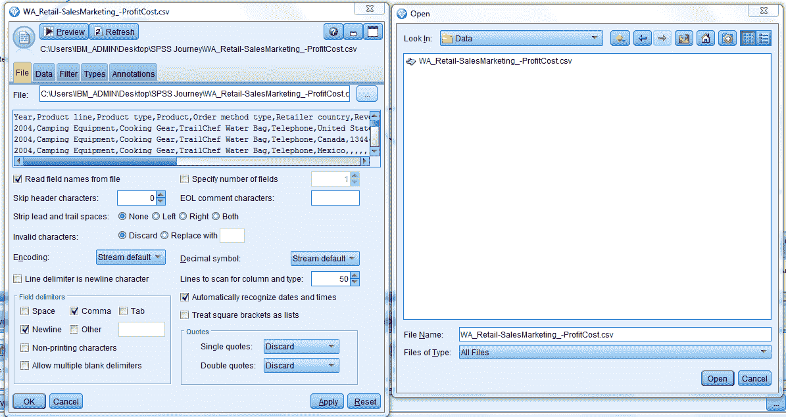
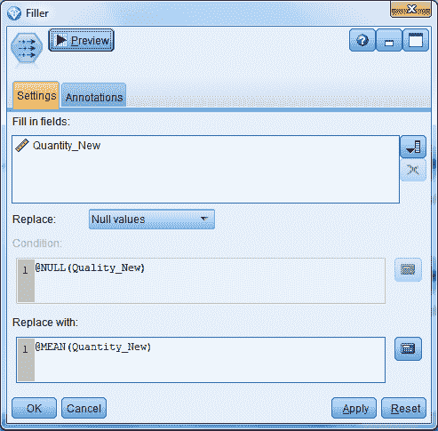
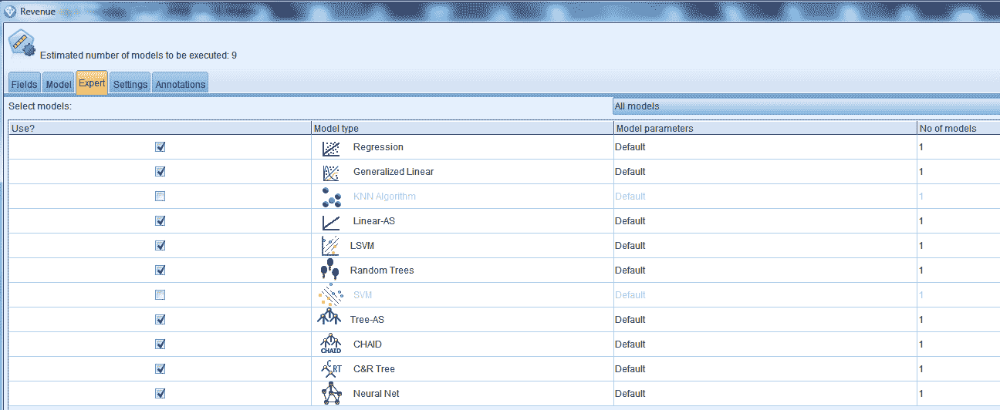

# 使用 SPSS 通过数据分析生成洞察

> 原文：[`developer.ibm.com/zh/tutorials/spss-data-modelling-prediction/`](https://developer.ibm.com/zh/tutorials/spss-data-modelling-prediction/)

作为一个数据挖掘应用程序，IBM SPSS Modeler 提供了一种在大数据集中查找有用关系的策略方法。与更传统的统计方法相比，您不需要在一开始就知道要查找哪些关系。您可以探索您的数据，拟合不同的模型并调查不同的关系，直到找到有用的信息。本教程已在 Windows 7 上使用 IBM SPSS Modeler v18.1 进行了测试。

## 学习目标

学完本教程后，您将掌握如何：

*   使用 IBM SPSS Modeler v18.1 创建统计模型并审查所创建的统计模型

## 前提条件

*   [IBM SPSS Modeler](https://www.ibm.com/products/spss-modeler)
*   数据。本教程使用来自 Watson Analytics 社区的标有 [`WA_Retail-SalesMarketing_-ProfitCost.csv`](https://www.ibm.com/communities/analytics/watson-analytics-blog/retail-sales-marketing-profit-cost/) 的数据。

## 预估时间

完成本教程大约需要 30 分钟。

## 步骤

### 启动 IBM SPSS Modeler

利用 IBM SPSS Modeler 处理数据需要三个步骤。

*   首先，将数据读入 IBM SPSS Modeler。
*   其次，通过一系列操作来运行数据。
*   最后，将数据发送至目标。

其中的一系列操作被称为数据流，因为每个操作中，数据都是按照记录逐条地从来源移动，最终，生成一种模型或数据输出。

继续这个分步操作过程。通过右键单击每个节点并按住 *Connect* 移动到下一个节点，选择节点、操作节点并连接到后续节点。

### 1.读取数据

#### 导入数据

这是 SPSS 流中的第一步。选择 *Sources* 面板下的 *Var.File* 节点，并拖放到 SPSS Modeler 界面上。*Var.File* 选项用于读取 csv 文件、文本文件等。

#### 读取数据

下一个操作是将数据读入 SPSS。选择文件右侧的单选按钮，导航到保存数据文件的文件夹。单击 *open*，然后单击 *OK*。

#### 审核数据

第三个操作是从 Output 面板中选择 *Data Audit* 节点。

*Data Audit* 节点有助于确认存在多少条有效记录，以及基本的统计数据。下面的屏幕截图显示记录总数为 84672，*Revenue* 及下面的属性仅有 24743 条有效记录，剩余属性为 null。

#### 替换 null 值

下一个操作是将 null 替换为各个属性的均值。从 Field Ops 面板中选择 *Filler* 节点，然后从 Output 面板中选择 *Set Globals* 节点，以查找多个属性的均值。

将 *Nulls* 替换为 *Mean* （均）值。

#### 派生新变量

数值列应该包含实数。这里创建了一个名为 *Quantity_New* 的新属性来将数据类型从整数转换为实数。

将新创建的变量的 *Nulls* 替换为 *Mean* 值。

#### 再次审核数据

再次运行 *Data Audit*，检查 *Nulls* 是否已替换为 *Mean* 值。 请注意，除 *Quantity* 外的所有属性都有 84672 条记录。使用 *Quantity_New* 属性替换 *Quantity*，以便实现数据分析和建模。

### 2.提炼数据

#### 选择输入参数

继续执行下一个操作。选择输入参数和目标变量。从 Field Ops 面板中选择 *Type* 节点。

*Type* 节点允许选择输入变量和目标变量。应该按以下方式进行选择，并忽略分类变量。

#### 对数据进行分区

我们需要在*训练与测试数据*之间使用推荐的 70:30 拆分比例来分割数据。从 Field Ops 面板中选择 *Partition* 节点。

模型将在 *Training data* 上进行构建，并在 *Testing Data* 上进行测试。在数据中创建*分区*。

#### 选择用于构建模型的训练数据

使用 Record Ops 中的 *Select* 节点来选择用于构建模型的*训练数据*。

选择 *Training Data* 节点，并单击 *Annotations* 将其重命名为 *Training_Data*。默认名称为 Select。

从 Modelling 面板，将 *Auto Numeric* 节点拖放到界面上。我们选择 *Auto Numeric* 节点是因为我们在预测一个连续变量（数值数据）。如果您想预测一个分类变量，请选择 *Auto Classifier* 节点。

节点的名称默认为我们尝试预测的变量。在本例中，该名称将是 *Revenue*。在此节点中，我们将使用 Fields 下为实现建模而预定义的角色。因为我们上一步已在 *Type* 节点下选择了输入和目标变量。

我们按照以下方式选择建模*参数*。

我们可以在 *Auto Numeric* 节点中的 *Expert* 选项卡下选择不同的算法，然后右键单击该节点并单击 Run。

### 3.审查并测试模型

#### 审查统计模型

我们使用 SPSS 创建了 3 个用于预测的模型，因为我们已在 *Auto Numeric* 节点中将要使用的模型数量指定为 3。

选择第一个模型，单击 *Graph* 选项卡来查看散点图和预测指标重要性。

单击 *Summary* 选项卡来识别输入/目标变量和其他详细信息。

#### 测试模型

使用 Record Ops 中的 *Select* 节点来选择用于模型测试和评估的*测试数据*。

选择 *Testing Data* 并单击 *Annotations*，将该节点重命名为 Testing_Data。默认名称为 Select。

右键单击 *Testing_Data 节点*并连接到该模型块，然后单击 Run。从 Output 面板中选择 *Analysis* 节点，将它连接到模型块并单击 Run。

#### 分析结果

*分析结果*。在本例中，模型的准确率为 100%，没有误差，这与大多数时候的情况不符。模型准确度和误差还取决于正在使用的数据。

#### 导出结果

从 Output 面板中选择 *Table* 节点来导出结果。

在 *Table* 节点中，选择 output to file 选项将结果导出到 csv 文件。选择 File name 旁边的单选按钮，并提供 csv 文件的导出路径。输出文件有两个附加属性：*$XR-Revenue* 是我们预测的输出，它是每个模型各自的预测值的平均值，*$XRE-Revenue* 是全体模型所做预测的标准误差。

### 4.完成 SPSS 建模流

下面显示了该流的完整流程。

本文仅尝试介绍了创建*统计模型*的基本步骤。可以进一步增强这些步骤，以满足不同的需求。

## 结束语

感谢您阅读本教程，希望您在下一个数据分析项目中更精通并更渴望使用 IBM SPSS Modeler 18.1。

本文翻译自：[Use SPSS to generate insights from data analysis](https://developer.ibm.com/tutorials/spss-data-modelling-prediction/)（2018-08-11）