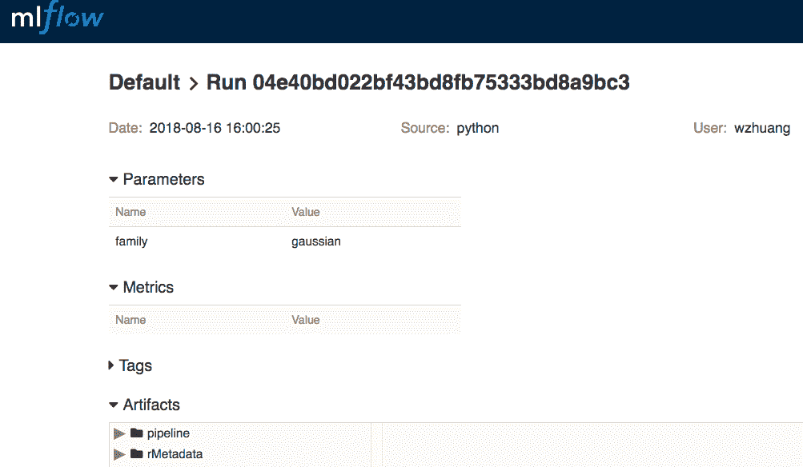
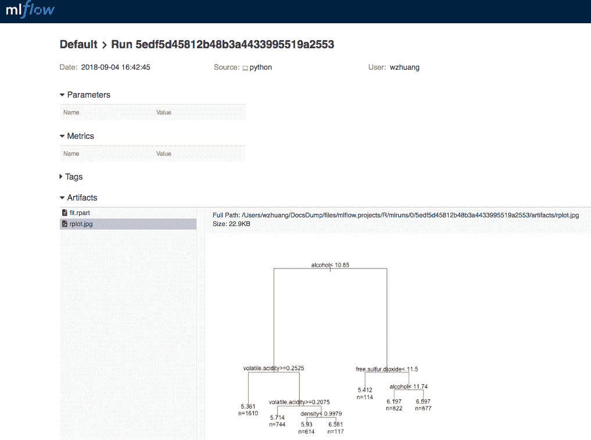
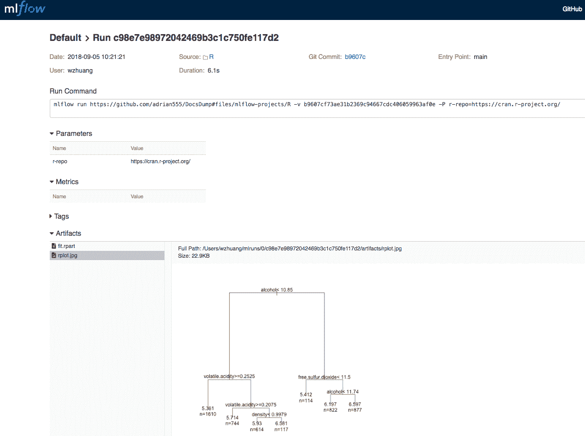

# 在 R 中使用 MLflow 跟踪机器学习模型

> 原文：[`developer.ibm.com/zh/tutorials/tracking-machine-learning-models-in-r-with-mlflow/`](https://developer.ibm.com/zh/tutorials/tracking-machine-learning-models-in-r-with-mlflow/)

在本[文章](https://developer.ibm.com/articles/first-impressions-mlflow/)中，我简要地介绍了 [MLflow](https://mlflow.org/) 及其工作方式。MLflow 目前提供了 Python 中的 API，您可以在机器学习源代码中调用这些 API 来记录 MLflow 跟踪服务器要跟踪的参数、指标和工件。

如果您熟悉机器学习操作并在 R 中执行了这些操作，那么可能想要使用 MLflow 来跟踪模型和每次运行。您可以使用以下几种方法：

*   等待 [MLflow](https://github.com/databricks/mlflow) 发布 R 中的 API
*   封装 MLflow RESTful API 并通过 `curl` 命令进行记录
*   使用一些可调用 Python 解释器的 R 包来调用现有的 Python API

最后一种方法简单易行，并允许您与 MLflow 进行交互，而无需等待提供 R API。在本教程中，我将说明如何使用 [reticulate](https://github.com/rstudio/reticulate) R 包来执行此操作。

*reticulate* 是一个开源 R 包，它允许通过在 R 会话中嵌入 Python 会话来从 R 中调用 Python。该包在 R 与 Python 之间提供无缝的高性能互操作性。在 [CRAN 存储库](https://cran.r-project.org/web/packages/reticulate/index.html)中提供了该包。

MLflow 还随附了[`Projects`](https://mlflow.org/docs/latest/projects.html)组件，该组件会将数据、源代码及命令、参数和执行环境设置一起打包为一个自包含规范。在定义 `MLproject` 后，可以在任何地方运行此项目。目前，`MLproject` 可以运行 Python 代码或 shell 命令。它还可以为用户定义的 `conda.yaml` 文件中指定的项目设置 Python 环境。

对于 R 用户，通常会在 R 源代码中装入一些包。必须安装这些包才能运行 R 代码。未来可以做出的一项改进是，在 MLflow 中添加类似于 `conda.yaml` 的功能来设置 R 包依赖项。本教程介绍了如何创建包含 R 源代码的 `MLproject`，以及如何使用 `mlflow run` 命令运行此项目。

## 学习目标

在本教程中，您将安装和设置 MLflow 环境，在 R 中训练和跟踪机器学习模型，将源代码和数据封装在 `MLproject` 中，并使用 `mlflow run` 命令运行此项目。

## 前提条件

在开始本教程之前，应该先在运行 R 的平台上安装 Python。我首选安装 [miniconda](https://conda.io/miniconda.html)。由于将在 R 中完成机器学习训练，因此也应该在平台上安装了 R。

## 预估时间

完成本教程大约需要 30 分钟。

## 步骤

### 第 1 步：安装 MLflow

为 MLflow 创建 virtualenv，并按如下方式安装 [mlflow](https://pypi.org/project/mlflow/) 包（使用 `conda`）：

```
conda create -q -n mlflow python=3.6
source activate mlflow
pip install -U pip
pip install mlflow 
```

### 第 2 步：安装 `reticulate` R 包

通过 R 安装 [reticulate](https://github.com/rstudio/reticulate) 包。

```
install.packages("reticulate") 
```

`reticulate` 允许 R 无缝调用 Python 函数。通过 `import` 语句装入 Python 包。通过 `$` 运算符调用函数。

```
> library(reticulate)
> path <- import("os.path")
> path$isdir("/tmp")
[1] TRUE 
```

正如您所见，使用此包从 R 中调用 `os.path` 模块中的 Python 函数十分简单。通过导入 `mlflow` 包，然后调用 `mlflow$log_param` 和 `mlflow$log_metric` 以记录 R 脚本的参数和指标，可以对 `mlflow` 包执行相同的操作。

### 第 3 步：使用 SparkR 训练 GLM 模型

以下 R 脚本使用 [SparkR](https://spark.apache.org/docs/latest/sparkr.html) 构建线性回归模型。对于此[示例](https://github.com/adrian555/DocsDump/raw/dev/files/mlflow-R/mlflow-r.R)，必须已安装 `SparkR` 包。

```
# load the reticulate package and import mlflow Python module
library(reticulate)
mlflow <- import("mlflow")

# load SparkR package and start spark session
library(SparkR, lib.loc = c(file.path(Sys.getenv("SPARK_HOME"), "R", "lib")))
sparkR.session(master="local[*]")

# convert iris data.frame to SparkDataFrame
df <- as.DataFrame(iris)

# parameter for GLM
family <- c("gaussian")

# log the parameter
mlflow$log_param("family", family)

# fit the GLM model
model <- spark.glm(df, Species ~ ., family = family)

# exam the model
summary(model)

# path to save the model
model_path <- "/tmp/mlflow-GLM"

# save the model
write.ml(model, model_path)

# log the artifact
mlflow$log_artifacts(model_path)

# stop spark session
sparkR.session.stop() 
```

您可以将脚本复制到 `R` 或 [`Rstudio`](https://www.rstudio.com/) 并以交互方式运行该脚本，或者将其保存到文件中并使用 `Rscript` 命令运行该脚本。确保 `PATH` 环境变量包含 mlflow Python virtualenv 的路径。

### 第 4 步：启动 MLflow UI

通过从 shell 中运行 `mlflow ui` 命令来启动 MLflow UI。然后，打开浏览器并使用 URL `http://127.0.0.1:5000` 转至页面链接。现已显示您之前的 GLM 模型训练，您可以对其进行跟踪。下图显示了其截屏。



### 第 5 步：训练决策树模型

1.将要学习的 [`wine-quality.csv`](https://github.com/adrian555/DocsDump/raw/dev/files/mlflow-projects/R/wine-quality.csv) 数据下载到您的平台。

1.在 R 环境中安装 `rpart` 包：

```
```r
install.packages("rpart")
``` 
```

1.按照此示例 [`rpart-example.R`](https://github.com/adrian555/DocsDump/raw/dev/files/mlflow-projects/R/rpart-example.R) 来为树模型做好准备：

```
```r
# Source prep.R file to install the dependencies
source("prep.R")

# Import mlflow python package for tracking
library(reticulate)
mlflow <- import("mlflow")

# Load rpart to build a tree model
library(rpart)

# Read in data
wine <- read.csv("wine-quality.csv")

# Build the model
fit <- rpart(quality ~ ., wine)

# Save the model that can be loaded later
saveRDS(fit, "fit.rpart")

# Save the model to mlflow tracking server
mlflow$log_artifact("fit.rpart")

# Plot
jpeg("rplot.jpg")
par(xpd=TRUE)
plot(fit)
text(fit, use.n=TRUE)
dev.off()

# Save the plot to mlflow tracking server
mlflow$log_artifact("rplot.jpg")
``` 
```

R 代码包括三个部分：模型训练、通过 MLflow 实现的工件记录以及 R 包依赖项安装。

### 第 6 步：为 MLproject 准备包依赖项

在前面的示例中，需要 `reticulate` 和 `rpart` R 包才能运行代码。要将这些代码封装到一个自包含项目中，如果平台没有安装这些包，那么应运行某种脚本来自动安装这些包。

将使用以下代码、通过 [`prep.R`](https://github.com/adrian555/DocsDump/raw/dev/files/mlflow-projects/R/prep.R) 来安装项目所需的任何特定 R 包：

```
# Accept parameters, args[6] is the R package repo url
args <- commandArgs()

# All installed packages
pkgs <- installed.packages()

# List of required packages for this project
reqs <- c("reticulate", "rpart")

# Try to install the dependencies if not installed
sapply(reqs, function(x){
  if (!x %in% rownames(pkgs)) {
    install.packages(x, repos=c(args[6]))
  }
}) 
```

### 第 7 步：测试代码

在将这些代码封装到 MLproject 之前，请尝试通过直接调用 `Rscript` 命令来测试这些代码，如下所示：

```
Rscript rpart-example.R https://cran.r-project.org/ 
```

在 MLflow UI 中，您应该看到这次运行已被跟踪，如下图所示：



### 第 8 步：创建 MLproject

现在，我们来编写规范，并将此项目封装到 MLflow 可识别并运行的 MLproject 中。您只需要在同一个目录中创建 [`MLproject`](https://github.com/adrian555/DocsDump/raw/dev/files/mlflow-projects/R/MLproject) 文件。

```
name: r_example

entry_points:
    main:
        parameters:
            r-repo: {type: string, default: "https://cran.r-project.org/"}
        command: "Rscript rpart-example.R {r-repo}" 
```

此文件使用 `main` 入口点定义 `r_example` 项目。该入口点指定要通过 `mlflow run` 执行的命令和参数。对于此项目，`Rscript` 是用于调用 R 源代码的 shell 命令。`r-repo` 参数会提供 URL 字符串，您可以通过它来安装从属包。已设置一个缺省值。将此参数传递至用于运行 R 源代码的命令。

现在，您已拥有训练此树模型所需的所有文件，可以通过创建目录并将数据和 R 源代码复制到该目录来创建 `MLproject`。

```
.
└── R
    ├── MLproject
    ├── prep.R
    ├── rpart-example.R
    └── wine-quality.csv 
```

### 第 9 步：检入并测试 MLproject

可以将先前的 `MLproject` 检入并推送到 GitHub 存储库。使用以下命令来测试该项目。可以在安装了 R 的任何平台上运行该项目。

```
mlflow run https://github.com/adrian555/DocsDump#files/mlflow-projects/R 
```

也可以从 MLflow 跟踪 UI 中查看该项目，如下图所示：



此视图与前一次运行（无 `Mlproject` 规范）之间的差异是 `Run Command`（将捕获用于运行项目的确切命令）和 `Parameters`（将自动记录传递到入口点的任何参数）。

## 结束语

在本教程中，您已在 R 中成功地创建了 `MLproject`，并使用 MLflow 跟踪和运行了该项目。此方法让 R 用户能够使用 MLflow `Tracking` 组件，这样，您就可以快速跟踪 R 模型。它还演示了 MLflow 的`项目`组件的用途，即定义项目并使项目便于重新运行。R 用户可以快速设置其项目，并且可以使用 MLflow 轻松跟踪和运行项目。

本文翻译自 ：[Track machine learning models in R with MLflow](https://developer.ibm.com/tutorials/tracking-machine-learning-models-in-r-with-mlflow/)（2018-10-08）