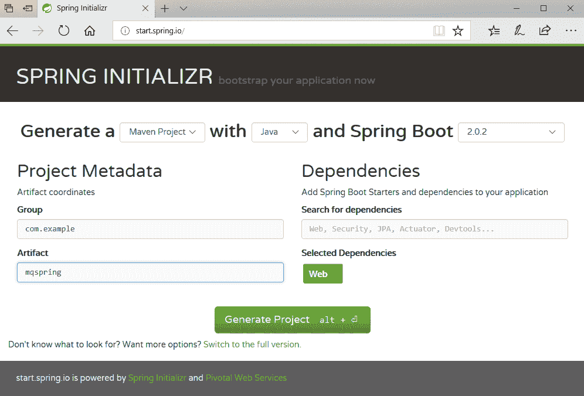

# 使用 Spring Boot 开发 MQ JMS 应用程序

> 原文：[`developer.ibm.com/zh/tutorials/mq-jms-application-development-with-spring-boot/`](https://developer.ibm.com/zh/tutorials/mq-jms-application-development-with-spring-boot/)

[IBM MQ](https://developer.ibm.com/messaging/ibm-mq/) 包含一个 [Spring Boot Starter](https://github.com/ibm-messaging/mq-jms-spring)，使 Spring 开发人员能轻松地配置 IBM MQ JMS 包。

MQ 使应用程序能够以可靠且可扩展的方式相互通信和共享数据，从而使一个应用程序与另一个应用程序解耦。这种方式有助于基于不同框架、语言、平台、云和位置运行的应用程序集成。

## 学习目标

本教程将介绍如何使用 MQ Spring JMS Starter 从 Spring Boot 应用程序访问 IBM MQ 服务器。本示例使用了一个在 Docker 容器中运行的本地 MQ 实例。您还可以使用 [IBM Cloud](https://cloud.ibm.com/catalog/services/mq?cm_sp=ibmdev-_-developer-tutorials-_-cloudreg) 上的 MQ 服务器。该应用程序包含一对示例 REST 端点，通过它们向 MQ 发送和获取消息。

您将执行以下步骤：

*   使用 Spring Initializr 创建一个 Spring Boot 应用程序
*   使用 Docker 启动一个本地 MQ 服务器
*   将 MQ 服务器配置（凭证和 URL）添加到您的应用程序
*   将 MQ Spring Starter 添加到您的应用程序
*   添加一个发送消息的 REST 端点
*   添加一个获取消息的 REST 端点
*   构建该应用，调用 REST 端点并显示来自 MQ 的结果。

## 前提条件

*   您的计算机上已安装 Maven 和 Java。您能够构建并运行基于 Maven 的 Spring Initializr 项目。
*   您的计算机上已安装 Docker。您能够启动/停止容器，并对 Docker 有一般性的了解。

## 预估时间

本教程大约需要 1 小时。

## 步骤

### 第 1 步. 使用 Spring Initializr 创建一个 Spring Boot 应用程序

在 [Spring Initializr](https://start.spring.io/) 页面上，使用 `Java` 语言和 `Web` 依赖生成一个 `Maven Project`。对于本示例，我们使用了组 com.example 和工件 mq-spring。下载该项目并将其解压缩。



### 第 2 步. 使用 Docker 启动一个本地 MQ 服务器

[IBM MQ for Developers](https://github.com/ibm-messaging/mq-container) 容器提供了一种便捷的方式来通过 Docker 启动本地 MQ 服务器。您可以使用以下命令来启动该服务器：

```
docker run ‑‑env LICENSE=accept ‑‑env MQ_QMGR_NAME=QM1 
           ‑‑publish 1414:1414 
           ‑‑publish 9443:9443 
           ‑‑detach 
           ibmcom/mq 
```

使用 `docker ps` 检查服务器是否正在运行：

```
$ docker ps
CONTAINER ID        IMAGE               COMMAND             CREATED             STATUS              PORTS                                            NAMES
3a225c721428        ibmcom/mq           "runmqdevserver"    4 hours ago        Up 4 hours         0.0.0.0:1414‑>1414/tcp, 0.0.0.0:9443‑>9443/tcp   reverent_bartik 
```

### 第 3 步. 将 MQ 服务器配置（凭证和 URL）添加到您的应用程序

本地 MQ 服务器的[默认配置](https://github.com/ibm-messaging/mq-container/blob/master/docs/developer-config.md#details-of-the-default-configuration)包含用户 `admin` 和密码 `passw0rd`。可通过正常的 Spring application.properties 文件将此信息传递给应用程序。

编辑解压缩后的 Spring Initializr 项目，并将包含以下属性名称和值的服务器信息添加到 src/main/resources/application.properties 文件：

```
ibm.mq.queueManager=QM1
ibm.mq.channel=DEV.ADMIN.SVRCONN
ibm.mq.connName=localhost(1414)
ibm.mq.user=admin
ibm.mq.password=passw0rd 
```

**注意：** *不建议将凭证存储在您的应用程序中。我们这样做只是为了简化本教程。MQ Spring Boot Starter 可以利用其他属性来源，比如环境变量等。*

### 第 4 步. 将 MQ Spring Starter 添加到您的应用程序

对于本示例，我们将创建一个简单的 REST 应用程序，其中一个端点将通过 MQ 服务器发送消息，另一个端点获取并返回已发送的消息。

编辑解压缩后的 Spring Boot 项目，以执行以下更改：

1.  将以下依赖添加到 pom.xml 的 dependency 部分：

    ```
     <dependency>
             <groupId>com.fasterxml.jackson.core</groupId>
             <artifactId>jackson-databind</artifactId>
         </dependency>
         <dependency>
             <groupId>com.ibm.mq</groupId>
             <artifactId>mq-jms-spring-boot-starter</artifactId>
             <version>2.0.0</version>
     </dependency> 
    ```

2.  向使用 Spring Initializr 创建的 Spring Boot 应用程序类添加注解 – `com/example/mqpring/MqspringApplication.java`。（注意，Java 包和类名来自在 Initializr 上输入的 Group 和 Artifact 值。）

    *   添加 `@RestController` 来启用 REST 端点。
    *   添加 `@EnableJms` 来允许发现带 `@JmsListener` 注解的方法
3.  为 `JmsTemplate` 对象添加一个 `@Autowired` 注解。IBM MQ Spring Boot Starter 使用通过 `application.properties` 配置的属性来创建 `JmsTemplate`：

    ```
     @SpringBootApplication
     @RestController
     @EnableJms
     public class MqspringApplication {

         @Autowired
         private JmsTemplate jmsTemplate;

         public static void main(String[] args) {
             SpringApplication.run(MqspringApplication.class, args);
         }

     } 
    ```

### 第 5 步. 添加一个通过 MQ 发送消息的 REST 端点

添加一个包含 `@GetMapping` 注解和 `send` 路径的 REST 端点。使用 `JmsTemplate` `convertAndSend` 方法向队列 `DEV.QUEUE.1` 发送一条 `Hello World!` 消息。根据需要添加异常处理。

```
@GetMapping("send")
String send(){
    try{
        jmsTemplate.convertAndSend("DEV.QUEUE.1", "Hello World!");
        return "OK";
    }catch(JmsException ex){
        ex.printStackTrace();
        return "FAIL";
    }
} 
```

**注意：** *队列 `DEV.QUEUE.1` 已通过 IBM MQ for Developers 容器预先创建。本教程简化了该方法，实际的应用程序可能具有更完善的异常处理能力，而且可能使用有类型对象作为消息有效负载。请参阅[Spring 指南: 使用 JMS 进行传递消息](https://spring.io/guides/gs/messaging-jms/)了解更多信息。*

### 第 6 步. 添加一个通过 MQ 获取消息的 REST 端点

添加一个包含 `@GetMapping` 注解和 `recv` 路径的 REST 端点。使用 `JmsTemplate` `receiveAndConvert` 方法接收来自队列 `DEV.QUEUE.1` 的消息。根据需要添加异常处理。

```
@GetMapping("recv")
String recv(){
    try{
        return jmsTemplate.receiveAndConvert("DEV.QUEUE.1").toString();
    }catch(JmsException ex){
        ex.printStackTrace();
        return "FAIL";
    }
} 
```

**注意：** *`JmsTemplate` 接收方法一直处于阻塞状态！（您可以这样尝试：在调用 `send` 之前调用 `recv` 端点，那么直到 `send` 被调用才会返回异常，取消接收调用阻塞。）对于非阻塞替代方案，请考虑使用 [`@JmsListener`](https://docs.spring.io/spring/docs/current/javadoc-api/org/springframework/jms/annotation/JmsListener.html)。*

### 第 7 步. 构建该应用程序，调用 REST 端点并显示结果

使用以下命令构建并运行您的应用程序：

```
mvn package spring-boot:run 
```

现在可以调用用来发送消息的 REST 端点 `http://localhost:8080/send`。您应该会看到来自您的端点的 `OK` 回复，确认消息已发送。

发送消息后，您可以调用用来接收消息的 REST 端点 `http://localhost:8080/recv`。您应该会看到来自该端点的包含消息内容 `Hello World!` 的回复。

## 结束语

IBM MQ Spring Starter 能够让我们轻松地使用 Spring JmsTemplate API 以及 Spring 自动配置功能向 MQ Service 发送和接收消息。

### 参考资料

*   [IBM MQ](https://developer.ibm.com/messaging/ibm-mq/)
*   [IBM MQ SPring Boot Starter 源代码](https://github.com/ibm-messaging/mq-jms-spring)
*   [IBM MQ For Developers 容器](https://github.com/ibm-messaging/mq-container)
*   [Spring @ IBM](https://developer.ibm.com/java/spring/)
*   [Spring 主页](https://spring.io/)
*   [Spring 指南](https://spring.io/guides)
*   [Spring Boot 参考指南](https://docs.spring.io/spring-boot/docs/current/reference/htmlsingle/)

本文翻译自: [MQ JMS application development with Spring Boot on Spring](https://developer.ibm.com/tutorials/spring-with-db2-via-jpa/) (2018-09-14）