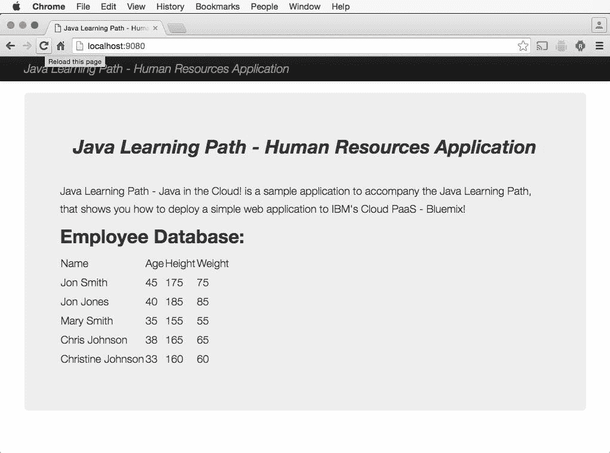

# 云中的 Java

> 原文：[`developer.ibm.com/zh/tutorials/j-perry-java-in-the-cloud/`](https://developer.ibm.com/zh/tutorials/j-perry-java-in-the-cloud/)

## 开始之前

本单元是 *Java 编程入门* 学习路径的一部分。尽管各单元中讨论的概念具有独立性，但实践组件是在您学习各单元的过程中逐步建立起来的，推荐您在继续学习之前复习前提条件、设置和单元细节。

## 目标

*   下载、安装和设置 WebSphere® Liberty 应用服务器
*   安装 Eclipse Tools for IBM Cloud
*   利用 Eclipse 本地测试示例应用程序
*   利用 Eclipse 将应用程序推送到 IBM Cloud
*   修改应用程序，在本地重新测试它，并重新将它部署到云中

## 使用 Java 进行云开发

目前为止，您仅在自己的计算机上，在 Eclipse 内运行人力资源 (HR) 应用程序代码。但基于浏览器的业务应用程序现在很常见 — 而且将这些应用程序部署到云变得越来越方便。您肯定很好奇 Java 编程是如何融入到云计算中的。本单元旨在满足您的好奇心，展示如何使用和将 HR 应用程序的 Web 版本部署到云中 — 所有这些都不需要您离开熟悉的 Eclipse。

Java Web 编程完全值得特殊对待，这里仅对它进行简单介绍。为了让您在练习时能够很好地理解，我已在 [GitHub](https://github.com/makotogo/JavaInTheCloud) 上提供了 HR 应用程序的 Web 版本的源代码。（如果浏览项目的 src/com/makotojava/intro/ 文件夹，就会找到 `Person`、`Employee`、`Manager` 和您已使用过的所有其他 Java 类。）

您将执行的步骤遵循符合典型的开发周期：在本地开发和测试应用程序，将它部署到云中，根据需要在本地修改并重新测试该应用程序，再重新将它部署到云中。

## 设置工具，在本地测试应用程序，并将它推送到 IBM Cloud

**免费试用 IBM Cloud**

利用 [IBM Cloud Lite](https://cloud.ibm.com/registration?cm_sp=ibmdev-_-developer-tutorials-_-cloudreg/free) 快速轻松地构建您的下一个应用程序。您的免费帐户从不过期，而且您会获得 256MB 的 Cloud Foundry 运行时内存和包含 Kubernetes 集群的 2GB 存储空间。[了解所有细节](https://www.ibm.com/cloud/blog/announcements/introducing-ibm-cloud-lite-account-2)并确定如何开始。

如果还没有 IBM Cloud 帐户，请[注册一个](https://cloud.ibm.com/registration?cm_sp=ibmdev-_-developer-tutorials-_-cloudreg)。

接下来，从[我的 GitHub 项目](https://github.com/makotogo/JavaInTheCloud) 获取代码并导入您的 Eclipse 工作区中。然后观看此视频演示：

[https://cdnapisec.kaltura.com/p/1773841/sp/177384100/embedIframeJs/uiconf_id/44854321/partner_id/1773841?iframeembed=true&playerId=kplayer&entry_id=0_wmq59hjk&flashvars[streamerType]=auto](https://cdnapisec.kaltura.com/p/1773841/sp/177384100/embedIframeJs/uiconf_id/44854321/partner_id/1773841?iframeembed=true&playerId=kplayer&entry_id=0_wmq59hjk&flashvars[streamerType]=auto)

干的漂亮！您已将应用程序部署到云中。

## 在本地修改应用程序并测试它

当然，作为软件开发人员，我们知道已部署的应用程序必须通过错误修复和增强进行维护。现在我们将模拟此过程，对 HR 应用程序进行细微更改，然后在 Liberty 服务器本地测试该更改，最后将应用程序再重新部署到云中。

在您的 Eclipse 项目中，将以下代码行添加到 HumanResourcesApplication.java 中的 `createEmployees()` 方法：

```
//
e = new Employee("Christine Johnson", 33, 160, 60, "BROWN", Gender.FEMALE, "424-45-9999", "0005", BigDecimal.valueOf(190000.0));
ret.add(e); 
```

现在，在本地测试更改：启动本地 Liberty 服务器，调出浏览器，然后确认应用程序中显示了一个包含 **Christine Johnson** 的新行：



## 将修改推送到云

在本地测试更改后，是时候将修改后的应用程序推送到云了，就像真实应用程序一样。

停止本地 Liberty 服务器（如果您忘记了这一点，Eclipse Tools for IBM Cloud 会显示一条错误消息）。然后执行与之前相同的部署步骤，但这一次，只需要指定要部署到的 IBM Cloud 服务器（如果未自动选择，则选择您之前设置的服务器）。然后单击 **OK**。

这一次，在 IBM Cloud 更新应用程序时，您可能会看到大量输出。部署应用程序后，您会看到一条与此消息类似的消息（可能稍有不同）：

```
[AUDIT   ] CWWKF0011I: The server defaultServer is ready to run a smarter planet.
[INFO    ] CWWKF0008I: Feature update completed in 23.875 seconds.
[Application Running Check] - Application appears to be running - javalearningpath. 
```

现在转到浏览器，访问 **Deployed URL** 上的应用程序，确认云版本中包含您的更改。

IBM Cloud 是一个强大的平台，本单元仅介绍了它的很少的一部分功能。您可以查看参考资源，进一步了解 IBM Cloud。

本文翻译自：[Java in the cloud](https://developer.ibm.com/tutorials/j-perry-java-in-the-cloud/)（2018-07-12）