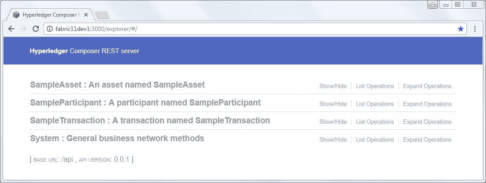
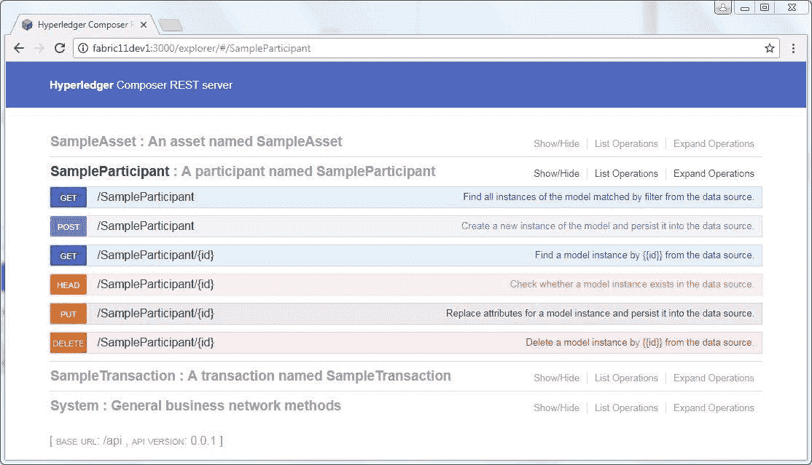
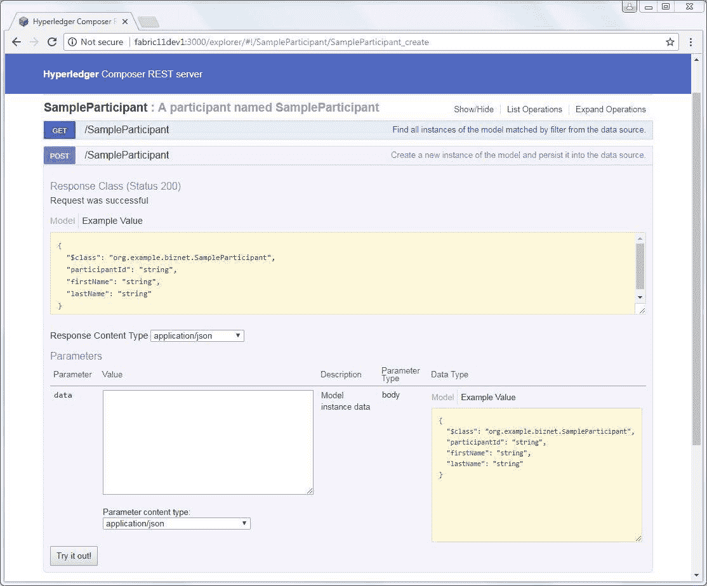
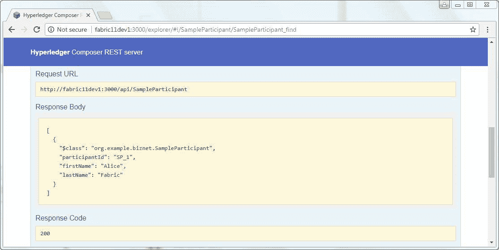
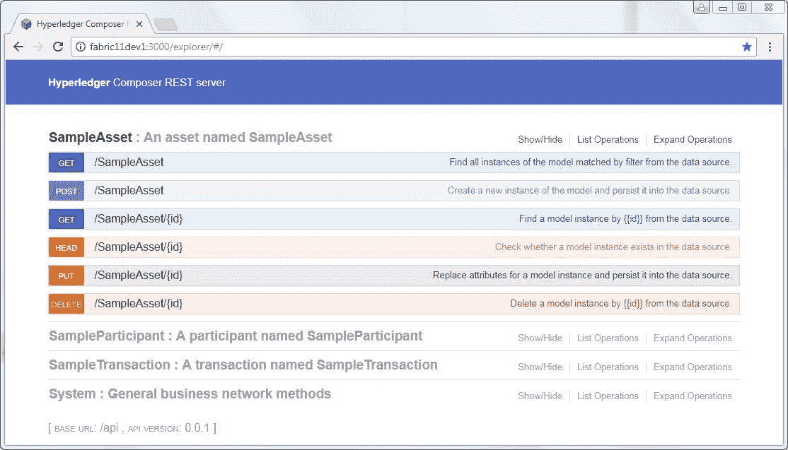
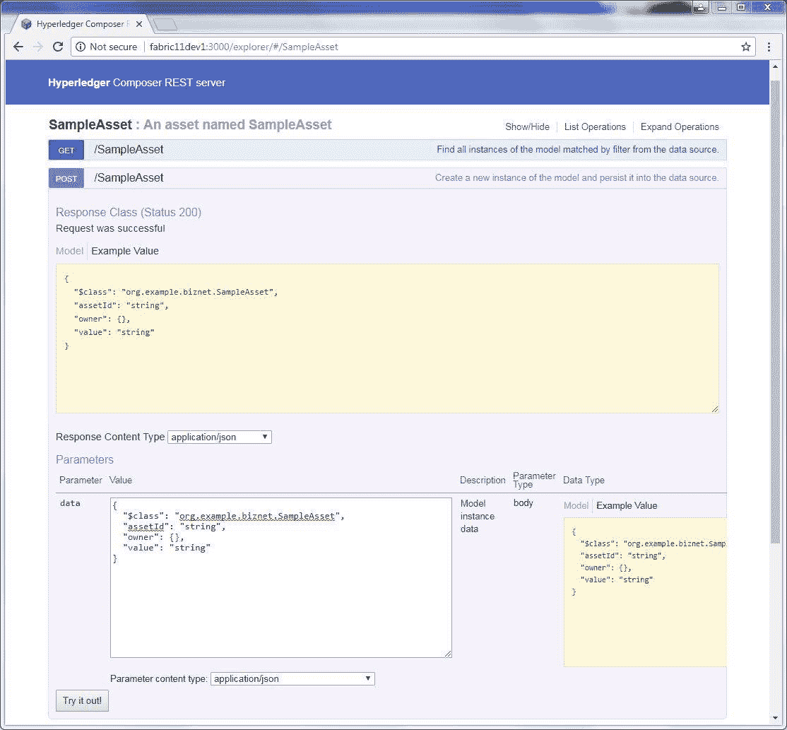
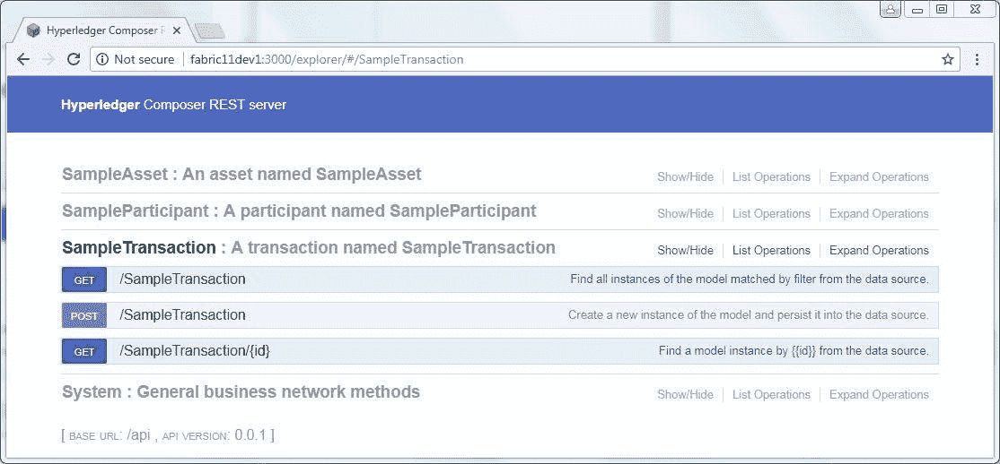
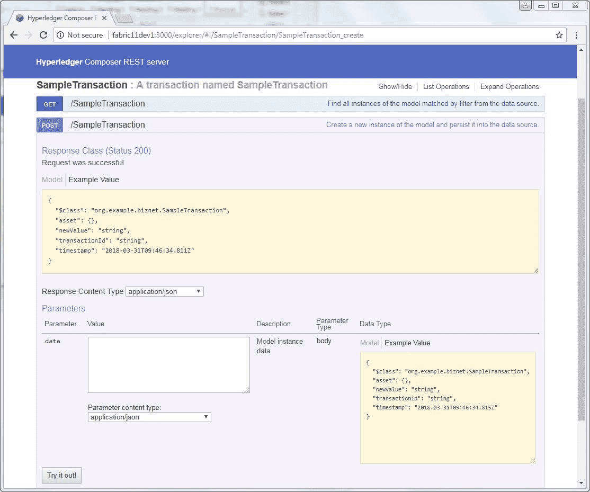
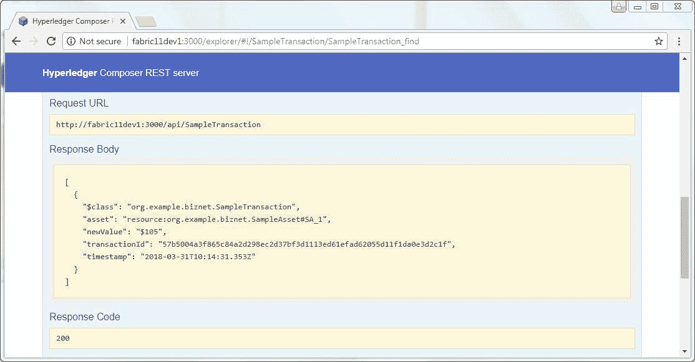
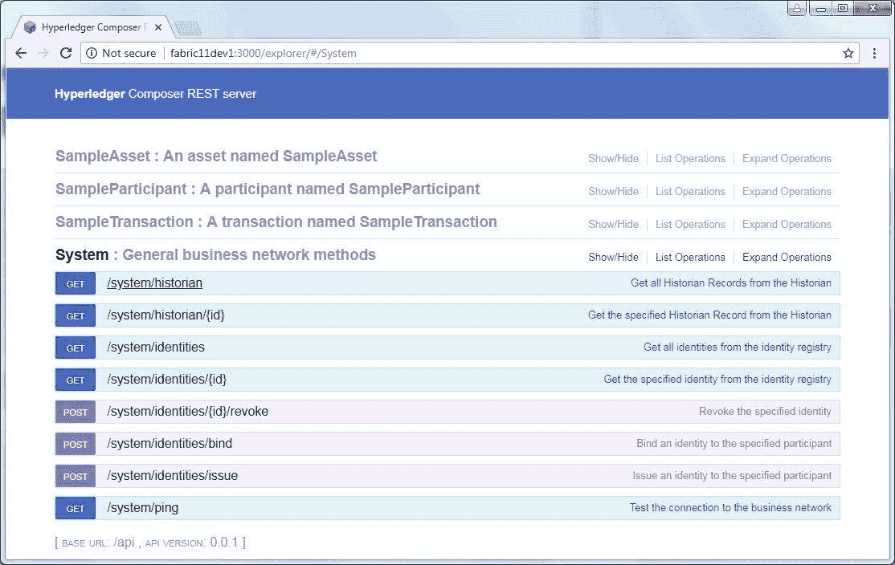

# 基本概念与第一个区块链应用

> 原文：[`developer.ibm.com/zh/tutorials/cl-lo-hyperledger-fabric-study-notes1/`](https://developer.ibm.com/zh/tutorials/cl-lo-hyperledger-fabric-study-notes1/)

## 前言

##### 只需单击即可启动功能完善的区块链网络

新的 IBM Blockchain [**Starter Membership Plan**](https://cloud.ibm.com/catalog/services/blockchain?cm_sp=ibmdev-_-developer-tutorials-_-cloudreg) 为您提供了一种经济的方式来启动区块链网络。然后，您可以轻松部署区块链应用，比如这里描述的投票应用。

区块链（Blockchain）技术正在迅速发展，各行各业都正以极大的热情拥抱它。作者相信区块链将成为对信息科技领域产生革命性影响的一项新技术。目前，Hyperledger Fabric 正是此领域一个重要的技术框架与平台。

本文既是 Hyperledger Fabric（以下简称 Fabric）的实用教程，也是其学习、研究笔记。读者可以与作者一起，一步一步地学习 Fabric 基础知识，利用 Hyperledger Composer（以下简称 Composer）搭建 Fabric 本地开发环境，运行示例应用；并进一步分析、深入了解其技术结构与特点。

本文尽量不去简单复述其他相关文档，着重从实用角度与读者一起迅速建立对 Fabric 的直观认识，并在实践中逐渐理解区块链技术。本系列文章有三个部分，此为第一部分。

在本文示例中，Fabric 的版本为 1.1.0，Composer 的版本为 0.19.1。在以后的学习过程，它们可能随时有版本更新，而 micro 版本的改动应该对示例操作不会有影响。但仍请注意版本更新可能带来的变化。

## 基本概念与知识

### 基本概念与重要平台、技术、工具

用一句话来描述区块链：区块链是一个共享的不可修改的账本，可用来记录一个网络上所有交易的历史。这里所说的”交易”翻译自 “Transaction”。也可以将之称为”事务”，本文将之统一称为”交易”。

Hyperledger 是 Linux 基金会主持的一个开源项目，启动于 2015 年，其核心目标是建立开放的、标准化的、企业级的、能支持商业交易的分布式账本的框架与基础代码。

Hyperledger Fabric 是 Hyperledger 项目的一个组成部分，是一个区块链框架的实现。它将成为区块链应用开发、解决方案的基础。Fabric 框架支持组件化、可插拔的共识服务（Consensus Service）、成员服务（Membership Service）；”许可（Permissioned）”特性使之为”私有性”、”保密性”提供了可靠的解决方案；智能合约（Smart Contracts）在 Fabric 中通过”Chaincode”得以实现。Fabric 最初是由 Digital Asset、IBM 贡献给 Hyperledger 项目的。

Hyperledger Composer 也是 Hyperledger 项目的一个组成部分。通过它，人们可以更快速、容易地建立区块链业务模型，进行区块链网络及应用的开发、部署，并与现有系统、数据进行集成。

本文中，对于 Fabric 的学习，正是以 Composer 作为入口与基础工具，这样学习的效率更高。在学习初期，Fabric 与 Composer 的知识是紧密结合的，在后期，我们会对这两项技术分别深入学习、研究。

### 知识准备

区块链技术涉及到的技术比较多，本文希望能帮助读者将焦点一直放在区块链本身上，即使对某项技术学习得不是非常深入，也不会影响对于 Fabric 的学习。一般来说，希望读者还是能对以下知识预先有所了解：Ubuntu，Docker，Node.js，Javascript，npm，CA。

## 安装 Fabric 之前的环境准备

### Ubuntu 16.04 LTS 64-bit

Fabric 支持 MacOSX、*nix 或者 Windows 10 操作系统；Composer 支持 Ubuntu Linux 14.04 / 16.04 LTS (64-bit)或者 MacOS 10.12 操作系统。

现在，我们使用 **Ubuntu 16.04 LTS 64-bit** ，作为我们的区块链部署系统。对于 Ubuntu 系统的安装与管理，这里不再详述，但可以通过以下命令确认版本信息：

#### 确认 Ubuntu Linux 版本

```
# cat /etc/issue
Ubuntu 16.04.4 LTS \n \l
# uname -a 
```

### 系统用户

我们在学习过程中，几乎所有操作都通过一个专门的用户来完成（在本文示例中，使用的用户名为：fabric；读者可以根据需要使用自己的用户名，但请注意在后续示例中要相应修改）。请不要使用 root 用户。

#### 添加一个新用户

```
# adduser fabric 
```

#### 将此用户加入 sudo 用户组

```
# usermod -aG sudo fabric 
```

#### 切换为 fabric 用户，并进入用户目录

```
# su fabric
$ cd ~ 
```

### 安装 Node.js, npm, Docker, Docker Compose, Python

现在需要安装 Node.js, Docker 等软件，Hyperledger 提供了一个脚本，可以用来自动安装。

#### 下载并执行自动安装脚本

```
$ curl -O https://hyperledger.github.io/composer/latest/prereqs-ubuntu.sh
$ chmod u+x prereqs-ubuntu.sh
$ ./prereqs-ubuntu.sh 
```

安装成功后，会显示以下内容，包括安装的软件名称及版本号。（后续版本可能会有变化。）

```
Installation completed, versions installed are:
Node:             v8.11.1
npm:              5.8.0
Docker:           Docker version 18.03.0-ce, build 0520e24
Docker Compose:   docker-compose version 1.13.0, build 1719ceb
Python:           Python 2.7.12
Please logout then login before continuing. 
```

#### 退出并重新登录

**请 退出 当前用户会话， 关闭客户端工具与 Ubuntu 的连接； 并 重新 以用户 fabric 登录 U b untu ， 以 使系统设置生效。**

如果是自行手动安装这几项软件但版本号并不完全一致，可能会给后续过程带来一些障碍。所以，为节约时间，请尽量使用这个自动安装脚本；或手动安装这些版本的软件。

## 使用 Hyperledger Composer 安装 Fabric Runtime

现在，终于要正式开始安装 Composer 和 Fabric 了。

### 安装 Composer

Hyperledger Composer 是一个开放的开发框架、工具集，可以帮助人们更容易地开发、部署区块链应用。它支持 Fabric，并提供 Javascript SDK。我们可以通过 npm 来安装它的一系列组件。

#### 安装 Composer 命令行工具 CLI

```
$ npm install -g composer-cli
$ npm view composer-cli version
0.19.1 
```

当前，其版本为：0.19.1。

我们之后许多操作（安装、部署、管理）都将通过 Composer CLI 完成。

因为之前的 Node.js 是通过 nvm 安装的（请参考：prereqs-ubuntu.sh），并在这里使用了”-g”选项，所以默认设置下安装的 node modules 文件可以在这里找到：

~/.nvm/versions/node/v8.11.1/lib/node_modules

#### 安装 Composer REST Server

```
$ npm install -g composer-rest-server
$ npm view composer-rest-server version
0.19.1 
```

Composer REST server 可以根据我们开发、部署的区块链应用自动生成一些 RESTful API 接口，以方便通过浏览器、curl 等工具对之进行访问。

#### 安装 generator-hyperledger-composer

```
$ npm install -g generator-hyperledger-composer
$ npm view generator-hyperledger-composer version
0.19.1 
```

它包含了一组 Yeoman generator，可以在 Yeoman 中执行，以根据模板生成我们将要部署的区块链网络文件。

#### 安装 Yeoman

```
$ npm install -g yo
$ npm view yo version
2.0.2 
```

Yeoman 能根据定义好的 generator 迅速生成我们所需要的项目、应用的框架。

### 安装 Hyperledger Fabric Runtime

#### 新建一个 Fabric Tools 目录

```
$ cd ~
$ mkdir fabric-tools
$ cd fabric-tools/ 
```

fabric-tools 目录是我们以后的工作目录，读者可以按需要改成自己期望的目录名。

#### 下载 Fabric Dev Server

```
$ curl -O https://raw.githubusercontent.com/hyperledger/composer-
tools/master/packages/fabric-dev-servers/fabric-dev-servers.tar.gz 
```

目前，fabric-dev-servers.zip 包含了 Fabric1.0 与 Fabric1.1 的两套安装脚本，及用于初始化的 Fabric 相关配置。解压后文件位于 fabric-tools/fabric-scripts 目录下。

#### 解压 Fabric Dev Server

```
$ tar -xvf fabric-dev-servers.tar.gz 
```

#### 下载 Fabric Image 文件

```
$ ./downloadFabric.sh 
```

默认情况下这个脚本最终会执行 fabric-scripts/hlfv11/downloadFabric.sh，hlfv11 表示 Hyperledger Fabric V1.1。这个过程会下载 5 个 docker image 文件，共约 3.6G，视网络情况，可能需要比较长的时间。下载完成后可以通过 docker images 命令查看。

```
$ docker images
REPOSITORY                   TAG             IMAGE ID          CREATED             SIZE
hyperledger/fabric-ca        x86_64-1.1.0    72617b4fa9b4      2 weeks ago         299MB
hyperledger/fabric-orderer   x86_64-1.1.0    ce0c810df36a      2 weeks ago         180MB
hyperledger/fabric-peer      x86_64-1.1.0    b023f9be0771      2 weeks ago         187MB
hyperledger/fabric-ccenv     x86_64-1.1.0    c8b4909d8d46      2 weeks ago         1.39GB
hyperledger/fabric-couchdb   x86_64-0.4.6    7e73c828fc5b      6 weeks ago         1.56GB 
```

到这里，我们就非常迅速、方便的完成了 Fabric 的下载，及部署环境的安装，得益于 Docker Container 技术，并不需要我们做复杂的配置。接下来将要开始部署一个示例应用。在之前，我们要先启动 Fabric，并生成 PeerAdmin card。

#### 启动 Fabric

```
$ ./startFabric.sh 
```

startFabric.sh 最终会执行 ~/fabric-tools/fabric-scripts/hlfv11/startFabric.sh，里面有如下一行内容：

```
ARCH=$ARCH docker-compose -f "${DOCKER_FILE}" up -d 
```

打开~/fabric-tools/fabric-scripts/hlfv11/composer/docker-compose.yml 我们可以看到有如下四个 Docker 应用的配置：ca.org1.example.com(CA Node)，orderer.example.com(Orderer Node)，peer0.org1.example.com(Peer Node)，couchdb(Database)。它们启动成功后即意味着 Fabric 区块链网络的核心部分已经处于运行状态了。

在 startFabric.sh 中，还有以下内容：

```
docker exec peer0.org1.example.com peer channel create......
docker exec -e...... peer0.org1.example.com peer channel join...... 
```

它们的作用是建立一个通道（Channel）并将刚启动的节点 peer0.org1.example.com 加入到这个通道。

通道（Channel）是 Fabric 中的重要概念与设计，它是网络成员间通讯的私有的子网络；网络中会有多个通道同时存在；每个交易都在认证、授权后在某个通道里执行；所有数据、交易、成员、通道信息都只对此通道的授权成员可见。

#### 生成并导入 PeerAdmin Card

```
$ ./createPeerAdminCard.sh 
```

这个脚本会生成一个 Card 文件，它包含了 Fabric 网络的信息以及管理员 PeerAdmin 与之连接所必须的信息；即管理员的身份证明文件；生成后这个文件会被导入到 Composer，你可以在~/.composer/cards/PeerAdmin@hlfv1 目录下找到被导入的 PeerAdmin Card 的文件内容。之后，Composer 会利用这个 Card 文件建立起到 Fabric 网络的连接。

在以后的学习中，我们会介绍如何建立一个自定义的 Card 文件。

## 部署第一个 Fabric 区块链业务网络

Fabric runtime 已经被成功安装、启动了，现在我们要部署第一个 Fabric 区块链业务网络。

### 准备业务网络

为使学习过程更容易，我们直接利用 Yeoman 及已经下载的 Generator 生成区块链网络框架。

在以后的章节中，我们会介绍如何按步骤手工完成定义、部署过程。

#### 生成业务网络定义（Business Network Definition – BND）

```
$ yo hyperledger-composer:businessnetwork 
```

参数 businessnetwork 来自于之前安装的 generator-hyperledger-composer，表示了一组对应的模板文件。可以在 ~/.nvm/versions/node/v8.11.1/lib/node_modules/generator-hyperledger-composer/generators/businessnetwork/templates/ 下找到即将生成的内容的模板。

运行会提示输入相关信息，为方便学习，建议 Business network name 定义为：tutorial-network；Namespace 定义为：org.example.biznet，其他信息可以自行决定内容。将定义的内容如下：

```
Business network name: tutorial-network
Description: The first blockchain network
Author name: Alice
Author email: alice@org.example.biznet
License: Apache-2.0
Namespace: org.example.biznet 
```

执行成功后，在当前 ~/fabric-tools/ 目录下，新增了一个目录 tutorial-network, 里面有 index.js, package.json 等文件，以及 lib, models 两个目录，这就是将要部署的区块链业务网络定义。

#### 进入 tutorial-network 目录

```
$ cd ~/fabric-tools/tutorial-network 
```

后续的操作基本都在此目录下完成。

#### 生成 .bna 文件

```
$ composer archive create -t dir -n . 
```

执行成功后，在当前目录下会产生一个新文件 tutorial-network@0.0.1.bna，即是 tutorial-network 目录下文件的压缩包。解压后发现其中主要有文件及目录：lib/，models/，package.json，permissions.acl。我们会在以后详细解释、操作这些文件。

### 部署及启动业务网络

这是第一个示例区块链网络安装部署的最后一部分内容了。

#### 部署示例业务网络 tutorial-network

```
$ composer network install --card PeerAdmin@hlfv1 --archiveFile tutorial-network@0.0.1.bna 
```

或者

```
$ composer network install --c PeerAdmin@hlfv1 --a tutorial-network@0.0.1.bna 
```

“composer network install” 命令会部署指定的 .bna 文件到 Fabric 网络。.bna 文件包括了这个业务网络的 Assets 模型、交易事务逻辑、访问控制规则等定义，但它并不能直接在 Fabric 上运行。.bna 文件是由 Composer 生成的，它是用 Composer 提供支持的一系列建模语言、规范定义的业务网络定义，我们必须将它先安装在 Fabric Peer 节点上。然后才可以在这个节点上启动运行这个业务网络。

参数 -c (–card) 应指定为在上一步骤中生成 PeerAdmin Card 文件。

参数 -a (–archiveFile) 应指定为将要部署的业务网络文件包。

#### 启动业务网络

```
$ composer network start --networkName tutorial-network --networkVersion 0.0.1 --
networkAdmin admin --networkAdminEnrollSecret adminpw --card PeerAdmin@hlfv1 --file
networkadmin.card 
```

“composer network start” 用指定的 Card 启动这个网络；同时会生成一个当前业务网络的管理员 Card 文件，即此示例中的 networkadmin.card。

这个文件是 zip 格式的压缩文件，解压缩后，可以发现包含两个文件：connection.json, metadata.json。其中，metadata.json 内容如下：

```
{"version":1,
"userName":"admin",
"businessNetwork":"tutorial-network",
"enrollmentSecret":"adminpw"} 
```

“admin”, “tutorial-network” 正是我们此前的定义的管理员用户名，及业务网络名。我们在以后可以通过类似 -c admin@tutorial-network 使用这个管理员身份。

#### 导入 tutorial-network 管理员 Card

```
$ composer card import --file networkadmin.card 
```

此时再查看 ~/.composer/cards 会发现新导入的 Card 文件。也可以直接通过命令查看。

#### 查看导入的 Card 文件

```
$ composer card list
┌────────────────────────┬───────────┬──────────────────┐
│ Card Name              │ UserId    │ Business Network │
├────────────────────────┼───────────┼──────────────────┤
│ admin@tutorial-network │ admin     │ tutorial-network │
├────────────────────────┼───────────┼──────────────────┤
│ PeerAdmin@hlfv1        │ PeerAdmin │                  │
└────────────────────────┴───────────┴──────────────────┘ 
```

#### 确认 tutorial-network 安装成功

```
$ composer network ping --card admin@tutorial-network 
```

如果部署成功，会显示类似如下内容：

```
The connection to the network was successfully tested: tutorial-network
Business network version: 0.0.1
Composer runtime version: 0.19.1
participant: org.hyperledger.composer.system.NetworkAdmin#admin
identity: org.hyperledger.composer.system.Identity#...
Command succeeded 
```

#### 启动 REST Server

```
$ composer-rest-server 
```

并在之后提示的选项中输入内容如下：

```
Card Name: admin@tutorial-network
Never use namespace
Enable authentication (default): No
Enable event publication over WebSockets (default): Yes
Enable TSL (default): No 
```

也可以直接带参数运行命令行：

```
$ composer-rest-server -c admin@tutorial-network -n never 
```

composer-rest-server 会根据部署的业务网络生成一系列 REST API,以方便用户通过浏览器或其他类似 curl 的应用程序访问这个区块链业务网络。如果在本机，我们可以通过这样的地址访问：

`http://localhost:3000/explorer`。

#### 部署成功

到这里，我们就成功地通过 Hyperledger Composer 安装了 Hyperledger Fabric，并部署、启动了第一个区块链业务网络 tutorial-network。

## 访问区块链网络

现在我们可以开始访问部署成功的第一个 Fabric 区块链业务网络。

本文主要介绍通过浏览器和 curl 命令访问 REST Service。

### 通过浏览器访问 REST Service

在浏览器中输入 `http://fabric11dev1:3000/explorer`。

**fabric11dev1 是当前部署运行 Composer REST Server 的机器名。如果从本机访问，可以使用 localhost， 或者 直接使用 IP 地址访问。后文不再对此特别说明。**

##### 图 1\. 入口界面



SampleAsset 是这个区块链业务网络中定义的资产模型 (Asset)。表示一种有形或无形的可改变、转移的商品。

SampleParticipant 是这个业务网络的成员 (Participant)，可以拥有 Asset，提交 Transaction。

SampleTransaction 是一种交易或事务 (Transaction)，由成员提交到业务网络，用以改变、转移商品，或触发其他操作。

这些内容都可点击展开，显示 REST API 中对于此项内容的所有操作。

##### 图 2\. Participant 操作



点击 **GET** ， **POST** 等按钮，可以进行展开并进行各种操作。

点击 **POST** 按钮，可添加一个新的 SampleParticipant。

##### 图 3\. 添加 SampleParticipant



在 data 输入框中，输入如下内容：

```
{
"$class": "org.example.biznet.SampleParticipant",
"participantId": "SP_1",
"firstName": "Alice",
"lastName": "Fabric"
} 
```

“org.example.biznet.SampleParticipant” 是将要添加 Participant 的模型名称；”SP_1″ 是当前业务网络中这种实例的唯一 ID。

我们会在以后详细分析这个模型的定义方法。

点击 **Try it out!** 按钮，REST Service 会向这个区块链业务网络添加新的 SampleParticipant。如果添加成功，会在界面下方显示 “Response Code 200” 类似的输出内容。

添加成功后，再点击第一个操作 **GET** ，展开后点击 **Try it out!** 按钮，即可列出所有 SampleParticipant。

##### 图 4\. 列出所有 SampleParticipant



##### 图 5\. Asset 操作



点击 **GET** ， **POST** 等按钮，可以进行 SampleAsset 各种操作。

点击 **POST** 按钮，可添加一个新的 SampleAsset。

##### 图 6\. 添加一个新的 SampleAsset



在 data 输入框中，输入如下内容：

```
{
"$class": "org.example.biznet.SampleAsset",
"assetId": "SA_1",
"owner": "org.example.biznet.SampleParticipant#SP_1",
"value": "$100"
} 
```

“org.example.biznet.SampleAsset” 是将要添加实例的模型名；”SA_1″ 是当前业务网络中这种实例的唯一 ID。”org.example.biznet.SampleParticipant#SP_1″ 是对于之前建立的 ID 为 SP_1 的 SampleParticipant 的引用。

我们会在以后详细分析这个模型的定义方法。

点击 **Try it out!** 按钮，REST Service 会向这个区块链业务网络添加新的 SampleAsset。如果添加成功，会在界面下方显示 “Response Code 200” 类似的输出内容。

按此方法，我们可以再添加另一个 SampleAsset，其 ID 为 SA_2。

添加成功后，再点击第一个操作 **GET** ，展开后点击 **Try it out!** 按钮，即可列出所有 SampleAsset。

##### 图 7\. 列出所有 SampleAsset


在 Response Body 中，可以发现以 JSON 格式列出的所有 SampleAsset 实例。

##### 图 8\. 交易（Transaction）操作



点击 **GET** ， **POST** 等按钮，可以进行交易的各种操作。

点击 **POST** 按钮，可提交一个新的交易。

##### 图 9\. 提交交易（Transaction）



在 data 输入框中输入以下内容：

```
{
"$class": "org.example.biznet.SampleTransaction",
"asset": "org.example.biznet.SampleAsset#SA_1",
"newValue": "$105"
} 
```

“org.example.biznet.SampleTransaction” 是将要提交的交易模型名称；”org.example.biznet. SampleTransaction#SA_1″ 是之前添加的 SampleAsset 实例的引用；newValue”$105″ 是指将这个 SampleAsset 实例中的 value 改成新的值 “$105″。

点击 **Try it out!** 按钮，REST Service 会向这个区块链业务网络提交这个交易。如果提交成功，会在界面下方显示 “Response Code 200” 类似的输出内容。

提交成功后，我们再次操作 SampleAsset – GET， 即可发现 SampleAsset#SA_1 的 value 已经被改为 “$105″。

“newValue” 这个操作的具体逻辑是在 ~/fabric-tools/tutorial-network/lib/logic.js 中定义的。其中所使用的 API，如 getAssetRegistry、getFactory 正是 Composer 提供的 Javascript API，这段 JS 会由被先前安装部署在 Peer 上的 Composer 业务网络执行。

在 SampleTransaction – GET 中，点击 **Try it out!** ，即可列出所有提交成功的交易。

##### 图 10\. 列出所有交易



这里，每个交易比之前提交的内容，多了 transactionId, timestamp 两个内容，这是 tutorial-network 在处理交易时自动添加的。

##### 图 11\. System 操作



通过 System – GET /system/historian 操作，可以列出这个业务网络的历史操作记录。部分内容如下：

```
[
{
"$class": "org.hyperledger.composer.system.HistorianRecord",
"transactionId": "0d5eaeb63fe045505b1ff6d45083f6f7703a8ad7e6f2dd3b86190fab212ca0aa",
"transactionType": "org.hyperledger.composer.system.AddAsset",
"transactionInvoked":
"resource:org.hyperledger.composer.system.AddAsset#0d5eaeb63fe045505b1ff6d45083f6f7703a8ad7e6f2dd3b86190fab212ca0aa",
"participantInvoking": "resource:org.hyperledger.composer.system.NetworkAdmin#admin",
"identityUsed":
"resource:org.hyperledger.composer.system.Identity#0b0c50ab485d4b849a3050fcf630211ea4c9edb26c9e2b3308a1df4dc3dc77d6",
"eventsEmitted": [],
"transactionTimestamp": "2018-03-31T10:09:24.709Z"
},
{
"$class": "org.hyperledger.composer.system.HistorianRecord",
"transactionId": "6dcb8eb6-34aa-4b6e-95f6-08dc0b7285fb",
"transactionType": "org.hyperledger.composer.system.StartBusinessNetwork",
"transactionInvoked":
"resource:org.hyperledger.composer.system.StartBusinessNetwork#6dcb8eb6-34aa-4b6e-95f6-08dc0b7285fb",
"eventsEmitted": [],
"transactionTimestamp": "2018-03-31T06:04:06.500Z"
},
{
"$class": "org.hyperledger.composer.system.HistorianRecord",
"transactionId": "57b5004a3f865c84a2d298ec2d37bf3d1113ed61efad62055d11f1da0e3d2c1f",
"transactionType": "org.example.biznet.SampleTransaction",
"transactionInvoked":
"resource:org.example.biznet.SampleTransaction#57b5004a3f865c84a2d298ec2d37bf3d1113ed61efad62055d11f1da0e3d2c1f",
"participantInvoking": "resource:org.hyperledger.composer.system.NetworkAdmin#admin",
"identityUsed":
"resource:org.hyperledger.composer.system.Identity#0b0c50ab485d4b849a3050fcf630211ea4c9edb26c9e2b3308a1df4dc3dc77d6",
"eventsEmitted": [
{
"$class": "org.example.biznet.SampleEvent",
"asset": "resource:org.example.biznet.SampleAsset#SA_1",
"oldValue": "$100",
"newValue": "$105",
"eventId": "57b5004a3f865c84a2d298ec2d37bf3d1113ed61efad62055d11f1da0e3d2c1f#0",
"timestamp": "2018-03-31T10:14:31.353Z"
}
],
"transactionTimestamp": "2018-03-31T10:14:31.353Z"
},
{
"$class": "org.hyperledger.composer.system.HistorianRecord",
"transactionId": "cd87d7c3940a2bc96d640cbf53a35f6a4fbcf3be5c953667428084ef5b02dabf",
"transactionType": "org.hyperledger.composer.system.AddParticipant",
"transactionInvoked":
"resource:org.hyperledger.composer.system.AddParticipant#cd87d7c3940a2bc96d640cbf53a35f6a4fbcf3be5c953667428084ef5b02dabf",
"participantInvoking": "resource:org.hyperledger.composer.system.NetworkAdmin#admin",
"identityUsed":
"resource:org.hyperledger.composer.system.Identity#0b0c50ab485d4b849a3050fcf630211ea4c9edb26c9e2b3308a1df4dc3dc77d6",
"eventsEmitted": [],
"transactionTimestamp": "2018-03-31T10:00:32.858Z"
}
] 
```

示例中有 3 个操作：AddAsset, AddParticipant, SampleTransaction, StartBusinessNetwork。

其中 SampleTransaction 是我们之前手工提交的 Transaction；而 AddAsset, AddParticipant, StartBusinessNetwork 则是业务网络自己产生的事务操作历史记录。由此我们可以知道，当前 tutorial-network 中的一些操作（如：添加 SampleAsset）其实是通过一系列 Composer 模型语言定义了一个操作，由 Composer 提交到 Fabric Peer Node，最终由业务网络执行完成的，即智能合约（Smart Contract）在 Fabric 中的实现：Chaincode。我们会在后续学习中深入理解这种机制。

按上述方法，我们们可以浏览这个简单的区块链网络所提供服务的所有 REST API。

### 使用 curl 访问 REST Service

以上介绍的在浏览器中对 REST Service 及区块链网络的访问，都可以通过 curl 及其他类似应用程序，通过控制台进行。

#### 使用 curl 程序调用 REST API – GET SampleAsset

```
$ curl -X GET --header 'Accept: application/json'
'http://fabric11dev1:3000/api/SampleAsset' 
```

为方便起见，这里并没有指定任何用户信息，因为目前没有加入安全验证机制，我们会在以后的学习中专门讨论用户安全、权限控制问题。

执行成功后，会返回 JSON 格式的文本。

#### 使用 curl 程序调用 REST API – POST SampleTransaction

```
$ curl -X POST --header 'Content-Type: application/json' --header 'Accept:
application/json' -d '{
"$class": "org.example.biznet.SampleTransaction",
"asset": "org.example.biznet.SampleAsset#SA_1",
"newValue": "$110"
}' 'http://fabric11dev1:3000/api/SampleTransaction' 
```

## 结语

我们一起学习了 Hyperledger Fabric，Composer 的基本概念，并使用 Composer 部署了一个 Fabric 开发环境，安装并运行了第一个区块链业务网络与应用。最后通过 REST Service 访问了这个区块链应用。

本文对于 Fabric 的的学习内容还是初步的，旨在帮助大家迅速建立对 Fabric 的直观映像，以便为下一步深入研究打好基础。

## 参考资源

*   参考 [IBM Blockchain Dev Center](https://developer.ibm.com/zh/technologies/blockchain/) ，查看 IBM 在区块链领域的最新信息。
*   参考 [Hyperledger Projects](https://www.hyperledger.org/projects) ，了解开源项目 Hyperledger 的主要内容。
*   参考 [Hyperledger Fabric Documentation](http://hyperledger-fabric.readthedocs.io/en/latest/index.html) ，了解开源项目 Fabric 的主要内容。
*   阅读相关 Code Pattern: [使用 Hyperledger Composer 处理事务事件](https://developer.ibm.com/zh/patterns/automate-business-processes-via-blockchain-events/)