# 利用 Watson Machine Learning Accelerator 对图像进行分类

> 原文：[`developer.ibm.com/zh/tutorials/use-computer-vision-with-dli-watson-machine-learning-accelerator/`](https://developer.ibm.com/zh/tutorials/use-computer-vision-with-dli-watson-machine-learning-accelerator/)

[IBM Watson Machine Learning Accelerator](https://www.ibm.com/ca-en/marketplace/deep-learning-platform) 是捆绑了 [IBM PowerAI](https://developer.ibm.com/linuxonpower/deep-learning-powerai/)、[IBM Spectrum Conductor](https://www.ibm.com/us-en/marketplace/spark-workload-management)、[IBM Spectrum Conductor Deep Learning Impact](https://www.ibm.com/ca-en/marketplace/spectrum-conductor-deep-learning-impact) 的软件解决方案，由 IBM 为包括开源深度学习框架在内的整个堆栈提供支持。PowerAI Enterprise 为数据科学家提供了端到端的深度学习平台。这包含完整的生命周期管理，从安装和配置到数据摄取和准备，再到训练模型的构建、优化和分配，以及将模型移至生产环境。在您要将自己的深度学习环境扩展为包含多个计算节点时，PowerAI Enterprise 即可大显身手。现在甚至有免费评估版本可供使用，更多信息可参阅前提条件。

在本教程中，您将使用 Watson Machine Learning Accelerator 中的“深度学习影响”功能来执行基本的计算机视觉图像分类示例。此示例用于识别图像是否包含衣服、裙装、穿衣服的人和穿裙子的人。当然，您可以在自己的示例中随意使用任何数据。

## 学习目标

完成本教程后，您将掌握如何：

*   熟悉深度学习工作流程
*   利用 Watson Machine Learning Accelerator 对图像进行分类
*   使用 Watson Machine Learning Accelerator 构建模型
*   进一步熟悉 IBM Power Systems 服务器生态系统

## 预估时间

*   此端到端教程需耗时约 3 小时，包括近 50 分钟的模型训练、安装和配置以及在 GUI 中对模型的处理。

## 前提条件

本教程需要访问 GPU 加速的 IBM Power Systems AC922 型或 S822LC 型服务器。除获取服务器外，还有多种方法可访问 [PowerAI 开发者门户网站](https://developer.ibm.com/linuxonpower/deep-learning-powerai/try-powerai/)上列出的 Power Systems 服务器。

## 步骤

### 第 1 步. 下载、安装并配置 IBM Watson Machine Learning Accelerator Evaluation

*   从 [IBM 软件存储库](https://epwt-www.mybluemix.net/software/support/trial/cst/programwebsite.wss?siteId=303&tabId=569&w=rc9ehqk&p=18tkuuj28%20)下载 IBM PowerAI Enterprise Evaluation 软件。下载需占用 4.9 GB 空间，并且需要 IBM ID。
*   按照 [IBM Knowledge Center](https://www.ibm.com/support/knowledgecenter/en/SSFHA8_1.1.1/powerai_evaluation.html) 或 [OpenPOWER Power-Up User Guide](https://power-up.readthedocs.io/en/latest/Running-paie.html) 中的具体说明安装并配置 PowerAI Enterprise。

### 第 2 步. 下载 TensorFlow 经检测的 VGG-19 模型

下载 [`git.ng.bluemix.net/ibmconductor-deep-learning-impact/dli-1.2.0-tensorflow-samples/tree/master/tensorflow-1.10/vgg19`](https://git.ng.bluemix.net/ibmconductor-deep-learning-impact/dli-1.2.0-tensorflow-samples/tree/master/tensorflow-1.10/vgg19) 目录中的所有文件。

### 第 3 步. 下载经过预先训练的权重

使用以下代码从 TensorFlow 下载经过预先训练的权重。可在 [GitHub 存储库](https://github.com/tensorflow/models/tree/master/research/slim)中找到更多信息。

```
mkdir <pretrained weight directory>
cd <pretrained weight directory>
wget http://download.tensorflow.org/models/vgg_19_2016_08_28.tar.gz
tar –zxvf vgg_19_2016_08_28.tar.gz 
```

修改用户访问权和组，确保 Watson Machine Learning Accelerator 可读取权重文件。

```
chown -R egoadmin:egoadmin <pretrained weight directory> 
```

### 第 4 步. 下载数据集

对于本教程，我们将使用名为 [googliser](https://github.com/teracow/googliser) 的工具来搜索 Google 图像。这是一个简单的 shell 脚本，无任何前提条件。

使用以下命令运行 googliser，并在各自的目录中创建四个数据集。

*   `dresses_with_model`
*   `dresses_without_model`
*   `clothes_with_model`
*   `clothes_without_model`

```
 $ git clone https://github.com/teracow/googliser

$ cd googliser

$ ./googliser.sh --phrase "dresses with model" --title "dresses_with_model" --upper-size 200000 --lower-size 2000 --failures 0 -n 400 -N
 googliser.sh - 2018-07-26 PID:[43878]

 -> processing query: "dresses with model"
 -> searching Google:       10/10 result groups downloaded.      522 results!
 -> acquiring images:      400/400 downloaded and      115/     522 failed.(22%)

 -> All done!

$ ./googliser.sh --phrase "dresses only" --title "dresses_without_model" --upper-size 200000 --lower-size 2000 --failures 0 -n 400 -N
 googliser.sh - 2018-07-26 PID:[86968]

 -> processing query: "dresses only"
 -> searching Google:       10/10 result groups downloaded.      536 results!
 -> acquiring images:      400/400 downloaded and      122/     536 failed.(23%)

 -> All done!

$ ./googliser.sh --phrase "clothes with model" --title "clothes_with_model" --upper-size 200000 --lower-size 2000 --failures 0 -n 400 -N
 googliser.sh - 2018-07-26 PID:[14331]

 -> processing query: "clothes with model"
 -> searching Google:       10/10 result groups downloaded.      615 results!
 -> acquiring images:      400/400 downloaded and      194/     615 failed.(33%)

 -> All done!

$ ./googliser.sh --phrase "clothes only" --title "clothes_without_model" --upper-size 200000 --lower-size 2000 --failures 0 -n 400 -N
 googliser.sh - 2018-07-26 PID:[40210]

 -> processing query: "clothes only"
 -> searching Google:       10/10 result groups downloaded.      630 results!
 -> acquiring images:      400/400 downloaded and      112/     630 failed.  (34%)

 -> All done! 
```

我们将首先创建父目录“train”，然后在父目录“train”下创建两个子目录：`images_without_model` 和 `images_with_model`，并将图像移到这些新目录中。

```
mkdir images_with_model
mv dresses_with_model/* images_with_model
mv clothes_with_model/* images_with_model

mkdir images_without_model
mv dress_without_model/* images_without_model
mv clothes_without_model/ images_without_model 
```

最后，让我们回到父目录“train”。我们需要修改用户访问权和组，确保 Watson Machine Learning Accelerator 可读取这些文件。

```
chown -R egoadmin:egoadmin train 
```

### 第 5 步. 将数据加载到 Watson Machine Learning Accelerator 中

创建新数据集，将图像与 Watson Machine Learning Accelerator 相关联。

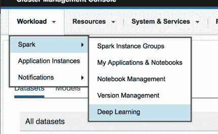

1.  在 **Datasets** 选项卡中，选择 **New**。

    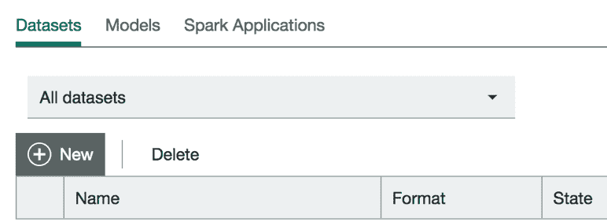

2.  单击 **Images for Object Classification**。显示对话框后，提供唯一名称（例如，“CodePatternDS”），并选择包含先前步骤中所含图像的文件夹。其他字段使用默认设置即可。准备就绪后，单击 **Create**。

利用 Watson Machine Learning Accelerator 中的数据，您即可开始下一步：构建模型。

### 第 6 步. 构建模型

修改用户访问权和组，确保 Watson Machine Learning Accelerator 可读取 vgg19 模型文件。

```
chown -R egoadmin:egoadmin vgg19model/ 
```

1.  选择 **Models** 选项卡，然后单击 **New**。

    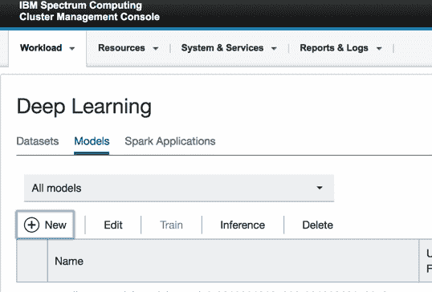

2.  选择 **Add Location**。

    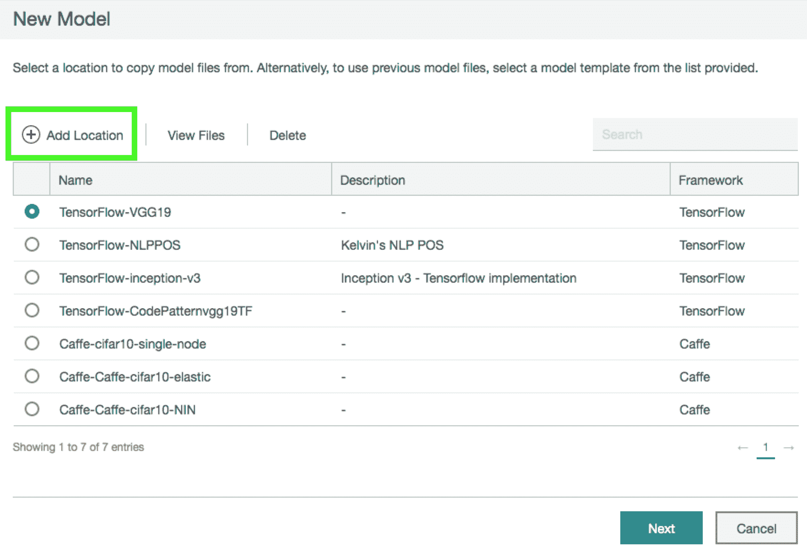

3.  选择 **TensorFlow** 作为框架。

    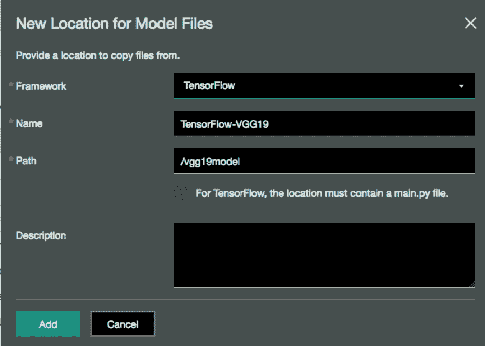

4.  针对新模型选择 **TensorFlow-VGG19**，然后单击 **Next**。

    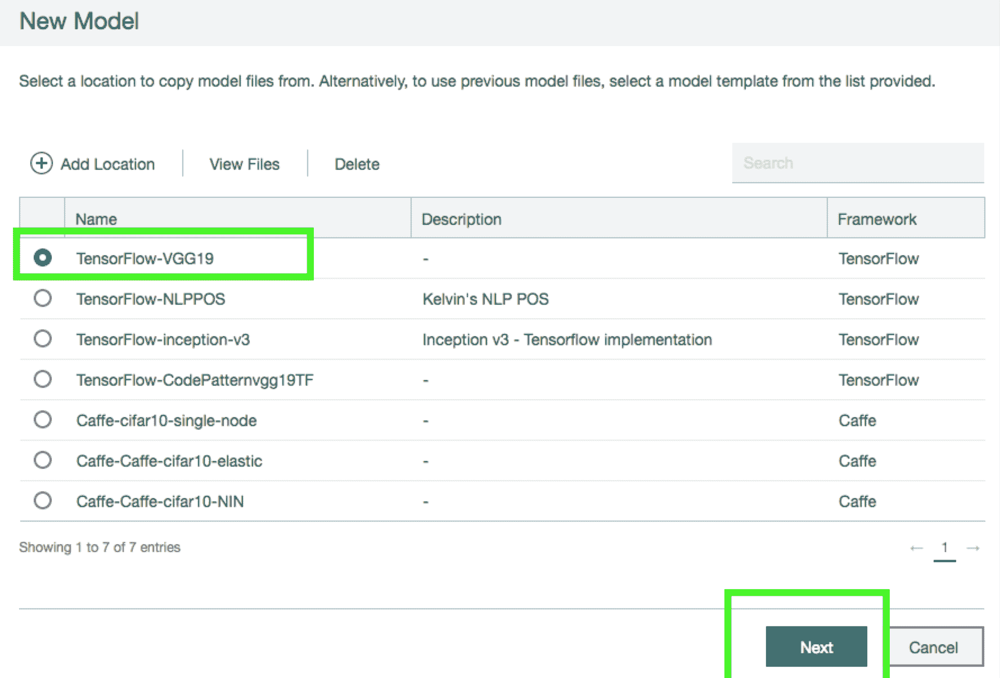

5.  确保“Training engine”设置为 `singlenode`，并且数据集指向您刚创建的数据集。

    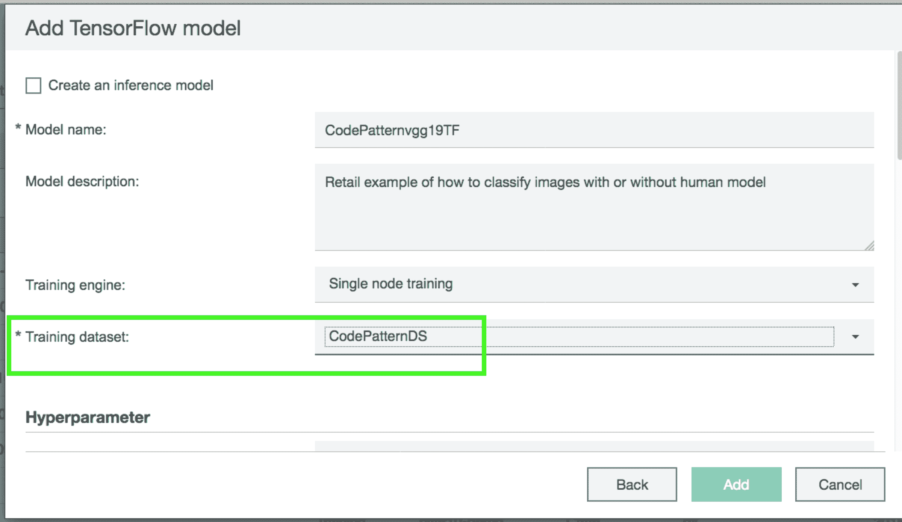

    **注意**：将“Base learning rate”设置为 0.001，因为更大的值可能会导致梯度爆炸。

    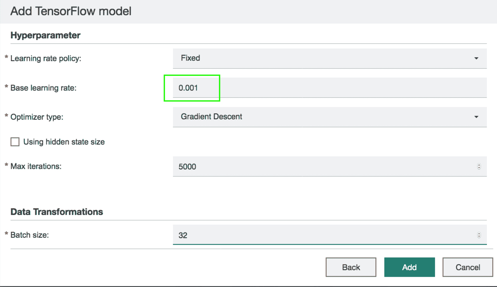

此模型现在可以进行训练了。

### 第 7 步. 运行训练过程

1.  返回 **Models** 选项卡，选择 **Train** 以查看可训练的模型，然后选择您在上一步中创建的模型。

    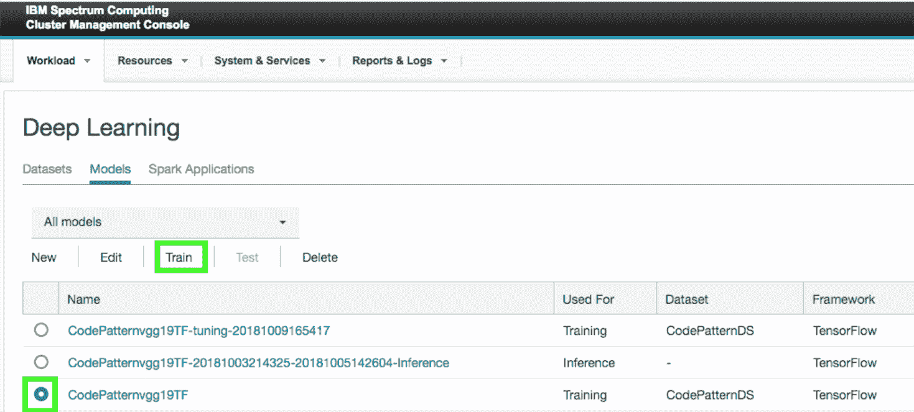

2.  通过指定目录，使用上一步中下载的经过预先训练的权重文件。确保这些文件的扩展名为 `.ckpt`。单击 **Start Training**。

    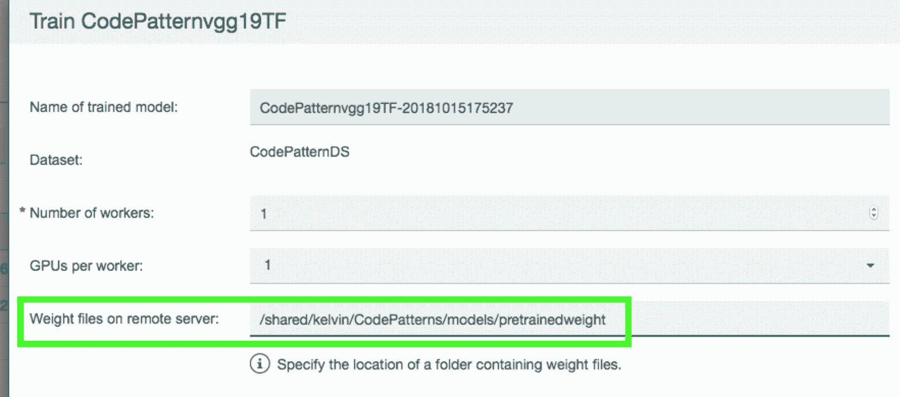

### 第 8 步. 检验训练运行情况

1.  单击链接，从 **Models** 选项卡的 **Train** 子菜单中选择正在训练的模型。

    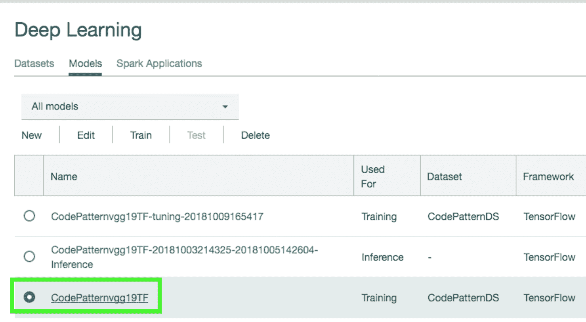

2.  从 **Overview** 面板浏览至 **Training** 面板，并单击最近的链接。您可观看结果滚入过程。

    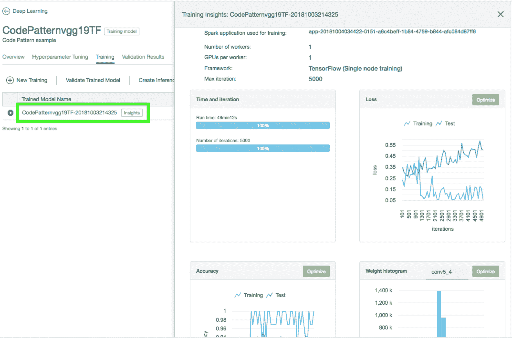

### 第 9 步. 创建推理模型

在 **Training** 视图中单击**Create Inference Model**。

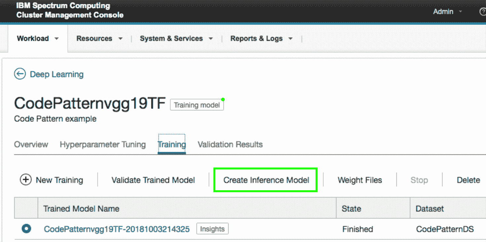

这样会在 **Models** 选项卡中创建一个新模型。您可转至 **Inference** 子菜单查看此模型。

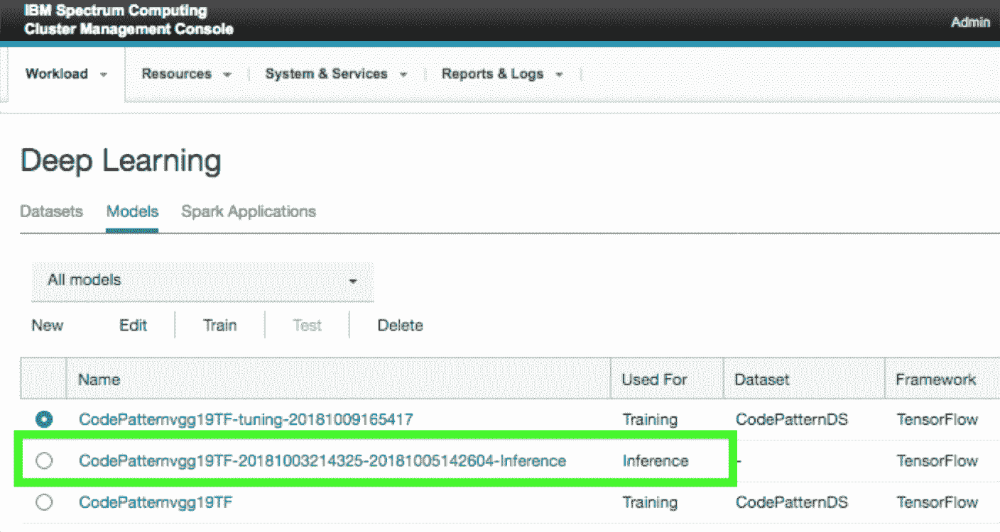

### 第 10 步. 测试一下

1.  返回 **Models** 选项卡，选择新推理模型，然后单击 **Test**。在新的测试概述屏幕上选择 **New Test**。

    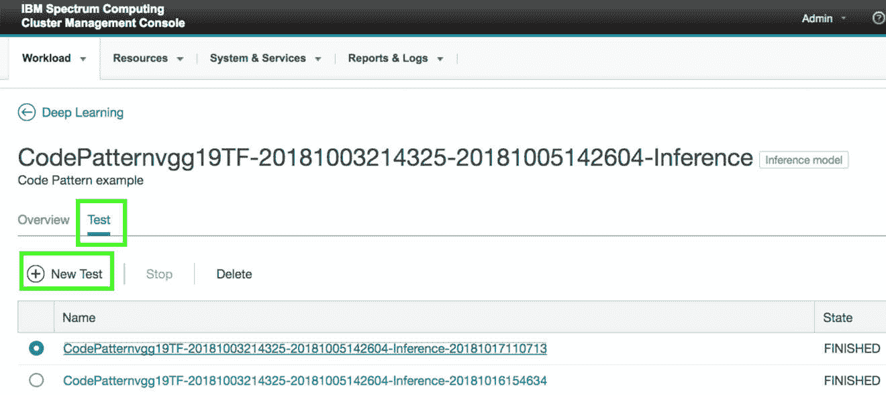

2.  将推理测试图像下载到本地磁盘中。

    *   [Inference_images.zip](https://github.ibm.com/IBMCode/Code-Tutorials/blob/master/use-computer-vision-with-dli-on-powerai-enterprise/images/Inference_images.zip)
3.  解压 Inference_images.zip，并使用 *Browse* 选项来加载 6 张图像。单击 **Start Test**。

    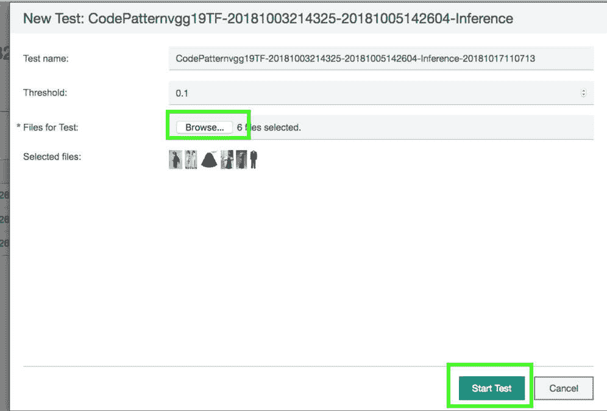

4.  等待测试状态从 `RUNNING` 更改为 `FINISHED`。

    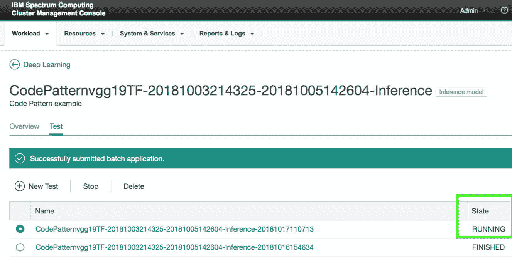

5.  单击链接查看测试结果。

    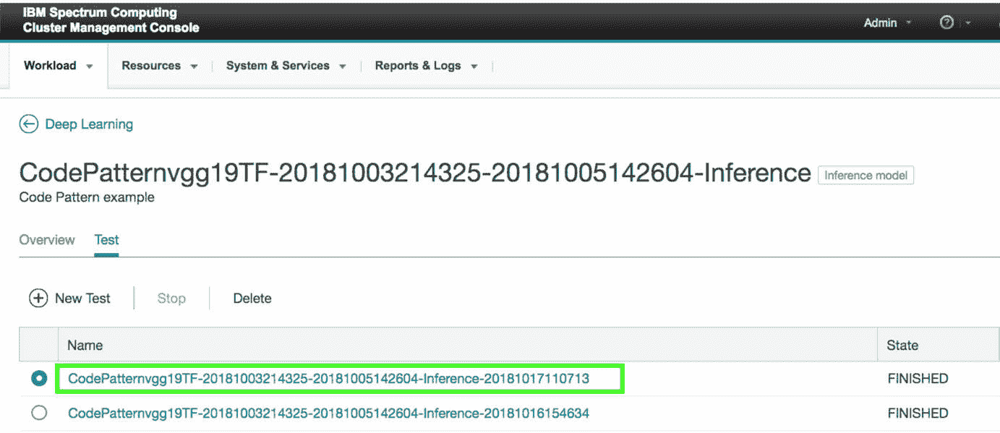

正如您所见，图像以缩略图预览形式显示，带有分类标签和概率。

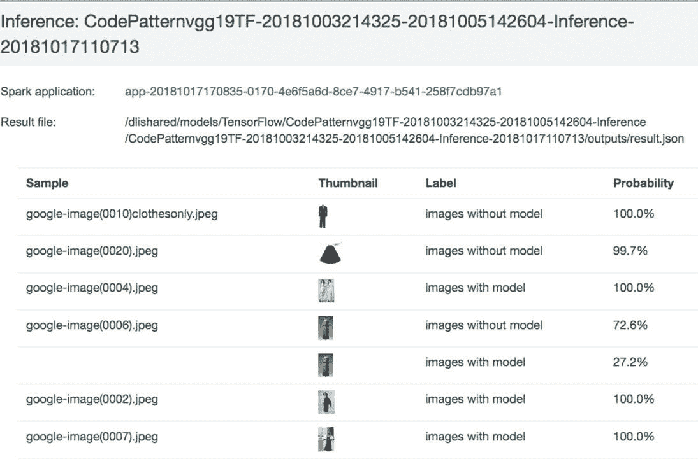

## 结束语

我们希望您喜欢阅读本教程。使用 Watson Machine Learning Accelerator 顺利创建您的下一个模型。祝您好运！

本文翻译自：[Classify images with Watson Machine Learning Accelerator](https://developer.ibm.com/tutorials/use-computer-vision-with-dli-watson-machine-learning-accelerator/)（2018-10-16）