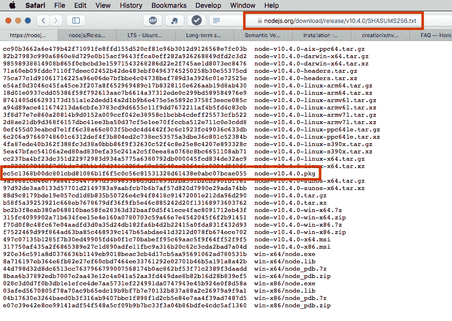
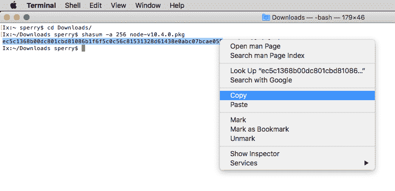
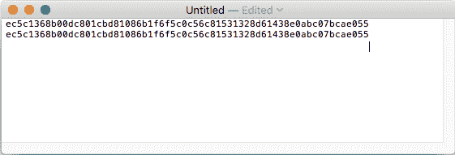
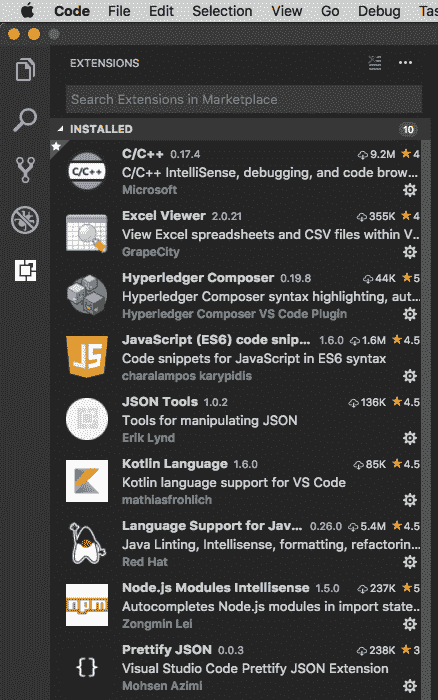
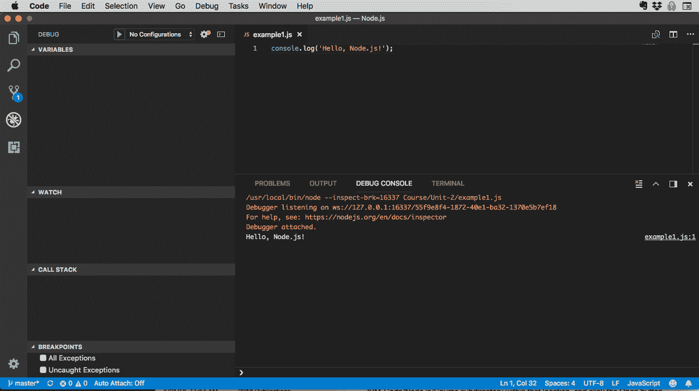

# 安装 Node.js、npm 和 VSCode

> 原文：[`developer.ibm.com/zh/tutorials/learn-nodejs-installing-node-nvm-and-vscode/`](https://developer.ibm.com/zh/tutorials/learn-nodejs-installing-node-nvm-and-vscode/)

在本教程中，我将向您简要介绍 Node.js，并向您说明如何安装完成 Node.js 学习路径所需的软件。

##### Node.js 学习路径

本教程是 Node.js 学习路径的一部分。这些单元彼此互为基础，查看 Node.js 学习路径的概述 从头开始。

首先，您需要安装 Node.js 运行时本身以及 Node 的包管理器 npm。然后，您需要安装一个编辑器，在您完成学习路径 的各个单元时可在其该编辑器中编写源代码。您可以使用任何自己喜欢的编辑器，但我建议您使用 VSCode（我稍后会在本单元中说明原因）。它是免费的、开源的、提供大量的插件，且建立在 Node 之上。

## 前提条件

您需要为自己的平台安装 git 客户端。下面是针对 Windows、MacOS 和 Linux 的安装说明链接。

单击[此链接](https://git-scm.com/book/en/v2/Getting-Started-Installing-Git)，向下滚动至与您的平台匹配的部分，然后遵循说明进行操作。

## 安装 Node.js 和 npm

有多种方法可以安装 Node.js。最简单的方法是直接从 Nodejs.org 网站的[下载页面](https://nodejs.org/en/download/) 下载适用于您平台的程序包，然后运行安装程序。如果您是 Windows 用户，这绝对是可行的方法，但这种方法也适用于 MacOS 和 Linux。

如果您是 Mac 用户，更好的方法是使用 [Homebrew](http://brew.sh)。Homebrew 称自己是“MacOS 的缺失程序包管理器”。您可以使用它来安装和管理数百种不同的 MacOS 程序包。

*最佳* 的安装 Node.js 和 npm 的方法是通过 [Node.js Version Manager 或 nvm](https://github.com/creationix/nvm)。通过使用 nvm，您可以安装 Node.js 运行时和 npm 的多个版本且这些版本可以共存，但您一次只能指定一个 **活动** 版本。我的意思是，您不必卸载 Node.js 或 npm 的一个版本而来安装另一个版本，只需告知 nvm 您要使用哪个版本即可。它非常适用于兼容性测试和管理 Node.js 环境。

我在下表中总结了每种方法的优缺点：

| 安装类型 | 优点 | 缺点 |
| --- | --- | --- |
| 直接从 nodejs.org 下载 | 简单，大多数平台都支持 | 手动校验和验证 |
| Homebrew | 简单，自动校验和验证，可以在多个版本之间切换** | 仅限 MacOS |
| nvm | 简单，自动校验和验证，可以在多个版本之间轻松切换 | 仅限 MacOS 和 Linux（针对其他平台的社区贡献可用） |

** 通过跳过一些 hoop，稍后我将在本教程中向您说明。

Homebrew 和 nvm 提供自动[检验和](https://en.wikipedia.org/wiki/Checksum)验证（这很好），但是官方受支持的平台有限。我将在后面的章节中详细描述每种方法，以便您可以选择适合您的方法。

### 使用哪个 Node.js 版本

在“下载”页面上，您必须在 LTS（长期支持）或当前版本之间进行选择。这是什么意思呢？

开源软件的频繁发布周期是一把双刃剑。一方面，发布了新功能，并及时解决了 bug。但另一方面，您必须处理因频繁发布周期导致的升级问题。对于业务应用程序来说，每年必须多次升级底层运行时，可能会非常不稳定。

##### SemVer

Node.js 发行版使用 SemVer 发行编号（即，**MAJOR.MINOR.PATCH** 编号，例如 2.1.0 或 10.4.0）。[阅读有关 SemVer 的更多信息](https://semver.org)。

要解决此问题，Node.js 发布团队将偶数编号的主要发行版指定为 LTS 发行版。LTS 发行版从最初发行之日起最多受支持三年，在此期间发行版本从 Current（当前版本）（约 6 个月）到 Active LTS（18 个月，仅次要修订）再到 Maintenance LTS（12 个月，仅补丁发行版）。但这意味着您可以确保 LTS 发行版在相当长的一段时间内将保持稳定。

如果您要了解有关 Node.js 发行过程的更多信息，查看[发行页面](https://github.com/nodejs/Release)。该页面包含许多重要信息，包括发行时间表、发行任务和 LTS 发行版（以及其中内容）的方法论 。

对于本学习路径，我使用的是 V10 版本，（在撰写本文时）也是最新的 LTS 版本。您可能希望执行相同的操作，以确保可以跟上进度。

### 检验和

对您执行的任何开源下载执行快速校验和检查始终是个好主意，包括本单元中的任何或所有下载。不相信？请查看 [ServerFault 上的这篇帖子](https://serverfault.com/questions/692457/why-is-it-good-practice-to-compare-checksums-when-downloading-a-file)（StackExchange 站点之一）。

我使用的是 Mac，因此我将向您展示如何在下载 MacOS 时执行校验和验证。如果您运行的是其他平台，那么 Web 上有大量资源可用于了解如何执行校验和验证。

首先，您需要从下载文件的网站中获得校验和。它通常看起来如下：



此示例来自 nodejs.org 网站的 node-v10.4.0.pkg 文件。复制校验和（上面文件名左侧的长字符串）并将其粘贴到编辑器中（为此，我将 TextEdit 保留在 Dock 中）。

现在，打开一个终端窗口并浏览至下载目录（或下载文件的任何位置），并在下载的文件上运行 [shasum](https://ss64.com/osx/shasum.html) 命令：



在编辑器中将字符串粘贴到网站校验和正下方并进行比较：



养成为下载的每个文件执行此校验和验证的习惯。为了节省空间，我不会在本教程的剩余部分中讲述这些下载的详细信息，但请相信我，我对每个文件都进行了校验和验证。

现在，讲述安装！

#### 不错的方法：从 nodejs.org 网站中下载安装包

转至[下载页面](https://nodejs.org/en/download/)，然后单击与您的平台匹配的安装程序。

正如我在上一节中所述，我在本学习路径中使用 V10 版本，这将反映在本节的所有说明中，包括视频。我建议您使用 V10.4.0（或者时下最新的 10.x.y 发行版），当您读到此（或非常接近）时，几乎可以肯定是 LTS 发行版。

将安装程序下载到计算机并验证了校验和匹配后，启动安装程序。例如，在我的 Mac 上，双击 Package 安装程序（名为 node-v10.4.0.pkg）来运行软件包安装程序。我将在视频中展示如何执行该操作。如果您运行的是 Windows，请双击安装程序并遵循安装向导中的步骤进行安装。

对于 Linux，将 tarball 解压缩到标准位置，例如 `/usr/local/lib/nodejs`，确保 Node.js bin 目录的路径与您的 `PATH` 环境变量匹配。有关更详细的指示信息，点击[此链接](https://github.com/nodejs/help/wiki/Installation)参阅 Node.js 的 GitHub Wiki 。

现在跳至 *验证安装* 部分以确认 Node.js 和 npm 已正确安装。

以后当您想要升级 Node.js 版本时，请下载新安装程序，它将替换当前版本。

使用此安装方法，您一次只安装一个版本的 Node.js 和 npm。如果您要安装多个版本并在它们之间来回切换（比如为了兼容性测试），我建议您使用 nvm（请参阅“最佳的方法：使用 nvm”以获取详细信息”）。

### 更好的方法：使用 Homebrew（仅限 MacOS）

Homebrew 是在 Mac 上管理各种软件包的更好方法。每当我需要安装一个熟悉的 Linux 软件包时，我会在尝试以另一种方式安装软件包之前先检查它是否可使用 Homebrew“妙方”（使用 nvm 来管理 Node.js 之类极少数例外情况，我将在下一节中向您说明）。

要了解 Homebrew 以及如何进行安装的更多信息，查看[安装页面](https://docs.brew.sh/Installation)。

要通过 Homebrew 安装 Node.js 和 npm 的当前版本，请在 Mac 上打开终端窗口并输入以下命令：

```
brew install node 
```

但是，我强烈建议您在实践中安装 Node.js 的特定主版本，因为它会强制您了解正在安装的准确版本。如果您安装的特定主版本恰好是当前版本，那么 Homebrew 将自动为您链接（即，将在 Homebrew Cellar 中当前版本的 `PATH` 中创建指向 `node` 和 `npm` 的符号链接）。另外，您可以通过使用 `brew unlink` 命令取消链接一个版本并使用 `brew link` 命令链接另一个版本来切换已安装的版本（但您应该谨慎使用此功能，稍后我将在本节中向您说明）。

要安装最新的 Node.js V10，输入 `brew install node@10` 命令。您将看到类似以下的输出：

```
$ brew install node@10
Updating Homebrew...
==> Auto-updated Homebrew!
Updated 1 tap (homebrew/core).
No changes to formulae.
==> Downloading https://homebrew.bintray.com/bottles/node-10.4.0.high_sierra.bottle.tar.gz
######################################################################## 100.0%
==> Pouring node-10.4.0.high_sierra.bottle.tar.gz
==> Caveats
Bash completion has been installed to:
  /usr/local/etc/bash_completion.d
==> Summary
🍺  /usr/local/Cellar/node/10.4.0: 6,793 files, 59.6MB
$ 
```

现在跳至 *验证安装* 部分以确认 Node.js 和 npm 已正确安装。

*注意：当您使用上面展示的命令时，homebrew 将始终安装 Node.js 的当前版本。如果要安装特定的 Node.js 主版本，请指定主版本号，如：*

```
brew install node@8 
```

您将看到类似以下的输出：

```
$ brew install node@8
==> Downloading https://homebrew.bintray.com/bottles/node@8-8.11.2.high_sierra.bottle.tar.gz
######################################################################## 100.0%
==> Pouring node@8-8.11.2.high_sierra.bottle.tar.gz
==> Caveats
This formula is keg-only, which means it was not symlinked into /usr/local,
because this is an alternate version of another formula.
If you need to have this software first in your PATH run:
  echo 'export PATH="/usr/local/opt/node@8/bin:$PATH"' >> ~/.bash_profile
For compilers to find this software you may need to set:
    LDFLAGS:  -L/usr/local/opt/node@8/lib
    CPPFLAGS: -I/usr/local/opt/node@8/include
==> Summary
🍺  /usr/local/Cellar/node@8/8.11.2: 4,430 files, 47MB 
```

这将安装 Node.js 8 的最新版本，这仅意味着最新的 minor.patch 发行版。注意：如果您安装的版本不是 Node.js 的当前版本（即使它是 Active LTS），那么这将是“仅 keg ”安装。请参阅 [Homebrew FAQ](https://docs.brew.sh/FAQ.html) 中的“What does keg-only mean? （仅 keg 是什么意思？ ）”以获取更多信息。

继续，升级 Node.js 用法：

```
brew upgrade node 
```

如果存在可用升级，那么会自动为您应用。

#### 在多个版本之间切换

Homebrew 允许您一次安装多个主版本的 Node.js 和 npm，但只有一个可能处于活动状态。如果要在它们之间切换，那么必须“取消链接”活动链接的版本，并“链接”您要使用的版本。

在我的 Mac 上，这意味着我不得不费很多事（涉及 `--force` 和 `--overwrite`）以从 V10 切换至 V8，不止一次我不小心把我的系统搞得一团糟（如，`-bash: /usr/local/bin/npm: No such file or directory`）。例如，我必须在此处从 Node.js 10 切换到 Node.js 8，然后切换回 Node.js 10：

```
Ix:~ sperry$ brew unlink node
Unlinking /usr/local/Cellar/node/10.4.0... 7 symlinks removed
Ix:~ sperry$ brew link --force --overwrite node@8
Linking /usr/local/Cellar/node@8/8.11.2... 4287 symlinks created
If you need to have this software first in your PATH instead consider running:
  echo 'export PATH="/usr/local/opt/node@8/bin:$PATH"' >> ~/.bash_profile
Ix:~ sperry$ node -v
v8.11.2
Ix:~ sperry$ npm -v
5.6.0
Ix:~ sperry$ brew unlink node@8
Unlinking /usr/local/Cellar/node@8/8.11.2... 4287 symlinks removed
Ix:~ sperry$ brew link node
Linking /usr/local/Cellar/node/10.4.0... 7 symlinks created
Ix:~ sperry$ node -v
v10.4.0
Ix:~ sperry$ npm -v
-bash: /usr/local/bin/npm: No such file or directory
Ix:~ sperry$ brew reinstall node
==> Reinstalling node
==> Downloading https://homebrew.bintray.com/bottles/node-10.4.0.high_sierra.bottle.tar.gz
Already downloaded: /Users/sperry/Library/Caches/Homebrew/node-10.4.0.high_sierra.bottle.tar.gz
==> Pouring node-10.4.0.high_sierra.bottle.tar.gz
==> Caveats
Bash completion has been installed to:
  /usr/local/etc/bash_completion.d
==> Summary
🍺  /usr/local/Cellar/node/10.4.0: 6,793 files, 59.6MB
Ix:~ sperry$ npm -v
6.1.0
Ix:~ sperry$ 
```

哎呀，多么痛苦！但是，正如你所看到的，我让它起效了。但我最终不得不重新安装 Node.js 10，因为来自 Node.js 8 的 `unlink` 导致存在错误。也许我做错了什么。也许 Homebrew 不喜欢我。也许昨晚是满月。谁知道呢？

如果您真的需要在 Node.js 和 npm 版本之间轻松切换，我强烈建议您使用 nvm。此外，如果您希望安装多个 major.minor.patch 版本并在它们之间来回切换（为了兼容性测试），您必须使用 nvm，因为 Homebrew 只支持安装最新的 major.minor.patch 发行版。

校验和验证怎么样？Homebrew 会自动为您执行校验和验证，这是与直接包安装相比选择使用 Homebrew 的另一个原因。

### 最佳的方法：使用 nvm（仅限 MacOS 和 Linux）

对 Windows 用户说声抱歉。NVM 官方仅在 MacOS 和 Linux 上受支持，但有两个备选项（NVM 团队都没有正式支持，但我从 NVM GitHub 站点获得了这些链接，眨眼眨眼 ）：

*   nvm-windows：[`github.com/coreybutler/nvm-windows`](https://github.com/coreybutler/nvm-windows)
*   nodist：[`github.com/marcelklehr/nodist`](https://github.com/marcelklehr/nodist)

其他不受支持的平台也列示在[重要说明](https://github.com/creationix/nvm#important-notes)下。

安装 nvm 非常容易。转至 creationix GitHub 存储库，然后向下滚动至安装部分（或单击[此链接](https://github.com/creationix/nvm#installation)。复制安装命令并将其粘贴到终端窗口或命令提示符中：

```
curl -o- https://raw.githubusercontent.com/creationix/nvm/v0.33.11/install.sh | bash 
```

下载和安装只需要几秒钟（在我的 Mac 上不到 10 秒）。

安装脚本会对 `.bash_profile` (MacOS) 或 `.profile` (Linux) 进行更改，因此当脚本完成后，您必须使用自己喜欢的方法重新运行概要文件脚本。我比较懒，所以我会停止终端窗口并打开一个新窗口。

通过运行 `nvm --version` 命令来验证 nvm 是否安装正确。您会看到类似如下的输出：

```
$ nvm --version
0.33.11 
```

运行 `nvm install --lts` 命令安装 Node.js 和 npm，该命令将告知 nvm 安装 LTS 版本（在撰写本文时是 Node.js 8.11.2 和 npm 5.6.0）：

```
$ nvm install --lts
Installing latest LTS version.
Downloading and installing node v8.11.2...
Downloading https://nodejs.org/dist/v8.11.2/node-v8.11.2-darwin-x64.tar.gz...
######################################################################## 100.0%
Computing checksum with shasum -a 256
Checksums matched!
Now using node v8.11.2 (npm v5.6.0) 
```

现在使用下一节中的说明来验证安装。

#### 使用 nvm 在多个版本之间切换

您可以安装 Node.js 和 npm 的多个版本（包括已发布的任何 major.minor.patch 组合）并在它们之间来回切换。这对兼容性测试很有用。假设您要安装 Node.js 10（在撰写本文时是 10.4.0）：

```
$ nvm install 10
Downloading and installing node v10.4.0...
Downloading https://nodejs.org/dist/v10.4.0/node-v10.4.0-darwin-x64.tar.gz...
######################################################################## 100.0%
Computing checksum with shasum -a 256
Checksums matched!
Now using node v10.4.0 (npm v6.1.0)
$ node -v
v10.4.0
Ix:~ sperry$ npm -v
6.1.0 
```

然后切换回 Node.js 8（我假设您一直在跟进本教程，并且使用的版本是 10）：

```
Ix:~ sperry$ nvm use 8
Now using node v8.11.2 (npm v5.6.0)
Ix:~ sperry$ node -v
v8.11.2
Ix:~ sperry$ npm -v
5.6.0 
```

看看！我可以使用简单的命令在 PATH 上交换 Node 运行时，很酷吧。

注意，npm 的版本也会升级以匹配您下载的 Node 版本。除非您另有说明，否则 Node.js 和 npm 都是一揽子交易（这通常是一件好事）。

要查看所有可用选项，只需键入 nvm 并显示以下帮助屏幕：

```
Usage:
  nvm --help                                Show this message
  nvm --version                             Print out the installed version of nvm
  nvm install [-s] <version>                Download and install a <version>, [-s] from source.Uses .nvmrc if available
    --reinstall-packages-from=<version>     When installing, reinstall packages installed in <node|iojs|node version number>
    --lts                                   When installing, only select from LTS (long-term support) versions
    --lts=<LTS name>                        When installing, only select from versions for a specific LTS line
    --skip-default-packages                 When installing, skip the default-packages file if it exists
    --latest-npm                            After installing, attempt to upgrade to the latest working npm on the given node version
  nvm uninstall <version>                   Uninstall a version
  nvm uninstall --lts                       Uninstall using automatic LTS (long-term support) alias `lts/*`, if available.
  nvm uninstall --lts=<LTS name>            Uninstall using automatic alias for provided LTS line, if available.
  nvm use [--silent] <version>              Modify PATH to use <version>.Uses .nvmrc if available
    --lts                                   Uses automatic LTS (long-term support) alias `lts/*`, if available.
    --lts=<LTS name>                        Uses automatic alias for provided LTS line, if available.
  nvm exec [--silent] <version> [<command>] Run <command> on <version>.Uses .nvmrc if available
    --lts                                   Uses automatic LTS (long-term support) alias `lts/*`, if available.
    --lts=<LTS name>                        Uses automatic alias for provided LTS line, if available.
  nvm run [--silent] <version> [<args>]     Run `node` on <version> with <args> as arguments.Uses .nvmrc if available
    --lts                                   Uses automatic LTS (long-term support) alias `lts/*`, if available.
    --lts=<LTS name>                        Uses automatic alias for provided LTS line, if available.
  nvm current                               Display currently activated version
  nvm ls                                    List installed versions
  nvm ls <version>                          List versions matching a given <version>
  nvm ls-remote                             List remote versions available for install
    --lts                                   When listing, only show LTS (long-term support) versions
  nvm ls-remote <version>                   List remote versions available for install, matching a given <version>
    --lts                                   When listing, only show LTS (long-term support) versions
    --lts=<LTS name>                        When listing, only show versions for a specific LTS line
  nvm version <version>                     Resolve the given description to a single local version
  nvm version-remote <version>              Resolve the given description to a single remote version
    --lts                                   When listing, only select from LTS (long-term support) versions
    --lts=<LTS name>                        When listing, only select from versions for a specific LTS line
  nvm deactivate                            Undo effects of `nvm` on current shell
  nvm alias [<pattern>]                     Show all aliases beginning with <pattern>
  nvm alias <name> <version>                Set an alias named <name> pointing to <version>
  nvm unalias <name>                        Deletes the alias named <name>
  nvm install-latest-npm                    Attempt to upgrade to the latest working `npm` on the current node version
  nvm reinstall-packages <version>          Reinstall global `npm` packages contained in <version> to current version
  nvm unload                                Unload `nvm` from shell
  nvm which [current | <version>]           Display path to installed node version.Uses .nvmrc if available
  nvm cache dir                             Display path to the cache directory for nvm
  nvm cache clear                           Empty cache directory for nvm
Example:
  nvm install 8.0.0                     Install a specific version number
  nvm use 8.0                           Use the latest available 8.0.x release
  nvm run 6.10.3 app.js                 Run app.js using node 6.10.3
  nvm exec 4.8.3 node app.js            Run `node app.js` with the PATH pointing to node 4.8.3
  nvm alias default 8.1.0               Set default node version on a shell
  nvm alias default node                Always default to the latest available node version on a shell
Note:
  to remove, delete, or uninstall nvm - just remove the `$NVM_DIR` folder (usually `~/.nvm`) 
```

您还可以查看 NVM [文档](https://github.com/creationix/nvm#usage)。

### 验证安装

在安装 Node.js 和 npm 后，验证它们是否安装正确：

```
node -v
npm -v 
```

您会看到类似如下的输出：

```
$ node -v
v10.4.0
$ npm -v
6.1.0 
```

确保 `/usr/local/bin` 位于您的 `PATH` 环境变量中，否则您可能会看到类似如下的输出：

```
$ node
-bash: node: command not found 
```

## 从 GitHub 获取源代码

我已经为学习路径中的每个示例提供了源代码，可以在 GitHub 中找到该学习路径。

打开终端窗口，浏览至您希望放置该代码的目录，然后输入 git clone 命令：

```
git clone https://github.com/jstevenperry/IBM-Code 
```

然后，浏览至 Node.js/Course 目录。您可以在其中找到我在整个课程中展示的所有示例。

[获取代码](https://github.com/jstevenperry/IBM-Developer/tree/master/Node.js/Course)

## 安装 VSCode

要跟进学习路径中的所有教程，您需要一个编辑器。我已经使用 VSCode 好几年了，非常喜欢它。它是免费的开源工具，并且拥有一个活跃的用户社区，里面有大量扩展，这意味着您可能会为您喜欢的语言、平台或文件格式找到许多不同的扩展。另外，VSCode 构建在 [Electron 框架](https://electronjs.org)之上，底层使用 Node.js。

当然，您可以自由使用自己喜欢的任何编辑器。对于本系列的教程，我使用 VSCode，因此您看到的所有截屏和视频捕获都是 VSCode 的。

要安装 VSCode，请转至 [code.visualstudio.com](https://code.visualstudio.com)。您的浏览器应自动检测您的平台并使用匹配的下载预填充下拉列表，或使用下拉列表选择您喜欢的任何其他下载。但我推荐您访问[下载页面](https://code.visualstudio.com/download)，您还可以在其中获取针对您下载的 SHA256 校验和。要查看校验和，请单击页面底部标题为“See SHA-256 Hashes（查看 SHA-256 散列）”的链接，该链接将展开，显示每个文件的散列列表。

下载的文件因平台而异。对于 MacOS，下载的文件是包含 MacOS App 文件的 ZIP 归档。将此文件复制到您的应用程序文件夹，以便您以后需要时可以轻松找到它。

如果您在 Windows 上运行，那么该文件是一个安装程序。安装说明位于[此处](https://code.visualstudio.com/docs/setup/windows)。

如果您运行的是 Linux，那么可以在[此处](https://code.visualstudio.com/docs/setup/linux)找到安装说明。

在安装 VSCode 后，继续将其启动。你绝对应该看看有大量插件的 Marketplace。

单击 Marketplace 图标安装插件，搜索所需的插件，然后单击 **Install**。图 4 显示了我安装的一些扩展：



### 在 VSCode 中运行 Node.js

VSCode 将插入 Node.js 运行时中，因此您可以在 VSCode 中运行代码。请执行以下步骤：

1.  导航到您克隆代码的目录。
2.  在 VSCode 中，选择 `File > Open`，选择该目录中的 `IBM-Code/Node.js/Course` 子目录，然后单击“打开”按钮。
3.  单击 **File** 选项卡，展开 `Unit-2` 文件夹，然后单击 `example1.js` 以在编辑器中将其打开。
4.  单击 **Debug** 选项卡。
5.  单击 **Run** 按钮。

JavaScript 文件将在调试窗口中运行。完成后您会看到类似于图 5 的内容。

 图 5 – VSCode 调试窗口。

现在，您可以从命令行或在 VSCode 中运行本课程中的所有示例。

## 结束语

在本教程中，我向您展示了用于安装 Node.js 和 npm 的三种不同方法，以及每种方法的优缺点。然后我向您说明了如何安装 VSCode。

在本系列的下一单元中，我将向您介绍基本的 Node.js 概念，并且您将会编写一些 JavaScript 代码！

## 视频

在视频中，我将向您展示如何以三种不同的方式安装 Node.js 和 npm，以及如何在 Mac 上安装 VSCode。

[https://cdnapisec.kaltura.com/p/1773841/sp/177384100/embedIframeJs/uiconf_id/39954662/partner_id/1773841?iframeembed=true&playerId=kplayer&entry_id=1_oe5gzg0i&flashvars[streamerType]=auto](https://cdnapisec.kaltura.com/p/1773841/sp/177384100/embedIframeJs/uiconf_id/39954662/partner_id/1773841?iframeembed=true&playerId=kplayer&entry_id=1_oe5gzg0i&flashvars[streamerType]=auto)

本文翻译自：[Install Node.js, npm, and VS Code](https://developer.ibm.com/tutorials/learn-nodejs-installing-node-nvm-and-vscode/) （2018-10-10）