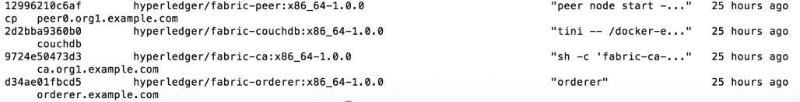

# 使用 Hyperledger Composer 创建强大的区块链查询

> 原文：[`developer.ibm.com/zh/tutorials/cl-create-powerful-blockchain-queries-with-hyperledger-composer/`](https://developer.ibm.com/zh/tutorials/cl-create-powerful-blockchain-queries-with-hyperledger-composer/)

## 介绍

***注意：**IBM Blockchain Platform 现在使用 Hyperledger Fabric 进行端到端开发。用户可以根据自己的选择使用 Hyperledger Composer，但 IBM 不会为其提供支持。*

对于应用程序开发人员，查询资源（比如区块链上各个区块中的资产和交易数据）可能是一个复杂的任务。您不禁思考：如何编写可被区块链理解的业务查询？如何获取结果？如何使用结果？您不该纠结于各种格式数据的不同性质、它们之间的转换以及提取出直观的结果集。相反，您应该只需简单地提交查询并处理查询结果。

考虑以下逻辑查询，例如：

*   “显示贸易方 A 创建的商品列表。”
*   “显示贸易方 B 上周创建的 EURONEXT 类型的商品列表。”
*   “显示特定贸易方在指定时间范围对特定商品实例的账本的更改历史。”

如何将这些查询转换为“区块链语言”呢？

通过使用 Hyperledger Composer 的富查询特性，可以轻松地编写诸如此类的强大查询。查询特性填补了空白，使您不再需要考虑构建语法，解析、转换和验证查询，以及查询的类型和您从 Hyperledger Fabric 区块链获得的结果。也无需担心如何保证格式一致。Hyperledger Composer 的查询语言消除了这些麻烦，使得可以通过简单的表示法轻松定义查询，使您的应用程序能够基于业务定义的条件而执行操作。然后可以直接在您的应用程序中使用查询，或者通过生成的查询 REST API 来使用查询，都非常简单。

Hyperledger Composer 基于 Hyperledger Fabric v1.0，但*在 Hyperledger Fabric v1.0 之前*，查询需要 Hyperledger Fabric 生成的 ID。现在借助 Hyperledger Composer 的富查询功能和 Hyperledger Fabric v1.0，可以使用任何属性或变量参数来查询资源。通过对查询使用参数，您不需要构造复杂的专门查询，而且可以构造模板查询，在每次使用时再设置参数。

### 关于本教程

本教程演示 Hyperledger Composer 查询语言的强大功能，它使用区块链资源的属性来返回查询结果。我们将以使用 Hyperledger Composer 部署的一个现有的 **[trade-network 示例](https://github.com/hyperledger/composer-sample-networks/tree/master/packages/trade-network)**为例，展示如何结合使用富查询和 REST 服务器，以及如何对结果集执行操作，比如使用交易处理程序更新或删除资产。trade-network 示例展示了两个贸易方之间的商品所有权转移。

要学习本教程，您需要下面列出的软件，以及 JSON 和基本查询定义的实用知识。完成本教程后，您就可以自由使用 Hyperledger Composer 构建网络和尝试自己的查询！

## 软件需求

*   Hyperledger Composer 开发工具。（下一节将安装它们。）

    *   Hyperledger Composer 命令行 (composer-cli)
    *   Hyperledger Composer REST 服务器 (composer-rest-server)
*   一个正在运行的 Hyperledger Fabric v1 正式发布版运行时。（下一节将提供下载和启动 Hyperledger Fabric 环境的操作说明。）
*   请参阅安装开发工具的[**其他前提条件**](https://hyperledger.github.io/composer/unstable/installing/installing-prereqs)。

## 使用 CouchDB 设置 Hyperledger Composer 运行时

1.  安装 Hyperledger Composer 开发工具（使用非 root 用户身份）：

    1.  要安装 **composer-cli**，请运行以下命令：

        `npm install -g composer-cli`

        composer-cli 包含用于开发业务网络的所有命令行操作。

    2.  要安装 **composer-rest-server**，请运行以下命令：

        `npm install -g composer-rest-server`

        Hyperledger Composer REST 服务器使用 Hyperledger Composer Loopback Connector 连接到业务网络，提取网络的模型和模式，然后生成一个 REST Explorer Web 页面，其中包含已为该模型生成的 REST API。

        对于本教程，只需要使用这两个工具。

2.  按照[**安装 Hyperledger Composer 并进行开发**](https://hyperledger.github.io/composer/unstable/installing/development-tools)中的操作说明，启动 Hyperledger Fabric 运行时。

    启动后，您应该能够通过这个命令查看下面 4 个 Docker 服务：

    ```
    docker ps -a 
    ```

    

    为了使用富查询，需要设置和启用一个 CouchDB 映像和 CouchDB 配置。二者都已在 Hyperledger Composer v0.11+ 中通过 Hyperledger Fabric V1 运行时完成。您可以为每个对等节点或一个特定对等节点启用 CouchDB，并将该对等节点设置为依赖于它。对于启用了 CouchDB 的对等节点，已为其配置了一个 CouchDB 实例。

    一个具有合适配置的 docker-compose.yml 文件类似于这个示例：

    

## 向业务网络添加查询

Hyperledger Composer 查询语言支持 CouchDB Mango 查询语言标准。查询是业务网络定义中查询文件 (.qry) 定义的 JSON 对象。查询可用于返回以下资源：

*   资产
*   参与者
*   历史数据

对于本教程，我们将使用 Hyperledger Composer [**trade-network 示例**](https://github.com/hyperledger/composer-sample-networks/tree/master/packages/trade-network)中定义的简单查询，可从 GitHub 下载该示例。

查询使用的语法很简单，由初始 `query` 关键字后跟查询名称（在本例中为 `selectCommoditiesByOwner`）来定义。`description` 字段应包含查询功能的有意义、人类可读的描述。`statement` 字段包含 `SELECT` 和 `WHERE` 属性，前者定义要查询的注册表或资源集，后者定义要返回资源而必须满足的条件。`WHERE` 属性可以包含语义 `AND/OR` 修饰符。有关更多细节，请查阅 [**Hyperledger Composer 查询语言文档**](https://hyperledger.github.io/composer/unstable/reference/query-language)。

要添加查询，可以打开一个现有的业务网络，创建一个 queries.qry 文件。在这个文件中，可以描述多个查询。下面的示例查询将返回其 owner 属性与在发送查询时提供的 `_$owner` 变量参数匹配的所有商品。


Hyperledger Composer 中的 Historian 特性维护业务网络中发生的账本更新历史。提交交易时，会更新 `HistorianRecord`，而且随着时间的推移，交易注册表会逐渐变大，既包含特定交易的交易输入，也包含提交这些交易所涉及的参与者和身份。为了演示 Hyperledger Composer 中的 Historian 特性，我们向 queries.qry 文件添加了两个额外的交易：


##### 清单 1.包含更多交易的示例查询

```
query showCommodityAllHistorians{
  description: "Select commodity all historians"
  statement:
    SELECT org.hyperledger.composer.system.HistorianRecord FROM
HistorianRegistry
          WHERE (transactionType == 'AddAsset' OR transactionType ==
'UpdateAsset' OR transactionType == 'RemoveAsset')
}

query findCommmodityHistoriansWithTime{
  description: "Find commodity historians after a specified time"
  statement:
    SELECT org.hyperledger.composer.system.HistorianRecord FROM
HistorianRegistry WHERE (transactionTimestamp > _$justnow)
} 
```

可以将这两个查询剪切并粘贴到 queries.qry 文件中，然后保存该文件。

## 将业务网络部署到 Hyperledger Fabric

现在您应该有一个包含 queries.qry 文件的业务网络。 如果您拥有 Hyperledger Fabric 的本地实例，可以使用以下命令部署该业务网络：

```
composer network deploy -p hlfv1 -a ./trade-network.bna -i PeerAdmin -s adminpw 
```

可以将完整路径传递给 `trade-network.bna`；`hlfv1` 是与 Hyperledger Fabric 运行时连接的概要文件名称。有关更多细节，请查阅 [Hyperledger Composer 命令行文档](https://hyperledger.github.io/composer/unstable/reference/commands)。

如果您已部署了 `trade-network.bna`，则应该使用此命令更新业务网络：

```
composer network update -p hlfv1 -a ./trade-network.bna -i PeerAdmin -s adminpw 
```

您应该看到一条成功部署消息：


部署业务网络后，以下命令应该显示一个链代码容器：

```
docker ps –a 
```


## 通过 REST API 探索富查询

部署包含查询的业务网络后，现在启动 Composer REST 服务器来通过 REST API 公开这些查询。 Hyperledger Composer REST 服务器基于业务网络而生成一组预定的 REST API。

1.  从命令行，使用以下命令启动 REST 服务器：

    ```
    composer-rest-server 
    ```

2.  提供如下所示的信息：

    

3.  从 Web 浏览器键入以下地址来打开 REST 服务器：

    [`localhost:3000/explorer`](http://localhost:3000/explorer)

您应该看到以下查询 API：


目前，您的业务网络还没有任何要查询的数据。在下一步，您将创建一些参与者、资产和一个 Historian 注册表来测试这些查询。

## 在 World State 数据库中创建参与者、资产和 Historian 注册表

在本节中，我们将创建两个参与者和两个资产，然后提交一个贸易交易。

### 创建两个参与者

可以从 REST 服务器界面创建参与者。单击 **Trader**，然后单击 **POST** 来创建一个 `Trader` 参与者。`Trader` 参与者需要 3 个字段，如下所示。执行此操作两次，以创建两个参与者。

##### 清单 2.一个 Trader 参与者的示例

```
{
    "$class": "org.acme.trading.Trader",
    "tradeId": "fenglian@email.com",
    "firstName": "Fenglian",
    "lastName": "Xu"
} 
```

### 创建两个 Commodity 资产

接下来，我们用创建参与者的相同方式创建两个 `Commodity` 资产。执行此操作两次，以创建两个商品。

##### 清单 3.一个 Commodity 资产的示例

```
{
  "$class": "org.acme.trading.Commodity",
  "tradingSymbol": "XYZ",
  "description": "Soya",
  "mainExchange": "Chicago",
  "quantity": 50,
  "owner": "dan@email.com"
} 
```

单击 Commodity 下的 **GET** 显示创建的所有商品。

##### 清单 4.资产注册表中创建的两个资产

```
[
  {
    "$class": "org.acme.trading.Commodity",
    "tradingSymbol": "EMA",
    "description": "Corn",
    "mainExchange": "Euronext",
    "quantity": 100,
    "owner": "resource:org.acme.trading.Trader#dan@email.com"
  },
  {
    "$class": "org.acme.trading.Commodity",
    "tradingSymbol": "XYZ",
    "description": "Soya",
    "mainExchange": "Chicago",
    "quantity": 50,
    "owner": "resource:org.acme.trading.Trader#dan@email.com"
  }
] 
```

请注意，`owner` 属性与一个 Participant 实例相关联。也就是说，它是在 trade-network 模型中建模的。Participant 注册表中的 id `dan@email.com`（完全限定的关系引用了它）包含所关注的参与者的一个 URI 前缀 `resource:org.acme.trading.Trader#`。

### 创建贸易交易

*贸易交易*（在我们的示例中）是定义来改变商品所有权的交易。所有交易都记录在这个商品贸易业务网络的 Historian 注册表中。它维护交易的历史、它们的类型，以及特定交易所添加的更改/增量（或者使用 `create` 时添加的交易，比如 `create asset`）。

导航到 **Trade** 节，打开 **POST**。

在 data 字段中，放入以下数据：

##### 清单 5.一个贸易交易的示例

```
{
  "$class": "org.acme.trading.Trade",
  "commodity": "EMA",
  "newOwner": "fenglian@email.com",
  "transactionId": "",
  "timestamp": "2017-08-07T15:04:33.790Z"
} 
```

然后单击 **Try it out!** 按钮提交该贸易交易。此交易将 EMA 商品的所有者从 `dan` 更改为 `fenglian`。可以单击 Commodity GET 查询下方的 **Try it out!** 来验证此结果。

##### 清单 6.更新的 EMA 商品所有者

```
[
  {
    "$class": "org.acme.trading.Commodity",
    "tradingSymbol": "EMA",
    "description": "Corn",
    "mainExchange": "Euronext",
    "quantity": 100,
    "owner": "resource:org.acme.trading.Trader#fenglian@email.com"
  },
  {
    "$class": "org.acme.trading.Commodity",
    "tradingSymbol": "XYZ",
    "description": "Soya",
    "mainExchange": "Chicago",
    "quantity": 50,
    "owner": "resource:org.acme.trading.Trader#dan@email.com"
  }
] 
```

## 通过 REST 服务器查询资源

本节将通过 REST 服务器，使用富查询函数和变量参数来查询业务网络数据。

### Hyperledger Composer 和 REST 服务器支持的富查询数据类型

由于 Hyperledger Composer Loopback Connector 的原因，通过 REST API 公开的查询中的参数数据类型不同于 Composer 数据类型，如表 1 所示。

##### 表 1 ：Composer 与 REST 服务器之间的基本数据类型对应关系

| 组件 |  |  |  |  |
| --- | --- | --- | --- | --- |
| **Composer 运行时** | String | Double/Integer/Long | DateTime | Boolean |
| **REST 服务器** | string | number | date | boolean |

除了上述 Composer 运行时基本数据类型，Composer 运行时还支持以下数据类型：

*   **一种关联关系**：此关系始终由一个 String 类型的 key 属性来标识。
*   **一种类包含关系**：属性数据类型是一个类，这个类又可以拥有另一个类包含关系，以此类推。这是一种嵌套关系，而且是一种基本类型。
*   **枚举**：此类型用于一组预定义的数据。

### 使用参数来查询资产

在 REST 服务器 UI 中展开该查询。queries.qry 文件中之前定义了一个查询列表。可以使用任何这些查询来查询 CouchDB 数据库中现在包含的业务网络数据。

`selectComoditiesByExchange` 查询允许您通过交换符号属性来返回商品。


单击 **Try it out!** 发送该查询。结果将显示在 Try it out! 按钮下方：


响应页面显示了 `Curl` 和针对包含一个参数的查询格式的 Web 浏览器 URL。

`selectCommoditiesByOwner` 查询演示了一个使用 `owner` 属性的查询。您可以打开 `selectCommoditiesByOwner` 查询的 **GET** 面板，定义您想要查询的所有者：


下面显示了针对指定所有者的查询结果。


### 查询交易历史

Historian 是一个 Hyperledger Composer 特性，用于跟踪交易和资产更新。提交一个交易时，`HistorianRecord` 显示对一个业务网络中资产的更改，以及提交这些交易所涉及的参与者和身份。

Historian 是 Hyperledger Composer 系统名称空间中定义的一种资产，如清单 7 所示。

如果您想以编程方式使用 Historian，请参阅 [**Hyperledger Composer HistorianRecord 文档**](https://hyperledger.github.io/composer/unstable/reference/historian.html)。

##### 清单 7.Historian 模型

```
asset HistorianRecord identified by transactionId {
  o String      transactionId
  o String      transactionType
  --> Transaction transactionInvoked
  --> Participant participantInvoking  optional
  --> Identity    identityUsed         optional
  o Event[]       eventsEmitted        optional
  o DateTime      transactionTimestamp
} 
```

导航到 `findCommodityHistoriansWithTime` 查询，以 UTC 格式指定一个日期时间值，然后单击 **Try it out!**。


此查询会找到 Historian 注册表中在指定日期时间后发生的交易的所有历史记录，如清单 8 所示。交易类型同时包含系统交易和用户定义的交易。例如，`Trade` 是用户定义的交易，`AddAsset` 是系统交易。

##### 清单 8.交易的历史记录

```
[
  {
    "$class": "org.hyperledger.composer.system.HistorianRecord",
    "transactionId": "0392a2e7-e056-4442-82c7-7d020cd0ee7a",
    "transactionType": "AddParticipant",
    "transactionInvoked": "resource:org.hyperledger.composer.system.Transaction#0392a2e7-e056-4442-82c7-7d020cd0ee7a",
    "eventsEmitted": [],
    "transactionTimestamp": "2017-08-07T15:08:19.047Z"
  },
  {
    "$class": "org.hyperledger.composer.system.HistorianRecord",
    "transactionId": "04f4410c-3470-4319-a6c5-3f5681d86488",
    "transactionType": "AddAsset",
    "transactionInvoked": "resource:org.hyperledger.composer.system.Transaction#04f4410c-3470-4319-a6c5-3f5681d86488",
    "eventsEmitted": [],
    "transactionTimestamp": "2017-08-07T15:13:56.223Z"
  },
  {
    "$class": "org.hyperledger.composer.system.HistorianRecord",
    "transactionId": "2529902c-1393-4537-98ca-f3e4d46a3164",
    "transactionType": "Trade",
    "transactionInvoked": "resource:org.hyperledger.composer.system.Transaction#2529902c-1393-4537-98ca-f3e4d46a3164",
    "eventsEmitted": [
      {
        "$class": "org.acme.trading.TradeNotification",
        "commodity": "resource:org.acme.trading.Commodity#EMA",
        "eventId": "2529902c-1393-4537-98ca-f3e4d46a3164#0",
        "timestamp": "2017-08-07T15:04:33.790Z"
      }
    ],
    "transactionTimestamp": "2017-08-07T15:04:33.790Z"
  },
  {
    "$class": "org.hyperledger.composer.system.HistorianRecord",
    "transactionId": "3f31add4-5e4d-40cd-84a5-e5553a14cb50",
    "transactionType": "AddAsset",
    "transactionInvoked": "resource:org.hyperledger.composer.system.Transaction#3f31add4-5e4d-40cd-84a5-e5553a14cb50",
    "eventsEmitted": [],
    "transactionTimestamp": "2017-08-07T15:13:03.584Z"
  },
  {
    "$class": "org.hyperledger.composer.system.HistorianRecord",
    "transactionId": "a50145ba-df31-4def-932e-cfc9707131ec",
    "transactionType": "AddParticipant",
    "transactionInvoked": "resource:org.hyperledger.composer.system.Transaction#a50145ba-df31-4def-932e-cfc9707131ec",
    "eventsEmitted": [],
    "transactionTimestamp": "2017-08-07T15:07:15.985Z"
  }
] 
```

## 结束语

内置于 Hyperledger Composer 中的富查询语言，让对资产和交易执行复杂且强大的查询变得很容易。 如果没有原生查询语言，您需要在代码中构造专门查询，然后努力理解返回的结果。

本教程展示了如何在 Hyperledger Composer 中定义查询，对启用了 CouchDB 的 Hyperledger Fabric 进行业务网络部署或更新，设置一个 REST 服务器，以及使用 REST 服务器查询业务网络。Hyperledger Composer 查询语言使查询任何属性都变得非常灵活而轻松。

## 后续行动

*   在这篇[深入介绍](https://hyperledger.github.io/composer/unstable/introduction/introduction)文章中进一步了解 Hyperledger Composer。
*   加入 [Hyperledger Composer 社区](https://hyperledger.github.io/composer/unstable/support/support-index)以解决您的难题，为该项目做贡献，以及参加每周开放社区电话会议。

### 致谢

感谢 Hyperledger Composer 开发团队，特别感谢 Daniel Selman 和 Simon Stone 提供技术支持。还要感谢 Edward Prosser 和 Rachel Jackson 提供技术评审和支持。

本文翻译自：[Archived | Create powerful blockchain queries with Hyperledger Composer](https://developer.ibm.com/tutorials/cl-create-powerful-blockchain-queries-with-hyperledger-composer/)（2017-01-01）