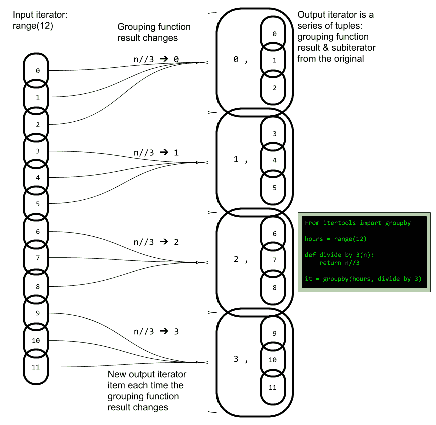

# 神奇的 itertools

> 原文：[`developer.ibm.com/zh/tutorials/ba-on-demand-data-python-2/`](https://developer.ibm.com/zh/tutorials/ba-on-demand-data-python-2/)

在此系列的 [第 1 部分](https://developer.ibm.com/zh/tutorials/ba-on-demand-data-python-1/) 中， 您了解了 Python 迭代器，并学会了创建迭代器的最简单的方法，即通过编写生成器函数或表达式来创建迭代器。一旦掌握了基础知识，就可以很快熟悉构建迭代器的各种方法。但是，我们希望最好避免重复工作。

Python 标准库包含了一些非常有用的支持和工具，堪称奇迹，其中有些工具比其他工具更隐蔽一些。有几个模块在操作迭代器时很有用，但首先您应查看内置功能中的一些工具，”内置”意味着，在大多数情况下，您无需导入任何内容即可进行使用。

## 使用 map 构建迭代器

使用 `map` 函数，您可以处理迭代器中的每一个项，以便生成新的迭代器。

```
>>> r = range(10)
>>> m = map(str, r)
>>> next(m)
'0'
>>> list(m)
['1', '2', '3', '4', '5', '6', '7', '8', '9'] 
```

map 的第一个自变量是映射函数，即应用于每个项的函数。 在此例中，我使用 `str` 将范围中的每个整数转换为字符串。当我通过 map 迭代器请求第一项时，我会收到一个字符串。然后，我使用 list 来抽取序列中的所有内容。请注意，列表是从 `1` （而不是 `0` ）开始。这是因为我已通过 map 抽取了第一项。与列表或元组不同，迭代器不支持随机访问。您可以正向依次获取各个项。

当然，您可以编写自己的映射函数。它期望收到来自 `map` 的一个输入值。将以下内容粘贴到解释器会话中：

```
def get_letter(i):
    return chr(ord('a')+i) 
```

此处，我使用 `ord` 获取与字符 `'a'` 对应的数字代码，并添加函数的自变量以派生新的字符代码。函数 `chr` 将此代码重新转换为字符串字符。将此函数与 `map` 结合使用。

```
>>> r = range(10)
>>> list(map(get_letter, r))
['a', 'b', 'c', 'd', 'e', 'f', 'g', 'h', 'i', 'j'] 
```

### Map 与生成器表达式

此时，您可能会记起 [第 1 部分](https://www.ibm.com/developerworks/cn/analytics/library/ba-on-demand-data-python-1/index.html) ，并意识到这很像生成器表达式。的确，我可以做以下调整。

```
>>> list( ( get_letter(i) for i in range(10) ) )
['a', 'b', 'c', 'd', 'e', 'f', 'g', 'h', 'i', 'j'] 
```

请注意我是如何将生成器表达式作为自变量直接放入 `list` 。 这说明了一点，您可以像使用其他 Python 表达式一样使用生成器表达式。在此例中， `get_letter` 函数非常简单，您甚至可以将它直接构建到生成器表达式中。

```
>>> list( ( chr(ord('a')+i) for i in range(10) ) )
['a', 'b', 'c', 'd', 'e', 'f', 'g', 'h', 'i', 'j'] 
```

我似乎有点啰嗦了，但是在 Python 中，map 的存在时间要比生成器表达式长，并且在某些特殊情况下它使用起来很方便。然而，在大多数情况下，您可能会使用生成器表达式来简单操作迭代器。

## 通过迭代器实现降维

有时，您并不想将一个迭代器转换为另一个迭代器，而只是想通过迭代器来计算一个值。

```
>>> sum(range(20, 30))
245 
```

`sum` 函数接受数字迭代器（整数或浮点数）并返回迭代器中所有项的总和，在此例中是 20 到 30 之间所有数字的总和。这称为”降维”，即，将一系列值降维为一个新值。Python 还提供了一个用于降维的通用函数。首先粘贴以下函数：

```
def sum_of_squares(acc, i):
    return acc + i**2 
```

使用此函数实现降维，如下所示。您需要 `functools` 模块。

```
>>> import functools
>>> functools.reduce(sum_of_squares, range(10))
285 
```

第一个自变量是接受两个自变量的函数。它接受一个累积值，随后接受一个新值以某种方式组合成一个更新的累积值，然后返回此值。在此例中，累积值是到目前为止各项的平方和。

就像生成器表达式的可读性比 `map` 的可读性更强一些一样，通常有一些可读性更强的替代方法可用于实现降维，但此函数对于某些特定用途很有用（它在概念上是 `map` 的对应项）。

`map` 接受一个迭代器并生成一个派生迭代器。 `reduce` 接受一个迭代器并返回由所有项派生的单个值。这些概念共同构成一种处理大量数据的强大方法。

### string.join 方法

我想介绍一个用于降维的特殊方法。

```
>>> tenletters = ( chr(ord('a')+i) for i in range(10) )
>>> '!'.join(tenletters)
'a!b!c!d!e!f!g!h!i!j' 
```

针对字符串的 `join` 方法接受一个迭代器，并通过用指定的间隔字符串将迭代器项字符串连接在一起来创建新字符串。更复杂一点：

```
>>> '!'.join(tenletters)
''
>>> tenletters = ( chr(ord('a')+i) for i in range(10) )
>>> ''.join(tenletters)
'abcdefghij'
>>> tenletters = ( chr(ord('a')+i) for i in range(10) )
>>> ' and '.join(tenletters)
'a and b and c and d and e and f and g and h and i and j' 
```

第一行的输出明确表明了迭代器是单向的，一旦用完，就不会再收到任何输出。请注意，在使用迭代器的代码中，这是引起错误的常见原因。在下一行中，我设置了一个新的生成器，您可以看到针对空字符串的连接只是将给定迭代器中的所有字符串连接在一起。您还可以连接更长的字符串，如最后几行所示。

### 过滤

这里还有一个内置函数，可用于创建仅包含一部分输入的迭代器。在 [第 1 部分](https://www.ibm.com/developerworks/cn/analytics/library/ba-on-demand-data-python-1/index.html) 中，我提供了以下示例。

```
>>> import math
>>> notby2or3 = ( n for n in range(1, 20) if math.gcd(n, 2) == 1 and math.gcd(n, 3) == 1 )
>>> list(notby2or3)
[1, 5, 7, 11, 13, 17, 19] 
```

如果您需要回顾 `notby2or3` 函数，请返回并查看 [第 1 部分](https://www.ibm.com/developerworks/cn/analytics/library/ba-on-demand-data-python-1/index.html) 。您可以使用 filter 函数实现这个生成器表达式的同等功能，重申一遍，filter 函数非常值得我们关注。

```
>>> import math
>>> def notby2or3(n):
...return math.gcd(n, 2) == 1 and math.gcd(n, 3) == 1
...
>>> list(filter(notby2or3, range(1, 20)))
[1, 5, 7, 11, 13, 17, 19] 
```

我可以使用所谓的 `lambda` 函数来用一两行来编写此功能，但这超出了本教程系列的范围。

## itertools 简介

使用迭代器（前面反复提到）时，可以使用许多小模式。 `itertools` 模块提供了一种高性能方法可实现其中许多模式，非常值得学习。

假设您想要创建一个更长的迭代器来用于连接一系列其他迭代器：

```
>>> import itertools
>>> it = itertools.chain(range(5), range(5, 0, -1), range(5))
>>> list(it)
[0, 1, 2, 3, 4, 5, 4, 3, 2, 1, 0, 1, 2, 3, 4] 
```

将迭代器作为函数自变量传递给 `itertools.chain` ，这将生成这些迭代器的输出链。如果您具有迭代器的列表或元组序列，那么可以使用 Python 的特殊语法来表示变量位置函数自变量。

```
>>> list_of_iters = [range(5), range(5, 0, -1), range(5)]
>>> it = itertools.chain(*list_of_iters)
>>> list(it)
[0, 1, 2, 3, 4, 5, 4, 3, 2, 1, 0, 1, 2, 3, 4] 
```

您可以将任何迭代器用于函数变量自变量。不必是列表或元组。粘贴以下内容：

```
def forth_back_forth(n):
    yield range(n)
    yield range(n, 0, -1)
    yield range(n) 
```

您可以使用此生成器为 itertools.chain 提供自变量：

```
>>> it = itertools.chain(*forth_back_forth(3))
>>> list(it)
[0, 1, 2, 3, 2, 1, 0, 1, 2] 
```

### 无限迭代器

我想知道，组合使用 `forth_back_forth` 和 `itertools.chain` ，并进一步执行后退/前进/后退数字模式会产生怎样的结果。粘贴以下内容：

```
def zigzag_iters(period):
    while True:
        yield range(period)
        yield range(period, 0, -1) 
```

然后，尝试一下：

```
>>> it = zigzag_iters(2)
>>> next(it)
range(0, 2)
>>> next(it)
range(2, 0, -1)
>>> next(it)
range(0, 2)
>>> next(it)
range(2, 0, -1)
>>> next(it)
range(0, 2) 
```

如果您继续输入 `next(it)` ，将继续在两个输出范围之间反复循环，因为 `while True` 会实现无限循环，其内部没有代码可用于中断循环的执行。此生成器持续处于暂挂和恢复状态，直到 Python 进程（在此例中为交互式解释器）终止。或者，您可以对任何生成器对象使用 `close()` 方法来结束它，而无论它在何处执行。

您可能已经注意到，我没有使用 `list` 来说明迭代器的内容。如果您尝试这样做，基本上是在尝试创建一个无限列表，当然，您将耗尽内存。

另外请记住，这将返回迭代器，而不是项。对于 `forth_back_forth` ，建议使用 `itertools.chain` 从这些迭代器中获取项。您不能使用 `zigzag_iters` 来完成这项任务，因为它也会尝试创建一个无限项的集合，并且在执行函数之前，您必须知道函数的所有自变量，即使在变量自变量的情况下也是如此。这意味着 Python 运行时将尝试从无限迭代器中获取所有项，这是不可能的。

在开始使用生成器后，无限迭代器实际上是一个有用的概念。但是，您必须知道要尝试通过此类迭代器的内容构建任何集合的操作。

## 级联迭代器

因为不能将 `itertools.chain` 与 `zigzag_iters` 一起使用，因此请创建一个更直接的版本。

```
def zigzag(period):
    while True:
        for n in range(period):
            yield n
        for n in range(period, 0, -1):
            yield n 
```

粘贴以下内容并查看迭代器如何无限地继续下去：

```
>>> it = zigzag(2)
>>> next(it)
0
>>> next(it)
1
>>> next(it)
2
>>> next(it)
1
>>> next(it)
0
>>> next(it)
1
>>> next(it)
2
>>> next(it)
1
>>> next(it)
2
>>> next(it)
1
>>> next(it)
0
>>> next(it)
1 
```

这是另一种常见模式，其中外部迭代器是一个或多个内部迭代器的级联形式。Python 为它提供了标准语法，即 `yield from` 语句，您可以在下面重写的功能相同的 `zigzag` 中看到此语句。

```
def zigzag(period):
    while True:
        yield from range(period)
        yield from range(period, 0, -1) 
```

如果您想要一个迭代器完整提供另一个迭代器，请考虑使用 `yield from` 。在此例中，将完整使用所提供的迭代器。如果它是一个无限迭代器，那么外部迭代器也将是无限迭代器，并且无限地继续执行 `yield from` 语句。

### itertools.chain 的变体

要注意的最后一点是完整性：如前所述，您不能将 `zigzag_iters` 函数与 `itertools.chain` 一起使用，因为这会尝试创建一个无限的函数自变量集合。 `itertools` 背后的理念也考虑到了这一点，并提供了一个可行的变体 `itertools.chain.from_iterable` 。

```
>>> it = itertools.chain.from_iterable(zigzag_iters(2))
>>> next(it)
0
>>> next(it)
1
>>> next(it)
2
>>> next(it)
1
>>> next(it)
0
>>> next(it)
1
>>> next(it)
2
>>> next(it)
1
>>> next(it)
0
>>> next(it)
1
>>> next(it)
2
>>> next(it)
1 
```

### itertools 中提供的其他内容

您可在 `itertools` 中找到一些可用于处理无限迭代器的简单例程。其中之一便是 `itertools.islice` 。您可以使用此例程从迭代器（包括从无限迭代器）中抽取子集序列。

```
>>> it1 = zigzag(5)
>>> it2 = itertools.islice(it1, 0, 20)
>>> list(it2)
[0, 1, 2, 3, 4, 5, 4, 3, 2, 1, 0, 1, 2, 3, 4, 5, 4, 3, 2, 1]
>>> it2 = itertools.islice(it1, 1, 20)
>>> list(it2)
[1, 2, 3, 4, 5, 4, 3, 2, 1, 0, 1, 2, 3, 4, 5, 4, 3, 2, 1]
>>> it2 = itertools.islice(it1, 0, 20, 2)
>>> list(it2)
[0, 2, 4, 4, 2, 0, 2, 4, 4, 2] 
```

该函数会接受要摘录的迭代器、开始索引和结束索引。您还可以选择提供步长，在某种程度上，它类似于 `range` 。但要注意：与 `range` 不同，它不允许使用负步长值。

### 分组

这是 `itertools` 中最有用也是最复杂的部分之一，非常值得关注。

使用 `itertools.groupby` ，根据某些条件对迭代器进行分段。以下示例将小时分组为十二个小时周期象限。

```
>>> hours = range(12)
>>> def divide_by_3(n): return n//3
...
>>> it = itertools.groupby(hours, divide_by_3)
>>> next(it)
(0, <itertools._grouper object at 0x1075ac9e8>) 
```

您为 `itertools.groupby` 提供了一个输入迭代器和一个分组函数，将针对该迭代器中的每个项执行此函数。当分组函数的结果从一个项更改为下一个项时，将创建一个新组，其中包含所有项，直到下一次更改分组函数值。分组函数 `divide_by_3` 使用取整除法运算符 // 来执行除法，然后向下舍入到下一个最小整数。

图 1 有助于直观展示此示例中 `itertools.groupby` 的运行过程。

##### 直观展示 itertools.groupby



理解 `itertools.groupby` 的关键是记住分组函数值的变化是导致输出中的分组项的原因。通过一些练习，您将能够熟练地为各种用例编写分组函数。

让我们更深入地研究一下 `itertools.groupby` 示例。

```
>>> hours = range(12)
>>> for quadrant, group_it in itertools.groupby(hours, divide_by_3):
...print('Items in quadrant', quadrant)
...for i in group_it:
...print(i)
...
Items in quadrant 0
0
1
2
Items in quadrant 1
3
4
5
Items in quadrant 2
6
7
8
Items in quadrant 3
9
10
11 
```

此处，外部循环调用 `itertools.groupby` ，但循环中的每一项都是一个元组。此元组中的第二个元素 `group_it` 又是一个迭代器，如 直观展示 itertools.groupby 中所示。因此，内部循环适用于每个组的迭代器。

### 使用无限迭代器进行分组

要全面掌握本教程中的几个概念，您可以将分组与无限迭代器结合使用。首先看一下 itertools 中的一个功能，它可巧妙地创建无限迭代器。

```
>>> inf_it = itertools.cycle(range(12))
>>> print(list(itertools.islice(inf_it, 32)))
[0, 1, 2, 3, 4, 5, 6, 7, 8, 9, 10, 11, 0, 1, 2, 3, 4, 5, 6, 7, 8, 9, 10, 11, 0, 1, 2, 3, 4, 5, 6, 7] 
```

在第一行中，我使用了 `itertools.cycle` ，它通过您提供的有限迭代器来创建无限循环。在此例中，它只是反复生成 0 到 11 这个序列。我使用了 `itertools.islice` 来安全地接受它的一个子集并将其显示为列表。我还使用了 `itertools.repeat` ，它接受一个值并反复迭代该值。

本教程要探索的最后一个工具是结合使用 `itertools.groupby` 与 `itertools.cycle` 。

```
>>> inf_it = itertools.cycle(range(12))
>>> hours_32 = itertools.islice(inf_it, 32)
>>> for quadrant, group_it in itertools.groupby(hours_32, divide_by_3):
...print('Items in quadrant', quadrant, ':', list(group_it))
...
Items in quadrant 0 : [0, 1, 2]
Items in quadrant 1 : [3, 4, 5]
Items in quadrant 2 : [6, 7, 8]
Items in quadrant 3 : [9, 10, 11]
Items in quadrant 0 : [0, 1, 2]
Items in quadrant 1 : [3, 4, 5]
Items in quadrant 2 : [6, 7, 8]
Items in quadrant 3 : [9, 10, 11]
Items in quadrant 0 : [0, 1, 2]
Items in quadrant 1 : [3, 4, 5]
Items in quadrant 2 : [6, 7] 
```

仔细研究本课程，重点掌握这些迭代器工具的交互方式。例如，您可以查看小时数的循环如何导致分组函数结果的循环。

您可以开始了解如何将基本构建块紧凑地组合在一起以形成有趣的迭代器模式。当您将此类工具与自己的专用生成器结合使用时，将会成为一个强大的范例，可以高效地解决连续处理数据时遇到的问题。

## 前进并迭代

itertools 的内容远不止我在本教程中介绍的那些，但是您现在已经基本了解了它的一些工具，并且很好地了解了其中最复杂但可能最有价值的工具 `groupby` 。

与完整标准库一样，您还可以找到 [该模块的完整文档](https://docs.python.org/3/library/itertools.html) ，但它通常是供资深开发人员查找详细信息的。并非为初学者设计。我建议您从本教程和 [上一个教程](https://developer.ibm.com/zh/tutorials/ba-on-demand-data-python-1/) 中的构建块开始，逐步试用 itertools 的功能以及内置功能和标准库中可用于迭代器的其他工具。

在本系列的第 3 部分中，走向荒无人烟之地。您将探索协程，这是一种特殊的生成器函数。您还将了解另一个功能强大但十分复杂的标准库模块： `asyncio`.

本文翻译自：[The magic of itertools](https://www.ibm.com/developerworks/library/ba-on-demand-data-python-2/)（2018-07-18）