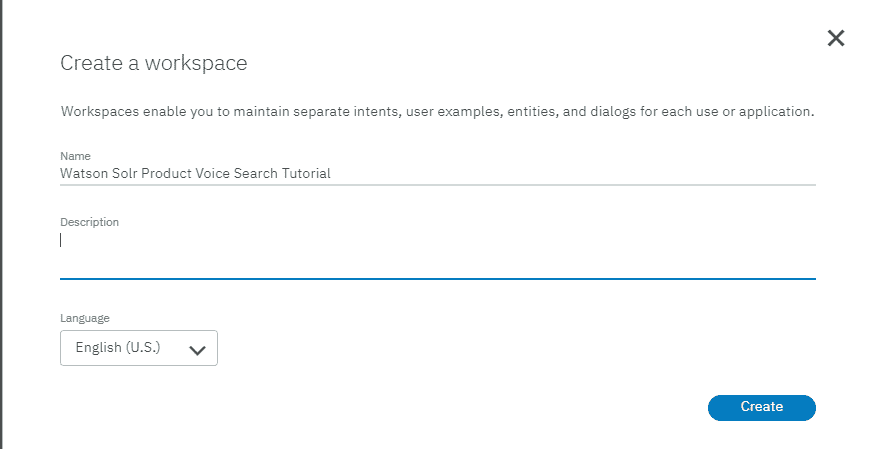

# IBM Watson Assistant 和 Apache Solr 助力以自然方式搜索电子商务产品

> 原文：[`developer.ibm.com/zh/tutorials/cc-solr-ecommerce-artificial-intelligence-watson-assistant/`](https://developer.ibm.com/zh/tutorials/cc-solr-ecommerce-artificial-intelligence-watson-assistant/)

聊天机器人服务代理将引领商业领域的下一次演变，因此将这些服务代理与已经很强大的高效搜索引擎结合起来很有意义。作为人类，我们会很自然而然地走进一家实体店，询问售货员是否有某一特定商品。但我们都见过并体验过各种形式的机器人 – 从玩游戏到开/关灯，再到客户支持，电子商务已经准备好迎接下一阶段，开启产品“搜索”模式。作为一家企业，您的产品目录无论是在商业平台加以管理和丰富、源自于 ERP 系统，还是使用产品信息管理 (PIM) 软件，它通常都以结构化数据形式呈现，旨在为您的客户提供一种更自然的与平台对话的方式。

在电商领域，搜索并深入到特定商品或产品集的方法之一就是使用*分面搜索*。这些分面搜索对当前搜索进行过滤，允许购物者通过尺寸、颜色或价格等选项缩小产品搜索范围。举个例子，假设您打算买衬衫。一般情况下，您会在选择条件中输入“shirts”。配置正确的搜索引擎会在搜索结果中显示产品线中的所有衬衫。但假设你有喜欢的特定尺寸和颜色。分面搜索通过选择颜色“blue”和尺寸“large”来过滤不符合条件的产品。此外，如果您的预算在 100 美元以下，购物者可以使用分面搜索进一步过滤产品，最终仅显示价格低于 100 美元的蓝色大码衬衫。然而，购物者也可使用语音命令，以更自然的方式完成这一操作。例如，客户可以直接说：“I’m looking for a size large blue shirt”。

本教程描述了如何配置 IBM Watson Assistant 和 Apache Solr 搜索引擎，以允许购物者通过语音命令搜索产品，并得到想要的搜索结果。IBM Watson Speech to Text 服务是采用自然语言语音搜索查询，并将其转换为搜索引擎可以理解的计算机文本格式的一项人工智能技术。同样，Watson Assistant 是一项与客户启动对话并进行交互的服务。这种交互以自然的对话方式进行。

本教程使用示例产品目录，重点介绍了 Apache Solr 的基本设置。它解释了如何运行 Solr 以及如何建立索引。然后，您将访问 IBM Cloud，开启 Watson Speech to Text 和 Watson Assistant 服务使用之旅。最后，您将看到 Watson 以及 Solr 如何与自定义 Java™ Spring Boot 应用协同工作。

构建语音产品搜索机器人所需内容：

*   一个 [IBM Cloud 帐户](https://cocl.us/IBM_CLOUD_GCG)（注册一个 IBM Cloud Lite 帐户，这个免费帐户永不过期）
*   访问服务器（本地或云），安装 Apache Solr
*   Apache Solr 7.3
*   Java 8 以及 Java IDE（如 Eclipse）
*   用于构建下载依赖关系的 Apache Maven

## Apache Solr

Apache Solr 是一个开源搜索平台，在 2010 年与 Apache Lucene 项目合并。许多企业都使用 Apache Solr 来实现全文检索等功能，包括电子商务应用。因为本教程重点讲述电子商务搜索，所以我将只关注接下来使用的功能：

*   索引 — 从源系统导出产品目录。
*   分面 — 可以进一步缩小搜索范围的特定过滤器。
*   查询 — 请求搜索引擎搜索文本。

具体来说，Solr 有一个类似 REST 的 HTTP/S API，可接受 `GET` 请求，并以 XML 或 JSON 格式返回结果。

不论使用哪种电子商务平台，如果您可以导出产品目录，就很有可能可以将 Apache Solr 与基于 Watson 的语音搜索平台结合使用 。您也可以选择学习本教程中的概念，然后将其应用到另一个支持 REST API 的搜索平台，一切随您意愿。如果您有使用 Solr 的经验，可以随意应用本教程中的技术，并由此深入展开。如果您是新手，通过使用本地机器或提供的服务，只需几步即可启用 Solr。但请注意，您无法在 IBM Cloud 上创建新的排名和检索 (Solr) 实例。请参阅 Retrieve and Rank [文档](https://cloud.ibm.com/docs) ，了解更多信息。

## 配置和启动 Solr

首先，安装 Apache Solr。以下说明介绍了如何安装基本组件，以便在您准备好将 Watson 机器人连接到 Apache Solr 之后，能有个基本的认识。Solr 自带一个预配置的示例集合，名为“techproducts”。为了简单起见，您将对这一集合稍作修改：

1.  从 Apache Foundation 网站下载 [Solr](http://lucene.apache.org/solr/downloads.html)。撰写本文之际，最新稳定版本为 [7.3](http://www.apache.org/dyn/closer.lua/lucene/solr/7.3.0)，因而我在本教程中也使用了该版本。
2.  将下载的文件解压到目录中，您可在主目录中自由选择目录位置。
3.  向 techproducts 核心添加两个字段。打开 Managed-schema 文件，文件位置为 <install_directory>\solr-7.3.0\example\techproducts\solr\techproducts\conf\ directory，然后添加两行新字段：</install_directory>

    ```
     <field name="color" type="string" indexed="true" stored="true" multiValued="true"/>
    <field name="size" type="string" indexed="true" stored="true" multiValued="true"/> 
    ```

4.  为避免因使用复数（如”shirts”）而导致搜索不到产品，在查询分析器节点块中添加 Snowball Porter Filter 作为最后一行：

    ```
     <analyzer type="query">
        <tokenizer class="solr.StandardTokenizerFactory"/>
        <filter class="solr.StopFilterFactory" ignoreCase="true" words="stopwords.txt" />
        <filter class="solr.SynonymGraphFilterFactory" synonyms="synonyms.txt" ignoreCase="true" expand="true"/>
        <filter class="solr.LowerCaseFilterFactory"/>
    <filter class="solr.SnowballPorterFilterFactory" language="English" />
      </analyzer> 
    ```

5.  启动 Solr 并导航到 <install_directory>\solr-7.3.0\bin 目录。利用命令 `solr.cmd –e techproducts` 或 `./solr.sh –e techproducts` 来启动 Solr，具体取决于您所处的环境。</install_directory>

    

6.  使用浏览器导航到安装 Solr 的起始位置。如果将本地机器用作为服务器，那么 URL 为 [`localhost:8983/solr。否则，URL`](http://localhost:8983/solr。否则，URL) 为 http://<your_solr_host>:8983/solr。无需在网页中查找任何特定内容。只需核实一下是否看到类似于下图的内容，确保启动并运行 Solr 实例。</your_solr_host>

    

## 建立新产品索引

由于 techproducts 示例中只有少量产品，因此可在可搜索的产品目录中添加一些衬衫：

1.  转至 <solr_install>\solr-7.3.0\example\exampledocs 目录。</solr_install>
2.  选择一个现有产品，如 monitor.xml，并在文本编辑器中打开。
3.  如下面的代码所示，将字段替换为您自己的字段，然后将文件重命名为 techshirt .xml 并保存。

    ```
     <add>

    <doc>
      <field name="id">12346</field>
      <field name="name">Watson Conversation Tech Shirt</field>
      <field name="manu">Watson Tutorial</field>
      <!-- Join -->
      <field name="manu_id_s">watsontutorial</field>
      <field name="cat">clothing</field>
      <field name="features">cotton, watson tutorial logo,v-neck, short sleeves</field>
      <field name="size">x-large</field>
      <field name="color">blue</field>
      <field name="price">21.99</field>
      <field name="popularity">1</field>
      <field name="inStock">true</field>
      <!-- Buffalo store -->
      <field name="store">43.17614,-90.57341</field>
    </doc>

    <doc>
      <field name="id">12347</field>
      <field name="name">Watson Conversation Tech Shirt</field>
      <field name="manu">Watson Tutorial</field>
      <!-- Join -->
      <field name="manu_id_s">watsontutorial</field>
      <field name="cat">clothing</field>
      <field name="features">cotton, watson tutorial logo,v-neck, short sleeves</field>
      <field name="size">x-large</field>
      <field name="color">green</field>
      <field name="price">21.99</field>
      <field name="popularity">1</field>
      <field name="inStock">true</field>
      <!-- Buffalo store -->
      <field name="store">43.17614,-90.57341</field>
    </doc>

    <doc>
      <field name="id">12348</field>
      <field name="name">Watson Conversation Tech Shirt</field>
      <field name="manu">Watson Tutorial</field>
      <!-- Join -->
      <field name="manu_id_s">watsontutorial</field>
      <field name="cat">clothing</field>
      <field name="features">cotton, watson tutorial logo,v-neck, short sleeves</field>
      <field name="size">x-large</field>
      <field name="color">red</field>
      <field name="price">21.99</field>
      <field name="popularity">1</field>
      <field name="inStock">true</field>
      <!-- Buffalo store -->
      <field name="store">43.17614,-90.57341</field>
    </doc>

    </add> 
    ```

4.  使用位于同一目录中的 Post.jar 文件，以进行添加并建立索引。Solr 具有 Post.jar 文件，允许从命令行建立索引。导航到 <solr_install>\solr-7.3.0\bin 目录，并执行以下命令。</solr_install>

    ```
    java -Dc=techproducts -jar post.jar techshirts.xml 
    ```

一旦看到类似下图的输出，即表明已正确地对您的新衬衫产品建立了索引。


您可以通过在浏览器中执行搜索来进行验证。 http://<your_solr_host>:8983/solr/techproducts/select?q=shirts.</your_solr_host>

以下的代码清单显示了 Solr API 的基本查询响应。

```
{
  "responseHeader":{
    "status":0,
    "QTime":14,
    "params":{
      "q":"shirts"}},
  "response":{"numFound":3,"start":0,"docs":[
      {
        "id":"12346",
        "name":"Watson Conversation Tech Shirt",
        "manu":"Watson Tutorial",
        "manu_id_s":"watsontutorial",
        "cat":["clothing"],
        "features":["cotton, watson tutorial logo,v-neck, short sleeves"],
        "size":["x-large"],
        "color":["blue"],
        "price":21.99,
        "price_c":"21.99,USD",
        "popularity":1,
        "inStock":true,
        "store":"43.17614,-90.57341",
        "_version_":1598495744803733504,
        "price_c____l_ns":2199},
      {
        "id":"12347",
        "name":"Watson Conversation Tech Shirt",
        "manu":"Watson Tutorial",
        "manu_id_s":"watsontutorial",
        "cat":["clothing"],
        "features":["cotton, watson tutorial logo,v-neck, short sleeves"],
        "size":["x-large"],
        "color":["green"],
        "price":21.99,
        "price_c":"21.99,USD",
        "popularity":1,
        "inStock":true,
        "store":"43.17614,-90.57341",
        "_version_":1598495744843579392,
        "price_c____l_ns":2199},
      {
        "id":"12348",
        "name":"Watson Conversation Tech Shirt",
        "manu":"Watson Tutorial",
        "manu_id_s":"watsontutorial",
        "cat":["clothing"],
        "features":["cotton, watson tutorial logo,v-neck, short sleeves"],
        "size":["x-large"],
        "color":["red"],
        "price":21.99,
        "price_c":"21.99,USD",
        "popularity":1,
        "inStock":true,
        "store":"43.17614,-90.57341",
        "_version_":1598495744846725120,
        "price_c____l_ns":2199}]
  }} 
```

Solr 允许您在特定字段中搜索值。通过使用介绍性示例“I’m looking for a size large blue shirt”，API 显示如下内容： http://<your_solr_host>:8983/solr/techproducts/select?q=shirt&fq=color:blue&fq=size:x-large</your_solr_host>

Solr API 过滤后的查询响应为：

```
{
  "responseHeader":{
    "status":0,
    "QTime":131,
    "params":{
      "q":"shirt",
      "fq":["color:blue",
        "size:x-large"]}},
  "response":{"numFound":1,"start":0,"docs":[
      {
        "id":"12346",
        "name":"Watson Conversation Tech Shirt",
        "manu":"Watson Tutorial",
        "manu_id_s":"watsontutorial",
        "cat":["clothing"],
        "features":["cotton, watson tutorial logo,v-neck, short sleeves"],
        "size":["large"],
        "color":["blue"],
        "price":21.99,
        "price_c":"21.99,USD",
        "popularity":1,
        "inStock":true,
        "store":"43.17614,-90.57341",
        "_version_":1598495744803733504,
        "price_c____l_ns":2199}]
  }} 
```

简单来说，您的 Solr 搜索引擎就是用户快速而准确获取搜索结果的关键。在进入本教程的应用部分时，您会注意到 Java 库 solrj 客户端与 Solr 之间的交互。然而，重要的是要理解 Solr 如何脱离 Java，成为独立的企业级搜索引擎。

既然您的 Solr 实例已在运行，下面我们将学习本教程的核心部分：借助作为语音产品搜索主干的 Speech to Text 服务，创建 IBM Watson Assistant 机器人。

## Watson Assistant 和 Speech to Text 设置

设置 Watson Assistant 和 Speech to Text 服务：

1.  创建一个 IBM Cloud 帐户。

    

2.  通过电子邮件来确认帐户。

    

3.  在确认帐户并登录之后，您将看到 IBM Cloud 提供的一个带有可用类别的仪表板。本教程的重点是 Watson 类别中的两项服务：Watson Assistant 和 Watson Speech to Text。选择 **Watson** 类别，然后再选择 **Watson Assistant**。

    

4.  选择 **Watson Assistant**。这样会出现一个包含多个表单字段的新窗口。填写以下值：

    *   Service Name：Watson Assistant for Product Voice Search
    *   Choose a region/location to deploy in：US South
    *   Choose an organization：<your_account_login_email></your_account_login_email>
    *   Choose a space：Dev

    

5.  添加 Speech to Text 服务。重新导航到类别页面。 在 Watson 类别部分，选择 **Speech to Text**。与前面的步骤类似，将出现一个带有多个表单字段的新窗口。填写以下值：

    *   Service Name：Watson Speech to Text for Product Voice Search
    *   Choose a region/location to deploy in：US South
    *   Choose an organization：<your_account_login_email></your_account_login_email>
    *   Choose a space：Dev

    

6.  记下 Speech to Text 凭证，因为您将在稍后创建的应用中用到这些凭证。在创建 Speech to Text 服务之后，您将看到凭证页面。单击 **Show** 以显示您的凭证，以便将这些凭证和 URL 复制并粘贴到临时位置。

    

## Watson Assistant 服务配置

既然基本的 Watson 服务已经添加到 IBM Cloud 帐户中，现在即可开始配置 Watson Assistant 来处理产品搜索请求。这是一个与用户交互的机器人。为了简明起见，您只需添加必要的意图、实体和对话，为本教程提供功能服务：

1.  在 Watson Services 下的左侧导航栏中，单击 **Existing services**，然后单击 **Launch tool** 启动 Watson Assistant 服务。

    

2.  启动工具后，您将看到 Watson Assistant 使用主页。工作空间是创建和配置机器人的项目基础，所以我们首先创建工作空间。单击 **Create a Workspace** 图标链接。

    

3.  在新窗口中，单击 **Create**。

    

4.  命名工作空间，输入 **Watson Solr Product Voice Search Tutorial** 作为工作空间的名称。然后单击 **Create**。

    

## 创建意图

现在，是时候添加意图了。意图指您的机器人将要读取的内容，它们遵循您稍后将设计的对话中的特定路径。您为本教程创建的意图作为基本框架，语音转文本产品搜索机器人正常工作离不开这些基本框架：

1.  单击左上方的 **Intents**。由于您还未创建任何意图，所以将会看到一个描述意图作用的通用页面。Watson 提供了许多即取即用的意图，可在目录中找到。但在本教程中，您将创建自定义意图。单击 **Add Intent**。

    

2.  创建 shirts 意图。这是本教程的主要意图，因为它将使用“shirt”或“shirts”一词来识别语音转文本搜索条件。添加以下用户示例：

    *   shirt
    *   shirts
    *   tech shirt
    *   t-shirt

    您的最终屏幕应该如下图所示。

    

3.  创建 search 意图。使用以下用户示例添加 search 意图：

    *   do you have
    *   find
    *   look for
    *   looking for
    *   search
    *   where is

    您的最终屏幕应该如下图所示。

    

4.  接下来，创建 search_result。当应用代码在 Solr 上执行搜索，并将结果返回给机器人时，Watson Assistant 机器人便会使用这一意图。创建一个用户示例：“I found”。您的最终屏幕应该如下图所示。

    

5.  创建 end_search 意图。尽管本教程的重点是与 Solr 交互，但我们还是要添加一个意图，让机器人知道购物者已经完成购物。添加以下用户示例：

    *   adios
    *   bye
    *   good bye
    *   thank you

    您的最终屏幕应该如下图所示。

    

## 添加实体

您将在此添加两个实体，这两个实体将与您在 Solr 部分中添加和建立索引的两个产品属性 （size 和 color）相一致。这样一来，机器人便能够识别这些实体，并将这些实体传递到应用，以在搜索 Solr 时用作搜索查询过滤器。操作如下：

1.  在 Watson 工作空间中，创建 **Entities**，如下图所示。由于目前不存在实体，您将看到一个描述实体用途的屏幕。单击 **Entities**，再单击 **Add Entity**。

    

2.  单击 **Add entity** 之后，将出现一个包含一些表单字段的窗口。提供实体的名称 **@color**，然后添加 blue、green 和 red 这三个值，最终的实体将如下图所示。

    

3.  与前面的步骤类似，单击 **Add entity**，在新窗口中提供实体名称 **@size**。然后，分别添加以下值：small、medium、large 和 x-large。您的最终实体屏幕应该如下图所示。

    

## 配置对话

工作空间中的最后步骤就是配置对话中的节点：

1.  在 Watson 工作空间中，单击 **Dialog**。由于目前不存在对话，您将看到一个描述对话用途的屏幕。单击 **Create**。

    

    您将看到 Watson 为您添加了两个节点。“Welcome”节点代表会话开始，而“Anything_else”则位于节点堆栈的底部，因为与任何其他节点条件不匹配的任何文本都会归入此节点。在这种情况下，Watson 的回复类似如下：“I didn’t understand you…”

    

2.  直接在 welcome 节点下创建一个 shirts 节点：

    *   Name：Shirts
    *   If bot recognizes：#shirts

    

3.  在新创建的 shirts 节点中，单击 **Customize**。这样会显示一个新窗口。切换以下值：

    *   Slots：on
    *   Prompt for everything：勾选
    *   Multiple response：on

    单击 **Apply**，然后关闭窗口。

    

4.  继续留在 shirts 节点中，通过单击 **Add slot** 添加两个插槽。

| Slot | Check for | Save it as | If not present, ask | Type |
| --- | --- | --- | --- | --- |
| 1 | @color | $color | Enter a prompt | Optional |
| 2 | @size | $size | Enter a prompt | Optional |


您刚才做了什么？当用户在查询中指定“shirts”时，如果在搜索条件中识别了一个或两个实体，那么插槽将执行一项操作。回想一下最初的介绍性例子：一个客户问“Do you have any blue shirts in large?”若 Watson Assistant 识别出“shirts”，并对 #shirts 节点执行操作，则插槽将能够识别 color: blue 和 size: large。现在，您进行 Solr 查询。初级过滤器：shirts；属性：size: x-large 和 color: blue。

1.  为搜索查询添加 catch-all 节点（这不会与演示应用链接在一起，但可以此为基础来拓展本教程）：

    *   Name：Search
    *   If bot recognizes：#search
    *   Then Respond with：Let me look for that…

    

2.  添加 search_result 节点。当演示应用将搜索结果返回至 Watson Assistant 时，则执行 search_result 节点。“I found”是应用将发送至 Watson 的关键词。

    *   Name：Search Result
    *   If bot recognizes：#search_result
    *   Then respond with：<?input_text?> .Would you like more information?

    

    `<?Input_text?>` 是什么？您在包含输入的响应中看到的 `<?input_text?>` 是 Watson 从用户输入中读取到的文本的变量。 在此情况下，这是返回搜索结果的演示应用。例如，I found two large blue shirts.Would you like more information?

3.  添加 end 节点。为展示机器人的礼貌举止，添加 end 节点，感谢客户来访。这一节点应位于您的对话中 anything_else 节点的上方。

    *   Name：end
    *   If bot recognizes：#end_search
    *   Then respond with：Thank you for searching our product line.Hopefully I was helpful to you!

    

## Watson Speech to Text

Watson Speech to Text 服务无需特殊配置。很显然，该服务名称描述了其功能。它将输入音频，并将其转换为文本格式。我们旨在获取购物者的语音搜索查询，将其转换为文本，并将转换后的文本发送给 Watson Assistant，从而与聊天机器人进行交互。在演示应用中，已创建了一个音频文件，以此作为购物者的搜索请求。应用的 resource/audio 目录中有一个 sample.wav 文件。播放该文件，就会听到“I’m looking for a large sized blue shirt”。

## 全盘整合

随着 Watson Assistant 机器人实例的运行，您可随时运行一个可与 Watson 以及 Solr 交互的演示应用。该应用采用 Java 编程和 Spring Boot 开发，并以 Apache Maven 作为构建工具。IBM 具有用于 Spring Boot 的 Maven 依赖项 (watson-spring-boot-starter)，以便快速将 Watson 功能添加到 Spring Boot 应用中。使用您选择的 IDE。以下是本教程应用的简单 pom.xml 文件。

```
<!--     Core Spring Boot Dependencies  -->
        <dependency>
            <groupId>org.springframework.boot</groupId>
            <artifactId>spring-boot-starter</artifactId>
        </dependency>
<!--     This will include the Watson Speech to Text & Conversation SDK  -->
<dependency>
  <groupId>com.ibm.watson.developer_cloud</groupId>
  <artifactId>watson-spring-boot-starter</artifactId>
  <version>0.1.0</version>
</dependency>

<!--     This is the Apache SOLR SDK   -->
<dependency>
    <groupId>org.apache.solr</groupId>
    <artifactId>solr-solrj</artifactId>
    <version>7.3.0</version>
</dependency> 
```

### application.properties

application.properties 文件便于存储应用中使用的值，这些值可能会随环境而变化。这是存储 Watson 凭证和 API URL 等值的理想位置。

```
watson.speech-to-text.url=https://api.us-south.speech-to-text.watson.cloud.ibm.com
watson.speech-to-text.username=<your_watson_speech-text-username>
watson.speech-to-text.password=<your_watson_speech-text-password>
watson.conversation.url=https://api.us-south.assistant.watson.cloud.ibm.com
watson.conversation.username=<your_watson_assistant_username>
watson.conversation.password=<your_watson_assistant_password>
watson.conversation.version-date=2018-02-16
watson.workspaceId=<your_workspace_id>
solr.url=http://<your_solr_host>:8983/solr/techproducts
solr.result.message=I found 
```

### Watson 服务

Watson 服务是用于 Watson Speech to Text 和 Watson Assistant 服务的业务服务。如前所述，这些服务包括在 Watson-spring-boot-starter 依赖项中，因此这些服务自动连接到该服务以访问 SDK 功能。

```
@Autowired
protected SpeechToText service;
@Autowired
protected Conversation converseService; 
```

完整的 WatsonService.java 文件应如下所示：

```
package com.example.watson.service;

import java.io.File;
import java.util.ArrayList;
import java.util.HashMap;
import java.util.List;
import java.util.Map;

import org.slf4j.Logger;
import org.slf4j.LoggerFactory;
import org.springframework.beans.factory.annotation.Autowired;
import org.springframework.beans.factory.annotation.Value;
import org.springframework.stereotype.Service;

import com.ibm.watson.developer_cloud.conversation.v1.Conversation;
import com.ibm.watson.developer_cloud.conversation.v1.model.InputData;
import com.ibm.watson.developer_cloud.conversation.v1.model.MessageOptions;
import com.ibm.watson.developer_cloud.conversation.v1.model.MessageResponse;
import com.ibm.watson.developer_cloud.speech_to_text.v1.SpeechToText;
import com.ibm.watson.developer_cloud.speech_to_text.v1.model.SpeechResults;

@Service
public class WatsonService {

private final Logger LOG = LoggerFactory.getLogger(WatsonService.class);
@Value("${watson.workspaceId}")
private String workspaceId ;

  @Autowired
  protected SpeechToText service;
  @Autowired
  protected Conversation converseService;

  public  String convertToText() {
    File audio = new File("src/main/resources/audio/sample.wav");
    SpeechResults results = service.recognize(audio).execute();
  String transcript =  results.getResults().get(0).getAlternatives().get(0).getTranscript();
   LOG.info(transcript);

    return      transcript;
     }

  public Map<String, List<String>> converse(String text) {

  InputData inData = new InputData.Builder(text).build();
  MessageOptions options = new MessageOptions.Builder(workspaceId).input(inData).build();

  MessageResponse response = converseService.message(options).execute();

Map<String, List<String>> map = new HashMap<String, List<String>>();
String mainProduct = response.getIntents().get(0).getIntent() ;
LOG.info("response is "+ response);
ArrayList<String> mainTerms = new ArrayList<String>();
mainTerms.add(mainProduct);
map.put("mainTerms", mainTerms);
ArrayList<String> fields = new ArrayList<String>();
response.getEntities().forEach((temp) -> {
String entity = temp.getEntity();
LOG.info("Entity is " + entity);
String value = temp.getValue();
LOG.info("Value is " + value);
fields.add(entity + ":"+ value);
});
map.put("fields", fields);
return map ;
  }

} 
```

### Solr 服务

Solr 服务将 SolrJ 客户端库用于 Solr。SolrJ 是 Apache Solr 项目的一部分。同样，此 SDK 的版本应与 Solr 服务器相同，即为 7.3。

SolrService 使用 @service 注释，并且只有一种方法：`search`。这一方法返回一个搜索结果格式的字符串，用来与 Watson Assistant 对话通信。

SolrService.java 应如下所示：

```
package com.example.watson.service;

import java.io.IOException;
import java.util.List;
import java.util.Map;

import org.apache.solr.client.solrj.SolrQuery;
import org.apache.solr.client.solrj.SolrServerException;
import org.apache.solr.client.solrj.impl.HttpSolrClient;
import org.apache.solr.client.solrj.impl.XMLResponseParser;
import org.apache.solr.client.solrj.response.QueryResponse;
import org.apache.solr.common.SolrDocument;
import org.apache.solr.common.SolrDocumentList;
import org.slf4j.Logger;
import org.slf4j.LoggerFactory;
import org.springframework.beans.factory.annotation.Value;
import org.springframework.stereotype.Service;

@Service
public class SolrService {

    private final Logger LOG = LoggerFactory.getLogger(SolrService.class);

    @Value("${solr.result.message}")
    private String message ;
    @Value("${solr.url}")
    private String urlString;
    public String search(Map<String, List<String>> searchQuery) {

        HttpSolrClient solr = new HttpSolrClient.Builder(urlString).build();
        solr.setParser(new XMLResponseParser());

        SolrQuery query = new SolrQuery();

        List<String> mainTerms = searchQuery.get("mainTerms");

        mainTerms.forEach((term) -> {
            query.set("q", term);
        });

        List<String> fields = searchQuery.get("fields");
        fields.forEach((field) -> {
            query.set("fq", field);
        });

        QueryResponse response = null;
        try {
            response = solr.query(query);
        } catch (SolrServerException e) {
            LOG.error(e.getMessage());

        } catch (IOException e) {
            // TODO Auto-generated catch block
            LOG.error(e.getMessage());
        }

        SolrDocumentList docList = response.getResults();
        String numReturned = String.valueOf(docList.getNumFound());

        LOG.info("Number returned results : " + numReturned);
        for (SolrDocument doc : docList) {

            doc.getFieldNames();
        }

        return message +" " + numReturned;
    }

} 
```

## 运行应用

为运行应用，请使用 Maven 工具来构建。在 pom.xml 所在的项目根目录中，执行命令 `mvn clean all`。在目标目录中创建 JAR 文件。 可使用以下命令执行 JAR 文件：

```
java –jar  Watson_SOLR_Product_Search_Tutorial-0.0.1-SNAPSHOT.jar 
```

应用会打印出日志记录信息，这样您就可以了解发生的情况。运行应用时，可查看日志文件的输出显示。以下的日志片段源自应用与 Watson 的对话。该输出内容类似于您所看到的内容。

```
"input": {
    "text": "I am looking for a large sized blue shirt "
  },
  "intents": [
    {
      "intent": "shirt",
      "confidence": 0.8590080738067627
    }
  ],
  "entities": [
    {
      "entity": "size",
      "location": [
        19.0,
        24.0
      ],
      "value": "large",
      "confidence": 1.0,
      "expected": true
    },
    {
      "entity": "color",
      "location": [
        31.0,
        35.0
      ],
      "value": "blue",
      "confidence": 1.0,
      "expected": true
    }
  ],
  "context": {
    "conversation_id": "912340de-2ba4-40fd-946b-f7793e539ddd",
    "system": {
      "dialog_stack": [
        {
          "dialog_node": "node_1_1524536953617"
        }
      ],
      "dialog_turn_counter": 1.0,
      "dialog_request_counter": 1.0,
      "_node_output_map": {
        "node_1_1524536953617": [
          0.0,
          0.0
        ]
      }
    },
    "color": "blue",
    "size": "large",
    "verified": "false",
    "numReturned": "0",
    "skip_user_input": true
  },
  "actions": [
    {
      "name": "solrService.search()",
      "type": "client",
      "parameters": {},
      "result_variable": "context.numReturned"
    }
  ]
}

.....................................

"output": {
    "text": [
      "I found 1 .Would you like more information ?"
    ],
    "nodes_visited": [
      "node_1_1524624659514"
    ],
    "log_messages": []
  },
  "input": {
    "text": "I found 1"
  },
  "intents": [
    {
      "intent": "search_result",
      "confidence": 0.8809070110321044
    }
  ], 
```

## 后续行动

您已经学习了如何为电子商务平台配置和设置产品搜索，以便使用 Watson Assistant 和 Solr 搜索产品。随着深入了解客户如何以其自然语言搜索产品，您可以丰富自己的功能，并对 Watson 意图进行调整。例如，通过后续行动，当购物者询问：“Do you have a blue tech shirt for under $20?”时，Watson 可以回复“Yes, we do. Here’s the information.Would you like to purchase now?”

准备进行深入研究？访问开发人员 Code Pattern 并学习如何融会贯通。通过学习如何[构建一个可配置、适合零售的聊天机器人](https://developer.ibm.com/patterns/create-cognitive-retail-chatbot/)，进一步提升技能。您也可以访问 IBM Bot Asset Exchange（一个社区驱动的聊天机器人开发中心），了解其他人创建的机器人，并以它们为基础创建您自己的聊天机器人。

本文翻译自：Naturalize your e-commerce product search with IBM Watson Assistant and Apache Solr（2018-06-25）