# 开始使用适用于 IBM PureApplication 的 IBM Cloud Private 模式

> 原文：[`developer.ibm.com/zh/tutorials/cl-ibm-cloud-private-pattern-for-ibm-pureapplication/`](https://developer.ibm.com/zh/tutorials/cl-ibm-cloud-private-pattern-for-ibm-pureapplication/)

[IBM Cloud Private (ICP)](https://www.ibm.com/cloud/private) 是一个应用程序平台，用于开发和管理企业内部的容器化应用程序。可以在公有云提供商的企业外部设备上部署该平台，或在客户数据中心内的企业内部设备上部署它。它是一个用于管理容器的集成环境，包括 Kubernetes 容器编排器、私有镜像存储库、管理控制台和监视框架。

本教程中介绍的 IBM Cloud Private 模式是一个 PureApplication System 模式，用于将 IBM Cloud Private 应用程序部署到适用于 Community Edition (CE) 或 Enterprise Edition (EE) 的不同拓扑结构中。该模式为在 PureApplication System 上安装和管理 IBM Cloud Private 应用程序提供了一种快速、可靠、可复制的方法。此模式使您能够以快速、可靠、可复制的方式安装 IBM Cloud Private，而且您可以直接从 Docker Hub 安装该产品（CE 或 EE）的不同版本，或者在没有互联网连接的情况下也能完成安装。

本教程将展示如何使用 IBM Cloud Private 模式在 PureApplication 环境中安装 IBM Cloud Private CE 或 EE。文中会介绍安装该模式的必要步骤，描述模式模板部署的 IBM Cloud Private 拓扑结构，以及部署后可以执行的管理操作。

## 在 IBM PureApplication 上部署 IBM Cloud Private 需要做的准备工作

IBM Cloud Private 模式在 Intel 和 Power IBM PureApplication 环境中都受到支持：

1.  PureApplication System W1500 V2.2.3 或更高版本
2.  PureApplication System W2500 V2.2.3 或更高版本
3.  PureApplication Platform W3500 V2.2.3 或更高版本
4.  PureApplication Platform W3550 V2.2.3 或更高版本
5.  PureApplication Software V2.2.3 或更高版本（仅支持 Intel）
6.  PureApplication Service on SoftLayer V2.2.3 或更高版本
7.  PureApplication System W3700 V2.2.3 或更高版本

**备注：**使用基于 Power 的 IBM PureApplication System W3700 环境时，客户必须提供自己的 Linux Power PC 64 Little Endian 虚拟镜像。

可从 IBM Fix Central 将模式作为一种 IBM PureApplication 紧急修复提供给 Intel 和 Power 环境。

1.  [IBM Cloud Private Pattern Type V1.0.0.2 用于安装 IBM Cloud Private V2.1.0.2 for Linux 64-bit, x86_64](https://ibm.co/2sozzJi)
2.  [IBM Cloud Private Pattern Type V1.0.0.2 用于安装 IBM Cloud Private V2.1.0.2 for Power PC 64 Little Endian](https://ibm.co/2LPIagf)

下载该模式后，按照 IBMCloudPrivatePattern_QSG.pdf 中的说明将其安装到 PureApplication 环境中。在执行本教程中介绍的步骤之前，您需要在 PureApplication 环境中安装相关模式。

Intel 和 Power 模式类型都依赖于 Docker Pattern Type V1.0.6.0。此模式类型包含在 Intel 上的 PureApplication 2.2.5 中。该模式在 PureApplication 2.2.3 和 2.2.4 Intel 环境中也受到支持，但必须下载或安装 Docker Pattern Type V1.0.6.0 或更高版本。此模式类型是 [IBM Fix Central 上的“Group_Content_PureApplicationSystem_2.2.5.0_Intel”的一部分](https://ibm.co/2smOjIV)。

**备注：**在基于 Power 的 IBM PureApplication System W3700 环境中，必须从 [IBM Fix Central 上的相关位置](https://ibm.co/2kF8eyv)下载并安装 Docker Pattern Type V1.0.6.0。（它不是“Group_Content_PureApplicationSystem_2.2.5.0_Power”的一部分。）

除了 IBM Cloud Private Pattern 及其依赖项之外，在使用基于 Intel 的 PureApplication 环境时，还需确保提供以下组件：

*   作为虚拟镜像安装的 Red Hat Enterprise Linux 7.x 虚拟镜像：IBM OS Image for Linux for Red Hat Linux Systems V3.0.8.0（包含在 IBM PureApplication 2.2.4 中）或 V3.0.9.0（包含在 IBM PureApplication 2.2.5 中）。
*   如果使用更低的 IBM OS Image for Linux for Red Hat Linux Systems 版本，还需要一个全面配置、正常工作的 Red Hat Satellite Server 6.0 集成。这对下载和安装 IBM Cloud Private 所需的 OS 包来说是必要条件。因此，您需要部署共享服务“Red Hat Satellite Six Service (External)”。可以将此服务设置为与现有 Red Hat Satellite Server 6.0 服务器相集成，或者与一个已部署的“Red Hat Satellite Server Version 6.2”虚拟系统模式实例相集成。

**备注：**IBM PureApplication Software 客户必需提供自己的 Red Hat Enterprise Linux 7.x 虚拟镜像。

## 选择 IBM Cloud Private Pattern 模板

IBM Cloud Private 模式类型包含一组可用于部署 ICP 集群的虚拟系统模式。这些虚拟系统模式实际上是一组模板，可以在 PureApplication 用户界面中的 **Patterns > Virtual System Patterns** 下找到它们。通过简单地输入“IBM Cloud Private”作为过滤条件，可以仅显示 IBM Cloud Private 虚拟系统模式。

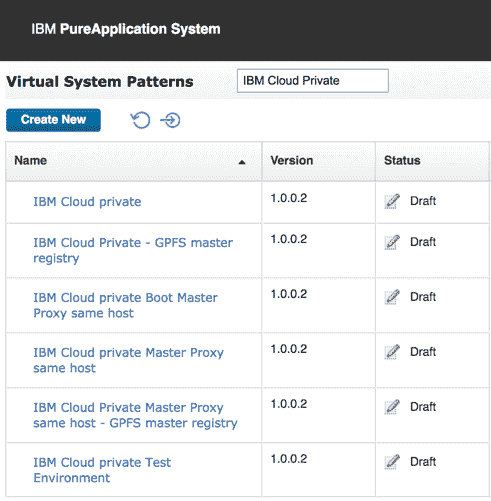

这些 *模板* 虚拟系统模式允许您部署许多不同的 IBM Cloud Private 拓扑结构。要进一步了解 IBM Cloud Private 的架构，请参阅 [IBM Cloud Private 知识中心](https://www.ibm.com/support/knowledgecenter/en/SSBS6K_2.1.0.2/getting_started/architecture.html)。

1.  **IBM Cloud Private** — 在不同的主机上部署引导节点、主节点、代理节点、管理节点和工作者节点。可以选择部署 1、3 或 5 个主控主机和代理主机，最多可部署 3 个管理主机，此外，最多可部署 10 个 工作者主机。
2.  **IBM Cloud Private Boot Master Proxy same host** — 在相同主机上部署引导节点、管理节点、主节点和代理节点，在不同的主机上部署工作者节点。最多可以选择部署 10 个工作者主机，但仅能为引导节点、主节点和代理节点选择一个主机。
3.  **IBM Cloud Private Master Proxy same host** — 在一个主机上部署引导节点，在相同主机上部署主节点和代理节点，在不同的主机上部署工作者节点和管理节点。可以选择部署 1、3 或 5 个主控主机和代理主机，最多可部署 3 个管理主机，此外，最多可部署 10 个 工作者主机。只有一个引导主机。
4.  **IBM Cloud Private Test Environment** — 在相同主机上部署所有节点（引导节点、管理节点、主节点、代理节点和工作者节点）。
5.  **IBM Cloud Private – GPFS master registry** — 提供了与 IBM Cloud Private 模板相同的部署配置，并添加了 IBM General Parallel File System (GPFS) 共享文件系统支持。IBM GPFS 目前被称为 IBM Spectrum Scale。GPFS 共享文件系统在这里被用作 /var/lib/registry 和 /var/lib/icp/audit（用于私有镜像注册表）的主节点和代理节点之间的共享存储器。
6.  **IBM Cloud Private Master Proxy same host – GPFS master registry** — 提供了与 IBM Cloud Private Master Proxy same host 模板相同的部署配置，并添加了 /var/lib/registry 和 /var/lib/icp/audit（用于私有镜像注册表）的主节点中的 GPFS 共享文件系统支持。

对于上面的模板 5 和模板 6，必须在与此部署相同的环境配置文件中部署一个 GPFS Shared Service 实例。确保您在 GPFS Client Policy Master 节点上指定的文件系统名称与 GPFS Shared Service 指向的 GPFS Server 实例上的可用文件系统名称相匹配，而且文件系统大小至少为 60GB。

**备注：**GPFS 目前未用于为 IBM Cloud Private 提供高度可用的持久存储提供程序。

除了 IBM Cloud Private Test Environment 之外，所有虚拟系统模式都支持在部署后添加或删除 ICP 工作者节点、代理节点或管理节点。这是通过 Virtual System Instance 控制台中的手动扩展操作来完成的。表 1 概述了 ICP 节点的类型、支持的数量，以及能否在部署后对它们进行扩展。

##### ICP 节点

|  | 支持的节点数 | 可以在部署后添加/删除节点 | 备注 |
| --- | --- | --- | --- |
| **HA 引导节点** | 1 | 不适用 | — |
| **主节点** | 1、3、5（必须为奇数） | 否 | 在部署多个主节点时必须设置“Virtual IP for Cluster Master HA”模式参数 |
| **管理节点** | 1 个或多个 | 是 | — |
| **代理节点** | 1 个或多个 | 是 | 在部署多个主节点时必须设置“Virtual IP for Proxy Master HA”模式参数 |
| **工作者节点** | 1 个或多个 | 是 | — |

**备注：**IBM Cloud Private（和 Kubernetes）仅支持奇数个主节点。这样做是为了确保达到规定数量。要获得更多细节，请参阅 IBM Cloud Private 知识中心内的[高可用性 IBM Cloud Private 集群](https://www-03preprod.ibm.com/support/knowledgecenter/SSBS6K_2.1.0.2/installing/high_availability.html)。

**备注：**IBM Cloud Private 支持一个或多个代理节点，但目前的 ICP 模式有一个限制：它在部署时仅支持奇数个代理节点；可以在以后添加或删除代理节点。

在本教程中，我们将使用 *IBM Cloud Private* 虚拟系统模式模板来演示如何自动部署更复杂的 ICP 拓扑结构，如下图所示。

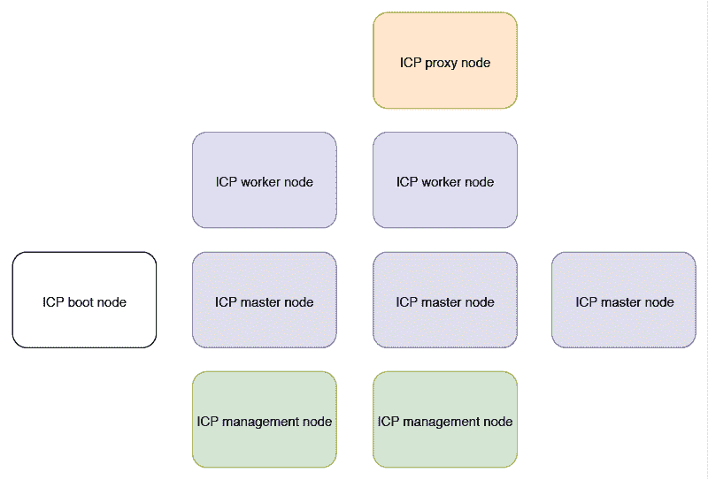

## 部署 IBM Cloud Private 虚拟系统模式

选择 **Patterns > Virtual System Patterns**，并选择 IBM Cloud Private Virtual System Pattern，然后单击 **Deploy** 图标来启动新的部署。

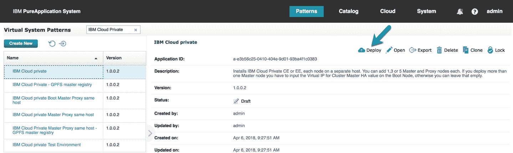

### 模式属性

对于新部署，将显示以下模式属性：

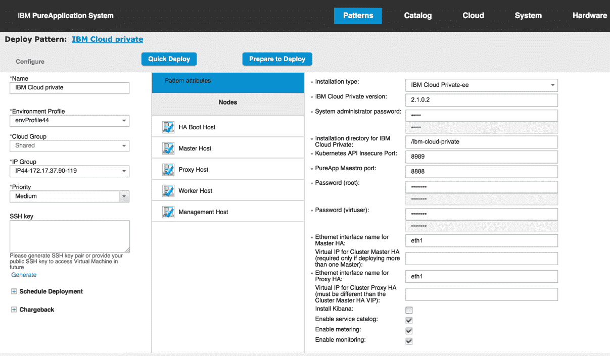

所有必要值均已设置，所以您总是可以直接部署，而无需进行任何更改。但在本例中，我们将做一些更改。

#### 安装类型

这是该部署使用的 IBM Cloud Private 二进制文件的类型 —“IBM Cloud Private-ee”适用于 Enterprise Edition (EE)，“IBM Cloud Private-ce”适用于 Community Edition (CE)。

CE 二进制文件在 IBM Fix Central 上与 IBM Cloud Private 模式打包在一起。您还可以导入其他 ICP CE 或 EE 二进制文件，并将它们与该模式一起使用。请参阅 IBMCloudPrivatePattern_QSG.pdf 中的 IBM Cloud Private 模式文档，了解如何将这些二进制文件上传到您的部署将要使用的 Storehouse 中。

如果您部署在 PureApplication 环境中的 VM 能够访问互联网，那么您可以跳过将 CE 二进制文件上传到 Storehouse 的步骤。必须将 Installation type 设置为“IBM Cloud Private-ce”，并指定从 Docker Hub 下载的 IBM Cloud Private Community Edition 版本。在部署时，该模式首先会尝试从 Storehouse 获取二进制文件，但是，如果没有从该处找到二进制文件，它会从 Docker Hub 下载它们。

请记住，如果想要部署多个主控主机和/或代理主机：

1.  您需要使用 ICP EE 二进制文件。部署多个主节点或代理节点被视为一种 HA 配置，仅可用于 EE 版本。
2.  如果部署了多个主节点，则必须设置 Virtual IP for Cluster Master HA 属性。类似地，仅在选择多个代理节点时才应该设置此属性。
3.  主集群或代理集群的虚拟 IP 必须是其他部署未使用的 IP。还必须能够在指定的以太网接口上访问将要使用它的部署。使虚拟 IP 可用的一种快捷方式是，部署一个虚拟的 Base OS 虚拟系统，停止它，然后使用这个实例 IP 作为 IBM Cloud Private HA 部署的虚拟 IP。

#### IBM Cloud Private 版本

这是上传到 Storehouse 的二进制文件的版本。如果已将其他 ICP 二进制文件上传到 Storehouse，可以在这里设置不同的版本。您可能已将多组 ICP 二进制文件上传到 Storehouse；它们可以是 CE 和 EE 的组合，也可以是不同版本级别的组合。每个部署都将根据所选的 Installation type 和 IBM Cloud Private version 属性来挑选正确的版本。例如，可以使用 IBM Cloud Private Test Environment 模板来部署 ICP 2.1.0.1 CE 实例，使用 IBM Cloud Private 模板来部署 ICP 2.1.0.2 EE 实例。

#### System administrator password（系统管理员密码）

这是 IBM Cloud Private 控制台管理用户的密码。默认值为“admin”，但强烈建议在部署时更改它。

**备注：**管理用户的用户名和密码都可以在部署后进行更改。要获得详细的说明，请参阅 IBM Cloud Private 知识中心内的[更改集群管理员访问凭证](https://www.ibm.com/support/knowledgecenter/en/SSBS6K_2.1.0.2/user_management/change_admin_passwd.html)。

#### IBM Cloud Private 的安装目录

IBM Cloud Private 的默认安装目录是 /ibm-cloud-private。

#### Kubernetes API Insecure Port（Kubernetes API 不安全端口）

这是 Kubernetes 使用的端口。默认值为 8888，但此值与 PureApplication 的 maestro 代理冲突，该代理在所有 VM 上运行并使用同样的端口。因此，对于 IBM Cloud Private 模式，此端口的默认值为 8989。

#### PureApplication Maestro 端口

这是 PureApplication 内部入口应用程序使用的端口。仅在 PureApplication 更改为使用不同端口时，才应更新它。默认端口为 8888。

#### IBM Cloud Private HA 属性

除“IBM Cloud Private Test Environment”之外，所有虚拟系统模式中都有一个 HA 引导主机。由于 ICP 引导节点不一定具备高可用性，而且只有一个 ICP 引导节点，所以这个 VM 的名称可能会令人混淆。

当使用多个主节点和/或代理节点来部署 ICP 时，或者当您打算在部署后扩展到多个代理节点时，必须在部署时指定额外的模式参数：

*   Ethernet interface name for master Ha（主 HA 节点的以太网接口名称）
*   Virtual IP for cluster master Ha（集群主 HA 节点的虚拟 IP）
*   Ethernet interface name for proxy Ha（代理 HA 节点的以太网接口名称）
*   Virtual IP for proxy master Ha（代理主 HA 节点的虚拟 IP）

提供这些模式参数时，会自动分配虚拟 IP 地址来处理多个 ICP 主节点和代理节点。在幕后，虚拟 IP 管理器会将 Virtual IP for Cluster Master HA 分配给活动的 ICP 主节点的网络接口（通过“Ethernet interface name for Master HA”指定）。如果 ICP 主节点暂时不可用，虚拟 IP 管理器会将该虚拟 IP 地址重新分配给其余 ICP 主节点之一。因此，如果您选择部署多个 ICP 主节点，那么 Virtual IP for Cluster Master HA 也将用于访问 IBM Cloud Private 控制台。

这里描述的机制也适用于 Virtual IP for Proxy Master HA。要获得更多细节，请参阅 IBM Cloud Private 知识中心内的[高可用性 IBM Cloud Private 集群](https://www.ibm.com/support/knowledgecenter/SSBS6K_2.1.0.2/installing/high_availability.html)。

**备注：**在使用 Virtual IP for Cluster Master HA 或 Virtual IP for Proxy Master HA 模式参数时，请确保这些 IP 地址是唯一的、可用的，并且可从相应的网络接口（即 eth1）进行访问。实现此目标的一种机制是部署一个虚假的 Base OS 虚拟系统实例，停止它，然后使用此实例的 VM 的 IP 地址作为 ICP 模式部署的虚拟 IP。

### 节点的部署选项

正如您在上面的拓扑结构图中所看到的，本教程为各种 ICP 节点使用了以下部署选项。始终只有一个 HA 引导节点。

*   3 个主节点
*   2 个工作者节点
*   2 个代理节点
*   2 个管理节点

**备注：**除主节点外，所有类型的节点在部署后仍可以进行扩展。因此，添加一个额外的工作者节点来处理 ICP 集群内的更多部署不是问题。我们稍后会演示此操作。

按照以下步骤为 ICP 节点配置部署选项：

1.  配置要部署的所有 3 个主节点，如下所示。如果想在部署后动态缩放主节点，请确保启用了基于 CPU 的缩放和/或基于内存的缩放。

    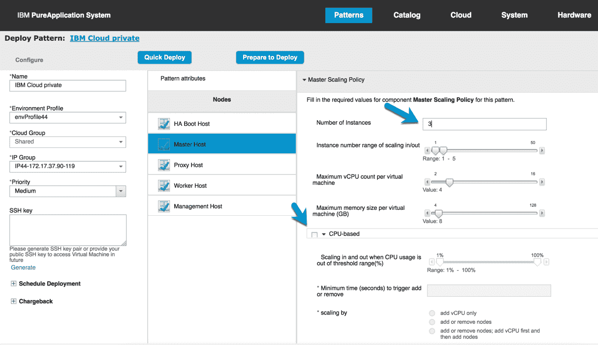

2.  配置为部署单个代理节点；如果您希望支持动态缩放代理节点，也需要启用基于 CPU 的缩放或基于内存的缩放。

    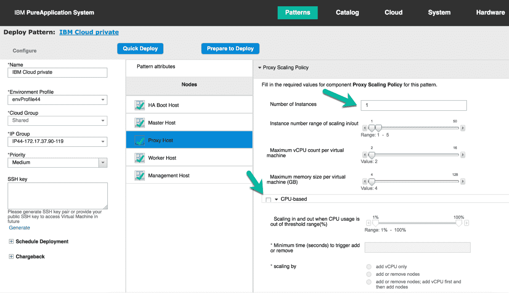

3.  类似地，通过配置工作者主机的部署选项，将 ICP 工作者的数量设置为 2。
4.  最后，通过配置管理主机的部署选项，将 ICP 管理节点的数量设置为 2。
5.  完成对部署选项的必要更改后，单击 **Quick Deploy** 来启动部署。

完成部署后，检查 IBM Cloud Private 虚拟系统实例。它应该包含 1 个引导节点，3 个主节点，1 个代理节点，2 个管理节点和 2 个工作者节点。当然，还有 1 个单独的 ICP 引导节点。

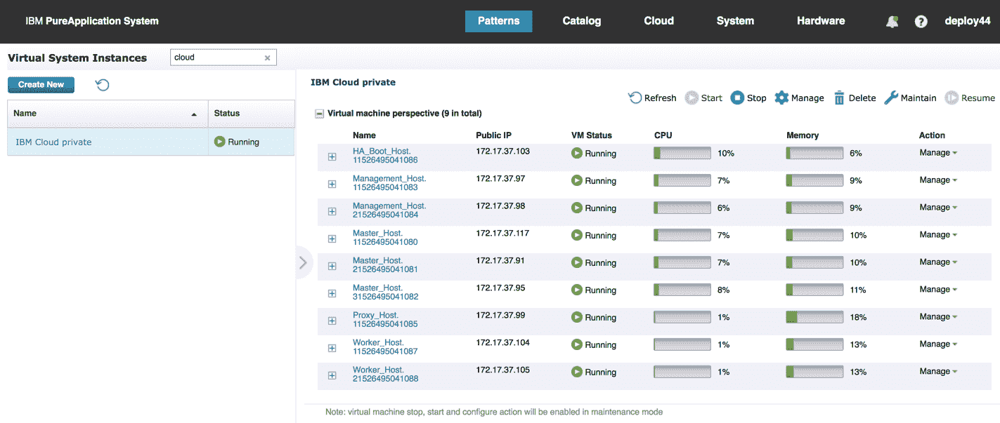

## 访问 IBM Cloud Private 控制台

部署虚拟系统实例后，就可以访问 IBM Cloud Private 控制台。

1.  在 ICP 虚拟系统实例的 Virtual Machines 透视图下，展开 ICP HA Boot Host 虚拟机。

    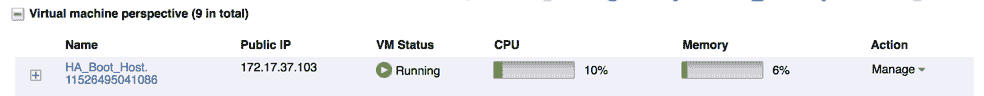

2.  在这部分的底部，单击 **IBM Cloud Private Console** 链接。

    

3.  这会将您带到 [`172.17.37.102:8443/console。（请注意，该`](https://172.17.37.102:8443/console。（请注意，该) IP 地址与我们在部署时指定的 Virtual IP for Cluster Master HA 相匹配；在我们的例子中，该地址为 172.17.37.102。）

    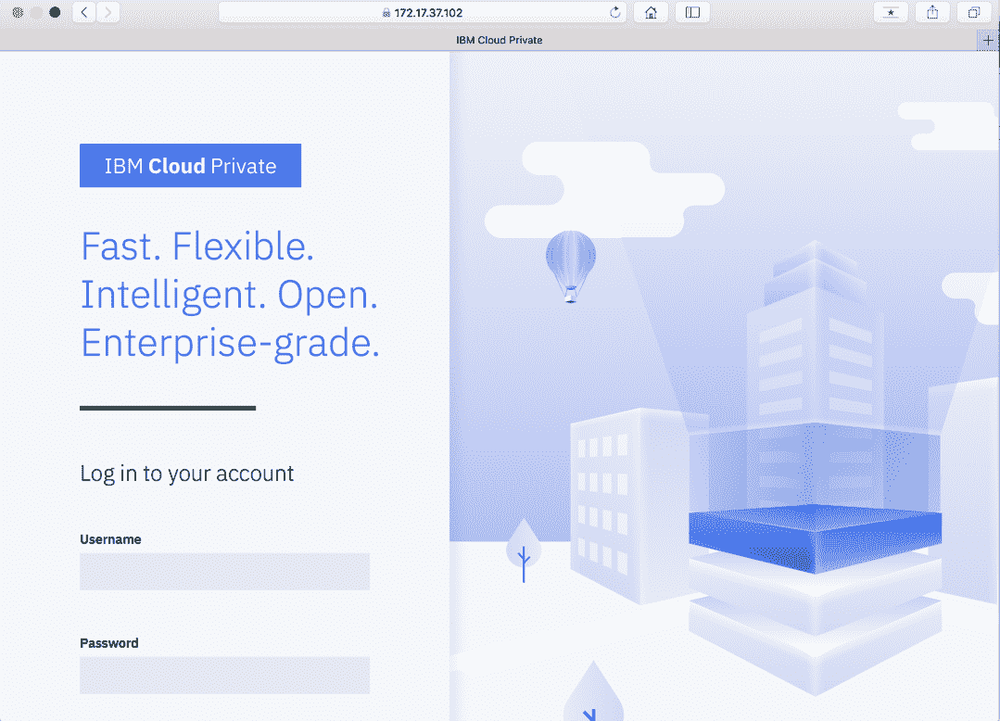

4.  登录到 ICP 控制台，并单击 **Platform > Nodes** 来查看 ICP 工作者节点。此节点应该与您部署的拓扑结构相匹配。

    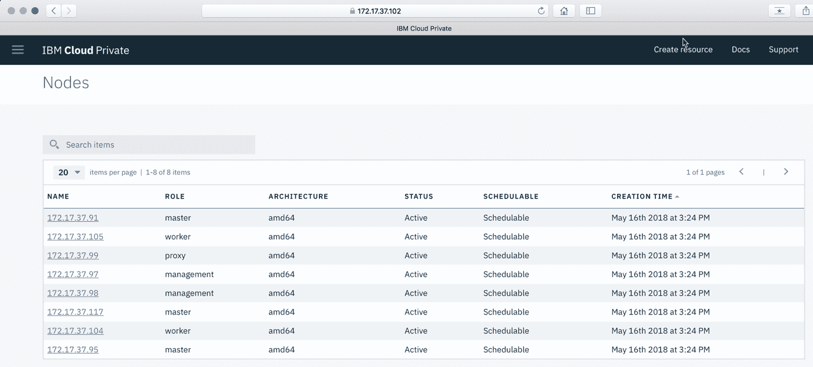

## 管理已部署的 IBM Cloud Private 虚拟系统实例

可以使用 IBM Cloud Private 虚拟系统实例控制台来添加或删除 ICP 工作者、代理或管理节点，扩展该部署所用的磁盘大小，或者查看 IBM Cloud Private 集群状态。还可以使用实例控制台来访问日志文件，以排除部署错误。

### 添加或删除 ICP 工作者节点

如前所述，可以指定最初部署的 ICP 工作者节点的数量。部署之后，可以添加（扩展）或删除（精减）这些节点。

1.  从实例控制台，单击 **Operations** 并选择 **Worker_Host.Worker_Host-Image**。

    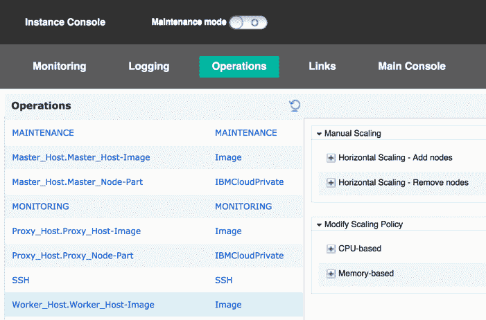

2.  “Horizontal Scaling – Add nodes”和“Horizontal Scaling – Remove nodes”操作允许您手动增加或减少 ICP 工作者节点的数量。请注意，IBM 目前不建议使用基于 CPU 的缩放。
3.  要手动添加一个或多个 ICP 工作者节点，请展开 Worker_Host.Worker_Host-Image 部分下的“Horizontal Scaling – Add nodes”部分。例如，在“Instance count”中输入 2 来向部署中添加另外 2 个 ICP 工作者节点，然后单击 **Submit**。

    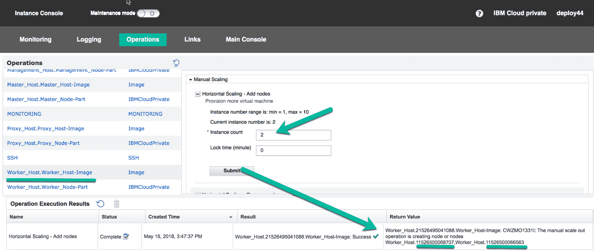

4.  该操作会显示在操作执行结果中。您应该会看到两个新的 ICP 工作者节点 VM 出现在虚拟系统实例中。

    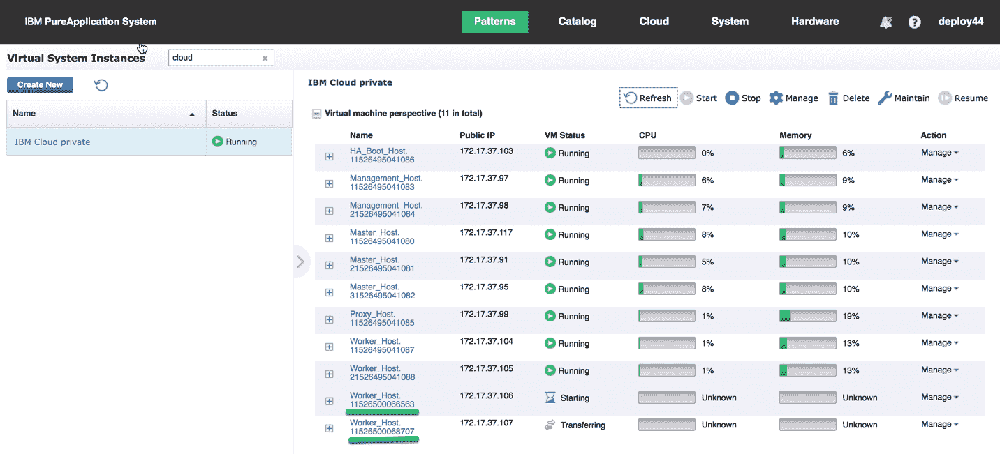

5.  现在等待两个新节点添加到 ICP 集群中，此过程可能需要 10 到 15 分钟。当两个工作者节点的中间件状态被设置为“Running”时，该操作应该已完成。

    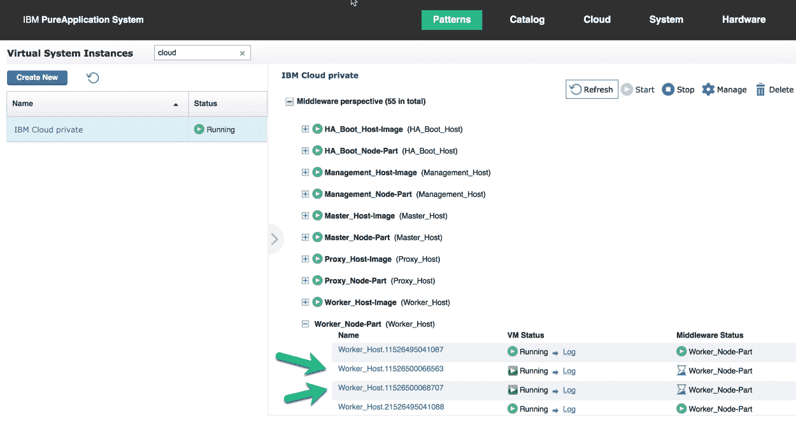

6.  完成添加工作者的操作后，应该会在 ICP 控制台中看到这些新节点：

    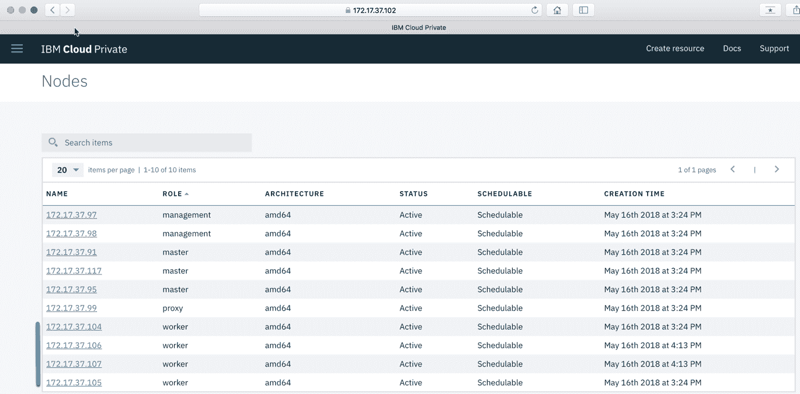类似地，可以删除 ICP 工作者节点。

7.  展开“Horizontal Scaling – Remove nodes”选项并单击 **Submit**。这将删除一个 ICP 工作者节点。

    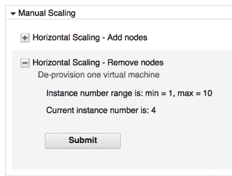

8.  该操作已在操作执行结果下列出。

    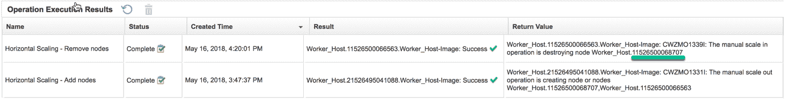

9.  您应该注意到，相应的 ICP 工作者会停止运行并从虚拟系统实例中删除。

    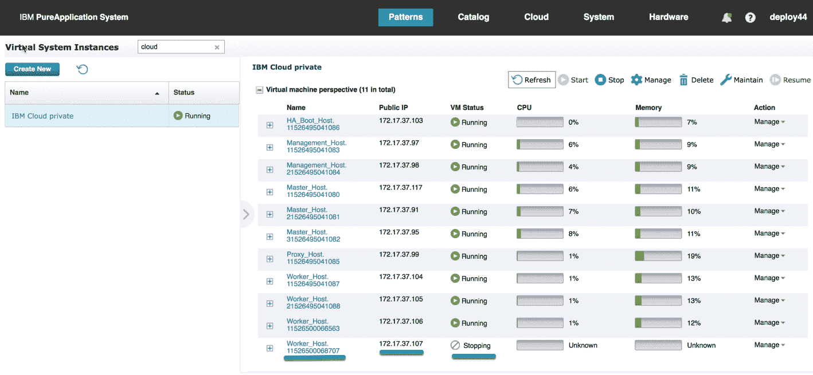

10.  从虚拟系统实例中删除 VM 后，验证无法再在 ICP 控制台中看到 ICP 工作者节点。

    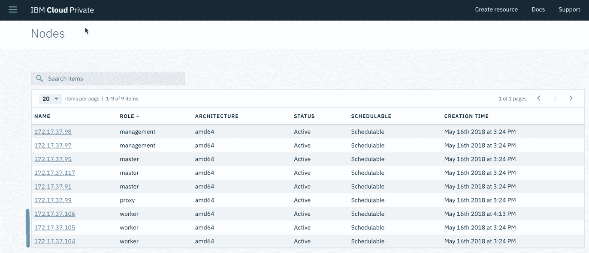

可按照类似方法添加或删除 ICP 代理和管理节点。

### 扩展磁盘大小

可以在任何 ICP 角色上使用此操作来扩展 /var/lib/elasticsearch/data、/var/lib/docker 或 /var/lib/registry 的磁盘大小。ICP 模式根据 ICP 的建议为这些数据路径设置默认的磁盘大小，但如果您的部署需要，可以使用此操作按需增加磁盘大小。

1.  在其中一个主机上展开 **Extend disk size** 操作，例如在包含镜像和其他 ICP 内容的 **HA_Boot_Host.HA_Boot_Node-Part** 上。

    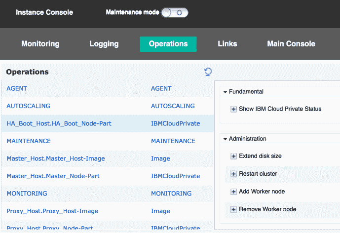

2.  选择想要扩展的磁盘的挂载点。
3.  输入想要添加到现有磁盘的存储大小，然后单击 **Submit**。

    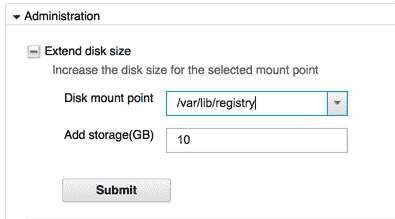

4.  在 Operation Execution Results 列表下会出现一个名为“Extend disk size”的新条目。
5.  完成操作后，操作的状态从“Active”更改为“Complete”，而且 Return Value 列将操作结果显示为一个链接。

    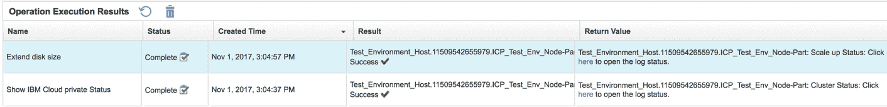

6.  单击该链接，这会打开一个新选项卡并显示操作的输出。验证日志中没有错误，如下所示：

    ```
    [11/01/17 19:05:02 UTC] Current size for mount point /var/lib/docker is 59(G)
    [11/01/17 19:05:02 UTC] Scale up mount point /var/lib/docker with extra 20(G)
    [11/01/17 19:05:02 UTC] Begin to start scaleNode task for node Test_Environment_Host.11509542655979, disksize: 20
    ...
    [11/01/17 19:05:59 UTC] current task 4435 is succeed
    [11/01/17 19:05:59 UTC] End to check scaleNode task 4435, rc = 0
    [11/01/17 19:05:59 UTC] Begin to handle post-scaleNode
    [11/01/17 19:05:59 UTC] format new VMFS disk
    [11/01/17 19:05:59 UTC] Begin to format new local disk
    [11/01/17 19:05:59 UTC] End to format new disk, rc = 0
    [11/01/17 19:05:59 UTC] succeeded in formatting local disk
    [11/01/17 19:05:59 UTC] succeed to handle 3post scaleup on VM Test_Environment_Host.11509542655979
    [11/01/17 19:05:59 UTC] End to handle post-scaleNode
    [11/01/17 19:05:59 UTC] End to scaleNode task for Node Test_Environment_Host.11509542655979
    [11/01/17 19:05:59 UTC] Current size for mount point /var/lib/docker is 79(G) 
    ```

### 查看 IBM Cloud Private 模式日志

有时事情并不像您期望的那样顺利。IBM Cloud Private 模式将信息记录在许多不同的地方。让我们快速回顾一些最常见的记录信息的地方。

上述操作的输出可从每个已部署的虚拟机的 Logging View 中访问。在部署过程中，请单击 **Manage > Logging**，然后选择任何已部署的虚拟机部分，并展开 IBMCloudPrivate /../ICp/logs。

IBM Cloud Private 产品安装日志仅包含在引导主机上，位于 IBMCloudPrivate /../Icp/logs/icp.log 下。其他主机还将部署信息记录在 IBMCloudPrivate /../Icp/logs/icp.log 下。

集群主机和 config.yaml 文件也包含在同一个 IBMCloudPrivate 文件夹中。

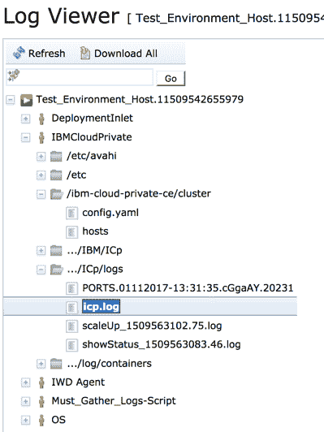

容器日志可在 IBMCloudPrivate../log/containers 文件夹中找到。

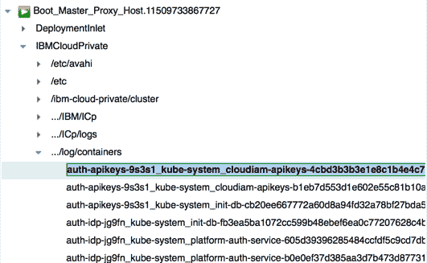

## 结束语

在本教程中，您学习了如何使用 IBM Cloud Private 虚拟系统模式这一类型在该产品支持的所有拓扑结构中部署和管理 IBM Cloud Private Community Edition (CE) 或 Enterprise Edition (EE) 集群。此模式使您能够以快速、可靠、可复制的方式安装 IBM Cloud Private，而且您可以直接从 Docker Hub 安装该产品（CE 或 EE）的不同版本，或者在没有互联网连接的情况下也能完成安装。

***致谢：**感谢 Joe Wigglesworth、Sandeep Minocha 和 Dennis Lauwers 对本教程的帮助。*

本文翻译自：[Getting started with the IBM Cloud Private Pattern for IBM PureApplication](https://developer.ibm.com/tutorials/cl-ibm-cloud-private-pattern-for-ibm-pureapplication/)（2018-06-20）