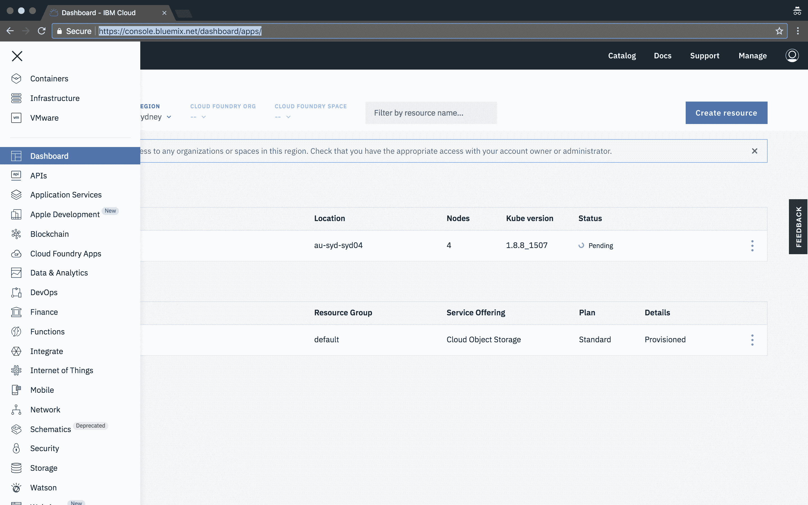
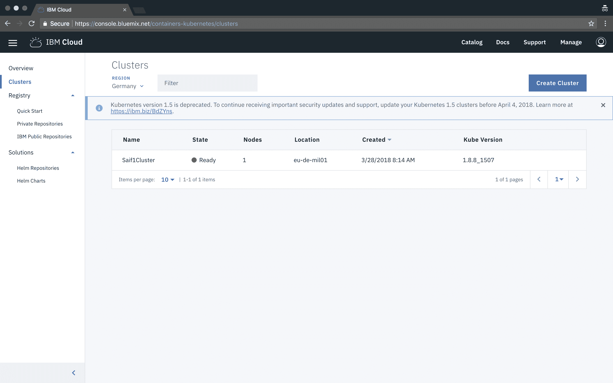
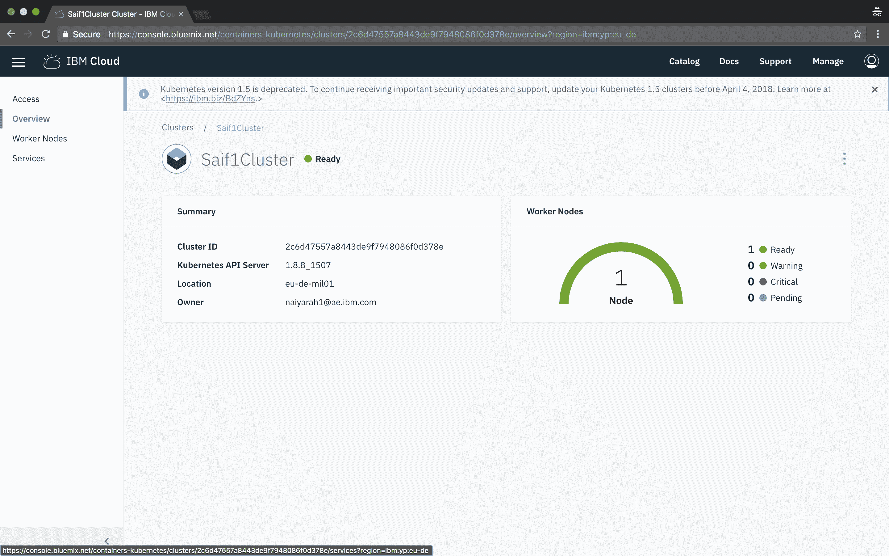

# 在 IBM Cloud 上创建和部署区块链聊天应用

> 原文：[`developer.ibm.com/zh/tutorials/cl-create-blockchain-chat-app-tendermint-ibm-cloud/`](https://developer.ibm.com/zh/tutorials/cl-create-blockchain-chat-app-tendermint-ibm-cloud/)

在本教程中，您将学习如何使用 Tendermint 和 Lotionjs 轻松将“权益证明”区块链应用作为两个验证者节点部署至 IBM 容器。

## 学习目标

*   学习如何使用 Tendermint 和 Lotionjs 将“权益证明”区块链应用作为两个验证者节点部署至 IBM 容器

## 完成本教程所需时间

*   大约 60 分钟。

## 前提条件

您需要安装以下软件：

*   [IBM Cloud CLI](https://cloud.ibm.com/docs/cli?topic=cloud-cli-ibmcloud-cli&locale=zh-CN)，用于管理 IBM Cloud 中的应用、容器、基础架构、服务和其他资源的命令行界面
*   [Docker](https://docs.docker.com/install/)，使用容器开发、部署和运行应用的平台
*   [Kubectl](https://kubernetes.io/docs/tasks/tools/install-kubectl/)，用于在 Kubernetes 上部署和管理应用的命令行工具

## 背景

区块链技术是自从因特网诞生以来最伟大的技术创新之一。因特网支持信息的自由流动，而区块链则支持价值的无障碍流动。在应用密码学方面，前所未有的大量研究正在如火如荼地展开。各行各业的企业都在将区块链技术应用于真实的业务用例。

区块链也是一项崭新的技术。快速开发区块链应用原型并在云端运行往往困难重重。Tendermint 可用于快速创建区块链应用，因为它可处理位于底层的区块链层（例如，网络和共识），同时还可通过 ABCI（应用区块链接口）聚焦应用层。在本教程中，我将向您展示如何使用 Tendermint 和 Lotionjs 轻松创建区块链聊天应用，并将其部署至 IBM Cloud。

### 什么是 Tendermint？

简而言之，Tendermint 是可用于在任何分布式计算平台中实现拜占庭容错 (BFT) 的软件。从管理基础架构到设计分布式数据库，都可使用 Tendermint。Tendermint 基于两个重要的技术组件而构建：

*   **共识引擎**（也称为 Tendermint 核心）可通过“权益证明”共识确保在每台机器中按相同顺序记录每个事务。
*   **ABCI（应用区块链接口）**支持以任何编程语言来处理事务。

Tendermint 具有以下特性：

*   **拜占庭容错：**Tendermint 最高可容忍三分之一的机器出现任意故障。这包括明确的恶意行为。
*   **状态机复制：**Tendermint 可复制以任何编程语言编写的确定性状态机。
*   **安全的 P2P：**通过 Tendermint 中经过认证的加密系统来保护 Gossip 协议和对等节点发现。
*   **闪电般的速度：**Tendermint 支持每秒数千个事务，1000 毫秒延迟。

### 什么是 Lotionjs？

Lotion 是在 JavaScript 中创建区块链应用的一种快速而有趣的方法。它是基于 Tendermint 使用 ABCI 协议构建的。

## 设置项目

1.  创建新目录并导航至此目录：

    ```
    $ mkdir blockchain
    $ cd blockchain 
    ```

2.  安装所需的库：

    ```
    $ npm i lotion --save
    $ npm i dotenv --save 
    ```

## 创建 2 个验证者节点的私有密钥和创始文件

1.  创建创始文件：

    ```
    touch genesis.json 
    ```

2.  将初始内容填充到 genesis.json 中：

    ```
    {
       "genesis_time": "0001-01-01T00:00:00Z",
       "chain_id": "name",
       "validators": [
       ],
       "app_hash": ""
    } 
    ```

3.  生成 2 个验证者节点的密钥：

    ```
    $ ./node_modules/lotion/bin/tendermint gen_validator > privkey0.json
    $ ./node_modules/lotion/bin/tendermint gen_validator > privkey1.json 
    ```

    私有密钥类似如下，公用密钥和私有密钥是随机生成的：

    ```
    {
        "address": "B809574EC51377DE48454094BF3302989CBB50A9",
        "pub_key": {
            "type": "ed25519",
            "data": "8A049817BA6D1B065C30D927A529AAFA7147BE0D147E1CCD7A25FAADBE80C8D0"
        },
        "priv_key": {
            "type": "ed25519",
            "data": "57BAFDD6136E1140FA9F906313BF2CFC75802F044704DD7AAF30BC1010E6519C8A049817BA6D1B065C30D927A529AAFA7147BE0D147E1CCD7A25FAADBE80C8D0"
        }
    } 
    ```

4.  仅复制公用密钥信息，并将其粘帖到 genesis.json 中。添加两个验证者后，将类似如下：

    ```
    {
        "genesis_time": "0001-01-01T00:00:00Z",
        "chain_id": "name",
        "validators": [
            {
                "pub_key": {
                    "type": "ed25519",
                    "data": "8A049817BA6D1B065C30D927A529AAFA7147BE0D147E1CCD7A25FAADBE80C8D0"
                },
                "power": 10,
                "name": "saif"
            },
            {
                "pub_key": {
                    "type": "ed25519",
                    "data": "5FD1FBF59759E50BD1C23911E832198AB78A4F7E6F1F23A64AAFEC5992608CA8"
                },
                "power": 20,
                "name": "prerna"
            }
        ],
        "app_hash": ""
    } 
    ```

## 构建验证者 1

1.  创建 node1 文件夹：

    ```
    mkdir node1 
    ```

2.  浏览至 node1 目录：

    ```
    cd node1 
    ```

3.  安装所需的库：

    ```
    $ npm i lotion --save
    $ npm i dotenv --save 
    ```

4.  将先前生成的 `genesis.json` 和 `privkey0.json` 复制到 node1 文件夹。

5.  创建 node1 的环境文件：

    ```
    $ touch .env-node1 
    ```

6.  对 node1.js 的内容进行编码：

    ```
    LOTION_HOME="./.lotion_node1" 
    ```

7.  创建 node1.js：

    ```
    $ touch node1.js 
    ```

8.  对 node1.js 的内容进行编码：

    ```
    require('dotenv').config({path: ".env-node1"});
    let lotion = require('lotion')
    let app = lotion({
      genesis: './genesis.json',
      tendermintPort: 30090,
      initialState: { messages: [] },
      p2pPort: 30092,
      logTendermint: true,
      keys: 'privkey0.json',
      peers: ['workernode2:30092']
    })
    app.use((state, tx,chainInfo) => {
      if (typeof tx.sender === 'string' && typeof tx.message === 'string') {
        state.messages.push({ sender: tx.sender, message: tx.message })
      }
    })
    app.listen(3000).then(({ GCI }) => {
      console.log(GCI)
    }) 
    ```

9.  创建 Dockerfile：

    ```
    $ touch Dockerfile 
    ```

10.  对 Dockerfile 的内容进行编码：

    ```
    FROM node:carbon
    WORKDIR /usr/src/app
    COPY package*.json ./
    COPY privkey0.json ./
    COPY .env-node1 ./
    RUN npm install
    COPY ..
    EXPOSE 30090 30092
    CMD [ "node", "node1.js" ] 
    ```

## 构建验证者 2

1.  创建 node2 文件夹：

    ```
    mkdir node2 
    ```

2.  浏览至 node2 目录：

    ```
    cd node2 
    ```

3.  安装所需的库：

    ```
    $ npm i lotion --save
    $ npm i dotenv --save 
    ```

4.  将先前生成的 `genesis.json` 和 `privkey0.json` 复制到 node2 文件夹。

5.  创建 node2 的环境文件：

    ```
    $ touch .env-node2 
    ```

6.  对 node2.js 的内容进行编码：

    ```
    LOTION_HOME="./.lotion_node2" 
    ```

7.  创建 node2.js：

    ```
    $ touch node1.js 
    ```

8.  对 node2.js 的内容进行编码：

    ```
    require('dotenv').config({path: ".env-node2"});
    let lotion = require('lotion')
    let app = lotion({
      genesis: './genesis.json',
      tendermintPort: 30090,
      initialState: { messages: [] },
      p2pPort: 30092,
      logTendermint: true,
      keys: 'privkey1.json',
      peers: ['workernode1:30092']
    })
    app.use((state, tx,chainInfo) => {
      if (typeof tx.sender === 'string' && typeof tx.message === 'string') {
        state.messages.push({ sender: tx.sender, message: tx.message })
      }
    })
    app.listen(3000).then(({ GCI }) => {
      console.log(GCI)
    }) 
    ```

9.  创建 Dockerfile：

    ```
    $ touch Dockerfile 
    ```

10.  对 Dockerfile 的内容进行编码：

    ```
    FROM node:carbon
    WORKDIR /usr/src/app
    COPY package*.json ./
    COPY privkey0.json ./
    COPY .env-node1 ./
    RUN npm install
    COPY ..
    EXPOSE 30090 30092
    CMD [ "node", "node2.js" ] 
    ```

## 将这两个验证者节点部署到 IBM Cloud 上

1.  注册 [IBM Cloud](https://cloud.ibm.com/registration?cm_sp=ibmdev-_-developer-tutorials-_-cloudreg⌖=%2Fcatalog%3Fcategory%3Dai)。

2.  安装 [Cloud Foundry CLI](https://docs.cloudfoundry.org/cf-cli/install-go-cli.html)。

3.  安装 [IBM Cloud CLI](https://cloud.ibm.com/docs/cli?topic=cloud-cli-ibmcloud-cli&locale=zh-CN)。

4.  安装 [Kubernetes CLI](https://kubernetes.io/docs/tasks/tools/install-kubectl/)。

5.  浏览至 node1 目录：

    ```
    $ cd node1 
    ```

6.  构建 Docker 镜像：

    ```
    $ docker build -t node1 . 
    ```

7.  转至 [IBM Cloud 控制台](https://cloud.ibm.com/catalog?cm_sp=ibmdev-_-developer-tutorials-_-cloudreg)。

8.  导航至 Containers：

    

9.  单击 **Create Cluster**：

    

10.  命名您的集群，并创建一个集群；等待几分钟，以便完全部署此集群。完全部署后，单击此集群以查看已部署集群的概述：

    

11.  单击左侧导航中的 **Access**，遵循指示信息进行操作。

12.  安装容器服务插件：

    ```
    $ bx plugin install container-service -r Bluemix 
    ```

13.  登录到您的 IBM Cloud 帐户：

    ```
    $ bx login -a https://api.eu-de.bluemix.net
    $ bx cs region-set eu-central 
    ```

14.  在 CLI 中设置集群的环境：

    1.  获取设置环境变量的命令，并下载 Kubernetes 配置文件：

        ```
        ```
        $ bx cs cluster-config NameOfYourCluster
        ``` 
        ```

    2.  设置 KUBECONFIG 环境变量。将先前命令的输出复制并粘帖到您的终端内。
15.  列出您的工作节点，验证您是否可连接到自己的集群：

    ```
    $  kubectl get nodes 
    ```

16.  转至 [IBM Cloud Container Registry](https://cloud.ibm.com/docs/services/Registry?topic=registry-getting-started&locale=zh-CN)。

17.  选择首个名称空间的名称，并创建该名称空间。

    ```
    $ bx cr namespace-add <my_namespace> 
    ```

18.  将本地 Docker 守护程序记录到 IBM Cloud Container Registry 中：

    ```
    $ bx cr login 
    ```

19.  选择存储库和用于识别镜像的标签。在本教程的其余部分使用相同的存储库和标签。

    ```
    $ docker tag node1 <registry>/<my_namespace>/node1:latest 
    ```

20.  推送镜像。

    ```
    $ docker push <registry>/<my_namespace>/node1:latest 
    ```

21.  验证您的镜像是否位于私有注册表中：

    ```
    $ bx cr image-list 
    ```

22.  既然您的容器已部署到 IBM 容器上，是时候使用 Kubernetes 来运行一些 pod 了。使用复制/粘帖将镜像名称从注册表的私有名称更改为其他名称。（位于 service-deployment.yml 文件中的镜像属性将与私有注册表中的镜像名称相同。）

    ```
    apiVersion: extensions/v1beta1
    kind: Deployment
    metadata:
     name: tendermintnodeone # give any name
    spec:
     replicas: 1
     template:
       metadata:
         name: tendermintnodeone
         labels:
           run: tendermint1
       spec:
         containers:
           - name: saif1cluster
             image: "<registry>/<my_namespace>/node1:latest" # your registry name
             imagePullPolicy: Always
    ---
    apiVersion: v1
    kind: Service
    metadata:
     name: my-service-tendermint-11 # give a service name
     labels:
       run: tendermint1
    spec:
     type: NodePort
     selector:
       run: tendermint1
     ports:
      - protocol: TCP
        name: tendermint1
        port: 30090
        nodePort: 30090
      - protocol: TCP
        name: port
        port: 30092
        nodePort: 30092 
    ```

23.  配置 Kubernetes 以创建 pod、服务和部署：

    ```
    $ kubectl create -f service-deployment.yml 
    ```

24.  删除所有部署：

    ```
    $ kubectl delete deployments --all 
    ```

25.  删除所有服务：

    ```
    $ kubectl delete services --all 
    ```

26.  访问 pod 和日志：

    ```
    $ kubectl get pods
    $ kubectl logs podname 
    ```

27.  访问 Tendermint RPC API：[`workerip:30092`](http://workerip:30092)

对 node2 重复相同的步骤。

## 创建轻量级客户端以在区块链上执行读/写操作

1.  安装 lotion-connect：

    ```
    $ npm install lotion-connect --save 
    ```

2.  创建 write.js：

    ```
    $ touch read-write.js 
    ```

3.  对 read-write.js 的内容进行编码：

    ```
    let { connect } = require('lotion-connect')
    async function main() {
    let { state, send } = await connect(null, {
      genesis: require('./genesis.json'),
      nodes: [ 'ws://wordernode1:30092','ws://wordernode2:30092' ]
    })
    console.log(await state)
    console.log(await send({ "sender": 'saif',"message":"himom" }))
      process.exit();
    }
    main() 
    ```

## 结束语

Tendermint 便于业务开发人员编写区块链应用，而 IBM Cloud 则简化了此类应用的部署和操作。

## 了解更多信息

*   [创建端到端的 Tendermint 区块链聊天应用](https://medium.com/coinmonks/deploying-proof-of-stake-blockchain-applications-on-ibm-cloud-using-tendermint-8544a0185d84)
*   [Tendermint 区块链聊天应用 GitHub 存储库](https://github.com/SaifRehman/tendermint-chat-app)

## 后续行动

*   查阅众多 [**Code Pattern**](https://developer.ibm.com/zh/technologies/blockchain/)，它们为解决区块链技术中遇到的复杂问题提供了路线图，并包括架构图、代码存储库和其他阅读材料。

*   访问 [**区块链开发人员中心**](http://developer.ibm.com/zh/technologies/blockchain)。可以在这里获得开发和部署商业区块链解决方案的免费工具和教程，以及代码和社区支持。

## 作者简介

Saif Rehman 拥有沙迦大学颁发的计算机工程学位，并且将在乔治亚理工学院继续攻读计算机科学硕士学位。Saif 是一名软件开发人员/测试人员和 Python 极客，热衷于研究敏捷方法。由于有着扎实的编程基础，他能够非常快速地学习新编程语言和框架。他将大部分时间都投入到了前端技术（如 Angular 和 Elixir）和开发安全的可扩展 Web API 这些方面。他对于探究像区块链这样的新技术乐此不疲，并且立志成为一名数据科学家。

本文翻译自：[Create and deploy a blockchain chat application on the IBM Cloud using Tendermint and Lotionjs](https://developer.ibm.com/tutorials/cl-create-blockchain-chat-app-tendermint-ibm-cloud/)（2018-05-14）