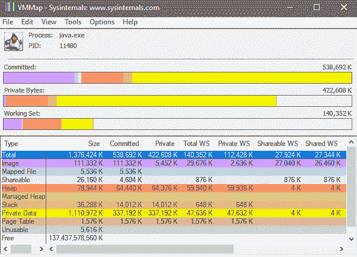
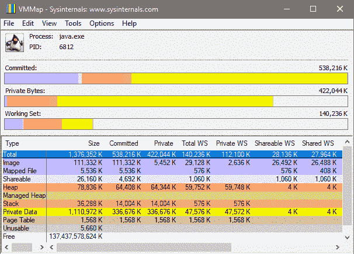
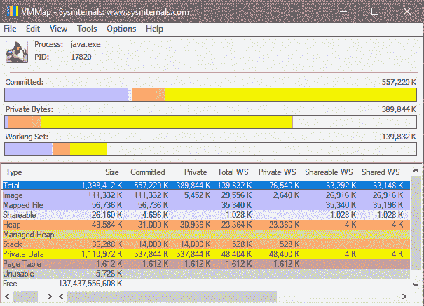
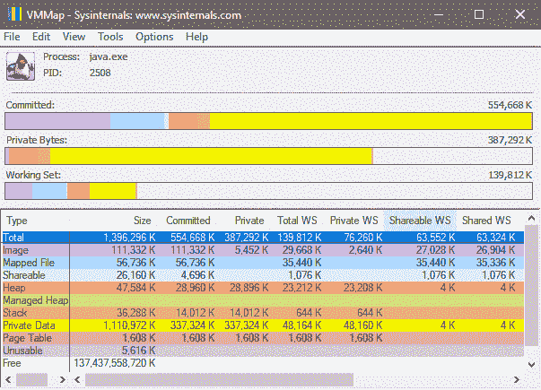

# Eclipse OpenJ9 中的类共享

> 原文：[`developer.ibm.com/zh/tutorials/j-class-sharing-openj9/`](https://developer.ibm.com/zh/tutorials/j-class-sharing-openj9/)

内存占用和启动时间是 Java 虚拟机 (JVM) 的重要性能指标。在云环境中，内存占用变得尤为重要，因为您需要为应用程序所占用的内存付费。在本教程中，我们将展示如何使用 Eclipse OpenJ9 中的共享类特性来减少内存占用并改进 JVM 启动时间。

##### Eclipse OpenJ9 与类共享

2017 年，IBM 开放了 J9 JVM 的源代码，并将其贡献给了 Eclipse 基金会，从而创建了 [Eclipse OpenJ9](https://www.eclipse.org/openj9/) 项目。从 Java 5 开始，J9 JVM 支持系统类到应用程序类的类共享已有 10 多年。

在 OpenJ9 实现中，所有系统、应用程序类和预编译 (AOT) 代码都可以存储在一个共享内存中的动态类缓存中。这个共享类特性已在 OpenJ9 支持的所有平台上实现。该特性甚至支持与运行时字节码修改进行集成，本文 运行时字节码修改 会讨论这一主题。

共享类特性是一种一旦启动就无需再为其担心的特性，但它在减少内存占用和改进 JVM 启动时间方面具有巨大潜力。因此，它最适合多个 JVM 运行相似代码的环境，或定期重启 JVM 的环境。

除了 JVM 及其类加载器中支持运行时类共享之外，还有一个公共 Helper API，可以将类共享支持集成到自定义类加载器中，稍后会 使用 Helper API 讨论此内容。

如果想在我们展示示例时跟随操作，可以从 [Adopt OpenJDK 项目](https://adoptopenjdk.net/?variant=openjdk8-openj9) 下载或从 [Docker 镜像](https://hub.docker.com/r/_/ibmjava/) 获取带 OpenJ9 的 JDK。

## 工作原理

让我们先看看关于共享类特性如何操作的技术细节。

### 启用类共享

要启用类共享，请将 `-Xshareclasses[:name=<cachename>]` 添加到现有的 Java 命令行中。JVM 启动时，它会查找给定名称的共享缓存（如果未提供名称，则使用当前用户名），并根据需要连接现有共享缓存或创建一个新缓存。

可以使用参数 `-Xscmx<size>[k|m|g` 指定共享缓存的大小。此参数仅在创建新共享缓存时适用。如果省略此选项，则会使用与平台相关的默认值。注意，一些操作系统设置会限制可分配的共享内存大小。例如，Linux 上的 `SHMMAX` 通常设置为大约 32MB。要了解这些设置的更多细节，请参阅相关 [用户指南](https://www.ibm.com/support/knowledgecenter/SSYKE2_8.0.0/com.ibm.java.vm.80.doc/docs/shrc_cache_size.html) 的共享类部分。

### 共享类缓存

*共享类缓存* 是一个固定大小的共享内存，其在 JVM 的生命周期结束后或系统重新启动后仍然存在，除非使用的是非持久性共享缓存。一个系统上可以有任意数量的共享缓存，而且所有缓存都需要遵从操作系统的设置和限制。

没有 JVM 拥有共享缓存，也没有主/从 JVM 的概念。实际上，任意数量的 JVM 可以同时对共享缓存进行读写。

共享缓存的大小无法增加。当它被填满时，JVM 仍能从中加载类，但无法再向其中存储任何数据。您可以预先创建一个较大的共享类缓存，同时为可使用的共享缓存空间设置一个软性上限。如果想将更多数据存储到共享缓存中且不关闭与它相连的 JVM，可以调高此上限。请查阅 [OpenJ9 文档](https://www.eclipse.org/openj9/docs/xscmx/) ，以获得关于软性上限的更多细节。

此外，一些 JVM 实用程序也可以管理活跃缓存。我们将在下面的 共享类实用程序 部分讨论这些实用程序。

当使用 JVM 命令行显式销毁共享缓存时，共享缓存将被删除。

### 类是如何被缓存的？

当 JVM 加载一个类时，它首先会在类加载器缓存中查看它需要的类是否已经存在。如果已经存在，那么它会从类加载器缓存返回这个类。否则，它会从文件系统加载这个类，并将其作为 `defineClass()` 调用的一部分写入缓存中。因此，非共享 JVM 具有以下类加载器查找顺序：

1.  类加载器缓存
2.  父类加载器
3.  文件系统

相较而言，具有类共享特性的 JVM 采用了以下顺序：

1.  类加载器缓存
2.  父类加载器
3.  共享类缓存
4.  文件系统

可以使用公共 Helper API 在共享类缓存中读写类。Helper API 已集成到 `java.net.URLClassLoader` 中（在 Java 9 及更高版本中，还集成到了 `jdk.internal.loader.BuiltinClassLoader` 中）。因此，任何扩展 `java.net.URLClassLoader` 的类加载器都可以免费获得类共享支持。对于自定义类加载器，OpenJ9 提供了 Helper API，以便可以在自定义类加载器上实现类共享。

### 可以缓存哪些内容？

共享类缓存可以包含引导程序和应用程序类、描述这些类的元数据，以及提前（AOT）编译代码。

在 OpenJ9 实现中，Java 类分为两个部分：

*   一个称为 `ROMClass` 的只读部分，包含该类的所有不可变数据
*   一个 `RAMClass` 部分，包含可变数据，比如静态类变量

`RAMClass` 指向它在 `ROMClass` 中的数据，但这两部分是完全分开的。因此，在 JVM 之间以及同一 JVM 中的 `RAMClass` 之间共享 `ROMClass` 是非常安全的。

在非共享情况下，当 JVM 加载一个类时，它会单独创建 `ROMClass` 和 `RAMClass` ，并将它们都存储在其本地进程内存中。在共享情况下，如果 JVM 在共享类缓存中找到一个 `ROMClass` ，那么它只需在其本地内存中创建 `RAMClass` ；然后该 RAMClass 就会引用共享的 ROMClass。

由于大部分类数据都存储在 ROMClass 中，所以可以节省内存（参阅 内存占用 部分中更详细的讨论）。通过填充的缓存，JVM 启动时间也得到了明显改进，因为定义每个缓存类的一些工作已经完成，而且类是从内存加载而不是从文件系统加载的。填充新共享缓存的启动时间开销并不显著，因为每个类只需在定义时重新定位到共享缓存中。

AOT 编译代码也存储在共享缓存中。启用共享类缓存时，AOT 编译器会自动激活。AOT 编译允许将 Java 类编译为原生代码，供同一程序的后续执行使用。AOT 编译器在应用程序运行过程中动态生成原生代码，并将所有已生成的 AOT 代码缓存到共享类缓存中。AOT 编译代码的执行速度通常比解释字节码快，但没有 JIT 编译代码快。执行该方法的后续 JVM 可以加载并使用来自共享缓存的 AOT 代码，而不会出现生成 JIT 编译代码时遇到的性能下降，从而实现了更快的启动时间。创建新的共享缓存时，可以使用 `-Xscminaot<x>` 和 `-Xscmaxaot<x>` 选项来设置共享缓存中的 AOT 空间的大小。如果既不使用 `-Xscminaot` 也不使用 `-Xscmaxaot` ，那么只要有可用的空闲空间，AOT 代码就会存储到共享缓存中。

### 如果文件系统上的某个类发生更改，会发生什么？

由于共享类缓存可以无限期持久存在，所以可能会发生文件系统更新，使得共享缓存中的类和 AOT 代码失效。当类加载器请求一个共享类时，返回的类应该始终与从文件系统加载的类相同。在加载类时，这一检查会透明地进行，所以用户可以在共享类缓存的生命周期中修改和更新任意数量的类，因为知道系统总会加载正确的类。

#### 类更改中的缺陷：两个示例

假设 JVM 将一个类 C1 存储到共享缓存中。然后，在 JVM 关闭时，C1 被更改并重新编译。当 JVM 重新启动时，它不应加载 C1 的缓存版本。

同样，假设 JVM 的类路径是 `/mystuff:/mystuff/myClasses.jar` 。它从 `myClasses.jar` 将 C2 加载到共享缓存中。然后，将一个不同的 C2.class 添加到 `/myStuff` ，并启动另一个 JVM 来运行同一个应用程序。JVM 也不应该加载 `C2` 的缓存版本。

JVM 检测文件系统更新的方法是，将时间戳值存储到共享缓存中，并在每次加载类时将该缓存值与实际值进行比较。如果它检测到某个 JAR 文件已更新，并且不知道哪些类发生了更改，那么缓存中来自该 JAR 的所有类和 AOT 代码都会立刻被标记为过时，那么无法再从该缓存中加载它们。当从文件系统加载来自该 JAR 的类并重新添加到缓存中时，只有已更改的类才会得到完整添加；未更改的类实际上被设置为未过时。

无法从共享类缓存中清除类，但 JVM 会尝试最有效地利用它所拥有的空间。例如，同一个类绝不会被添加两次，即使是从许多不同的位置加载它。因此，如果 3 个不同的 JVM 分别从 /A.jar、/B.jar 和 /C.jar 加载同一个类 C3，该类的数据仅会添加一次，但是有 3 段元数据来描述加载这个类的 3 个位置。

## 共享类实用程序

可以使用一些实用程序来管理共享类缓存，所有这些实用程序都是 `-Xshareclasses` 的 [子选项](https://www.eclipse.org/openj9/docs/xshareclasses/) 。（可以通过 java `-Xshareclasses:help` 获取所有子选项的完整列表。）

为了演示这些选项的用法，让我们来看一些示例。

首先，让我们用不同的缓存名称运行 `Hello` 类来创建两个共享缓存，如清单 1 所示：

##### 清单 1\. 创建两个共享缓存

```
C:\OpenJ9>wa6480_openj9\j2sdk-image\bin\java -cp .-Xshareclasses:name=Cache1 Hello
Hello
C:\OpenJ9>wa6480_openj9\j2sdk-image\bin\java -cp .-Xshareclasses:name=Cache2 Hello
Hello 
```

运行 `listAllCaches` 子选项会列出系统上的所有缓存，并确定它们是否已被使用，如清单 2 所示：

##### 清单 2\. 列出所有共享缓存

```
C:\OpenJ9>wa6480_openj9\j2sdk-image\bin\java -Xshareclasses:listAllCaches
Listing all caches in cacheDir C:\Users\Hang Shao\AppData\Local\javasharedresources\
Cache name              level         cache-type      feature         last detach time
Compatible shared caches
Cache1                  Java8 64-bit  persistent      cr              Mon Apr 23 15:48:12 2018
Cache2                  Java8 64-bit  persistent      cr              Mon Apr 23 15:49:46 2018 
```

运行 `printStats` 选项会输出指定缓存上的摘要统计数据，如清单 3 所示。要获得关于 printStats 选项的详细描述，请参阅 [用户指南](https://www.eclipse.org/openj9/docs/xshareclasses/#printstats-cache-utility) 。

##### 清单 3\. 一个共享缓存的摘要统计数据

```
C:\OpenJ9>wa6480_openj9\j2sdk-image\bin\java -Xshareclasses:name=Cache1,printStats

Current statistics for cache "Cache1":

Cache created with:
        -Xnolinenumbers                      = false
        BCI Enabled                          = true
        Restrict Classpaths                  = false
        Feature                              = cr

Cache contains only classes with line numbers

base address                         = 0x000000001214C000
end address                          = 0x0000000013130000
allocation pointer                   = 0x0000000012297DB8

cache size                           = 16776608
softmx bytes                         = 16776608
free bytes                           = 13049592
ROMClass bytes                       = 1359288
AOT bytes                            = 72
Reserved space for AOT bytes         = -1
Maximum space for AOT bytes          = -1
JIT data bytes                       = 1056
Reserved space for JIT data bytes    = -1
Maximum space for JIT data bytes     = -1
Zip cache bytes                      = 902472
Data bytes                           = 114080
Metadata bytes                       = 18848
Metadata % used                      = 0%
Class debug area size                = 1331200
Class debug area used bytes          = 132152
Class debug area % used              = 9%

# ROMClasses                         = 461
# AOT Methods                        = 0
# Classpaths                         = 2
# URLs                               = 0
# Tokens                             = 0
# Zip caches                         = 5
# Stale classes                      = 0
% Stale classes                      = 0%

Cache is 22% full

Cache is accessible to current user = true 
```

还有其他一些 printStats 子选项可用来输出共享缓存中的特定数据。可以在 `printStats=help` 中找到它们。例如，可以通过 printStats=classpath 检查类路径数据：

##### 清单 4\. 列出共享缓存的类路径内容

```
C:\OpenJ9>wa6480_openj9\j2sdk-image\bin\java -Xshareclasses:name=Cache1,printStats=classpath

Current statistics for cache "Cache1":

1: 0x000000001360E3FC CLASSPATH
        C:\OpenJ9\wa6480_openj9\j2sdk-image\jre\bin\compressedrefs\jclSC180\vm.jar
        C:\OpenJ9\wa6480_openj9\j2sdk-image\jre\lib\se-service.jar
        C:\OpenJ9\wa6480_openj9\j2sdk-image\jre\lib\rt.jar
        C:\OpenJ9\wa6480_openj9\j2sdk-image\jre\lib\resources.jar
        C:\OpenJ9\wa6480_openj9\j2sdk-image\jre\lib\jsse.jar
        C:\OpenJ9\wa6480_openj9\j2sdk-image\jre\lib\charsets.jar
        C:\OpenJ9\wa6480_openj9\j2sdk-image\jre\lib\jce.jar
        C:\OpenJ9\wa6480_openj9\j2sdk-image\jre\lib\tools.jar
1: 0x000000001360A144 CLASSPATH
        C:\OpenJ9
...
... 
```

共享缓存可使用 `destroy` 选项进行销毁，如清单 5 所示。类似地， `destroyAll` 会销毁所有未使用且用户有权销毁的缓存。

##### 清单 5\. 销毁一个缓存

```
C:\OpenJ9>wa6480_openj9\j2sdk-image\bin\java -Xshareclasses:name=Cache1,destroy
JVMSHRC806I Compressed references persistent shared cache "Cache1" has been destroyed.如果想要销毁非压缩引用缓存，可以使用 -Xnocompressedrefs 选项。 
```

如清单 6 所示， `expire` 选项是一个清理选项，您可以将其添加到命令行，以便自动销毁在指定分钟数内未附加任何内容的缓存。清单 6 查找一周（10,080 分钟）内未使用过的缓存，并在启动 JVM 之前销毁它们。

`reset` 选项总是创建一个新的共享缓存。如果存在同名的缓存，则销毁它并创建一个新的缓存。

##### 清单 6\. 销毁一周内未使用过的缓存

```
C:\OpenJ9>wa6480_openj9\j2sdk-image\bin\java -Xshareclasses:name=Cache1,expire=10080 Hello
Hello 
```

## verbose 选项

verbose 选项提供了关于类共享正在做什么的有用反馈。它们都是 `-Xshareclasses` 的子选项。本节将提供如何使用详细输出的一些示例。

`verbose` 选项（参加清单 7）提供了关于 JVM 启动和关闭的简要状态信息：

##### 清单 7\. 获取 JVM 状态信息

```
C:\OpenJ9>wa6480_openj9\j2sdk-image\bin\java -Xshareclasses:name=Cache1,verbose Hello
[-Xshareclasses persistent cache enabled]
[-Xshareclasses verbose output enabled]
JVMSHRC236I Created shared classes persistent cache Cache1
JVMSHRC246I Attached shared classes persistent cache Cache1
JVMSHRC765I Memory page protection on runtime data, string read-write data and partially filled pages is successfully enabled
Hello
JVMSHRC168I Total shared class bytes read=11088.Total bytes stored=2416962
JVMSHRC818I Total unstored bytes due to the setting of shared cache soft max is 0.Unstored AOT bytes due to the setting of -Xscmaxaot is 0.Unstored JIT bytes due to the setting of -Xscmaxjitdata is 0. 
```

`verboseIO` 将每个类加载请求的一个状态行输出到共享缓存。要理解 `verboseIO` 的输出，应该了解类加载器的分层结构，因为这可以让您清楚地看出由任何非引导程序类加载器加载的类。在输出中，为每个类加载器都分配了一个唯一 ID，但引导程序加载器的 ID 始终为 0。

请注意，有时候即使类已经缓存， `verboseIO` 仍然显示正在从磁盘加载类并存储到缓存中，这是正常的。例如，从应用程序类路径上的每个 JAR 加载的第一个类无论它是否存在于缓存中，总是从磁盘加载并存储。这是为了确认类路径中的 JAR 确实已存在于文件系统上。

在清单 8 中，第一部分演示了缓存的填充，第二部分演示了缓存类的读取：

##### 清单 8\. 使用 verboseIO

```
C:\OpenJ9>wa6480_openj9\j2sdk-image\bin\java -Xshareclasses:name=Cache1,verboseIO Hello
[-Xshareclasses verbose I/O output enabled]
Failed to find class java/lang/Object in shared cache for class-loader id 0.
Stored class java/lang/Object in shared cache for class-loader id 0 with URL C:\OpenJ9\wa6480_openj9\j2sdk-image\jre\lib\rt.jar (index 2).
Failed to find class java/lang/J9VMInternals in shared cache for class-loader id 0.
Stored class java/lang/J9VMInternals in shared cache for class-loader id 0 with URL C:\OpenJ9\wa6480_openj9\j2sdk-image\jre\lib\rt.jar (index 2).
Failed to find class com/ibm/oti/vm/VM in shared cache for class-loader id 0.
Stored class com/ibm/oti/vm/VM in shared cache for class-loader id 0 with URL C:\OpenJ9\wa6480_openj9\j2sdk-image\jre\lib\rt.jar (index 2).
Failed to find class java/lang/J9VMInternals$ClassInitializationLock in shared cache for class-loader id 0.
...
...
C:\OpenJ9>wa6480_openj9\j2sdk-image\bin\java -Xshareclasses:name=Cache1,verboseIO Hello
[-Xshareclasses verbose I/O output enabled]
Found class java/lang/Object in shared cache for class-loader id 0.
Found class java/lang/J9VMInternals in shared cache for class-loader id 0.
Found class com/ibm/oti/vm/VM in shared cache for class-loader id 0.
Found class java/lang/J9VMInternals$ClassInitializationLock in shared cache for class-loader id 0.
...
... 
```

`verboseHelper` 子选项（参见清单 9）是一个高级选项，提供了来自 Helper API 的状态输出。 `verboseHelper` 子选项可以帮助使用 Helper API 的开发人员了解它的驱动方式。 [JVM 诊断指南](https://www.ibm.com/support/knowledgecenter/SSYKE2_8.0.0/com.ibm.java.vm.80.doc/docs/shrc_pd_out_verbosehelper.html) 中介绍了关于此输出的更多细节。

##### 清单 9\. 来自 Helper API 的状态输出

```
C:\OpenJ9>wa6480_openj9\j2sdk-image\bin\java -Xshareclasses:name=Cache1,verboseHelper Hello
[-Xshareclasses Helper API verbose output enabled]
Info for SharedClassURLClasspathHelper id 1: Verbose output enabled for SharedClassURLClasspathHelper id 1
Info for SharedClassURLClasspathHelper id 1: Created SharedClassURLClasspathHelper with id 1
Info for SharedClassURLClasspathHelper id 2: Verbose output enabled for SharedClassURLClasspathHelper id 2
Info for SharedClassURLClasspathHelper id 2: Created SharedClassURLClasspathHelper with id 2
Info for SharedClassURLClasspathHelper id 1: There are no confirmed elements in the classpath.Returning null.
Info for SharedClassURLClasspathHelper id 2: There are no confirmed elements in the classpath.Returning null.
Info for SharedClassURLClasspathHelper id 2: setClasspath() updated classpath.No invalid URLs found
Info for SharedClassURLClasspathHelper id 2: Number of confirmed entries is now 1
Hello 
```

`verboseAOT` 和 `-Xjit:verbose` 子选项提供了从/向共享缓存执行 AOT 加载和存储的相关信息，如清单 10 所示。

##### 清单 10\. AOT 加载和存储的 Verbose 信息

```
C:\OpenJ9>wa6480_openj9\j2sdk-image\bin\java -Xshareclasses:name=demo,verboseAOT -Xjit:verbose -cp shcdemo.jar ClassLoadStress
...
+ (AOT cold) java/nio/Bits.makeChar(BB)C @ 0x00000000540049E0-0x0000000054004ABF OrdinaryMethod - Q_SZ=2 Q_SZI=2 QW=6 j9m=0000000004A4B690 bcsz=12 GCR compThread=1 CpuLoad=298%(37%avg) JvmCpu=175%
Stored AOT code for ROMMethod 0x00000000123C2168 in shared cache.
...
+ (AOT load) java/lang/String.substring(II)Ljava/lang/String; @ 0x0000000054017728-0x00000000540179DD Q_SZ=0 Q_SZI=0 QW=1 j9m=00000000049D9DF0 bcsz=100 compThread=0
Found AOT code for ROMMethod 0x0000000012375700 in shared cache.
... 
```

## 运行时字节码修改

运行时字节码修改是一种将行为添加到 Java 类中的流行方法。可以使用 JVM 工具接口 (JVMTI) 挂钩来执行运行时字节码修改（详细信息可在 [此处](https://www.ibm.com/support/knowledgecenter/SSYKE2_8.0.0/com.ibm.java.vm.80.doc/docs/jvmti.html) 找到）。另外，类加载器可以在定义类之前替换类字节。这给类共享带来了额外的挑战，因为一个 JVM 可能缓存经过修改的字节码，而共享同一个缓存的另一个 JVM 不应加载这些字节码。

但是，由于 OpenJ9 共享类实现的动态性质，采用不同修改类型的多个 JVM 可以安全地共享同一个缓存。实际上，如果字节码修改的代价高昂，那么对经过修改的类进行缓存有很大的好处，因为只需执行一次转换即可。唯一的要求是，字节码修改应是确定性的且可预测的。修改并缓存一个类之后，就不能再更改它。

可以使用 `-Xshareclasses` 的 `modified=<context>` 子选项共享经过修改的字节码。上下文是一个用户定义的名称，它在共享缓存中创建一个逻辑分区，该 JVM 加载的所有类都存储在这个分区中。使用这个特定修改的 JVM 都应使用相同的修改上下文名称，而且它们都将从同一个共享缓存分区中加载类。任何使用同一个共享缓存且未使用 `modified` 子选项的 JVM，都可以按一般方式查找并存储普通的类。

### 潜在的缺陷

如果 JVM 运行着一个已注册的 JVMTI 代理来修改类字节，而且 *未* 使用 `modified` 子选项，那么仍然可以安全地管理与其他一般 JVM 或与使用其他代理的 JVM 之间的类共享，但由于要进行额外的检查，会产生一点性能成本。因此，使用 `modified` 子选项始终更加高效。

注意，只有使用了 JVMTI API，JVM 才能知道什么时候将进行字节码修改。重新定义和重新转换的类不会存储在缓存中。JVM 将普通的类字节数据存储在共享缓存中，这允许为从缓存加载的所有类触发 JVMTI `ClassFileLoadHook` 事件。因此，如果某个自定义类加载器在定义类之前修改了类字节，而没有使用 JVMTI _ 和`modified` 子选项，那么就假设所定义的类是普通类，且其他 JVM 可能无法正确加载它们。

要获得关于对经过修改的字节码进行共享的更多详细信息，请参阅 [此处](https://www.ibm.com/support/knowledgecenter/SSYKE2_8.0.0/com.ibm.java.vm.80.doc/docs/shrc_pd_runtime_bytecode_mod.html) 。

## 使用 Helper API

OpenJ9 提供了共享类 Helper API，使开发人员能够将类共享支持集成到自定义类加载器中。只有未扩展 `java.net.URLClassLoader` 的类加载器才需要 Helper API，因为这些类加载器会自动继承类共享支持。

对 Helper API 的全面介绍超出了本文的讨论范围，但我们仍会大体介绍一下。如果想了解更多细节，可以在 [GitHub](https://github.com/eclipse/openj9/tree/master/jcl/src/openj9.sharedclasses/share/classes/com/ibm/oti/shared) 上找到 Helper API 实现。

### Helper API：概述

所有 Helper API 类都包含在 [`com.ibm.oti.shared`](https://github.com/eclipse/openj9/tree/master/jcl/src/openj9.sharedclasses/share/classes/com/ibm/oti/shared) 包中。每个希望共享类的类加载器都必须从 `SharedClassHelperFactory` 获取一个 `SharedClassHelper` 对象。创建 `SharedClassHelper` 之后，它就属于请求它的类加载器，只能存储这个类加载器定义的类。 `SharedClassHelper` 为该类加载器提供了一个简单 API，用于在共享缓存中查找和存储类。如果对这个类加载器进行垃圾收集，也会对它的 `SharedClassHelper` 进行垃圾收集。

### 使用 SharedClassHelperFactory

`SharedClassHelperFactory` 是一个单例对象，可以使用静态方法 `com.ibm.oti.shared.Shared.getSharedClassHelperFactory()` 获取它；如果在 JVM 中启用了类共享，那么该方法会返回一个工厂，否则它会返回 `null` 。

### 使用 SharedClassHelper

该工厂可以返回 3 种不同类型的 `SharedClassHelper` 。每种帮助器可供一种不同类型的类加载器使用：

*   `SharedClassURLClasspathHelper` ：这个帮助器可供那些拥有 URL 类路径概念的类加载器使用。使用 URL 类路径数组在共享缓存中存储和查找类。必须能够在文件系统上访问类路径中的 URL 资源，才能缓存这些类。这个帮助器还对如何在生命周期内修改类路径有一些限制。
*   `SharedClassURLHelper` ：这个帮助器可供那些从任何 URL 加载类的类加载器用。必须能够在文件系统上访问所提供的 URL 资源，才能缓存这些类。
*   `SharedClassTokenHelper` ：这个帮助器实际上会将共享类缓存转换为一个简单的哈希表 – 类按照对共享缓存无意义的字符串密钥令牌来存储。这是唯一没有提供动态更新功能的帮助器，因为存储的类没有关联的文件系统上下文。

每个 `SharedClassHelper` 都有两个基本方法，对于不同的帮助器类型，这两个方法的参数稍有不同：

*   在类加载器向其父加载器请求类（如果该类存在）之后，应该调用 `byte[] findSharedClass(String classname...)` 。如果 `findSharedClass()` 未返回 `null` ，那么类加载器应该在返回的字节数组上调用 `defineClass()` 。注意，此函数为 `defineClass()` 返回的一个特殊 cookie，而不是实际的类字节，所以不能修改这些字节。
*   在定义一个类后，应该立即调用 `boolean storeSharedClass(Class clazz...)` 。如果成功地存储了这个类，那么该方法将返回 true，否则返回 `false` 。

## 其他考虑因素

在应用程序中部署类共享时，需要考虑安全性和缓存调优等因素。这里会简要介绍这些考虑因素。

### 安全性

默认情况下，在创建共享缓存时采用了用户级安全性，所以只有创建该共享缓存的用户才能访问它。出于这个原因，每个用户的默认缓存名称都有所不同，以免发生冲突。在 UNIX 上，有一个指定 `groupAccess` 的子选项，它允许创建这个缓存的用户的主组中的所有用户访问这个缓存。

除此之外，如果安装了 `SecurityManager` ，那么仅在被显式授予正确权限时，类加载器才能共享类。要获得关于设置这些权限的更多细节，请参阅 [用户指南](https://www.ibm.com/support/knowledgecenter/SSYKE2_8.0.0/com.ibm.java.api.80.doc/com.ibm.oti.shared/com/ibm/oti/shared/SharedClassPermission.html) 。

### 垃圾收集和即时编译

启用类共享并不影响类的垃圾收集 (GC)。就像在非共享情况下一样，仍会对类和类加载器进行垃圾收集。另外，在使用类共享时，对 GC 模式或配置没有限制。

无法将即时 (JIT) 编译代码缓存在类缓存中。共享缓存中的 AOT 代码也会受制于 JIT 编译，而且这会影响对方法进行 JIT 编译的方式和时间。此外，可以将 JIT 提示和配置文件数据存储在共享缓存中。可以使用选项 `-Xscmaxjitdata<x>` 和 `-Xscminjitdata<x>` 来设置这类 JIT 数据的共享缓存空间大小。

### 缓存大小限制

目前缓存大小的理论最大值是 2GB。缓存大小受到某些因素的限制，比如可用系统内存、可用虚拟地址空间、可用磁盘空间等。更多细节可在 [此处](https://www.ibm.com/support/knowledgecenter/en/SSYKE2_8.0.0/com.ibm.java.vm.80.doc/docs/shrc_cache_size.html) 找到。

## 一个示例

为了实际演示类共享的好处，本节将提供一个简单的图形演示。相关源代码和二进制程序可以在 GitHub 上找到。

这个演示应用程序将在 Java 8 上运行，查找 jre\lib 目录并打开每个 JAR，在它找到的每个类上调用 `Class.forName()` 。这会导致将大约 16,000 个类加载到 JVM 中。该演示会报告 JVM 花了多长时间来加载这些类。这是一个有点不自然的示例，但它确实展示了类共享的好处。让我们来运行这个应用程序并看看结果。

### 类加载的性能

1.  从 [Adopt OpenJDK](https://adoptopenjdk.net/?variant=openjdk8-openj9) 项目下载或从 [Docker 镜像](https://hub.docker.com/r/_/ibmjava/) 获取带 OpenJ9 的 JDK。
2.  [从 GitHub 下载 shcdemo.jar](https://github.com/hangshao0/Demo/blob/master/shcdemo.jar) 。
3.  使用下面清单中的命令，在不启用类共享的情况下多次运行该测试，以便对系统磁盘缓存进行”预热”：

    ```
    C:\OpenJ9>wa6480_openj9\j2sdk-image\bin\java -Xshareclasses:none -cp shcdemo.jar ClassLoadStress 
    ```

    当出现下图中的窗口时，请按下按钮。该应用程序将加载这些类。

    

    加载类之后，应用程序会报告它加载了多少个类和所用的时间，如下图所示：

    

    您会注意到，应用程序每次运行时都可能会更快一点；这得益于操作系统优化。

4.  现在，在启用类共享的情况下运行该演示，如清单 12 所示。这会创建一个新的共享缓存。您可以指定大约 50MB 的缓存大小，以确保拥有存储所有类的足够空间。下面清单给出了命令行和一些样本输出。

    ```
    C:\OpenJ9>wa6480_openj9\j2sdk-image\bin\java -cp shcdemo.jar -Xshareclasses:name=demo,verbose -Xscmx50m ClassLoadStress
    [-Xshareclasses persistent cache enabled]
    [-Xshareclasses verbose output enabled]
    JVMSHRC236I Created shared classes persistent cache demo
    JVMSHRC246I Attached shared classes persistent cache demo
    JVMSHRC765I Memory page protection on runtime data, string read-write data and partially filled pages is successfully enabled
    JVMSHRC168I Total shared class bytes read=1111375.Total bytes stored=40947096
    JVMSHRC818I Total unstored bytes due to the setting of shared cache soft max is 0.Unstored AOT bytes due to the setting of -Xscmaxaot is 0.Unstored JIT bytes due to the setting of -Xscmaxjitdata is 0. 
    ```

    还可以使用 printStats 检查缓存统计数据，如下面清单所示：

    ```
    C:\OpenJ9>wa6480_openj9\j2sdk-image\bin\java -cp shcdemo.jar -Xshareclasses:name=demo,printStats

    Current statistics for cache "demo":

    Cache created with:
            -Xnolinenumbers                      = false
            BCI Enabled                          = true
            Restrict Classpaths                  = false
            Feature                              = cr

    Cache contains only classes with line numbers

    base address                         = 0x0000000011F96000
    end address                          = 0x0000000015140000
    allocation pointer                   = 0x000000001403FF50

    cache size                           = 52428192
    softmx bytes                         = 52428192
    free bytes                           = 10874992
    ROMClass bytes                       = 34250576
    AOT bytes                            = 1193452
    Reserved space for AOT bytes         = -1
    Maximum space for AOT bytes          = -1
    JIT data bytes                       = 28208
    Reserved space for JIT data bytes    = -1
    Maximum space for JIT data bytes     = -1
    Zip cache bytes                      = 902472
    Data bytes                           = 351648
    Metadata bytes                       = 661212
    Metadata % used                      = 1%
    Class debug area size                = 4165632
    Class debug area used bytes          = 3911176
    Class debug area % used              = 93%

    # ROMClasses                         = 17062
    # AOT Methods                        = 559
    # Classpaths                         = 3
    # URLs                               = 0
    # Tokens                             = 0
    # Zip caches                         = 5
    # Stale classes                      = 0
    % Stale classes                      = 0%

    Cache is 79% full

    Cache is accessible to current user = true 
    ```

5.  现在，使用相同 Java 命令行再次启动该演示。这一次，应该会从共享类缓存中读取这些类，参见下面的清单：

    ```
    C:\OpenJ9>wa6480_openj9\j2sdk-image\bin\java -cp shcdemo.jar -Xshareclasses:name=demo,verbose -Xscmx50m ClassLoadStress
    [-Xshareclasses persistent cache enabled]
    [-Xshareclasses verbose output enabled]
    JVMSHRC237I Opened shared classes persistent cache demo
    JVMSHRC246I Attached shared classes persistent cache demo
    JVMSHRC765I Memory page protection on runtime data, string read-write data and partially filled pages is successfully enabled
    JVMSHRC168I Total shared class bytes read=36841382.Total bytes stored=50652
    JVMSHRC818I Total unstored bytes due to the setting of shared cache soft max is 0.Unstored AOT bytes due to the setting of -Xscmaxaot is 0.Unstored JIT bytes due to the setting of -Xscmaxjitdata is 0. 
    ```

    可以清楚地看到类加载时间方面的显著改进（缩短了大约 40%）。同样地，由于操作系统优化，每次运行演示都应该看到略微的性能提升。

    

您还可以试验许多不同的情况。例如，可以使用 javaw 命令启动多个演示，触发它们一起加载类，观察并发性能。

在真实场景中，通过使用类共享获得的 JVM 启动时间总减少量取决于应用程序加载的类的数量。HelloWorld 这样的程序可能不是很明显，但大型 Web 服务器肯定会获得较大的改进。无论如何，希望这个示例展示了对类共享进行试验是非常简单的，所以您可以轻松地测试受益程度。

### 内存占用

在多个 JVM 中运行示例程序时，也很容易看出内存的节省。

下面是使用与之前的示例相同的机器获得的 4 幅 VMMap 截图。在图 4 中，在没有启用类共享的情况下，完整运行了演示的两个实例。在图 5 中，在启用了类共享的情况下，使用与之前相同的命令行完整运行了两个实例。

##### 图 4\. 没有启用类共享的两个演示实例





##### 图 5\. 启用了类共享的两个演示实例





试验中的共享缓存大小为 50MB，所以图 5 中每个实例的映射文件比图 4 中的大 50MB (56736KB – 5536KB)。

可以清楚地看到，启用共享类时的内存使用量 (Private WS) 明显要低得多。对于两个 JVM 实例，实现了约 70MB Private WS 的节省。如果在启用了类共享的情况下启动更多演示实例，就会观察到更多的内存节省。上面的测试结果是在拥有 32GB RAM、使用 Intel(R) Core(TM) i7-6820HQ CPU @ 2.70GHz 的 Windows 10 笔记本电脑上获得的。

我们还在一台 Linux x64 机器上执行了同样的内存占用试验。清单 15 给出了在未启用类共享情况下启动两个 JVM 实例的结果，清单 16 给出了在启用类共享情况下启动两个 JVM 实例的结果。

如果查看结果就会发现，在启用类共享时，RSS 没有表现出太大的改善。这是因为整个共享缓存都包含在 RSS 中。但是如果我们查看 PSS，就会看到节省了约 34MB，PSS 仅为每个 JVM 计算了一半的共享缓存（因为它由这两个 JVM 共享）。

##### 清单 15\. 禁用类共享情况下 Linux 上的内存占用

```
pmap -X 9612
9612:   xa6480_openj9/j2sdk-image/jre/bin/java -cp shcdemo.jar ClassLoadStress
Address Perm ...   Size    Rss     Pss Referenced Anonymous Swap Locked Mapping
...
                ======= ======= ===== ========   ========= ==== ====
                2676500 118280 106192 118280     95860     0    0 KB
pmap -X 9850
9850:   xa6480_openj9/j2sdk-image/jre/bin/java -cp shcdemo.jar ClassLoadStress
Address Perm ...   Size    Rss     Pss Referenced Anonymous Swap Locked Mapping
...
                ======= ======= ===== ========   ========= ==== ====
                2676500 124852 112792 124852     102448    0    0 KB 
```

##### 清单 16\. 启用类共享情况下 Linux 上的内存占用

```
pmap -X 4501
4501:   xa6480_openj9/j2sdk-image/jre/bin/java -Xshareclasses:name=demo -Xscmx50m -cp shcdemo.jar ClassLoadStress
Address Perm ...   Size    Rss     Pss Referenced Anonymous Swap Locked Mapping
...
7fe7d0e00000 rw-s 4       4       2       4        0    0      0 C290M4F1A64P_demo_G35
7fe7d0e01000 r--s 33356   33356   16678   33356    0    0      0 C290M4F1A64P_demo_G35
7fe7d2e94000 rw-s 11096   48      24      48       0    0      0 C290M4F1A64P_demo_G35
7fe7d396a000 r--s 5376    1640    832     1640     0    0      0 C290M4F1A64P_demo_G35
7fe7d3eaa000 rw-s 296     0       0       0        0    0      0 C290M4F1A64P_demo_G35
7fe7d3ef4000 r--s 1072    0       0       0        0    0      0 C290M4F1A64P_demo_G35
...
                  ======= ======= ===== ======== ====== ====== ====
                  2732852 120656  90817 97988    62572  0      0 KB
pmap -X 4574
4574:   xa6480_openj9/j2sdk-image/jre/bin/java -Xshareclasses:name=demo -Xscmx50m -cp shcdemo.jar ClassLoadStress
Address Perm ...   Size    Rss     Pss Referenced Anonymous Swap Locked Mapping
...
7f308ce00000 rw-s 4       4       2       4        0    0      0 C290M4F1A64P_demo_G35
7f308ce01000 r--s 33356   33356   16678   33356    0    0      0 C290M4F1A64P_demo_G35
7f308ee94000 rw-s 11080   48      24      48       0    0      0 C290M4F1A64P_demo_G35
7f308f966000 r--s 5392    1632    824     1632     0    0      0 C290M4F1A64P_demo_G35
7f308feaa000 rw-s 296     0       0       0        0    0      0 C290M4F1A64P_demo_G35
7f308fef4000 r--s 1072    0       0       0        0    0      0 C290M4F1A64P_demo_G35
...
                  ======= ======= ===== ======== ====== ====== ====
                  2730800 122832  92911 102584   64812  0      0 KB 
```

## 结束语

OpenJ9 实现中的共享类特性提供了一个简单且灵活的方法来减少内存占用和改进 JVM 启动时间。在本文中，您已了解如何启用这个特性，如何使用缓存实用程序，以及如何对受益进行量化的度量。

本文翻译自：[Class sharing in Eclipse OpenJ9](https://developer.ibm.com/tutorials/j-class-sharing-openj9/)（2018-06-06）