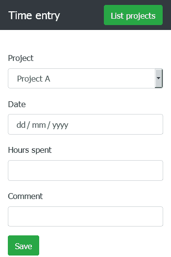
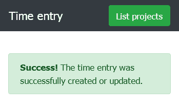
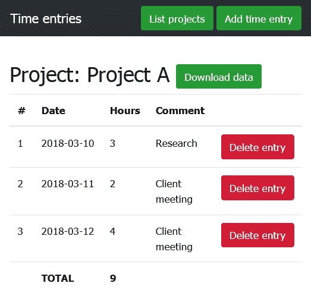
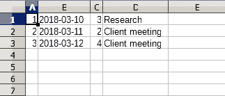

# 让您的时间跟踪应用程序能够记录每个项目花费的时间

> 原文：[`developer.ibm.com/zh/tutorials/cl-track-time-on-projects-with-ibm-cloud-2/`](https://developer.ibm.com/zh/tutorials/cl-track-time-on-projects-with-ibm-cloud-2/)

在[第 1 部分](https://www.ibm.com/developerworks/cn/cloud/library/cl-track-time-on-projects-with-ibm-cloud-1/index.html)，我解释了面向按小时计费专业人员的基于 Web 的时间跟踪工具这一概念。我向您介绍了如何构建应用程序的基本框架，并展示了用于添加、列出和编辑客户项目的业务逻辑。我还解释了如何在 IBM Cloud 上启动 MySQL 数据库实例，并将其与该工具连接起来。

在本部分（即作为结束的第 2 部分），我通过添加记录每个项目所花时间的功能来完成应用程序。我将向您展示如何检索和汇总时间条目，生成每个项目工作时数的报告，包括采用在线方式以及适用于下载和进一步处理的结构化格式。最后，我将引导您完成上传应用程序并在 IBM Cloud 上部署的步骤，这样它便处于在线状态，并且能够以 24/7 方式在云中使用。

在 GitHub 上获取[示例代码](https://github.com/vvaswani/bluemix-time-tracker)。

## 1\. 添加时间条目

第一步是为用户添加一个表单，输入在项目上花费的时间。该表单应包括以下内容的相应字段：花费小时数，花费时间的日期以及所做工作的简要说明。通过使用[第 1 部分](https://www.ibm.com/developerworks/cn/cloud/library/cl-track-time-on-projects-with-ibm-cloud-1/index.html)中显示的基本模板，并在内容区域中放置以下代码，在 *$APP_ROOT* /views/entries/save.phtml 中创建该表单：

```
<?php if (!isset($_POST['submit'])): ?>
  <form method="post"
    action="<?php echo $data['router']->pathFor('entries-save'); ?>">
    <div class="form-group">
      <label for="pid">Project</label>
      <select class="form-control" id="pid" name="pid">
      <?php foreach ($data['projects'] as $project): ?>
        <option value="<?php echo htmlspecialchars($project['id'], ENT_COMPAT, 'UTF-8'); ?>">
          <?php echo htmlspecialchars($project['name'], ENT_COMPAT, 'UTF-8'); ?>
        </option>
      <?php endforeach; ?>
      </select>
    </div>
    <div class="form-group">
      <label for="date">Date</label>
      <input type="date" class="form-control" id="date" name="date">
    </div>
    <div class="form-group">
      <label for="hours">Hours spent</label>
      <input type="text" class="form-control" id="hours" name="hours">
    </div>
    <div class="form-group">
      <label for="comment">Comment</label>
      <input type="text" class="form-control" id="comment" name="comment">
    </div>
    <div class="form-group">
      <button type="submit" name="submit" class="btn btn-success">Save</button>
    </div>
  </form>
<?php else: ?>
  <div class="alert alert-success" role="alert">
    <strong>Success!</strong> The time entry was successfully created or updated.
  </div>
<?php endif; ?> 
```

该表单包含四个字段：下拉项目选择器以及日期、小时数和描述的输入字段。请注意，将日期字段指定为 `date` 类型而不是 `text`；在兼容的浏览器中，这将通知浏览器显示日期选取器，从而更便于用户输入日期。下面是表单的外观：



接下来，添加相应的代码，以在 $APP_ROOT/public/index.php 中呈现和处理表单：

```
<?php
use \Psr\Http\Message\ServerRequestInterface as Request;
use \Psr\Http\Message\ResponseInterface as Response;

// ...

// time entry form renderer
$app->get('/entries/save', function (Request $request, Response $response, $args) {
  // query for all project records
  $projects = $this->db->query("SELECT * FROM projects");
  $response = $this->view->render($response, 'entries/save.phtml', [
    'router' => $this->router, 'projects' => $projects
  ]);
  return $response;
})->setName('entries-save');

// time entry form processor
$app->post('/entries/save[/{id}]', function (Request $request, Response $response, $args) {
  // get configuration
  $config = $this->get('settings');
  // get input values
  $params = $request->getParams();
  // check input
  $pid = filter_var($params['pid'], FILTER_SANITIZE_NUMBER_INT);
  if (!(filter_var($pid, FILTER_VALIDATE_INT))) {
    throw new Exception('ERROR: Project is not valid');
  }
  $hours = filter_var($params['hours'], FILTER_SANITIZE_NUMBER_FLOAT,
    FILTER_FLAG_ALLOW_FRACTION);
  if (!(filter_var($hours, FILTER_VALIDATE_FLOAT))) {
    throw new Exception('ERROR: Time value is not a valid number');
  }
  $comment = filter_var($params['comment'], FILTER_SANITIZE_STRING);
  if (empty($comment)) {
    throw new Exception('ERROR: Comment is not valid');
  }
  $date = $params['date'];
  if (!($date == date('Y-m-d', strtotime($date)))) {
    throw new Exception('ERROR: Date is not valid');
  }
  // save record
  if (!$this->db->query("INSERT INTO entries (pid, hours, comment, date)
    VALUES ('$pid', '$hours', '$comment', '$date')")) {
    throw new Exception('Failed to save record: ' .$this->db->error);
  }
  $response = $this->view->render($response, 'entries/save.phtml', [
    'router' => $this->router
  ]);
  return $response;
});

// ...

$app->run(); 
```

**免费试用 IBM Cloud**

利用 [IBM Cloud Lite](https://cloud.ibm.com/registration?cm_sp=ibmdev-_-developer-tutorials-_-cloudreg) 快速轻松地构建您的下一个应用程序。您的免费帐户从不过期，而且您会获得 256 MB 的 Cloud Foundry 运行时内存和包含 Kubernetes 集群的 2 GB 存储空间。

上面的清单包含两个处理程序：

*   第一个处理程序（`GET` 请求）负责呈现表单。它会对 MySQL 数据库执行 `SELECT` 查询，以检索项目列表。然后，将该列表传递给视图模板，在该模板中，该列表用于填充项目列表选择器。
*   在提交表单时，会触发第二个处理程序（`POST` 请求）。与您在[第 1 部分](https://www.ibm.com/developerworks/cn/cloud/library/cl-track-time-on-projects-with-ibm-cloud-1/index.html)中看到的项目添加/修改例程类似，它首先会清理和验证表单输入，确保所提供的日期是有效的日期，项目 ID 和小时数的格式正确，并且符合其他要求。假设所有测试都通过，此处理程序就会生成并执行 `INSERT` 查询，将新时间条目添加到 MySQL 数据库中的 `entries` 表中，并通过成功通知将控制权交回给用户。



## 2\. 列出和汇总时间条目

随着您继续记录在各种项目上花费的时间，您很快就会希望查看每个项目所花费的总时间，以便分析您投入的工作量并确保不会超出客户预算。

您可以非常轻松地添加一个处理程序，通过对数据库执行 `SELECT` 查询，列出并汇总特定项目的时间条目，如下所示：

```
<?php
use \Psr\Http\Message\ServerRequestInterface as Request;
use \Psr\Http\Message\ResponseInterface as Response;

// ...

// time entry list controller
$app->get('/entries/{id:[0-9]+}', function (Request $request, Response $response, $args) {
  $id = filter_var($args['id'], FILTER_SANITIZE_NUMBER_INT);
  // query for project name
  $projectResult = $this->db->query("SELECT * FROM projects WHERE id = '$id'");
  $project = $projectResult->fetch_object();
  // query for all time entries
  $entries = $this->db->query("SELECT * FROM entries
    WHERE pid = '$id' ORDER BY date ASC");
  $response = $this->view->render($response, 'entries/list.phtml', [
    'router' => $this->router, 'entries' => $entries, 'project' => $project
  ]);
  return $response;
})->setName('entries-list');

// ...

$app->run(); 
```

该处理程序接受 /entries/ *ID* URL 的 `GET` 请求，其中 ID 是指项目 ID。收到这样的请求后，处理程序首先会检查 `projects` 表，确保提供的 ID 引用了有效的项目。假设引用了有效的项目，那么处理程序就会使用同一个项目 ID 来返回 `entries` 表中所有关联时间条目的列表，按时间顺序排序，并将此列表传递给模板。

然后，该操作将切换至 *$APP_ROOT* /views/entries/list.phtml 模板，此模板负责以易于阅读和打印的格式显示从数据库中检索到的时间条目。该模板还负责汇总条目，得出“所花费时间”总数。以下是代码：

```
<h2>
  Project: <?php echo htmlspecialchars($data['project']->name,
    ENT_COMPAT, 'UTF-8'); ?>
  <a role="button" class="btn btn-success"
    href="<?php echo $data['router']->pathFor('entries-list',
    array('id' => htmlspecialchars($data['project']->id, ENT_COMPAT, 'UTF-8'),
    'download' => true)); ?>">Download data</a>
</h2>
<?php $count = 1; ?>
<?php $total = 0; ?>
<?php if (count($data['entries'])): ?>
<table class="table table-border table-responsive-md">
  <thead>
    <tr>
      <th>#</th>
      <th>Date</th>
      <th>Hours</th>
      <th>Comment</th>
      <th></th>
    </tr>
  </thead>
  <tbody>
  <?php foreach ($data['entries'] as $entry): ?>
  <tr>
    <td><?php echo $count; ?></td>
    <td><?php echo htmlspecialchars($entry['date'], ENT_COMPAT, 'UTF-8'); ?>
      </td>
    <td><?php echo htmlspecialchars($entry['hours'], ENT_COMPAT, 'UTF-8'); ?>
      </td>
    <td><?php echo htmlspecialchars($entry['comment'], ENT_COMPAT, 'UTF-8'); ?>
      </td>
    <td><a role="button" class="btn btn-danger"
      href="<?php echo $data['router']->pathFor('entries-delete',
      array('id' => htmlspecialchars($entry['id'], ENT_COMPAT, 'UTF-8'))); ?>">
      Delete entry</a></td>
  </tr>
  <?php $total += $entry['hours']; ?>
  <?php $count++; ?>
  <?php endforeach; ?>
  <tr>
    <td></td>
    <td><strong>TOTAL</strong></td>
    <td><strong><?php echo $total; ?></strong></td>
    <td colspan="2"></td>
  </tr>
  </tbody>
</table>
<?php endif; ?> 
```

该模板只会对时间条目列表进行迭代，并将这些时间条目显示在表的不同行中。它会持续计算所花费的时间，并在表的最后一行中显示总数。以下是输出外观的示例：



您会注意到，表中的每个条目都包含一个用于删除相应记录的链接，并且条目 ID 作为 URL 参数包含在链接中。接下来就看看这个方面。

## 3\. 删除时间条目

前一节所示列表中的每个时间条目都包含一个删除链接。/entries/delete 处理程序会处理此操作，如下所示：

```
<?php
use \Psr\Http\Message\ServerRequestInterface as Request;
use \Psr\Http\Message\ResponseInterface as Response;

// ...
// time entry deletion controller
$app->get('/entries/delete/{id}', function (Request $request, Response $response, $args) {
  $id = filter_var($args['id'], FILTER_SANITIZE_NUMBER_INT);
  if (!$this->db->query("DELETE FROM entries WHERE id = '$id'")) {
    throw new Exception('Failed to delete record.');
  }
  return $response->withHeader('Location', $this->router->pathFor('projects-list'));
})->setName('entries-delete');

// ...

$app->run(); 
```

此处并不十分复杂。该处理程序接受一个时间条目 ID，并对数据库上的相应记录执行 `DELETE` 查询。 用户在成功删除后将被重定向到项目列表页面。

[第 1 部分](https://www.ibm.com/developerworks/cn/cloud/library/cl-track-time-on-projects-with-ibm-cloud-1/index.html)简要地提到了项目删除，这由 /projects/delete 处理程序来处理。项目删除与时间条目删除类似，只需要一个额外的步骤。由于项目和时间条目通过数据库中的外键进行链接，因此必须先删除项目的所有时间条目，然后才能删除项目本身。该代码如下所示：

```
<?php
use \Psr\Http\Message\ServerRequestInterface as Request;
use \Psr\Http\Message\ResponseInterface as Response;

// ...

// project deletion controller
$app->get('/projects/delete/{id}', function (Request $request, Response $response, $args) {
  $id = filter_var($args['id'], FILTER_SANITIZE_NUMBER_INT);
  if (!$this->db->query("DELETE FROM entries WHERE pid = '$id'")) {
    throw new Exception('Failed to delete records.');
  }
  if (!$this->db->query("DELETE FROM projects WHERE id = '$id'")) {
    throw new Exception('Failed to delete record.');
  }
  return $response->withHeader('Location', $this->router->pathFor('projects-list'));
})->setName('projects-delete');

// ...

$app->run(); 
```

## 4\. 导出时间报告

在第 2 步中，您看到业务逻辑显示在某个项目上所花费工作时间的摘要报告。通常，这还不够：在很多情况下，您会希望以结构化的可下载格式输出相同的报告，也许可以通过电子邮件发送给客户，或执行更复杂的计算。

由于大部分检索和汇总个别时间条目的繁重工作已经由 /entries/ID 处理程序完成，因此您可以利用同一个处理程序生成 CSV 格式的文件，而不是 HTML 输出。以这种方式复用现有代码是 DRY（“不要重复自己”）原则的一个很好的例子，同时也为您节省了一些时间。

更新现有的 /entries/ID 处理程序以接受额外的 `download` 参数，这将触发 CSV 文件下载而不是正常的 HTML 输出，如下所示：

```
<?php
use \Psr\Http\Message\ServerRequestInterface as Request;
use \Psr\Http\Message\ResponseInterface as Response;

// ...

// time entry list controller
$app->get('/entries/{id:[0-9]+}[/{download}]', function (Request $request, Response $response, $args) {
  $id = filter_var($args['id'], FILTER_SANITIZE_NUMBER_INT);
  // query for project name
  $projectResult = $this->db->query("SELECT * FROM projects WHERE id = '$id'");
  $project = $projectResult->fetch_object();
  // query for all time entries
  $entries = $this->db->query("SELECT * FROM entries WHERE pid = '$id'
    ORDER BY date ASC");
  if (isset($args['download'])) {
    $response = $response->withHeader('Content-type', 'text/csv')
                         ->withHeader('Content-Disposition',
                          'attachment; filename="' .$id .'.csv"')
                         ->withHeader('Expires', '@0')
                         ->withHeader('Cache-Control', 'must-revalidate')
                         ->withHeader('Pragma', 'public');
    $stream = fopen('php://memory', 'r+');
    fwrite($stream, $this->view->fetch('entries/list.csv', [
      'entries' => $entries
    ]));
    return $response->withBody(new \Slim\Http\Stream($stream));
  } else {
    $response = $this->view->render($response, 'entries/list.phtml', [
      'router' => $this->router, 'entries' => $entries, 'project' => $project
    ]);
    return $response;
  }
})->setName('entries-list');

// ...

$app->run(); 
```

这个修订版本的处理程序现在可实现两个目的：没有 `download` 标志的请求将触发与之前相同的 HTML 响应，而具有 `download` 标志的请求则会创建一个自定义 Response 对象，并包含触发浏览器下载提示所需的所有头部信息。

在后一种情况下，该代码会生成一个新的 PHP 流对象，并使用新的 CSV 模板以 CSV 格式将条目列表写入该对象。位于 *$APP_ROOT* /views/entries/list.csv 中的模板如下所示：

```
<?php
$count = 1;
foreach ($data['entries'] as $entry) {
  printf(
    "%d,%s,%.2f,%s" .PHP_EOL,
    $count,
    htmlspecialchars($entry['date'], ENT_COMPAT, 'UTF-8'),
    htmlspecialchars($entry['hours'], ENT_COMPAT, 'UTF-8'),
    htmlspecialchars($entry['comment'], ENT_COMPAT, 'UTF-8')
  );
  $count++;
} 
```

然后，使用自定义 Response 对象将产生的输出流传输到浏览器。用户可以下载此输出流，并将其作为 CSV 文件保存在客户端系统上，然后在任何电子表格工具或支持 CSV 的编辑器中将其打开。以下是一个 CSV 文件的示例：



## 5\. 部署到 IBM Cloud

为连接到 ClearDB MySQL 实例，PHP 应用程序需要数据库主机名、用户名、密码和数据库名称。您已经在应用程序配置文件中指定了这些信息。但是，作为备选方法，您也可以将数据库实例连接到应用程序，并直接从 IBM Cloud 环境导入这些凭证。

1.  如果您希望使用此方法，请将以下代码添加到 $APP_ROOT/public/index.php 脚本中用于初始化数据库连接的代码行之前：

    ```
    <?php
    use \Psr\Http\Message\ServerRequestInterface as Request;
    use \Psr\Http\Message\ResponseInterface as Response;

    // autoload files
    require '../vendor/autoload.php';
    require '../config.php';

    // if VCAP_SERVICES environment available
    // overwrite local credentials with environment credentials
    if ($services = getenv("VCAP_SERVICES")) {
      $services_json = json_decode($services, true);
      $config['settings']['db']['hostname'] =
        $services_json['cleardb'][0]['credentials']['hostname'];
      $config['settings']['db']['username'] =
        $services_json['cleardb'][0]['credentials']['username'];
      $config['settings']['db']['password'] =
        $services_json['cleardb'][0]['credentials']['password'];
      $config['settings']['db']['name'] =
        $services_json['cleardb'][0]['credentials']['name'];
    }

    //... 
    ```

2.  此时，应用程序已完成，剩下的就是将其部署到 IBM Cloud 上。首先，创建应用程序清单文件，记得通过附加一个随机字符串（比如您姓名的首字母）来使用唯一的主机和应用程序名称。

    ```
    ---
    applications:
    - name: timetracker-[initials]
    memory: 256M
    instances: 1
    host: timetracker-[initials]
    buildpack: https://github.com/cloudfoundry/php-buildpack.git
    stack: cflinuxfs2 
    ```

3.  还必须配置该 buildpack 来使用该应用程序的 public 目录作为 Web 服务器目录。创建一个包含以下内容的 $APP_ROOT/.bp-config/options.json 文件：

    ```
    {
        "WEB_SERVER": "httpd",
        "WEBDIR": "public",
        "PHP_VERSION": "{PHP_70_LATEST}"
    } 
    ```

4.  您还必须加载 MySQL PHP 扩展。创建包含以下内容的 *$APP_ROOT* /.bp-config/php/php.ini.d/php.ini 文件：

    ```
    extension=mysqli.so 
    ```

5.  现在，继续将应用程序推送到 IBM Cloud：

    ```
    shell> cf api https://api.ng.bluemix.net
    shell> cf login
    shell> cf push 
    ```

6.  如果您选择从 IBM Cloud 环境导入数据库凭证，请将您之前初始化的 ClearDB 实例绑定到该应用程序，如下所示。请记得对该服务实例使用正确的 ID，以确保将正确的实例绑定到该应用程序。您可以从 IBM Cloud 仪表板获取服务 ID。

    ```
    shell> cf bind-service timetracker-[initials] "ClearDB Managed MySQL Database-[id]"
    shell> cf restage timetracker-[initials] 
    ```

您现在应该能够通过 [http://timetracker-[initials].mybluemix.net](http://timetracker-[initials].mybluemix.net) 浏览该应用程序并看到欢迎页面。如果未看到欢迎页面，可以检查[调试日志](http://vikram-vaswani.in/weblog/2015/03/19/debugging-php-errors-on-ibm-bluemix/)。

## 结束语

本文的目标是向您展示如何使用云数据库和云托管基础架构，构建一个可以完全在线运行的实用应用程序。利用 IBM Cloud 的 ClearDB 数据库服务，再加上 PHP CloudFoundry buildpack 以及某种框架，可以轻松构建数据库支持的 PHP Web 应用程序，而不必担心基础架构的安全性和可伸缩性。

如果您想了解有关本文中讨论的服务和工具的更多信息，首先可试用应用程序的实时演示版。请记住，这是一个公共演示版，因此您应该小心，不要上传机密或敏感信息。然后，从其 GitHub 存储库下载[代码](https://github.com/vvaswani/bluemix-time-tracker)，仔细观察一下它们是如何组合在一起的，并开始修改以满足您自己的需求。编码愉快！

本文翻译自：[Give your time-tracking app the ability to record the time spent per project](https://developer.ibm.com/tutorials/cl-track-time-on-projects-with-ibm-cloud-2/)（2019-04-26）