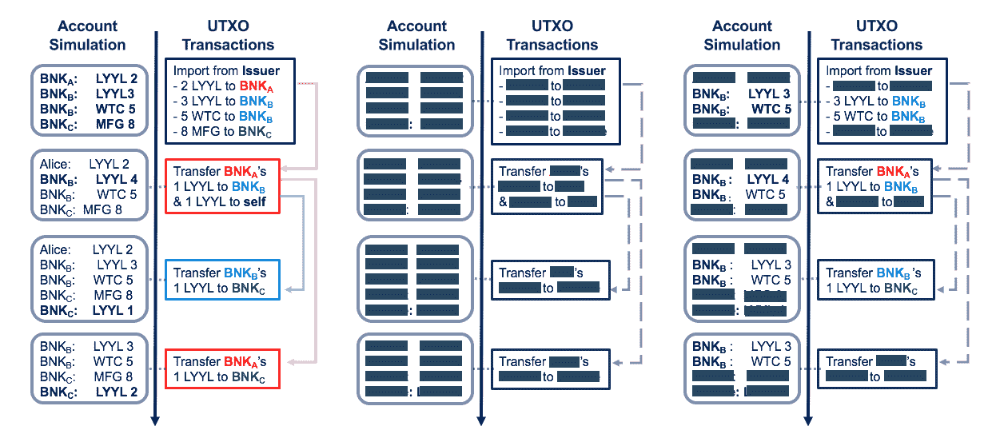

# 使用 Hyperledger Fabric 开展私密交易

> 原文：[`developer.ibm.com/zh/tutorials/cl-blockchain-private-confidential-transactions-hyperledger-fabric-zero-knowledge-proof/`](https://developer.ibm.com/zh/tutorials/cl-blockchain-private-confidential-transactions-hyperledger-fabric-zero-knowledge-proof/)

无论是在哪个行业，似乎每周都会曝出重大数据泄露新闻。这种脆弱性提高了人们对保护用户数据隐私的重要性的认识。*隐私性*被定义为每个个人或法律实体拥有的权利，用于控制他们与其环境共享其个人或商业信息的程度。

> 在诸如区块链网络这样的交易系统中，通常是通过强制实施数据保密性和交易参与者匿名性的机制来实现隐私性。

*数据保密性*机制可确保个人或组织无法访问他们未被授权访问的数据，例如，其他组织的交易机密信息。*匿名性*要求隐藏交易参与者。

区块链技术促使一些新颖的技术纷纷落地，它们有助于解决分散式环境中的隐私问题。但是，由于不同的区块链系统具有不同的隐私功能和模型，每个用例都会规定所需的最佳方法或区块链技术。

## 公共与私有区块链系统中的隐私性

像比特币这样的公共（或者说无许可）区块链系统首先就会面对隐私挑战。任何人都可参与这些系统，因此，用户行为被掩盖在虚拟假名（或“地址”）之下，用户生成这些假名代表自己进行交易。另一方面，系统的公共账本上提供了交易细节，所有内容一目了然。

在某些企业用例中，政府法规要求了解交易所涉人员，从而防止以匿名身份使用公共区块链系统（例如比特币）。此外，对于许多企业用例来说，此类系统中交易内容的公开可用可能是有问题的。为什么？假如一家企业要从供应商处购买计算机零部件。由于购买的计算机零部件数量庞大，供应商在用资产换取货币时为这家企业提供了一定的折扣。对于供应商而言，实际折扣属于敏感的商业信息，因为供应商可能不希望为购买量较少的企业提供相同的折扣。

为了应对这些挑战，一些区块链系统已被引入进来，它们基于比特币而构建。Blockstream 的机密交易和资产就是一个显著的例子。它支持以匿名方式转移硬币和资产，而不会泄露正在交换的硬币或资产类型的实际价值。ZeroCash 是另一个例子。这是一个提供更强隐私性的开放网络 — 除了隐藏所交换资产的价值 — 它还隐藏了硬币所有者以及实际交易图。但是，由于所有这些系统都面向开放网络，所以它们提供了无条件的隐私性。

许可区块链作为公共区块链的替代品而出现，用于满足企业对已知和可识别参与者的需求。它们实现了支持企业应用所需的规模性、保密性和隐私性。

## Hyperledger Fabric 中的 3 种隐私机制

[Hyperledger Fabric](https://www.hyperledger.org/projects/fabric) 是一个许可的区块链，这意味着它配备了成员资格基础架构，使网络的参与者能够在交易中强有力地认证自己，并证明执行各种系统操作（例如重新配置）的授权。从其许可性质开始，Hyperledger Fabric 提供了适应多种隐私要求的机制，具体取决于用例。

## Hyperledger Fabric 中的通道

Hyperledger Fabric 的通道架构可以在某些情况下实现隐私性。

> 通道就像一个虚拟区块链网络，它位于物理区块链网络之上，具有自己的访问规则。这些通道采用自己的交易订购机制，从而提供可扩展性，最终实现有效订购和大量数据的分区。

Hyperledger Fabric 中的通道配置了一些访问策略，用于管理通道资源（链码、交易和账本状态）的访问权限，从而专门在通道内的节点中保护了信息的隐私性和保密性。当一个节点关闭时，由于提供了到达目标的备选路径，这些通道实现了更佳的稳健性，同时还提供了可伸缩性，支持有效共享大量数据。

从隐私角度来看，通道在以下情况下十分有用：区块链网络参与者子组拥有大量共同交易（足以证明创建全新广播订购通道是合理的），并且不必依赖于该组以外实体所控制的状态，即可处理这些交易。

##### CLSNet 如何使用通道

[CLSNet](https://www.cls-group.com/products/processing/clsnet/) 是一款革命性的外汇产品，可满足外汇市场参与者更广泛的交易后处理需求。CLSNet 建立在分布式账本技术平台之上，涵盖了 CLS 核心结算业务以外的交易结算业务，同时为整个外汇市场引入标准化和自动化。

CLSNet 利用 Hyperledger Fabric 中的关键隐私和保密功能来实现其业务目标。[在此视频中了解更多信息](https://www.youtube.com/watch?v=uiHh7fKS6aU)。

牵涉大量交易的双边业务关系可以通过通道来满足其隐私要求。以计算机零部件供应商为例。该供应商可以与每个业务合作伙伴建立不同的通道，进而服务于相应的双边业务关系。当然，对于此用例，交易率应该足够高并且业务合作伙伴（以及由此产生的通道）的数量应该足够少，以便同时保持网络通道架构的可扩展性优势。借助通道访问可配置性，可通过保护整个交易，不向该通道之外的其他各方显示，进而保护供应商及其每个合作伙伴的隐私。

通道可以进一步与如下所述的 Hyperledger Fabric 中的私人交易和 Hyperledger Fabric 中的零知识证明 (ZKP) 技术结合使用，加强隐私性和保密性。

## Hyperledger Fabric 中的私人交易

私人交易提供比通道更细粒度的交易隐私。

> SecureKey Technologies 的 Verified.Me 依赖于强大的隐私和保密要求。该解决方案取决于最大限度地减少面向相关各方的数据披露和保留，同时仍保留网络行为的证据。这种平衡是基本原则，在 Hyperledger Fabric 中，通过结合运用通道与私人交易，奠定了这一基础。请观看视频，了解利用 Hyperledger Fabric 技术工作时的真正业务价值。
> 
> — SecureKey Technologies 首席执行官 Greg Wolfond

当落实引用了私有数据的交易时，存储私有数据的数据库将与公共账本一起更新。事实上，公共账本上的散列值充当可证实的数据证据。私人交易可以与匿名客户端身份认证（请参阅下一节）结合使用，以避免泄露交易创建者的身份与账本存储（散列）数据之间的连接。

出于监管或法律方面的原因，禁止私有数据位于交易各方外部的情况下，此功能特别有用。思考一个医疗行业的例子：患者的健康信息应该只在特定的时间内发布。例如，在做特定手术之前，患者的病历要在一段时间内可供专家查看。私人交易将确保数据保密性，仅允许患者和专家在特定的时间内查看信息，同时还记录数据的散列值作为交易发生的证据。通过控制谁可以访问实际的敏感数据实现了隐私性。如果除此之外还使用匿名客户端身份认证（请参阅下一节），就会加强隐私性，因为引入或更新（散列）记录的实体身份也将会被隐藏。

在私有数据更新模式也是敏感信息并可用于获取实际私有数据的情况下，应谨慎使用私人交易。尽管 Hyperledger Fabric 架构可防止未经授权即访问实际私有数据，但当（散列）私有数据条目被修改时，共享账本参与者仍可以看到。在前面的例子中，如果私有数据条目表示特定患者去医院的次数（假设患者每周都会与他或她的医生定期会面），那么此条目的更新模式可以提供有关该患者看医生原因的信息（例如，患者患有慢性疾病）。

尽管私人交易可以防止未经授权方直接访问实际私有数据，但它们并不会阻止公共账本参与者检测这类私有数据的修改时间。私有数据散列值占用账本状态下的键值条目，其更改是公开可用的。

此外，私人交易不会隐瞒允许访问私有数据的各方。这类信息会在账本上提供，以便能够正确发布私有数据。

最后，私人交易需要随附匿名客户端身份认证机制（在下一节中描述），以避免泄露交易创建者的身份与账本存储（散列）数据之间的连接。

## Hyperledger Fabric 中的零知识证明 (ZKP) 技术

利用零知识证明技术，享有秘密的一方（证明者）能够向另一方（验证者）证明其秘密满足一定的属性（知识）而不泄漏实际的秘密（零知识）。

> 零知识证明 (ZKP) 使“证明者”能够向“验证者”保证他们拥有秘密相关知识而不会泄露秘密本身。通过这种方式，展示您知道满足某种表述的某项内容，但却不显示您所知的信息。

以下是证明 ZKP 功能的一个基本示例。如果您在酒吧向保安出示您的身份证，最终就会透露您的姓名、地址和年龄。若使用 ZKP，您就可以将自己的身份证转换为另一种形式，在保留身份证的有效性并且满足酒吧年龄要求的同时隐藏您的姓名、地址和年龄。

使用 ZKP 将从两个方面实现 Hyperledger Fabric 的隐私性：通过 Identity Mixer 实现匿名客户端身份认证，以及通过零知识资产转移 (ZKAT) 实现保护隐私的资产交换。我们将在接下来的几节中介绍这两个方面。

### 使用 Identity Mixer 实现匿名客户端身份验证

Hyperledger Fabric 1.1 技术预览版中提供了 [Identity Mixer](http://hyperledger-fabric.readthedocs.io/en/release-1.1/idemix.html)，这将成为 Hyperledger Fabric 1.2 中的一项发布功能。它利用 ZKP 为其交易中的客户端提供匿名身份认证。ZKP 协议发生在 Fabric 客户端（其秘密是其实际身份以及与其关联的任何属性）与其他网络实体（例如其对等节点）之间。这些实体希望确认交易创建者是特定组织的成员（称为“成员资格证明”），或拥有一组特定的属性（称为“属性选择性披露”）。

在这两种情况下，协议均保证，除了表明相应表述是否属实之外，不会透露有关客户端身份的一切信息。

### 通过零知识资产转移 (ZKAT) 实现保护隐私的资产交换

在即将发布的版本中，Hyperledger Fabric 会将 ZKP 集成到面向资产管理的一系列更广泛的应用中。在 [Consensus 2018](https://www.coindesk.com/events/consensus-2018/) 大会上，Hyperledger Fabric 社区展示了 ZKP 的进一步演化和使用，通过审计支持（也称为零知识资产转移或 ZKAT）来适应隐私保护资产管理。它允许交易者发布资产并请求转移资产，除了表明转移行为符合资产管理规则以外，不会向公共账本透露交易资产的任何信息（即每个资产均按其所有者的要求进行转移，不会通过转移创造新的价值）。ZKAT 建立在 Identity Mixer 提供的匿名身份认证机制之上。

与区块链的其他隐私保护资产管理系统不同，ZKAT 为企业网络的需求量身定制。尤其值得注意的是，隐私保护交易的可审计性是明显不同于其他可用方案的一个关键特征。每个用户都被分配了一个特定的审计员，此人有权无限制地访问该用户的所有交易。审计员是被动的；他们可能会在事后提取审计用户参与的所有交易的机密信息，但他们无法访问任何其他方的数据。

现有的区块链系统目前采用了三种隐私资产管理模型（仅基于未花费的交易输出模型）。下图中对此进行了解释，其中三家银行（A 银行、B 银行和 C 银行）在区块链上交易三种资产（涉及 Loyyal、Water Canary 和 MUFG）。

在该图中，左侧的模型无隐私机制。中间的模型支持完全隐私性，隐藏交易参与者的身份和交易资产细节。右边的模型展示了 ZKAT 的安全审计能力，分配给特定银行的审计员可以无限制访问该银行涉及的所有交易。

支持审计的隐私性在金融用例中尤为有用。银行通过高于他们所获得的资金成本的利率贷款来赚钱。因此，如果一家银行使用的区块链网络应用了这种先进的 ZKP 功能，那么他们可能想要在不泄露交易事实的同时，与交易人交换资产（金钱），并在共享账本中记录相应的交易，或交易中交换的资产数目。如果不这样做，显然会危及他们的保密规定，并暴露他们的业务模式。

凭借零知识证明，可在账本上显示交易，并包含表明资产（金钱）已经交换的可供核实的证据，而不会泄露贷款利率或银行交易的数量以及交易方，这样银行就能够在任何特定时间了解其现金的流动性。Hyperledger Fabric 的额外优势是现在可以基于 ZKAT 对其进行审计。

## 与其他区块链技术的区别

在 Hyperledger Fabric 许可的区块链上实现的用于资产管理的零知识证明协议是最先进的。强大的隐私支持不仅确保了交易参与者的匿名性，而且实现了从一方转移到另一方的资产的完全不可链接性（即隐藏 UTXO 图）。

另外，这些协议还可根据许可系统的需求量身定制。考虑到个人用户的长期身份，为用户参与交易提供强有力的问责制和不可抵赖性，并为区块链中发布的隐私保护交易提供强大而安全的审计功能。Hyperledger Fabric 协议支持审计模式，可将审计员分配给系统中的一个或多个用户，但他们不会涉及交易。仅给出存储在区块链中的交易日志，这些协议即可保证审计人员日后能够审计分配给他们的用户的交易。

在偏技术层面上，Hyperledger Fabric 中的协议依赖于标准的加密假设，并展示了一个可易于分散化的轻量级设置。最后一点也非常重要，它们证明了持续不断的交易创建和验证时间，这些内容并不依赖于已提交到账本的交易数量。

## 结束语

在过去的几年里，区块链已经成为许多行业公认的游戏规则颠覆者。随着更多许可的 DLT 投入生产，2018 年将继续为您带来最先进的隐私性和保密性增强功能。在本文中，我们讨论了现有区块链系统中的隐私功能和它们最适合的用例，以及即将在 Hyperledger Fabric 中提供的全新增强功能。

根据您的网络对隐私性和保密性的需求，应用程序开发人员可能会选择实现 Hyperledger Fabric 通道、私人交易和/或不同级别的零知识证明，包括使用 Identity Mixer 实现匿名客户端身份认证，以及通过审计支持实现隐私保护资产管理（零知识资产转移，ZKATH）。Hyperledger Fabric 为许可的企业区块链带来了一个崭新的公平竞争环境。

## 后续行动

*   IBM Blockchain 在 Hyperledger Fabric 上运行。让全新的 IBM Blockchain Platform Starter Plan 帮助您[**开始构建自己的区块链网络**](https://www.ibm.com/developerworks/cn/cloud/library/cl-ibm-blockchain-101-quick-start-guide-for-developers-bluemix-trs/index.html)。

*   时刻关注面向开发人员的区块链每月新闻快讯。查阅[**最新一期**](http://ibm.biz/blockchain-newsletter)并[**订阅**](http://ibm.biz/blockchain-newsletter-signup)。

*   查阅许多 [**Code Pattern**](https://developer.ibm.com/cn/patterns/)，它们为解决区块链技术中遇到的复杂问题提供了路线图，并包括架构图、代码存储库和其他阅读材料。

*   访问[**区块链开发人员中心**](https://developer.ibm.com/cn/blockchain/)。可以在这里获得开发和部署商业区块链解决方案的免费工具和教程，以及代码和社区支持。

本文翻译自：[Private and confidential transactions with Hyperledger Fabric](https://developer.ibm.com/tutorials/cl-blockchain-private-confidential-transactions-hyperledger-fabric-zero-knowledge-proof/)（2018-05-11）