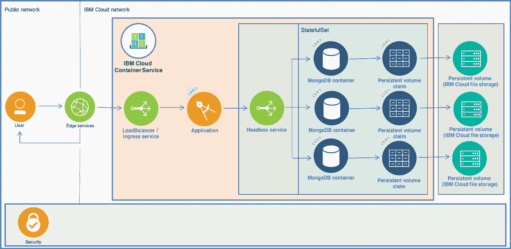

# 使用 IBM Cloud Kubernetes Service 部署一个 MongoDB 副本集

> 原文：[`developer.ibm.com/zh/tutorials/cl-deploy-mongodb-replica-set-using-ibm-cloud-container-service/`](https://developer.ibm.com/zh/tutorials/cl-deploy-mongodb-replica-set-using-ibm-cloud-container-service/)

开发社区的一些人表达了对 Docker 容器和 Kubernetes 的担忧，尽管它们各自有着明显的优点，但它们无法很好地协同工作。在本文中，我将解释 Kubernetes 开发人员如何通过引入 **StatefulSets** 来应对这些担忧。在本教程中，我将介绍如何在基于 Kubernetes 的 IBM Cloud Kubernetes Service 中部署一个 MongoDB 副本集。在此过程中，我将概述 MongoDB 的集群需求，并展示如何部署 Kubernetes StatefulSets。最后，我提供了一些关于在生产环境中使用这些工具的建议。

## 您需要做的准备工作

**免费试用 IBM Cloud**

通过 [IBM Cloud Lite](https://cloud.ibm.com/registration?cm_sp=ibmdev-_-developer-tutorials-_-cloudreg) 快速轻松地构建您的下一个应用程序。您的免费帐户永不过期，而且您会获得 256 MB 的 Cloud Foundry 运行时内存，以及包含 Kubernetes 集群的 2 GB 存储空间。

本文需要至少拥有以下工具的入门知识：

*   [MongoDB](https://www.mongodb.com/)
*   [Docker](https://www.docker.com/)
*   [Kubernetes](https://kubernetes.io/)
*   使用 [IBM Cloud Kubernetes Service](https://www.ibm.com/cloud/container-service) 创建一个 Kubernetes 集群
*   [一个 IBM Cloud 帐户](https://cloud.ibm.com/registration?cm_sp=ibmdev-_-developer-tutorials-_-cloudreg) （至少应该是一个“即用即付”帐户；Lite 帐户无法使用 IBM Cloud File Storage 产品创建持久卷）

如果您对这些技术有更深入的了解，并且希望直接跳到部署指令部分，请转到“第 1 步.在 IBM Cloud Kubernetes Service 上创建 MongoDB 副本集”。

## 简介：两个考虑因素

在 Andrew Morgan 的博客文章“[通过 Docker 和 Kubernetes 以微服务形式运行 MongoDB](https://www.mongodb.com/blog/post/running-mongodb-as-a-microservice-with-docker-and-kubernetes)”中，他列出了通过容器和编排技术（比如 Kubernetes）来运行 MongoDB 的考虑因素。特别值得注意的是以下几点：

*   MongoDB 数据库节点是*有状态*的。
*   一个副本集中的 MongoDB 数据库节点必须相互通信，包括在重新调度后（即创建新节点时）。

那些至少拥有 Docker 入门知识的人可能会认识到，第一个考虑因素与 Docker 容器的一条基本原则相悖，Docker 的指南规定“容器应该尽可能*短暂*”，而不是有状态。此外，试图向 Docker 容器添加状态很有挑战性。如果做得不好，可能会破坏 Docker 容器的另一条设计原则 — 即“快速、一致地交付应用程序”。

Morgan 的第二个考虑因素与容器网络相关，特别是主机名方面，因为容器的实例（“pod”）在自动重新调度后，会自动销毁并使用新主机名进行重建。因此，尽管 Kubernetes 的一些特性使其成为一个有吸引力的系统，可用来自动化部署、扩展和管理容器化的应用程序，但这可能会破坏容器间的通信。

考虑到这些事实，许多架构师没有将 Docker 容器和 Kubernetes 视为提供 MongoDB 副本集的方法，尽管这些技术存在一些内在优势。为了解决这些问题，Kubernetes 社区引入了 **StatefulSets**。

## Kubernetes StatefulSets

StatefulSets 是在 Kubernetes V1.5 中作为 beta 资源引入的，在 V1.9 中已稳定下来并广泛提供。它们是专为管理诸如 MongoDB 之类的有状态应用程序而设计的。

Kubernetes 文档表明：

> *就像部署一样，一个 StatefulSet 可以管理基于相同容器规格的 Pod。与部署不同的是，一个 StatefulSet 可为每个 Pod 维护一个永久身份。这些 pod 是根据同一种规格来创建的，但无法互换：每个 pod 都会在任何重新调度后保持着一个永久身份。*

至关重要的是，StatefulSets 提供的（5 个）重要特性中的两个与通过 Docker 和 Kubernetes 以微服务形式运行 MongoDB 的考虑因素相关：

*   稳定、持久的存储
*   稳定、唯一的网络标识符

简言之，这意味着通过使用一个 MongoDB Docker 容器，可以在 Kubernetes 内定义一个能为 MongoDB 副本集节点自动创建和附加持久存储的 StatefulSet 配置。无论新创建多少个节点，每个节点都可以使用一个唯一、已知的网络名称来找到这个副本集节点。

## 在 IBM Cloud Kubernetes Service 中使用 StatefulSets

考虑到 MongoDB 的主要目的是提供对所存储数据的访问，所以基础持久存储的特征能够满足应用程序或业务的各种非功能需求至关重要。

例如，许多应用程序都需要可预测的。企业或政府要求还可能规定，应用程序存储需要在静止时加密，或者需要通过复制来实现冗余（尽管 MongoDB 具有内在的复制特性）。

默认情况下，IBM Cloud Kubernetes Service 被配置为使用 IBM Cloud 的基于的文件存储产品，即持久存储和性能存储。该服务提供了 8 种预定义的存储类，所以集群管理员不需要创建任何这些类。

使用 StatefulSets 时，配置会根据应用程序或业务需求来选择一种现有的存储类；而且没有什么更多的要求。

IBM Cloud File Storage 产品提供了众多优势，包括：

*   基于闪存的存储
*   静止数据加密
*   快照和副本
*   卷复制
*   可扩展的卷
*   可调节的 IOPS

**备注：**IBM Cloud Kubernetes Service 工作节点默认情况下使用加密的 SSD。

### 第 1 步.在 IBM Cloud Kubernetes Service 上创建 MongoDB 副本集

用于 IBM Cloud Kubernetes Service 的配置与其他 Kubernetes 提供者使用的配置几乎没有区别。这是对 Kubernetes 提供者进行投资的众多原因之一。唯一的真正区别是 `storageClassName` 值。

**备注：**假设您已创建了一个 Container Service 集群。要获得关于如何创建 IBM Cloud Kubernetes Service 集群的详细信息，请参阅 IBM Cloud Kubernetes Service 文档中的“[设置集群](https://cloud.ibm.com/docs/containers?topic=containers-clusters#clusters)”。

**备注：**确保您的集群至少运行着 Kubernetes V1.9.2。为此，可以将 `--kube-version 1.9.2` 传递给集群创建命令，或者更新一个现有的集群和它的工作节点（参见 [IBM Cloud 文档](https://cloud.ibm.com/docs/containers?topic=containers-update#update)）。

完成本节后，您会在 IBM Cloud Kubernetes Service 中运行的 Kubernetes 集群中创建一个 3 节点 MongoDB 副本集。这利用了 IBM Cloud File Storage 产品来实现持久卷。

下图演示了要创建的 3 个主要组件，以及它们在一次完整的应用程序部署中的合理位置，包括：

*   无头服务
*   StatefulSet，包括 MongoDB 容器和关联的持久卷声明
*   持久卷 (IBM Cloud File Storage)

##### 3 节点 MongoDB 副本集的主要组件



**备注：**本文不会介绍 Edge Services、Security、LoadBalancer/Ingress Service 和 Application 组件。有关如何将应用程序部署在集群中的详细信息，包括公开应用程序的网络选项，请参阅文档中的“[规划外部网络](https://cloud.ibm.com/docs/containers?topic=containers-cs_network_planning#planning)”。

### 第 2 步.创建无头服务配置文件

Kubernetes 无头服务可以控制 pod 的*域*，不需要负载平衡器服务或像其他 Kubernetes 服务类型一样公开 IP 地址。这可以确保与服务 `selector` 匹配的 pod 被分组到一起。

对于无头服务，请创建下面这个配置文件：

##### mongo-headless-service.yaml

```
apiVersion: v1
kind: Service
metadata:
  name: mongo
  labels:
    app: mongo
spec:
  ports:
  - name: mongo
    port: 27017
    targetPort: 27017
  clusterIP: None
  selector:
    app: mongo 
```

创建无头服务时将 `clusterIP` 值设置为 `None`（第 12 行）。

确保对 `targetPort` 使用了合适的端口号（第 11 行）。该端口号应该与下面第 3 步中的 StatefulSet 配置中使用的值（第 37 行）相匹配，这是 mongod 服务使用的端口。默认情况下，该端口为 `27017`。用于 `port` 参数的值将是任何 MongoDB 客户端用于连接该服务的端口。

### 第 3 步.创建 StatefulSet 配置文件

对于 StatefulSet，请创建下面这个配置文件：

##### mongo-statefulset.yaml

```
apiVersion: apps/v1
kind: StatefulSet
metadata:
  name: mongo
spec:
  selector:
    matchLabels:
      app: mongo
  serviceName: "mongo"
  replicas: 3
  podManagementPolicy: Parallel
  template:
    metadata:
      labels:
        app: mongo
    spec:
      terminationGracePeriodSeconds: 10
      affinity:
         podAntiAffinity:
           requiredDuringSchedulingIgnoredDuringExecution:
           - labelSelector:
               matchExpressions:
               - key: "app"
                 operator: In
                 values:
                 - mongo
             topologyKey: "kubernetes.io/hostname"
      containers:
      - name: mongo
        image: mongo
        command:
        - mongod
        - "--bind_ip_all"
        - "--replSet"
        - rs0
        ports:
        - containerPort: 27017
        volumeMounts:
        - name: mongo-data
          mountPath: /data/db
  volumeClaimTemplates:
  - metadata:
      name: mongo-data
    spec:
      accessModes: [ "ReadWriteOnce" ]
      storageClassName: ibmc-file-bronze
      resources:
        requests:
          storage: 20Gi 
```

**备注：**`Affinity` 部分（第 18-27 行）可以确保*没有*安排某个 MongoDB 副本集 pod 在已运行 pod 的集群工作节点上运行。如果所有 3 个节点都在单个工作节点上运行而工作节点发生故障，则这么做会引入潜在的故障点。

创建配置后，是时候部署资源了。

### 第 4 步.部署该服务和 StatefulSet

要部署无头服务和 StatefulSet，只需使用 IBM Cloud CLI、`Bluemix` 或 `bx`，并使用 Kubernetes CLI `kubectl` 来执行 `kubectl` 命令。

1.  首先，登录到 IBM Cloud CLI：

    ```
     $ bx login 
    ```

2.  然后，在 CLI 中设置集群的上下文：

    ```
     $ $(bx cs cluster-config sandbox-cluster | grep KUBECONFIG) 
    ```

3.  接下来，执行以下命令（第 1 和第 4 行）。预期输出如下所示。

    ```
     $ kubectl apply -f mongo-headless-service.yaml
        service "mongo" created

        $ kubectl apply -f mongo-statefulset.yaml
        statefulset "mongo" created 
    ```

    **备注：**如果需要，可以将无头服务和 StatefulSet 的配置文件合并到一个文件中，使用一个包含“`---`”的行来分隔它们的配置。

4.  要进行确认，请使用以下命令（第 1 和第 5 行）`获取`每个对象。每个对象的预期输出如下所示。

    ```
     $ kubectl get service mongo
        NAME    TYPE        CLUSTER-IP   EXTERNAL-IP   PORT(S)     AGE
        mongo   ClusterIP   None         <none>        27017/TCP   5s

        $ kubectl get statefulset mongo
        NAME    DESIRED   CURRENT   AGE
        mongo   3         3         1m 
    ```

5.  部署 StatefulSet 后，Kubernetes 负责创建 pod，根据规范为 pod 命名（例如 `mongo-0`、`mongo-1`、`mongo-2`）。要列出自动创建的 pod，请使用 pod 标签 `app=mongo` 来 `get` pod 对象，如下所示：

    ```
     $ kubectl get pod -l app=mongo
        NAME      READY     STATUS    RESTARTS   AGE
        mongo-0   1/1       Running   0          30s
        mongo-1   1/1       Running   0          30s
        mongo-2   1/1       Running   0          30s 
    ```

6.  此外，Kubernetes 负责创建持久卷声明 (pvc) 并将持久卷绑定到 pod。要列出持久卷声明，请执行 `get` 命令获取 pvc 对象，如下所示：

    ```
     $ kubectl get pvc
        NAME                 STATUS    VOLUME                                     CAPACITY   ACCESS MODES   STORAGECLASS       AGE
        mongo-data-mongo-0   Bound     pvc-3ed73cf3-0940-11e8-ac45-925e6fdab1e7   20Gi       RWO            ibmc-file-bronze   1m
        mongo-data-mongo-1   Bound     pvc-3ed82f17-0940-11e8-ac45-925e6fdab1e7   20Gi       RWO            ibmc-file-bronze   1m
        mongo-data-mongo-2   Bound     pvc-3ed90d7e-0940-11e8-ac45-925e6fdab1e7   20Gi       RWO            ibmc-file-bronze   1m 
    ```

    每个 MongoDB 副本集节点现在都已创建为可以（在内部）通过 DNS 寻址的 Kubernetes pod，并绑定到它们自己的持久存储。

    具体来讲，每个 pod 的内部 Kubernetes DNS 主机名都统一使用 StatefulSet 名称与附加的 pod 编号的组合，也即：

    ```
    $(statefulset name)-$(ordinal) 
    ```

    此外，通过使用无头服务，域管理的服务具有以下格式：

    ```
    $(servicename).$(namespace).svc.cluster.local 
    ```

7.  最后，可以使用以下子域模式来引用 pod：

    ```
    $(podname).$(servicename) 
    ```

    例如，使用所提供的配置时，可以使用以下 DNS 名称来引用每个 MongoDB 节点：

    ```
    mongo-0.mongo, mongo-1.mongo,mongo-2.mongo 
    ```

持久存储被配置为可通过每个 pod 内的 `/data/db` 挂载路径进行访问，并在默认情况下使用 IBM Cloud File Storage 产品。如果销毁了一个 pod，任何未来的同名 pod 会自动挂载到相同的持久存储上（除非该持久存储声明被手动销毁）。

现在只剩下使用每个节点来初始化副本集了。

### 第 5 步.启动并配置 MongoDB 副本集

创建每个 MongoDB 副本集节点后，副本集本身需要启动和配置。为此，访问第一个节点并运行一系列 `mongo` 命令。

**备注：**可以将这些命令编写为 CI/CD 流程的一部分，也可以增加或删除新节点。

1.  首先，在第一个副本集节点上执行 MongoDB shell：

    ```
     $ kubectl exec -it mongo-0 -- mongo 
    ```

2.  现在，启动 MongoDB 副本集：

    ```
     > rs.initiate() 
    ```

3.  为副本集的第一个成员重新配置正确的 DNS 名称：

    ```
     > var cfg = rs.conf();cfg.members[0].host="mongo-0.mongo:27017";rs.reconfig(cfg) 
    ```

4.  添加剩余的副本集节点：

    ```
    rs.add("mongo-1.mongo:27017")
    rs.add("mongo-2.mongo:27017") 
    ```

5.  最后，检查新配置，以确认该副本集：

    ```
    > rs.status() 
    ```

新配置会显示 3 个成员，它们的主机名有一个对应的“`_id`”值。

MongoDB 副本集现在已启动和配置。此刻，MongoDB 副本集已基本准备好供在同一个 Kubernetes 命名空间中运行的客户端应用程序访问。

**备注：**要从 Kubernetes 集群*外*访问 MongoDB 副本集，需要一个 Kubernetes “NodePort”或“LoadBalancer”类型的服务。要获得关于如何规划外部网络的更多细节，请参阅 [IBM Cloud Kubernetes Service 文档](https://cloud.ibm.com/docs/containers?topic=containers-cs_network_planning#planning)。

使用本文中提供的配置时，MongoDB 副本集 URI 连接字符串为：

```
mongodb://mongo-0.mongo:27017,mongo-1.mongo:27017,mongo-2.mongo/myproject?replicaSet=rs0 
```

### 生产考虑因素

应该将本文视为*入门*指南。在生产中使用 Kubernetes 运行 MongoDB 时，有更多考虑因素，其中大部分已在其他文章和博客中介绍过。未来的文章将提供特定于 IBM Cloud Kubernetes Service 产品的操作说明。

例如，建议您在生产过程中使用所提供的配置时考虑以下情况（参见下面的“相关主题”了解这些主题的更多信息）：

*   身份验证 (mongoDb)
*   不以根用户身份运行
*   使用 MongoDB Enterprise Edition (mongoDb)
*   对集群分区 (mongoDb)
*   解决最大量的成员 (mongoDb)
*   管理计算资源 (Kubernetes)
*   使用 IBM Container Registry (IBM Cloud) 在一个高度可用的、可扩展的架构中安全地存储和访问私有 Docker 映像

## 结束语

本文演示了在基于 Kubernetes 的 IBM Cloud Kubernetes Service 中如何部署一个 MongoDB 副本集的可能性。

我演示了通过使用 Kubernetes StatefulSets，您可以解决使用容器技术来运行 MongoDB 的许多问题，从而实现 Kubernetes 所提供的优势。

此外，我还谈到了使用 IBM Cloud Kubernetes Service 的优势，特别是重点介绍了支撑该服务的 IBM Cloud File Storage 产品。

最后，按照本文所提供的操作说明，您可以在几分钟内在 IBM Cloud Kubernetes Service 上创建一个 MongoDB 副本集，为开发和测试环境奠定基础。在考虑更多因素之后，也可以实现一个生产环境。

本文翻译自：[Deploy a MongoDB replica set using the IBM Cloud Kubernetes Service](https://developer.ibm.com/tutorials/cl-deploy-mongodb-replica-set-using-ibm-cloud-container-service/)（2018-05-28）