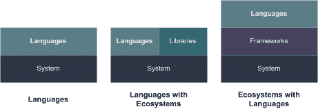

# 数据科学语言

> 原文：[`developer.ibm.com/zh/tutorials/ba-intro-data-science-4/`](https://developer.ibm.com/zh/tutorials/ba-intro-data-science-4/)

编程语言和环境为解决问题奠定了基础，但并非所有语言都生来平等。 `C` 和 `C++` 语言通常用于高性能数据分析，而 Python 之类的语言则可以帮助程序员更加富有成效地解决眼前的问题。大数据处理具有自己的框架和语言，科学语言也是一样。本文探讨用于数据科学领域的一些关键语言以及它们的优势。

从实际来看，任何编程语言都可用于数据科学。但是，一些语言在这个领域会比其他语言更为实用。事实上，人们发现某些语言在这个领域非常实用，以致于促进了数据科学特性的逐步发展，进而也使它们变得更加适用。在本文中，我将用于数据科学的语言划分为三类，然后探讨每个类别中使用的一些语言。 数据科学语言类别 中显示了这些类别。

##### 数据科学语言类别

*语言* 是指可用于但不一定专门用于数据科学领域的编程语言。 *伴随生态系统的语言* 是指伴随生态系统而发展的语言，生态系统中包含使它们适用于数据科学的库和工具。最后， *伴随语言的生态系统* 是指支持一种或多种语言来实现数据科学应用的专用框架。

## 语言

[`C` 语言](https://gcc.gnu.org/) 是通用语言，适用于各种应用（最初开发目的是用于系统编程）。它是我过去 31 年来一直都在使用的主要语言，主要用于裸机固件开发领域。 `C` 语言适用于数据科学的原因有两点：它是备受欢迎的常用语言，拥有庞大的开发人员使用群体，因为其编程模型较为低级，可以列为性能最好的语言之一。实际上，我们后续讨论的许多语言都会绑定 `C` 语言，用于提高性能。

`C` 语言支持数值库和源，这些可以增强其执行数据科学任务的能力，不过与 Python 等语言相比就相形见绌了。可 `C` 语言的贡献远不止于此，您会发现我们稍后探讨的一些语言（R、Julia、Python）至少在一定程度上使用了 `C` 语言才得以实现。

## 伴随生态系统的语言

这一类是指语言的生态系统为其连同库和工具一起演变的语言，使它们成为了独一无二的数据科学应用开发选择。这一类中的主要语言包括 Python、R、Julia，当然还有 Fortran。

### Python

最受欢迎的数据科学语言就是 [Python 语言](https://www.python.org/) 。Python 是多范式语言，最初用作为编程学习语言。它是许多人最先学习的语言之一，因此一直延续着上述的最初意图，但是 Python 成为最受欢迎的语言不仅是因为它容易学习，而且它还是一个可以开发一流程序的语言。您可以通过交互方式使用 Python，使入门和学习起来轻松自如。

Python 真正大放异彩的地方就是数据科学领域。Python 包含用于数据科学领域的最广泛的库集合，由此使之成为理想之选。四个最实用的库包括：

*   [SciPy](https://www.scipy.org/) ：一系列针对 Python 的科学计算工具，提供诸多高效的数值例程，涵盖优化、集成、插值和线性代数功能
*   [NumPy](http://www.numpy.org/) ：在 Python 中增加对大型多维数组和矩阵的支持，包含多个用于这些结构的数学函数
*   [`scikit-learn`](http://scikit-learn.org/stable/) ：Python 库，包含各种机器学习算法，比如支持向量机、随机森林以及主成分分析法
*   [自然语言工具包](http://www.nltk.org/) ：一个 Python 模块，用于构建 Python 程序，与作为数据的人类语言协同工作

### R 编程语言

R 既是一种编程语言，也是一个用于统计计算的交互式（文本和图形）环境。R 最早出现于 20 世纪 90 年代初，但是其功能和受欢迎程度一直在稳步发展。您可以使用 R 语言做批处理，R 程序会以交互方式执行，允许逐步定义和测试 R 程序。R 语言是多范式语言，支持面向过程方法和面向对象方法。

与 Python 类似，R 语言的优势在于其外部程序包所提供的功能。您可以安装 R 语言和一组核心程序包，但是通过 [Comprehensive R Archive Network](https://cran.r-project.org/) 可以使用超过 11000 个程序包。大部分 R 程序包都是使用 R 语言开发的，但也可以使用 `C` 、Java™ 以及 Fortran 语言进行开发。此外，也可以使用基于 R 语言的专用环境，比如 [Bioconductor](https://www.bioconductor.org/) ，主要用于分析基因组数据。

### Julia

[Julia](https://julialang.org/) 是新生的数据科学编程语言，最早出现于 2009 年。它的关注点在于高性能计算科学，支持面向过程，面向对象和函数式范式。Julia 是动态编程语言，采用参数多态形式（可以抽象编写函数，在不同的类型上运行），但是也旨在支持并行计算和分布式计算。Julia 通过消息传递集成了多处理环境，支持 Julia 程序在独立内存域的多个进程中运行。

Julia 包含自己的 [程序包管理器](https://pkg.julialang.org/) ，目前支持 1700 多个程序包。这些程序包使用 Julia、 `C` 以及 Fortran 语言编写，涵盖数据科学的所有领域。 Julia 允许通过自己的 [PyCall 程序包](https://github.com/JuliaPy/PyCall.jl) 调用 Python 函数，还可以直接调用 `C` 函数，无需借助包装器或专用应用编程接口。

### Fortran

最后，在数据科学开发的高性能计算与科学角落，还会用到 [Fortran](https://gcc.gnu.org/fortran/) ，这种语言也同样重要。Fortran 是通用的命令式编程语言，最初由 IBM 开发用于替代低级汇编语言进行编程。Fortran 是 1954 年在”Specifications for the IBM Mathematical FORmula TRANslating System”中定义的。这种方法最初主要用于 IBM® 704 大型机，但是 Fortran 时至今日仍在不断修改（接下来的修订版将命名为”Fortran 2018”）。

Fortran 继续见证着数值库的发展和延续。一些最受欢迎的数值软件工具内部继续使用 Fortran 的 [线性代数程序包](http://www.netlib.org/lapack/) ，这说明了 Fortran 持续存在的影响力。Fortran 可能不是开发新型数据科学应用的第一选择，但是它的发展势头和性能继续推动着这种语言在该领域明确占据一席之地。

## 伴随语言的生态系统

伴随语言的生态系统类别由出于数据科学应用开发目的而支持多种语言的生态系统构成。在本部分，我会探讨 Hadoop、Spark 和 Jupyter。

### Apache Hadoop

[Apache Hadoop](https://hadoop.apache.org/) 是一种开源数据处理框架，在处理节点集群上运行。Hadoop 涵盖作业处理和分布模型，以及设计时考虑到故障的存储架构（Hadoop 架构的一种设计宗旨）。Hadoop 使用名为 *MapReduce* 的专用处理模型。

MapReduce 是简单有效的大型数据集处理解决方案，先将数据集的各个片段分布到集群中的不同节点，然后再并行处理。MapReduce 模型包含两个基础部分 — Map 和 Reduce — ，它们是在集群中并行对数据进行操作的函数。Map 函数对数据集子集的键值对进行操作，然后产生零个或多个键值对（称之为 *中间键值对* ）。Reduce 函数随后会接受中间键值对，并对指定键的值进行迭代。从 Reduce 步骤会得到零个或多个键值对。

MapReduce 的典型示例就是”字数统计”程序。Map 步骤为数据集中的每个单词创建键值对，生成为 1 的值（因为键值对表示这个单词或键的一个实例）。然后，Reduce 步骤会对中间键值对进行迭代和求和。结果会得到一组表示每个单词（键）总数（值）的键值对。这是个简单示例，但是您可以将这种模式应用于解决各种问题的一系列方法中。

您可以在 Hadoop 中使用各种语言编写这些 Map 和 Reduce 函数（该框架本身使用 Java 语言和 `C` 语言编写而成）。可以使用 Java、Perl、Python、Erlang、Haskell、Smalltalk、OCaml 以及其他语言编写 MapReduce 函数。可以在 IBM Analytics 中找到 [关于 MapReduce 模型的详尽描述](https://www.ibm.com/analytics/hadoop/mapreduce) 。

您甚至还可以使用 [Apache Pig](https://pig.apache.org/) 语言编写更为简单的 MapReduce 应用，这种语言可以自动分解脚本，进行 MapReduce 处理。Hadoop 通过 [Apache Mahout](https://mahout.apache.org/) （该项目实现线性代数和统计库）等项目支持各种算法，包括机器学习算法，用于进行分类和建立集群。

### Apache Spark

[Apache Spark](https://spark.apache.org/) 和 Hadoop 类似，是用于大规模分布式数据处理的开源框架。Spark 最初由加利福尼亚大学伯克利分校开发，不过后来捐赠给了 Apache 软件基金会，是该基金会的顶级 Apache 项目。但是 Spark 和 Hadoop 之间有一些不同。首先，Spark 使用 [Scala](https://www.scala-lang.org/) （一种函数式语言）开发，而 Hadoop 则使用 Java 和 `C` 语言开发。Hadoop 还在服务器文件系统之上实现了自己的文件系统（名为 *Hadoop Distributed File System* [HDFS]），而 Spark 则依赖于 HDFS 进行分布式存储。

Spark 和 Hadoop 之间的不同主要在于它们处理数据的方式。Hadoop 主要是批量处理系统，而 Spark 则支持流式和实时数据分析。Spark 也支持数据的内存中处理，而不是单纯依靠磁盘，这使得 Spark 灾备分布式数据集可以保存在内存中，同时最大限度减少磁盘 I/O，避免降低分析性能。与 Hadoop 相比，Spark 声称能将应用运行速度提高 100 倍（使用内存中处理），或者将应用在磁盘上的运行速度提高 10 倍。

您可以使用 Scala、Java、Python 甚至 R 语言为 Spark 开发数据科学应用。Spark 还包含机器学习库，它实现了大量机器学习算法。

### Jupyter

我要探讨的最后一个生态系统是 [Jupyter](http://jupyter.org/) 。Jupyter 是一个表示笔记本的开源 Web 应用，包含支持实时元素的实时代码、可视化内容、等式以及文本。这个实时笔记本值得注意的一点是，您可以构建交互式文档，然后通过共享与他人协作。

Jupyter 包含服务器和客户端，其中客户端只是一个在浏览器中运行的 JavaScript 应用。该服务器充当交互式笔记本，作为 HTML 文档呈现给客户端浏览器。这些笔记本实现各种数据科学应用，从统计建模和可视化到数据清理和机器学习等，皆涵盖在内。

Jupyter 是一个生态系统，因为它实现了交互式笔记本，但是该笔记本中执行的代码可以来自于多种语言。现在，Jupyter 支持 Python、Julia、R、Haskell、Ruby 等语言。 您甚至可以通过 [简单教程](http://jupyter.org/try) 以 Python、Julia 或 R 语言学习 Jupyter。

## 结束语

数据科学的语言博大精深，既包括 Fortran 和 `C` 等较为古老的语言，也包括 R、Scala 以及 Julia 等最新的多范式语言。Python 仍然是数据科学领域的佼佼者，因为已为其开发了大量的库，但是每种语言及其相关的生态系统（比如，Jupyter 生态系统）都有助于轻松构建数据科学应用，实现与他人协作和共享。

本文翻译自：[The languages of data science](https://developer.ibm.com/tutorials/ba-intro-data-science-4/)（2018-05-29）