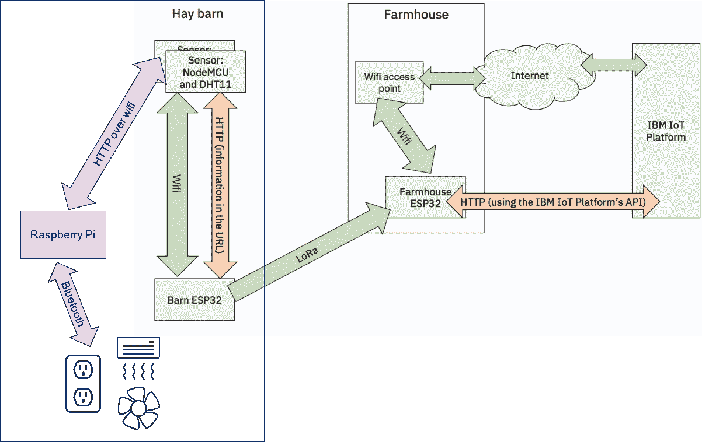

# 将边缘分析集成到 IoT 解决方案中

> 原文：[`developer.ibm.com/zh/tutorials/iot-edge2/`](https://developer.ibm.com/zh/tutorials/iot-edge2/)

在本系列的第一篇文章“[将 LPWAN 网络集成到 IoT 解决方案中](https://www.ibm.com/developerworks/cn/iot/library/iot-lpwan-lora-nodemcu-dhtsensors/)”中，您学习了如何监控干草谷仓的湿度和温度来识别危险情况。但是，识别仅是解决方案的一部分。理想情况下，您想要自动修复这些情况。因为网络连接可能很慢、不稳定，甚至不存在，所以应该在网络“边缘”的谷仓中执行分析，以确定应该采取何种措施。

可以使用两个设备来执行这种边缘分析，两个设备都由一个智能插座供电：

*   一个风扇（在温度较高时使用，但在温度太高时不能使用，因为这意味着会扇起火苗）
*   一个加热器（在湿度太高且温度较低时使用）

一个 Raspberry Pi 使用蓝牙来控制智能插座。

## 构建您的应用程序需要做的准备工作

因为您是以[本系列第一篇教程](https://www.ibm.com/developerworks/cn/iot/library/iot-lpwan-lora-nodemcu-dhtsensors/)中构建的 IoT 系统为基础，所以您需要完成第一篇教程，才能构建这个系统。要为您的 IoT 监控系统构建这个边缘分析系统，您需要：

*   一个支持 WiFi 和蓝牙的 Raspberry Pi。我使用了 Raspberry Pi 3 B+。如果使用早期的型号，可能需要一个 WiFi 和/或蓝牙 USB 适配器。
*   一张 microSD 卡（8GB 就足够了）。
*   一个 Switchmate 智能电源插座。
*   一个加热器和一个风扇（您可以验证该系统没有它们也能运作）。
*   JavaScript 的基础知识。

[获得代码](https://github.com/qbzzt/IoT/tree/master/201801/Hay_Bale_Fire)

## 为什么采用边缘分析？

如果可能，最好是在云中执行分析。云拥有强大的计算机、灵活的处理能力，而且能访问互联网上的所有信息。但是，在云中并不总是能够完成所有的分析。网络连接可能不可用、不可靠，或者没有足够的带宽。另外，如果您需要实时结果，一个“勉力而为”的网络可能不是正确的解决方案。

IoT 设备（或设备与互联网之间的网关）上的边缘分析可实现两个目的。如果网络连接断断续续或很缓慢，可以仅使用网络将所需的信息发到云上，而不是发送原始数据。例如，安全摄像头的视频提要是重复性的。在“前 5 分钟和后 4 分钟的画面相同，仅在 1 分钟内有人经过走廊”时，不需要发送 10 分钟的视频。边缘分析的另一个目的是鼓励在本地制定决策。在干草谷仓监控系统中，提供了额外的安全保护，甚至在没有网络连接时，该系统也应能够运行。最好尽量采用较少的组件来获得更高的可靠性。

边缘分析不需要很复杂，也不需要大量 CPU 处理能力。在本例中，只需查看温度和湿度，就足以确定激活任何安全设备是否有意义（激活风扇来降低温度，或者激活加热器来烘干干草）。

## 架构

图 1 展示了添加到现有的 IoT 监控系统的边缘分析系统。根据[第一篇教程的第 1a 步](https://www.ibm.com/developerworks/cn/iot/library/iot-lpwan-lora-nodemcu-dhtsensors/index.html#41Configurethesensorsoutline)的解释，传感器由一个 NodeMCU 和一个 DHT11 组成。根据[第一篇教程的第 2c 步](https://www.ibm.com/developerworks/cn/iot/library/iot-lpwan-lora-nodemcu-dhtsensors/index.html#53SendingsensorreadingstotheIoTPlatformoutline)的解释，Raspberry Pi 是一个 WiFi 接入点，为传感器提供了它们的 IP 地址，并使用 HTTP 接收它们报告的数据。这个 Raspberry Pi（我们用它执行边缘分析）使用蓝牙（这是 ESP8266 NodeMCU 所不支持的）来控制智能插座。这些智能插座为加热器和风扇供电。

##### IoT 监控系统中的边缘分析系统的架构



## 源代码

NodeMCU Lua 传感器程序与[第一篇文章末尾使用的程序相同](https://github.com/qbzzt/IoT/blob/master/201801/Hay_Bale_Fire/06_Final_Sensor.lua)。

对于 Edge Analytics Raspberry Pi，我采用了一种[迭代式开发模型](https://www.ibm.com/developerworks/rational/library/may05/bittner-spence/)。GitHub 上提供了 3 个阶段的程序：

1.  11_app.js 程序演示了如何使用蓝牙来控制一对 Switchmate 智能插座，再用插座来控制风扇和加热器。
2.  12_app.js 程序添加了接收来自 NodeMCU 传感器的读数的 Web 服务器。
3.  13_App.js 程序添加了实际的边缘分析，它代表了完整的应用程序。

## 设置 Raspberry Pi

首先，将 Raspberry Pi 连接到您自己的 WiFi 网络，以便设置它。

### 设置 Raspberry Pi 及其操作系统

如果没有 HDMI 屏幕、USB 键盘和 USB 鼠标，可以[通过此视频](https://developer.ibm.com/tv/setting-up-your-raspberry-pi-without-a-keyboard-mouse-or-monitor/)了解如何配置 Raspberry Pi。

要将 Raspberry Pi 设置为控制站，请完成以下步骤：

1.  下载 [NOOBS](https://www.raspberrypi.org/documentation/installation/noobs.md)（精简版就足够）并安装在 microSD 卡上。
2.  将 microSD 卡插入 Raspberry Pi 中。连接 HDMI、键盘、鼠标和电源（micro USB 接头）。
3.  配置 WiFi 网络来连接到互联网。
4.  选择 Raspbian Lite 并单击 **Install**。
5.  完成安装后，重新启动 Raspberry Pi。
6.  看到登录提示时，使用 `pi` 和密码 `raspberry` 进行登录。请注意，不需要更改 WiFi 设置 — 您提供给 NOOBS 的 WiFi 值已保留。
7.  将默认密码更改为 `passwd pi`。
8.  [根据 Raspberry Pi 文档中的介绍](https://www.raspberrypi.org/documentation/remote-access/ssh/)，启用 sshd。
9.  断开 Raspberry Pi 并重新连接到智能插座。
10.  使用一个 SSH 客户端（[我最喜欢的 Windows® 上的 SSH 客户端是 Bitvise](https://www.bitvise.com/ssh-client-download)）连接到 Raspberry Pi。您可能需要连接您的路由器来确定 IP 地址。

### 下载并安装 Raspberry Pi 软件

随着硬件和操作系统的运行，下一步是下载您需要的软件。

1.  安装 [Node.js](https://nodejs.org/en/)。在此环境中，您可以用 JavaScript 进行编程，该语言与 Lua 类似。`npm` 应用程序是 Node.js 包管理器。

    ```
    sudo apt-get update
    sudo apt-get install nodejs npm 
    ```

2.  安装 [Noble](https://www.npmjs.com/package/noble)，这是一个 Node.js 蓝牙库。忽略警告消息。

    ```
    sudo apt-get install bluetooth bluez libbluetooth-dev libudev-dev
    sudo ln -s `which nodejs` /usr/bin/node
    npm install noble 
    ```

3.  安装 [Express](https://www.npmjs.com/package/express)，这是 Node.js HTTP 服务器库。

    ```
    npm install express 
    ```

## 配置智能插座

您可以通过 WiFi 使用标准互联网协议控制大部分智能插座。但是，这些设计基于以下前提：智能插座已连网，而且控制通道依靠智能插座供应商的服务器是可以接受的。对于干草谷仓，网络连接可能很缓慢、不稳定，甚至不存在。我选择对此项目使用 Switchmate 智能插座，因为它们的插座不仅支持 WiFi，还支持蓝牙。蓝牙可用于短距离通信，这正是我们所需要的。

### 将您的设备与智能插座配对

1.  将 Switchmate 应用程序安装在智能手机或平板电脑上（它们拥有适用于 Android 和 iOS 的版本）。
2.  将 Switchmate 插座连上电源。
3.  启动 Switchmate 软件。
4.  单击 **Add Device > Power**，按照指令将您的设备与智能插座配对。
5.  打开和关闭插座，验证您听到了智能插座内的继电器的滴答声。
6.  单击齿轮图标，然后单击一个包含齿轮的智能插座图标，以调出设备属性页面。关闭 LED 背光灯（它会浪费电力）。
7.  单击 **Device Info**。注意插座的蓝牙 MAC 地址（我的为 C9:87:08:B2:08:5D）。
8.  单击 **Save**。

### 获取智能插座配置

**备注：**如果您使用的智能插座模型与我使用的完全相同，而且不关心我是如何获取蓝牙参数的，那么您可以跳过本节。

要获取智能插座的参数，请安装一个蓝牙扫描器。我使用的是 BLE Scanner（它可用于 [Android](https://play.google.com/store/apps/details?id=com.macdom.ble.blescanner) 和 [iOS](https://itunes.apple.com/us/app/ble-scanner-4-0/id1221763603?mt=8)）。

要获取智能插座的信息，请启动一次扫描并连接到您在设置智能插座时找到的 MAC 地址。

您可以通过特征来配置蓝牙设备，这些特征被分组到不同服务中。服务和特征（以及描述符）被统称为属性。[这里列出了蓝牙通用属性 (GATT)](https://www.bluetooth.com/specifications/gatt/services)。在我编写本教程时，没有用于智能插座的通用属性，所以必须将它放在一个自定义服务中（该服务的标识符要长得多）。Switchmate 智能插座有两个自定义服务和许多读/写属性。我们可以过滤掉包含多个字节的属性，而且通过测试剩余属性，可以发现两个相关的属性：

| 服务 | 属性 | 含义 |
| --- | --- | --- |
| 0xA22BD383-… | 0xA22B0090-… | 顶部插座 |
| 0xA22BD383-… | 0xA22B0095-… | 底部插座 |

服务和两个属性中的省略号 (…) 表示 EBDD-49AC-B2E7-40EB55F5D0AB。服务的其他所有属性都有相同的后缀。

## 编写 JavaScript 程序来控制智能插座

要控制智能插座，请下载[此程序](https://github.com/qbzzt/IoT/blob/master/201801/Hay_Bale_Fire/11_app.js)。执行以下步骤：

1.  下载程序（该命令只有一行）。

    ```
    wget https://raw.githubusercontent.com/qbzzt/IoT/master/201801/Hay_Bale_Fire/11_app.js 
    ```

2.  运行程序。请注意，要控制蓝牙，需要以根用户身份运行此程序。

    ```
    sudo nodejs 11_app.js 
    ```

    sudo nodejs 11_app.js 顶部插座每秒打开或关闭一次。底部插座每 0.99 秒打开或关闭一次。每次插座的状态发生改变，您都会听到来自继电器的滴答声。最初的两声几乎同时发出，但随着时间的推移，时差不断增大。

让我们来看看源代码。第一行加载 [Noble 库](https://www.npmjs.com/package/noble)。像平常的 Node.js 编程一样，您通过一个对象访问该库；在本例中，该对象是变量 `noble`。

```
var noble = require("noble"); 
```

这些行指定了蓝牙属性，包括服务和特征。

```
var devTypeID = "ebdd49acb2e740eb55f5d0ab";

var plugService = "a22bd383" + devTypeID; 
```

特征被存储在一个关联数组中。

```
var plugChars = {
  "top": "a22b0090" + devTypeID,
  "bottom": "a22b0095" + devTypeID
}; 
```

蓝牙扫描命令应该以数组（常规整数索引的数组，而不是关联数组）形式获取属性。这行代码为该服务创建一个单项数组。

```
var plugServices = [plugService]; 
```

将来自关联数组的特征获取到一个普通数组中通常更加复杂。首先，我们使用 [Object.keys](https://developer.mozilla.org/en-US/docs/Web/JavaScript/Reference/Global_Objects/Object/keys) 获取关联数组的键组成的数组。 根据前面的定义，这为我们提供了数组 [“`top`“, “`bottom`“]。

接下来，我们使用了 [map 函数](https://developer.mozilla.org/en-US/docs/Web/JavaScript/Reference/Global_Objects/Array/map)。此函数的参数本身也是一个函数，该参数函数按顺序应用于数组中的每一项。在本例中，如果我们调用函数 f()，则结果为 [f(“`top`“), f(“`bottom`“)]。该函数为 `k => plugChars[k]`。此函数在关联数组中查找该键，并返回相应的值，即特征的通用唯一标识符 (UUID)。这为我们提供了一个包含所有特征的数组。

```
var plugCharacteristics =
  Object.keys(plugChars).map(k => plugChars[k]); 
```

`plugAPI` 变量包含我们可以读写的特征的对象。它最初是一个空的关联数组。

```
var plugAPI = {}; 
```

此函数读取一个插座的状态，并使用该状态运行一个回调函数。它接收两个输入：发现的插座特征和一个回调函数。读取插座特征的当前值后，使用一个布尔值来运行该回调（如果插座是打开的，则使用 true，否则使用 false）。

```
var readPlug = (plug, cb) => {
    plug.read((err, data) => {
        cb(data[0] !== 0);
    });
}; 
```

此函数写入插座的状态，然后调用该回调。写入特征时，第一个值是要写入的[缓冲区](https://nodejs.org/api/buffer.html)。[`Buffer.from`](https://nodejs.org/api/buffer.html#buffer_class_method_buffer_from_array) 函数使用一个字节值数组来创建一个缓冲区。对于插座特征，该值为 1 字节长。0 表示关闭插座，其他任何值表示打开它。该值是使用[三元运算符](https://developer.mozilla.org/en-US/docs/Web/JavaScript/Reference/Operators/Conditional_Operator)计算获得的。如果 `val` 为 true，则该值为 1；否则为 0。

```
var writePlug = (plug, val, cb) => {
    plug.write(Buffer.from([val ? 1 : 0]), true, (err) => {
        cb();
    });
}; 
```

此函数切换一个插座的值（从 on 切换到 off 或从 off 切换到 on）。请注意，`writePlug` 调用位于 `readPlug` 函数的回调中。`writePlug` 的回调不执行任何操作。

```
var togglePlug = (plug) => {
    readPlug(plug,
      currentVal => writePlug(plug, !currentVal, () => {}));
}; 
```

此函数在蓝牙扫描发现某个设备时调用。 参数（这里名为 `plugDevice`）是一个包含该设备的函数和值的对象。我们知道该设备是一个插座，因为我们查找的只是具有该服务的设备。

```
var plugDiscovered = plugDevice => { 
```

首先，停止扫描。

```
noble.stopScanning(); 
```

在插座设备连接时注册一个处理程序。我们使用了 [.once](https://nodejs.org/api/events.html#events_emitter_once_eventname_listener)，使得处理程序仅运行一次。`console.log` 调用会将信息写到标准输出，以进行调试。

```
plugDevice.once("connect", () => {
        console.log("Connected to the plug through Bluetooth"); 
```

搜索我们需要的服务和特征。我们可以尝试发现所有服务和特征，但搜索所需的服务和特征花费的资源更少。

```
plugDevice.discoverSomeServicesAndCharacteristics(
  plugServices,
  plugCharacteristics,
  (err, services, charObjs) => { 
```

这几行代码查找 `plugChars` 中指定的每个插座的正确特征对象，并将它写到 `plugAPI`。首先，`Object.keys(plugChars)` 创建一个插座名称数组。然后，. `map` 在每个名称上运行一个函数。

```
Object.keys(plugChars).map((plugName) => { 
```

此函数使用 [filter 函数](https://www.w3schools.com/jsref/jsref_filter.asp) 在 `charObjs` 数组中找到一个条目，该条目的 UUID 等于该插座特征的 UUID。`filter` 的结果是一个数组，所以我们获取索引为 0 的第一个条目，并将它分配给具有正确插座名称的 `plugAPI`。

```
plugAPI[plugName] =
charObjs.filter(c => c.uuid === plugChars[plugName])[0];
                });

                console.log("APIs: " + Object.keys(plugAPI)); 
```

因为 top 和 bottom 是合法的标识符，我们可以使用 `plugAPI.top` 和 `plugAPI.bottom` 或 `plugAPI["top"]` 和 `plugAPI["bottom"]`。它们是同一个对象。

```
setInterval(() => togglePlug(plugAPI.top), 1000);
                setInterval(() => togglePlug(plugAPI.bottom), 990);
        });  // plugDevice.discoverSoServicesAndCharacteristics

    });    // plugDevice.once("connect")

    plugDevice.connect();
}; 
```

启动扫描。为了节省资源，可以仅扫描公开了 Switchmade 智能插座服务的设备。在注册事件处理程序后这么做会更有意义，但 Noble 仅支持在蓝牙打开后注册它们。

```
noble.startScanning(plugServices); 
```

报告状态何时发生了更改（由于扫描启动或不同的进程在使用蓝牙）。

```
noble.on("stateChange",
  state => console.log("Bluetooth state is now " + state)); 
```

发现一个插座时，调用 `plugDiscovered` 函数。

```
noble.on("discover", plugDiscovered); 
```

## 编写 JavaScript 程序来接收传感器读数

此错误是无害的，因为 NodeMCU 传感器没有运行通用的 Web 浏览器。它是一个客户端，使用 HTTP 将传感器读数报告给两个可能的服务器：第一篇文章中的 Barnhouse ESP32（[参见这里的代码](https://github.com/qbzzt/IoT/blob/master/201801/Hay_Bale_Fire/07_Final_Barn_ESP32.ino)）和边缘分析 Raspberry Pi。只要这两个设备能接受读数，传感器是否遵循 HTTP 协议无关紧要。

下一步是使用 HTTP 接收传感器读数。这些读数的格式已在[第一篇文章的第 2.c 小节](https://www.ibm.com/developerworks/cn/iot/library/iot-lpwan-lora-nodemcu-dhtsensors/index.html) 中解释过。NodeMCU 传感器尝试从 URL http://<ip>//<芯片 ID>/<温度（摄氏度）>/<相对湿度> 获取一个网页，以便报告该信息。请注意，这里的 IP 地址后第二个双斜杠没有错。第一篇文章中这么用是错误的，但我此刻宁愿保留它，也不愿更改传感器上的 NodeMCU 程序。</ip>

[这里](https://github.com/qbzzt/IoT/blob/master/201801/Hay_Bale_Fire/12_app.js)提供了 Raspberry Pi 用于接收传感器读数的程序。[这里](https://raw.githubusercontent.com/qbzzt/IoT/master/201801/Hay_Bale_Fire/12_app.js)提供了原始程序的 URL（将它载入 Raspberry Pi 中）。要验证该程序是否正常工作，可以在浏览器中访问 Raspberry Pi 的 IP 地址（例如，访问 URL http://<ip>//cpuid/15/99）。此外，可以修改 [NodeMCU Lua 程序](https://github.com/qbzzt/IoT/blob/master/201801/Hay_Bale_Fire/06_Final_Sensor.lua)来连接您的 WiFi 网络（第 13 – 15 行，参见 [NodeMCU 文档中的参数列表](https://nodemcu.readthedocs.io/en/master/en/modules/wifi/#wifistaconfig) 和 Raspberry Pi 的 IP（第 19 行）。</ip>

以下是新增的部分：

Web 服务器包是 [Express](http://expressjs.com/)。您运行该模块返回的函数来创建一个新的 HTTP 服务器。

```
var express = require('express');
var app = express(); 
```

对 `app.get` 的调用指定了如何处理对某个特定路径的请求。该路径是第一个参数。第二个参数是在请求该路径时将调用的函数。此函数有两个参数：一个包含 HTTP 请求的请求对象和一个用于发回响应的响应对象。回调函数使用 `res.send` 函数来发送响应。具体的响应在这里无关紧要；NodeMCU 会忽略它。

当某个路径包含以冒号开头的词时，比如 `:cpu`，它表示这个特定的路径组成部分可以是任何内容（只要它由 URL 路径组成部分的有效字符组成）。它是生成回复的函数的一个参数，而且 Express 将它编码在 `req.param.<参数名称>` 中。例如，如果您浏览到 http://<raspberry pi="pi" 的="的" ip="ip">/myCpu/25/34，发送给回调的 `req` 对象将包含以下值：</raspberry>

| req.param.cpu | myCpu |
| --- | --- |
| req.param.temp | 25 |
| req.param.humidity | 34 |

```
app.get("/:cpu/:temp/:humidity", (req, res) => {

  res.send("Hello, world");  // Just to respond with something 
```

[模板字面常量 (Template literal)](https://developer.mozilla.org/en-US/docs/Web/JavaScript/Reference/Template_literals) 是 JavaScript 中放在反引号 (`) 内的字符串。当模板字面常量包含 ${_<`expression` >_} 时，这部分会替换为该表达式的值。这样就很容易嵌入一些值，比如 NodeMCU 的 CPU 序列号或温度。模板字面常量可以包含换行符，以便拆分该行（提高可读性）而不影响响应，我们将换行符放入表达式内，JavaScript 会像处理其他任何空白字符一样处理它们。

```
console.log(`${
  req.params.cpu} reports ${
  req.params.temp} C and ${req.params.humidity}%`);
}); 
```

对 [app.listen](https://expressjs.com/en/api.html#app.listen) 的调用会启动实际的 HTTP 服务器。在本例中，将会在 Raspberry Pi 拥有的所有 IP 地址上的端口 80 上进行监听。 在服务器启动时，它会写入该事实。

```
// Start the web server.Listen to all IP addresses
app.listen(80, '0.0.0.0', () => {
  console.log("Web server started");
}); 
```

## 编写用于边缘分析的 JavaScript 程序

在[介绍干草堆火灾的文章](http://articles.extension.org/pages/66577/preventing-fires-in-baled-hay-and-straw)中可以看到，以下是干草堆的状态和对它们采取的正确行动：

| 湿度 | 温度 (⁰F) | 温度 (⁰C) | 加热器 | 风扇 | 解释 |
| --- | --- | --- | --- | --- | --- |
| < 20% | < 125 | < 51 | 关闭 | 关闭 | 一切正常。 |
| > 20% | < 125 | < 51 | **打开** | 关闭 | 烘干过高的湿度。 |
| 任何范围 | 125 – 175 | 51 – 80 | 关闭 | **打开** | 增强空气循环以降低温度。 |
| 任何范围 | > 175 | > 80 | 关闭 | 关闭 | 可能起火或存在热点，避免风助火势。呼叫消防部门。 |

在我们编写代码之前，还需要确定要使用哪个读数，因为同一个谷仓中可能有多个传感器。最合理的选择是使用最高的最新读数。如果任何传感器报告的温度高于 175 ⁰F，那么附近可能存在一个热点，打开风扇并增强空气循环将是一个*非常糟糕*的主意。如果任何传感器报告的温度高于 125 ⁰F（但低于 175 ⁰F），那么只需花少量成本运行风扇，就足以避免火灾造成的更高代价。最后，如果没有传感器报告高于 125 ⁰F 的温度，但有传感器报告了很高的湿度，那么最好打开加热器，这样有望在温度升高到危险水平之前让细菌脱水。

为此，我们保留最近 10 分钟的读数并获取最高温度和湿度读数。

[这里](https://github.com/qbzzt/IoT/blob/master/201801/Hay_Bale_Fire/13_app.js)提供了完整的程序。可以[将该程序下载](https://raw.githubusercontent.com/qbzzt/IoT/master/201801/Hay_Bale_Fire/13_app.js)到您的 Raspberry Pi 上。运行该程序，然后浏览到 Raspberry Pi 的 IP，以确保发生了预期的行为。

| URL | 预期的行为 |
| --- | --- |
| http://<raspberry 的="的" ip="ip">/cpu/20/10</raspberry> | 两个插座都是关闭的。 |
| http://<raspberry 的="的" ip="ip">/cpu/20/30</raspberry> | 仅加热器插座（底部插座）是打开的。 |
| http://<raspberry 的="的" ip="ip">/cpu/60/30</raspberry> | 仅风扇插座（顶部插座）是打开的。 |
| http://<raspberry 的="的" ip="ip">/cpu/85/10</raspberry> | 两个插座都是关闭的。 |

如果希望验证只有来自最近 10 分钟的读数适用，可浏览到打开了一个插座的 URL，等待 9 分钟，看它是否仍然处于打开状态，然后等待超过 1 分钟，看它是否处于关闭状态。

以下是该应用程序的新增部分。读数存储在一个名为 `recentReadings` 的数组中。

```
// The recent readings, an array of structures,
// each with temp, humidity, and timestamp.
var recentReadings = []; 
```

为了方便起见，处理 `recentReadings` 的函数被分组到一起。

```
// recentReadings manipulation 
```

`max` 函数无关紧要，但将它作为一个函数会让 `getMax` 函数更容易理解。

```
// Get the maximum between two numbers
var max = (a, b) => a > b ? a : b; 
```

此函数使用 [`reduce` 函数](https://www.w3schools.com/jsref/jsref_reduce.asp)从 `recentReadings` 数组获取最高温度和湿度。`Reduce` 接收一个函数参数，后者本身接受两个参数。如果该数组有多个项，它会在前两项上运行该函数，然后在结果和第三项上运行，依此类推，直到数组化简为单个值。如果数组中只有一个值，那么 `reduce` 会返回该值。如果没有值，那么 `reduce` 可以返回可选的第二个参数。

在本例中，该数组由包含一个 `temp` 和一个 `humidity`（以及一个不相关的时间戳）的关联数组组成。传递给 `reduce` 的函数接受这些关联数组中的两个数组，返回其中具有更高温度和湿度的数组。精简整个数组后，我们会获得所有读数中的最高温度和湿度。默认值为 {`temp:0, humidity:0`}。如果没有任何值，那么 `getMax` 将返回默认值，该值会同时关闭加热器和风扇。

```
// Get the maximum temperature and humidity
var getMax = (arr) => {
  return arr.reduce((a,b) => {
       return {temp: max(a.temp, b.temp),
humidity: max(a.humidity, b.humidity)};},
{temp:0, humidity: 0}); // End of arr.reduce
};    // End of getMax 
```

此函数使用 `filter` 删除旧条目。JavaScript 是按毫秒来计时的，我们仅保留其时间戳比当前时间戳减去 10（分钟） *60（秒/分钟）* 1000（毫秒/秒）更晚（更高）的条目。

```
// Remove old (>10 minutes) readings
var removeOld = () => {
    recentReadings =
      recentReadings.filter(
        a => a.time > Date.now()-10*60*1000);
}; 
```

有了前面定义的函数，我们最后可以在 `update` 函数中执行边缘分析。

```
// The actual analysis

var update = () => { 
```

名称 `fanPlug` 和 `heaterPlug` 比顶部和底部插座更容易理解。

```
var fanPlug = plugAPI.top;
  var heaterPlug = plugAPI.bottom; 
```

删除旧读数（如果有）。

```
removeOld(); 
```

如果蓝牙代码还没有为我们提供插座，那么执行分析没有任何意义。

```
// No point in updates until we have the plugs
if (fanPlug === undefined || heaterPlug === undefined)
  return; 
```

获取包含最高温度和湿度的结构。

```
var maxValues = getMax(recentReadings); 
```

实际的分析就是在这里执行的。除非在特定条件下，否则两个插座都需要关闭。

```
// Desired states, off by default
var fanPlugState = false;
var heaterPlugState = false; 
```

如果温度在 50 – 80 摄氏度，则打开风扇。

```
// Try to reduce the temperature using the fan
  if (maxValues.temp < 80 && maxValues.temp > 50)
    fanPlugState = true; 
```

如果温度低于 50 度且湿度高于 20%，则打开加热器。在这种情况下，风扇不会打开（因为温度不在相关范围内）。否则，我们必须确定是否存在适合同时使用风扇和加热器的情况。

```
// Try to dry the hay using the heater
  if (maxValues.temp < 50 && maxValues.humidity > 20)
    heaterPlugState = true; 
```

对 `console.log` 的这次调用使用了一个[模板字面常量](https://developer.mozilla.org/en-US/docs/Web/JavaScript/Reference/Template_literals)，这已在前面解释过。

```
 // Show what is happening
  console.log(`Update.Maximums: ${
JSON.stringify(maxValues)
}, fan: ${fanPlugState}, heater: ${heaterPlugState}`);

  // Write the states
  writePlug(fanPlug, fanPlugState, () => {});
  writePlug(heaterPlug, heaterPlugState, () => {});
}; 
```

程序变得越来越复杂。为了更容易调试问题，能够查看状态信息（可能从智能手机或平板电脑）会很有用（Raspberry Pi 不需要连接屏幕）。为此，最简单的方法是使用我们已拥有的 Web 服务器，返回请求的值而不是 HTML。

```
// Debugging information

app.get("/readings", (req, res) => {
  res.send(recentReadings);
});

app.get("/max", (req, res) => {
  res.send(getMax(recentReadings));
});

app.get("/plugs", (req, res) => {
    readPlug(plugAPI.top, topState => {
      readPlug(plugAPI.bottom, bottomState => {
        res.send(`top plug: ${
topState
}, bottom plug: ${bottomState}`);
      });   // readPlug bottom
    })      // readPlug top
});         // app.get("/plugs" 
```

除了新代码之外，现有代码中还有两处需要更改。一处是读数的处理程序。当获得新读数时，我们需要将 URL 组成部分解析为数字（除了不相关的 CPU 标识符），并将一个新关联数组[推送](https://developer.mozilla.org/en-US/docs/Web/JavaScript/Reference/Global_Objects/Array/push)到 `recentReadings` 数组中。我们还需要运行 `update`，因为新读数可能改变最高温度或湿度。

```
// Process readings
app.get("/:cpu/:temp/:humidity", (req, res) => {
  res.send("Hello, world");  // Just to respond with something
  recentReadings.push({
    temp: parseInt(req.params.temp),
    humidity: parseInt(req.params.humidity),
    time: Date.now()
  });
  console.log(`${req.params.cpu} reports ${
req.params.temp} C and ${req.params.humidity}%`);
  update();
}); 
```

要更改的另一处代码是蓝牙代码。在发现插座前运行 `update` 没有任何意义（`update` 检查插座是否可用是为了防止过早获取读数）。发现插座后，我们想要每分钟运行 `update` 一次，以防由于旧读数不再相关（超过 10 分钟）而需要更改插座状态。

```
plugDevice.discoverSomeServicesAndCharacteristics(
    plugServices,
    plugCharacteristics,
    (err, services, charObjs) => {
        Object.keys(plugChars).map((plugName) => {
            plugAPI[plugName] = charObjs.filter(
                c => c.uuid === plugChars[plugName])[0];
        });

        console.log("APIs: " + Object.keys(plugAPI));

            // Update every minute even if there are no new readings
            setInterval(update, 60*1000);
    });  // plugDevice.discoverSoServicesAndCharacteristics 
```

## 准备部署

将此系统部署到谷仓中的方式取决于具体的配置。如果谷仓的距离近到可以使用农舍 WiFi，那么您可以仅为 Raspberry Pi 提供一个固定 IP 地址，让 NodeMCU 设备连接到农舍 WiFi。然后，这些 NodeMCU 设备可以使用农舍 WiFi 实现两种用途：

1.  更新 Watson IoT Platform（例如使用 MQTT）。使用[这个示例](https://github.com/qbzzt/IoT/blob/master/201801/Hay_Bale_Fire/02_Update_IoT.lua)中的相同代码。
2.  使用 HTTP 更新 Raspberry Pi，如[这个示例](https://github.com/qbzzt/IoT/blob/master/201801/Hay_Bale_Fire/06_Final_Sensor.lua)中所示。

如果谷仓较为偏远，那么部署方式将取决于您是否想要更新 IoT Platform。如果不想更新，则只需将 Raspberry Pi 配置为接入点。忽略链接的页面中处理路由和伪装的部分；该部分在本例中是无关内容。然后，您可以原封不动地使用[长距离 NodeMCU](https://github.com/qbzzt/IoT/blob/master/201801/Hay_Bale_Fire/06_Final_Sensor.lua) 程序。

如果需要使用 LoRa 更新 IoT Platform，则使用谷仓 ESP32，如[本系列中第一篇文章](https://www.ibm.com/developerworks/cn/iot/library/iot-lpwan-lora-nodemcu-dhtsensors/)所示。在这种情况下，可以使用不同的 IP 地址（例如 10.0.0.254）将 Raspberry Pi 放在同一个 `barn-net` 网络中。重复执行（[这个程序中的](https://github.com/qbzzt/IoT/blob/master/201801/Hay_Bale_Fire/06_Final_Sensor.lua)） `requestUrl` 函数的第 19-22 行，以向谷仓 ESP32 和 Raspberry Pi 告知读数。

## 结束语

在本文中，您学习了如何结合使用 Raspberry Pi 和 Node.js 来执行简单的边缘分析，以便在不依赖互联网的情况下激活安全设备。在此过程中，您学会了如何使用蓝牙控制智能插座，以及如何编写 Node.js HTTP 服务器。

在本系列的最后一部分中，我将展示如何为您的 IoT 系统创建一个仪表板，以便可视化传感器数据并采取行动。

本文翻译自：[Integrating edge analytics into your IoT solutions](https://developer.ibm.com/tutorials/iot-edge2/)（2018-05-11）