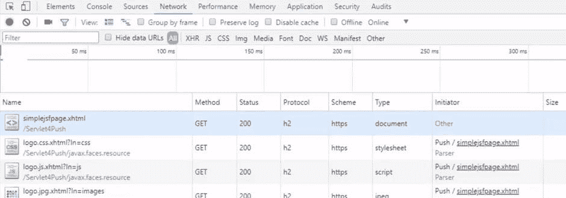
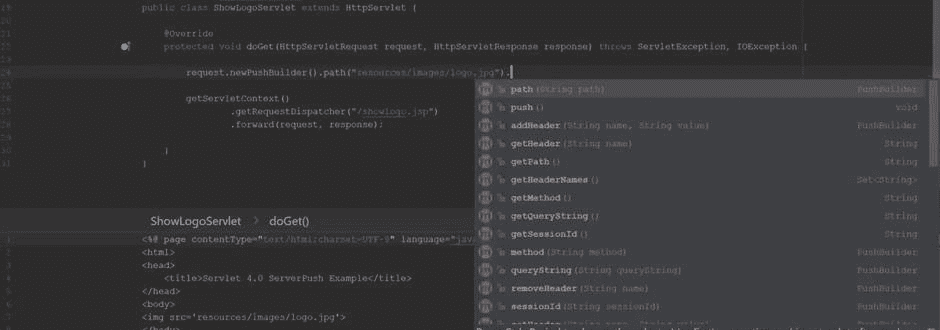

# Servlet 4.0 入门

> 原文：[`developer.ibm.com/zh/tutorials/j-javaee8-servlet4/`](https://developer.ibm.com/zh/tutorials/j-javaee8-servlet4/)

Java™ Servlet API 是主流服务器端 Java 的基本构建块，也是 Java EE 技术的一部分，例如，用于 Web 服务的 JAX – RS、JSF (JavaServer Faces) 和 JSP (JavaServer Pages)。Java servlet 也独立存在，提供一系列支持动态 Web 内容的功能。其中包括过滤器、Web 安全性以及用于处理 HTTP 请求和响应的功能。

Servlet 4.0 是 API 的最新版本，也是 [Java EE 8 规范](https://www.ibm.com/developerworks/cn/java/j-whats-new-in-javaee-8/index.html) 的核心更新。正如您将在本教程中了解到的，Servlet 4.0 已为 HTTP/2 准备就绪，完全包含服务器推送，同时还将其扩展到基于 servlet 的技术，如 JSF 2.3。本教程还介绍了新型 `HttpServletMapping` 接口, 它支持运行时发现 servlet 的映射 URL。

**HTTP/2 是什么？**
HTTP/2 的首要目标是改善 Web 应用程序用户的体验。HTTP 1.1 是一个二进制协议，它拥有包括轻量型、安全和快速在内的所有优势。HTTP/2 保持了原始 HTTP 协议的语义，但更改了在系统之间传输数据的方式。请查看我的文章”[HTTP/2 幕后原理](https://www.ibm.com/developerworks/cn/web/wa-http2-under-the-hood/index.html)”（developerWorks，2017 年 7 月），深入了解 HTTP/2。

[获得代码](https://github.com/readlearncode/Java-EE-8-Sampler/tree/master/servlets-4-0)

## Servlet 简介

*Java servlet* 是一项基于 HTTP 协议运行的服务器端技术。Servlet 等待客户端向服务器发送请求消息，然后向客户端返回响应消息。请求和响应消息由两部分组成：

*   标头包含消息相关信息。
*   主体包含消息的有效载荷，即其内容。

在传统交换中，客户端通过从浏览器或 `curl` 等另一个 HTTP 客户端请求特定的 URL 来调用 servlet。

在清单 1 中，请求 servlet 路径时，会激活该 servlet 。请求会被委派给相应的方法，这由 HTTP 方法来确定。在这种情况下，由于请求是 `GET` 方法请求，因此通过 Java servlet 的 `doGet()` 方法来处理该请求。

以下交换的 servlet 路径是：`http://hostname/applicationroot/showlogoservlet`.

##### 清单 1\. servlet 简单实现

```
@WebServlet("/showlogoservlet")
public class SimpleServlet extends HttpServlet {

   @Override
   protected void doGet(HttpServletRequest request,
                        HttpServletResponse response)
                        throws ServletException, IOException {

       getServletContext()
         .getRequestDispatcher("/showlogo.jsp")
         .forward(request, response);

   }
} 
```

## Servlet 4.0 的主要新功能

Servlet 4.0 的主要新功能为服务器推送和全新 API，该 API 可在运行时发现 servlet 的 URL 映射。

服务器推送是最直观的 HTTP/2 强化功能，通过 `PushBuilder` 接口在 servlet 中公开。服务器推送功能还在 JavaServer Faces API 中实现，并在 `RenderResponsePhase` 生命周期内调用，以便 JSF 页面可以利用其增强性能。

全新 servlet 映射发现接口 `HttpServletMapping` 使框架能够获取有关激活给定 servlet 请求的 URL 信息。这可能对框架尤为有用，这些框架需要这一信息来运行内部工作。

在接下来的部分，我将概述服务器推送及其如何在 Java servlet 中运行，包括 JSF 2.3 中的服务器推送。我还将展示一个交换示例，重点介绍全新 servlet 映射发现功能。

## Servlet 4.0 中的服务器推送

服务器推送使服务器能预测客户端请求的资源需求。然后，在完成请求处理之前，它可以将这些资源发送到客户端。

要了解服务器推送的好处，可以考虑一个包含图像和其他依赖项（比如 CSS 和 JavaScript 文件）的网页。客户端发出一个针对该网页的请求。服务器然后分析所请求的页面，确定呈现它所需的资源，并主动将这些资源发送到客户端的缓存。

在执行所有这些操作的同时，服务器仍在处理原始网页请求。客户端收到响应时，它需要的资源已经位于缓存中。

### PushBuilder

Servlet 4.0 通过 `PushBuilder` 接口公开服务器推送。为了能够进行访问，您需要通过调用 `newPushBuilder()` 方法，从 `HttpServletRequest` 获取 `PushBuilder` 实例。清单 2 展示了如何获取 `PushBuilder` 实例。

##### 清单 2\. 如何获取全新 PushBuilder

```
@Override
protected void doGet(HttpServletRequest request,
                     HttpServletResponse response)
                     throws ServletException, IOException {

   PushBuilder pushBuilder = request.newPushBuilder();

} 
```

每次调用 `newPushBuilder()` 方法时，都将返回 `PushBuilder` 的新实例。如果服务器推送不可用， `newPushBuilder()` 将返回 `null` 。在某些情况下，客户端可能会为请求事务拒绝服务器推送。如果客户端没有使用安全连接，服务器推送也不会起作用。因此，务必要在对 `PushBuilder` 实例调用方法之前，针对 `null` 返回值进行测试。

顾名思义， `PushBuilder` 实现 Builder 模式。在这一实现过程中，通过链接赋值方法构建推送请求。这些赋值方法通过设置 HTTP 标头、方法类型（ `GET` 是唯一的可接受值）、查询字符串、会话 ID 和资源路径（即，将要推出资源的路径），来配置 `PushBuilder` 实例。

大多数来自原始 `HttpServletRequest` 实例的请求标头，只添加到 `PushBuilder` 实例中。由于正确运行服务器推送并不需要某些标头，因此不包括以下标头：

*   条件标头
*   Range 标头
*   Expect 标头
*   Authorization 标头
*   Referrer 标头

现在，让我们看看如何构造和引发服务器推送操作。

### 1.设置推送资源

这一 *路径* 是在向客户端推送资源之前必须设置的唯一配置。设置路径需要调用 `path()` 方法。该方法只能被调用一次，因为它会改变 `PushBuilder` 对象的路径值。该路径可能会以正斜杠（”/”）开头，指示资源路径是绝对路径；否则，该资源会被认为是相对于关联请求的上下文路径。该路径可以包含一个查询字符串，该查询字符串将与 `queryString()` 方法设置的任何字符串合并。

### 2.推送资源

接下来，您将调用 `push()` 方法， 将资源推送到客户端。 `push()` 方法用于发起与客户端的推送”对话”。在后台，会向客户端发送一个 `PUSH_PROMISE` 帧，类似于发送资源的意图通知。客户端可以通过发回 `RST_STREAM` 来拒绝资源。这种机制允许客户端保留对接收到的资源的控制。因此，客户端不会因不需要的资源或已经在缓存中的资源而过载。

如清单 3 所示，一旦获得了 `PushBuilder` 的实例，就可以多次重复使用。路径和条件标头都为 null，但是所有其他字段都原样保留。这些可以在另一个服务器推送中重复使用。

##### 清单 3\. 重复使用 PushBuilder 实例

```
PushBuilder pushBuilder = request.newPushBuilder();

if (pushBuilder != null) {
   pushBuilder.path("images/hero-banner.jpg").push();
   pushBuilder.path("css/menu.css").push();
   pushBuilder.path("js/marquee.js").push();
} 
```

在清单 3 中， *hero-banner.jpg* 的路径是通过 `path()` 方法在 `PushBuilder` 实例上设置的，并通过调用 `push()` 推送到客户端。 `push()` 方法是非阻塞的，且立即返回，以便后续可推送更多资源（本例中为 *menu.css* 和 *marquee.js* ）。



[点击查看视频演示](https://mediacenter.ibm.com/media/0_pxv4hwtf )查看抄本

## 将服务器推送与 JSF 结合使用

JavaServer Faces 已经将每个页面的资源需求标识为页面呈现生命周期的一部分，所以它非常适合用于服务器推送。就开发人员而言，比较好的一方面是，您不必为了激活此功能而煞费苦心。您可以免费升级到 JSF 2.3。

清单 4 展示了 JSF 和服务器推送的集成情况。

##### 清单 4\. 在 JSF 页面中使用服务器推送

```
<h:head>
   <h:outputStylesheet library="css" name="logo.css"/>
   <h:outputScript library="js" name="logo.js"/>
   <title>JSF 2.3 ServerPush Example</title>
</h:head>
<h:body>
   <h:form>
       <h:graphicImage library="images" name="logo.jpg"/>
   </h:form>
</h:body>
</html> 
```

清单 4 中的 JSF 页面需要以下三种资源：

*   名为 *logo.css* 的 CSS 文件。
*   名为 *logo.js* 的 JavaScript 文件。
*   名为 *logo.jpg* 的图像。

当 JSF 引擎正在处理和呈现页面时，这些资源将被逐个推送到客户端。这发生在 JSF 的呈现响应阶段。然后，会为每个资源调用 `ExternalContextImpl.encodeResourceURL()` 方法，并向其传递资源的新 URL。从与 `ExternalContext` 相关联的 `HttpServletRequest` 实例获取新的 `PushBuilder` 对象。如果支持服务器推送，那么会在向客户端呈现页面之前将资源推送到客户端。



[点击查看视频演示](https://mediacenter.ibm.com/media/0_pxv4hwtf)

**JSP 中的服务器推送**
由于 JavaServer Pages 是一项传统技术，服务器推送尚未集成到 JavaServer Pages 中。但您可以在 JSP 中利用服务器推送，通过使用 servlet 过滤器来缓存和推送资源。请查看 Jetty 9 的 `PushCacheFilter`，获取工作方式示例。

## HttpServletMapping 接口

Servlet 4.0 的全新 [servlet 映射发现](https://javaee.github.io/javaee-spec/javadocs/javax/servlet/http/HttpServletMapping.html) API 使服务器能够对 URL（可调用 servlet）执行运行时检查。例如，对 `file.ext, /path` 和 `/path/file.ext` 的请求将通过 URL 模式 `/path/*` 和 `*.ext` 激活 servlet。

`HttpServletMapping` 接口支持运行时发现 servlet 的映射 URL。您可以在 `HttpServletRequest` 实例上调用 `getHttpServletMapping()` ，获取接口的实例。您可以使用以下方法获取有关 servlet 映射 URL 的信息：

*   `getMatchValue()` 返回部分 URI 路径，该路径会导致请求匹配。
*   `getPattern()` 返回 URL 模式的 `String` 表示形式。
*   `getServletName()` 返回 servlet 名称的 `String` 表示形式。
*   `getMappingMatch()` 返回匹配的类型，表示为 `MappingMatch` 枚举值，该枚举值将为以下值之一： `CONTEXT_ROOT` 、 `DEFAULT` 、 `EXACT` 、 `EXTENSION` 或 `PATH` 。

清单 5 展示了四种 API 方法的实际应用。

##### 清单 5\. Servlet 4.0 中的运行时 servlet 映射发现

```
@WebServlet({"/path/*", "*.ext"})
public class ServletMapping extends HttpServlet {

    protected void doGet(HttpServletRequest request,
                         HttpServletResponse response)
                         throws IOException {

        HttpServletMapping mapping = request.getHttpServletMapping();
        String mapping = mapping.getMappingMatch().name();
        String value = mapping.getMatchValue();
        String pattern = mapping.getPattern();
        String servletName = mapping.getServletName();
   }

} 
```

[https://cdnapisec.kaltura.com/p/1773841/sp/177384100/embedIframeJs/uiconf_id/44854321/partner_id/1773841?iframeembed=true&playerId=kplayer&entry_id=0_t16d6s29&flashvars[streamerType]=auto](https://cdnapisec.kaltura.com/p/1773841/sp/177384100/embedIframeJs/uiconf_id/44854321/partner_id/1773841?iframeembed=true&playerId=kplayer&entry_id=0_t16d6s29&flashvars[streamerType]=auto)

[查看抄本](https://www.ibm.com/developerworks/cn/java/j-javaee8-servlet4/runtime-discovery-of-URL-mappings-transcript.txt)

## Servlet 4.0 的细微变化

除了服务器推送和全新 `HttpServletMapping` 接口，Servlet 4.0 还包括少量值得注意的新增功能和变更。

1.  `Trailer` 响应标头支持发送方在分块消息的末尾包含额外字段。这用于提供在发送消息主体时可能会动态生成的元数据，例如，消息完整性检查、数字签名或后期处理状态。
2.  Servlet 4.0 添加了 `GenericFilter` 和 `HttpFilter` 抽象类，这些抽象类通过最低限度地实现生命周期方法 `init()` 和 `destroy()` ，简化了编写过滤器。
3.  Servlet 4.0 还集成了全新的 `HTTP Trailer` ，支持发送方在分块消息的末尾包含额外的字段。
4.  `ServletContext` 接口采用了一些新方法：

    *   `addJspFile()` 可将带有给定 JSP 文件的 servlet 添加到 servlet 上下文中。
    *   `getSessionTimeout()` 和 `setSessionTimeout()` 可提供对会话超时的访问权限。
    *   `getRequestCharacterEncoding()` 和 `setRequestCharacterEncoding()` 可为当前的 servlet 上下文提供访问权限，并改变默认的请求字符编码。
5.  `HttpServletRequest` 接口上的 `isRequestedSessionIdFromUrl()` 方法已被弃用。
6.  由于升级到 Java SE 8，默认方法已被添加到侦听器接口中。

## 结束语

Servlet 4.0 已经发布，主要用于整合全新 HTTP/2 协议及其众多性能增强功能。 `PushBuilder` 接口对推送到客户端的资源提供细粒度控制，使交叉实现生动有趣。例如，Jetty 9 在 `PushCacheFilter` Web 过滤器中使用 `PushBuilder` API 实现了服务器推送功能。此过滤器在首次请求时缓存了资源。即使仍在服务器端处理请求，它也能够将后续请求推送到客户端。

虽然 JSF 2.3 内置了服务器推送功能，但 JavaServer Pages 并没有此功能。JSF 与服务器推送的集成十分有用，开发人员因而可减少对性能问题的关注，而更加着力于设计动态网页。对于想要在 JSP 中实现相似功能的开发人员，就需要使用 Web 过滤器这样的定制解决方案，例如 Jetty 9 中的 `PushCacheFilter` Web 过滤器。

本文翻译自：[Get started with Servlet 4.0](https://developer.ibm.com/tutorials/j-javaee8-servlet4/)（2018-05-10）