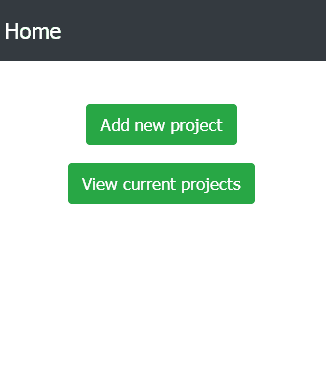
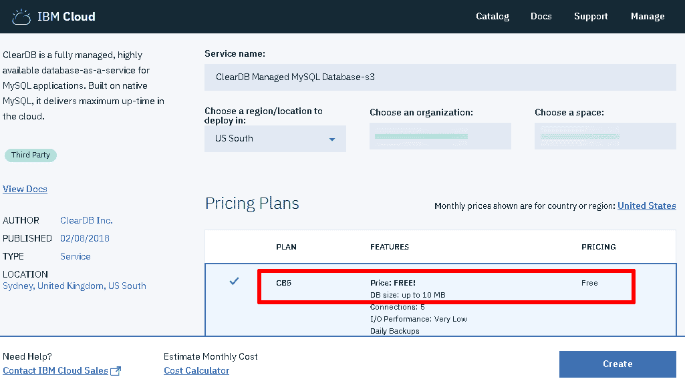
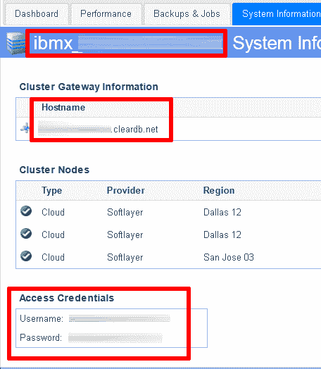
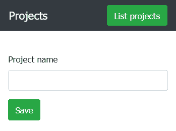
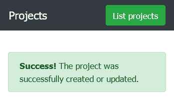
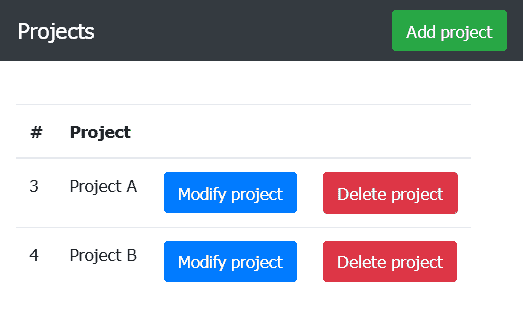

# 利用 IBM Cloud、PHP 和 MySQL 构建自定义 Web 应用程序

> 原文：[`developer.ibm.com/zh/tutorials/cl-track-time-on-projects-with-ibm-cloud-1/`](https://developer.ibm.com/zh/tutorials/cl-track-time-on-projects-with-ibm-cloud-1/)

对于按小时计费的专业人员（律师、会计等），时间跟踪是记账流程中关键的一环。*时间就是金钱*这一格言在以下情况下可谓真理：这些专业人员的工作时数直接关系到他们所获得的收入。因此，他们亟需这样一种时间跟踪工具：既能让他们轻松输入工作时数，又可以在每周末或月末获取汇总报告。

在本教程中，我将介绍如何构建一个简单的时间跟踪工具，并将其部署在 IBM Cloud 上。在此过程中，我将介绍 IBM Cloud 上的 ClearDB MySQL 数据库服务，它可为您的数据提供安全且可扩展的云端数据库。

> 这篇由两部分组成的文章的目标是利用 PHP 和 MySQL 构建由数据库支持的行之有效的应用程序，并充分利用 IBM Cloud 的安全性、可扩展性和灵活性来部署和托管此应用程序。

[在 GitHub 上获取示例代码](https://github.com/vvaswani/bluemix-time-tracker)[试试这个演示](http://time-tracker-demo.mybluemix.net)

## 您需要做的准备工作

本文中所描述的示例应用程序支持用户定义一个或多个项目，每个项目均代表一项客户工作。随后，用户可以持续性输入每个项目的工作时数和简要描述。

输入的数据会保存至联机数据库，基于 Web 的仪表板则支持用户查看每个项目的工作时数报告。用户也可以选择下载包含相同数据的 CSV 格式文件。整个应用程序对移动设备友好，用户即使在出行途中，也可以输入数据和查看报告（非常适合没有固定办公室或工作场所的专业人员）。

在后台，该应用程序使用 IBM Cloud 的 ClearDB MySQL 数据库服务，此服务提供云端 MySQL 数据库。该应用程序还采用了 Bootstrap 来创建为移动设备优化的界面，并采用 Slim PHP 微型框架来处理请求。

**免费试用 IBM Cloud**

利用 [IBM Cloud Lite](https://cloud.ibm.com/registration?cm_sp=ibmdev-_-developer-tutorials-_-cloudreg) 快速轻松地构建您的下一个应用程序。您的免费帐户从不过期，而且您会获得 256 MB 的 Cloud Foundry 运行时内存和包含 Kubernetes 集群的 2 GB 存储空间。

开始之前，请确保您完成了所需的一切准备工作：

*   一个 [IBM Cloud 帐户](https://www.ibm.com/cloud)
*   基本熟悉 [PHP](http://www.php.net/) 和 [MySQL](https://mysql.com/)
*   一个包含 [Apache](http://httpd.apache.org/) 的本地或托管 PHP7 开发环境
*   [Composer](https://getcomposer.org/)（PHP 依赖项管理器）
*   [Cloud Foundry 命令行工具](https://github.com/cloudfoundry/cli)
*   一个文本编辑器或 IDE

**备注**：任何使用 ClearDB 服务的应用程序都必须遵守 [ClearDB 服务条款](http://w2.cleardb.net/terms/)。同样，任何使用 IBM Cloud Platform 的应用程序都必须遵守 [IBM Cloud 的使用条款](https://cloud.ibm.com/docs/overview/terms-of-use?topic=overview-terms#terms)。开始实施项目之前，请花几分钟阅读一下这些要求，确保您的应用程序满足这些要求。

## 安装依赖项

第一步是使用 Slim PHP 微型框架初始化一个基本应用程序。此应用程序可以使用 Composer（PHP 依赖项管理器）来下载和安装。使用以下 Composer 配置文件，此文件应保存至 *$APP_ROOT*/composer.json（*$APP_ROOT* 表示您的项目目录。）

```
{
    "require": {
       "php": ">=7.0.0",
       "slim/slim": "³.9",
       "slim/php-view": "².2"
    }
} 
```

1.  使用 Composer 通过以下命令进行安装：

    ```
    shell> composer install 
    ```

2.  通过 Composer 下载必要组件后，请创建 *$APP_ROOT*/public 目录用于保存所有可通过 Web 访问的文件，并为所有视图创建 *$APP_ROOT*/views 目录，其中 *$APP_ROOT* 表示应用程序目录。

    ```
    shell> cd myapp
    shell> mkdir public views 
    ```

3.  然后，创建 *$APP_ROOT*/config.php 文件，其中包含以下信息（将在第 3 步将其填入占位符中）：

    ```
    <?php
    $config = [
      'settings' => [
        'displayErrorDetails' => true,
        'db' => [
          'hostname' => 'DB-HOST-NAME',
          'username' => 'DB-USER-NAME',
          'password' => 'DB-USER-PASSWORD',
          'name' => 'DB-NAME',
        ]
      ]
    ]; 
    ```

4.  要使应用程序更容易访问，可在开发环境中定义一个名为 `myapp` 的新虚拟主机，并将其文档根目录指向 *$APP_ROOT*/public。同时，还应向 *$APP_ROOT*/public 目录添加一个 .htaccess 文件，其中包含以下设置：

    ```
    <IfModule mod_rewrite.c>
      RewriteEngine On
      RewriteCond %{REQUEST_FILENAME} !-f
      RewriteCond %{REQUEST_FILENAME} !-d
      RewriteRule ^ index.php [QSA,L]
    </IfModule> 
    ```

通过使用一个映射到 *$APP_ROOT*/public 目录的虚拟主机，您可以使用该虚拟主机名直接访问应用程序的路由。例如，使用 `http://myapp.localhost/projects/save`，而不是 `http://localhost/public/projects/save`。请参阅以下“相关主题”，了解有关 Slim 框架应用程序的虚拟主机和 Web 服务器配置的更多信息。

## 创建基本路由处理程序和模板

下一步是初始化 Slim 框架。使用脚本来执行此操作，此脚本中包含对应用程序路由的回调，其中每个回调都定义了在该路由与一个入局请求匹配时要执行的代码。在 *$APP_ROOT*/public/index.php 中创建此脚本，其中包含以下内容：

```
<?php

use \Psr\Http\Message\ServerRequestInterface as Request;
use \Psr\Http\Message\ResponseInterface as Response;

// autoload files
require '../vendor/autoload.php';
require '../config.php';

// configure Slim application instance
// initialize application
$app = new \Slim\App($config);

// initialize dependency injection container
$container = $app->getContainer();

// add view renderer to DI container
$container['view'] = function ($container) {
  return new \Slim\Views\PhpRenderer("../views/");
};

// welcome page controller
$app->get('/', function (Request $request, Response $response) {
  return $response->withHeader('Location', $this->router->pathFor('home'));
});

$app->get('/home', function (Request $request, Response $response) {
  $response = $this->view->render($response, 'home.phtml', [
    'router' => $this->router
  ]);
  return $response;
})->setName('home');

$app->run(); 
```

Slim 通过定义 HTTP 方法和端点的回调函数进行工作。 要完成此任务，可定义相应的 Slim 方法 (`get()` 用于处理 GET 请求，`post()` 用于处理 POST 请求等），并将要匹配的路由模式作为第一个参数传递到该方法。该方法的第二个参数是一个匿名函数，它指定了在路由与某个传入的请求相匹配时应执行的操作。

上述脚本设置两个处理程序（很快将添加更多处理程序）。第一个是一种简单的重定向，它将对 / 路由的所有请求重定向到 /home 路由。第二个是 /home 路由本身，其中呈现了 *$APP_ROOT*/views/home.phtml 模板的内容。创建此模板并添加以下内容：

```
<!DOCTYPE html>
<html lang="en">
  <head>
    <meta charset="utf-8">
    <meta http-equiv="X-UA-Compatible" content="IE=edge">
    <meta name="viewport" content="width=device-width, initial-scale=1">
    <title>Home</title>
    <link rel="stylesheet"
      href="https://maxcdn.bootstrapcdn.com/bootstrap/4.0.0-beta.2/css/bootstrap.min.css">
    <link rel="stylesheet"
      href="https://maxcdn.bootstrapcdn.com/bootstrap/4.0.0-beta.2/css/bootstrap-theme.min.css">
    <!-- HTML5 shim and Respond.js for IE8 support of HTML5 elements and media queries -->
    <!-- WARNING: Respond.js doesn't work work if you view the page via file://-->
    <!--[if lt IE 9]>
      <script src="https://oss.maxcdn.com/html5shiv/3.7.2/html5shiv.min.js"></script>
      <script src="https://oss.maxcdn.com/respond/1.4.2/respond.min.js"></script>
    <![endif]-->

  </head>
  <body style="padding-top: 95px">

    <div class="container">
      <div class="row">
        <nav class="navbar navbar-expand-md navbar-dark
          bg-dark fixed-top justify-content-between">
          <a class="navbar-brand" href="#">Home</a>
        </nav>
      </div>
    </div>

    <!-- content area -->
    <div class="container" style="text-align: center">
      <p>
        <a role="button" class="btn btn-success" href="">Add new project</a>
      </p>
      <p>
        <a role="button" class="btn btn-success" href="">View current projects</a>
      </p>
    </div>
    <!-- content area ends-->

    <!-- footer -->
    <div class="container">
    </div>
    <!-- footer ends -->

  </body>
</html> 
```

此文件包含一个基于 Bootstrap 的简单用户界面，其中包含导航栏、页脚和内容区域。所有后续页面也都使用这个基本模板，并且仅更改内容区域。

要查看此模板的实际效果，可浏览到 /home 路由（`http://localhost/public/home` 或 `http://myapp.localhost/home`，具体取决于您是否使用虚拟主机），您应该看到上述模板的呈现版本：



## 初始化 ClearDB MySQL 数据库实例

IBM Cloud 提供了许多数据库即服务选项，其中之一就是 ClearDB MySQL 数据库。正如您可能会猜到的，此服务提供一个空的 MySQL 数据库实例，此实例可与您的应用程序绑定。默认计划仅提供有限的免费存储配额。

1.  要了解其运作方式，请通过登录 IBM Cloud 帐户，并从导航菜单中选择“Data and Analytics”类别，在 IBM Cloud 上初始化新的 ClearDB MySQL 数据库服务实例。单击 **Create resource** 按钮，在生成的服务列表中，选择 **ClearDB MySQL Database** 服务和 **CB5** 免费计划。单击 **Next** 继续后面的操作。

    

2.  现在，将初始化 ClearDB 数据库服务实例。在服务详细信息页面中，打开 ClearDB 仪表板，选择新数据库实例，并访问 **System Information** 选项卡以查看实例的凭证。将这些值添加到应用程序的 *$APP_DIR*/config.php 文件，以便应用程序可以连接到数据库实例。

    

3.  使用这些凭证连接到远程 MySQL 数据库（使用 MySQL CLI 或 phpMyAdmin 等工具），并使用以下 SQL 创建表来保存项目和时间条目信息。两个表通过 `entries.pid` 外键彼此相连，此外键引用 `projects.id` 字段。

    ```
    CREATE TABLE `projects` (
      `id` int(11) NOT NULL AUTO_INCREMENT,
      `name` varchar(255) NOT NULL,
      PRIMARY KEY (`id`)
    ) ENGINE=InnoDB;

    CREATE TABLE `entries` (
      `id` int(11) NOT NULL AUTO_INCREMENT,
      `pid` int(11) NOT NULL,
      `hours` float NOT NULL,
      `comment` varchar(255) NOT NULL,
      `date` date NOT NULL,
      PRIMARY KEY (`id`),
      KEY `pid` (`pid`),
      CONSTRAINT `entries_ibfk_1` FOREIGN KEY (`pid`) REFERENCES `projects` (`id`)
    ) ENGINE=InnoDB; 
    ```

## 添加项目

既然所有基础架构均已就位，您现在就可以开始向应用程序添加*真实*功能。

1.  首先通过使用上面步骤 2 中显示的基本模板，在其内容区域中放置以下代码，在 *$APP_ROOT*/views/projects/save.phtml 中创建表单来添加新项目：

    ```
    <?php if (!isset($_POST['submit'])): ?>
      <form method="post"
        action="<?php echo $data['router']->pathFor('projects-save'); ?>">
        <div class="form-group">
          <label for="fname">Project name</label>
          <input type="text" class="form-control" id="name" name="name">
        </div>
        <div class="form-group">
          <button type="submit" name="submit" class="btn btn-success">Save</button>
        </div>
      </form>
    <?php else: ?>
      <div class="alert alert-success" role="alert">
        <strong>Success!</strong> The project was successfully created or updated.
      </div>
    <?php endif; ?> 
    ```

    这是一个非常简单的表单，包含单个输入字段，用于表示项目名称。接下来，在 *$APP_ROOT*/public/index.php 文件中添加一个路由处理程序来呈现该表单：

    ```
    <?php
    use \Psr\Http\Message\ServerRequestInterface as Request;
    use \Psr\Http\Message\ResponseInterface as Response;

    // ...

    // project form renderer
    $app->get('/projects/save', function (Request $request, Response $response) {
      $response = $this->view->render($response, 'projects/save.phtml', [
        'router' => $this->router
      ]);
      return $response;
    })->setName('projects-save');

    // ...

    $app->run(); 
    ```

2.  当应用程序收到针对 /projects/save URL 的请求时，它会呈现来自先前列表的表单代码，并生成如下所示的结果：

    

    当用户在表单中输入数据并提交时，应用程序需要对数据进行验证。如果数据有效，那么应用程序会在项目表中创建一条新记录。但是，它必须连接到数据库，才可执行此操作。

3.  使用 PHP 的 MySQLi 扩展添加以下代码行，为应用程序初始化新的数据库连接。添加指向 Slim 依赖注入容器的连接，以便它可供应用程序中的所有路由处理程序轻松使用：

    ```
    <?php
    use \Psr\Http\Message\ServerRequestInterface as Request;
    use \Psr\Http\Message\ResponseInterface as Response;

    // ...

    // configure MySQL client to DI container
    $container['db'] = function ($container) {
      $config = $container->get('settings');
      return new mysqli(
        $config['db']['hostname'],
        $config['db']['username'],
        $config['db']['password'],
        $config['db']['name']
      );
    };

    // route handlers here
    // ...

    $app->run(); 
    ```

    然后，同样在 *$APP_ROOT*/public/index.php 文件中为 POST 请求定义独立的处理程序，如下所示：

    ```
    <?php
    use \Psr\Http\Message\ServerRequestInterface as Request;
    use \Psr\Http\Message\ResponseInterface as Response;

    // ...

    // project modification controller
    $app->post('/projects/save', function (Request $request, Response $response) {
      // get configuration
      $config = $this->get('settings');
      // get input values
      $params = $request->getParams();
      // check input
      if (!($name = filter_var($params['name'], FILTER_SANITIZE_STRING))) {
        throw new Exception('ERROR: Project name is not a valid string');
      }
      if (!$this->db->query("INSERT INTO projects (name) VALUES ('$name')")) {
        throw new Exception('Failed to save record: ' .$this->db->error);
      }
      $response = $this->view->render($response, 'projects/save.phtml', [
        'router' => $this->router
      ]);
      return $response;
    });

    // ...

    $app->run(); 
    ```

    此处理程序会收到 POST 请求，并使用 `getParams()` 方法从请求中提取输入参数。此处理程序会清理用户提供的值，确保其中不包含任何危险的字符，然后使 `INSERT` 查询公式化，并执行此查询以在项目的 MySQL 数据库中创建一条新记录。您将会注意到，它使用先前 (`$this->db`) 从 Slim 依赖注入容器初始化的数据库连接来执行此查询。

4.  成功执行此查询后，处理程序会重新呈现该表单模板；这次，由于存在 `$_POST['submit']` 变量，该模板会呈现一条通知消息，而不是空表单。以下是您将会看到的结果：

    

## 列出并编辑项目

现在，您已了解了添加新项目的方法，但如何查看和修改这些项目呢？您可以非常轻松地添加一个处理程序，通过对数据库执行 `SELECT` 查询，仅列出可用的项目，如下所示：

```
<?php
use \Psr\Http\Message\ServerRequestInterface as Request;
use \Psr\Http\Message\ResponseInterface as Response;

// ...

// project list controller
$app->get('/projects[/]', function (Request $request, Response $response) {
  // query for all project records
  $projects = $this->db->query("SELECT * FROM projects");
  $response = $this->view->render($response, 'projects/list.phtml', [
    'router' => $this->router, 'projects' => $projects
  ]);
  return $response;
})->setName('projects-list');

// ...

$app->run(); 
```

此查询检索到的项目列表将会传递到模板，该模板会对列表进行迭代，并在表中显示每个项目。以下是模板代码，位于 *$APP_ROOT*/views/projects/list.phtml 中：

```
<?php if (count($data['projects'])): ?>
<table class="table table-border table-responsive-md">
  <thead>
    <tr>
      <th>#</th>
      <th>Project</th>
      <th></th>
      <th></th>
    </tr>
  </thead>
  <?php foreach ($data['projects'] as $project): ?>
  <tr>
    <td><?php echo htmlspecialchars($project['id'], ENT_COMPAT, 'UTF-8'); ?></td>
    <td><?php echo htmlspecialchars($project['name'], ENT_COMPAT, 'UTF-8'); ?></td>
    <td><a role="button" class="btn btn-primary"
      href="<?php echo $data['router']->pathFor('projects-save',
      array('id' => htmlspecialchars($project['id'], ENT_COMPAT, 'UTF-8'))); ?>">
      Modify project</a></td>
    <td><a role="button" class="btn btn-danger"
      href="<?php echo $data['router']->pathFor('projects-delete',
      array('id' => htmlspecialchars($project['id'], ENT_COMPAT, 'UTF-8'))); ?>">
      Delete project</a></td>
  </tr>
  <?php endforeach; ?>
</table>
<?php endif; ?> 
```

以下是输出的外观：



请注意，在模板代码中，每个项目均包含用于编辑和删除对应记录的链接，并且项目 ID 作为 URL 参数包含在此链接中。针对这些操作的请求分别由 /projects/save 和 /projects/delete 处理程序来处理。

编辑项目涉及到显示表单，此表单与用于创建新项目的表单相同，但已预先填充了值。在提交时，用户输入的信息会像之前一样进行验证。但这次，不会执行 `INSERT` 查询，而改为执行 `UPDATE` 查询，以更新数据库中的项目记录。

可通过将步骤 4 中显示的 /projects/save 处理程序修改为包含其他部分业务逻辑来完成这些任务：

```
<?php
use \Psr\Http\Message\ServerRequestInterface as Request;
use \Psr\Http\Message\ResponseInterface as Response;

// ...

// project modification form renderer
$app->get('/projects/save[/{id}]', function (Request $request, Response $response, $args) {
  $project = null;
  if (isset($args['id'])) {
    $id = filter_var($args['id'], FILTER_SANITIZE_NUMBER_INT);
    $projectResult = $this->db->query("SELECT * FROM projects WHERE id = '$id'");
    $project = $projectResult->fetch_object();
  }
  $response = $this->view->render($response, 'projects/save.phtml', [
    'router' => $this->router, 'project' => $project
  ]);
  return $response;
})->setName('projects-save');

// project modification controller
$app->post('/projects/save[/{id}]', function (Request $request, Response $response, $args) {
  // get configuration
  $config = $this->get('settings');
  // get input values
  $params = $request->getParams();
  // check input
  if (!($name = filter_var($params['name'], FILTER_SANITIZE_STRING))) {
    throw new Exception('ERROR: Project name is not a valid string');
  }
  // if project id included
  // check input and update record
  // if not, create new record
  if (!empty($params['id'])) {
    $id = filter_var($params['id'], FILTER_SANITIZE_NUMBER_INT);
    if (!(filter_var($id, FILTER_VALIDATE_INT))) {
      throw new Exception('ERROR: Project is not valid');
    }
    if (!$this->db->query("UPDATE projects SET name='$name' WHERE id='$id'")) {
      throw new Exception('Failed to save record: ' .$this->db->error);
    }
  } else {
    if (!$this->db->query("INSERT INTO projects (name) VALUES ('$name')")) {
      throw new Exception('Failed to save record: ' .$this->db->error);
    }
  }
  $response = $this->view->render($response, 'projects/save.phtml', [
    'router' => $this->router
  ]);
  return $response;
});

// ...

$app->run(); 
```

这些修改后的处理程序现在接受可选项目 ID 作为请求 URL 的一部分。如果找到项目，处理程序会在数据库中搜索对应记录，从而预先填充项目创建表单。在提交时，如果在输入参数中包含项目 ID，那么处理程序会使用修改后的项目名称执行 `UPDATE` 查询，而不是执行通常的 `INSERT` 查询。

这些处理程序变更还需要在位于 *$APP_ROOT*/views/projects/save.phtml 的表单模板中进行相应的更改。最值得注意的是，这些更改包括为项目 ID 添加隐藏字段，以及使用当前项目名称（如果可用）预先填充输入字段。出于安全原因，通过 `htmlspecialchars()` 对插入模板中的数据执行输出转义。以下是修改后的表单模板：

```
<?php if (!isset($_POST['submit'])): ?>
  <form method="post" action="<?php echo $data['router']->pathFor('projects-save'); ?>">
    <input name="id" type="hidden"
      value="<?php echo (isset($data['project']->id)) ?
      htmlspecialchars($data['project']->id, ENT_COMPAT, 'UTF-8') : ''; ?>" />
    <div class="form-group">
      <label for="fname">Project name</label>
      <input type="text" class="form-control" id="name" name="name"
        value="<?php echo (isset($data['project']->name)) ?
        htmlspecialchars($data['project']->name, ENT_COMPAT, 'UTF-8') : ''; ?>">
    </div>
    <div class="form-group">
      <button type="submit" name="submit" class="btn btn-success">Save</button>
    </div>
  </form>
<?php else: ?>
  <div class="alert alert-success" role="alert">
    <strong>Success!</strong> The project was successfully created or updated.
  </div>
<?php endif; ?> 
```

*备注*：以上最终截屏还显示了用于删除项目的链接。为了简洁起见，项目删除处理程序的代码并未包含在此教程中，但可在应用程序的源代码存储库中找到该代码。类似方法将用于删除时间条目，因此将在本系列的第 2 部分中详细解释记录删除操作。

## 结束语

本系列文章共有两个部分，目的在于利用 PHP 和 MySQL 构建由数据库支持的行之有效的应用程序，并充分利用 IBM Cloud 的安全性、可扩展性和灵活性来部署和托管此应用程序。第 1 部分涵盖了基本信息，展示了如何初始化基于云的数据库实例，以及如何将本地 PHP 应用程序连接到此实例。它还介绍了使用 Slim 框架来添加和修改云数据库实例上的记录时所涉及的一些基础信息。

第 2 部分将在这些主题的基础上，向您展示如何将时间条目与项目链接在一起，并生成汇总报告。它还将向您展示如何将最终 PHP 应用程序从本地开发环境传输至 IBM Cloud，以便应用程序和数据库均在云端运行。切勿错过！

本文翻译自：[Build a custom web application with IBM Cloud, PHP, and MySQL](https://developer.ibm.com/tutorials/cl-track-time-on-projects-with-ibm-cloud-1/)（2019-04-26）