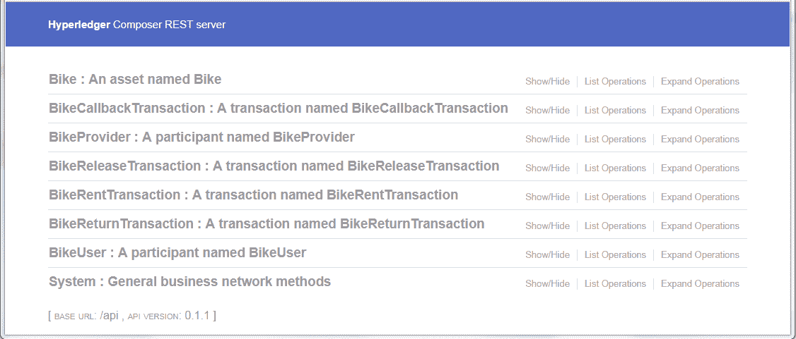

# 开发、部署一个共享自行车区块链网络

> 原文：[`developer.ibm.com/zh/tutorials/cl-lo-hyperledger-fabric-study-notes2/`](https://developer.ibm.com/zh/tutorials/cl-lo-hyperledger-fabric-study-notes2/)

## 前言

在本系列文章的 [第 1 部分](https://developer.ibm.com/zh/tutorials/cl-lo-hyperledger-fabric-study-notes1/) 中，我们一起学习了 Fabric、Composer 基础知识，利用 Hyperledger Compose 搭建了 Fabric 本地开发环境，运行了一个示例区块链网络应用。

现在，我们可以设想一个更具有现实意义的 User Story，像开发一个真实的区块链应用一样，从无到有地开发、部署、管理这个应用。在这个过程中，我们一定会遇到很多问题，正可以这些问题为线索，快速、高效地学习、研究区块链网络。这样，也可以使学习的过程更具趣味性。

我想把这个主题定为”共享自行车区块链网络”。共享经济的一些特点使之正适合利用区块链技术。这个示例应用会随着一些区块链问题的研究与解决，从最初的简单原型开始进行多次迭代。目前它的名字就定为：**bikesharing Network** 。

本文中的示例以第 1 部分的示例为基础，请先行阅读、执行。本文示例所使用的 Fabric 的版本为 1.1.0，而 Composer 的最新版本为 0.19.4，与之前的 0.19.1 在使用方法上没有差别。

Composer 现在版本更新较频繁，请注意版本更新可能带来的变化。（Micro 版本号对应用应该没有影响，在本文公开后，如继续有升级，请自行升级 Composer 即可。）

## 升级 Composer 与重启 Fabric

### 升级 Composer

```
$ ~/fabric-tools/stopFabric.sh
$ npm uninstall -g composer-cli composer-rest-server generator-hyperledger-composer
$ npm install -g composer-cli composer-rest-server generator-hyperledger-composer 
```

### 重启 Fabric 及 BND

#### 重启 Fabric：

```
$ ~/fabric-tools/stopFabric.sh
$ ~/fabric-tools/startFabric.sh 
```

#### 重启 BND：

startFabric 后需要重新 install，start BND，import card，仍以第 1 部分中的 tutorial-network 为例：

```
$ cd ~/fabric-tools/tutorial-network
$ composer card delete --card admin@tutorial-network
$ composer network install --card PeerAdmin@hlfv1 --archiveFile tutorial-network@0.0.1.bna
$ composer network start --networkName tutorial-network --networkVersion 0.0.1 --
networkAdmin admin --networkAdminEnrollSecret adminpw --card PeerAdmin@hlfv1 --file
admin@tutorial-network.card
$ composer card import --file admin@tutorial-network.card 
```

#### teardown

如果 ~/fabric-tools/teardownFabric.sh 被执行过，则在 startFabric 后，需要再次执行 createPeerAdminCard.sh 及之后步骤。详情请参考本系列第一部分的相关内容。

#### 删除 Docker Images

如果需要彻底删除之前下载安装的 Composer、Fabric 环境，可以执行如下命令：

```
$ docker kill $(docker ps -q)
$ docker rm $(docker ps -aq)
$ docker rmi $(docker images dev-* -q) 
```

## User Story – 共享自行车区块链网络（bikesharing Network）

### 业务需求

虽然本文是一篇技术文章，但我认为，理解学习的目的及确定学习的方向，是一件首要的事情，所以，我们必须先理解一些商业相关内容，我们这个 User Story 的需求是什么，大概涵盖哪些方面。这个网络应满足以下需求：

1.  共享自行车服务供应商会通过这个网络注册自行车；
2.  用户会通过这个网络租用（解锁）、归还（上锁）自行车；
3.  所有操作（状态修改、付费、报修）都作为 Transaction（交易）提交到这个区块链网络；
4.  允许多个自行车服务供应商共用这个网络；
5.  允许自行车服务供应商执行不同的业务逻辑；
6.  允许其他共享服务（共享汽车、共享房间……）供应商、用户使用这个网络。

这样看来，我们需要解决很多问题：基于区块链模式下的业务模型设计、权限管理，节点的部署与控制，效率问题，系统可靠性问题……但不管如何，我们都会 Focus on Blockchain，会始终着力于典型的”区块链”应用。

### 当前简化的原型设计、开发、部署

我们要先从一个最简化的原型开始，也就是本部分所将涉及的内容：

1.  Assets：自行车；
2.  Participants：自行车供应商、自行车用户；
3.  Transaction：租车、还车；
4.  Query：设计基本查询；
5.  BND：Business Network Definition 业务网络定义;
6.  BND 部署与更新。

现在，我们需要先了解一些必需的 BND（业务网络定义）基础知识。我们可以带着对这个 User Story 的想法、疑问去学习 BND，及其他相关知识。

## 业务网络定义 Business Network Definition（BND）

BND 是 Composer 编程模型中的的关键概念，它包含了这个区块链业务网络的所有域模型、业务逻辑、访问控制规则、查询等内容。BND 会被打包后部署到 Fabric 节点上，我们可以利用 Composer 系统接口生成 BND 中一些域模型的实例，或者触发执行 BND 中定义的业务逻辑。下面即按各部分详细讲解，并给出 bikesharing 的实例。

### 域模型（Domain Models）

域模型主要包含了以下定义：Assets，Participants，Transactions，Events 等，它们是这个业务网络中将要被使用、处理的对象类型，也可以理解为一系列资源类型。它位于 models 目录下名为 *.cto 的文件中。域模型是用 Hyperledger Composer Modeling Language 定义的。

#### Composer 建模语言（Composer Modeling Language）

它是 Hyperledger Composer 提供的一个面向对象的建模语言，用来定义业务网络中的域模型。它有以下特点与属性。

1.  Namespace 命名空间

    模型归属于一个 namespace（命名空间）。一个 .cto 文件中会定义一个 namespace，其中包含的所有定义都属于这个 namespace。示例：

    ```
     namespace org.bikesharing.biznet
     asset Bike identified by bikeId {... } 
    ```

    则在以后可以用类似 “org.bikesharing.biznet.Bike” 引用这个类型。

2.  域模型的类型及其基础类、关键字：

##### 表 1\. 域模型的类型及其基础类、关键字

```
| **类型** | **基础类** | **关键字** |
| - | - | - |
| Assets | `org.hyperledger.composer.system.Asset` | `asset` |
| Participants | `org.hyperledger.composer.system.Participant` | `participant` |
| Transactions | `org.hyperledger.composer.system.Transaction` | `transaction` |
| Events | `org.hyperledger.composer.system.Event` | `event` |
| Concepts |  | `concept` |
| Enumerated Types |  | `enum` |

可从 Composer 源码 [org.hyperledger.composer.system.cto](https://github.com/hyperledger/composer/blob/master/packages/composer-common/lib/system/org.hyperledger.composer.system.cto) 中获取更详细内容。

域模型定义往往包括若干属性（字段）定义。示例：

```
participant BikeUser identified by bikeUserId {
    o String bikeUserId
    o Integer age
}
asset Bike identified by bikeId {... }
```

资源 Assets，Participants，Transactions 可以被实例化为对象并存储在相应 AssetRegistry，ParticipantRegistry，TransactionRegistry 中，作为 Fabric 区块链网络的 World State（世界观）中的一部分。

Assets，Participants 需要定义 identified by 属性，以表示资源对象的唯一标识字段。但 Transactions、Events 定义中不能包括 identified by 属性，且不允许有 transactionId，eventId，timestamp 字段，因为它们已经在基础类定义 org.hyperledger.composer.system 中被声明。内容如下：

```
abstract transaction Transaction identified by transactionId {
    o String transactionId
    o DateTime timestamp
}
abstract event Event identified by eventId {
    o String eventId
    o DateTime timestamp
}
``` 
```

3.原生类型

##### 表 2\. Composer 建模语言中的原生类型

```
| **原生类型** | **备注** |
| - | - |
| String | UTF8 编码字符串 |
| Double | 64 位双精度数值 |
| Integer | 32 位整型数值 |
| Long | 64 位长整型数值 |
| DataTime | ISO-8601 时间值，形如：1997-07-01T19:20:30+01:00 |
| Boolean | 布尔值，true | false |

当原生类型被用于定义模型中的某一属性时，以符号 "o" 作为标志，示例：

```
o String bikeUserId
o Integer age
``` 
```

4.Concept

```
Concept 可以理解为一个在多种模型定义间共享的一组属性的组合，一般会被 asset、participant、transaction 等资源"包含"。我们可以通过 getFactory().newConcept() 方法实例化 Concept，得到一个对象，但不能将它单独存储在 Registry 中，也不能被作为 Relationship 引用。它没有 "identified by" 字段。示例:

```
concept Address {
    o String street
    o String city
    o String country
}
participant BikeUser identified by BikeUserId {
    //...
    o Address adr
         //...
}
``` 
```

5.抽象（abstract）与继承（extends）

```
抽象类型不能被实例化，但可被继承。Assets、Participants、Transaction、Concepts、Events 都可以被定义为 abstract，或通过 extends 继承另一个类型定义。示例：

```
abstract transaction BikeTransaction {... }
transaction BikeRentTransaction extends BikeTransaction {... }
abstract concept Address {... }
``` 
```

6.Relationship

```
在模型定义中，可以通过 Relationship 引用另一个资源对象。用符号"-->"标示。示例：

```
transaction BikeTransaction {
    --> Bike bike
    --> BikeUser user
}
```

在实例化这个上层对象时，需要使用完整的 identifier 来标识被引用资源，示例：

```
"resource:org.bikesharing.biznet.Bike#bid_1"
``` 
```

7.Enum

```
枚举变量定义及使用示例：

```
    o AVAILABLE
    o INUSE
    o INREPAIR
}

asset Bike identified by bikeId {
    //...
    o BikeStatus status
    //...
}
``` 
```

8.数组

```
以上所述所有类型都可以用符号"[]"标示为数组，示例：

```
o Integer[] counts
o String[] comments
--> Bike[] bikes
``` 
```

9.Optional

```
默认情况下，模型中定义的属性是必选项，在实例化时必须指定初始值。但可以将其标示为 optional, 以表示在实例化时可以忽略此属性。示例：

```
o Integer age optional
``` 
```

10.字段校验

```
资源字段可以设定默认值，示例：

```
o String bikeName default="MOF Bike"
```

Double，Integer，Long 类型字段可以定义 Range，示例：

```
o Integer year range=[1900, ]
```

此外，还可以定义正则表达式对字段进行校验，示例：

```
o String postCode regex=/^[0-9]{6}$/ optional
``` 
```

11.Import

```
我们可以使用 import 从外部引入其他 namespace 中的资源定义，以实现类型定义的共享、重用。示例：

```
import org.example.biznet.*
import org.example.biznet.SampleAsset
``` 
```

### 交易处理器（Transaction Processor Functions）

交易处理器是对在 BND 中定义的交易（transaction）的业务逻辑的具体实现，它定义了对这个区块链网络中的 Assets，Participants，Transaction，Events、区块链世界观（World State）等资源进行交易处理的功能。每当交易被提交时，对应的 Transaction Processor Function 就会被 Composer Runtime 触发执行。我们可以针对每一种交易定义一个 function，以实现其对应的业务逻辑。它使用的编辑语言是 ES6 JavaScript。表现为一组位于 lib 目录下名为 *.js 的文件。

在这个 JavaScript 程序中，我们可以访问 Composer Runtime API 中的一个类 Api 所提供的一此方法，如：getFactory()，getParticipantRegistry()，getAssetRegistry()，query()，emit() 等，以实现对当前业务网络的访问、操作。

#### 交易处理器结构

每个交易处理器方法都必须包括以下修饰器（decorators）：

*   @param，随后必须指定对应交易的类型名称，以及参数名称。
*   @transaction，这个修饰器标识下面的方法是一个交易处理器。Composer Runtime 将根据这些 decorators 确定将哪些类型的 transaction 由此 process function 处理。示例：

    ```
    /**
     * Processor function for BikeRentTransaction
     * @param {org.bikesharing.biznet.BikeRentTransaction} tx
     * @transaction
     */
    async function processBikeRentTransaction(tx) {
        //...
    } 
    ```

#### 错误处理

交易对区块链业务网络中资源、状态的改变是原子操作（Atomic），或者完全成功，或者完全失败。一旦有错误（异常）抛出，则表示整个交易失败，在交易处理器中对资源的所有改变都会被回滚（Roll back）。示例：

```
async function sampleTransaction(tx) {
    //...
    throw new Error('example error');
    // The transaction gets failed, and all changes will be rolled back or discarded.
} 
```

#### 异步编程

在之前版本的 Composer 中，对于异步的处理是通过 Promise，resolve()，then() 这类方式完成的。在当前版本中，对这种旧方式仍然是兼容的。但现在更建议使用 async/await 方式进行应用开发，这样使代码更符合通常的习惯。

这是在 Composer 框架下开发 Fabric 区块链网络应用的一个重要知识点，如果之前没有接触过，建议查看更详细资料： [await operator](https://developer.mozilla.org/en-US/docs/Web/JavaScript/Reference/Operators/await) 。

### 访问控制规则 （Access Control Rules）

Hyperledger Composer 提供了 ACL（Access Control Language），使我们可以声明式的语言去定义用户、角色对于区块链业务网络、资源、域模型实例的访问权限。一系列规则被包括在 permissions.acl 文件中。

##### 清单 1\. 一个典型的 Rule 示例

```
rule BikeMaintainACL {
    description:     "ACR for bike maintenance, put on, call back, fix..."
    participant(bp):     "org.bikesharing.biznet.BikeProvider"
    operation:         ALL
    resource(b):     "org.bikesharing.biznet.Bike"
    transaction(tx):     "org.bikesharing.biznet.BikeReleaseTransaction"
    condition:         (b.provider.getIdentifier() == bp.getIdentifier())
    action:         ALLOW
} 
```

#### 基本语法

1.  Rule 名称。必须内容。

    ACL 文件中每个 Rule（规则）的名字都必须是唯一的。示例：

    ```
     rule SystemACL {
         //...
     }
     rule BikeMaintainACL {
         //...
     } 
    ```

2.  描述（description）。必须内容。

3.  成员，即授权对象（participant）。必须内容。

    可为以下形式：

    *   域模型类型，如： `org.bikesharing.biznet.BikeProvider`
    *   域模型超类类型，如： `org.hyperledger.composer.system.Participant`
    *   一个具体的带 identifier 的实例：如： `org.bikesharing.biznet.BikeProvider#bp_1`
    *   一个命名空间，如： `org.bikesharing.biznet.*`
    *   递归处理的命名空间，如： `org.bikesharing.**`
    *   任意授权对象：”ANY” 或者 “**”（加双引号）

        此项设置可以绑定一个变量，以便在 Rule 内部被引用，如 BikeMaintainACL 示例中的 participant(bp)。

4.  资源操作（operation）。必须内容。

    将要进行权限控制的对资源、网络的操作。

    可以为以下四种操作其中的一个或多个，多个时以逗号”,”分隔：CREATE，READ，UPDATE，DELETE。也可以为 ALL 表示所有操作。（都不加双引号）

5.  资源（resource）。必须内容。

    可以为以下形式：

    *   域模型类型，如： `org.bikesharing.biznet.Bike`
    *   域模型超类类型，如： `org.hyperledger.composer.system.Asset`
    *   一个具体的带 identifier 的实例：如： `org.bikesharing.biznet.Bike#B_1`
    *   一个命名空间，如： `org.bikesharing.biznet.*`
    *   递归处理的命名空间，如： `org.bikesharing.**`
    *   任意资源：”**”（加双引号）

        此项设置可以绑定一个变量，以便在 Rule 内部被引用，如 BikeMaintainACL 示例中的 resource(b)。

6.  授权操作（action）。必须内容。

    表示此项 Rule 最终的授权结果，可为：ALLOW 或者 DENY。

7.  交易（transaction）。可选内容。

    如果此项不为空，则 Rule 中定义的对相应资源的操作权限控制会在 participant 提交此项 transaction 时被应用。

8.  条件（condition）。可选内容。

    Condition 是一个 JavaScript 表达式。当其值为 true 时此 Rule 会被应用。

#### 权限决策表

1.  如果 permissions.acl 文件不存在，或为空（Composer Playground 中不允许为空），则所有操作均视为 ALLOW。
2.  如果此文件存在且不为空，则会按从上到下顺序进行权限评估，一旦 participant、resource、operation、transaction（可选）、condition（可选）都对应成功，则以此项 action 作为此种资源操作的权限评估结果，之后的 Rules 不会再被评估。

    如果没有找到对应的 Rule，则此项操作会被视作 DENY。

#### 备注

1.  访问控制主要分为两种：网络访问控制，资源访问控制。

    网络访问控制包括对相关 CLI Command（composer network, composer identity, composer participant）的权限控制。一般而言，对于普通业务网络 participant，需要授予以下类似权限，否则，此 participant 则不能访问业务网络的基础功能。

    ```
     rule NormalACL {
         description:  "Normal ACL to permit base access"
         participant: "org.hyperledger.composer.system.Participant"
         operation: ALL
         resource: "org.hyperledger.composer.system.Network"
         action: ALLOW
     } 
    ```

    在本地测试环境、初步学习状态下，请保持 permissions.acl 文件为空，或者需要以下 Rules：

    ```
     rule NetworkAdminUser {
         description: "Grant administrators full access to user resources"
         participant: "org.hyperledger.composer.system.NetworkAdmin"
         operation: ALL
         resource: "**"
         action: ALLOW
     }

     rule NetworkAdminSystem {
         description: "Grant administrators full access to system resources"
         participant: "org.hyperledger.composer.system.NetworkAdmin"
         operation: ALL
         resource: "org.hyperledger.composer.system.**"
         action: ALLOW
     } 
    ```

2.  访问控制是区块链网络中的一项非常重要的内容。基于 Composer 的权限控制模型直观方便，但仍需要更多的尝试与深刻理解，以保证业务网络的安全。

    建议可以使用 Composer Playground 进行快速简便的测试，而不需要反复部署 BND。

    我们可以在安装好的本地 Fabric 开发环境中启动 Composer Playground。

    请注意：Playground 只可用于模拟，与实际部署的 Local Composer 可能稍有差异。

### 查询

Hyperledger Composer 提供了类似 SQL 的 Query Language，通过查询，我们得到符合一定条件的资源列表。定义查询的文件是 queries.qry。一个典型的 Query 示例：

```
query selectBikesByStatus {
  description: "Select all bikes of the given status"
  statement:
      SELECT org.bikesharing.biznet.Bike
          WHERE (status == _$bikeStatus)
} 
```

Composer Query Language 支持 SELECT、FROM、WHERE、AND、OR、CONTAINS、ORDER BY、SKIP、LIMIT 等操作。

查询可以通过 REST Service 或 Composer API 进行访问。

### package.json

中定义了 BND 的一些元数据（Metadata），它也符合 npm 包文件格式。示例如下：

##### 清单 2\. package.json

```
{
  "name": "bikesharing-network",
  "version": "0.0.1",
  "description": "The bike sharing blockchain network",
  "author": "administrator",
  "email": "administrator@org.bikesharing.biznet",
  "license": "Apache-2.0",
  "devDependencies": {
    "composer-admin": "⁰.19.2",
    "composer-cli": "⁰.19.2",
    "composer-client": "⁰.19.2",
    "composer-common": "⁰.19.2",
//...
  }
} 
```

“name” 只能为标准 ASCII 字符及 “-“。”version” 为 Major.Minor.Micro 格式。

### BND 总结

BND 定义了一个区块链业务网络的资源模型、交易处理器、访问控制规则，和一个包定义文件。它们会一起被打包为一个.bna 文件，并被部署到区块链网络上。

这个 BND 定义是以 Composer 为基础的。会在 Composer Runtime 中被执行。

在这一章中，Composer Modeling Language，ACL，Transaction Process Function 等相关开发技术的详细资料，可以参考这里： [Reference Material for Hyperledger Composer](https://hyperledger.github.io/composer/latest/reference/reference-index) 。

## 一个最初的 bikesharing-network 实例

我们在文章一开始，提到会建立一个实际意义上的区块链网络应用 bikesharing network。但随后就花了很多篇幅去学习 BND。这是因为 BND 在 Composer 开发框架占据重要地位，我们需要一个扎实的基础；而且，这一部分的内容先被尽量详细描述了，我们在以后的完整实例中，就可以只关注业务、功能的具体实现，不会再在细节上对 BND 描述过多。

### 基础代码

此部分介绍这个业务网络的基础代码。在本文中，只会实现最简化、直接的功能。主要目的是初始化、部署、启动这个业务网络。

#### 准备 BND 工作目录 bikesharing

```
$ cd ~/fabric-tools/
$ mkdir bikesharing-network
$ cd bikesharing-network 
```

我们以后基本都在这个目录下工作。

#### 域模型

新建文件 bikesharing-network/models/org.bikesharing.biznet.cto。其部分内容主要如下：

```
// namespace
namespace org.bikesharing.biznet

// Enumerated constant values for bike status
enum BikeStatus { //... }

// A concept of contact information
concept ContactInformation {
    o String firstName
    o String lastName
    //...
}

// Basic Participant class, for all actual participants.
abstract participant BaseParticipant identified by pid{
    o String pid
    o ContactInformation contact
}

// Participant: bike provider, the company who release/launch bike for public.
participant BikeProvider extends BaseParticipant {
    o String orgName
}

// Participant: bike user, the customer who will rent bike.
participant BikeUser extends BaseParticipant {
}

// Bike asset class.
asset Bike extends BaseAsset {
    o BikeStatus status
    --> BikeProvider provider
    o String remark optional
    --> BikeUser activeUser optional
}

// For BikeProvider, release a bike for public.
transaction BikeReleaseTransaction extends BikeTransaction{
    --> BikeProvider provider
}

// For BikeUser, rent a bike.
transaction BikeRentTransaction extends BikeTransaction {
    --> BikeUser user
} 
```

通过 model file，我们定义了 enum BikeStatus，abstract participant，participant BikeProvider，Participant BikeUser，abstract asset，asset Bike，transaction BikeReleaseTransation，transaction BikeRentTransaction，以及一些其他的 abstract classes，concepts，transactions。

此文件详细内容请参考： [models/org.bikesharing.biznet.cto](https://github.com/tomxucnxa/bikesharing/blob/step1/models/org.bikesharing.biznet.cto) 。

#### 交易处理器

新建文件 。其部分内容主要如下：

##### 清单 3\. bikesharing-network/lib/logic.js

```
/**
 * Processor function for BikeReleaseTransaction
 * @param {org.bikesharing.biznet.BikeReleaseTransaction} tx
 * @transaction
 */
async function processBikeReleaseTransaction(tx) {
    tx.bike.status = BikeStatus.AVAILABLE;
await updateBike(tx.bike);
}

/**
 * Processor function for BikeRentTransaction
 * @param {org.bikesharing.biznet.BikeRentTransaction} tx
 * @transaction
 */
async function processBikeRentTransaction(tx) {
    tx.bike.status = BikeStatus.INUSE;
await updateBike(tx.bike);
} 
```

通过 processor function file，我们定义了对于所有交易的业务处理逻辑。

此文件详细内容请参考： [lib/logic.cs](https://github.com/tomxucnxa/bikesharing/blob/step1/lib/logic.js) 。

#### 访问控制规则

我们暂时忽略权限控制问题，以允许任何用户对任何资源的操作。

可以不新建 ACL 文件；也可以新建 permissions.acl，但先保持其为空。权限控制处理问题会在以后章节讲解。

#### package.json

新建文件。定义这个 BND 的名称、版本号等信息。部分内容如下：

##### 清单 4\. bikesharing-network/package.json

```
{
    "name": "bikesharing-network",
    "version": "0.0.1",
    "description": "A Fabric-Composer blockchain business network for bike sharing.",
    "author": "administrator",
    "email": "administrator@org.bikesharing.biznet",
    "license": "Apache-2.0",
    "devDependencies": {
        "composer-admin": "⁰.19.2",
        "composer-cli": "⁰.19.2",
        "composer-client": "⁰.19.2",
        "composer-common": "⁰.19.2",
        "composer-connector-embedded": "⁰.19.2",
        "composer-cucumber-steps": "⁰.19.2"
    }
} 
```

其中，最重要的是 “name”，”version”，它们的组合在当前业务网络中应具有唯一性。”composer archive create” 命令会自动生成类似 < *name* >@< *version* >.bna 文件。

此文件详细内容请参考： [package.json](https://github.com/tomxucnxa/bikesharing/blob/step1/package.json) 。

此部分基础代码作为一个单独的 branch，可在 [GitHub bikesharing Branch step1](https://github.com/tomxucnxa/bikesharing/tree/step1) 中找到。

### 部署、启动

在本文中，我们已经详细讲解了如何通过 Composer CLI 部署、启动 tutorial-network，我们可以用类似方法部署 bikesharing-network。

#### 部署 bikesharing-network

`$ composer archive create --sourceType dir --sourceName .`

运行成功后会按 package.json 中定义的 version 生成 bikesharing-network@0.0.1.bna 文件。

```
$ composer network install --card PeerAdmin@hlfv1 --archiveFile bikesharing-
network@0.0.1.bna
$ composer network start --networkName bikesharing-network --networkVersion 0.0.1 --
networkAdmin admin --networkAdminEnrollSecret adminpw --card PeerAdmin@hlfv1 --file
admin.card
$ composer card import --file admin.card
$ composer network ping -c admin@bikesharing-network 
```

#### 启动 REST Server

`$ composer-rest-server --card admin@bikesharing-network --namespaces "never" --port 3100`

将端口设置为 3100，以与默认的 3000 端口区别。

### 访问与使用

#### 通过浏览器访问

在浏览器中访问 http:// *< rest_server_host >*:3100/explorer。请将 *< rest_server_host >* 替换 REST Server 所在机器的 IP 地址或可被解析的域名。成功页面如下：



我们可以按第 1 部分中的的方法，添加一系列 Bike、BikeUser、BikeProvider，并可尝试提交一些 transaction。

*   添加一个 BikeProvider participant（POST /BikeProvider）：

```
{
  "$class": "org.bikesharing.biznet.BikeProvider",
  "orgName": "MUB Bike Sharing Company",
  "pid": "bp_1",
  "contact": {
    "$class": "org.bikesharing.biznet.ContactInformation",
    "firstName": "Alice",
    "lastName": "MB",
    "phoneNumber": "1233456789",
    "email": "alice@mb"
  }
} 
```

*   添加一个 BikeUser participant（POST /BikeUser）:

```
{
  "$class": "org.bikesharing.biznet.BikeUser",
  "pid": "bu_1",
  "contact": {
    "$class": "org.bikesharing.biznet.ContactInformation",
    "firstName": "Bob",
    "lastName": "Fabric",
    "phoneNumber": "987654321",
    "email": "bob@fabric"
  }
} 
```

*   添加一个 Bike asset（POST /Bike）：

```
{
  "$class": "org.bikesharing.biznet.Bike",
  "status": "AVAILABLE",
  "provider": "resource:org.bikesharing.biznet.BikeProvider#bp_1",
  "remark": "",
  "aid": "b_1"
} 
```

*   提交一个 Rent transaction（POST /BikeRentTransaction）:

```
{
  "$class": "org.bikesharing.biznet.BikeRentTransaction",
  "user": "resource:org.bikesharing.biznet.BikeUser#bu_1",
  "bike": "resource:org.bikesharing.biznet.Bike#b_1",
  "time": "2018-04-20T18:00:01+08:00"
} 
```

提交成功后可以发现 Bike#b_1 的状态已经更改为：INUSE。我们正是通过 logic.js 里的方法 processBikeRentTransaction(tx) 实现这个业务逻辑的。

同样道理，我们可以通过提交 Return transaction 更改自行车为 AVAILABLE，以实现”归还”自行车的业务逻辑。

*   提交一个 Return transaction（POST /BikeReturnTransaction）：

```
{
  "$class": "org.bikesharing.biznet.BikeReturnTransaction",
  "user": "resource:org.bikesharing.biznet.BikeUser#bu_1",
  "bike": "resource:org.bikesharing.biznet.Bike#b_1",
  "time": "2018-04-20T18:30:11+08:00"
} 
```

#### 通过 Composer CLI、curl 等方式访问业务网络

我们也可以通过以下方式访问 bikesharing-network:

```
$ composer card list
$ composer network list -c admin@bikesharing-network
$ curl -X GET --header 'Accept: application/json' 'http://fabric11dev1:3100/api/Bike' 
```

## 扩展 bikesharing-network

下面我们要对 BND 进行扩展，加入更多的功能，并升级部署这个业务网络。

### 更新 BND

我们可以通过 Composer upgrade 命令修改并升级部署 BND。因为区块链网络的共享、分布式、不可篡改等特性，我们在更新时，需要特别注意资源定义、交易处理的向前、向后兼容性。以减少对现有资源的影响，并为将来的业务发展提供合适的可扩展性、灵活性。

上一章我们部署了一个初始的 bikesharing network，现在我们有了新的需求：添加查询功能、及使交易处理更新合理。

#### 添加查询

新建文件 queries.qry，部分内容如下：

```
query selectBikes {
  description: "Select all bikes"
  statement:
      SELECT org.bikesharing.biznet.Bike
}

query selectBikeRentTransaction {
  description: "Select bike rent transactions submitted by the user"
  statement:
      SELECT org.bikesharing.biznet.BikeRentTransaction
          WHERE (user == _$bikeUser)
} 
```

文件详细内容请参考： [queries.qry](https://github.com/tomxucnxa/bikesharing/blob/step2/queries.qry) 。

#### 修改域模型

在 BikeUser 中添加属性 activeBikeIds：

```
participant BikeUser extends BaseParticipant {
    o String[] activeBikeIds optional
} 
```

文件详细内容请参考： [models/org.bikesharing.biznet.cto](https://github.com/tomxucnxa/bikesharing/blob/step2/models/org.bikesharing.biznet.cto) 。

#### 修改交易处理器

修改 logic.js：

只有状态为 “AVAILABLE” 的自行车才可以被租借，执行 BikeRentTransaction；

只有状态为 “INUSE” 的自行车才可以被归还，执行 BikeReturnTransaction；

当提交 BikeReleaseTransaction 与 BikeCallbackTransaction 时，provider 字段（位于 abstract BikeTransaction）必须与 bike.provider 相同，即自行车供应商只能对自己的自行车进行 release、callback 操作; 同理，BikeReturnTransaction 要求当前的 bike user 必须与 bike.activeUser 一致，即用户只能归还自己已经租借的自行车；

租借自己车时，会设置 bike.activeUser 为当前用户；并会将此 bike id 加入 user.activeBikeIds 列表。

部分程序如下：

```
/**
 * Processor function for BikeCallbackTransaction
 * @param {org.bikesharing.biznet.BikeCallbackTransaction} tx
 * @transaction
 */
async function processBikeCallbackTransaction(tx) {
    checkCurrentParticipant(tx.provider, tx.bike.provider);
    // We can callback bikes of all status.
    tx.bike.status = BikeStatus.CALLBACK;
    await updateBike(tx.bike);
}

/**
 * Processor function for BikeRentTransaction
 * @param {org.bikesharing.biznet.BikeRentTransaction} tx
 * @transaction
 */
async function processBikeRentTransaction(tx) {
    if (tx.bike.status !== BikeStatus.AVAILABLE) {
        throw new Error('You cannot rent a bike which is not "AVAILABLE"');
    }

    // Change bike status and active user accordingly.
    tx.bike.status = BikeStatus.INUSE;
    tx.bike.activeUser = tx.user;

    // Add bike to user's active bikes list.
    if (tx.user.activeBikeIds === undefined) {
        tx.user.activeBikeIds = [];
    }
    tx.user.activeBikeIds.push(tx.bike.getFullyQualifiedIdentifier());

    await updateBike(tx.bike);
    await updateBikeUser(tx.user);
} 
```

更新后的 js 文件详细内容请参考： [lib/logic.js](https://github.com/tomxucnxa/bikesharing/blob/step2/lib/logic.js) 。

#### 升级版本号

修改 package.json 中的 version 属性，如：从 0.0.1 改为 0.0.2（即本文中的示例），使版本号顺序增加。也可以改成你所期望的其他版本号。”composer archive create” 命令会根据 version 生成 bikesharing-network@0.0.2.bna。如果不是 0.0.2，请在之后的操作中注意使用对应的版本号。

package.json 文件详细内容请参考： [package.json](https://github.com/tomxucnxa/bikesharing/blob/step2/package.json) 。

如果多次修改、部署 BNA，需要注意每次都要升级 version。

此部分基础代码作为一个单独的 branch，可在 [GitHub bikesharing Branch step2](https://github.com/tomxucnxa/bikesharing/tree/step2) 中找到。

### 部署新 BND

在之前学习、部署的 bikesharing-network 基础之上，我们根据新的代码升级这个业务网络。可以将 Step2 代码覆盖 Step1 代码，也可以新建 Step2 目录。

#### 部署

```
$ composer archive create --sourceType dir --sourceName .
$ composer network install --card PeerAdmin@hlfv1 --archiveFile bikesharing-
network@0.0.2.bna
$ composer network upgrade --networkName bikesharing-network --networkVersion 0.0.2 --card
PeerAdmin@hlfv1 
```

如果遇到执行错误，可尝试重启 Fabric，请参考上文”重启 Fabric” 及”重启 BND” 相关内容。

如果重启了 Fabric，请注意在这里需要使用 composer network start 命令而不是 upgrade。

#### 重启 REST Server

BND 更新后，需要重新启动 REST Server，请参考上文中的”启动 REST Server”。

#### 使用新的 Transaction Processor Functions

下面介绍在新的业务网络中一些业务逻辑的实现方式。以下示例均通过浏览器访问 REST Server 完成。

*   租借自行车，提交 BikeRentTransaction：

```
{
  "$class": "org.bikesharing.biznet.BikeRentTransaction",
  "bike": "resource:org.bikesharing.biznet.Bike#b_1",
  "user": "resource:org.bikesharing.biznet.BikeUser#bu_1",
  "time": "2018-04-25T00:11:45.299Z"
} 
```

如果执行成功，执行 Bike/GET，会发现 bike.activeUser 会被更新：

```
{
    "$class": "org.bikesharing.biznet.Bike",
    "status": "INUSE",
    "provider": "resource:org.bikesharing.biznet.BikeProvider#bp_1",
    "remark": "",
    "activeUser": "resource:org.bikesharing.biznet.BikeUser#bu_1",
    "aid": "b_1"
} 
```

执行 BikeUser/GET，会发现 user.activeBikeIds 会被更新：

```
{
    "$class": "org.bikesharing.biznet.BikeUser",
    "activeBikeIds": [
      "org.bikesharing.biznet.Bike#b_1"
],
"pid": "bu_1",
    "contact": {
      //...
    }
} 
```

*   则将上述 Rent transaction 再提交一次，以触发 bike status error。系统会返回 Error Message 如下:

```
{
  "error": {
    "statusCode": 500,
    "name": "Error",
"message": "... Error: You cannot rent a bike which is not \"AVAILABLE\""
  }
} 
```

*   新建另一个用户 bu_2：

```
{
  "$class": "org.bikesharing.biznet.BikeUser",
  "pid": "bu_2",
  "contact": {
    "$class": "org.bikesharing.biznet.ContactInformation",
    "firstName": "Carnol",
    "lastName": "FF",
    "phoneNumber": "25485252",
    "email": "carnol@ff"
  }
} 
```

*   尝试使用 bu_2 用户归还自行车，提交 BikeReturnTransaction：

```
{
  "$class": "org.bikesharing.biznet.BikeReturnTransaction",
  "bike": "resource:org.bikesharing.biznet.Bike#b_1",
  "user": "resource:org.bikesharing.biznet.BikeUser#bu_2",
  "time": "2018-04-25T00:11:45.314Z"
} 
```

系统会返回 Error Message，指明当前交易中指定的 participant 与租用自行车的 participant 不一致：

```
{
  "error": {
    "statusCode": 500,
    "name": "Error",
    "message":  "... Error: The participants org.bikesharing.biznet.BikeUser#bu_2 - org.bikesharing.biznet.BikeUser#bu_1 are not matched"
  }
} 
```

*   我们可以尝试其他交易，如：BikeReleaseTransaction，BikeCallTransaction 等，并与 Processor Functions 对应，查看其执行后果。

#### 使用查询

在新的 REST Server 页面中，我们会发现新添加的查询已经被自动加载到页面，位于 Query 栏目下，展开此栏目，可以进行以下定义的查询操作。

*   GET /queries/selectBikes

点击 **Try it out!** 即可得到所有的 Bikes 实例。

*   GET /queries/selectBikeRentTransaction

在参数输入框 bikeUser 中输入”resource:org.bikesharing.biznet.BikeUser#bu_1″，点击 **Try it out ！** 即可得到此用户 bu_1 提交的所有的 BikeRentTransaction 交易历史。

## 结语

我们设计了一个具有现实意义的 bikesharing network user story，以此为线索，一起学习了 BND 模型语言，并实现了 bikesharing network 的最基础代码，部署并使用了这个区块链业务网络。我们逐渐开始了区块链网络的应用开发，但还没有涉及权限、存储、节点管理等更深层次的内容，我们会在以后的学习中继续前进。

## 参考资源

*   本系列文章的[第 1 部分](https://developer.ibm.com/zh/tutorials/cl-lo-hyperledger-fabric-study-notes1/)
*   参考 [IBM Blockchain Dev Center](https://developer.ibm.com/zh/technologies/blockchain/)，查看 IBM 在区块链领域的最新信息。
*   参考 [Hyperledger Projects](https://www.hyperledger.org/projects)，了解开源项目 Hyperledger 的主要内容。
*   参考 [Hyperledger Fabric Documentation](http://hyperledger-fabric.readthedocs.io/en/latest/index.html)，了解开源项目 Fabric 的主要内容。
*   完整的示例源码：[GitHub bikesharing](https://github.com/tomxucnxa/bikesharing)。