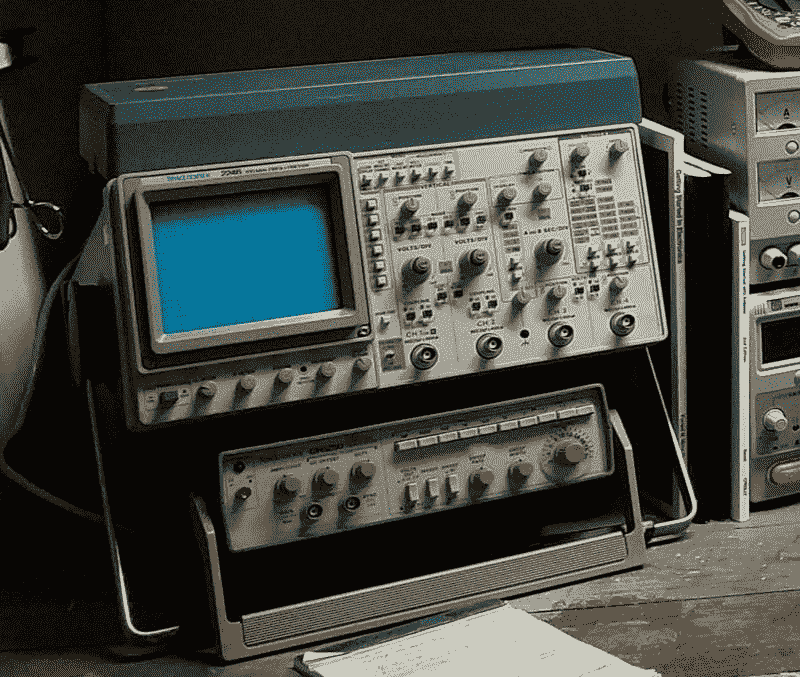
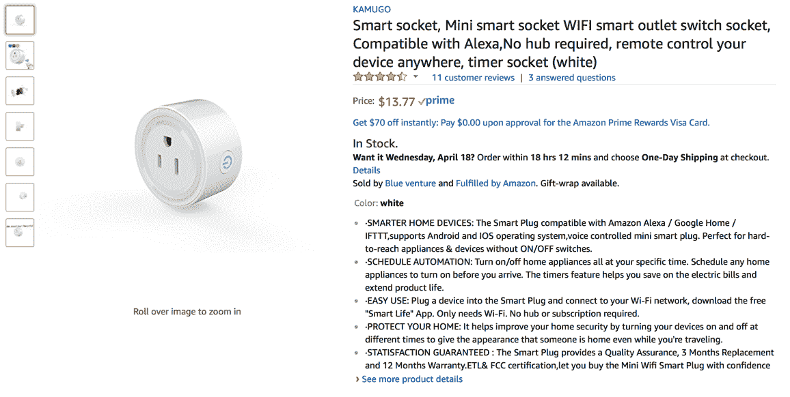
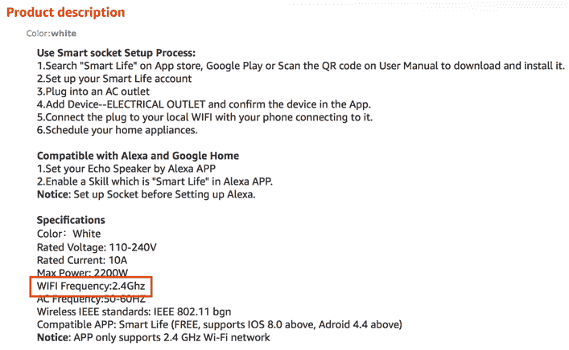
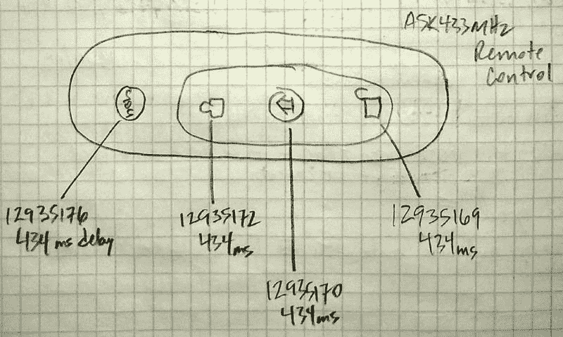
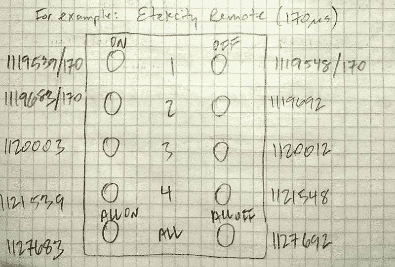

# 从我的第一个 DIY IoT 项目中吸取的经验

> 原文：[`developer.ibm.com/zh/tutorials/iot-lessons-learned-03/`](https://developer.ibm.com/zh/tutorials/iot-lessons-learned-03/)

我一生都在 DIY。从孩提时在后院通过旧胶合板和 2×4 积木搭建许多精巧的装置，到大学时制作部件和测试设备来帮助校准灵敏的天文仪器，我总是喜欢亲自动手、刨根问底。

如今，我的家就像是一个电子设备店，我在家中通过旧的鼠标部件来构建机器人，完善来自 [*Nuts and Volts* 期刊](http://www.nutsvolts.com)的其他许多项目。我知道如何使用烙铁，甚至还有一个引以为傲的 Tektronix 100MHz 4 频道滤波器：

因此，当我有机会撰写一个从头构建智能家居系统的教程系列时，我抓住了这个机会！IoT 智能家居？是的，我已经实现了。大时代。IoT？没错，我很快就会拥有这些“东西”。

我觉得差不多。

现在，我想提前说一下，IoT 智能家居自动化项目是我完成的最了不起的、最有趣的项目之一。它也是最困难、最让我懊恼、最枯燥的项目之一（如果您通过一个工具包构建过 Sumobot，您就会明白我的意思）。

在本文中，我将分享我为教程系列 *IoT 和智能家居*构建智能家居自动化系统时吸取的一些经验。如果您决定实现一个 IoT DIY 项目，或许这些经验可为您节省一些时间、精力和资金。

1

## 小心地选择您的部件

要进一步了解 IoT 硬件，请查阅这篇 [IoT 硬件指南](https://developer.ibm.com/zh/articles/iot-lp101-best-hardware-devices-iot-project/)。

根据您的 IoT 项目，您可能想要考虑一个 IoT 开发工具包。因为我是一位热衷于 DIY 的人士，所以我完全没有考虑任何 Raspberry Pi 3 工具包。

可以订购的 Raspberry Pi 3 工具包有很多，可能会让您不知所措（也许是故意的）。它们都包含大量看起来很不错的附件，比如一个盒子、散热器、HDMI 电缆、micro SD 卡等。在我的书中，我建议忘掉它们。只需订购 Raspberry Pi 和一个电源适配器就足够了。

在我看来，如果可以节省资金来单独订购 SD 卡，然后将您选择的镜像烧录到上面，为什么还要花费额外的资金购买一个包含 micro SD 卡且预装了 NOOBS（或您不一定想要的其他某个操作系统）的工具包呢？

谈到 SD 卡，最初启动该项目时，我只有一张 micro SD 卡。在我试验该项目，安装软件，确定我实际需要的部件和试验期间已安装的部件时，通常在安装软件后，当我发现不想要该软件时，已无法干净地删除它。能够恢复到一个”已知正常”状态会很不错。但是对于单张 SD 卡，我的选择包括艰难地前行（不是很确定我的 Pi 的状态）或通过在 SD 卡上烧录一个新 Raspbian 镜像来完全擦除它。

所以我订购了另外两张 16GB micro SD 卡。我可以放心大胆地进行试验，如果我安装了某个经证明不好的东西，我还有另外两个 Raspbian Stretch 安装可以引导。此外，我能够创建软件的不同配置（如果您愿意，可以将它们想象为不同的”配置文件”）来运行智能家居项目，通过切换 SD 卡来引导我想要的配置。

顺便说一下，请确保您保留了您的 Raspbian 镜像（或者您下载并安装在 SD 卡上的镜像）。我有三四次认识到需要烧录 Raspbian Stretch 镜像，然后不得不再次下载它。您知道我的意思：我曾认为，”这肯定是我最后一次需要将它烧录到 micro SD 卡上”，事实证明我错了。任何操作系统镜像都是一个非常大的文件，但我推荐将它保留在身边。避免漫长的下载。这个道理很明显，但我不得不尴尬地承认，我花了如此长时间才明白这个道理。

2

## 挑选一个通信协议并坚持使用它

要进一步了解其他 IoT 通信协议，请查阅这篇 [IoT 网络指南](https://developer.ibm.com/zh/articles/iot-lp101-connectivity-network-protocols/)。

IoT 设备环境是碎片化的。有数千种 IoT 设备类型和大量通信协议。在我选择运行的无线电频带 (RF) 中，有 3 种主要的协议：433MHz、Z-Wave (908.42MHz) 和 Zigbee (2.4GHz)。还有其他无线协议，比如蓝牙、蓝牙低功耗 (BLE)、WiFi、接触式、蜂窝式（比如 3G/4G），如果您想近距离亲密接触一下，还有近场通信 (NFC)。

如果想让您的设备协同工作，则需要挑选一种协议并坚持使用它。我为智能家居项目选择了 433MHz 频带。与其他协议相比，它拥有最广泛的低成本硬件、大量用来与设备进行通信的开源系统软件（中间件），以及许多样本源代码。它看起来是合理的选择，而且（这是我的第一个 IoT 智能家居项目）与蓝牙、BLE、WiFi 和其他可用协议相比，它拥有低得多的准入门槛。

我控制住了对使用不同频率的设备进行混搭的冲动，每种频率都需要不同的硬件和软件。为什么要让一个已经很复杂的项目变得更复杂？挑选一个频率并坚持使用它。

然后，在做出选择后，需要在购买设备时非常小心。从产品描述中并不总是能清楚了解您想要的设备是否使用了您需要的协议。

我差点就为该项目订购了一个 WiFi RF 插座，因为我在搜索“433MHz RF Outlet”时找到了它，而我没有仔细留意技术规格。

在我准备结账时，我被其他事情打断了（事实证明我很幸运）。在我稍后回来时，我更仔细地检查了购物车，注意到我即将订购的 RF 插座*不是* 433MHz 设备。

我很幸运，但这个错误可能会花费我的时间、精力，并让我非常懊恼（更别提资金）。请仔细阅读规格说明。如果您参与的是 433MHz 项目，而您考虑订购的设备没有明确表明它会使用 433MHz 频带，请不要订购它。就这么简单。

3

## 绘图……大量图表

一图胜千言，对吧？可以看到，我不是艺术家，但我会在笔记本中、白板上或者我所在的任何地方（当有一个想法袭来时）进行绘图。我希望以 IT 的方式处理我参与的每个项目，就好像它是一个科学研究项目。

这个图来自我的实验室笔记本，显示了 CPVan 家庭安全遥控器的编码。在参与像智能家居这样的项目时，捕捉这样的信息对我很重要。为什么？让我讲一个故事。

当我还是一名物理学专业的大学生时，我有幸跟随一位名叫 Al Grauer 的天文学家进行学习，他的专业是研究星体的光输出随时间的变化。一天晚上，气温已低于冰点，在亚利桑那州南部山脉的比奇洛山上，当我们在 61 英寸望远镜的穹顶下瑟瑟发抖时，我注意到他在记笔记。我问他在做什么，他的答案改变了我的人生。

他向我展示了他的研究笔记本：一本全是方格纸的装订笔记本（称为方格笔记本）。其中包含天空的图形、数据点图，以及各种其他星球观察图。“记下所有信息”，他告诉我。他继续说道，“作为科学家，您要尽可能记下所有信息，因为数据至关重要”。

他从他的背包中拿出了一本空方格笔记本递给我，这是我接下来 30 年里填写的众多笔记本中的第一本。使用这些笔记本是我沿用至今的一种习惯。这是来自我的实验室笔记本的一幅图，描绘了 Etekcity RF 遥控器的编码。

在我撰写智能家居系列时，我绘制了我使用的遥控器的图形，就像上面这幅图一样，并添加了遥控器上的相应按钮的编码值。

写下所有信息。您永远不会知道以后会需要什么信息。仔细记笔记是不错的科学研究方法。

4

## 不要做重复工作

利用前人的成果（“站在巨人的肩上”）。我知道我不会尝试构建自己的 IoT 设备。我喜欢构建事物，但我知道我会购买用于智能家居项目的任何 IoT 设备。

在教程系列“[设置一个家庭自动化系统的系统软件](https://developer.ibm.com/zh/tutorials/iot-smart-home-02/)”的第 2 部分中，我展示了如何设置这些实用工具。

但是，对于在 Pi 上运行的、用来与硬件进行通信的系统软件（中间件），我认为自行编写系统软件很有趣，不过事实证明做到这一点很难。确实很难。我很快了解到有许多开源库，比如 [wiringPi](http://wiringpi.com)、[rc-switch](https://github.com/sui77/rc-switch) 和 [433Utils](https://github.com/jstevenperry/433Utils)（仅列出了该系列中使用的 3 个），我决定使用它们。不从头构建所有部件没有什么丢脸的。

这里（或其他地方）存在一些巨人。让我提供两个示例。

在教程系列“[为一个家庭自动化系统开发 IoT 应用程序](https://developer.ibm.com/zh/tutorials/iot-smart-home-03/)”的第 3 部分中，我展示了如何创建家庭自动化控制器。

首先，为了让（在 Pi 上运行的）家庭自动化控制器能与 Watson IoT Platform 进行通信，我决定使用 Node-RED，这主要是因为该代码更容易开发和测试（而且基于流的编程范例非常不错）。

但我如何与 Watson IoT 进行通信呢？对我来说幸运的是，有一些优秀的组件可用于 Node-RED，我使用了这些组件，这使我能够专注解决手头的问题，而不是编写中间件。

接下来，为了使智能家居系列中的 Android 客户端应用程序能与 Watson IoT Platform 进行通信，我需要一个 Android MQTT 客户端。有许多优秀的 MQTT 库，我评估了几款之后决定使用 [Eclipse Paho Android Service](https://www.eclipse.org/paho/clients/android/)。它解决了 Android 平台上的后台处理的复杂细节，同样让我能自由地专注于功能。

将全面研究与对项目使用开源库相结合，在创造的乐趣与及时交付最终解决方案的满足感之间找到平衡。

## 结束语

大部分 IoT 项目都非常复杂，包含大量活动部件，而且需要连接和配置大量事物。在本文中，我分享了我在执行第一个复杂 IoT 项目（一个智能家居自动化项目）期间吸取的经验。希望这些经验不但能为您节省时间、精力和资金，还能保护您的牙釉质（您知道，避免您气得咬牙）。

本文翻译自：[Lessons learned from my first DIY IoT project](https://developer.ibm.com/tutorials/iot-lessons-learned-03/)（2017-04-27）