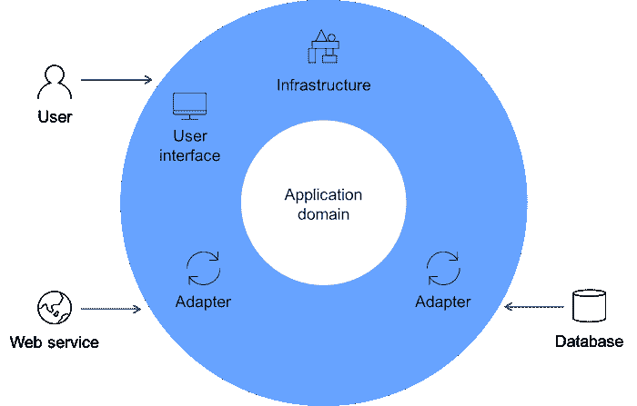
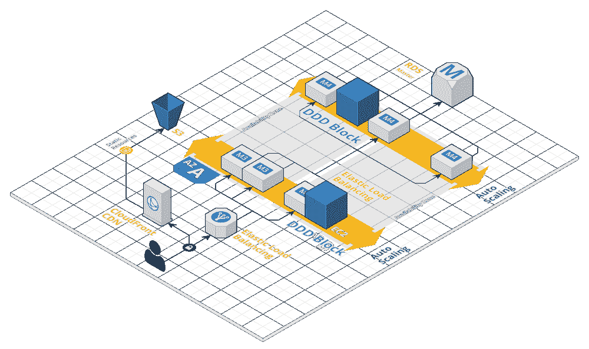
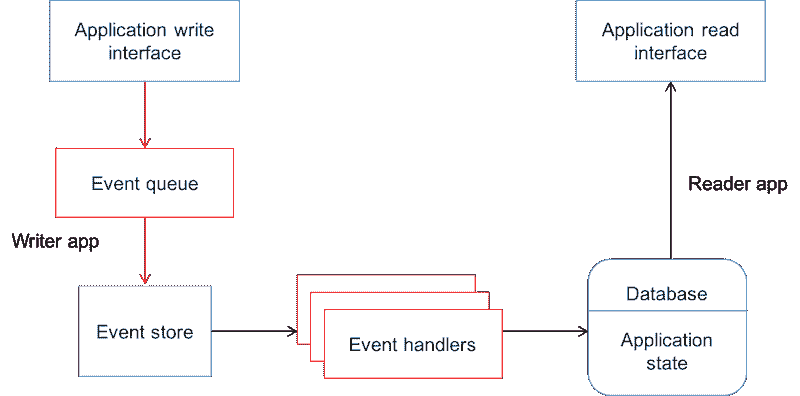

# 使用领域驱动设计构建云应用程序

> 原文：[`developer.ibm.com/zh/tutorials/cl-domain-driven-design-event-sourcing/`](https://developer.ibm.com/zh/tutorials/cl-domain-driven-design-event-sourcing/)

**领域驱动设计 (Domain-driven design,简称 DDD)** 是一组策略和工具，可帮助您设计系统并管理复杂事宜。鉴于您可以在网上查阅更多有关 DDD 的信息，且教程篇幅有限，因此本文不会深入探讨 DDD 的理论和起源。我们将重点介绍如何利用 DDD 架构云应用程序 – 具体来说，如何将其集成到现有堆栈中，尤其是它如何帮助您构建强大的事件溯源系统。

## 为何说使用 DDD 是非常值得的

DDD 在以下两方面效率最高：

*   **尽可能降低技术债务** – 通过一种短期内简单但长远看来复杂的开发方式，您可以创建最小可行产品 (MVP)。这种走捷径的方式或许能帮您赢得市场份额，但该项目日后可能会发展为通常所谓的“[大泥球](https://blog.codinghorror.com/the-big-ball-of-mud-and-other-architectural-disasters/)”，即“杂乱无章、错综复杂、邋遢不堪、随意拼贴的大堆代码”。
*   **控制固有的项目复杂性** – 如 [Paul Graham](http://paulgraham.com/wealth.html) 所说，你设法解决的问题如此复杂，乃至竞争对手根本不知道如何在市场上超过你。

[Martin Fowler](https://martinfowler.com/bliki/BoundedContext.html) 解释了 DDD 是如何帮助解决这些问题的（参见图 1）：

“DDD 基于底层领域模型设计软件。模型充当一种通用语言，促进软件开发人员与领域专家的交流。它还从概念角度为软件本身的设计奠定基础 – 如何分解为多个对象或功能。”

##### 图 1\. 领域驱动设计概述

以这种方式考虑软件有如下优势：

*   **简化项目** – 将大问题分解为多个可控问题，便于集中解决。
*   **更快完成项目** – 这从长期看来尤为明显，因为整个团队可以步调一致，且能更清楚地了解项目目标。

将合适的人员聚集起来，思考哪些领域需要建模以及它们之间如何交互，这对于设计服务拓扑来说是一个很棒的方案。在满足实际的业务需求时，DDD 也是一个可在开发期间使用的不错的代理。工程师们往往倾心于架构之美，在这些架构中，更快却不那么令人兴奋的方法即已足够。从实际模型的角度出发，用其他字符定义应用程序的上下文和用途，这在深入剖析项目技术细节时，无疑是一次很棒的现实检验。

DDD 还定义了[实际实现](https://martinfowler.com/tags/domain%20driven%20design.html)来帮助您进行推理，解决现实问题。许多现有的云项目都涉及多个团队、第三方服务以及分布式服务，但我们能识别出通用的架构，从而识别出通用的良好实践。采用 DDD，您可以建立更多的标准化方法，它们更具有前瞻性，更能灵活应对您所无力控制的种种变化等等。例如，[有界上下文](https://martinfowler.com/bliki/BoundedContext.html)可通过建议如何将大型项目划分为更加具体的上下文，并对它们之间的关系加以组织，有效处理这些大型项目。

**免费试用 IBM Cloud**

利用 [IBM Cloud Lite](https://cloud.ibm.com/registration?cm_sp=ibmdev-_-developer-tutorials-_-cloudreg) 快速轻松地构建您的下一个应用程序。您的免费帐户从不过期，而且您会获得 256 MB 的 Cloud Foundry 运行时内存和包含 Kubernetes 集群的 2 GB 存储空间。

## 微服务可助一臂之力

许多工程负责人和 DDD 爱好者都认可其潜力，但却不知如何将它带入自己的堆栈。如 [Eric Evans](https://domainlanguage.com/) 所说，这是一项高成本的侵入式过程，认清需求再进行实现非常重要。您需要评估自己的领域是否需要这种级别的管理，以及您的软件是否需要 DDD 模式来避免被轻易损坏。

在那些成功将 DDD 带入堆栈的人们之中，一种通用模式便是一次只应用一项服务。在聚集人员、定义领域时，您或许会发现新服务商机，一旦找准机会，便可以用 DDD 方式设计这些服务。这非常强大，因为您能认识到所有的敏捷优势。如果仅从一项服务开始，会更便于新手学习集成过程，也更易于不断迭代以及更改已采用的方式。这一过程同样也便于撤销。大多数代码可能仍然可用，汲取的有关识别领域的知识还能发挥作用。

另外，所有这些模式和过程细节都将隐藏在某种远程接口背后。既然您能处理 CRUD/REST API 或 GraphQL 端点，堆栈的其他部分应该很容易进行修改。在您按照 DDD 实践设计代码，以及从核心逻辑解耦客户端后，这甚至会变得更简单（参见图 2）。

##### 图 2\. 解耦客户端

如果微服务已就绪，这种情况尤为明显，因为您能认识到它们相同的优势 – 具体来说，即更小、更佳的有界组件。您可以轻松地修改这些组件，但要让其他组件知道如何与其交互。这种接口概念是关键，直接关系到 DDD 中良好的有界上下文的重要性，以及微服务中良好的服务解耦。

但您集成 DDD 的工作并不一定会因为您的架构有了更小、更佳的有界组件而变得更轻松。下面给出了一些示例：

*   **微服务已就绪** – 在这种情况下，好消息是您可能不需要开发微服务工作所需的所有细节，例如服务发现、日志管理和部署流程。但是，不良服务拓扑或者服务扩展架构和方式，会产生大量技术债务；这更加难以修复，因为您可能被迫在代码段之间移动特性，而这些代码段甚至不在同一服务器上运行。
*   **整体式应用程序已就绪** – 这可能是现今最常用的启动案例之一。在这种情况下，您要将不可靠的代码移入其服务，DDD 此时十分有用。但是，从头编写代码，且要从零开始构建项目，也带来了一些自有的挑战。例如，仅在一个存储库上开发会限制团队之间的协作配合与一致性。尽管如此，DDD 仍有许多优势，比如，限制技术债务。

在公司内部进行有效沟通并不容易。通常来说，使用一个通用框架很重要，更便于各部门相互之间交流业务问题。这有助于团队中的软件工程师通力合作，更准确地理解其代码的实际效用，以及如何理清问题主次。它还更便于项目管理人员使用相关界面。而销售专员和执行领导层则能更好地掌握 IT 开发进程，以及面对的挑战和期望。

因此，投入时间和精力说服开发人员接受 DDD 理念，能够带来更多成效，远超单纯遵循某种新的软件模式或策略实现的收益。此方法能帮助公司内部的团队成员更顺畅地交流，并提供丰富的工具用以解决问题。实施微服务解决模型问题时的种种权衡，都能进一步明确 DDD 并带入新词汇。

既然我们已经深入介绍了 DDD 与微服务交互的方法，接下来就看一下不太明显但却更普遍的模式：事件溯源。

## 事件溯源：天作之合

[事件溯源](https://martinfowler.com/eaaDev/EventSourcing.html) 是一种策略模式，迫使您将应用程序视为一系列事件，任何时候，只要架构中发生变更，就需要存储这些事件（参见图 3）。这让您能够对事件历史进行审阅、理解、回放、调试等任何需要的操作。如今，这常被作为数据流加以讨论，因此状态管理开始与现代开发密切相关。阅读 [Jay Kreps 的博客文章](https://engineering.linkedin.com/distributed-systems/log-what-every-software-engineer-should-know-about-real-time-datas-unifying)，更深入了解实时数据统一抽象的全部含义和优势。正是这种构想，推动着关系数据库以及 LinkedIn 这样的公司不断发展。

##### 图 3\. 事件溯源

您确实可以将此模式看作一种原子化、仅可附加的日志流 – 即在应用程序的生存期内，不会有删除或更新这样的操作。这意味着您可以读取日志历史，并重构过去任意时间的应用程序状态。这种模式在很多情况下都十分有用，例如，担心数据在处理过程中丢失，但仍保留有最初的原始数据。您还可以对此存储进行分区，同时仍能保有协调一致的历史记录，这和 [Kafka](http://cloudurable.com/blog/kafka-architecture-topics/index.html) 使其消息传递系统变得可扩展且实用的方法非常接近。

这可能很难实现，并且可能需要很多形式（[特定的存储](http://eventstore.js.org/)、[状态管理](https://medium.com/@_ericelliott/redux-is-a-library-which-implements-an-architecture-inspired-by-event-sourcing-but-with-a-d9d31781b4cd)），但可能位于抽象层之上的各种架构和工具使得值得付出努力。此文介绍的各种细节都能帮助您更深入地理解事件溯源。例如，如果您通过定义明确的接口、词汇表和有界上下文实现了解决特定问题的微服务，那么您就找到了一个非常不错的切入点来探索事件溯源。

正如 Kreps 在博文中所解释的那样，解耦过程能够帮您以一种清晰的方式理解数据流，或许您可以将其组织为用来触发行动的多个事件。这通常以任务队列形式来实现，所以在这种情况下，您可以从确保存储了所有事件入手，还可以停止轮询更改，转而等待输入。

一致的词汇将帮助您定义这些事件实际上是什么。或许会出现一些技术限制（像缓存数据库查询或限制连接瓶颈），但您可以在牢记正确业务目标和背景的前提下思考该问题，从而更具前瞻性。根据在整个项目开发生命周期内始终不变的核心价值展开相应的推理，由此推进一致的演变过程。由于此前在微服务部分提到的同样的原因，该集成更加安全。此外，还有很多优势，例如，更简单的团队管理以及基于现有架构的构建工具。

## 结束语

尽管此文的内容本质上是理论知识，但它反映了过去几个月里，我在现公司 Kpler 所参与的工作。我们一直在通过 DDD 探究我们的流程，所以我能够最先看到这种方法能为团队带来的种种优势。我们十分成功地在各处零散地实现了 DDD 和事件溯源，这需要我们满足数据质量和负载方面的严格需求。当然，这并不简单 – 我们需要围绕新项目对团队展开培训，还要对实验以及失败上额外花费的时间作出合理的解释。但这些努力最终换来了更强大的服务，并且能够更加灵活地集成到我们的堆栈和未来功能部件中。

所以，我希望这篇文章能对您产生启发，激励您亲自去调查和实验 DDD。

本文翻译自：[Use domain-driven design to architect your cloud apps](https://developer.ibm.com/tutorials/cl-domain-driven-design-event-sourcing/)（2018-04-12）