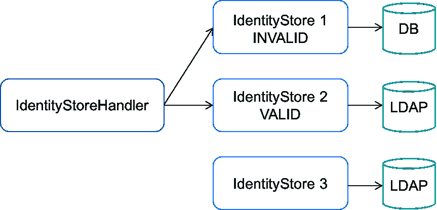
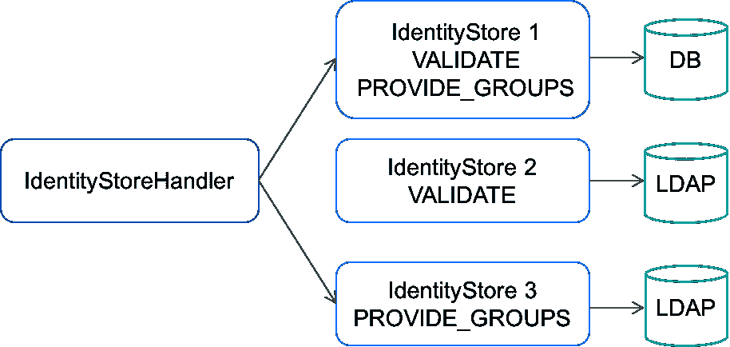

# 通过 IdentityStore 安全地访问用户凭证

> 原文：[`developer.ibm.com/zh/tutorials/j-javaee8-security-api-3/`](https://developer.ibm.com/zh/tutorials/j-javaee8-security-api-3/)

**关于本系列**

期盼已久的新 [Java EE Security API (JSR 375)](https://jcp.org/en/jsr/detail?id=375) 推动 Java 企业安全性进入了云和微服务计算时代。本系列将展示新安全机制如何简化和标准化各种 Java EE 容器实现之间的安全处理，然后帮助您开始在受云支持的项目中使用它们。

[本系列的第一篇文章](https://www.ibm.com/developerworks/cn/java/j-javaee8-security-api-1/index.html) 概述了新 [Java™ EE Security API (JSR 375)](https://jcp.org/en/jsr/detail?id=375) 的基本特性和组件，包括新的 `IdentityStore` 接口。在本文中，您将了解如何使用 `IdentityStore` 在您的 Java Web 应用程序中安全地存储和访问用户凭证数据。

新 `IdentityStore` 抽象是 Java EE Security API 规范版本中的 3 个重要特性之一。 *身份存储* 是一个数据库，用于存储用户身份数据，比如用户名、组成员关系，以及用于验证调用方凭证的其他信息。尽管 `IdentityStore` 旨在用于任何身份验证机制，但它特别适合与 Java EE 8 的 `HttpAuthenticationMechanism` （已在 [第 2 部分](https://www.ibm.com/developerworks/cn/java/j-javaee8-security-api-2/index.html) 中介绍）集成。

[获得代码](https://github.com/readlearncode/Java-EE-8-Sampler/tree/master/security-1-0)

## 安装 Soteria

我们将使用 Java EE 8 Security API 参考实现 [Soteria](https://github.com/javaee/security-soteria) 来探索 `IdentityStore` 。您可以通过两种方式之一获取 Soteria。

### 1.在 POM 中显式指定 Soteria

使用以下 Maven 坐标在 POM 中指定 Soteria：

##### 清单 1\. Soteria 项目的 Maven 坐标

```
<dependency> <groupId>org.glassfish.soteria</groupId> <artifactId>javax.security.enterprise</artifactId> <version>1.0</version> </dependency> 
```

### 2.使用内置的 Java EE 8 坐标

符合 Java EE 8 规范的服务器将拥有自己的新 Java EE 8 Security API 实现，否则它们会依靠 Sotoria 的实现。无论如何，您都只需要 Java EE 8 坐标：

##### 清单 2\. Java EE 8 Maven 坐标

```
<dependency> <groupId>javax</groupId> <artifactId>javaee-api</artifactId> <version>8.0</version> <scope>provided</scope> </dependency> 
```

与 `IdentityStore` 相关的接口、类和注解位于 `javax.security.enterprise.identitystore` 包中。

## IdentityStore 的工作原理

类似于 [JAAS LoginModule](https://docs.oracle.com/javase/8/docs/technotes/guides/security/jaas/JAASLMDevGuide.html) 接口， `IdentityStore` 是一种抽象，用于与身份存储进行交互，并验证用户和检索组成员关系。 `IdentityStore` 的设计非常适合 `HttpAuthenticationMechanism` ，但您可以使用您希望使用的任何身份验证机制。您还可以选择是否使用容器，但在大多数情况下都推荐对 `IdentityStore` 机制使用容器。通过将 `IdentityStore` 与容器相结合，可以通过一种标准的可移植方式来控制身份存储。

### IdentityStoreHandler

`IdentityStore` 的实例是通过 `IdentityStoreHandler` 进行管理的，后者提供了查询所有可用身份存储的机制。可通过 CDI 注入一个处理程序类型的实例，如清单 3 所示。在需要执行身份验证的任何地方，都将使用这个实例。（参阅 [第 1 部分](https://www.ibm.com/developerworks/cn/java/j-javaee8-security-api-1/index.html) ，查看 Java EE Security API 中的 CDI 的概述。）

##### 清单 3\. 注入身份存储处理程序

```
@Inject private IdentityStoreHandler idStoreHandler; 
```

`IdentityStoreHandler` 接口有一个 `validate()` 方法，该方法接受一个 [凭证](https://javaee.github.io/security-api/apidocs/javax/security/enterprise/credential/Credential.html) 实例。此方法的实现通常会调用与一个或多个 `IdentityStore` 实现相关的 `validate()` 和 `getCallerGroups()` 方法，然后返回一个聚合结果。本教程后面会更详细地解释这个特性。

Java EE Security API 包含 `IdentityStoreHandler` 接口的默认实现，在大部分情况下，该实现应该就足够用了。也可以选择将默认实现替换为自定义实现。

`IdentityStoreHandler` 的默认实现向多个 `IdentityStore` 执行身份验证。它迭代一个存储列表，以 `CredentialValidationResult` 实例形式返回一个聚合结果。此对象可能非常简单，也可能非常复杂。在最简单的情况下，它会提供一个状态值： `NOT_VALIDATED` 、 `INVALID` 或 `VALID` 。在许多情况下，您需要采用这些附加值的某种组合：

*   `CallerPrincipal` ，包含或不包含调用方的组
*   调用方的名称或 LDAP 专有名称 （DN)
*   来自身份存储的调用方的唯一标识符

现在我们仅关注默认设置，但本文后面将通过实现 `IdentityStore` 接口来展示如何设置您自己的轻量级身份存储。

## 内置身份存储

Java EE Security API 包含针对 LDAP 和 RDBMS 的内置 `IdentityStore` 实现。像新 Security API 中的其他特性一样，这些特性很容易通过注解来调用。

#### 调用一个内置的 RDBMS 集成

可通过绑定到 JNDI 的 `DataSource` 来访问外部数据库。您将使用 `@DataBaseIdentityStoreDefinition` 注解来激活一个外部数据库。激活外部数据库之后，您将通过向注解传递值来配置连接细节。

#### 调用一个内置的 LDAP 集成

您将使用 `@LdapIdentityStoreDefinition` 注解来调用并配置一个 LDAP `IdentityStore` bean。调用这个 bean 后，可以传入所需的配置详细信息来连接到一个外部 LDAP 服务器。

请注意，这些实现是应用程序范围内的 CDI bean，而且基于 Java EE 7 中已有的 `[@DataStoreDefinition](https://docs.oracle.com/javaee/7/api/javax/annotation/sql/DataSourceDefinition.html)` 注解。

### 如何配置一个内置的 RDBMS 身份存储

最简单的内置身份存储是数据库存储，它是通过 `@DataBaseIdentityStoreDefinition` 注解进行配置的。清单 4 给出了一个内置数据库存储的样本配置。

##### 清单 4\. 配置一个 RDBMS 身份存储

```
@DatabaseIdentityStoreDefinition( dataSourceLookup = "${'java:global/permissions_db'}", callerQuery = "#{'select password from caller where name = ?'}", groupsQuery = "select group_name from caller_groups where caller_name = ?", hashAlgorithm = PasswordHash.class, priority = 10 ) @ApplicationScoped @Named public class ApplicationConfig { ...} 
```

如果您配置过数据库定义，那么您应该很熟悉清单 4 中的配置选项。您应该注意的一点是优先级设置为 10。此值在已经实现多个身份存储时使用。该值用于确定迭代顺序，稍后我会更详细地讨论它。

有 9 个可能的参数可用来配置您的数据库。您可以在 [DatabaseIdentityStoreDefinition](https://javaee.github.io/security-api/apidocs/javax/security/enterprise/identitystore/DatabaseIdentityStoreDefinition.html) 的 Javadoc 中了解它们。

### 如何配置内置的 LDAP 身份存储

LDAP 配置拥有的配置选项比 RDBMS 选项多得多。如果您拥有使用 LDAP 配置语义的经验，则应该熟悉这些配置选项。清单 5 给出了配置 LDAP 身份存储的部分选项。

##### 清单 5\. 一个 LDAP 身份存储的配置

```
@LdapIdentityStoreDefinition( url = "ldap://localhost:33389/", callerBaseDn = "ou=caller,dc=jsr375,dc=net", groupSearchBase = "ou=group,dc=jsr375,dc=net" ) @DeclareRoles({ "admin", "user", "demo" }) @WebServlet("/admin") public class AdminServlet extends HttpServlet { ...} 
```

参阅 [LdapIdentityStoreDefinition](https://javaee.github.io/javaee-spec/javadocs/javax/security/enterprise/identitystore/LdapIdentityStoreDefinition.html) Javadoc，查看配置 LDAP 身份存储的 24 个可能的参数。

## 开发一个自定义身份存储

如果所有内置的身份存储都无法满足您的需求，可以使用 `IdentityStore` 接口来开发一个自定义解决方案。 `IdentityStore` 接口包含 4 个方法，每个方法都拥有默认实现。清单 6 给出了每个方法的签名。

##### 清单 6\. IdentityStore 的 4 个方法

```
default CredentialValidationResult validate(Credential) default Set<String> getCallerGroups(CredentialValidationResult) default int priority() default Set<ValidationType> validationTypes() 
```

`IdentityStore` 接口中的所有方法都标为 `default` ，所以没有强制要求提供实现。默认情况下会调用两个关键方法，第三个方法在配置了多个身份存储时使用：

*   `**validate()**` 确定给定的 `Credential` 是否有效，并返回一个 `CredentialValidationResult` 。
*   `**getCallerGroups()**` 返回一个包含与调用方相关的组名称的 `集合` ，将它们聚合到 `CredentialValidationResult` 实例中已列出的组中。
*   `**getPriority()**` 在定义一个以上 `IdentityStore` 时使用。该值越低，优先级就越高。优先级相同会产生未定义的行为。
*   `**validationTypes()**` 返回一组 `ValidationTypes` ，它们确定了已实现哪个/哪些方法（ `validate()` 和/或 `getCallerGroups()` ）。

对 `validate()` 方法的调用可以确定给定的 `Credential` 是否有效，并返回一个 `CredentialValidationResult` 。返回的 `CredentialValidationResult` 实例上的各种方法提供了调用方的 LDAP 专有名称 （DN)、唯一身份存储 ID、结果状态、身份存储 ID、 `Principal` 和组成员关系。

**备注**：*结果状态*对确定 `IdentityStoreHandler` 在配置了一个以上 `IdentityStoreHandler` 时的行为至关重要；状态选项包括 `NOT_VALIDATED`、`INVALID` 或 `VALID`。

### 实现 validate() 和 getCallerGroups()

`validate()` 和 `getCallerGroups()` 方法用于验证调用方的 `Credential` 或获取它们的组信息。数据存储实现可以使用其中一个方法或两个方法都使用。实际实现的方法是通过 `validationTypes()` 方法来声明的。

此特性使您能够灵活地指定一个身份存储来执行身份验证，而另一个身份存储负责执行授权。 `validationTypes()` 方法返回一组 `ValidationType` ，这些类型可能包含 `VALIDATE` 或/和 `PROVIDE_GROUPS` 。 `VALIDATE` 常量表明 `validate()` 方法已实现， `PROVIDE_GROUPS` 表明 `getCallerGroups()` 方法已实现。如果同时返回了二者，则两个方法都已实现。

**备注**：`IdentityStore` 不应该维护状态，也不应该拥有调用方身份验证流程的当前进度的任何信息。从逻辑上讲，通过身份存储来跟踪用户的身份验证状态是没有意义的。

## 处理多个身份存储

`IdentityStoreHandler` 在需要处理多个 `IdentityStore` 实现的场景中使用。它提供了一个名为 `validate()` 的方法，该方法拥有与 `IdentityStore` 实现上的同名方法相同的签名。这里的思路是允许将多个身份存储有效地作为单一 `IdentityStore` 。

`IdentityStoreHandler` 上的 `validate()` 方法使用以下逻辑对身份存储进行查询：

1.  依据 `validationTypes()` 方法所声明的功能，调用身份存储的 `validate()` 方法。这些方法是按 `getPriority()` 方法所确定的顺序进行调用的。

    *   如果返回 `VALID` 状态结果，则不需要进一步询问任何身份存储。在这种情况下，逻辑跳转到第 2 步。
    *   如果状态为 `INVALID` ，则记住此状态供以后使用，而且 `IdentityStoreHandler` 会继续询问剩余的身份存储。
2.  如果仅返回了一个 `INVALID` 状态，则返回 `INVALID` ；否则返回 `NOT_VALIDATED` 。
3.  如果返回了一个 `VALID` 结果且身份存储声明了 `PROVIDE_GROUPS` 验证类型，那么 `IdentityStoreHandler` 将会开始收集调用方组成员关系，这是通过将返回的调用方组聚合到 `CredentialValidationResult` 对象中来完成的。

    *   所有仅声明了 `PROVIDE_GROUPS` 验证类型的 `IdentityStores` 都通过调用 `getCallerGroups()` 方法来询问。返回的组名称列表与累积的组集合聚合在一起。
4.  询问所有 `IdentityStores` 后，会通过一个 `VALID` 状态和调用方组列表来构造一个 `CredentialValidationResult` ，并返回该结果。

### 询问实践

现在，让我们来看一个需要询问多个身份存储的场景。在此场景中，IdentityStore 1 连接到一个 RDBMS，而 IdentityStore 2 和 IdentityStore 3 连接到一个 LDAP 容器。

在图 1 中，身份存储处理程序按优先级顺序迭代 `IdentityStore` 实例，在每个实例上调用 `validate()` 方法，直到它找到一个返回 `VALID` 状态的 `CredentialValidationResult` 。这发生在询问 IdentityStore 2 时。该处理程序停止这次迭代，开始第二次迭代来收集调用方的组。

##### 图 1.IdentityStoreHandler 对身份存储的第一次询问



图 2 表示第二次迭代。该处理程序在每个 `IdentityStore` 实例上调用 `getCallerGroups()` 方法，仅声明一个 `PROVIDE_GROUPS` 验证类型。

在此场景中，唯一符合该规范的身份存储是 IdentityStore 3。返回的调用方组与组名称集合相结合，后者通过在 IdentityStore 2 返回的 `CredentialValidationResult` 实例上调用 `getCallerGroups()` 来返回。

##### 图 2\. IdentityStoreHandler 对身份存储的第二次询问



询问所有 `IdentityStores` 后，会通过一个 `VALID` 状态和调用方组列表来构造一个 `CredentialValidationResult` ，并返回该结果。

这个简单示例演示了如何通过一个 `IdentityStore` 来验证调用方，以及如何根据一个组成员列表来构建另一个组成员列表。

## 包含 cookie 的凭证

就像在第 2 部分中的 `HttpAuthenticationMechanism` 中所看到的那样，使用 cookie 开发自定义 `IdentityStore` 解决方案相当容易。 `RememberMeIdentityStore` 类似于 `IdentityStore` 接口，但它的目的是供支持 `@RememberMe` 注解的拦截器绑定使用，而不是供身份验证机制使用。

`RememberMeIdentityStore` 被用于：

*   为调用方生成一个”记住我”登录令牌。
*   记住与”记住我”登录令牌相关的调用方。
*   如果调用方返回，则验证登录令牌，而且无需额外的凭证即可重新验证调用方。

`validate()` 方法接收传递的 `RememberMeCredential` 并验证它，而 `generateLoginToken()` 方法将一个令牌与给定的组和主体相关联。如果没有找到调用方的登录令牌，或者如果登录令牌已过期，则执行正常的身份验证。

## 第 3 部分小结

`IdentityStore` 接口为在 Java 企业应用程序中集成外部调用方验证和授权机制提供了人们期待已久的必要简化。 `IdentityStore` 保证了跨容器和服务器的可移植性，使得与多个身份存储无缝通信变得很容易。

如果您不需要实现自定义身份存储，那么一个注解和一些连接细节就足以配置一个 LDAP 容器或 RDBMS 了。任何 Java EE 8 身份存储都将支持内置的 `HttpAuthenticationMechanism` ，所以将 LDAP 登录信息与 Web 用户连接起来非常简单，只需一些注解即可。

敬请期待本教程系列的最后一篇文章，其中将介绍新的 `SecurityContext` 接口。

## 测试您的知识

1.  以下哪些选项用于配置内置的身份存储？（选择所有适合的选项。）

    1.  `@LdapIdentityStoreDefinition`
    2.  `@DatabaseIdentityStoreDefinition`
    3.  `@RdbmsIdentityStoreDefinition`
    4.  `@DataBaseIdentityStoreDefinition`
    5.  `@RememberMeIdentityStoreDefinition`
2.  以下哪些 `IdentityStore` 接口方法拥有默认实现？

    1.  只有 `priority()` 和 `validationTypes()` 。
    2.  只有 `priority()` ，而且在未设置时，默认优先级为 100。
    3.  只有 `CredentialValidationResult()` 、 `priority()` 和 `validationTypes()` 。
    4.  所有 4 个接口方法都有默认实现。
    5.  所有接口方法都没有默认实现。
3.  给定多个 `IdentityStore` 实现，在对 `validate()` 方法的调用返回 `VALID` 时， `IdentityStoreHandler` 的默认行为是什么？

    1.  它会继续询问剩余的身份存储，直到身份存储的第二轮迭代开始。
    2.  它会停止迭代，通过返回 `CredentialValidationResult` 对象来确认调用方的授权。
    3.  它会重新开始对身份存储进行迭代并调用 `getCallerGroups()` 方法。
    4.  它会在该身份存储上调用 `getCallerGroups()` 方法，构造并返回一个 `CredentialValidationResult` 对象。
    5.  上述选项都不是
4.  在 `IdentityStore` 实例上调用 `getCallerGroups()` 方法，会返回以下哪种类型？

    1.  `List<String>`
    2.  `Set<String>`
    3.  `Map<Caller, String>`
    4.  `Set<Group>`
    5.  `List<Group>`
5.  以下哪些有关 `RememberMeIdentityStore` 的陈述是正确的？

    1.  `RememberMeIdentityStore` 扩展了 `IdentityStore` 。
    2.  它的目的是供支持 `@RememberMe` 注解的拦截器绑定使用。
    3.  它可用于重新验证调用方，而不需要提供额外的凭证。
    4.  它是 3 个内置的 IdentityStore 类型之一。
    5.  如果”记住我”登录令牌过期，则执行正常的身份验证。

## 核对您的答案

1.  以下哪些选项用于配置内置的身份存储？（选择所有适合的选项。）

    1.  **`@LdapIdentityStoreDefinition`**
    2.  `@DatabaseIdentityStoreDefinition`
    3.  `@RdbmsIdentityStoreDefinition`
    4.  **`@DataBaseIdentityStoreDefinition`**
    5.  `@RememberMeIdentityStoreDefinition`
2.  以下哪些 `IdentityStore` 接口方法拥有默认实现？

    1.  只有 `priority()` 和 `validationTypes()` 。
    2.  只有 `priority()` ，而且在未设置时，默认优先级为 100。
    3.  只有 `CredentialValidationResult()` 、 `priority()` 和 `validationTypes()` 。
    4.  所有 4 个接口方法都有默认实现。
    5.  **所有接口方法都没有默认实现。**
3.  给定多个 `IdentityStore` 实现，在对 `validate()` 方法的调用返回 `VALID` 时， `IdentityStoreHandler` 的默认行为是什么？

    1.  它会继续询问剩余的身份存储，直到身份存储的第二轮迭代开始。
    2.  它会停止迭代，通过返回 `CredentialValidationResult` 对象来确认调用方的授权。
    3.  **它会重新开始对身份存储进行迭代并调用 `getCallerGroups()` 方法。**
    4.  它会在该身份存储上调用 `getCallerGroups()` 方法，构造并返回一个 `CredentialValidationResult` 对象。
    5.  上述选项都不是
4.  在 `IdentityStore` 实例上调用 `getCallerGroups()` 方法，会返回以下哪种类型？

    1.  `List<String>`
    2.  **`Set<String>`**
    3.  `Map<Caller, String>`
    4.  `Set<Group>`
    5.  `List<Group>`
5.  以下哪些有关 `RememberMeIdentityStore` 的陈述是正确的？

    1.  `RememberMeIdentityStore` 扩展了 `IdentityStore` 。
    2.  **它的目的是供支持 `@RememberMe` 注解的拦截器绑定使用。**
    3.  **它可用于重新验证调用方，而不需要提供额外的凭证。**
    4.  它是 3 个内置的 IdentityStore 类型之一。
    5.  **如果”记住我”登录令牌过期，则执行正常的身份验证。**

本文翻译自：[Securely access user credentials with IdentityStore](https://developer.ibm.com/tutorials/j-javaee8-security-api-3/)（2018-04-12）