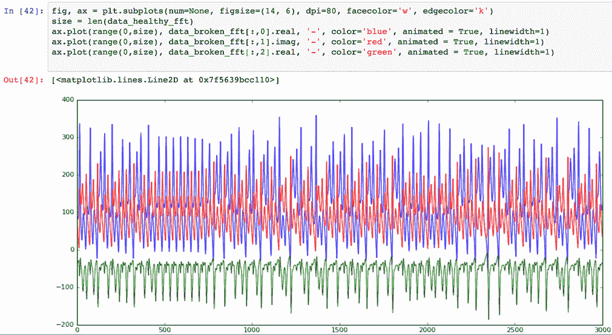

# 使用 Keras 和 TensorFlow 执行异常检测

> 原文：[`developer.ibm.com/zh/tutorials/iot-deep-learning-anomaly-detection-5/`](https://developer.ibm.com/zh/tutorials/iot-deep-learning-anomaly-detection-5/)

在本系列文章中，目前我已[介绍了深度学习和长短期记忆 (LSTM) 网络](https://www.ibm.com/developerworks/cn/iot/iot-deep-learning-anomaly-detection-1/index.html?ca=drs-)，展示了[如何生成用于异常检测的数据](https://www.ibm.com/developerworks/cn/iot/iot-deep-learning-anomaly-detection-2/index.html)，还介绍了[如何使用 Deeplearning4j 工具包](https://www.ibm.com/developerworks/cn/iot/iot-deep-learning-anomaly-detection-3/index.html)和 [DeepLearning library of Apache SystemML](https://www.ibm.com/developerworks/cn/iot/iot-deep-learning-anomaly-detection-4/index.html?ca=drs-) – 一个基于成本的线性代数优化器。在第 5 篇也是最后一篇文章中，我将介绍 Keras 和 TensorFlow。

提醒一下，我们的任务是检测一个轴承中的振动（加速计）传感器数据中的异常，如轴承上的加速计传感器记录了 3 个几何轴 x、y 和 z 上的振动。所示。

##### 轴承上的加速计传感器记录了 3 个几何轴 x、y 和 z 上的振动


谈到深度学习，许多人会谈论诸如 TensorFlow 和 PyTorch 之类的库。这些都是不错的工具，但在我看来，它们仅提供了相对低级的支持，这意味着您需要考虑大量关于线性代数和矩阵形状方面的事情。另一方面，Keras 是诸如 TensorFlow 和 Microsoft Cognitive Toolkit（以前称为 CNTK）之类的流行深度学习框架之上的一个高级抽象层；Keras 不仅使用这些框架作为执行引擎来进行数学运算，还可以导出深度学习模型，以便其他框架可以挑选使用它们。此外，因为我们已在本系列中介绍了 Deeplearning4j 和 SystemML，所以我很高兴地告诉您，两种框架都可以读取 Keras 模型并执行操作。这是不是很棒？您可以在 Keras 中快速执行原型设计，然后在 Apache Spark 上使用 Deeplearning4j 或 SystemML 作为 Keras 模型执行框架来进行扩展。最后，为了保持完整性，有一些框架（比如 TensorFrames 和 TensorSpark）直接将 TensorFlow 引入 Apache Spark 中，但这不属于本文的讨论范围。

## 构建您的应用程序需要做的准备工作

*   一个 IBM Cloud 帐户。（您可以在[此处](https://cloud.ibm.com/registration?cm_sp=ibmdev-_-developer-tutorials-_-cloudreg)申请一个免费试用帐户。）
*   一个 IBM Watson IoT Platform 帐户。可以使用您在注册 IBM Cloud 帐户时创建的 IBM ID。要开始使用 IBM IBM Watson IoT Platform，请观看 IBM Developer TV 上的这个[视频集合](https://developer.ibm.com/tv/ibm-data-science-experience-basics/)中的视频。

    1.  打开 [Watson Studio](https://www.ibm.com/cn-zh/cloud/watson-studio)。
    2.  单击 **Sign up**。
    3.  单击 **Sign in with your IBM ID**。
    4.  单击 **Sign up for DSX**。
    5.  在 Create Organization and Space 页面上，单击 **Continue**。
    6.  等待环境初始化，并在初始化完成后单击 **Get Started**。

## 设置开发环境

在讨论深度学习用例之前，让我们花点时间来设置一下开发环境。我们使用了在 IBM IBM Watson IoT Platform 内运行的 Jupyter Notebook。

我们首先查看一个包含两个“pickle 化”数据集的简单示例（pickle 接口是 Python 中的序列化和反序列化框架）- 一个包含健康数据，另一个包含受损数据，用于开发神经网络。

然后，我们将把这个 Notebook 转换为实时异常检测器，它使用 IBM Watson IoT Platform 直接从 MQTT 主题访问数据。

1.  登录到 [datascience.ibm.com](https://www.ibm.com/cn-zh/cloud/watson-studio)。
2.  将一个包含所有必要代码的 Jupyter Notebook 导入 IBM Watson IoT Platform 中。

    1.  在右上角单击 **Create new > Notebook**。

        **备注：**如果您已有一个帐户，可在左上角单击 **IBM IBM Watson IoT Platform** 来打开仪表板，然后单击 **Get started**。从这里，可以单击 **New notebook**。

        [显示了 IBM Watson IoT Platform 仪表板的屏幕截图](https://developer.ibm.com/developer/default/tutorials/iot-deep-learning-anomaly-detection-5/images/image2.png)

    2.  单击 **From URL**，在 **Name** 字段中添加一个名称，并在 **Notebook URL** 字段中粘贴以下 URL： `https://raw.githubusercontent.com/romeokienzler/developerWorks/master/WatsonIoTPlatformKerasTFLSTM.ipynb`
    3.  单击 **Create Notebook**。

理论上，您可能已从这里开始操作，但容许我介绍一下 Keras 和 TensorFlow，然后分析一下代码。

## TensorFlow 是什么？

要获得关于 TensorFlow 的出色介绍，请查阅 Vinnie Rao 的这篇 [TensorFlow 入门](https://www.ibm.com/developerworks/cn/cognitive/library/cc-get-started-tensorflow/index.html)文章。

要获得关于 TensorFlow 及其计算图的更详细解释，请参阅康乃尔大学的这篇文章：Artin Abadi 等人合著的
[TensorFlow：异构分布式系统上的大型机器学习](https://arxiv.org/abs/1603.04467)。

Google 2015 年依据 Apache 2.0 开源许可发布了 TensorFlow。

TensorFlow 有两个组件：一个在计算图上执行线性代数运算的引擎和一个定义并执行该图的接口。TensorFlow 中的引擎是用 C++ 编写的，而 SystemML 中的引擎是用 JVM 语言编写的。尽管 TensorFlow 有一些不同的语言绑定，但最突出的是 Python。

TensorFlow 的引擎可以在 CPU、GPU、TPU 上运行，而且还有一个适用于移动和嵌入式设备的 [TensorFlow Lite](https://www.tensorflow.org/mobile/tflite/)。该引擎有 3 个组件：

*   客户端组件创建计算执行图并将它提交给主组件。
*   主组件解析计算执行图并将它分发给工作者组件。
*   工作者组件执行计算执行图的各部分。

工作者组件可以使用 GPU 和 TPU 等专业硬件。分布式 TensorFlow 可以在多个机器上运行，但本文中不会介绍这方面的内容，因为我们可以使用 Deeplearning4j 和 Apache SystemML 在 Apache Spark 上执行分布式处理，而不需要安装分布式 TensorFlow。

换句话说，TensorFlow 只是一种通过 Python 表达的特定于领域的语言 (DSL)，用于为线性代数运算定义一个计算执行图，还会定义一个相应的（并行）执行引擎来运行它的优化版本。

## Keras 是什么？

您可能已经注意到，TensorFlow 有时可以处理低级线性代数运算，但该代码看上去不太美观（甚至从数学家的角度看也不够美观）。因此，我建议尽可能使用 Keras。这篇名为[将 Keras 用作 TensorFlow 的简化接口：教程](https://blog.keras.io/keras-as-a-simplified-interface-to-tensorflow-tutorial.html)的博客很好地介绍了 Keras。在本教程中分析代码期间，我会基于这篇博客来解释 Keras。

## 创建一个 Keras 神经网络来执行异常检测

我们需要在 IBM Watson IoT Platform 上，在 Keras 中使用 TensorFlow 和一个已生成的数据集构建一些有用的功能。（请记住，我们使用了一个 Lorenz Attractor 模型来获取轴承中模拟的实时振动传感器数据。我们需要将该数据传输到 IBM Cloud 平台。请参阅关于[如何生成用于异常检测的数据](https://www.ibm.com/developerworks/cn/iot/iot-deep-learning-anomaly-detection-2/index.html)的教程。）我们在设置开发环境时导入了 WatsonIoTPlatformKerasTFLSTM Notebook，现在将分析它。**备注：**如果您关闭了 Data Science Experience，可以打开之前导入的 WatsonIoTPlatformKerasTFLSTM Notebook。

### 安装并导入依赖项

最初，我们需要确保所有依赖项都已安装。

```
import pip

try:
    __import__('keras')
except ImportError:
    pip.main(['install', 'keras'])

try:
    __import__('h5py')
except ImportError:
    pip.main(['install', 'h5py'])

try:
    __import__('ibmiotf')
except ImportError:
    pip.main(['install', 'ibmiotf']) 
```

接下来，我们会审查该 Notebook 和依赖项列表。（**备注：**Keras 已预先安装在 IBM Data Science Experience 中。）

```
import numpy as np
from numpy import concatenate
from matplotlib import pyplot
from pandas import read_csv
from pandas import DataFrame
from pandas import concat
import sklearn
from  sklearn.preprocessing import MinMaxScaler
from sklearn.preprocessing import MinMaxScaler
from sklearn.preprocessing import LabelEncoder
from sklearn.metrics import mean_squared_error
from keras.models import Sequential
from keras.layers import Dense
from keras.layers import LSTM
from keras.callbacks import Callback
from keras.models import Sequential
from keras.layers import LSTM, Dense, Activation
import pickle
import matplotlib.pyplot as plt
from mpl_toolkits.mplot3d import Axes3D
import ibmiotf.application
from Queue import Queue
%matplotlib inline 
```

### 下载受损数据和健康数据

接下来，我们需要下载两个包含受损数据和健康数据样本的数据文件。


```
!rm watsoniotp.*
!wget https://raw.githubusercontent.com/romeokienzler/developerWorks/master/lorenzattractor/watsoniotp.healthy.phase_aligned.pickle
!wget https://raw.githubusercontent.com/romeokienzler/developerWorks/master/lorenzattractor/watsoniotp.broken.phase_aligned.pickle 
```

### 序列化两个 numpy 数组

这两个数据文件是使用 Python pickle 库序列化的 numpy 数组。我们需要利用这些文件对这两个数组执行反序列化（再次具体化）。

```
data_healthy = pickle.load(open('watsoniotp.healthy.pickle', 'rb'))
data_broken = pickle.load(open('watsoniotp.broken.pickle', 'rb')) 
```

### 为数据设置正确的形状

为了确保形状是正确的，我们将它们都设置为拥有 3 列和 3000 行。

```
data_healthy = data_healthy.reshape(3000,3)
data_broken = data_broken.reshape(3000,3) 
```

### 以可视方式检查数据

首先，我们来看看健康数据。请注意，尽管此系统在两个半稳定状态之间游移，但很难识别任何有规律的模式。


```
fig, ax = plt.subplots(num=None, figsize=(14, 6), dpi=80, facecolor='w', edgecolor='k')
size = len(data_healthy)
#ax.set_ylim(0,energy.max())
ax.plot(range(0,size), data_healthy[:,0], '-', color='blue', animated = True, linewidth=1)
ax.plot(range(0,size), data_healthy[:,1], '-', color='red', animated = True, linewidth=1)
ax.plot(range(0,size), data_healthy[:,2], '-', color='green', animated = True, linewidth=1) 
```

接下来，运行该单元，然后在将测试数据生成器切换到损坏状态后查看同一个图表。结果很明显，我们在系统中看到了高得多的能量。峰值超过了 200，而在健康状态下从未超过 50。此外，在我看来，第二个信号的频率含量更高。


```
fig, ax = plt.subplots(num=None, figsize=(14, 6), dpi=80, facecolor='w', edgecolor='k')
size = len(data_healthy)
#ax.set_ylim(0,energy.max())
ax.plot(range(0,size), data_broken[:,0], '-', color='blue', animated = True, linewidth=1)
ax.plot(range(0,size), data_broken[:,1], '-', color='red', animated = True, linewidth=1)
ax.plot(range(0,size), data_broken[:,2], '-', color='green', animated = True, linewidth=1) 
```

让我们通过将信号从时域变换频域，确认第二个信号的频率。

```
data_healthy_fft = np.fft.fft(data_healthy)
data_broken_fft = np.fft.fft(data_broken) 
```

该图表现在包含健康信号的频率。


```
fig, ax = plt.subplots(num=None, figsize=(14, 6), dpi=80, facecolor='w', edgecolor='k')
size = len(data_healthy_fft)
ax.plot(range(0,size), data_healthy_fft[:,0].real, '-', color='blue', animated = True, linewidth=1)
ax.plot(range(0,size), data_healthy_fft[:,1].imag, '-', color='red', animated = True, linewidth=1)
ax.plot(range(0,size), data_healthy_fft[:,2].real, '-', color='green', animated = True, linewidth=1) 
```

**备注：**我们绘制了红色维度的虚部，以便能够看到 3 个代码行，因为这个数据集上的两个维度在频率上完全重叠，而且实部为 0。请注意，FFT（快速傅立叶变换）的运行方式是返回实域中的正弦分量和虚域中的余弦分量。数学家可利用此技巧返回一个矢量元组。

让我们对比一下此健康数据与受损信号。跟预期一样，损坏信号中出现了多得多的频率。



```
fig, ax = plt.subplots(num=None, figsize=(14, 6), dpi=80, facecolor='w', edgecolor='k')
size = len(data_healthy_fft)
ax.plot(range(0,size), data_broken_fft[:,0].real, '-', color='blue', animated = True, linewidth=1)
ax.plot(range(0,size), data_broken_fft[:,1].imag, '-', color='red', animated = True, linewidth=1)
ax.plot(range(0,size), data_broken_fft[:,2].real, '-', color='green', animated = True, linewidth=1) 
```

### 创建无监督机器学习

我们现在有足够的证据来构造一个基于*监督式*机器学习的异常检测器（采用一种类似梯度提升树的最先进模型）。但是我们想要使用*无监督*机器学习，因为我们不知道信号的哪些部分是正常的，哪些部分是不正常的。

一种简单的无监督机器学习方法是，将这 3,000 个频带送入一个普通的前馈神经网络中。请记住，DFT（离散傅里叶变换）返回的频带数与信号中的样本数一样多，而且因为我们以 100 Hz 频率在物理模型中进行了 30 秒的采样，所以这也是频带数量。

借助此方法，我们将三维输入数据（我们度量的 3 个加速计轴）转换为了一个 9,000 维数据集（每个加速计轴 3,000 个频带）。这是我们的新的 9,000 维输入特征空间。我们可以使用这个 9,000 维输入空间训练一个前馈神经网络。我们在前馈神经网络中的隐藏层只有 100 个神经元（而在输入和输出层中有 9,000 个神经元）。这称为一个*瓶颈*，而且这将我们的神经网络转换成了一个[自动编码器](https://en.wikipedia.org/wiki/Autoencoder)。

我们通过将这些输入分配到输入和输出层上来训练神经网络。该神经网络将学习在输出上重新构造输入。但是该神经网络需要知道重构需要经历 100 个神经元隐藏层瓶颈。这样，我们就可以预防神经网络学习任何噪声或不相关数据。此处将跳过这一步，因为这样一种异常检测器的性能通常很低。可以在[我的上一篇介绍 Apache SystemML 的文章](https://www.ibm.com/developerworks/cn/iot/iot-deep-learning-anomaly-detection-4/index.html?ca=drs-)中看到一种相关实现，我在其中实现了一个前馈神经网络自动编码器。

使用神经网络时，将数据扩展到 0 和 1 之间始终是一种好的做法。因为我们计划将这个 Notebook 转换为 IoT 传感器数据的实时异常检测器，所以我们定义了一个函数而不是转换该数据，以便我们能在以后的阶段使用该转换器。

```
def scaleData(data):
    # normalize features
    scaler = MinMaxScaler(feature_range=(0, 1))
    return scaler.fit_transform(data) 
```

我们接下来要扩展两个样本数据数组。

```
data_healthy_scaled = scaleData(data_healthy)
data_broken_scaled = scaleData(data_broken) 
```

### 通过添加 LSTM 层来改进异常检测

Andrej Karpathy 编写的[递归神经网络难以置信的有效性](http://karpathy.github.io/2015/05/21/rnn-effectiveness/)是对 LSTM 网络的最佳介绍之一。

通过使用长短期记忆 (LSTM) 网络，我们可以超越最先进的时序异常检测算法和前馈神经网络。

根据最新研究（Enzo Busseti、Ian Osband 和 Scott Wong 于 2012 年在斯坦福发表的[*用于时序建模的深度学习*](http://cs229.stanford.edu/proj2012/BussetiOsbandWong-DeepLearningForTimeSeriesModeling.pdf)），我们将跳过对深度前馈神经网络的试验，直接跳到对一个深度递归神经网络的试验，因为它使用了 LSTM 层。使用 LSTM 层是一种向神经网络引入记忆的方式，使它们成为分析时序和序列数据的理想选择。

首先，让我们重新整理我们的数据，因为 LSTM 希望它们的输入包含时间窗口。

```
timesteps = 10
dim = 3
samples = 3000
data_healthy_scaled_reshaped = data_healthy_scaled
#reshape to (300,10,3)
data_healthy_scaled_reshaped.shape = (samples/timesteps,timesteps,dim) 
```

这样，我们就拥有 300 个长度为 10 的批次，而不是每个维度（每个振动轴） 3000 个样本。我们想要做的是，给定信号的前 10 个时间步长，预测未来的 10 个时间步长。

让我们分析一下此代码。我们需要在 Keras 中做的第一件事是，创建一个小回调函数来告知我们在训练期间的损耗。基本上讲，损耗是对神经网络与数据的拟合程度的一种度量。越低越好（除非我们没有[过拟合](https://en.wikipedia.org/wiki/Bias-variance_tradeoff)）。

```
losses = []

def handleLoss(loss):
        global losses
        losses+=[loss]
        print loss

class LossHistory(Callback):
    def on_train_begin(self, logs={}):
        self.losses = []

    def on_batch_end(self, batch, logs={}):
        self.losses.append(logs.get('loss'))
        handleLoss(logs.get('loss')) 
```

这很重要，因为我们现在正在定义神经网络拓扑结构。

```
# design network

model = Sequential()
model.add(LSTM(50,input_shape=(timesteps,dim),return_sequences=True))
model.add(LSTM(50,input_shape=(timesteps,dim),return_sequences=True))
model.add(LSTM(50,input_shape=(timesteps,dim),return_sequences=True))
model.add(LSTM(50,input_shape=(timesteps,dim),return_sequences=True))
model.add(LSTM(50,input_shape=(timesteps,dim),return_sequences=True))
model.add(LSTM(50,input_shape=(timesteps,dim),return_sequences=True))
model.add(LSTM(50,input_shape=(timesteps,dim),return_sequences=True))
model.add(LSTM(50,input_shape=(timesteps,dim),return_sequences=True))
model.add(LSTM(50,input_shape=(timesteps,dim),return_sequences=True))
model.add(LSTM(50,input_shape=(timesteps,dim),return_sequences=True))
model.add(LSTM(50,input_shape=(timesteps,dim),return_sequences=True))
model.add(Dense(3))
model.compile(loss='mae', optimizer='adam')

def train(data):
    data.shape = (300, 10, 3)
    model.fit(data, data, epochs=50, batch_size=72, validation_data=(data, data), verbose=0, shuffle=False,callbacks=[LossHistory()])
    data.shape = (3000, 3)

def score(data):
    data.shape = (300, 10, 3)
    yhat =  model.predict(data)
    yhat.shape = (3000, 3)
    return yhat 
```

让我们分析一下此代码。首先，我们创建一个串行模型实例。这使我们能够不断向模型中添加层。

```
model = Sequential() 
```

然后，我们添加一个 LSTM 层作为第一层，它包含 50 个内部神经元，并具有 10 x 3 的输入形状，我们希望该层返回一系列预测的未来时间步长。

```
model.add(LSTM(50,input_shape=(timesteps,dim),return_sequences=True)) 
```

我们执行此操作 11 次，将它设置为 11 层深的 LSTM 神经网络。我为什么选择 11 呢？这是黑色魔法的一部分。您添加的层越多，预测就越准确（直至达到某个程度），但需要的运算能力也越高。在大部分情况下，调优神经网络拓扑结构和（超级）参数被视为“黑色魔法”或“试错”。

为了恢复正常，我们最终会确定一个正常的、完全连接的前馈层，将维数再次减少为 3。

```
model.add(Dense(3)) 
```

要进一步了解梯度下降参数更新器，可以查阅这篇来自康乃尔大学的大会论文：由 Diederik Kingma 和 Jimmy Ba 合著的
[Adam：一种随机优化方法](https://arxiv.org/abs/1412.6980v8)。

最后，我们通过两个参数编译该模型：

*   `loss=mae`，这表示在训练和验证期间的训练参数是使用“平均绝对误差”度量来度量的。
*   `adam`，这是梯度下降参数更新器。

    ```
    model.compile(loss='mae', optimizer='adam') 
    ```

为了方便起见，我们创建了两个用于训练和评分的函数。（**备注：**我们提供了相同的数据作为输入和输出，因为我们创建的是一个自动编码器。）

```
model.fit(data, data, epochs=50, batch_size=72,... 
```

让我们使用健康数据对神经网络执行了 20 次的测试和训练，并使用受损数据执行了一次测试和训练。请记住，您的回调函数 `handleLoss` 向一个数组添加了损耗轨迹（时序），我们可以描绘这条轨迹。因此，只要通过健康数据预先训练的神经网络看到受损数据，我们就会看到一个峰值。这不是因为它知道哪些是健康数据，哪些是受损数据，而是因为它告诉我们，神经网络以前不可能看见过当前这个时序模式。

```
for i in range(20):

    print "----------------"
    train(data_healthy_scaled)
    yhat_healthy = score(data_healthy_scaled)
    yhat_broken = score(data_broken_scaled)
    data_healthy_scaled.shape = (3000, 3)
    data_broken_scaled.shape = (3000, 3)

print "----------------broken"
train(data_broken_scaled)
yhat_healthy = score(data_healthy_scaled)
yhat_broken = score(data_broken_scaled)
data_healthy_scaled.shape = (3000, 3)
data_broken_scaled.shape = (3000, 3) 
```

完成训练后，我们可以通过单元标题中缺少星形符号来发现这一点。它被一个表明执行完成的数字所替代。

```
for i in range(20): 
```

让我们描绘出损耗，看看我们能否在异常（受损）数据上检测到峰值。


```
fig, ax = plt.subplots(num=None, figsize=(14, 6), dpi=80, facecolor='w', edgecolor='k')
size = len(data_healthy_fft)
#ax.set_ylim(0,energy.max())
ax.plot(range(0,len(losses)), losses, '-', color='blue', animated = True, linewidth=1) 
```

这就是实现此操作的代码。在时间步长 5000 处，我们清楚地看到发生了某件事。请注意，初始损耗变得更高，但这是因为神经网络的权重最初被随机初始化，因而导致预测欠佳。

### 通过 IBM Watson IoT Platform 使用 MQTT 实时分析该数据

最后一步是使用 MQTT 将这个异常检测器连接到 IBM Watson IoT Platform，以便实时分析数据。将我们的神经网络连接到该平台很简单。您需要的值已在 IBM Cloud 应用程序凭证中突出显示：`org`、`apiKey` 和 `apiToken`。这些凭证是在您使用 [Internet of Things Platform Starter](https://cloud.ibm.com/catalog/starters/internet-of-things-platform-starter?env_id=ibm:yp:us-south?cm_sp=ibmdev-_-developer-tutorials-_-cloudreg) 创建 IBM Cloud 应用程序时生成的。

**备注：**请参阅文章[生成用于异常检测的数据](https://www.ibm.com/developerworks/cn/iot/iot-deep-learning-anomaly-detection-2/index.html) 了解此过程的细节。

##### IBM Cloud 应用程序凭证


让我们直接从该 Notebook 连接到 MQTT 消息代理。

```
options = {"org": "mh741h", "id": "anything", "auth-method": "apikey", "auth-key": "a-mh741h-hwv6qlpmsv", "auth-token": "zBcbK&rKTfbW*OfneW"}
client = ibmiotf.application.Client(options)
client.connect() 
```

### 通过创建一个基于计数的翻转窗口来执行流分析

我们需要为我们的数据创建一个窗口（实际上我们创建了一个 Python 队列）。

```
q = Queue(7000) 
```

我们正在对大小为 3000 的基于计数的轮转窗口进行处理。在我们阻止 Watson IoT Platform 的 MQTT 消息代理接受新消息之前，我们可以在队列中存储两个以上的这种窗口。但是，我们需要确保运行的速度足以应对数据到达率，否则系统最终会损坏。我们订阅来自 MQTT 消息代理的数据，并定义一个回调函数来将数据放入我们的队列中。

```
def myEventCallback(event):
    sample = event.data
    point = [sample["x"], sample["y"],sample["z"]]
    q.put(point)

client.deviceEventCallback = myEventCallback
client.subscribeToDeviceEvents("0.16.2", "lorenz", "osc") 
```

然后，我们定义一个函数，只要一个包含 3000 个样本的基于计数的轮转窗口装满，就会调用该函数。

```
def doNN(data):
    data_scaled = scaleData(data)
    train(data_scaled)
    yhat = score(data_scaled)
    data_scaled.shape = (3000, 3) 
```

请注意，在调用“train”函数来通过数据（在这里，我们不知道它是健康数据还是受损数据）训练我们的异常检测器之前，我们扩展了该数据。

我们希望在训练期间（记住我们始终在训练）将当前损耗发回给平台，以便创建实时异常评分。

```
def handleLoss(loss):
        myData={'loss' : str(loss)}
        client.publishEvent("0.16.2", "lorenz", "status", "json", myData) 
```

在这里，我们可以很方便地覆盖 `handleLoss` 函数来添加该功能。

### 创建一个持续的应用程序训练循环

现在，我们需要启动一个无限事件循环来执行以下操作：

1.  无限循环

    1.  如果队列不是空的，就循环处理它

        1.  如果有数据，则将数据放入一个临时数组中
        2.  如果基于计数的滑动窗口装满了，就

            ```
             1\. 将该窗口发送给神经网络
                 2\. 清空数组 
            ```

```
import numpy as np
while True:
    while not q.empty():
        point = q.get()
        try:
            data
        except NameError:
            data = np.array(point)
        else:
            data = np.append(data,point)
        if data.size>=9000:
            data = np.reshape(data,(3000,3))
            print data
            doNN(data)
            del data 
```

因为实际训练损耗被实时发回给 IBM Watson IoT Platform，所以我们可以创建一个小仪表板来实时可视化振动传感器数据和异常评分（这个仪表板的创建不属于本文的讨论范围）。


## 结束语

我们的第 3 篇 IoT 时序数据深度学习教程已介绍完毕，本系列的介绍也已结束。我们了解了 TensorFlow 如何通过优化执行来加速线性代数运算，以及 Keras 如何在 TensorFlow 上提供一个可访问的框架。

最后，我们展示了在时序传感器数据（或任何类型的一般序列数据）上，即使是 LSTM 网络，性能也会优于最先进的异常检测算法。

### 致谢

非常感谢 Michelle Corbin 和 Gina Caldanaro（两位非常出色的编辑）与我一起完成了本系列。

本文翻译自：[Using Keras and TensorFlow for anomaly detection](https://developer.ibm.com/tutorials/iot-deep-learning-anomaly-detection-5/)（2018-03-02）