# 使用 Kubernetes 密钥来管理凭证

> 原文：[`developer.ibm.com/zh/tutorials/cl-kubernetes-secrets-manage-credentials/`](https://developer.ibm.com/zh/tutorials/cl-kubernetes-secrets-manage-credentials/)

在[先前的教程中](https://www.ibm.com/developerworks/cn/cloud/library/cl-getting-started-docker-and-kubernetes/index.html)，您学习了如何构建 Docker 映像、将其部署至 Kubernetes，并使代码在可供全世界访问的集群中运行。但是，您在先前的教程中部署的代码只是由 Node.js SDK 提供的缺省“Hello, World”应用。它不通过任何方式使用凭证和 IBM Cloud 服务。毫无疑问，执行任何实际工作的代码都将需要使用这些服务（在此示例中即 Watson Assistant（原 Conversation） 服务），这意味着它将需要凭证才能使用这些服务。

本教程将向您展示如何使用 *Kubernetes 密钥*向应用交付凭证。完成后，您就能够将更为复杂的应用部署到自己的集群。您的应用将能够获取 IBM Cloud 目录的全部功能，使您能够扩大自己在 Kubernetes 领域的优势。

**免费试用 IBM Cloud**

利用 [IBM Cloud Lite](https://cloud.ibm.com/registration?cm_sp=ibmdev-_-developer-tutorials-_-cloudreg) 快速轻松地构建您的下一个应用程序。您的免费帐户从不过期，而且您会获得 256 MB 的 Cloud Foundry 运行时内存和包含 Kubernetes 集群的 2 GB 存储空间。

您将在本教程中完成以下任务：

1.  设置 — 创建服务、Docker 映像、Kubernetes 集群和其他实用内容
2.  创建一个 YAML 文件，其中包含您的聊天机器人应用所需的凭证
3.  从该 YAML 文件创建 Kubernetes 密钥
4.  创建一个 YAML 文件，为您的聊天机器人应用定义 Kubernetes 部署
5.  将聊天机器人应用部署至 Kubernetes，并创建一项服务以向全世界公开您的应用

在这期间，您还将查看 Kubernetes 仪表板。

## 设置环境

在本部分结束时，您将需要完成以下所有内容的创建、安装、配置和运行任务：

*   样本应用的源代码
*   Watson Assistant（原 Conversation） 服务的实例
*   IBM Cloud (`bx`)、Docker 和 Kubernetes 工具
*   从克隆的代码构建的 Docker 映像
*   此 Docker 映像已上传至 IBM Cloud
*   以您的 IBM Cloud 帐户（或 IBM Cloud Lite 帐户，视情况而定）运行的 Kubernetes 集群
*   `kubectl` 命令已配置为指向您的集群

可能您早已一切就绪。但我们还是在此包含了一些基本指示信息，以防您可能会用到。起点是上述聊天机器人视频中构建的 Rameses II 聊天机器人应用。如果您有其他某个应用使用需要凭证的 IBM Cloud 服务，请务必改为使用*您的*应用。

### 获取样本应用的源代码

第一步是克隆位于 `https://github.com/DougTidwell/conversation-simple-k8s` 的 github 存储库：

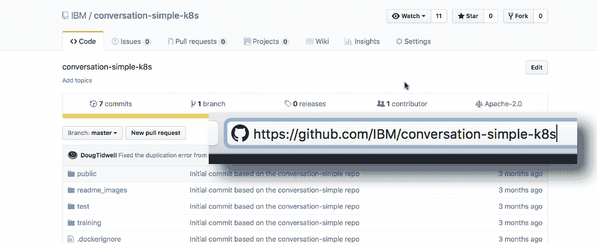

在命令行中，输入以下命令：

1.  `git clone https://github.com/DougTidwell/conversation-simple-k8s.git`
2.  `cd conversation-simple-k8s`

此代码基于由 Watson Assistant（原 Conversation） 团队构建的 `conversation-simple` 应用，为方便起见，添加了一个 `Dockerfile` 和一些 YAML 与 JSON 文件。

*感谢 Watson 团队为开发、共享和维护此应用付出的努力。*

### 创建 Watson Assistant（原 Conversation） 服务实例

要创建 Watson Assistant（原 Conversation） 服务实例，请转至 IBM Cloud 目录（访问 [IBM Cloud](https://cloud.ibm.com/login?cm_sp=ibmdev-_-developer-tutorials-_-cloudreg)，并单击位于页面顶部的”Catalog”）。在搜索栏中输入 **assistant**。Watson Assistant 服务将显示在 **Watson** 部分中：

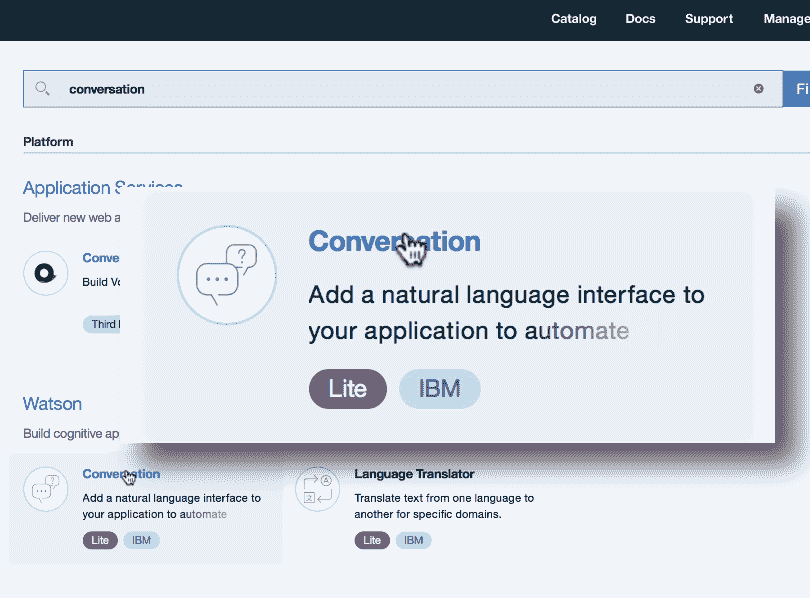

单击此目录项开始操作。在下一个面板上，您将看到位于顶部的新服务名称。您可以采用现有名称（类似于 `Conversation-n1`）或者输入其他更便于记忆的名称。向下滚动至 **Pricing Plans** 部分，确保选中 **Lite** 计划（也称为“free”计划）：

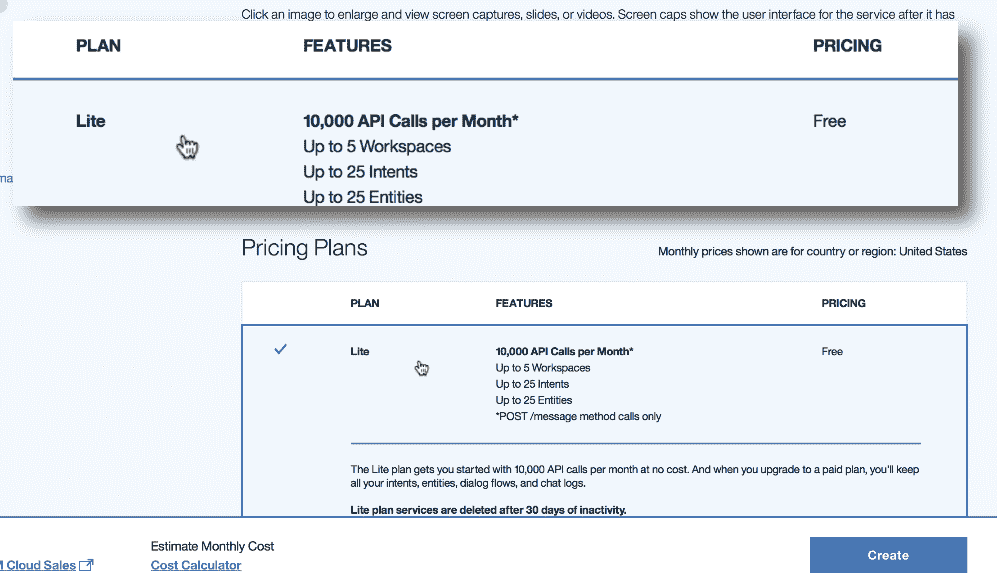

单击 **Create** 创建新的 Watson Assistant 服务。创建服务时，单击 **Launch tool** 按钮以打开工作空间：

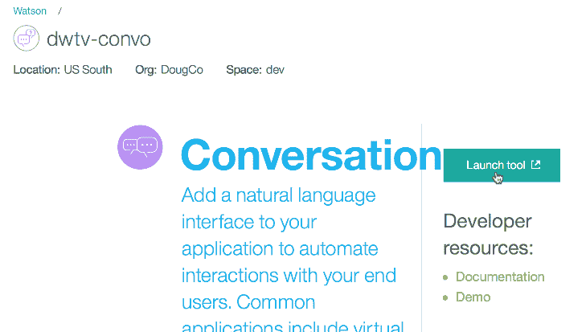

（请注意，此 Watson Assistant 服务名为 `dwtv-convo`，而不是不便于记忆的 `Conversation-n1`。）

您将看到 **Workspaces** 面板：

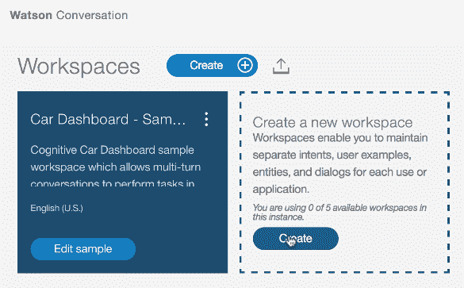

现在，从先前克隆的存储库中的 `RoyalValet.json` 文件导入聊天机器人的所有意向、实体和对话。在工作空间中，单击 **导入** 图标：

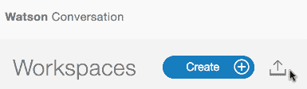

从机器中选中文件，确保选中 **Import Everything** 单选按钮，然后单击 **Import**：

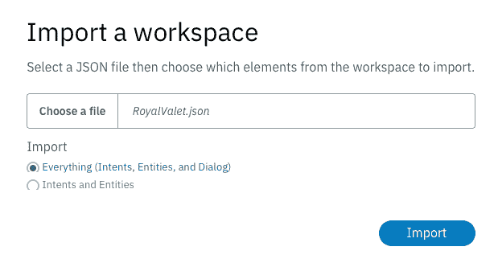

这将向您的工作空间添加一个名为 Royal Valet 的完整的聊天机器人。

### 安装工具

您可能已完成以下大部分任务，但请务必执行以下步骤：

*   从 [nodejs.org/#download](https://nodejs.org/#download) 下载并安装 Node.js 运行时和 NPM 程序包管理器。
*   安装 [IBM Cloud (`bx`) 命令行客户端](https://cloud.ibm.com/docs/cli?topic=cloud-cli-ibmcloud-cli#downloads&cm_sp=ibmdev-_-developer-tutorials-_-cloudreg)，然后运行以下命令以添加对容器的支持：

    *   `bx plugin install container-registry -r Bluemix`
    *   `bx plugin install container-service -r Bluemix`

安装完插件后，运行 `bx login` 和 `bx cr login` 以登录 IBM Cloud 及其容器注册表。

*   访问 [docker.com/community-edition](https://www.docker.com/community-edition)，下载和安装适用于您的平台的 Docker Community Edition。
*   最后，安装 [Kubernetes `kubectl` 命令行工具](https://kubernetes.io/docs/tasks/tools/install-kubectl/)。在 IBM Cloud 中运行 Kubernetes 集群后，即可配置此工具。

### 构建和上传 Docker 映像

您克隆的存储库包含一个 `Dockerfile` （就此而言，也包含一个 `.dockerignore` 文件），以简化从代码创建 Docker 映像的过程。首先，确保此 Docker 运行时正在您的机器上运行。具体操作方式取决于您的平台，如果需要详细信息，请参阅 Docker 文档。

Docker 运行时，在 `conversation-simple-k8s` 目录中输入以下命令：

`docker build -t registry.ng.bluemix.net/[your namespace]/conversation:v1 .`

请注意，注册表名称的 `ng` 部分将视您使用的 IBM Cloud 数据中心而异。例如，如果您的集群位于德国，那么注册表名称的这部分将为 `eu-de`。（无论何时在本文的其余部分看到 `ng`，都请牢记这一点。）此处的命名空间即您先前通过 `bx cr namespace-add` 命令创建的命名空间。

最后，请务必在命令末尾包含句点；这样可告知 Docker 在当前目录中查找 `Dockerfile`。构建开始如下所示：

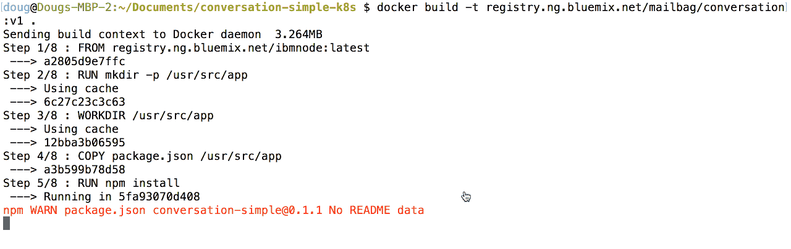

构建完成后，运行以下命令以将其推送到 IBM Cloud 中的容器注册表中：

`docker push registry.ng.bluemix.net/[your namespace]/conversation:v1`

您将看到类似如下的消息：

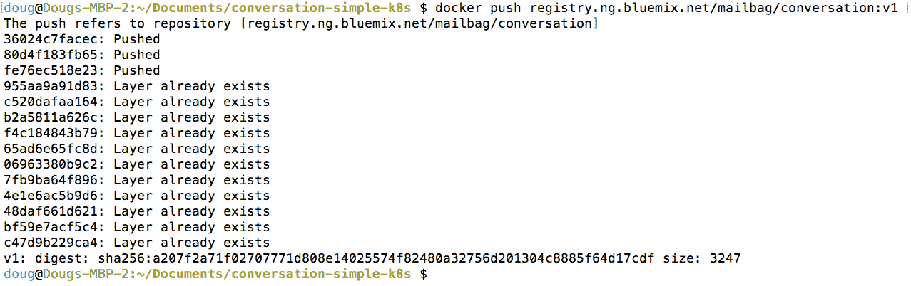

现在，您的 Docker 映像已构建，并且已上传至 IBM Cloud。下一步是为您的映像创建 Kubernetes 集群。

### 在 IBM Cloud 中创建 Kubernetes 集群

要使用 Kubernetes 密钥，当然就需要 Kubernetes 集群。现在，您将创建此集群。在 [IBM Cloud 控制台](https://cloud.ibm.com/catalog?cm_sp=ibmdev-_-developer-tutorials-_-cloudreg)中，转至左上角的菜单，并单击 **Containers**：

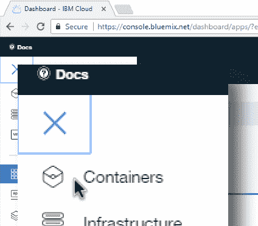

接下来，单击位于页面中间的 **Create cluster** 按钮：

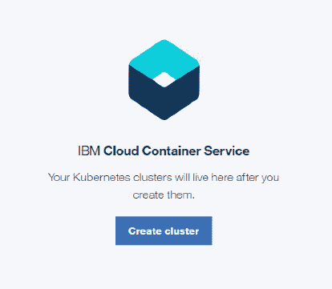

最后，为您的集群命名（在以下示例中，此集群名为“Mailbag”），并确保已选中 **Lite plan**（也称为“free”计划），然后单击面板右侧的 **Create Cluster** 按钮：

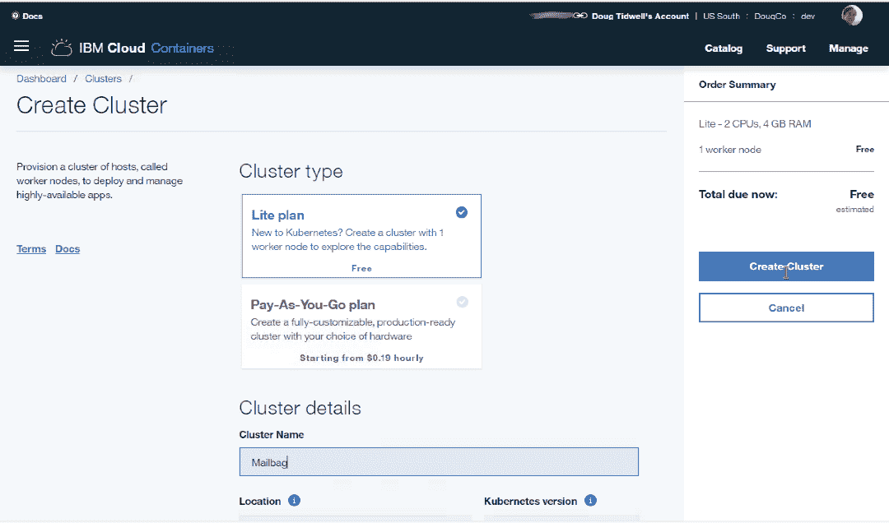

将需要几分钟时间才能完成集群配置和启动。在此期间，请随意起身舒展一下，喝杯咖啡或者拜访邻里。当集群启动并正常运行后，它将显示在 IBM Cloud 仪表板中：

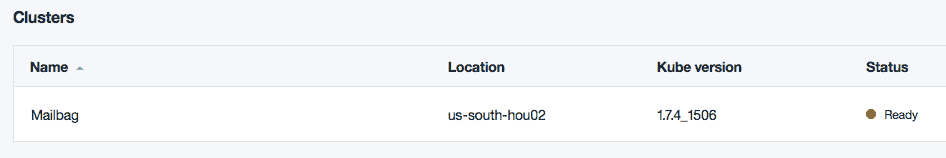

### 配置 `kubectl`

设置工作的最后一部分是将 `kubectl` 命令配置为指向 IBM Cloud 中的 Kubernetes 集群。配置完成后，只要您使用 `kubectl`，它就会与您的集群进行交互。运行以下两条命令以完成所有设置：

1.  `bx cs cluster-config Mailbag`

    此命令将使用 IBM Cloud 容器服务插件来获取您先前创建的 `Mailbag` 集群的配置详细信息。它会返回一条命令，您可复制粘帖此命令以设置 `KUBECONFIG` 环境变量。

2.  [Set the KUBECONFIG variable]

    此命令包含在先前命令的输出中。它在 Linux 和 Mac 上为 `export` 语句，在 Windows 命令行上为 `set` 命令；它可返回 Windows PowerShell 中的 `$env:KUBECONFIG` 定义所需的信息。

这两条命令在 Linux 或 Mac 上如下所示：

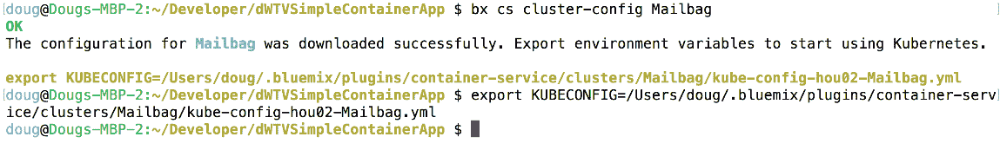

请注意， `export` 命令只是 `bx cs cluster-config` 命令输出的剪切和粘帖而已。另请注意，这只限于为当前命令行配置 `kubectl`。如果您切换到其他窗口，那么还将需要在该窗口中配置 `kubectl`。

None

## 为凭证创建 YAML 文件

设置已经足够了。希望您已完成了其中大部分步骤，或者知道如何轻松执行这些步骤。下一个任务是为凭证创建 YAML 文件。从您克隆的存储库打开 `convo-secret.yaml` 文件：

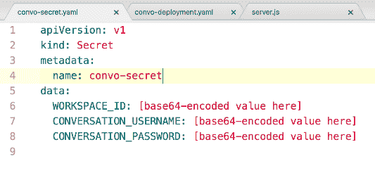

正如您可能已经猜到的，巧妙之处在于正确填充 `WORKSPACE_ID`、`CONVERSATION_USERNAME` 和 `CONVERSATION_PASSWORD` 值。但存在一个复杂难题：这些值必须采用 base64 编码格式。当然，您必须先获取这些值，然后才能对其进行编码。

要获取 `WORKSPACE_ID`，请返回 Watson Assistant 工作空间，单击聊天机器人磁贴上的三个圆点图标，并选择 **View details**：

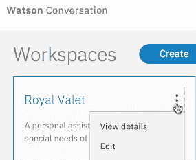

该磁贴会显示工作空间 ID：

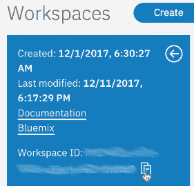

单击复制图标以将该值放置在剪贴板上，然后使用 base64 编码工具来转换该值。在 Linux 和 Mac 上，此命令如下所示：

`echo **-n**"c37281df-ea7e-3821-dd7f-c2758fab490c" | base64`

这样会返回 `convo-secret.yaml` 文件所需的值：

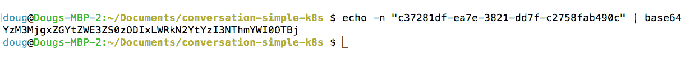

在此示例中（不是有效的工作空间 ID），您将把值 `YzM3MjgxZGYtZWE3ZS0zODIxLWRkN2YtYzI3NThmYWI0OTBj` 粘帖到 `convo-secret.yaml` 文件中。

请牢记两点：首先，`echo` 命令的 `**-n**` 参数为必需参数。这将阻止 `echo` 在双引号括起的文本末尾添加换行符。如果省略此参数，那么编码的值将无效。其次，如果使用 Windows，请使用网络上可用的任一 base64 编码工具。Windows 包含 `certutil`，这是一种可执行 base64 编码的工具，但这种工具无效，因为它始终会添加换行符。

这样就处理完了您所需的第一个凭证。现在，可以从 Watson Assistant 服务获取 `CONVERSATION_USERNAME` 和 `CONVERSATION_PASSWORD` 值了。转至位于 [cloud.ibm.com](https://cloud.ibm.com/login?cm_sp=ibmdev-_-developer-tutorials-_-cloudreg) 的仪表板，查找列表中的 Watson Assistant 服务，单击此服务以打开服务管理页面。单击左侧 **Service credentials** 选项卡：

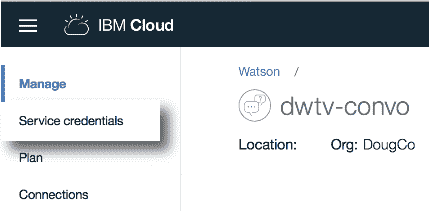

您应会看到凭证列表。如果您没有任何凭证，请单击 **New credential** 按钮以创建一个凭证。接下来，单击 **View credentials** 以查看您所需的值：

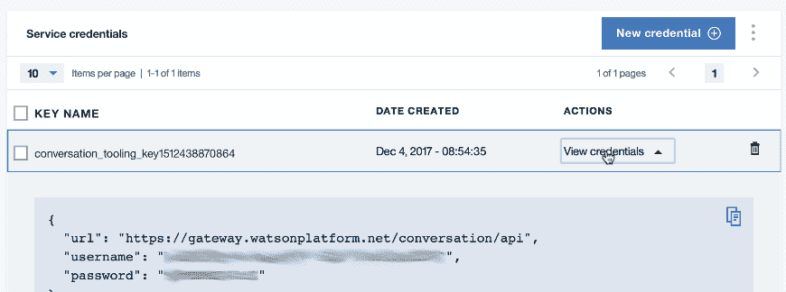

现在，提取这两个值，采用 base64 编码方式对其进行编码，然后将编码后的值粘帖到 YAML 文件中。`convo-secret.yaml` 的最终版本应类似如下所示：

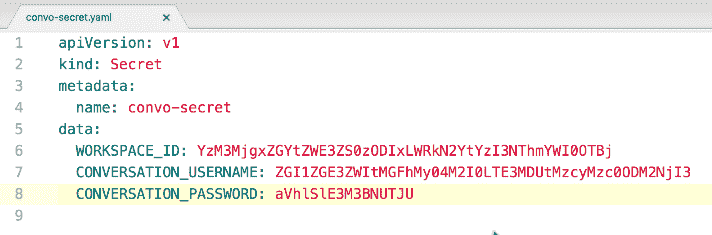

填充凭证后，该创建密钥了。

## 创建 Kubernetes 密钥

在命令行中输入 `kubectl create -f convo-secret.yaml`。

## 浏览 Kubernetes 仪表板

*稍等，这就是全部了？创建密钥只要这样就可以了？*

对，没错。回想起来，您的作者应该在大纲中融入更多想法。但就这样继续吧。

使用 Kubernetes 时，Kubernetes 仪表板是一种非常适合用于了解集群中所发生状况的工具。（它同时也非常适合用于了解集群中发生的*错误*。）要启动该工具，请输入：

`kubectl proxy`

在运行代理的情况下，在浏览器中打开 [localhost:8001/ui](http://localhost:8001/ui)。您很可能会看到以下登录提示：

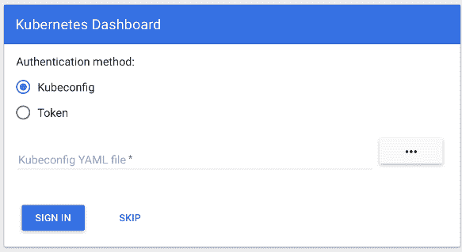

转至命令行并输入 `kubectl config view` 以获取登录所需的令牌。YAML 输出包含名为 `id-token` 的字段：

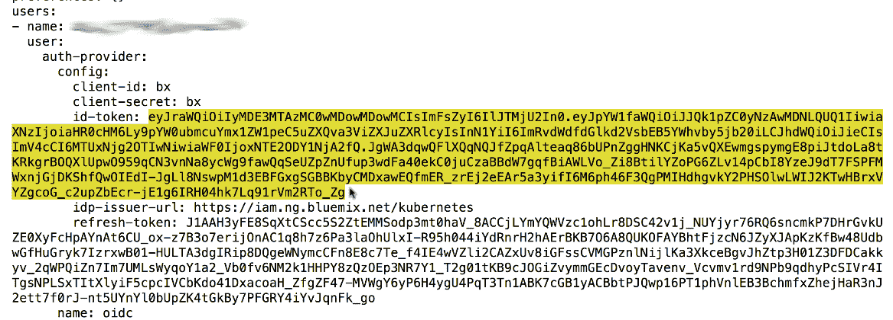

将令牌的值复制到剪贴板。在浏览器中，单击 **Token** 单选按钮，粘帖令牌，然后单击 **SIGN IN**：

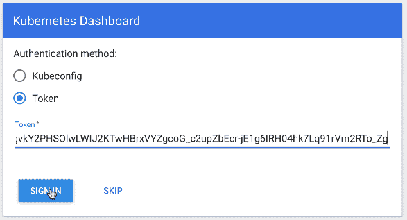

登录后，您将看到类似如下的仪表板：

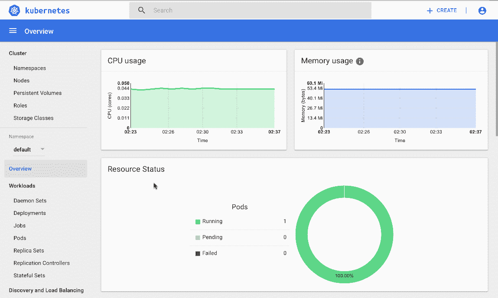

如果您滚动至左侧列表底部，并单击 **Secrets**，将会看到密钥列表。单击刚才创建的密钥的名称：

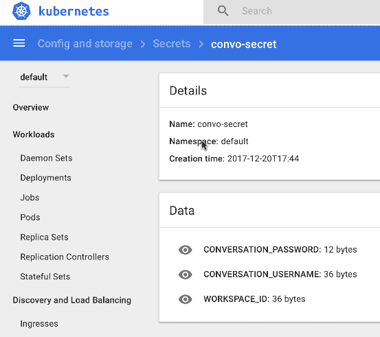

您可以在集群内找到部署、pod、服务等等的详细信息。了解仪表板。仪表板是您的好助手。

## 创建 YAML 文件以部署应用

延续其实用性的传统，您克隆的存储库中有一个称为 `convo-deployment.yaml` 的文件，其中已包含您所需的大部分 YAML 内容。在您首选的编辑器中将其打开：

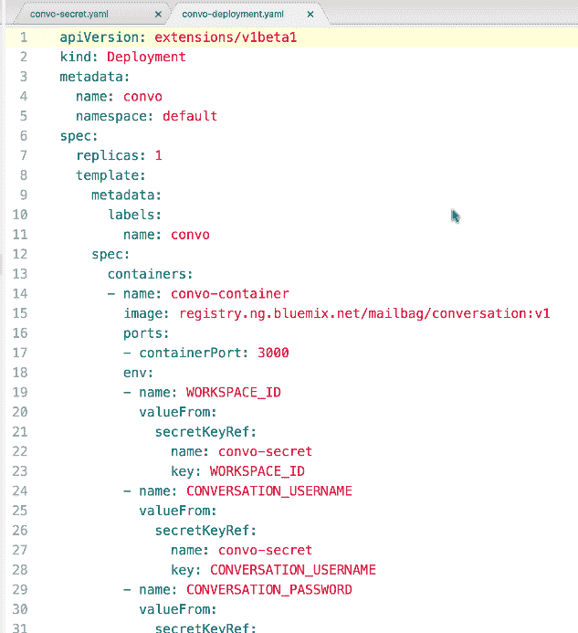

这会定义您将用于部署 Docker 映像的 Kubernetes 部署。这里有几点需要注意。首先，此文件会创建一个名为 `convo` 的新部署和一个名为 `convo-container` 的新容器，并且此文件基于 Docker 映像 `registry.ng.bluemix.net/mailbag/conversation:v1`。您将需要相应地更改此映像名称：如果您未在使用美国南部的数据中心，那么 `ng` 应与此不同，并且应将 `mailbag` 替换为您的命名空间。

第二点是您的容器会将端口 `3000` 公开。Docker 映像内的节点应用会侦听此端口。如果您的代码以不同方式运行，那么将需要更改该值。

最后，文件的 `env` 部分定义了三个环境变量，当您的应用启动时，这些环境变量将可供其使用。此处的语法相当明了。存在三个环境变量（正如您预计的，这些变量分别名为 `WORKSPACE_ID`、`CONVERSATION_USERNAME` 和 `CONVERSATION_PASSWORD`），每个变量都从名为 `convo-secret` 的 Kubernetes 密钥文件获取自己的值，并且每个变量都映射到此密钥文件中的特定密钥。

## 将应用部署到 Kubernetes 集群

就快要完成了！正如您预计的，第一步是要告知 `kubectl` 处理您刚才更新的文件：

`kubectl create -f convo-deployment`

对于任何应用，部署和公开代码的其余工作都以完全相同的方式完成，无论是否使用凭证都如此。您已设置了 Kubernetes 密钥，因此部署简单明了。输入以下长命令：

`kubectl expose deployment convo --type=NodePort --port=3000 --name=convo-service`

这样会创建一项新服务（其名称很巧妙： `convo-service`），您的用户可使用此服务访问您的代码。此处的名称 `convo` 是来自 YAML 文件的部署名称，`3000` 是应用端口号。我们在此处不会涵盖 `NodePort` 的介绍信息；可以说，这是您通过 IBM Cloud Lite 帐户使用免费集群的唯一选择。

当 Kubernetes 创建您的服务时，它会创建一个代理，以向您的应用分配一个随机生成的端口号。要查找此端口号，请使用 `kubectl describe service convo-service`：

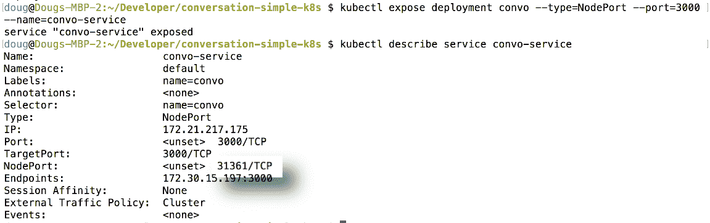

在此示例中，Kubernetes 已向全世界公开了端口 `31361`，进入该端口的任何内容都将被传递到端口 `3000` 上的服务。最后，您需要知道集群本身的 IP 地址。Kubernetes 对外部世界一无所知，因此您必须为其使用 `bx` 命令。`bx cs workers Mailbag` 会为您提供所需的信息：

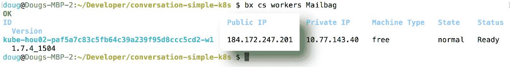

集群的 IP 地址为 `184.172.247.201`。如果您打开自己的浏览器并指向 `http://184.172.247.201:31361`，应会看到自己的应用：

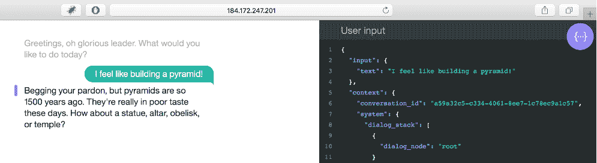

## 结束语

通过使用 Kubernetes 密钥，您能够设置代码启动前所需的环境变量。这些密钥精巧易懂且易于创建和管理（但 base64 编码部分除外）。现在，您已准备好在自己的 Kubernetes 集群中装满应用，它们可使用来自 IBM Cloud 平台的任意数量的服务或服务组合。祝您一切愉快！

本文翻译自：[Using Kubernetes secrets to manage credentials](https://developer.ibm.com/tutorials/cl-kubernetes-secrets-manage-credentials/)（2018-02-27）