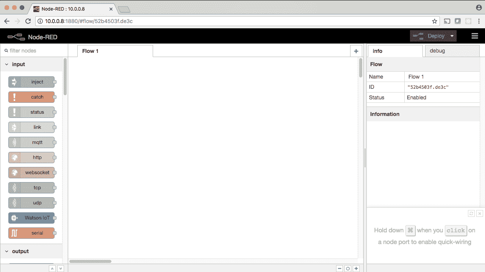
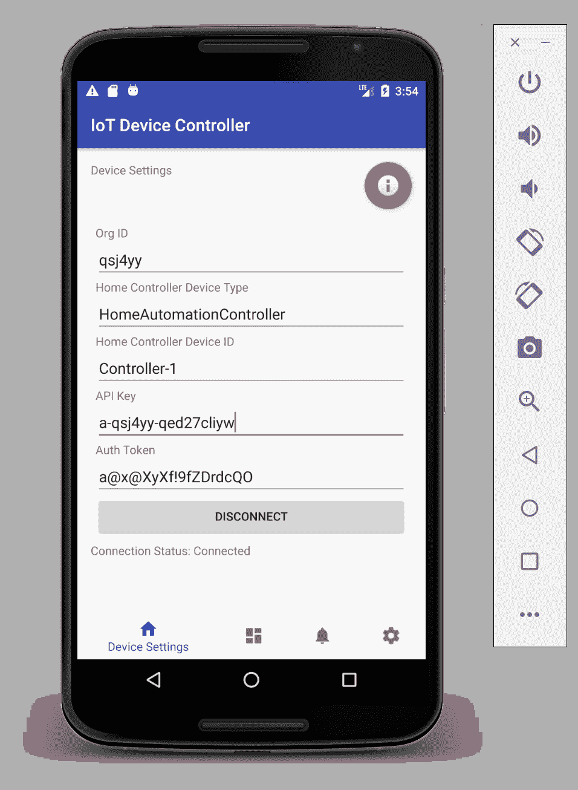
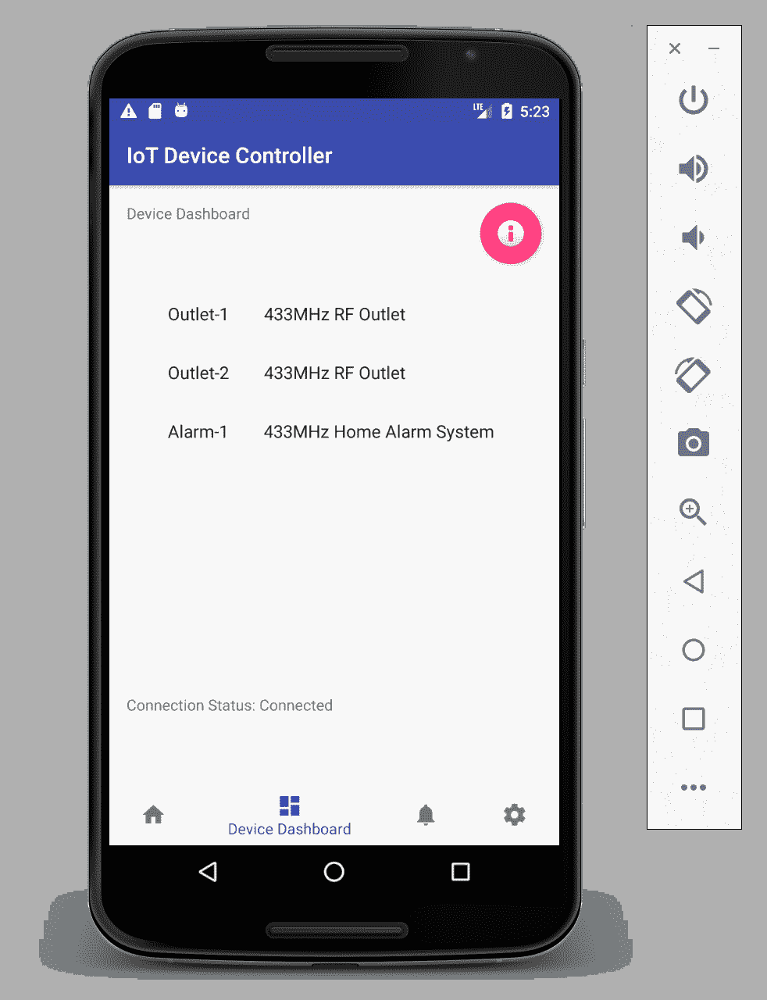

# 为一个家庭自动化系统开发 IoT 应用程序

> 原文：[`developer.ibm.com/zh/tutorials/iot-smart-home-03/`](https://developer.ibm.com/zh/tutorials/iot-smart-home-03/)

##### IoT 与智能家居

*   [为一个家庭自动化系统设置硬件](http://www.ibm.com/developerworks/cn/iot/library/iot-smart-home-01)
*   [为一个家庭自动化系统设置系统软件](http://www.ibm.com/developerworks/cn/iot/library/iot-smart-home-02)
*   为一个家庭自动化系统开发 IoT 应用程序 (本教程)

敬请期待。本系列的压轴戏。在本教程中，您会将目前实现的所有功能结合起来，并完成家庭自动化系统。在[第 1 部分](http://www.ibm.com/developerworks/cn/iot/library/iot-smart-home-01)和[第 2 部分](http://www.ibm.com/developerworks/cn/iot/library/iot-smart-home-02)中，我展示了如何设置 IoT 硬件，如何构建软件来控制家庭自动化系统中的硬件。在最后一部分，我将展示如何构建：

*   *云 IoT 应用程序*，用于在移动应用程序与家庭自动化控制器应用程序之间发送消息
*   *家庭自动化控制器应用程序*，位于您家中，用于控制各个设备
*   *设备控制器应用程序*，一个通过互联网控制该系统的移动应用程序

整体解决方案的架构如下所示：

##### 大图


设想您匆忙离开家，并忘了打开警报系统。无需担心。您只需要拿出智能手机，打开设备控制器应用程序，连接到云 IoT 应用程序，向您的家庭自动化系统应用程序发送一条消息：Arm。警报现已设置。

在本教程中，您将完成所有剩余任务。让我们开始吧。

1

## 设置云 IoT 应用程序

可以使用在所有平台上运行的开源 MQTT 代理来构建家庭自动化系统，这些平台包括 [Eclipse Mosquitto](http://mosquitto.org/)、[Apache Active MQ](http://activemq.apache.org/index.html) 或[其他十几个平台之一](https://github.com/mqtt/mqtt.github.io/wiki/servers)）。我选择使用 IBM Watson IoT Platform 有两个原因：

*   它非常易于设置和使用。
*   IBM 为它提供了支持，所以我知道它是稳定、安全、始终能正常工作的。

在下面的视频中，我将展示如何使用 IBM Cloud 和 Watson IoT Platform（充当 MQTT 代理）创建云 IoT 应用程序，如何将您的 Raspberry Pi 注册为 IoT 设备，以及如何创建一个 API 密钥来验证在 Raspberry Pi 上运行的应用程序代码。

尽管如此，我在这里展示的概念不会通过任何方式锁定在 IBM Cloud 平台中。理解基本概念后，对于客户端应用程序（比如移动设备）与在家里运行并控制家庭自动化系统的 IoT 设备控制器应用程序，可以使用任何 MQTT 服务器作为代理来处理其间的各种请求。

看完视频后，按照本节中的步骤设置家庭自动化系统的云 IoT 应用程序组件。

[https://cdnapisec.kaltura.com/p/1773841/sp/177384100/embedIframeJs/uiconf_id/44854321/partner_id/1773841?iframeembed=true&playerId=kplayer&entry_id=0_3u85opf0&flashvars[streamerType]=auto](https://cdnapisec.kaltura.com/p/1773841/sp/177384100/embedIframeJs/uiconf_id/44854321/partner_id/1773841?iframeembed=true&playerId=kplayer&entry_id=0_3u85opf0&flashvars[streamerType]=auto)

[查看抄本](https://www.ibm.com/developerworks/cn/iot/library/iot-smart-home-03/transcript02.txt)

2a

### 设置 Node-RED 环境

如果您根据我在[第 1 部分](http://www.ibm.com/developerworks/library/iot-smart-home-01)中的指导安装了 Raspbian Stretch，那么 Node-RED 已安装在 Raspberry Pi 上。如果您在 Raspberry Pi 上安装了其他某种操作系统，一定要按照该操作系统的说明来安装 Node-RED。可以在 [Node-RED 网站](https://nodered.org/docs/getting-started/installation)上找到安装 Node-RED 的更多信息。

在 Pi 上启动 Node-RED 之前，您需要安装一个名为 Node Package Manager (npm) 的软件。

打开一个新终端窗口，运行以下命令：

```
sudo apt-get update
sudo apt-get install npm 
```

第一个命令可以确保您的 Raspbian 发行版拥有要安装的最新数据包，第二个命令将安装 npm。您应该看到类似下图的输出，表明 npm 已成功安装：


现在从一个终端窗口，启动 Node-RED：

```
node-red-start 
```

您会看到类似下图的输出，其中 Node-RED 已成功启动：


现在，打开一个浏览器并访问输出中显示的地址（在我的用例中为 `http://10.0.0.8:1880`）。您会看到一个类似下图的屏幕，页面左侧显示了节点面板，中间显示了一个名为 `Flow 1` 的空流，右侧是一个信息窗口：



Node-RED 已启动并正在运行。您需要安装一个名为 `node-red-contrib-scx-ibmiotapp` 的节点，您的家庭自动化控制器将使用它与 Watson IoT Platform 进行通信，而且 Watson IoT Platform 充当应用程序，而不是像我很快将会讲到的那样充当设备。

要安装 `node-red-contrib-scx-ibmiotapp`，请转到 Node-RED 右上角的汉堡包形状菜单，并选择 **Manage Palette**。单击 **Install** 选项卡，在搜索字段中输入 **ibmiotapp**，您会在结果中看到 `contrib` 节点：


单击 **Install**，按照提示来安装该节点。安装它后，您会在面板中看到它。

最后一个细节：还记得来自[第 2 部分](http://www.ibm.com/developerworks/cn/iot/library/iot-smart-home-02)的 `codesend` 程序吗？您需要运行此程序来从家庭自动化控制器应用程序发送信号，所以请继续在 `/usr/local/bin` 中设置一个连接到它的符号链接，如下所示：

```
sudo ln -s /home/pi/HomeAutomation/433Utils/Rpi_utils/codesend codesend 
```

此命令假设您的代码位于 `/home/pi/HomeAutomation` 中，就像第 1 部分中建议的那样。如果您的代码不在那里，则需要修改符号链接来准确反映 433Utils 的路径。

在下一小节设置 Node-RED 执行节点来执行 `codesend` 程序时，您将引用此路径： `codesend`。

现在（最终！），您可以开始构建家庭自动化控制器应用程序了。

2b

### 编写单 RF 插座的控制器代码

保持 Node-RED 在浏览器中处于打开状态，将一个 `ibmiot` 节点拖到流上，然后双击它来打开节点属性对话框。在 **API Key** 下拉列表中，选择 **Add new ibmiot**，然后单击编辑（铅笔）图标。


推荐为该密钥提供一个与（您在第 1 步设置的） API 密钥的 **Description** 字段匹配的名称，比如 *HomeAutomationControllerAPIKey*。输入之前在第 1 步中生成的 API 密钥信息，然后单击 **Add**。您会跳转回节点属性屏幕，您将在这里完成剩余信息：

*   Device Type = HomeAutomationController
*   DeviceId = Controller-1
*   Event = request
*   Format = json
*   Name = App Request Listener


单击 **Done** 完成节点的配置。**ibmiot** 节点的职责是监听与您提供的设置匹配的传入设备事件。

接下来，添加两个 **switch** 节点，它们位于面板的 **Function** 部分。将它们拖到流上，如下图所示：


**switch** 节点检查名为 `payload.d.deviceRequest.deviceId` 的消息有效负载属性是否与 `Outlet-1` 匹配。如果不匹配，则不会执行任何操作。如果匹配，Node-RED 会将该消息作为输入传递给第二个 **switch** 节点，您将按下图所示来配置第二个节点：


第二个 **switch** 节点检查 `payload.d.deviceRequest.action` 属性是否与以下两个值之一匹配：`on` 或 `off`。如果匹配，则传递该消息作为输出 1（如果与 `on` 匹配）或 2（如果与 `off` 匹配）。如果不匹配，该节点不会执行任何操作（流停止）。单击 **Done** 完成配置。

现在将 `App Request Listener` 节点连接到第一个 **switch** 节点，方法是单击并在它们之间拖出一条“线”。然后，将第一个 **switch** 节点连接到第二个 switch 节点。现在您可以处理 `on` 和 `off` 消息了。

让我们停下来想想，如果获得一条针对 `Outlet-1` 的 `on` 消息，我们想要家庭自动化控制器做什么？显然，我们想要发送一个信号来打开 RF 插座 1，对吧？那么我们该如何实现此目的呢？

通过一个 **exec** 节点！如 *exec*-ute 节点所示， **exec** 节点用于执行一个程序（在本例中为 `codesend`）。在面板中下滚到 **Advanced**，将两个 **exec** 节点拖到流上。双击第一个 exec 节点来配置它，如下图所示：


现在，将“Outlet-1-Router”节点上的“on”输出连接到这个节点。如果 `ibmiot` 节点收到一条针对 `Outlet-1` 的 `on` 消息，那么它会被路由到这里（在这里发送命令 `codesend 1119539 170` ）来打开该插座。（确保对*您的*插座，而不是我的插座，使用了 `on` 值。）

现在，设置一个 `exec` 节点来关闭 `Outlet-1`，就像您对 `on` 所做的一样（记得对您的插座使用经过编码的“off”值）。连接所有节点，单击 **Deploy**，除非您犯了配置错误，否则会看到类似下图的结果：


现在需要运行一次测试。到底如何执行测试？

Node-RED 提供了一种称为 **inject** 节点的特殊节点，可用来向一个节点发送消息。在本例中，我们将设置一个 **inject** 节点来将 JSON 有效负载发送到一个充当设备的 **Watson IoT** 节点。在面板的 **input** 部分，选择 **inject** 节点并将它放在流上。双击它来进行配置。将 `Payload` 选项更改为 JSON，粘贴此字符串（供参考：单击省略符号会弹出一个小巧美观的 JSON 编辑器）：

```
{
    "deviceRequest": {
        "deviceId": "Outlet-1",
        "action": "on"
    }
} 
```

将该节点命名为 `Outlet-1 ON`，并单击 **Done**。

接下来，在 Node-RED 面板的 **output** 部分，单击一个 **Watson IoT** 节点并将其拖到流上。选择 **“Connect as” Device**，然后单击 `Credentials` 编辑按钮来添加您之前为 HomeAutomationController 设置的设备凭证（在第 1 步中称为 Controller-1）：


单击 **Add**，您会跳转回节点配置对话框，您将在这里完成剩余信息，如下所示：

*   Event type = request
*   Format = json
*   Name = Requester


接下来，添加另一个 **inject** 节点来使用此 JSON 消息关闭 `Outlet-1`：

```
{
    "deviceRequest": {
        "deviceId": "Outlet-1",
        "action": "off"
    }
} 
```

将它连接到 `Requester` 节点，您就基本准备好运行测试了。

最后一个步骤：将 **debug** 节点添加到您的流中，以便可以查看从您刚设置的 `Outlet-1 ON`**inject** 节点传出的消息，以及传入到 `App Request Listener` 节点的消息。**debug** 节点非常容易设置：在面板的 **output** 部分选择一个节点，将它拖到流上，并将它的输入连接到您想要看到的节点的输出。

完成上述操作后，单击 **Deploy**，您的流应该类似于下图：


要执行测试，请单击 `Outlet-1 ON`**inject** 节点。如果 RF 插座已关闭，则应打开它。接下来，单击 `Outlet-1 OFF` 节点，RF 插座应该处于关闭状态。

没有印象？仔细想想。在两种情况下，从 Pi 上的 **inject** 节点发出的消息（即 `Outlet-1 ON` 和 `Outlet-1 OFF`）被发送到 Watson IoT Platform MQTT 服务器，然后发回您的 Pi，在这里由 `App Request Listener` 节点进行处理。可能看起来不像，但您刚刚已访问 IBM Cloud 并返回！

不相信我？检查一下您的 Watson IoT Platform 仪表板。选择 Browse 选项卡，选择设备 (HomeAutomationController)，然后选择 **State** 选项卡来查看最近的事件。


可以看到，`Outlet-1 OFF`**inject** 节点创建了 JSON 消息并通过 `Requester` 节点发送。非常酷，对吧？

现在您已准备好添加第二个 RF 插座了。我将提供您需要的所有信息，但没有提供和第一个插座一样多的细节。在设置第二个 RF 插座时一定要参考这一小节。

2c

### 编写双 RF 插座的控制器代码

将第二个 RF 插座插到墙上，另外插入一个视觉或听觉反馈设备（比如一个灯泡或收音机）。确保您能发现该插座的针对 `on` 和 `off` 的 433 MHz 编码（如果需要复习一下如何运行 `RFSniffer` 来实现此目的，请参阅[第 2 部分](http://www.ibm.com/developerworks/cn/iot/library/iot-smart-home-02)）。

要向 Node-RED 流添加第二个 RF 插座，需要完成以下步骤：

*   修改 `Device Router`**switch** 节点，以添加另一个条件来检查 `Outlet-2`
*   添加另一个名为 `Outlet-2-Router` 的 **switch** 节点来处理 `Outlet-2` 的 `on` 和 `off`，就像对 `Outlet-1` 所做的那样。
*   添加一个名为 `Outlet-2 ON` 的 **exec** 节点来调用 `codesend`，并添加 433 MHz 信号值来打开 `Outlet-2`。
*   添加一个名为 `Outlet-2 OFF` 的 **exec** 节点来调用 `codesend`，并添加 433 MHz 信号值来关闭 `Outlet-2`。
*   连接新节点的连线，就像对 `Outlet-1` 所做的那样。
*   添加两个 **inject** 节点（将它们命名为 `Outlet-2 ON` 和 `Outlet-2 OFF`）来测试您的代码，将它们连接到现有的 `Requester` 节点。

完成后的流类似于下图：


2d

### 编写家庭警报系统的控制器代码

家庭自动化系统中的最后一个 IoT 设备是一个警报系统。任何可以遥控的 433-MHz 警报系统都可以正常工作，但我推荐使用 CPVan，因为它很简单，而且价格也很合适。本教程的这一小节将使用 CPVan Window and Door 系统。

抓住遥控器，启动您的 Pi 上的 RFSniffer，找出遥控器上所有 4 个按钮的代码。本节将要设置的 **exec** 节点需要利用那些值来控制该系统。

下表给出了从我的 CPVan 警报系统运行 `RFSniffer` 所得到的值：

##### CPVan Alarm 编码值（*您的值将有所不同*）

| 功能 | 经过编码的信号 | 延迟（微秒） |
| --- | --- | --- |
| Arm Away | 12935172 | 434 |
| Arm Stay | 12935170 | 434 |
| Alarm Off | 12935169 | 434 |
| Panic (SOS) | 12935176 | 434 |

接下来，在您的 Node-RED 流中，执行以下代码更改：

*   修改 `Device Router`**switch** 节点，以添加另一个条件来检查 `Alarm-1`。
*   添加另一个 **switch** 节点来处理 4 个操作：

    *   `arm-away` 在您离开家时打开该系统（启用动作传感器）
    *   `arm-stay` 在您在家里时或者您有宠物时会打开该系统（禁用动作传感器）
    *   `off` 禁用警报系统
    *   `panic` 播放警报声音
*   添加一个 **exec** 节点，以调用 `codesend`（以及 433 MHz 信号值）来对 `Alarm-1` 执行 `arm-away`。
*   添加一个 **exec** 节点，以调用 `codesend`（以及 433 MHz 信号值）来对 `Alarm-1` 执行 `arm-stay`。
*   添加一个 **exec** 节点，以调用 `codesend`（以及 433 MHz 信号值）来对 `Alarm-1` 执行 `alarm-off`。
*   添加一个 **exec** 节点，以调用 `codesend`（以及 433 MHz 信号值）来对 `Alarm-1` 触发 `panic`。
*   连接新节点的连线，就像对 `Outlet-1` 和 `Outlet-2` 所做的那样。
*   添加 4 个 **inject** 节点来测试您的代码，将它们连接到一个新的 `Requester` 节点（您可以通过复制/粘贴来轻松创建这些节点）。

完成的流类似于下图（我将一些节点移得更近一些，以便将它们放在一个屏幕中）：


现在您已有一个经过全面测试的家庭自动化系统，它包含两个 RF 插座和一个警报系统。此刻，您应该掌握了必要的知识和技能，能在已完成工作的基础上向家庭自动化系统添加更多 IoT 设备。

想要获得真正的乐趣？您肯定想这样！在最后一节，您将结合各部分功能，利用移动应用程序来控制家庭自动化系统！

我忘了说一件事：所有流都包含在 GitHub 中供您参考。请访问 GitHub 中的 [makotogo/developerWorks](https://github.com/makotogo/developerWorks)。因此，如果您实现上述各节中的功能时遇到任何麻烦，可以查阅我所用的解决方案。

3

## 使用 Android 创建设备控制器移动应用程序

我选择使用 Android 作为移动应用程序平台。尽管如此，您可以使用任何语言，并在您选择的任何平台上编写客户端应用程序，只要它能与 IBM Cloud 中的 Watson IoT Platform 通信。

现在您的 Node-RED 应用程序已在 Pi 上运行并连接到 IBM Cloud，您可以编写一个 MQTT 应用程序客户端来连接到它并控制您的家庭自动化系统。我已经编写了一个名为[设备控制器](https://github.com/makotogo/developerWorks/tree/master/DeviceController)的客户端，并将介绍如何使用它。

在下面的视频中，我展示了如何从 GitHub 下载设备控制器 Android 应用程序代码，将它导入 Android Studio 中，以及如何在 Android 模拟器中运行该应用程序来控制您的家庭自动化系统。

看完视频后，请按照本节中的步骤使用家庭自动化系统的家庭自动化控制器组件。

[https://cdnapisec.kaltura.com/p/1773841/sp/177384100/embedIframeJs/uiconf_id/44854321/partner_id/1773841?iframeembed=true&playerId=kplayer&entry_id=0_ts1bx1k6&flashvars[streamerType]=auto](https://cdnapisec.kaltura.com/p/1773841/sp/177384100/embedIframeJs/uiconf_id/44854321/partner_id/1773841?iframeembed=true&playerId=kplayer&entry_id=0_ts1bx1k6&flashvars[streamerType]=auto)

[查看抄本](https://www.ibm.com/developerworks/cn/iot/library/iot-smart-home-03/transcript03.txt)

3a

### 下载并安装 Android Studio

您需要下载并安装 Android Studio，才能继续进行本教程的剩余部分。安装 Android Studio 非常容易。请查阅 Android Studio [安装页面](https://developer.android.com/studio/install.html)了解针对您的平台的完整说明。

我使用了 Mac，所以您在本教程剩余部分（和视频）中看到的是 Mac 操作，但这里提供的说明应该适合所有支持 Android Studio 的平台，包括 Windows 和 Linux。

3b

### 从 GitHub 下载设备控制器应用程序代码

我编写了一个名为[设备控制器](https://github.com/makotogo/developerWorks/tree/master/DeviceController)的 Android 应用程序，您可以从 GitHub 下载它并将它导入 Android Studio 中。

如果您已从 GitHub 中的 `makotogo` 项目克隆了 `developerWorks` 存储库，您可能已经拥有该代码。如果没有该代码，请打开一个终端窗口，从 GitHub 克隆它：

```
git clone https://github.com/makotogo/developerWorks 
```

现在打开 Android Studio 并选择 **Import project**，转到您将 `developerWorks/DeviceController` 代码克隆到的位置，并单击 **Open**。

导入该代码后，Android Studio 将构建它，这可能会花几分钟。

3c

### 在模拟器中运行该应用程序

从 Android Studio 菜单栏，单击 **Run** 按钮来运行该应用程序。Android Studio 会要求您选择一个虚拟设备来运行该应用程序。如果您没有创建虚拟设备且需要帮助，请查阅[这个页面](https://developer.android.com/studio/run/managing-avds.html)了解如何创建和管理虚拟设备。

该应用程序启动后，您将位于主屏幕，您需要在这里输入您的组织 ID、API 密钥、验证令牌，以及 HomeAutomationController 设备的信息。对我而言，我将使用来自我创建的表格的值，输入该信息，使主屏幕类似于下图：

##### Android IoT 设备控制器应用程序 – 主屏幕



**请记住：组织 ID、API 密钥和验证令牌的值将与您在上面看到的值（仅适合我的 IBM Cloud Lite 帐户）不同！**

该应用程序使用[底部导航](https://material.io/guidelines/components/bottom-navigation.html)材料设计模式。应用程序中的 4 个视图分别在底部导航抽屉中有一个图标。这些视图从左往右依次为：

*   Home — 输入连接信息
*   Devices Dashboard — 控制 IoT 设备
*   Message Log — 查看来自系统的消息
*   Settings — 输入系统信息设置（您不需要担心如何执行这些设置来让应用程序运行）

现在您应该已跳转到该应用程序。本教程将展示的两个视图是 **Home** 和 **Dashboard**。

在主屏幕中，输入您在 Watson IoT Platform 仪表板中设置的信息后，单击 **Connect** 连接该应用程序。如果您已正确输入信息，则会看到一条 Toast 消息告诉您已建立连接，而且 **Connection Status** 文本字段应该显示为 *Connected*（参见 Android IoT 设备控制器应用程序 – 主屏幕）。

现在，要控制您的家庭自动化系统，可以在底部导航抽屉中选择 **Devices Dashboard** 选项（它的图标位于 Home 图标右侧）。

未看到任何图标？这是因为 Android 应用程序由一条称为“发现”消息的特殊消息触发，该消息由家庭自动化控制器 Node-RED 应用程序发送，该消息向请求者（在本例中为设备控制器应用程序）告知它管理的设备的所有信息。

这意味着您需要向 Node-RED 代码添加另一组节点，而且我推荐添加一个新流（以避免浏览器中变得混乱）。

保持设备控制器应用程序在 Android 模拟器中运行，并确保您的 Node-RED 家庭自动化控制器应用程序正在运行。在浏览器中访问它（通过第 2 步中使用的相同 URL）。在靠近屏幕顶部的位置，您会看到一个用于添加新流的加号 (+)。单击该加号来添加新流（它可能被命名为 Flow 2）。

在新流中，添加一个 `App Request Listener` 节点。可以从 Flow 1 复制此节点并粘贴到 Flow 2 上，而不执行任何更改。

添加一个 `DeviceRouter` 节点，以监听其 `payload.d.deviceRequest.deviceId` 属性为 `Controller-1` 的消息。可以从 Flow 1 复制此节点，删除除 `==` 条件外的所有信息，并将剩余的一个条件更改为 `Controller-1`。单击 **Done** 保存您的更改。

添加一个 `Controller-1-Router`**switch** 节点，以接受 `payload.d.deviceRequest.action` 属性值为 `discovery` 的消息。从 Flow 1 中的 `Outlet-1-Router` 节点复制此信息。删除它的一个 `==` 条件，将剩余的比较条件更改为 `discovery`。单击 Done 保存您的更改。

添加一个 **function** 节点（在面板中的 **function** 下），将下面的代码清单复制并粘贴到 **Function** 文本区中，然后单击 **Done** 保存您的更改。

##### `discovery` 响应消息的 JavaScript 代码

```
var discoveries = {
  deviceId : "Controller-1",
  deviceResponse : "discovery",
  devices : [
    {
      deviceId : "Outlet-1",
      description : "433MHz RF Outlet",
      actions : [
        {
          action : "on",
          description : "Turns the outlet on"

        },
        {
          action : "off",
          description : "Turns the outlet off"
        }
      ]
    },
    {
      deviceId : "Outlet-2",
      description : "433MHz RF Outlet",
      actions : [
        {
          action : "on",
          description : "Turns the outlet on"

        },
        {
          action : "off",
          description : "Turns the outlet off"
        }
      ]
    },
    {
      deviceId : "Alarm-1",
      description : "433MHz Home Alarm System",
      actions : [
        {
          action : "arm-away",
          description : "Arms the system in away mode (motion sensors active)"
        },
        {
          action : "arm-stay",
          description : "Arms the system in stay mode (motion sensors inactive)"
        },
        {
          action : "off",
          description : "Disarms the system"
        },
        {
          action : "panic",
          description : "Triggers the alarm siren (SOS)"
        }
      ]
    }
  ]
};
msg.payload = discoveries;
return msg; 
```

您还应该进行以下测试：发现*响应*消息是由您刚创建的主流中的 `Requester` 发出的。为此，复制 `App Request Listener` 节点并粘贴到新流中，双击该节点来编辑它，并将它的 `Event` 属性从 `request` 更改为 `response`。单击 Done 保存您的更改。

最后，添加一个 **inject** 节点来生成一条 JSON 发现测试消息，添加一个 `Requester`（从 Flow 1 复制此节点）来发送它（不要忘记合理地放置 **debug** 节点来显示消息有效负载）。

完成后的流看起来应类似于：


测试您的流，确保它正常工作，而且所有消息都已发送和接收。收到它们后，返回到正在 Android Studio 模拟器中运行的设备控制器应用程序。转到 Devices Dashboard 选项卡，您会看到这些设备已显示，如下图所示：



要控制一个设备，可在 Devices Dashboard 中点击它，这将打开一个对话框，让您发起该设备支持的一个操作。例如，如果我点击 `Outlet-1` 设备，就会看到以下对话框：


3d

### 将该应用程序安装在 Android 设备上

还可以将设备控制器应用程序安装在 Android 设备上。使用 USB 线将 Android 设备插入计算机。您需要配置您的设备来允许执行此操作（请参阅[这篇文章](https://developer.android.com/studio/run/index.html)了解更多信息）。

该应用程序看起来应该是相同的，但它现在位于 Android 设备上。祝开发愉快！

## 第 3 部分小结

在本系列中，您学习了如何设置一个 Raspberry Pi 和 433-MHz 硬件，以及如何使用系统软件和一些 IoT 及移动应用程序来控制它。现在，您可以基于这些知识和技能来添加更多设备，将您在本系列中构建的产品转换为您自己的家庭自动化系统。祝您好运！

如果您迷上了 IoT 家庭自动化项目，或许您想要亲自试验这些 IBM Code Pattern 中的一个：

*   [检测家庭 IoT 设备中的电压异常](https://developer.ibm.com/cn/patterns/detect-voltage-anomalies-in-household-iot-devices/)
*   [为一个无服务器家庭自动化中心实现语音控制](https://developer.ibm.com/patterns/implement-voice-controls-for-serverless-home-automation-hub/)

本文翻译自：[Develop the IoT apps for a home automation system](https://developer.ibm.com/tutorials/iot-smart-home-03/)（2018-03-28）