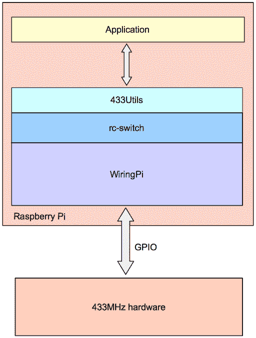
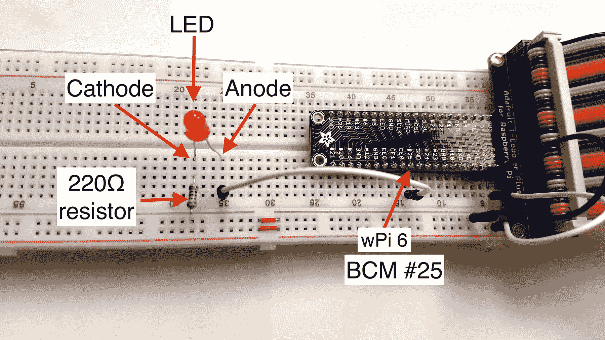

# 为一个家庭自动化系统设置系统软件

> 原文：[`developer.ibm.com/zh/tutorials/iot-smart-home-02/`](https://developer.ibm.com/zh/tutorials/iot-smart-home-02/)

##### IoT 与智能家居

*   [为一个家庭自动化系统设置硬件](http://www.ibm.com/developerworks/cn/iot/library/iot-smart-home-01)
*   为一个家庭自动化系统设置系统软件（本教程）
*   [为一个家庭自动化系统开发 IoT 应用程序](http://www.ibm.com/developerworks/cn/iot/library/iot-smart-home-03)

IoT 硬件很不错，但是如果没有软件来让它遵循您的意愿，它就没有多大用处。在[第 1 部分](http://www.ibm.com/developerworks/cn/iot/library/iot-smart-home-01)中，我展示了如何为我们的家庭自动化系统设置 IoT 硬件。在第 2 部分，我将展示用于构建家庭自动化系统的软件：它的工作原理，如何设置它、构建它，以及如何运行它来控制第 1 部分中设置的 433-MHz 设备。

完成第 2 部分后，您并不会得到一个完整、实用的家庭自动化系统，但您肯定会看到它已开始成形。简言之，第 2 部分将介绍用来控制第 1 部分的硬件设备的软件。

### 项目组织

目录就像备用卧室：它们很容易变得非常混乱。为了防止在学习本系列剩余部分的过程中遇到这种混乱，您可以在自己的计算机上的某处创建一个目录，将本教程的所有代码都存储在该目录中。

例如，我将进入我的 Mac 上的主目录，然后创建一个直属于主目录的名为 `HomeAutomation` 的目录。然后，在使用 IoT 软件之前，我转到该目录，如下所示：

```
cd
mkdir HomeAutomation
cd HomeAutomation 
```

`HomeAutomation` 目录将是本教程中将展示的所有源代码的根文件夹。除非我另行说明，否则所有未限定的目录引用都将是相对于 `HomeAutomation` 目录的。

## 您将在第 2 部分中学习的内容

在[第 1 部分](http://www.ibm.com/developerworks/cn/iot/library/iot-smart-home-01)中，您设置了 Raspberry Pi 和所有 433-MHz 硬件。在第 2 部分（本部分），您将设置与 433-MHz 硬件进行通信的软件组件。上面列出的软件组件形成了一个类似下图的软件栈：

##### 本地 IoT 解决方案的架构



在软件栈的底部是 433-Mhz 硬件，它通过 Pi 的通用输入/输出 (GPIO) 引脚与在 Pi 上运行的软件进行通信。在软件栈的顶部是应用程序代码，它们调用由以下 3 个组件（自下而上）组成的中间栈：

*   WiringPi
*   rc-switch
*   433Utils

我将在[第 3 部分](http://www.ibm.com/developerworks/cn/iot/library/iot-smart-home-03)中介绍 IoT 应用程序代码，所以暂时无需担心。

对于第 2 部分，我想重点介绍本地 IoT 解决方案的架构中的堆栈的中间部分，该部分由上面列出的组件组成。本教程系列的剩余部分将详细介绍每个组件。

本地 IoT 解决方案的架构 的目的是展示您将构建的家庭自动化系统的整体架构，以便在第 2 部分中介绍不同的组件时，您可以看到它们是如何组装在一起的。

完成教程的这一部分后，您将全面了解 WiringPi，如何构建它，以及如何运行 gpio 实用程序。

您还会了解 rc-switch（433Utils 使用它来与 WiringPi 进行通信），如何运行 433Utils 来与第 1 部分中设置的接收器模块进行通信，以便从 433-MHz 遥控器捕获经过编码的信号。

最后，您将了解如何通过第 1 部分中设置的发射器发送经过编码的信号（等同于通过接收器捕获的信号）来控制 IoT 设备。

1

## 设置 WiringPi

[Wiring Pi](http://wiringpi.com) 是 Gordon Henderson 编写的一个 C 语言开源库，用于访问 Raspberry Pi 上的 GPIO 引脚。

我将展示如何下载源代码并在 Raspberry Pi 上构建 WiringPi。

WiringPi 还包含一个名为 gpio 的命令行实用程序，您可以使用它来处理在 Pi 的引脚上传入和传出的信号。本教程后面部分将展示如何使用 gpio 实现一次简单的 LED 电路闪烁。

要设置 WiringPi，您需要下载并构建它。在下面的视频中，我将展示如何下载并构建 WiringPi 和 433Utils。

观看该视频后，请务必完成以下小节，以便在 Raspberry Pi 上下载并构建 Wiring Pi。

[https://cdnapisec.kaltura.com/p/1773841/sp/177384100/embedIframeJs/uiconf_id/44854321/partner_id/1773841?iframeembed=true&playerId=kplayer&entry_id=0_akzxwo97&flashvars[streamerType]=auto](https://cdnapisec.kaltura.com/p/1773841/sp/177384100/embedIframeJs/uiconf_id/44854321/partner_id/1773841?iframeembed=true&playerId=kplayer&entry_id=0_akzxwo97&flashvars[streamerType]=auto)

[查看抄本](https://www.ibm.com/developerworks/cn/iot/library/iot-smart-home-02/transcript-wiringpi.txt)

1a

### 从 GitHub 下载 WiringPi

在 Pi 上打开一个终端，转到 `~/HomeAutomation` 文件夹，输入以下命令：

```
git clone git://git.drogon.net/wiringPi 
```

您会看到以下输出：

```
$ git clone git://git.drogon.net/wiringPi
Cloning into 'WiringPi'...
remote: Counting objects: 1151, done.
remote: Total 1151 (delta 0), reused 0 (delta 0), pack-reused 1151
Receiving objects: 100% (1151/1151), 674.92 KiB | 1.63 MiB/s, done.
Resolving deltas: 100% (804/804), done. 
```

现在您的计算机上已有 WiringPi 的源代码，而且您已准备好从源代码构建它。

1b

### 构建 WiringPi

转到 `HomeAutomation/wiringPi` 目录并运行构建：

```
./build 
```

##### 等等，真的必须执行这次构建吗？

实际上，WiringPi（和 gpio）已包含在 Raspbian Stretch 中，所以严格来讲，没有必要从源代码构建它。话虽如此，我还是喜欢尽可能从源代码构建实用程序，因为这会给我一种自由和拥有的感觉（而且很有趣）。

构建非常快（在我的 Raspberry Pi 3 上花了大约 10-15 秒）。在它运行时，会发生您应该知道的两件事。

在 `/usr/local/bin` 中创建了一个符号链接来链接到刚刚构建的 gpio 程序。因为 `/usr/local/bin` 位于 `PATH` 环境变量中的 `/usr/bin` 之前（不管怎样，在我的 Pi 上的 Stretch 安装中是这样的），所以这是您在命令行上输入 `gpio` 时将运行的 gpio 实用程序版本。

这应该有关系吗？大多数时候或许没有关系。我只是想让您知道 WiringPi 的构建过程会这么做。

2

## 设置 433Utils

433Utils 是一组 C++ 程序，它们与使用 433 MHz 频带和 [ASK/OOK 编码](https://en.wikipedia.org/wiki/Amplitude-shift_keying)（参见[第 1 部分](http://www.ibm.com/developerworks/cn/iot/library/iot-smart-home-01)来了解 ASK/OOK 的深入探讨）的硬件设备交互。

从本地 IoT 解决方案的架构可以看到，您的应用程序调用 433Utils 来与 433-MHz IoT 设备进行交互。而 433Utils 则调用了一个名为 rc-switch 的低级库。

rc-switch 调用 WiringPi 库，后者然后通过 Pi 的 GPIO 引脚与设备进行通信。

WiringPi 提供了连接 Pi 的低级别接口，因而提供了大部分控制功能。但是，这种控制是有代价的。代码对新手非常不友好。rc-switch 位于 WiringPi 之上，这让它的使用变得容易得多。最后但同样重要的是，433Utils 位于 rc-switch 之上，只需几次函数调用就能与您的 433-MHz 设备进行通信。

433Utils 带来的易用性也是有代价的：您没有太多控制权。但是这没有关系，因为您只需要 WiringPi 的少数特性，而且以这种方式使用库提供了最简单的接口。

2a

### 从 GitHub 下载 433Utils

在 Pi 上打开一个终端，转到 ~/HomeAutomation 文件夹，输入以下命令：`git clone --recursive https://github.com/jstevenperry/433Utils.git`。您会看到以下输出：

```
$ git clone --recursive https://github.com/jstevenperry/433Utils.git
Cloning into '433Utils'...
remote: Counting objects: 225, done.
remote: Compressing objects: 100% (2/2), done.
remote: Total 225 (delta 0), reused 1 (delta 0), pack-reused 223
Receiving objects: 100% (225/225), 46.04 KiB | 799.00 KiB/s, done.
Resolving deltas: 100% (98/98), done.
Submodule 'rc-switch' (https://github.com/sui77/rc-switch.git) registered for path 'rc-switch'
Cloning into '/Users/sperry/home/development/projects/HomeAutomation/433Utils/rc-switch'...
remote: Counting objects: 663, done.
remote: Total 663 (delta 0), reused 0 (delta 0), pack-reused 663
Receiving objects: 100% (663/663), 160.83 KiB | 1.59 MiB/s, done.
Resolving deltas: 100% (354/354), done.
Submodule path 'rc-switch': checked out 'a9da9c36820b02fc5613dfe2437e1187bcf5b402' 
```

除 Raspberry Pi 外，433Utils 还包含用于 Arduino 等其他单板计算机系统的实用程序。在本教程中，仅使用了 Raspberry Pi 实用程序，它们位于 `RPi_utils` 目录中。

现在，您的计算机上已有 433Utils 和 rc-switch 的源代码，而且您已准备好从源代码构建 433Utils。

2b

### 构建 433Utils

转到 `433Utils/RPi_utils` 目录并运行 `make` 命令。输出如下所示：

```
$ make
g++ -DRPI   -c -o ../rc-switch/RCSwitch.o ../rc-switch/RCSwitch.cpp
g++ -DRPI   -c -o send.o send.cpp
g++ -DRPI  ../rc-switch/RCSwitch.o send.o -o send -lwiringPi
g++ -DRPI   -c -o codesend.o codesend.cpp
g++ -DRPI  ../rc-switch/RCSwitch.o codesend.o -o codesend -lwiringPi
g++ -DRPI   -c -o RFSniffer.o RFSniffer.cpp
g++ -DRPI  ../rc-switch/RCSwitch.o RFSniffer.o -o RFSniffer -lwiringPi 
```

`make` 实用程序运行 GNU C++ 编译器 (`g++`) 并构建 3 个程序：send、codesend 和 RFSniffer。本教程仅使用后两个程序。

构建只需几秒钟，完成构建后，您就可以运行 RFSniffer 程序了。

3

## 了解 gpio 实用程序

gpio 实用程序值得用一个完整的教程系列来介绍。它有如此多不同的功能，以至于我无法在此处的有限篇幅中全面描述它。请查阅作者自己编写的[这个页面](http://wiringpi.com/the-gpio-utility/)。另外一定要阅读手册页（在 Pi 的命令行上输入 `man gpio`）。

在本教程中，我只想介绍 gpio 实用程序，让您在使用您为 Pi 编写并在 Pi 上运行的软件时，习惯于运行该实用程序。为此，我将介绍两个选项，在您从命令行运行 `gpio` 程序时，这两个选项会作为参数提供给该程序：

*   readall
*   blink

### `gpio readall`

第一个参数（`readall`）告诉 gpio 读取所有 GPIO 引脚并报告它们的状态。输出如下所示：

```
$ gpio readall
 +-----+-----+---------+------+---+---Pi 3---+---+------+---------+-----+-----+
 | BCM | wPi |   Name  | Mode | V | Physical | V | Mode | Name    | wPi | BCM |
 +-----+-----+---------+------+---+----++----+---+------+---------+-----+-----+
 |     |     |    3.3v |      |   |  1 || 2  |   |      | 5v      |     |     |
 |   2 |   8 |   SDA.1 |   IN | 1 |  3 || 4  |   |      | 5v      |     |     |
 |   3 |   9 |   SCL.1 |   IN | 1 |  5 || 6  |   |      | 0v      |     |     |
 |   4 |   7 | GPIO.7 |   IN | 1 |  7 || 8  | 0 | IN   | TxD     | 15  | 14  |
 |     |     |      0v |      |   |  9 || 10 | 1 | IN   | RxD     | 16  | 15  |
 |  17 |   0 | GPIO.0 |   IN | 0 | 11 || 12 | 0 | IN   | GPIO.1 | 1   | 18  |
 |  27 |   2 | GPIO.2 |   IN | 0 | 13 || 14 |   |      | 0v      |     |     |
 |  22 |   3 | GPIO.3 |   IN | 0 | 15 || 16 | 0 | IN   | GPIO.4 | 4   | 23  |
 |     |     |    3.3v |      |   | 17 || 18 | 0 | IN   | GPIO.5 | 5   | 24  |
 |  10 |  12 |    MOSI |   IN | 0 | 19 || 20 |   |      | 0v      |     |     |
 |   9 |  13 |    MISO |   IN | 0 | 21 || 22 | 0 | IN   | GPIO.6 | 6   | 25  |
 |  11 |  14 |    SCLK |   IN | 0 | 23 || 24 | 1 | IN   | CE0     | 10  | 8   |
 |     |     |      0v |      |   | 25 || 26 | 1 | IN   | CE1     | 11  | 7   |
 |   0 |  30 |   SDA.0 |   IN | 1 | 27 || 28 | 1 | IN   | SCL.0   | 31  | 1   |
 |   5 |  21 | GPIO.21 |   IN | 1 | 29 || 30 |   |      | 0v      |     |     |
 |   6 |  22 | GPIO.22 |   IN | 1 | 31 || 32 | 0 | IN   | GPIO.26 | 26  | 12  |
 |  13 |  23 | GPIO.23 |   IN | 0 | 33 || 34 |   |      | 0v      |     |     |
 |  19 |  24 | GPIO.24 |   IN | 0 | 35 || 36 | 0 | IN   | GPIO.27 | 27  | 16  |
 |  26 |  25 | GPIO.25 |   IN | 0 | 37 || 38 | 0 | IN   | GPIO.28 | 28  | 20  |
 |     |     |      0v |      |   | 39 || 40 | 0 | IN   | GPIO.29 | 29  | 21  |
 +-----+-----+---------+------+---+----++----+---+------+---------+-----+-----+
 | BCM | wPi |   Name  | Mode | V | Physical | V | Mode | Name    | wPi | BCM |
 +-----+-----+---------+------+---+---Pi 3---+---+------+---------+-----+-----+ 
```

这里发生了很多事，我无法一一介绍，所以我将重点介绍其中几点。请注意位于左上角的标题。

**BCM** 对应于 Broadcomm BCM2837 SoC（单芯片系统）上的内部引脚编号。顺便说一下，BCM 引脚在第 1 部分中设置的扩展板上也是这么标记的。

**wPi** 指的是 WiringPi 引脚编号，是您在此项目的所有使用 WiringPi 的软件中引用的引脚编号，而且它还对应于 GPIO 引脚编号。

**Name** 是一个很有帮助的描述。例如，“5v”表示引脚提供 +5V 输出，“0V”表示接地，“GPIO.21”表示该引脚是 21 号 GPIO 引脚。

**Mode** 表示该引脚目前是被设置为接收来自 Pi 外部的输入 (IN)，还是被设置为从 Pi 向外部发送输出 (OUT)。

**V** 会告诉您该引脚是高 (1) 还是低 (0)。

**Physical** 指的是您在查看 Pi 的 GPIO 插线排引脚时看到的实际物理引脚。物理编号是从 1 开始的，而且从离 micro SD 插槽最近的引脚开始。奇数编号的引脚位于同一个 20 引脚的插线排行上（偶数编号的引脚类似）。40 号引脚靠近 USB 端口，位于与引脚 1 相反的插线排行。

全部理解了吗？如果刚接触 Raspberry Pi，熟悉这些概念可能需要一段时间。除了 [Gordon 的优秀 gpio 参考指南](http://wiringpi.com/the-gpio-utility/)和 gpio 手册页之外，还可以查阅[这篇简单指南](https://pinout.xyz/#)来了解 Raspberry Pi 3 的引脚布局，或者查阅[这篇 Wikipedia 文章](https://en.wikipedia.org/wiki/Raspberry_Pi)。

就现在而言，只需跟随我操作即可，我会逐步介绍它。有我在，不用担心！

### `gpio blink`

还记得来自[第 1 部分](http://www.ibm.com/developerworks/cn/iot/library/iot-smart-home-01)的视频的 LED 电路吗？我将展示如何将它连接到 Pi，并使用 gpio blink 命令让 LED 灯闪烁。用于 gpio blink 的 LED 电路展示了我将演示的电路试验板电路。

##### 用于 gpio blink 的 LED 电路



如果您对自己的电路试验板技能很有信心，可以跟随我一起操作。

此电路与来自第 1 部分的视频的电路之间的唯一区别是，该电路由 BCM 引脚 #25 而不是正极横轨供电。

我将为 gpio 提供 `blink` 参数，该参数在 HI (1) 和 LO (0) 之间变换，这会让 LED 灯打开 (1) 和关闭 (0)。`blink` 还采用了一个参数，那就是要打开和关闭的 GPIO 引脚编号。

在 Pi 上打开了两个终端窗口（或两个不同的 SSH 会话）。在一个窗口中，输入此命令：

```
gpio blink 6 
```

此命令告诉 gpio 让 wiringPi (wPi) 引脚 6 (BCM #25) 处于打开和关闭状态。 间隔约为 1 秒每周期（1/2 秒开、1/2 秒关，依此类推），而且此过程将重复到我按下 `Ctrl+c` 为止。

在另一个终端窗口中，运行此命令：

```
watch -n 0.5 'gpio readall' 
```

此命令将每隔 0.5 秒执行 `gpio readall` 命令并显示输出，这会让您看到在您运行 `gpio blink` 命令后，Mode 切换为 `OUT`，`V` 从 `0` 变为 `1` 并变回来。

如果您一直在跟随操作，而且按下 `Ctrl+c` 时 LED 灯处于打开状态，可以输入 `gpio toggle 6`，该命令会将 wPi 引脚 6 从打开状态切换为关闭状态（反之亦然）。

是不是很不错？相信我，gpio 是一个非常便捷的实用程序！

为了停止该程序，我会在运行 `gpio blink` 命令的窗口中输入 `Ctrl+c` 来停止它。

观看此视频，其中介绍了 gpio 实用程序。

[https://cdnapisec.kaltura.com/p/1773841/sp/177384100/embedIframeJs/uiconf_id/44854321/partner_id/1773841?iframeembed=true&playerId=kplayer&entry_id=0_ujsrmgt3&flashvars[streamerType]=auto](https://cdnapisec.kaltura.com/p/1773841/sp/177384100/embedIframeJs/uiconf_id/44854321/partner_id/1773841?iframeembed=true&playerId=kplayer&entry_id=0_ujsrmgt3&flashvars[streamerType]=auto)

[查看抄本](https://www.ibm.com/developerworks/cn/iot/library/iot-smart-home-02/transcript-wiringpi.txt)

4

## 使用接收器捕获信号

RFSniffer 使您能捕获 RF 插座的遥控器发送的信号。顺序如下所示：

1.  在一个终端窗口中启动 RFSniffer 程序。
2.  按下一个 RF 插座的遥控器的“on”按钮（记下是哪个插座）。
3.  ASK/OOK 编码将显示在终端窗口中。
4.  记下编码，它由两个数字组成：编码顺序和每个信号之间的时间长度（以微秒为单位）。
5.  记下哪个插座和哪个功能（在本例中为“on”）对应于该编码信号。
6.  对“off”按钮重复第 2-5 步。

首先，在一个终端窗口中启动 RFSniffer 程序。该程序会显示一个启动顺序，告诉您它已启动并进入它的“嗅探”循环：

```
pi@raspberrypi:~/HomeAutomation/433Utils/RPi_utils $ ./RFSniffer
Starting program
Starting sniffer loop... 
```

现在按下遥控器上的“on”按钮。遥控器会发送一个信号，该信号被 RFSniffer 捕获并显示在终端窗口中。 然后，按下“off”按钮来捕获该信号。输出如下所示：

```
pi@raspberrypi:~/HomeAutomation/433Utils/RPi_utils $ ./RFSniffer
Starting program
Starting sniffer loop...
Value/Delay/Length: 1119539/174/24
Value/Delay/Length: 1119539/174/24
Value/Delay/Length: 1119539/174/24
Value/Delay/Length: 1119548/173/24
Value/Delay/Length: 1119548/174/24
Value/Delay/Length: 1119548/174/24 
```

##### 什么都没发生？

首先，检查您的连接，确保您使用了电路试验板上的正确插孔（这来自我的经验）。如果这不起作用，可以替换接收器模块。这些部件通常是精心制造的，但仍然很便宜，而且您偶尔会得到次品（正因如此，我在第 1 部分中推荐您获取 6 个装的）。

也有可能（虽然可能性很小）是电路试验板上有一个坏插槽。将跳线逐根地移到不同的插槽，看看是否能解决问题。确保您已将来自 Pi 的 +5V 和 GND 跳线连接到电路试验板横轨，而且这些横轨已正确地相互连接。如果失败，请拿出您的万用表，验证电源确实连接到接收器模块上的 Vcc 引脚。

耐心等待。我按下了“on”按钮，然后按下了“off”按钮。我应该仅得到两行输出，对吧？

不完全对。可能会发生一些不同的事情。首先，433-MHz 设备（特别是 ASK 编码）的嘈杂是出了名的，所以许多遥控器会发送同一个信号多次，尽管我仅（很快地）按了该按钮一次。另一种可能性是，我所认为的“很快”在机器时间中[其实是很长一段时间](https://scifi.stackexchange.com/questions/3233/how-does-time-and-aging-work-in-the-grid-of-tron)，所以我按住一个遥控器按钮较长的时间，这会导致遥控器中的发射器多次发送信号。

无论如何，请注意只有两个唯一的 `Value` 数字：1119539 和 1119548，它们分别对应于 `on` 和 `off`，而且是这些二进制编码值的十进制表示。

第二个数字是 on 与 off 值（脉冲）之间的延迟（以微秒为单位），以及一个脉冲的长度（称为脉冲长度）。可以看到，在一种情况下延迟为 173，在其他情况下为 174。硬件计时非常精确，所以显示的值可能并不始终*完全*相同，但对于任何特定的遥控器，这些值是非常接近的。挑选一个延迟并坚持使用它。我将使用 174 微秒作为下一小节中的发射器演示的延迟。

请记下您从 RFSniffer 获取的两组数字（它们对于您的 RF 插座将是不同的），因为下一小节需要使用它们。

最后一个数是经过编码的信号的长度（以位为单位），在本例中为 24。正如我所说，上面显示的 `Value` 是遥控器发送的 24 位二进制值（分别为 `00010001010100110011` 和 `00010001010100111100`）的十进制表示。

### 发射器演示

您之前在 `433Utils/RPi_utils` 目录中运行 `make` 时构建了一个名为 `codesend` 的程序，它用于通过 433-MHz 发射器模块发送经过编码的信号。

现在您已获得 RF 插座的编码，可以使用 `codesend` 告诉发射器模块将该编码发送给插座。

将 RF 插座插入到一个壁式插槽中，将一个设备（比如一个灯泡或收音机）插到插座中，以便在该插座从打开变为关闭（以及*反之*）时为您提供直接的视觉或听觉反馈。

转到 Pi 上的一个终端窗口，并运行 `codesend` 程序。它采用了两个参数：

*   经过编码的值（十进制格式）
*   脉冲长度（以微秒为单位）

为了告诉我的 RF 插座打开并随后关闭，我将像这样运行 `codesend`：

```
pi@raspberrypi:~/HomeAutomation/433Utils/RPi_utils $ ./codesend 1119539 174
sending code[1119539]
pi@raspberrypi:~/HomeAutomation/433Utils/RPi_utils $ ./codesend 1119548 174
sending code[1119548]
pi@raspberrypi:~/HomeAutomation/433Utils/RPi_utils $ 
```

瞧！插入 RF 插座的设备打开并关闭了。在我的用例中，该设备是一个灯泡。

此过程涉及很大的信息量。观看一个视频如何？在下面的视频中，我将展示刚介绍的所有知识。欢迎按下播放按钮来收看视频！

[https://cdnapisec.kaltura.com/p/1773841/sp/177384100/embedIframeJs/uiconf_id/44854321/partner_id/1773841?iframeembed=true&playerId=kplayer&entry_id=0_1r5evbgj&flashvars[streamerType]=auto](https://cdnapisec.kaltura.com/p/1773841/sp/177384100/embedIframeJs/uiconf_id/44854321/partner_id/1773841?iframeembed=true&playerId=kplayer&entry_id=0_1r5evbgj&flashvars[streamerType]=auto)

[查看抄本](https://www.ibm.com/developerworks/cn/iot/library/iot-smart-home-02/transcript-rectrans.txt)

## 第 2 部分小结

在本部分中，您学习了如何设置并构建用来对[第 1 部分](http://www.ibm.com/developerworks/cn/iot/library/iot-smart-home-01)中设置的 IoT 硬件进行控制的系统软件。

现在不要停下来！请继续学习[第 3 部分](http://www.ibm.com/developerworks/cn/iot/library/iot-smart-home-03)，届时您将编写 IoT 应用程序来完善您的家庭自动化系统！

本文翻译自：[Setting up the system software for a home automation system](https://developer.ibm.com/tutorials/iot-smart-home-02/)（2018-03-29）