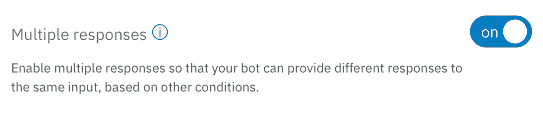
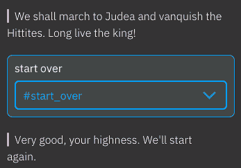

# 在 IBM Cloud 中构建一个聊天机器人

> 原文：[`developer.ibm.com/zh/tutorials/cc-build-chatbot-ibm-cloud/`](https://developer.ibm.com/zh/tutorials/cc-build-chatbot-ibm-cloud/)

*Watson Conversation 现已更名为 Watson Assistant。虽然本教程中的某些插图可能会将该服务显示为 Watson Conversation，但这些步骤和过程仍然有效。*

聊天机器人是与用户交互的好方法。将自然语言理解与 Watson 平台的对话功能相结合，您就能构建出复杂的聊天机器人。

**免费试用 IBM Cloud**

利用 [IBM Cloud Lite](https://cloud.ibm.com/registration?cm_sp=ibmdev-_-developer-tutorials-_-cloudreg) 快速轻松地构建您的下一个应用程序。您的免费帐户从不过期，而且您会获得 256 MB 的 Cloud Foundry 运行时内存和包含 Kubernetes 集群的 2 GB 存储空间。

以下是您将在本教程中完成的任务：

1.  创建一个 Watson Assistant 服务实例。
2.  了解聊天机器人的基础知识，包括意图、实体和对话。
3.  创建一个简单聊天机器人。
4.  在聊天机器人中使用更多高级技术。
5.  将聊天机器人部署为一个独立应用程序的一部分。

## 创建一个 Watson Assistant 服务实例

您需要做的第一件事是创建一个 Watson Assistant 服务实例。您将在这里构建聊天机器人。该服务有一个友好的 Web UI 用于构建聊天机器人，还有一个测试面板，允许您查看聊天机器人如何处理各种用户输入。

首先，转到 IBM Cloud 目录：

1.  转到 [cloud.ibm.com](https://cloud.ibm.com/registration?cm_sp=ibmdev-_-developer-tutorials-_-cloudreg)，单击页面顶部的 **Catalog**，然后在搜索栏中输入 **assistant**。您会在 Watson 部分中看到 Watson Assistant 服务。

    

2.  单击该目录项来开始操作。在下一个面板上，您会在顶部看到新服务的名称。您可以采用现有的名称（类似于 Conversation-n1）或输入自己的名称。下滚到 Pricing Plans 部分，确保选择了 **Lite** 计划（Free 计划）。

    

3.  单击 **Create** 创建您的新 Watson Assistant 服务。
4.  单击 **Launch tool** 开始构建您的聊天机器人。

    

    请注意，Watson Assistant 服务名为 dwtv-convo，而不是不容易记住的 Conversation-n1。您会看到 **Workspaces** 面板。

    

    您的服务包含一个用于车辆仪表板的样本聊天机器人，以及一个用于创建新工作区的窗格。每个工作区都包含一个聊天机器人，以及完成其工作所需的所有资源。如果使用 IBM Cloud Lite 帐户，您最多可以创建 5 个新工作区。

5.  单击 **Create** 创建一个新工作区。完成详细信息，如下所示：

    *   名称：Royal Valet
    *   描述：Rameses II’s personal valet chatbot

    

## 场景

这里将要构建的样本场景是针对古埃及法老拉美西斯二世的 Royal Valet 聊天机器人。（与我们一起操作吧。至少它不是“Hello World”。）每一天，拉美西斯可能想要做三件事：


*   举行一场宴会
*   建造某种纪念塔（他非常喜欢做这类事情）
*   发动一场战争

您的聊天机器人会帮助国王计划他的一天。如果拉美西斯希望举行一场宴会，您需要知道要举行一场什么样的宴会。如果他想要建造某个建筑，您需要知道他希望建造什么（祭坛、寺庙、方尖塔），以及他想要建在哪儿。最后，如果他想要发动一场战争，您需要知道他希望与谁开战，以及战斗将在哪里进行。

这就是您将在这里构建的聊天机器人要应对的场景，但如果您愿意的话，您也可以自由地构建自己的场景。

## 创建一个简单聊天机器人

[https://cdnapisec.kaltura.com/p/1773841/sp/177384100/embedIframeJs/uiconf_id/44854321/partner_id/1773841?iframeembed=true&playerId=kplayer&entry_id=0_zbf9kup0&flashvars[streamerType]=auto](https://cdnapisec.kaltura.com/p/1773841/sp/177384100/embedIframeJs/uiconf_id/44854321/partner_id/1773841?iframeembed=true&playerId=kplayer&entry_id=0_zbf9kup0&flashvars[streamerType]=auto)

创建工作区后，您会看到以下屏幕。

[您的新聊天机器人的初始屏幕](https://developer.ibm.com/developer/default/tutorials/cc-build-chatbot-ibm-cloud/images/convo_4.png)

正如您在左上方看到的，您在构建聊天机器人的过程中将定义 3 个概念：

*   **意图**：法老可能想执行的操作（这里考虑使用动词）。
*   **实体**：拉美西斯二世可能要求或选择的事物，比如一种纪念塔类型、一种宴会类型或一个战场位置（类似地，考虑使用名词）。
*   **对话**：国王与您的聊天机器人之间的交互（或交流，如果您喜欢的话）。您将使用对话从国王的输入中识别意图和实体。

法老将通过对话与聊天机器人交互。当聊天机器人识别出国王的意图和该意图所需的所有实体时，它会说”Long live the king”或类似的话。在这之后，我们会设想聊天机器人将国王的请求传达给皇家 IT 部门来付诸实施。

### 创建意图

在上一幅图中，您会注意到，Watson Assistant 服务在等待您创建一些意图。首先单击 **Create new**。

对于每个意图，您应该为其提供一个有意义的名称，比如 `#have_a_feast`（意图以井号作为前缀），还应该提供国王可能说的话的一些示例，以表明此意图是他想要做的事。所以对于 `#have_a_feast`，一些示例可能是“let’s eat!”、“ring the dinner bell”或“sound the feasting horn”。您定义的示例越多，Watson natural language understanding 服务就越有可能理解国王的意思。

为该意图输入一个名称并输入一些示例。输入每个示例后，按下 **Enter**，Watson Assistant 会将该示例添加到输入字段下的列表中。这是一个开始。


### 创建实体

现在，是时候创建一些与 `#have_a_feast` 意图相关的实体了。单击工作区顶部的 **Entities** 选项卡。正如您预期的那样，Watson Assistant 服务会让您知道您没有任何已定义的实体。


**sed** 是国王 30 岁时举办的一次成功的宴会，随后约每 3 年举办一次该宴会。拉美西斯二世活了 90 多岁，据信他举办的 sed 比历史上其他任何法老都要多。

与意图一样，单击 **Create new** 创建一个新实体。定义一个名为 `@feast_type` 的新实体（实体以 @ 符号作为前缀）。定义实体时，会定义该实体的所有可能值，以及任何或所有这些值的同义词。与意图一样，提供的示例越多，从 Watson 的自然语言处理系统获得的结果就越好。

此示例为 `@feast_type` 定义了 3 个值：sed、pot luck 和 food chariot rodeo，其中一个值有一个同义词。


请注意，“food truck rodeo”是“food chariot rodeo”的同义词。

### 创建对话

现在，是时候通过一些对话来完善您的聊天机器人了。单击工作区顶部的 **Dialog** 选项卡。每个聊天机器人都有两个默认对话：Welcome 和 Anything else。


Welcome 对话是在用户启动聊天机器人时显示的问候语。**Anything else** 被用作默认响应，它通常是“Sorry, I didn’t understand that”的某种变体。

首先，单击 **Welcome** 对话的方框，并将消息更改为适合国王的话。


在聊天机器人启动时，会触发此对话并显示该消息。您可以定义此响应的多个变体，所以可以定义多条问候语，让系统在聊天机器人启动时随机挑选一条问候语。

您也可以对 Anything else 对话这么做。“Your humble servant was unable to make any sense whatsoever out of what you just said”可能更适合用作对国王的响应。（或者可能不适合。）

这包括默认对话。现在是时候创建您自己的对话了。单击 Welcome 对话旁边的 3 个点构成的图标，选择 **Add node below**，以便在它下方创建一个新节点。


将该对话命名为“Have a feast”，并将它设置为在系统识别出 `#have_a_feast` 意图时触发。


**备注：** 在风格上，您的作者可能更喜欢将所有对话都与意图关联。如果您喜欢，可以创建响应实体的对话。

此对话会在 Watson 判断国王说他想举行宴会时触发。如果是这样，聊天机器人需要询问国王，他想举行何种宴会。但是如果国王输入类似这样的信息：

> Sound the feasting horn! Let there be a food truck rodeo for all my people!

在这种情况下，Watson 会识别出 `#have_a_feast` 意图和 `@feast_type` 实体，所以我们不想通过询问国王想举行何种宴会进行响应。为了处理这种情况，我们使用了一个名为 *slots* 的 Watson Assistant 服务特性。要定义它们，可以单击右上角的 **Customize** 链接。单击滑块来启用 slot。


slot 背后的理念是，在此对话完成前，您将定义 Watson 必须识别的所有实体。以下是包含一个已定义的 slot 的已更新的对话。


可以看到，如果意图为 `#have_a_feast`，Watson Assistant 服务会检查是否定义了 `@feast_type` 实体。该实体的值被存储为一个名为 `$feast_type` 的局部变量（变量以美元符号作为前缀）。如果该实体不存在，聊天机器人会向国王询问一个问题。（完整的问题是“What kind of feast would your excellency like to have?”，但这里仅显示了部分文本。）最后，这个 slot 是必需的，所以该对话在这个实体拥有值后才会完成。

对话的最后部分是响应。下图显示了在定义所有必需的实体后，您的聊天机器人对法老说的话。

$feast_type

变量的值包含在响应中。

如果国王输入一些信息来表明他想举行宴会（“ring the dinner bell”会具有预期效果），则不会定义 `@feast_type` 实体，所以聊天机器人询问国王想举行何种宴会。另一方面，如果国王输入一个完整请求（“let’s have a feast.I’m thinking a pot luck.”），您的对话包含聊天机器人完成国王的请求所需的所有信息。它回复“Excellent! I will make the plans for a pot luck right away.Long live the king!”，而不会进一步询问法老。

### 测试您的聊天机器人

我们已进行了足够的设置。让我们看看您的聊天机器人是如何工作的。单击右上角的 **Conversation** 图标来启动测试对话。


您可以扮演法老的角色，看看聊天机器人如何响应。例如，下图显示了在您输入“let’s have a feast!”时发生的情况。


请注意，界面上清楚显示了 Watson 在输入中识别出的信息。它正确识别出国王的意图为 `#have_a_feast`。另外，请注意识别出的意图旁边的下拉箭头。如果 Watson 判断错误，您可以单击该箭头并选择正确的意图。Watson 会从更正过程中学习，所以一个不错的主意是只要 Watson 没猜准就这么做。

因为国王没有指定他想要举行何种宴会，所以您的聊天机器人以一个跟进式问题作为响应。

这是国王发出完整请求时发生的情况的示例。


Watson 不仅正确识别出了意图，它还识别出了 `@feast_type`。界面上突出显示了 Watson 在输入中识别出的文本，以及它根据该输入得出的结论。因为您已将“food truck rodeo”定义为“food chariot rodeo”的同义词，所以 Watson 理解国王的意思。来自对话的响应包含实体的值作为原始值，而不是同义词：“I will make the plans for a *food chariot rodeo*…”是响应，尽管国王实际上输入的是“food truck rodeo”。

## 在聊天机器人中使用更多高级技术

[https://cdnapisec.kaltura.com/p/1773841/sp/177384100/embedIframeJs/uiconf_id/44854321/partner_id/1773841?iframeembed=true&playerId=kplayer&entry_id=0_jfs388yd&flashvars[streamerType]=auto](https://cdnapisec.kaltura.com/p/1773841/sp/177384100/embedIframeJs/uiconf_id/44854321/partner_id/1773841?iframeembed=true&playerId=kplayer&entry_id=0_jfs388yd&flashvars[streamerType]=auto)

此刻，您的聊天机器人将处理国王想做的 3 件事之一。在本节中，您将实现创建一个全功能聊天机器人所需的剩余意图。您的聊天机器人需要处理 3 个更复杂的场景。

*   **不允许使用一个实体的某些值：** 在拉美西斯二世的时代，金字塔已不再流行。（最后一个金字塔是在他所处时代之前约 1500 年的时候建造的。）如果国王说他想建造一座金字塔，聊天机器人需要委婉地坚持让他建造其他建筑。
*   **根据意图和其他实体来推断实体的值：** 如果国王想要发起战争，您的聊天机器人需要知道国王想要与谁开战和在哪儿开战。对于一些敌人，您可以根据敌人来推断战场位置。例如，如果国王想要与 Sherdan 海盗开战，那么战斗显然将在海上进行。另一方面，如果国王想要与希泰人开战，那么战斗很可能发生在朱迪亚或迦南（*即*撒玛利亚）。您的聊天机器人需要尽可能推断战场位置，仅在它不确定时询问国王应在哪儿进行战斗。
*   **重置聊天机器人的状态：** 在您的聊天机器人识别出一个实体时，它的值会一直显示，除非国王输入一些信息将其覆盖。您需要实现一个意图来重置所有实体的值。完成此操作的代码将与意图 `#start_over` 相关。

我们将使用条件实体、条件响应、多个响应和对话的 JSON 源代码来实现这一神奇功能。

### 一些背景知识

本节将执行的操作假设已经设置了更多的意图和实体。设置这些意图和实体的一种方式是导入它们。您可以在 [gist.github.com/DougTidwell](https://gist.github.com/DougTidwell) 上找到最终的聊天机器人的 JSON 版本。（查找名为 `RoyalValet.json` 的 gist。）将该文件保存到您的机器上，然后转到您的工作区，并单击 **Import** 图标。


从您的机器中选择该文件，确保选择了 Import Everything 单选按钮，然后单击 **Import**。


这会向您的工作区添加一个新聊天机器人，它包含我们将在这里介绍的所有意图、实体和高级特性。该聊天机器人也称为 Royal Valet，所以您可能想要重命名它来与之前创建的聊天机器人进行区分。

另一方面，如果您更喜欢自行构建所有功能，可以添加以下意图：

| 意图名称 | 示例 |
| --- | --- |
| `#have_a_feast` | have a feast eat! how about a food truck rodeo? ring the dinner bell shindig soirée sound the feasting horn |
| `#build_something` | let’s build something |
| `#start_a_war` | conquer declare war fight go to battle I’m really annoyed with the Sumerians lately. occupy pillage plunder smack start a war |
| `#done` | I’m done. It’s a plan. Make it so. |
| `#get_help` | give me a hand here help me out here how do I get started? what do I do next? |
| `#start_over` | start over |

定义这些意图后，添加以下实体：

| 实体名称 | 值（和同义词） |
| --- | --- |
| `@battle_site` | Canaan (Samaria) Judea Libya Nubia sea (ocean, Mediterranean) Syria Ur Uruk |
| `@enemy` | Hittites Libyans Nubians Sherdan pirates (pirates) Sumerians Syrians |
| `@feast_type` | food chariot rodeo (food truck rodeo) pot luck (potlach) sed |
| `@monument_site` | Abu Simbel Pi-Ramesses (Pi-Rameses) Qurna Thebes |
| `@monument_type` | alter (alter) obelisk pyramid statue temple |

### 不允许使用某个实体的值

您将实现的第一项高级技术是不允许使用某个实体的值。您将不允许使用“pyramid”作为 `@monument_type` 的值。我们之前已经提到过，金字塔是在*约* 1,500 年前建造的，所以您的聊天机器人需要委婉地建议国王建造其他建筑。

建造建筑的对话（与 `#build_something` 有关）使用条件 slot 和条件响应。如果满足某个条件，则会触发该条件 slot 或返回该条件响应。定义对话需要 3 步：

1.  为此对话启用 slot。
2.  定义一个条件响应。如果国王想要建造的建筑 (`@monument_type`) 是金字塔，该对话将以一条委婉的消息作为响应，告知国王金字塔已过时。如果国王想要建造其他建筑，则不会触发条件响应。
3.  定义一个条件 slot。如果国王想要建造金字塔以外的建筑，聊天机器人会处理 `@monument_site` 的 slot。

请注意，如果国王输入“let’s build an obelisk in thebes”（这个句子包含 `#build_something` 意图，以及 `@monument_type` 和 `@monument_site` 实体的值），那么条件 slot 应使用“Excellent, your majesty.I will start the plans for a new obelisk in Thebes”作为响应，而不提供进一步提示。

您已经知道国王如何为此对话启用 slot，所以请继续操作。接下来，创建两个 slot，一个用于 `@monument_type`，一个用于 `@monument_site`。


请注意，第一个 slot 是必需的，第二个是有条件的。要设置这些 slot，请单击 `@monument_type` slot 旁边的齿轮图标来配置它。单击 3 个点构成的图标，然后选择 **Enable conditional responses**。


为 `$monument_type:pyramid` 添加一个响应。


这个条件响应仅在国王要求建造金字塔时显示。该响应委婉地建议国王建造其他建筑。

在第一个 slot 中定义了条件响应后，您需要将第二个 slot 设置为有条件的。如果国王想要建造的是金字塔，那么询问他想要在何处建造是没有意义的，所以应将整个 slot（不仅仅是它的响应）设置为有条件的。为此，可以单击 `@monument_site` slot 旁边的齿轮图标来配置它。单击 3 个点构成的图标，然后选择 **Enable condition**。


现在您已将此 slot 设置为有条件的，接下来定义启用这个 slot 的条件。当然，这个条件是法老想要建造金字塔以外的建筑。


请注意，如果国王要建造一座方尖塔，聊天机器人就需要询问应在何处建造这座方尖塔。响应中的建议与为 `@monument_site` 实体定义的值相匹配。

完成的对话的工作效果如下所示。


### 根据意图和其他实体来推断实体的值

下一项高级技术是根据意图和 Watson 识别出的其他实体来确定一个实体的值。对于意图 `#start_a_war`，您的聊天机器人需要知道国王想与谁开战 (`@enemy`) 和战斗将在何处进行 (`@battle_site`)。根据参与战斗的敌人，聊天机器人能够确定战斗将在何处进行。下面是一个场景。

| 敌人（和同义词） | 战场（和同义词） |
| --- | --- |
| Hittites | Canaan (Samaria) *或* Judea |
| Libyans | Libya |
| Nubians | Nubia |
| Sherdan pirates (pirates) | sea (ocean, Mediterranean) |
| Sumerians | Ur *或* Uruk |
| Syrians | Syria |

可以看到，如果国王想与希泰人或苏美尔人开战，聊天机器人需要询问战斗将在何处进行。如果国王想与 Sherdan 海盗开战，聊天机器人不应向国王询问战场位置。

您将组合一些技术来实现此功能，包括条件 slot、条件响应、多个响应和编辑 JSON 代码。首先，单击对话顶部的 **Customize** 为此对话启用 slot，并启用多个响应。



稍后将定义这些响应。现在创建 3 个 slot。


请注意，第一个 slot 是必需的，接下来两个 slot 是有条件的。第一个 slot 查看 `@enemy` 的值并尽可能设置 `@battle_site` 的值。第二和第三个 slot 处理 `@enemy:Hittites` 和 `@enemy:Sumerians` 的情况。

单击第一个 slot 旁边的齿轮图标来编辑它。单击 3 个点构成的图标来启用条件响应，然后添加 5 个响应。


这里的策略是为只能在一个地方开战的 4 个敌人返回不同的响应。所以对于 `@enemy:(Sherdan pirates)`，条件响应是“We shall go to `$battle_site` and send the Sherdan pirates to a watery grave.”。这里的明显问题是如何自动设置 `$battle_site`。您可以使用 JSON 完成此工作。单击齿轮图标来自定义响应，然后单击 3 个点构成的图标来打开 JSON 编辑器。


在 JSON 编辑器中，添加一个名为 `context` 的对象。


请注意， `context` 对象将 `$battle_site` 变量的值定义为 `sea`。这意味着对国王的响应将是“We shall go to *sea* and send the Sherdan pirates to a watery grave.”。（当然，该代码必须是有效的 JSON。如果存在语法错误，编辑器将不允许保存代码。您将添加一个新对象，所以请确保与对象一起添加了一个逗号。）

以类似方式处理其他 3 个敌人，添加一个包含一个变量的响应，编写 JSON 代码来设置 `$battle_site`。在前面的图中可以注意到，最后的响应有一个 `true` 条件。这是默认响应（毕竟 `true` 始终为 `true` ）。您不知道战场位置，所以仅返回文本“Woe be upon the `@enemy`!”。此响应是针对 `@enemy:Hittites` 和 `@enemy:Sumerians` 而触发的。接下来，将定义条件 slot 来处理这两个敌人。

针对希泰人和苏美尔人的两个条件 slot 很简单。下图展示了聊天机器人如何确定国王想在何处与希泰人开战。


该问题为法老提供了针对这个敌人的选择。（当然，您可以硬编码 `$enemy` 的值。如果您在这个条件 slot 中，它将始终为 `Hittites`。）Watson Assistant 服务在国王的响应中识别出战场位置。国王可以输入 `samaria` 、 `road trip to judea!` 或 `canaan`，聊天机器人会准确获知战斗将在何处进行。（ `@battle_site` 实体将 `Samaria` 定义为 `Canaan` 的同义词。）

最后一个难题是为对话本身定义多个响应。您已启用了多个响应，所以现在就创建它们。


对于希泰人和苏美尼亚人，聊天机器人返回一条提及战场位置和敌人的消息。例如，“We shall march to Judea and vanquish the Hittites.Long live the king!”。对于其他每个敌人，默认情况下仅返回“Long live the king!”，因为您的聊天机器人已声明了战场位置和敌人。

这个非常复杂的对话的工作效果如下。


您的聊天机器人根据 `@enemy` 确定了 `@battle_site`。请注意，只有 Watson 突出显示的信息才是标识敌人的文本。您的聊天机器人是从这些文本中获取信息的。

这是一种更复杂的情况。


请注意，对于国王的回答，Watson 识别的意图为 `Irrelevant`。这意味着 Watson 无法从一个单词 `Canaan` 中推断出任何意图。这不是问题，因为您的聊天机器人已经知道该意图。

这与单个对话的复杂度类似。做下深呼吸。您只需要掌握另一项高级技术，而且该技术与此相比更容易。

### 重置聊天机器人的状态

最后的高级技术是使用 JSON 来重置聊天机器人的状态。如果国王输入“start over”，聊天机器人需要将所有条目重置为 `null`。这很容易完成。在 Start Over 对话中，在 JSON 编辑器中添加一个 `context` 对象。


您可能会发现，这种重新开始的技术在所有聊天机器人中都很有用。它是一种重置所有状态并重新开始的简单方法。这是你完成的对话的样子。



## 将聊天机器人部署为一个独立应用程序的一部分

此刻，您已构建了一个完整的聊天机器人，它使用复杂逻辑来智能响应法老的愿望。但目前为止，您仅使用用于 Watson Assistant 服务的工具在浏览器中运行过它。现在，您将实现一个独立的聊天机器人应用程序。

为了保持简单，将从一个现有的样本应用程序开始，并将它的聊天机器人替换为您自己的。完成这一步后，可以运行该应用程序，还可以将您的聊天机器人部署到网络中。首先，克隆 [`github.com/watson-developer-cloud/conversation-simple`](https://github.com/watson-developer-cloud/conversation-simple) 上的 GitHub 存储库。


在命令行，输入以下命令：

```
git clone https://github.com/watson-developer-cloud/conversation-simple.git
cd conversation-simple 
```

*非常感谢 Watson Assistant 团队开发、分享和维护此应用程序。*

README.md 文件提供了大量有关创建 Watson Assistant 服务和其他细节的说明，不过您已处理好了这些工作。您需要做的下一件事是，设置聊天机器人以及托管它的 Watson Assistant 服务的凭证。将 `.env.example` 文件复制到 `.env`。 `.env` 文件如下所示。

```
# Environment variables
WORKSPACE_ID=<workspace-id>
CONVERSATION_USERNAME=<conversation-username>
CONVERSATION_PASSWORD=<conversation-password> 
```

您需要填充这 3 个值，然后代码才会生效。要获取 `WORKSPACE_ID`，请返回到 Watson Assistant 工作区，单击聊天机器人的磁贴上的 3 个点构成的图标，并选择 **View details**。


该磁贴显示了工作区 ID。


单击复制图标将该值放到剪贴板上，然后粘贴到 .env 文件中。

现在是时候从 Watson Assistant 服务获取 `CONVERSATION_USERNAME` 和 `CONVERSATION_PASSWORD` 值了。转到 [cloud.ibm.com](https://cloud.ibm.com/catalog?cm_sp=ibmdev-_-developer-tutorials-_-cloudreg) 上的仪表板，在列表中找到您的 Watson Assistant 服务，单击它打开该服务的管理页面。单击左侧的 **Service credentials** 选项卡。


您会看到一个凭证列表。如果还没有任何凭证，请单击 **New credential** 创建一个。接下来，请单击 **View credentials** 查看您需要的值。


将这两个值复制并粘贴到 .env 文件中，保存它，您的聊天机器人应用程序就可以运行了！转到命令行，输入 `npm install` 来安装您的应用程序所需的 NPM 包，然后输入 `npm start` 运行该应用程序。


您的应用程序在端口 3000 上运行，所以请转到浏览器并打开 localhost:3000 来查看它的运行情况。


左侧的 UI 是国王与聊天机器人之间的简单交流。右侧的面板显示的 JSON 数据表示您的聊天机器人收到的输入，以及 Watson 在该输入中识别出的意图和实体。

### 进一步完善

此应用程序正在您的本地机器上运行。如果您喜欢将应用程序部署为一个在 Kubernetes 集群内运行的 Docker 容器，请观看以下 [developerWorks Mailbag](https://developer.ibm.com/tv/dwmailbag/) 视频：

*   [在您的机器上使用 Docker 映像和容器](https://developer.ibm.com/tv/dw-mailbag-docker-intro/)
*   [在 IBM Cloud 中构建一个 Kubernetes 集群](https://developer.ibm.com/tv/dw-mailbag-kubernetes-clusters/)
*   [使用 Kubernetes 密钥来管理凭证](https://developer.ibm.com/tv/using-kubernetes-secrets-manage-credentials/)

第一个视频展示了如何构建一个 Docker 映像并从中创建一个 Docker 容器，第二个视频展示了如何创建一个 Kubernetes 集群并将您的 Docker 映像部署到该集群内，第三个视频展示了如何管理该集群内的凭证。如果您跟随完成了这些示例，您会有一个能在最先进的容器环境中运行的复杂聊天机器人，这会让您获得好友的赞誉，并让敌人措手不及。

## 结束语

您花费了很大的精力来学习，但现在您知道了如何构建一个使用逻辑来优雅地处理复杂情况的聊天机器人，还知道了如何将该聊天机器人部署在一个独立应用程序内。您拥有了创建聊天机器人来与用户交互并让世界变得更美好所需的所有技能。祝您好运！

准备进行深入研究？访问 code pattern 并学习如何融会贯通。通过学习如何构建一个[可配置、适合零售的聊天机器人](https://developer.ibm.com/patterns/create-cognitive-retail-chatbot/)，进一步提升技能。

## 参考资源

*   阅读相关 Code Pattern: [使用 Node.js 和 Watson 来检测情绪、识别实体并发现答案](https://developer.ibm.com/cn/patterns/create-cognitive-banking-chatbot/)

本文翻译自：[Build a chatbot in the IBM Cloud](https://developer.ibm.com/tutorials/cc-build-chatbot-ibm-cloud/)（2018-03-04）