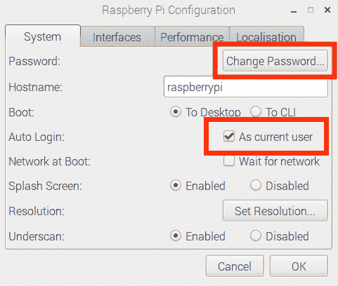

# 为一个家庭自动化系统设置硬件

> 原文：[`developer.ibm.com/zh/tutorials/iot-smart-home-01/`](https://developer.ibm.com/zh/tutorials/iot-smart-home-01/)

##### IoT 与智能家居

*   为一个家庭自动化系统设置硬件（本教程）
*   [为一个家庭自动化系统设置系统软件](http://www.ibm.com/developerworks/cn/iot/library/iot-smart-home-02)
*   [为一个家庭自动化系统开发 IoT 应用程序](http://www.ibm.com/developerworks/cn/iot/library/iot-smart-home-03)

家庭自动化无处不在！

但是家庭自动化到底是什么？我在开发本项目期间了解到的一件事是，“家庭自动化”这个术语有许多定义。对我而言，家庭自动化意味着可以使用 IoT 技术远程控制我家里平常需要手动执行的任务。

例如，我无需走到客厅灯前，伸出手打开它，而是可以从我具有访问控制权的任何地方打开和关闭客厅灯，无论是使用家里某处的操作面板、计算机上的软件面板，还是从地球的另一边使用智能手机。

这个定义听起来很简洁，但实际上，家庭自动化系统就像由来自不同制造商的组件构成的一部复杂交响曲，必须精心编排这些组件，才能执行该系统的功能。这些组件必须理解一组通用的协议（对于本项目，只有一个协议，那就是使用 433.92 MHz 频带的 OOK/ASK 编码），才能受到控制，报告状态，并成为整个家庭自动化系统的一部分。

对目前的家庭自动化领域的一个[主要抱怨](https://www.ibm.com/developerworks/community/blogs/e3ec7365-1b09-44f2-906f-19826275860f/entry/The_Fragmented_Smart_Home_Can_Everything_Ever_Be_Conjoined?lang=en)是，各种设备是“碎片化”的。通常，设备来自不同的制造商，而且经常使用不同的协议。这些差异让家庭自动化系统集成商感到头疼，他们必须解决如何将这些碎片化组件拼凑起来提供良好的房主体验的问题。

尽管我不会实际探讨这个问题*本身*，但您需要知道，在购买 IoT 设备时，它们可能无法很好地协同工作。所以，我精心选择了本教程的设备，因为我自己测试过它们，知道它们都能协同工作。请务必严格按照说明进行操作，除非您知道自己在做什么，否则不要偏离本教程中提供的部件列表。

在本教程中，大部分主要章节都以一个简短的视频开始（< 7 分钟），其中演示了 IoT 设备的概念。小节的文字包含详细的解释和图片，解释了我试图在该小节中表达的概念。视频会放在小节末尾处，这是一种合理做法（而且会让该小节的文本更加流畅）。这里的重点在于，本教程包含文本、图片和视频，它们是交织在一起的，试图使您沉浸在该技术中，让您获得最佳的学习体验。我希望我已取得成功。

## 您将在本系列中构建的组件

您将构建一个远程控制系统的框架，而不是一个完整的家庭自动化系统。但是，在完成该项目时，如果您选择进一步完善该项目，则需要拥有一些知识（和可能的动力）。

您构建的项目将控制一组 IoT 设备，包括：

*   智能电源插座
*   家庭警报系统

您将从运行 Android 操作系统的 Android 智能手机控制这些 IoT 设备（如果没有 Android 智能手机，也可以通过 Android 模拟器进行控制）。

### 硬件

该系统的硬件组件包括：

*   Raspberry Pi 3 Model B v1.2，这是将控制组成家庭自动化系统的设备的 IoT 计算机
*   433-MHz 接收器和发射器模块，它们接收来自系统的信号并向系统发射信号
*   无线电源插座，用于监听 433 MHz 频带中的打开/关闭信号并相应地进行响应
*   无线家庭警报系统，系统中的窗和门传感器使用 433 MHz 频带的信号来控制，还使用这些信号来报告状态

在本教程系列的这部分中，您将设置这些硬件。

### 软件

该系统的软件组件包括：

*   Raspbian OS（Stretch 版），这是在您的 Raspberry Pi 3 上运行的操作系统。
*   用于 Pi 及 RF 接收器和发射器模块的各种实用程序：

    *   [Wiring Pi](http://wiringpi.com)，这是一个开源库，用于访问 Raspberry Pi 上的 GPIO 引脚
    *   [rc-switch](https://github.com/jstevenperry/rc-switch)，这是一个低级 C++ 库，用于控制在各种平台（包括 Raspberry Pi）上运行的 433-MHz 硬件
    *   [433Utils](https://github.com/jstevenperry/433Utils)，它使用 rc-switch 和 wiringPi 与 RF 接收器和发射器进行通信
*   家庭自动化项目是运行家庭自动化平台本身的高级代码。在第 2 部分中，您将亲自编写许多代码，但不用担心，如果您遇到困难（或者希望跳过编码），我在 GitHub 中提供了一个完整的解决方案。
*   [Android Studio](https://developer.android.com/studio/index.html) 尽管可以从 Google Playstore 下载这个家庭自动化应用程序，但也可以从 GitHub 下载它的源代码并将其加载到 Android Studio 中。或者，如果您没有 Android 设备，那么可以在 Android 模拟器中运行应用程序代码。无论如何，我都会介绍源代码，而且 Android Studio 是您将使用的 IDE。

在本教程系列的[第 2 部分](http://www.ibm.com/developerworks/cn/iot/library/iot-smart-home-02)，您将设置所有软件（[Raspbian Stretch](https://www.raspbian.org) 除外，您将在本系列的这部分后面设置它）。

### IBM Cloud

最后（但无疑同样重要）的软件组件是 IBM Cloud 服务 (Watson IoT Platform)，您将使用它将家庭自动化系统以及与其相连的各种设备（“事物”）安全地连接到互联网。

通过使用 [Watson IoT Platform](https://console.bluemix.net/docs/services/IoT/index.html#gettingstartedtemplate)，您可以安全地将您的 Raspberry Pi 连接到互联网，并通过 Message Queue Telemetry Transport ([MQTT](https://developer.ibm.com/dwblog/2016/mqtt-de-facto-standard-iso-messaging/)) 的神奇功能来控制它（好吧，没有神奇功能，而*是*一种非常酷的 [ISO 标准](https://www.iso.org/standard/69466.html)）。

我将展示如何定义 Android 应用程序所需的 API 密钥，以及 Raspberry Pi 的设备 ID。我还将展示如何将运行您的家庭自动化系统的 Raspberry Pi 连接到 Watson IoT Platform。然后，我将展示如何从 Android 设备和 Android 模拟器，通过 Android 应用程序控制家庭自动化系统。

在本教程系列的[第 3 部分](http://www.ibm.com/developerworks/cn/iot/library/iot-smart-home-03)中，您将了解如何通过 IBM Cloud 将家庭自动化系统连接到 Android 应用程序。

## 部件列表

我喜欢 DIY 项目，但让我恼火的是，在开发一个非常酷的项目的途中，发现作者没有使用图解中描绘的部件，或者更糟糕的是，他们使用了不再可用的部件！

此列表中的所有部件都很容易从 Amazon.com 获取，而且我自己也在本项目中使用了它们。如果您无法从 Amazon 获取某些部件，可以替换它们，但请尽量坚持采用下面的部件列表上的部件，否则您可能遇到麻烦。

在下面提供的表格中，您会找到我在项目中使用的*相同*部件。而且就像我说的，所有部件都可以从 Amazon 获取，所以您应该可以从全球任何地方订购它们。

##### 部件列表

| 部件编号 | 描述 | 价格（美元） | 订购链接 |
| --- | --- | --- | --- |
| 1 | 带 2.5A Micro USB 电源的 CanaKit Raspberry Pi 3 | 43 | [Amazon.com](https://www.amazon.com/gp/product/B01C6FFNY4) |
| 2 | CPVAN Window Door Security Alarm Sensor，带 1 个警报装置、2 个磁传感器和 1 个遥控器的 DIY Wireless Home Security Burglar Alarm System | 30 | [Amazon.com](https://www.amazon.com/gp/product/B075W39YVB) |
| 3 | Etekcity Unify 制造的升级版无线远程控制电源插座开关 (H1) | 21 | [Amazon.com](https://www.amazon.com/gp/product/B071114JCC) |
| 4 | Kuman 830 MB-102 连接点免焊电路试验板 + GPIO T 形扩展板 + 65 根跳线 + 40 引脚彩虹带状电缆 + 100 个电阻 K73 | 13 | [Amazon.com](https://www.amazon.com/gp/product/B01LYN4J3B) |
| 5 | 用于 Arduino/Arm/McU/Raspberry pi/无线 DIY 的 UCEC XY-MK-5V / XY-FST 433 MHz Rf 发射器和接收器模块链接工具包（6 个装） | 11 | [Amazon.com](https://www.amazon.com/gp/product/B017AYH5G0) |
| 6 | SanDisk 16 GB 移动 MicroSDHC 4 类闪存卡，带适配器 | 7 | [Amazon.com](https://www.amazon.com/gp/product/B004ZIENBA) |
| 7 | （可选）LAOMAO 10 根 433 MHz Helical 天线，Arduino Raspberry Pi 遥控器 | 6 | Amazon.com |

项目成本（估计）：125 美元。

请注意这个部件列表中的部件的以下说明：

*   **部件 2 和部件 3**：没有必要订购这些准确的型号（例如，它们可能不可用，或者在 Amazon 中脱销）。但是，请确保您订购的产品在 433.92 MHz 频带中使用了 OOK/ASK 编码，而且有一个遥控器（所以您可以捕获品牌编码和脉冲长度，我会在本系列第 2 部分中详细进行介绍）。
*   **部件 4**：您不必使用分线板。如果您已有公/母跳线，可以直接将您的 Raspberry Pi 的 GPIO 引脚连接到电路试验板。但是分线板使得使用 Pi 上的 GPIO 引脚变得更容易，而且您始终需要跳线和电路试验板，所以 Kuman 组件包是个不错的选择。
*   **部件 5**：如果没有订购 6 个装的接收器/发射器模块，每种模块一定要订购至少两个，因为如果对这些便宜的部件每种仅订购一件，并发现其中 1% 部件寄到时已损坏，这会让人感到非常沮丧。（此外，在完成本系列时，您将拥有您想要执行的其他所有 DIY 433-MHz 项目的备件！）
*   **部件 6**：您不必使用 SanDisk 品牌（例如，我非常成功地使用了 Samsung micro SD 闪存），但是这个卡*确实*需要是 **micro** SD 卡，否则它无法插入您的 Raspberry Pi 中！这个驱动器不必是 16 GB 的，但推荐使用**至少** 16 GB 的卡。另外，**确保您的 micro SD 卡附带了适配器**。
*   **部件 7**：433-MHz 特定天线是可选的，但推荐您订购它们，并在发射器模块中使用一根天线将它的范围增大数米。您会在图解和视频中看到我使用了它们。

最后一点说明：我假设您拥有 USB 键盘和鼠标，以及一个使用 HDMI 接头的外部显示器。您需要这些组件才能使用 Raspberry Pi。如果没有这些组件，请观看[这个视频](https://developer.ibm.com/tv/setting-up-your-raspberry-pi-without-a-keyboard-mouse-or-monitor/)，其中展示了如何对您的 Raspberry Pi 执行“无头”设置，这意味着“通过网络控制它”。但是，您*将*需要一条以太网线来执行初始安装。

1

## 设置您的 Raspberry Pi 3

现在您已拥有所需的部件，是时候设置您的 Raspberry Pi 3 了，它将控制您家里的所有设备。

取出 16 GB micro SD 驱动器（部件 #6），准备好将 Raspbian OS 镜像安装（或*闪存*）到它之上。在这之后，将这张卡插入到 Pi 上的微型 SD 卡槽，连接一个外部显示器、键盘和鼠标，然后首次启动 Pi。

不喜欢无趣的文字和屏幕截图？我明白了。观看一个视频如何？或者，为什么不结合使用它们呢？

[https://cdnapisec.kaltura.com/p/1773841/sp/177384100/embedIframeJs/uiconf_id/44854321/partner_id/1773841?iframeembed=true&playerId=kplayer&entry_id=0_vn5o15di&flashvars[streamerType]=auto](https://cdnapisec.kaltura.com/p/1773841/sp/177384100/embedIframeJs/uiconf_id/44854321/partner_id/1773841?iframeembed=true&playerId=kplayer&entry_id=0_vn5o15di&flashvars[streamerType]=auto)

[查看抄本](https://www.ibm.com/developerworks/cn/iot/library/iot-smart-home-01/transcript-raspberrypi.txt)

1a

### 闪存 Raspbian 镜像

如果您非常熟悉如何将 OS 镜像闪存到 micro SD 介质上，可以跳过这一节。

要在 micro SD 卡上创建可引导的 OS 镜像，请使用 [Etcher](https://etcher.io)。它的使用非常简单和直观。如果想要使用不同的工具，决定权在于您，但在下面的操作说明（和随后的视频）中，我将使用 Etcher。

#### 下载 Raspbian Stretch 镜像

在 micro SD 卡上创建 Raspbian 镜像之前，您必须将该镜像下载到计算机上。转到 [Raspbian 下载页面](https://www.raspberrypi.org/downloads/raspbian/)并选择 [RASPBIAN STRETCH WITH DESKTOP](https://downloads.raspberrypi.org/raspbian_latest)，它将为您提供一个美观的 GUI，供您在 Raspberry Pi 启动并运行后使用。

该镜像比“Lite”镜像稍微大一点，但这个 GUI 完全值得花额外的时间下载。

即使拥有很快的连接，下载该镜像也要花费几分钟，所以请耐心一点。下载完成后，一定要验证 SHA 校验和。Raspbian Stretch with Desktop 下载页面显示了 Raspbian Stretch with Desktop 镜像的 SHA-256 校验和。

##### Raspbian Stretch with Desktop 下载页面


要在 MacOS 上验证校验和，请打开一个终端窗口，转到您将镜像下载到的目录，并运行以下命令：

`shasum -a 256 2017-11-29-raspbian-stretch.zip`

您会看到与以下输出类似的输出：

```
$ shasum -a 256 ~/Downloads/2017-11-29-raspbian-stretch.zip
64c4103316efe2a85fd2814f2af16313abac7d4ad68e3d95ae6709e2e894cc1b  /Users/sperry/Downloads/2017-11-29-raspbian-stretch.zip
$ 
```

*（随着新版本的推出）包含该镜像的 .zip 文件的名称可能与您看到的不同。此输出是在编写本文时看到的输出。*

将该校验和（这一长串十六进制数）复制到一个文本编辑器中。现在复制并粘贴来自 Raspbian 下载页的校验和，比较二者。如果它们不匹配，**不要打开该文件**！请先尝试再次下载该镜像（它可能在下载过程中被损坏了，这会导致校验和不匹配）。

如果这么做不起作用，请访问 [Raspberry Pi 论坛](https://www.raspberrypi.org/forums)，搜索与 Stretch 相关的问题（如果无法找到任何有帮助的信息，可以发表一条消息，但始终应该先进行搜索）。从[这篇帖子](https://www.raspberrypi.org/forums/viewtopic.php?t=150033)可以看到，问题并不总是存在文件中。

#### 安装 Etcher

将镜像下载到计算机后，您就准备好将它闪存到将用于启动 Pi 的 micro SD 卡了。您可能想知道，为什么不能像其他任何文件那样，只需将 OS 镜像复制到 SD 卡即可。您当然可以这么做，但 Pi 不知道如何处理它，而且您会看到一个空白屏幕（如果您愿意这么做，我不予置评）。

但是，如果您的目的是让 Pi 启动并运行 Raspbian，您需要以 Pi 能正确启动的方式将该镜像闪存到卡上。您需要一个能让 micro SD 卡变得*可启动*的程序，（您已经猜到了）Etcher 能胜任此任务。

首先，访问 [Etcher 主页](https://etcher.io)，选择与您的平台匹配的下载选项。我使用了 MacOS，所以我将选择 **Download for MacOS**。

下载 Etcher 后，运行针对您的平台的安装。对于 MacOS，以 DMG 文件格式下载 Etcher。对于 Windows，运行设置程序 (exe)。在 Linux 上，解压 .zip 文件。

#### 运行 Etcher

现在 Etcher 已安装，是时候启动它了。闪存一个可启动的磁盘镜像是一个 3 步流程。首先，单击 **Select image**，转到您将镜像下载到的文件夹，选择该镜像，并单击 **Open**。Etcher UI 将会打开。


接下来，将 micro SD 卡安装到您计算机的 SD 驱动器中（必要时使用适配器），记下您的计算机的 OS 是如何挂载这个驱动器的。然后，单击 **Select drive**，选择该 SD 驱动器作为可启动镜像的目标。

最后，单击 **Flash**，几分钟后，您将拥有一个加载了 Raspbian Stretch 并且立即可用的可启动镜像。

1b

### 启动您的 Pi 3

您已将 Raspbian Strech OS 镜像闪存到 micro SD 卡上，接下来将它插入到 Pi 的 micro SD 卡槽中，该卡槽位于该开发板的底面，参见 Raspberry Pi 3 Model B 的底面 （标有“Micro SD Card”）。

##### Raspberry Pi 3 Model B 的底面


micro SD 卡只能朝一个方向插入，所以如果您无法插入，请确保 micro SD 卡的触点朝向开发板，如 Raspberry Pi 3 Model B 布局所示。

##### Raspberry Pi 3 Model B 布局


在 Pi 的众多优点中，另一个我喜欢的是，所有位置都已标明。所以如果您不确定将某个事物连接到何处，Pi 的电路板上的接头旁边可能有一个标签。

如果朝向正确的方向，micro SD 卡通常很容易滑入到位。不要暴力插卡，否则可能损坏它和/或您的 Raspberry Pi。

Raspberry Pi 3 Model B 有 4 个 USB 端口、一个 HDMI 端口，以及一个给 Pi 供电的 USB mini-B 端口。将 USB 鼠标、键盘和显示器连接到 Pi 的 USB 和 HDMI 端口。然后，将 Pi 的电源适配器 USB mini-B 接头连接到 Pi 上的 PWR IN 端口。参见 Raspberry Pi 3 Model B 布局。如果将电源适配器插入到适合您的 CanaKit（部件 1）附带电源的电源插座中，Pi 会立即启动。

当 Pi 启动时，如果 Pi 正确引导，您会看到一个类似下图的屏幕：


当 Pi 完成启动时，它会自动让您登录，您应该看到一个类似下图的屏幕：


没有看到类似这样的屏幕？我闪存了磁盘镜像并尝试启动了 Pi，却只看到一个空白屏幕。在这种情况下，有很多地方可能出错。首先，检查您的显示器是否正确连接（这并不代表我曾遇到过这种情况）。接下来，确保您将 micro SD 卡 **完全插入到插槽** 中。

如果这样仍无法修复问题，可能您在闪存镜像时某个地方出错了。尝试再次闪存镜像。如果这样仍不起作用，请确保您下载的镜像没有损坏（文件损坏是使用 `shasum` 验证校验和的原因之一）。

1c

### 保护您的 Raspberry Pi

执行进一步操作之前，应该更改一些默认设置。要访问 Raspberry Pi 设置，请单击屏幕左上角的 Raspberry，选择 **Preferences** > **Raspberry Pi Configuration**，您会看到一个类似 Raspberry Pi 配置对话框的对话框。

##### Pi 上的安全保护，您是认真的吗？

是的。我将 Raspberry Pi 视为一个严肃的计算平台。我担任开发人员已有很长时间了，Pi 比我在职业生涯中使用过的许多计算机都更为强大，所以理应更严格地进行防护措施。您不会让您的开发计算机的安全之门大敞，对吧？

请尊重 Pi，年轻的[学徒](https://en.wikipedia.org/wiki/Jedi#Padawan)。保证它的安全。

我推荐采取以下预防措施（参见 Raspberry Pi 配置对话框）：

*   更改默认密码。
*   禁用 Auto Login。
*   启用 SSH。

##### Raspberry Pi 配置对话框



**更改默认密码**。要更改默认密码（如果您想知道，默认密码为 `raspberry`），单击 **Change Password** 按钮。然后，在出现的对话框上，输入新密码，确认它，并单击 **OK**。下一次重新启动 Pi 时，您需要进行登录，所以请您确保挑选了一个您记得住的密码（我知道您记得住，但我必须说一下）。

**禁用 Auto Login**。勾选 Auto Login 时，每次启动 Pi，您都会以 **pi** 用户身份进行登录。我倾向于通过网络来使用我的 Pi（而不是坐在它的前面），所以在很多时候我打开它后就离开了。如果 Auto Login 被启用，任何人都能走上前来使用我的 Pi。为了预防这一安全问题，请取消选择 **Auto Login** 旁边的 **As current user**。

**启用 SSH**。默认情况下，您的 Pi 上已禁用 SSH。我推荐启用 SSH 访问。我非常喜欢能够从家里的任何地方使用我的 Pi（我想您也是）。单击 **Interfaces** 选项卡，选择 **SSH** 旁边的 **Enabled**。


1d

### 将 Pi 连接到网络

最后，您的 Pi 将需要能够连接到您的网络。如果您使用的是以太网端口，可以跳过这一步。不管怎样，您是否知道 Raspberry Pi 3 拥有内置 WiFi？要启用 WiFi，请单击屏幕右上角的 **Network** 图标，选择您想要连接到的网络。


输入预先共享的您的 WiFi 网络的密钥，并单击 **OK**。


您的 Pi 现在已配置并受到保护，而且它可以连接到互联网，本系列的第 2 和第 3 部分要求它能连接到互联网。

2

## 将 Raspberry Pi 3 连接到电路试验板

您已订购部件列表中的所有部件，并设置了您的 Raspberry Pi。此刻，您可能想知道到底如何构建这个家庭自动化系统。我的意思是，将接收器和发射器模块放在何处？它们如何获取电源？它们如何向 Pi 发送和从 Pi 接收信号？

答案是使用电路试验板。

如果您像我一样，此刻您可能想要构建点什么。您很幸运。我录制了一个视频来展示如何构建一个简单的 LED 电路，以便在处理项目的剩余部分时能够熟悉该电路试验板的布局，以及如何使用它。

[https://cdnapisec.kaltura.com/p/1773841/sp/177384100/embedIframeJs/uiconf_id/44854321/partner_id/1773841?iframeembed=true&playerId=kplayer&entry_id=0_ni91h9zv&flashvars[streamerType]=auto](https://cdnapisec.kaltura.com/p/1773841/sp/177384100/embedIframeJs/uiconf_id/44854321/partner_id/1773841?iframeembed=true&playerId=kplayer&entry_id=0_ni91h9zv&flashvars[streamerType]=auto)

[查看抄本](https://www.ibm.com/developerworks/cn/iot/library/iot-smart-home-01/transcript-breadboard.txt)

### 为什么要使用一个电路试验板？

电路试验板（比如一块电路试验板中的一个）是一种专门构造的电路，使您能快速构建电子电路原型。

##### 一块电路试验板


要构建电路，需要将*跳线*插入到电路试验板的孔中来建立连接（参见跳线）。

##### 跳线


在内部，电路试验板的孔以一种非常特定（且一致）的方式相连。由于电路试验板连接的布局方式，您知道电路试验板中的哪些孔已连接和哪些孔未连接，以便轻松地更改电路中的电流。

在一块电路试验板的内部连接中，可以看到两种类型的孔：将 5 个孔垂直连接起来的群组（其中的电路组件相互连接）和称为*横轨*的水平连接的孔。横轨是电路试验板顶部和底部水平连接的孔。您将在横轨上为电路提供电压和接地（就像在“电源轨”中一样）。

##### 一块电路试验板的内部连接


2a

### 设置分线模块

##### 这不是 Kuman 扩展板！

好吧，我知道。我在“部件列表”部分指责了在其图解中使用与项目中不同部件的作者。让我解释一下。我使用了一个名为 [Fritzing](http://fritzing.org/home/) 的非常酷的程序来描绘电路板图解，而他们没有 Kuman 扩展板。

扩展板的目的就是扩展。它就是一块简单的硬件。您可以[从 Amazon](https://www.amazon.com/gp/product/B00OG4X0DK)订购 Adafruit 扩展板，如果您觉得这样更好的话。

现在您已看到一块电路试验板的布局，是时候设置扩展模块了（部件 4）。扩展模块有两排引脚，每排 20 个。对齐扩展模块，以便每组水平引脚都能跨越电路试验板中间的间隙，如下所示：


2b

### 连接电路试验板的横轨

不是电路试验板的所有横轨都相互连接。这是特意设计的，以便为电路试验板提供不同的电源来建立更复杂的电路。

出于我们的目的，我们将使用从 Pi 引出的 +5V 电源来为接收器和发射器模块供电，以便所有横轨都彼此连接。将所有横轨彼此连接后，它们看起来类似下图：


现在，电路试验板的所有横轨都已连接。我通常使用白线来表示电源（`VCC` 或 `+`），使用黑线来表示接地（`GND` 或 `-`）。您不必使用黑色和白色的跳线，可以使用您想要的任何颜色。但是请记住，随着电路变得更复杂，使用一致的颜色编码模式有助于更快地诊断问题。

3

## 设置 433-MHz 接收器和发射器

教程系列的这部分的最后一步是设置 433-MHz 硬件设备。根据[联邦电子代码法规第 47 篇第 15 部分第 C 子部分第 15.231 段](https://www.ecfr.gov/cgi-bin/text-idx?SID=57e3d98742373709e9f8f17ed3759834&node=47:1.0.1.1.16.3.236.21&rgn=div8)的定义（不是我凭空捏造的），这些设备使用了 433.05 和 434.79 MHz 之间的 [ISM 频带](https://en.wikipedia.org/wiki/ISM_band)，以 433.92 MHz 作为中心频率。

### 关于 433-MHz 硬件

设计为在此频段内操作的硬件随处可见。从汽车远程控制到警报系统、电源插座，再到家庭气象站，如果您知道怎么操作，您可以控制大量的 433 MHz 频带产品。

#### 尽责警告

根据规范，只要信号满足以下条件，您就可以在 433 MHz 频带中发射信号：

*   它不是连续的
*   它在激活后不能发射超过 5 秒
*   没有定期计划控制某台设备（允许定期发射信号来轮询状态）
*   信号发射不会超过每小时 2 秒

在信号长度等方面也有限制。基本上讲，我只是想说，“不要做愚蠢的事就没问题，比如修改您的 433-MHz 硬件来创建您自己的非法广播电台，以在 433 MHz 频带内进行广播。”

#### 信号发射的工作原理

本教程中使用的硬件使用了一种技术，修改了发射信号的振幅（载波信号长度）来以二进制格式对信息进行编码。此技术称为[振幅键控](https://www.eetimes.com/document.asp?doc_id=1276362)（简称 ASK），其中信号“1”是大振幅，信号“0”是小振幅。

一些 433-MHz 设备采用了一种称为[开关键控](https://en.wikipedia.org/wiki/On-off_keying) (OOK) 的技术，这是 ASK 的一种变体。借助 OOK 技术，设备发射一个大振幅来表示“1”，而完全没有载波信号就表示为“0”，这样可以节省功率，而 ASK 设备仍然必须利用电流来发送信号“0”。

无精打采？不用担心。最后您只需记住，它就是 1 和 0。此外，您将有软件可以帮助编码和解码来自您用于构建项目的硬件的信号。但是，您需要等到第 2 部分才能构建该软件（请相信我，等待是值得的）。

如果您订购了 6 包接收器和发射器模块（部件 5），实际上有 12 个元件：6 个接收器和 6 个发射器。接收器和发射器的外观不同，所以需要分开介绍它们。433-MHz 接收器和发射器模块及它们的引脚展示了它们的外观。

##### 433-MHz 接收器和发射器模块及它们的引脚


3a

### 设置 433-MHz 接收器模块

首先，设置接收器模块。将它放在电路试验板上离右侧几个孔远的位置，如下所示：


从电路试验板的左上角沿顺时针方向，按照以下步骤，使用来自扩展板工具包（部件 4）的跳线来连接电路：

1.  将 Pi 扩展板的 5V 引脚连接到正 (+) 横轨
2.  将 Pi 扩展板的 GND 引脚连接到负 (-) 横轨
3.  将接收器模块的 GND 引脚连接到负 (-) 横轨
4.  将接收器模块的 VCC 引脚连接到正 (+) 横轨
5.  将接收器模块的数据引脚（位于 GND 引脚旁边）连接到扩展板的 GPIO 引脚 #27

完成上述操作后，连接应类似于下图：


3b

### 设置 433-MHz 发射器模块

将发射器模块放在电路试验板上的接收器模块与 Pi 扩展板之间，如下所示：


##### 为什么按这种方式设置硬件？

我无法决定哪个模块应放在扩展板旁边，所以我通过抛硬币来决定。我没有开玩笑。发射器与接收器的相对位置与它们在项目中的功能无关。发射器可以放在接收器所在的位置，*反之亦然*，只要它们正确连接起来。

从发射器模块按从右向左的方向，按照以下步骤，使用来自扩展板工具包（部件 4）的跳线来连接电路：

1.  将发射器模块的 GND 引脚连接到负 (-) 横轨
2.  将发射器模块的 VCC 引脚连接到正 (+) 横轨
3.  将接收器模块的数据引脚连接到扩展板的 GPIO 引脚 #4

完成后的项目如下图所示，包括一个容纳 Raspberry Pi 的盒子（我是从 — [Amazon.com](https://www.amazon.com/gp/product/B00MQLB1N6) 订购该盒子的，您可能已猜到）。


被上一小节弄糊涂了？或许看个视频会有所帮助。在下面的视频中，我将展示如何将所有元件连接起来。

[https://cdnapisec.kaltura.com/p/1773841/sp/177384100/embedIframeJs/uiconf_id/44854321/partner_id/1773841?iframeembed=true&playerId=kplayer&entry_id=0_v3gxpqw1&flashvars[streamerType]=auto](https://cdnapisec.kaltura.com/p/1773841/sp/177384100/embedIframeJs/uiconf_id/44854321/partner_id/1773841?iframeembed=true&playerId=kplayer&entry_id=0_v3gxpqw1&flashvars[streamerType]=auto)

[查看抄本](https://www.ibm.com/developerworks/cn/iot/library/iot-smart-home-01/transcript-433mhz.txt)

## 第 1 部分的小结

您的家庭自动化系统的所有硬件都已连接并准备好运行。这可能看起来没多大用处，因为您看不到任何事情发生，但请相信我，您已经做了很多工作。硬件部分的设置已完成。剩余部分将通过软件来完成。

您需要休息一下吗？或者，您已经准备好学习[第 2 部分](http://www.ibm.com/developerworks/cn/iot/library/iot-smart-home-02)，届时您将为您的家庭自动化系统设置系统软件。

### 致谢

本教程中，我使用了来自以下 Fritzing 元件的电路图来创建自己的电路图：

*   AdaFruit 库：[`github.com/adafruit/Fritzing-Library/`](https://github.com/adafruit/Fritzing-Library/)

本文翻译自：[Setting up the hardware for a home automation system](https://developer.ibm.com/tutorials/iot-smart-home-01/)（2018-02-28）