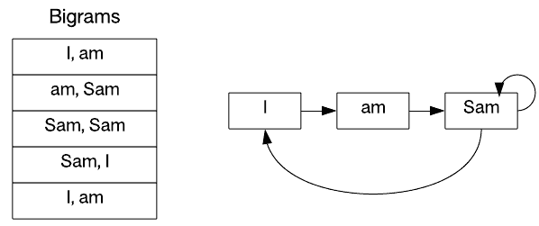

# 文本分析

> 原文：[`developer.ibm.com/zh/tutorials/ba-intro-data-science-3/`](https://developer.ibm.com/zh/tutorials/ba-intro-data-science-3/)

数据科学在数值领域中很常见，但这个不断壮大的领域现在也可以应用于非数值数据，比如文本。本教程将探索一些理解文本数据的关键算法，包括基本文本分析、马尔可夫链和情感分析。

数据科学简介，第 1 部分：”[数据、结构和数据科学管道](https://www.ibm.com/developerworks/cn/analytics/library/ba-intro-data-science-1/) ”探索了各种类型的数据，并展示了如何从中提取价值。但是，不是所有数据都是结构化的，并具有容易处理的格式。一些数据（比如文本）是非结构化的，需要采用不同的机制来提取洞察。 *文本分析* 或 *文本数据挖掘* 是采用各种方法从文本中获取信息的过程。本教程将探索一些基本技术，分析使用 [Natural Language Toolkit](https://www.nltk.org/) (NLTK) 的更高级方法。

## 安装 NLTK

要使用 NLTK，需要安装 Python V2.7、3.4 或 3.5。安装其中一种 Python 版本后，请执行清单 1 中的步骤来安装 NLTK。这些指令使用了 Python 包管理器 `pip` 。

##### 安装 NLTK

```
$ sudo pip install -U nltk
$ sudo pip install –U requests 
```

要验证是否已正确安装 NLTK，可以尝试通过 Python 交互式地导入 NLTK，如下所示。如果导入失败，则会出现安装问题。

##### 测试安装

```
$ python
Python 2.7.12+ (default, Sep 17 2016, 12:08:02)
[GCC 6.2.0 20160914] on linux2
Type "help", "copyright", "credits" or "license" for more information.
>>> import nltk
>>> import requests
>>> 
```

安装 NLTK 后，现在可以跟着接下来 3 节中的示例进行操作了。可以 [在 GitHub 上找到这些示例](https://github.com/mtimjones/textanalytics/) 。

## 基本文本分析

NLTK 提供了一系列功能，但所有功能都需要摄入文本来执行任何类型的分析。让我们先来看看文本摄入和一些简单分析。

清单 3 提供了一个摄入样本语料库并采用句子和单词两种形式将其标记化的简单示例。我使用 Python 请求库从来自 [Project Gutenberg](https://www.gutenberg.org/) 的查尔斯·达尔文的 *物种起源 (On the Origin of Species)* 中读取文本。然后对文本回复应用两个分词器（分词器基于边界将字符串分解为子字符串）。在第一个示例中，我使用 `sent_tokenize` 将文本分解为各个句子（使用句点或句号 [`.`] 作为边界）。在第二个示例中，我使用 `word_tokenize` 将文本分解为各个单词（基于空格和标点）。句子和单词列表的长度与一个随机句子和单词一起呈现出来（作为总大小的函数）。

##### 对一个样本语料库执行标记化 (tokens.py)

```
import nltk
import requests
import random
from nltk.tokenize import sent_tokenize
from nltk.tokenize import word_tokenize

# Read the "Origin of Species"
r = requests.get("http://www.gutenberg.org/cache/epub/1228/pg1228.txt");

# Tokenize sentences from the text
sent = sent_tokenize( r.text )

print len( sent )
print sent[random.randint(0,len(sent))]

# Tokenize words from the text
words = word_tokenize( r.text )

print len( words )
print words[ random.randint(0,len(words)) ] 
```

上面的 Python 脚本的输出如下所示。可以看到，样本文本由 4,901 个句子和 179,661 个单词组成。

##### 来自清单 3 的标记化脚本的输出

```
$ python tokens.py
4901
But there is no obvious reason why, for instance, the wing of a bat, or
the fin of a porpoise, should not have been sketched out with all the
parts in proper proportion, as soon as any structure became visible in
the embryo.
179661
the 
```

标记化通常是处理文本集合的第一步。在下一个示例中，我将介绍 NLTK 中识别语料库中最常见单词和符号的内置功能。NLTK 包含一个名为 `FreqDist` 的频率分布类，可以识别在文本中找到的每个标记（单词或标点）的频率。这些标记被存储为元组，其中包含单词及其在文本中出现的次数。在这个示例中，我使用了 NTLK 内的文本（ `text7` 指的是 The Wall Street Journal 语料库）。我调用 `most_common` 函数来将输出的元组限制为前 8 个，然后输出这个集合。清单 5 给出了相关代码。

##### 找到最常见的单词和符号 (most_common.py)

```
import nltk
import requests
from nltk import FreqDist
from nltk.book import *

fd = FreqDist(text7)

mc = fd.most_common(5)

print mc 
```

清单 5 的输出如清单 6 所示。从这里，可以看到样本文本被导入到了 Python 中；最后两行表示最常见标记的输出。毫不奇怪，像逗号 (`,`) 和句点这样的标点在列表中位于靠前的位置，定冠词 *the* 也是如此。

##### 来自清单 5 的 most_common.py 脚本的输出

```
$ python most_common.py
*** Introductory Examples for the NLTK Book ***
Loading text1, ..., text9 and sent1, ..., sent9
Type the name of the text or sentence to view it.
Type: 'texts()' or 'sents()' to list the materials.
text1: Moby Dick by Herman Melville 1851
text2: Sense and Sensibility by Jane Austen 1811
text3: The Book of Genesis
text4: Inaugural Address Corpus
text5: Chat Corpus
text6: Monty Python and the Holy Grail
text7: Wall Street Journal
text8: Personals Corpus
text9: The Man Who Was Thursday by G .K .Chesterton 1908
[(u',', 4885), (u'the', 4045), (u'.', 3828), (u'of', 2319), (u'to', 2164),
 (u'a', 1878), (u'in', 1572), (u'and', 1511)] 
```

在最后一个基本分析示例中，让我们来看看标签。NLTK 包含词性标签器，使您能够将句子划分到它的词类中（名词、动词等）。此特性通过将语言分解为各个构成部分，形成了自然语言处理的基础。 可以使用此功能来开发问答应用程序，并执行情感分析。

清单 7 提供了一个使用 NLTK 的 POS 标签器的简单脚本。我从 Project Gutenberg 读取 *物种起源* 并随机挑选一个句子。该句子被标记化为不同单词，然后通过调用 `pos_tag` 来添加标签。该脚本输出了以下结果，该结果表示一组元组（单词、标签）。

##### POS 标签示例

```
import nltk
import requests
import random
from nltk.tokenize import sent_tokenize
from nltk.tokenize import word_tokenize
from nltk import pos_tag

# Read the "Origin of Species"
r = requests.get("http://www.gutenberg.org/cache/epub/1228/pg1228.txt");

# Tokenize sentences from the text
sents = sent_tokenize( r.text )

sent = sents[ random.randint(0,len(sents)) ]

print sent

words = word_tokenize( sent )

tagged = pos_tag( words )

print tagged 
```

清单 8 提供了 POS 标签示例的输出。首先呈现的是未添加标签的句子，然后是单词/标签元组集合。请注意，标签可能是多种多样的，但在此示例中，它们是人称代词 (PRP)、过去时态动词 (VBD)、介词或连词 (IN)、限定词 (DT)、副词 (RB)、形容词 (JJ)、常用名词复数 (NNS) 和专有名词单数 (NNP)。可以通过调用 `nltk.help.upenn_tagset()` 来查看 NLTK 中的完整标签集合。

##### 来自清单 7 的标签脚本的输出

```
$ python tagging.py
He experimentised on some of the very same species as did Gartner.
[(u'He', 'PRP'), (u'experimentised', 'VBD'), (u'on', 'IN'), (u'some', 'DT'),
 (u'of', 'IN'), (u'the', 'DT'), (u'very', 'RB'), (u'same', 'JJ'),
 (u'species', 'NNS'), (u'as', 'IN'), (u'did', 'VBD'), (u'Gartner', 'NNP'),
 (u'.', '.')] 
```

接下来，我将深入研究两个更复杂的示例和它们的应用：马尔可夫链和情感分析。

## 马尔可夫链

*马尔可夫链* 是一个随机模型，用于描述事件的序列，其中某个给定事件的发生概率取决于前一个事件的状态。换言之，对于一个给定状态，可以根据当前状态来预测未来状态。这听起来很简单，但在各种各样的应用中特别有用，包括语音识别、强化学习、预测、DNA 测序和压缩。

一种马尔可夫模型称为 *N 连词* ，它指的是一个符号序列（比如一句话中的单词）。一种简单的 *N* 连词是 *双连词* ，这是一个大小为 2 的 *N* 连词。如果双连词指的是一对相邻符号，那么 *三连词* 指的就是 3 个相邻符号。让我们看看双连词有多有用。

考虑样本句子”I am Sam, Sam I am.”从这句话（忽略标点），可以生成 5 个双连词，一个双连词从一个单词开始并包含下一个单词。第一个单词可以视为当前状态；第二个单词表示预测的下一个状态（参见下图）。

##### 双连词列表和图表样本



所以，如果您从一个随机单词开始，根据某个概率来选择下一个单词（在本例中， *Sam* 后面出现它本身的概率为 P(0.5)，出现 *I* 的概率为 P(0.5)），您可以按样本语料库的样式构造随机句子。从 *am* 开始并限制到 3 个单词，您可以生成 `{'am', 'Sam', 'Sam'}` 或 `{'am', 'Sam', 'I'}` 。这并不仅仅是有趣，但是现在要考虑从一整本书中生成双连词。最终，您会获得数千个双连词，而且还能生成更合理的句子。清单 9 展示了两个使用来自 *物种起源* 的双连词构造的样本句子（通过清单 10 中的 Python 脚本生成）。

##### 从 *物种起源* 生成的句子

```
$ python markov.py
[ u'I', u'need', u'not', u'support', u'my', u'theory', u'.']
$ python markov.py
[u'I', u'think', u',', u'becoming', u'a', u'valid', u'argument', u'against', u'the', u'breeds', u'of', u'pigeons', u'.'] 
```

我将把清单 10 中的 markov.py 脚本拆分为 3 部分。第一部分是 `CreateTuples` 函数，它接受一些单词并将它们分解为元组（或双连词）。这些双连词被添加到一个集合中并返回。

第 2 部分是句子生成器，它接受一种条件频率分布（即由单词以及后跟原始单词及其计数的单词组成的列表）。我从一个初始单词开始（在本例中为 *I* ）并创建我的句子。然后,我将迭代 CFD 来生成下一个单词，直到该单词是一个句点（表示句子结束）。我迭代目标单词后的单词分布，并随机挑选一个单词。这个单词被附加到我的句子后面，而且所选单词变成了目标单词（我再次开始这一过程，以查找后续单词）。然后呈现所构造的句子。

在第 3 部分中，我将处理我的设置。我从 Project Gutenberg 网站读取 *物种起源* ，将文本标记化为一个单词数组，然后将这个数组传递给 `CreateTuples` 来生成我的双连词。我使用 NLTK 的 `nltk.ConditionalFreqDist` 来构造 CFD，然后将此 CFD 传递给 `EmitSentence` ，以便使用已生成的双连词作为概率性引导来生成一个随机句子。从语料库生成的一些句子富有启发性，但是许多可能很长且毫无意义。将我的示例从双连词扩展到三连词，会增加获得有意义句子的几率。

##### 使用 NLTK 和双连词来构造句子 (markov.py)

```
import nltk
import requests
import random
from nltk.tokenize import word_tokenize

def CreateTuples( words ):
   tuples = []

   for i in range( len(words)-1 ):
      tuples.append( (words[i], words[i+1]) )

   return tuples

# Iterate the bigrams and construct a sentence until a '.' is encountered.
def EmitSentence( cfdist ):
   word = u'I'
   sentence = []
   sentence.append(word)

   while word != '.':
      options = []
      for gram in cfdist[word]:
         for result in range(cfdist[word][gram]):
            options.append(gram)

      word = options[int((len(options))*random.random())]
      sentence.append( word )

   print sentence

# Read the "Origin of Species"
r = requests.get("http://www.gutenberg.org/cache/epub/1228/pg1228.txt");

# Tokenize words from the text
tokens = word_tokenize( r.text )

# Create the bigram word tuples
tuples = CreateTuples( tokens )

# Create a conditional frequency distribution based upon the tuples
cfdist = nltk.ConditionalFreqDist( tuples )

# Emit a random sentence based upon the corpus
EmitSentence( cfdist ) 
```

此方法很有用处。在字母级别上，您可以识别单词拼写错误并进行更正。也可以使用双连词或三连词来识别给定作品、给定隐藏签名的文本的作者（单词选择、频率、构造）。

## 情感分析

在最后一个示例中，我将介绍情感分析领域。 *情感分析* 或 *观点挖掘* 是通过计算来识别作者对某段文本的态度是积极、消极还是中性的过程。此反馈可能很有用，比如在自然语言评论中挖掘对某款产品或服务的观点时。

NTLK 包含一个简单的基于规则的情感分析模型，其中组合了词汇特征来识别情感强度。它的使用也很简单。清单 11 给出了使用 NLTK 情感分析器的样本脚本。我导入必要模块（包括 [Vader 情感分析器](http://comp.social.gatech.edu/papers/icwsm14.vader.hutto.pdf) ），创建一个函数来接受某个句子并呈现情感分类。该函数首先对 `SentimentIntensityAnalyzer` 执行实例化，然后使用传递的句子来调用 `polarity_scores` 方法。结果是一组浮点值，表示输入文本的正或负价态。这些浮点值是为 4 个类别（正、中性、负和表示一个聚合分数的化合态）而发出的。该脚本最后调用传递的参数来识别情感。

##### 使用 NLTK 执行情感分析 (sentiment.py)

```
import nltk
from nltk.sentiment.vader import SentimentIntensityAnalyzer
import sys

def IdentifySentiment( sentence ):

   sia = SentimentIntensityAnalyzer()
   ps = sia.polarity_scores( sentence )

   for i in ps:
      print('{0}: {1}, '.format(i, ps[i]))

IdentifySentiment( sys.argv[1] ) 
```

现在来看看如何将 NLTK 的情感分析器用于一组句子。清单 12 提供了与清单 11 中的脚本的一些交互，以及来自情感分析器的输出。第一个句子显然是积极的，第二个句子显然是消极的。两个示例都已正确分类。但是第三个示例演示了分析讽刺语言时可能存在问题（尽管它同时对句子的积极和消极组成部分进行了分类）。

##### 来自清单 11 中的情感分析器脚本的样本输出

```
$ python sentiment.py "The meat was wonderfully seasoned and prepared."
neg: 0.0,
neu: 0.463,
pos: 0.537,
compound: 0.7003,
$ python sentiment.py "The stench in the air was something to behold."
neg: 0.292,
neu: 0.708,
pos: 0.0,
compound: -0.5106,
$ python sentiment.py "I love how you don't care how you come across."
neg: 0.19,
neu: 0.506,
pos: 0.304,
compound: 0.3761, 
```

情感分析有许多应用，而且考虑到在线内容（博客、推文和其他信息）的不断增加，该方法可成功用于挖掘实时反馈中的观点。

## 结束语

在机器学习上下文中可能很难使用非结构化数据。结合这种情况以及文本在自然条件下的优势（在线文本内容），很容易了解文本为什么是数据挖掘的新的前沿领域。使用 Python 和 NLTK，很容易了解如何使用简单脚本执行文本分析。本系列的最后一篇教程分析了数据科学的语言，包括用于数值和文本理解的语言。

本文翻译自：[Text analytics](https://developer.ibm.com/tutorials/ba-intro-data-science-3/)（2018-04-18）