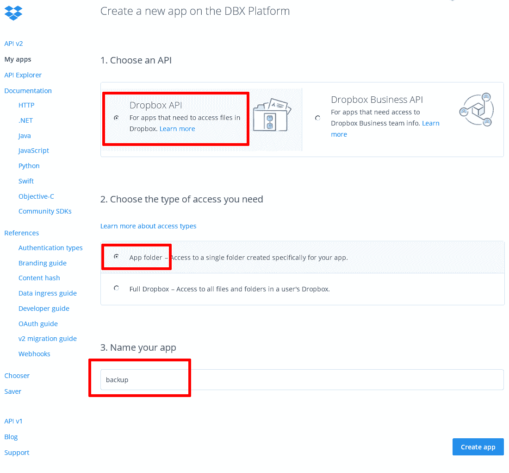
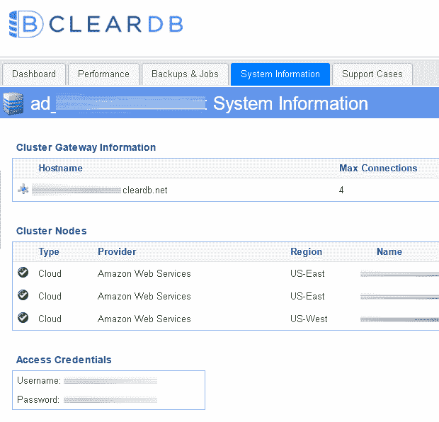
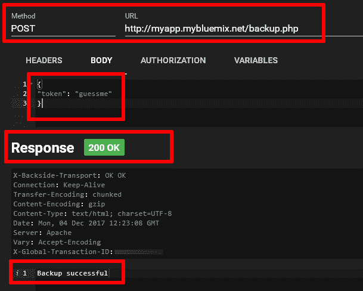
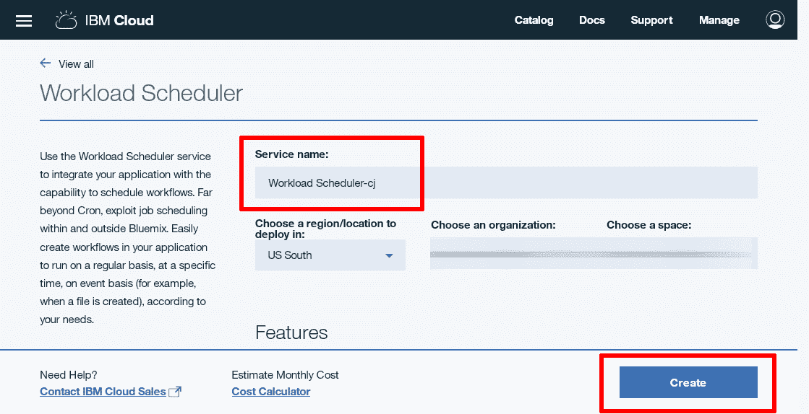
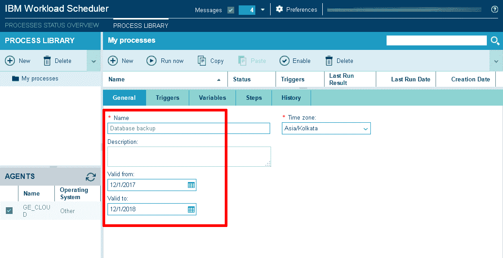
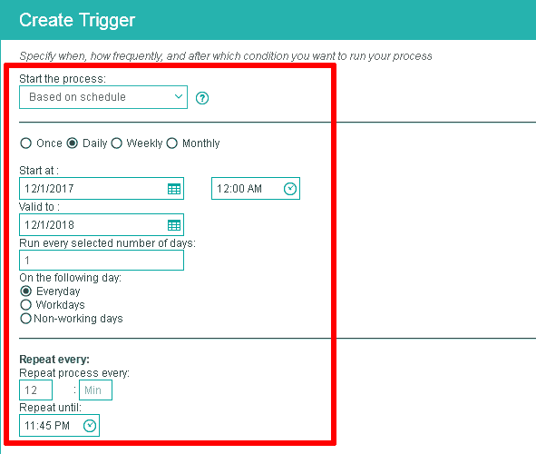
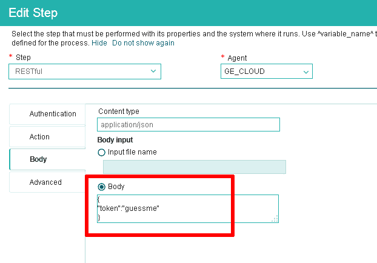

# 在 IBM Cloud 上自动安排数据备份

> 原文：[`developer.ibm.com/zh/tutorials/cl-cloud-backups-workload-scheduler-php/`](https://developer.ibm.com/zh/tutorials/cl-cloud-backups-workload-scheduler-php/)

使用 IBM Cloud 时，经常遇见的一个问题是“如何在 IBM Cloud 上安排任务？”使用 IBM 裸机服务器时，答案很简单：使用 cron 或一个类似的调度程序。但在使用 IBM Cloud 平台即服务 (PaaS) 时，答案稍微复杂一点。

IBM Cloud PaaS 没有类似 cron 的系统调度程序。它提供了 Workload Scheduler 服务，这是一个可以连接到您的 IBM Cloud 应用程序的特殊服务实例。此服务实例允许您自定义流程，这些流程按预先确定的时间表运行，并且能与其他各种工具集成，比如 Cloudant、MQTT、Hadoop 和 OpenWhisk。

在本教程中，我将通过一个真实示例介绍 Workload Scheduler 服务：保存应用程序数据库的每日备份。通过完成这个示例，您将了解所涉及的步骤，并能调整它们，使其适合您自己的进程调度用例。

[在 GitHub 上获取样本代码](https://github.com/vvaswani/bluemix-backup)

## 您需要做的准备工作

对于执行大量活动的应用程序，维护应用程序数据的定期备份很重要。在大多数情况下，这类数据被存储在一个数据库中，但它们也有可能采用文件资产或活动日志的形式。根据生成的数据量，可能需要每小时、每天、每周或按自定义时间间隔进行备份。

在本示例中，我假设应用程序的数据被存储在一个 MySQL 数据库中，而且此数据需要每天备份（作为一个 SQL 文件）。为了安全起见，备份应该与应用程序本身分开存储。本示例使用 Dropbox 作为备份存储区，但您可以使用任何存储服务，包括 IBM Cloud 自己的 Object Storage 服务。

本示例使用了 Workload Scheduler 服务的 REST 集成，通过在指定时间调用指定的 URL 端点来执行备份。这个 URL 端点是一个 PHP 脚本，它在内部执行以下操作：

*   对 REST 请求进行身份验证
*   连接到应用程序数据库
*   将数据库内容导出为 SQL 文件
*   将 SQL 文件传输到 Dropbox
*   使用 SendGrid 向应用程序管理员发送一封通知电子邮件

**免费试用 IBM Cloud**

利用 [IBM Cloud Lite](https://cloud.ibm.com/registration?cm_sp=ibmdev-_-developer-tutorials-_-cloudreg) 快速轻松地构建您的下一个应用程序。您的免费帐户从不过期，而且您会获得 256 MB 的 Cloud Foundry 运行时内存和包含 Kubernetes 集群的 2 GB 存储空间。

在开始之前，请确保您完成了需要做的所有准备工作：

*   一个 [IBM Cloud 帐户](https://cloud.ibm.com/?cm_sp=ibmdev-_-developer-tutorials-_-cloudreg)
*   一个 [SendGrid 帐户](https://sendgrid.com/)
*   一个 Dropbox 帐户
*   基本熟悉 [PHP](http://www.php.net/) 和 [MySQL](https://mysql.com/)
*   一个本地开发环境或使用 [Apache](http://httpd.apache.org/) 的托管 PHP 开发环境
*   [Composer](https://getcomposer.org/)（PHP 依赖项管理器）
*   [CloudFoundry 命令行工具](https://github.com/cloudfoundry/cli)
*   一个文本编辑器或

**备注：**任何使用 Dropbox 和 SendGrid 服务的应用程序都必须分别遵守 [Dropbox](https://www.dropbox.com/privacy#terms) 和 [SendGrid](https://sendgrid.com/policies/tos/) 服务条款。类似地，任何使用 IBM Cloud Platform 的应用程序都必须遵守 IBM Cloud 的使用条款。开始实施您的项目之前，花几分钟阅读一下这些要求，确保您的应用程序满足这些要求。

> 本教程仅介绍一个可能遇到的示例。您可以使用这里列出的流程来执行其他计划任务，比如发送每日活动摘要，清理不想要的文件，对日志进行归档等。

## 第 1 步.安装依赖项

要执行其任务，PHP 脚本需要使用以下依赖项：

*   MySQLDump-PHP 客户端，用于以 SQL 格式导出 MySQL 数据库
*   用于存储备份文件的 Dropbox API
*   用于发送电子邮件通知的 SendGrid API

*   第一步是获取 PHP 脚本的所有依赖项，包括 MySQLDump-PHP 客户端、Dropbox PHP 客户端和 SendGrid PHP 客户端。这些依赖项可以使用 Composer（PHP 依赖项管理器）轻松下载和安装。使用下面这个 Composer 配置文件，将该文件保存到 *$APP_ROOT*/composer.json。（*$APP_ROOT* 指的是您的项目目录。）

    ```
    {
        "require": {
            "ifsnop/mysqldump-php": "2.*",
            "sendgrid/sendgrid": "6.*",
            "kunalvarma05/dropbox-php-sdk": "0.2.1"
        }
    } 
    ```

*   使用 Composer 通过以下命令进行安装：

    ```
    shell> php composer.phar install 
    ```

*   通过 Composer 下载必要的组件后，为所有可通过 Web 访问的文件创建目录 *$APP_ROOT*/public，为临时存储创建 *$APP_ROOT*/data，其中 *$APP_ROOT* 是应用程序目录。

    ```
    shell> cd myapp
    shell> mkdir public data 
    ```

*   接下来，使用以下信息创建 *$APP_ROOT*/config.php 文件（将在后续步骤中填写占位符）。

    ```
    <?php
    $config = [
      'settings' => [
        'db' => [
          'name' => 'DATABASE-NAME',
          'hostname' => 'DATABASE-HOST',
          'username' => 'DATABASE-USERNAME',
          'password' => 'DATABASE-PASSWORD',
        ],
        'dropbox' => [
          'app-key' => 'DROPBOX-APP-KEY',
          'app-secret' => 'DROPBOX-APP-SECRET',
          'app-token' => 'DROPBOX-APP-TOKEN',
          'app-folder' => 'DROPBOX-APP-FOLDER',
        ],
        'sendgrid' => [
          'key' => 'SENDGRID-API-KEY',
          'to' => 'RECIPIENT-EMAIL-ADDRESS'
        ],
        'token' => 'guessme',
      ]
    ]; 
    ```

## 第 2 步.获取一个 Dropbox 访问令牌

为了将文件上传到 Dropbox，该 PHP 脚本需要使用来自上一步的 Dropbox API PHP 客户端。这个客户端需要 3 个关键信息：一个 Dropbox 应用程序密钥、Dropbox 应用程序密码和一个应用程序令牌。此信息可从 Dropbox Web 仪表板获得。首先：

1.  登录到 Dropbox 开发人员仪表板，单击 **Create app** 创建一个新应用程序。
2.  选择 **Dropbox API**，将访问类型设置为 **App folder**，并为您的应用程序输入一个名称，如下所示。单击 **Create app** 创建新应用程序。

    

3.  创建 Dropbox 应用程序后，您会被重定向到应用程序设置页面。此页面显示应用程序密钥和密码。记下这些值以及应用程序文件夹名称，将它们输入到来自第 1 步的配置文件中。
4.  一般情况下，每次访问 Dropbox API 都必须经历一个 OAuth 授权过程。但是，在本例中，因为将由您自己的值得信赖的 PHP 脚本访问您在 Dropbox API 中的帐户，所以您可以绕过正常的授权流程，方法是创建一个访问令牌并在 PHP 脚本向 Dropbox API 发出的每个请求中使用它。为此，从应用程序设置页面生成一个访问令牌，并将它输入到来自第 1 步的配置文件中。

**重要事项**：不要与任何人共享 Dropbox 访问令牌和应用程序秘密密钥。

## 第 3 步.获取一个 SendGrid API 密钥

要发送电子邮件通知，PHP 脚本需要使用 SendGrid API。SendGrid 提供了一个用于实现此目标的 PHP SDK。要使用它，必须先获得一个 SendGrid API 密钥。

1.  登录到您的 SendGrid 帐户并浏览到 **Settings > API Keys** 菜单。单击 **Create API Key**。
2.  为该 API 密钥输入一个名称，并选择 **Full access** 选项。单击 **Create & View** 生成该密钥。
3.  记下该 API 密钥（它仅会显示一次），将它输入到来自第 1 步的配置文件中。这是在同一配置文件中为状态通知指定收件人电子邮箱地址的好时机。

## 第 4 步.创建 REST 服务端点

现在，您已准备好开始构建将用作 REST 服务并执行备份的 PHP 脚本了。使用下面的代码，这些代码应保存到 *$APP_ROOT*/public/backup.php 中。

```
<?php
// load classes
require '../vendor/autoload.php';

// load configuration
require '../config.php';

use Ifsnop\Mysqldump as Mysqldump;
use Kunnu\Dropbox\DropboxApp;
use Kunnu\Dropbox\Dropbox;
use Kunnu\Dropbox\DropboxFile;

try {

  // look for token in POST data
  // reject request if not found or mismatch
  $json = file_get_contents('php://input');
  $obj = json_decode($json);

  if (isset($obj->token) && ($obj->token == $config['settings']['token'])) {

    // initialize MySQL client
    // connect to database and dump contents to file
    $dump = new Mysqldump\Mysqldump(
      'mysql:host=' .$config['settings']['db']['hostname'] .
      ';dbname=' .$config['settings']['db']['name'],
      $config['settings']['db']['username'],
      $config['settings']['db']['password']
    );
    $filename = '../data/' .$config['settings']['db']['name'] .'-' .
      date('Y-m-d-h-i-s', time()) .'.sql';
    $dump->start($filename);

    // initialize Dropbox client
    $app = new DropboxApp(
      $config['settings']['dropbox']['app-key'],
      $config['settings']['dropbox']['app-secret'],
      $config['settings']['dropbox']['app-token']
    );
    $dropbox = new Dropbox($app);
    $dropboxFile = new DropboxFile($filename);
    $uploadedFile = $dropbox->upload($dropboxFile, "/" .
      basename($filename));
    unlink($filename);

    // initialize SendGrid client
    $sg = new \SendGrid($config['settings']['sendgrid']['key']);
    $from = new SendGrid\Email(null, "no-reply@example.com");
    $subject = "Database backup notification";
    $to = new SendGrid\Email(null, $config['settings']['sendgrid']['to']);
    $content = new SendGrid\Content(
      "text/plain",
      "Your database backup was successful.Your backup filename is: " .
      basename($filename));
    $mail = new SendGrid\Mail($from, $subject, $to, $content);
    $response = $sg->client->mail()->send()->post($mail);
    if ($response->statusCode() != 200 &&
      $response->statusCode() != 202) {
      throw new \Exception('SendGrid failure, response code ' .
        $response->statusCode()
      );
    }

    http_response_code(200);
    echo 'Backup successful';

  } else {
    throw new Exception ('Invalid authentication token');
  }
} catch (\Exception $e) {
    http_response_code(500);
    echo $e->getMessage();
}

exit; 
```

此脚本执行了大量操作，让我们逐步分析一下：

1.  此脚本首先加载 Composer 自动加载器，该加载器负责加载所有必要的依赖项和配置文件。
2.  接下来，它查找传入的 JSON 格式的 `POST` 请求。如果找到一个请求，则在该请求中查找 `“token”` 密钥。将提供的令牌与配置文件中指定的令牌进行匹配。仅在令牌匹配时，才能进一步处理该请求。这提供了一个最简单的安全层，并确保仅接受有效的请求。
3.  如果遇到有效请求，该脚本会初始化 MySQLDump-PHP 客户端，并使用已配置的凭证连接到目标数据库。然后，使用该客户端的 `start()` 方法，将目标数据库的内容导出到一个 SQL 文件，该文件（临时）存储在 data/ 目录中。
4.  然后，该脚本使用来自第 2 步的 Dropbox 身份验证凭证，对 Dropbox PHP API 客户端进行初始化。使用该客户端的 `upload()` 方法将 SQL 文件从 data/ 目录转移到 Dropbox 上的应用程序文件夹。然后删除临时文件。
5.  最后，该脚本使用来自第 3 步的 SendGrid API 密钥对 SendGrid PHP 客户端执行初始化。它通过指定发件人地址、收件人地址（从配置文件获取）、主题和正文，创建了一个新的 SendGrid/Mail 对象。正文包括一条状态消息和 Dropbox 上生成的 SQL 文件的文件名。然后，使用该客户端的 `post()` 方法，通过 SendGrid 的服务器传输消息。
6.  该脚本以一个 `200`（正常）或 `500`（错误）HTTP 响应代码终止。

## 第 5 步.配置数据库凭证和令牌

要连接到目标 MySQL 数据库，PHP 脚本需要数据库主机名、用户名、密码和数据库名称。您有两个选择来指定这些值：

*   可以在第 1 步创建的应用程序配置文件中将它们指定为静态值。如果使用此方法，可继续将这些值添加到配置文件。请记住，您可以从 IBM Cloud 仪表板或第三方仪表板中的数据库实例的 Credentials 页面获取必要的凭证。

    

*   此外，您还可以通过将相应的数据库服务连接到该应用程序，从 IBM Cloud 环境导入所需的值。如果使用此方法，可将以下行添加到第 4 步的 PHP 脚本中，放在 `try` 代码块之前（根据您连接到的服务，您可能需要使用不同的 JSON 密钥；本示例使用了 ClearDB）。

```
<?php
// if IBM Cloud VCAP_SERVICES environment available
// overwrite local credentials with IBM Cloud credentials
if ($services = getenv("VCAP_SERVICES")) {
  $services_json = json_decode($services, true);
  $config['settings']['db']['hostname'] = $services_json['cleardb'][0]['credentials']['hostname'];
  $config['settings']['db']['username'] = $services_json['cleardb'][0]['credentials']['username'];
  $config['settings']['db']['password'] = $services_json['cleardb'][0]['credentials']['password'];
  $config['settings']['db']['name'] = $services_json['cleardb'][0]['credentials']['name'];
} 
```

默认情况下，第 2 步中创建的配置文件包含一个简单的身份验证令牌。这个令牌用于验证传入的 `POST` 请求。在部署该脚本之前，您应该将此令牌更新为只有您知道的一个不同值。

## 第 6 步.部署到 IBM Cloud

可以将执行备份的 PHP 脚本作为一个独立应用程序或另一个应用程序的一部分来部署到 IBM Cloud。只要可以通过公有 URL 访问它，Workload Scheduler 服务就能调用它。这为您提供了两个主要的部署选项：

*   可以将此脚本部署为一个独立应用程序，用于备份单个应用程序数据库。这是本节剩余部分采用的部署选项。
*   可以将此备份脚本捆绑为较大应用程序的一部分。在这种情况下，可以将来自第 4 步的备份脚本迁移到应用程序的公开目录，并像往常一样重新部署该应用程序。

请注意，在两种选项中，都可以将数据库实例连接到您的应用程序，并直接从 IBM Cloud 环境读取密钥变量（比如数据库凭证），而不使用配置文件。请参阅第 5 步了解关于操作方法的细节。

1.  首先，创建应用程序清单文件，记得通过附加一个随机字符串（比如您姓名的首字母）来使用唯一的主机和应用程序名称。

    ```
    ---
    applications:
    - name: myapp-[initials]
    memory: 256M
    instances: 1
    host: myapp-[initials]
    buildpack: https://github.com/cloudfoundry/php-buildpack.git
    stack: cflinuxfs2 
    ```

2.  配置该 buildpack 来使用该应用程序的 public/ 目录作为 Web 服务器目录。创建一个包含以下内容的 *$APP_ROOT*/.bp-config/options.json 文件：

    ```
    {
        "WEB_SERVER": "httpd",
        "WEBDIR": "public",
        "PHP_VERSION": "{PHP_70_LATEST}"
    } 
    ```

3.  加载 MySQLDump-PHP 客户端所需的 PDO 和 MySQL PHP 扩展。创建一个包含以下内容的 *$APP_ROOT*/.bp-config/php/php.ini.d/php.ini 文件：

    ```
    extension=mysqli.so
    extension=mbstring.so
    extension=pdo.so
    extension=pdo_mysql.so 
    ```

4.  将该应用程序推送到 IBM Cloud：

    ```
    shell> cf api https://api.ng.bluemix.net
    shell> cf login
    shell> cf push 
    ```

5.  如果您计划直接从 IBM Cloud 环境读取目标数据库的凭证，而且已按第 5 步所示对 PHP 脚本执行了必要更改，那么您可以将该数据库服务实例绑定到您的应用程序。记得对该服务实例使用正确的 ID，以确保将正确的实例绑定到该应用程序。可以从 IBM Cloud 仪表板的服务实例页面中获取服务 ID。

    ```
    shell> cf bind-service myapp-[initials] "[database-service-id]" 
    ```

6.  重新载入该应用程序以让更改生效：

    ```
    shell> cf restage myapp-[initials] 
    ```

7.  备份脚本现在应可通过公有 URL [http://myapp-_[initials]_.mybluemix.net/backup.php](http://myapp-_[initials]_.mybluemix.net/backup.php) 进行访问。（如果您将该脚本用作较大应用程序的一部分，这个公有 URL 将有所不同。）继续执行下一步之前，使用诸如 [Postman](https://www.getpostman.com/) 或 [RESTer](https://addons.mozilla.org/en-US/firefox/addon/rester/) 之类的工具，向上面的 URL 发送一条 `POST` 请求来测试该脚本。在 `POST` 请求中包含一个 JSON 文档，其中含有第 5 步中定义的令牌，如下所示：

    ```
    {
    "token": "guessme"
    } 
    ```

如果一切正常，该 PHP 脚本会执行备份，并以 HTTP `200` 成功代码作为响应。如果发生错误，响应将是 HTTP `500` 错误代码，而且响应输出将包含对错误的描述。



如果成功备份，您应该能够在您的 Dropbox 应用程序文件夹中看到 SQL 文件。如果发生错误，可以使用“调试 IBM Cloud 上的 PHP 错误”来调试该脚本（参见下面的“相关主题”）。

## 第 7 步.配置 Workload Scheduler 服务

现在您已能通过 `POST` 请求来手动触发备份，只剩下对该过程执行自动化了：

1.  登录到 IBM Cloud 仪表板并单击 **Create resource**。在 Application Services 部分，使用 Standard 计划找到并创建一个新的 Workload Scheduler 实例。

    

2.  单击服务细节页面上的 **Launch** 来启动该服务实例。接受条款和条件，并继续操作。
3.  选择左侧的 **My processes** 文件夹并单击 **New** 来创建一个新流程。按如下方式定义这个新流程：

    1.  在 General 选项卡中，为该流程输入一个名称并指定它的有效期。

        

    2.  在 Triggers 选项卡上，单击 **New** 并为该流程定义一个计划，方法是指定频率（一次、每日、每周或每月）、开始和结束日期、开始时间，以及重复间隔。

        

    3.  在 Steps 选项卡上，单击 **New** 并定义一个新的 RESTful 步骤。在 Action 部分，输入 PHP 脚本的公有 URL，并将方法指定为 `POST`。在 Body 部分，将请求内容类型指定为“application/json”，并创建一个包含令牌作为正文内容的 JSON 文档。

        

4.  单击 **OK** 保存更改，然后单击 **Enable** 在流程库中启用该流程。

Workload Scheduler 现在应按定义的时间表运行该流程，而且每次都会调用 REST 端点并创建数据库的全新备份。可使用该流程的 History 选项卡来监控流程的执行。

## 结束语

本教程的目的是解释如何在 IBM Cloud 上安排任务。我考虑了一个常见用例（对应用程序数据执行定期备份），并描述了如何通过一个 IBM Cloud Workload Scheduler 实例以及可通过 REST 访问的 PHP 脚本来实现此目标。我使用了两个外部服务（用于存储文件的 Dropbox 和用于传送通知的 SendGrid）来演示如何使用 Workload Scheduler，以便利用 IBM Cloud 服务和第三方服务，按循环执行的时间表来执行任务。

显然，本教程仅介绍了一个可能遇到的示例。您可以使用这里列出的流程来执行其他计划任务，比如发送每日活动摘要，清理不想要的文件，对日志进行归档等。可以在 GitHub 上获取这里使用的 PHP 脚本，将此脚本作为起点。试用该脚本，然后开始修改它来满足您的特定需求。编码愉快！

本文翻译自：[Schedule data backups automatically on IBM Cloud](https://developer.ibm.com/tutorials/cl-cloud-backups-workload-scheduler-php/)（2018-02-20）