# 构建一个认知 IoT 应用程序仅需 7 步

> 原文：[`developer.ibm.com/zh/tutorials/iot-cognitive-iot-app-machine-learning/`](https://developer.ibm.com/zh/tutorials/iot-cognitive-iot-app-machine-learning/)

***注：**IBM Data Science Experience（DSX）目前是 IBM Watson Studio。虽然名称已经更改，一些图像可能显示先前的名称，但本教程中的步骤和过程仍然有效。*

是什么使得认知 IoT 具有认知能力？如何实现认知 IoT？一些人可能简单地认为认知就是让您与事物之间的交互更加人性化。例如，在电梯中，您可能会根据您的社交媒体心理概况来收听最新新闻。或者，如果认知 IoT 检测到您有点紧张，那么它可能会让您收听一些舒缓的音乐。

在我看来，认知 IoT 更多时候都在幕后默默工作。尽管人机交互 (HCI) 是许多认知 IoT 解决方案的关键部分，但我对 HCI 的关注比较少，因为它已被转换为最先进的技术。借助在认知 IoT 应用程序幕后工作的 IBM Watson 认知 API（比如文本到语音转换 (TTS)、语音到文本转换 (STT)、机器学习和视觉识别），高级 HCI 现在只限于您的想象力。

认知 IoT 和人工智能 (AI) 只不过是高级的机器学习。高级机器学习有两个驱动因素：

*   算法（或模型），强大到能够从数据中学习任何所需行为。
*   无限的数据处理能力和存储，用于处理要训练的海量数据。

在认知 IoT 解决方案中，机器学习需要在边缘计算架构中进行。基本上讲，边缘计算意味着将计算从云或数据中心向传感器推近。计算是在靠近传感器和行动器的边缘网关上进行的（或者甚至更接近网关与传感器和执行器之间的微控制器）。我们使用边缘计算架构有两个原因，因为不是所有决策都能在云中计算：

*   **延迟**会影响一些关键决策，使云路径传输难以维持。设想一辆智能互联汽车。它能不时（即在几秒或更短的时间内）打电话回家固然不错，但是如果您前面的汽车突然刹车，您希望您的汽车能立即做出反应。
*   如果传感器创建的数据量太大了，以致于很难将所有数据都传输到云上，那么**传输成本**可能太高。将数据传输到云上从技术上讲不可行，是由于链接速度不够快，或者只是由于传输成本太高，或者二者兼具。

## 认知 IoT 架构

不要被认知 IT 应用程序的架构图中的架构图给吓住。此图列出了实现认知 IoT 所需的组件。您的解决方案可能只使用了这些组件中的一部分，这会使架构变得更简单。好消息是：如果使用 IBM Cloud 即服务，那么所有这些组件已预先安装，并为您管理了该操作。此外，这些组件基于开放标准并在开源技术上运行，所以最大限度减少了厂商锁定，从而保护了您的投资。

##### 认知 IT 应用程序的架构图

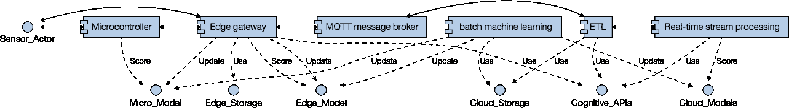

每个 IoT 解决方案的核心都是传感器和执行器。我们感知环境，做出（认知）决策，并使用行动器采取行动。

考虑计算架构中的这一演变过程。我们从孤立地思考演变为边缘思考、云思考，最终演变为边缘和云思考。边缘分析（包括机器学习）最小化了云上的数据负载，并显著缩短了延迟，降低了数据传输成本。此外，隐私得到了更好的保护，因为不是所有数据都需要发送到云，或者说可以屏蔽一些数据。

重要的是，能够在所有这些位置中无缝地、可互换地部署分析组件，在部署期间和非开发时间确定分析组件的物理位置。一些平台支持在运行时动态更改分析组件的位置。在本教程中，我们将使用 Node-RED 作为这样一个平台。

我们将使用一个非常简单的场景进行演示。假设您有一个智能花园，它使用湿度传感器来确定给植物浇水的时机。它使用一个步进电动机作为执行器，以便打开和关闭水管阀门。

### 第 1 阶段 – 孤立计算

[控制论中的滞后现象](https://en.wikipedia.org/wiki/Hysteresis#Control_systems)定义了一个与步进电动机前进方向不同的阈值。例如，如果阀门在同一湿度水平上打开和关闭，那么系统将会出现振荡，这可能导致系统过度反应。

请查看图 1 中的架构图。您需要一个传感器、一个执行器和一个微控制器。您将使用 Micro_Model 读取湿度水平阈值，以确定何时做出反应。（您或许会使用一个动态训练的磁滞来预防振荡和浇水过多。）

### 第 2 阶段 – 仅使用边缘计算

但是，如果智能花园系统自动浇灌植物后立刻开始下雨，会发生什么？除了浪费水之外，您的植物可能还会出现浇水过多现象。另外，我们能否将天气预报考虑进来？当然能。但是现在，一个微控制器已不足以解决问题，因为我们需要查询天气服务。边缘网关上的机器学习算法可以根据天气预报和湿度传感器来优化浇水操作，然后更新微控制器上的模型（请记住，我们在这里和边缘网关自身上都使用了一个磁滞）。

### 第 3 阶段 – 边缘计算和云计算

现在介绍一下架构图中的另外两个组件。第一步是将边缘网关连接到云。此连接的事实标准是使用 MQTT 和一个 MQTT 消息代理。发布/订阅模型有助于部署 n-n 连接方案。除了将数据从网关发送到队列之外，还需要一个 ETL（提取、转换、加载）组件。ETL 组件从消息总线拾取数据，并存储它和/或将它传输到某个实时处理组件。最后，批处理分析引擎会使用此数据并生成更多洞察。要完成该架构，可实时或在批处理期间调用认知 API 服务。

在我们的场景中，我们将智能花园系统链接到您的电子邮件帐户。借助 Watson 认知 API，很容易提取您的旅行计划和日程表。通过使用此信息，智能花园系统能确保在您和家人外出用餐时，您的草坪不会变湿。或者，它可以根据草坪的条件自动订购肥料或杀虫剂。这些条件可使用特殊化学传感器或网络摄像头拍摄的图像来检测。

优化系统的下一步是利用丰富的机器学习算法。对于认知 IoT 应用程序而言，最相关的机器学习算法类型是预测，包括时序预测、异常检测和优化。

## 简单 7 步构建一个认知 IoT 解决方案

理论我们已经讲得够多了。让我们使用 IBM Cloud、IBM Watson IoT 平台和 IBM Watson Studio 创建一个认知 IoT 解决方案。

我们的新场景或用例基于消费电子产品：一个智能洗衣机。假设一家设备制造商发现使用的某个特定型号的电动机在电流不稳定时损坏了。您不能期望全球的任何地方都能获得稳定的电流！

首先，制造商根据来自云的数据来检测电流异常。当 IoT 解决方案收到表明电流不稳定的数据时，它会向洗衣机发送一条关闭电动机的命令。最终，制造商会认识到延迟时间太长，而且网络连接的稳定性太差。所以，制造商决定在边缘组件上实现分析功能，为这个特定流程省去云计算环节。

## 构建您的应用程序需要做的准备工作

*   一个 IBM Cloud 帐户。（注册一个 [IBM Cloud Lite 帐户](https://cocl.us/IBM_CLOUD_GCG)，这个免费帐户永不过期。）
*   一个 Watson Studio 帐户。可以使用您在注册 IBM Cloud 帐户时创建的 IBM ID。

## 我们的用例的操作模型

如您所见，认知 IoT 应用程序的操作模型中的用例的操作模型与认知 IT 应用程序的架构图中的完整架构图有很大区别（而且简单得多）。此操作模型仅包含对我们的用例必需的组件，而且它将一般性组件名称替换为 IBM Cloud 中提供的特定组件。

##### 认知 IoT 应用程序的操作模型

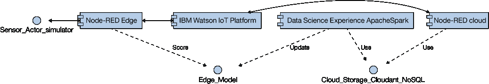

操作模型组件描述了每个组件及其在我们的用例中的作用。UML 版型 (Stereotype) 是从认知 IT 应用程序的架构图中的一般性架构图中获取的。

##### 操作模型组件

| **组件名称** | **组件类型** | **UML 版型** | **组件说明** |
| --- | --- | --- | --- |
| Node-RED Edge | Node-RED | 边缘网关 | 用于创建数据流应用程序。 Node-RED 是一个使用 JavaScript 编写的开源数据流编辑器，在 Node.js 上运行。IBM 创建了它，并将它捐赠给了 JavaScript Foundation。 |
| Sensor_Actor_simulator | Node-RED 节点 | 传感器或执行器 | 用于在缺少物理 IoT 系统的情况下模拟传感器或执行器。 |
| Watson Studio | Apache Spark 和 Jupyter notebook 即服务 | 批处理机器学习 | 用于实时检测 IoT 传感器时序流上的异常。 |
| IBM Watson IoT Platform | IBM Watson IoT Platform | MQTT 消息代理 | 充当 IoT 操作模型中所有组件之间的异步连接器。 |
| Node-RED 云 | Node-RED | ETL 和实时流处理 | 用于将 IoT 传感器数据传输到云存储。 |
| Cloud_Storage_Cloudant_NoSQL | Cloudant | Cloud_Storage | 用于存储 IoT 传感器数据。 Cloudant 是一个 Apache CouchDB 即服务。我们还可以使用 SQL 数据库或 OpenStack Swift Object Storage（这是具有最高成本效益的选项）。 |
| Edge_Model | Node-RED | Edge_Model | 包含一个简单的阈值，该值由批处理机器学习组件动态填充。 |

## 在 IBM Cloud 中创建一个 IoT 应用程序

Internet of Things Platform Starter 样板包含一个 Node-RED 引擎，稍后将使用它来处理 IoT 消息。

1.  [登录到您的 IBM Cloud 帐户。](https://cloud.ibm.com/login?cm_sp=ibmdev-_-developer-tutorials-_-cloudreg)
2.  打开此 URL 转到 IBM Cloud 目录中的 Internet of Things Platform Starter：

    [`cloud.ibm.com/catalog/starters/internet-of-things-platform-starter?taxonomyNavigation=apps?cm_sp`](https://cloud.ibm.com/catalog/starters/internet-of-things-platform-starter?taxonomyNavigation=apps&cm_sp=ibmdev-_-developer-tutorials-_-cloudreg)

3.  在 **App name** 字段中，为您的应用程序输入一个唯一名称，比如 *1234yourName*。

    

4.  单击 **Create**。
5.  从左侧菜单中，单击 **Connections**。在 **Cloudant NoSQL DB Lite** 服务中，单击 **View credentials** 并记下以下属性：用户名、密码和主机。

    

6.  等待状态变为“Running”并单击 **View app**。

    

    **备注：**您可能看到以下消息：“404 Not Found: Requested route (‘1234thisIsMyName.mybluemix.net) does not exist.”不必担心，在几分钟后再试一次即可。

## 创建一个设备模拟器来模拟设备数据

1.  单击 **Go to your Node-RED flow editor**。

    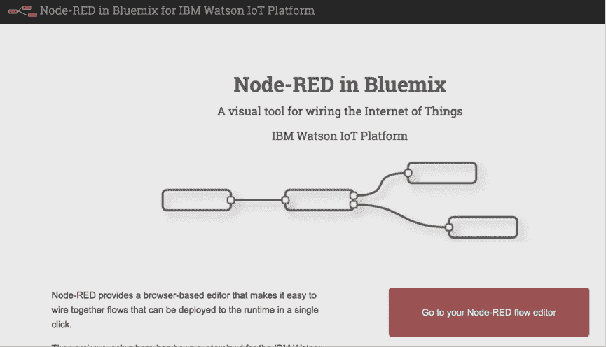

2.  要删除默认流中的所有现有节点，可以选中它们，然后按下 **Backspace** 或 **Delete** 键。（**备注：**键盘快捷键 CTRL-A 不起作用。）

    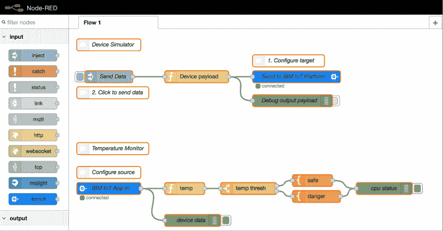

    然后会显示一个空白画布。

    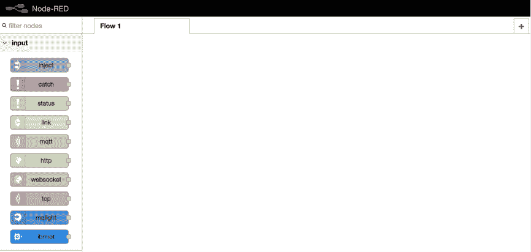

3.  转到我的 [CognitiveIoT](https://github.com/romeokienzler/developerWorks/tree/master/CognitiveIoT) GitHub 存储库，并下载 `flow1.json` 文件的一个副本。
4.  在文本编辑器中打开该文件。（**备注：**不要使用文字处理器！）
5.  将该文件的所有内容复制到剪贴板。
6.  单击右上角菜单中的 **Import > Clipboard** 将其导入您的 Node-RED 流。
7.  在 Import nodes 对话框中，将它粘贴到文本区域中，然后单击 **Import**。

    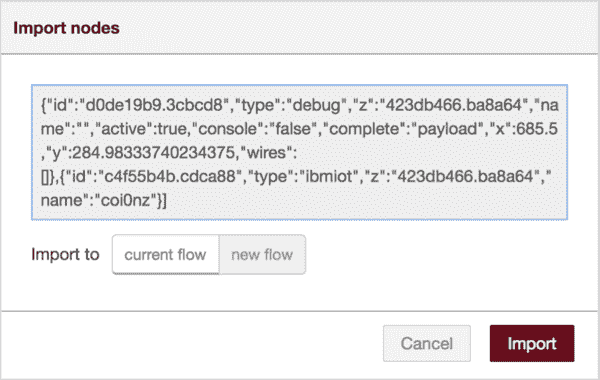

8.  单击画布将该流固定到画布。

    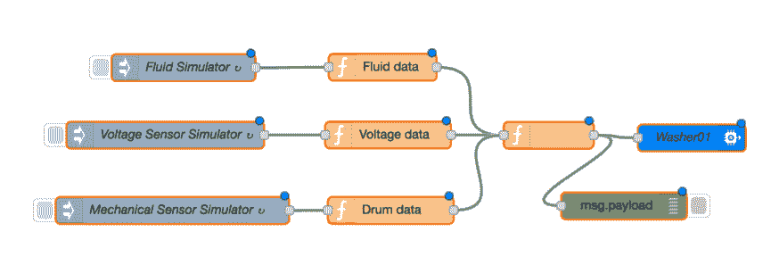

9.  单击 **Deploy**。

## 将设备数据存储在云存储 Store the device （一个 NoSQL 数据库）

1.  在 Node-RED 编辑器中，单击画布区域右上角的加号 (+) 来创建一个新流。

    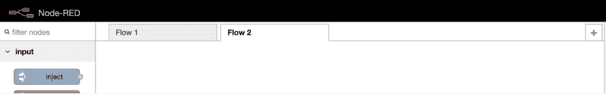

2.  转到我的 [CognitiveIoT](https://github.com/romeokienzler/developerWorks/tree/master/CognitiveIoT) GitHub 存储库，下载 `flow2.json` 文件的一个副本。
3.  像之前一样，在文本编辑器中打开该文件，并将其所有内容复制到剪贴板。
4.  单击右上角菜单中的 **Import > Clipboard** 将其导入您的 Node-RED 流。
5.  将“limit to max 5000 entries”节点连接到“washing”节点。

    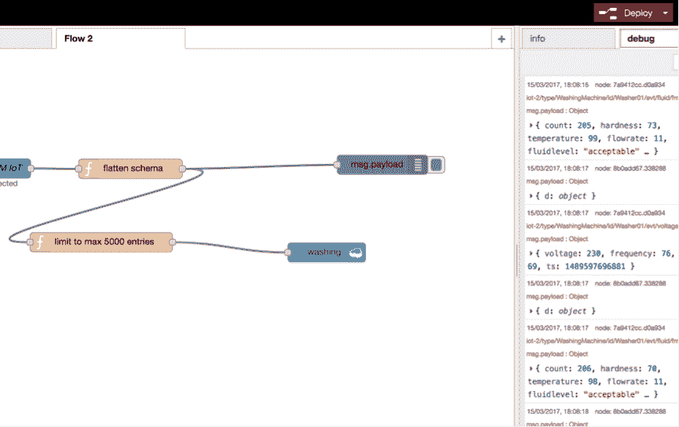

6.  单击 **Deploy**。

恭喜您，您现在正将 IoT 数据传输到一个 Cloudant Apache CouchDB NoSQL 数据库中！（**备注：**我们将数据限制到 5000 个条目，以便以后能够快速处理它们，但您只能免费存储 1 GB 数据。）

## 使用 Watson Studio 检测 IoT 传感器数据流中的异常

最简单的异常检测算法之一就是移动 z 得分。所以我们将在 Apache Spark 上使用 SQL 实现此算法。要了解此算法的工作原理，首先让我们来看一些更简单的测量，比如均值和标准偏差。接下来，将它们转换为启用了时序的算法，方法是让它们计算移动平均值和移动标准偏差，最终得到移动 z 得分。

我们需要做的第一件事是创建一个 Python notebook，以便使用 Python 与 Apache Spark 集群进行交互。如果不太了解 Python，不必担心。我们使用 SQL 的主要目的是，使用 Apache Spark SQL 发出对 Cloudant Apache CouchDB NoSQL 中的数据的查询。

1.  登录到 [IBM Watson Studio](https://www.ibm.com/cloud/watson-studio)。
2.  单击窗口右上角的加号 (+)。

    

3.  在显示的菜单中选择 **Create notebook**。（**备注：**已经创建了一个默认项目。）
4.  单击 **From URL** 选项卡。
5.  在 **Name** 字段中，输入 `Cognitive IoT`。
6.  在 **Notebook URL** 字段中，输入以下 URL：

    `https://raw.githubusercontent.com/romeokienzler/developerWorks/master/CognitiveIoT/CognitiveIoT.ipynb`

7.  保留剩余的默认值并单击 **Create Notebook**。

    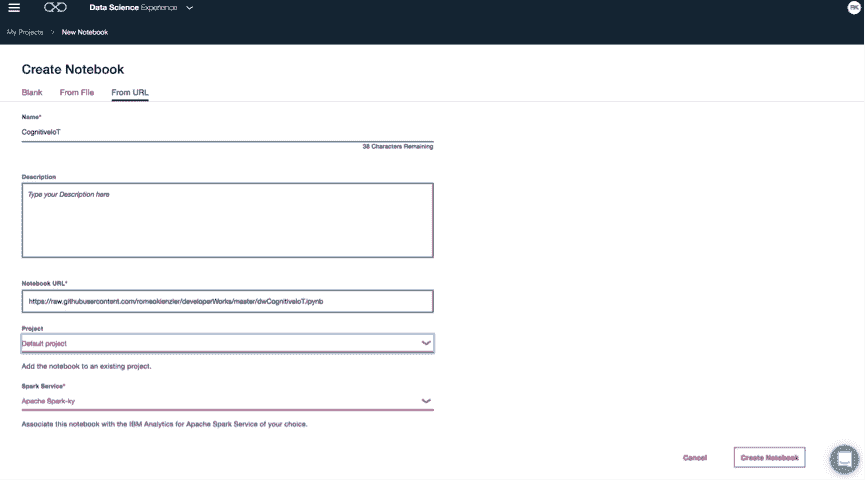

8.  在 notebook 中，需要为第 1 步中收集的 Cloudant 服务指定主机名、用户和密码。

    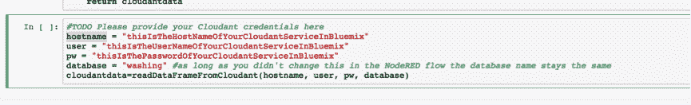

9.  单击第一个文本区域，然后单击 **Run** 按钮（类似一个音乐播放按钮的工具栏按钮）两次。您会看到数据集中的前 20 行。

    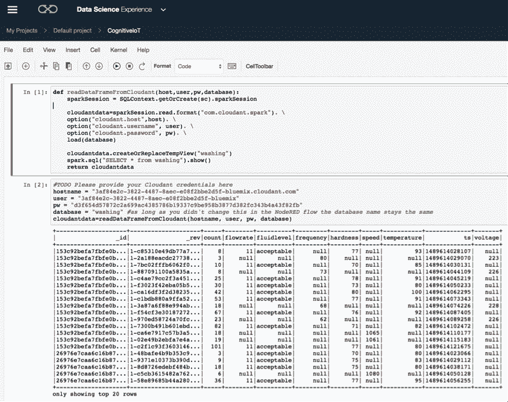

10.  按照 notebook 中的步骤完成此步骤的剩余部分。

## 将检测到的异常传输给实时数据处理组件

可通过多种方式将批处理环境中获取的模型传输给实时数据处理组件。最简单的方法是通过 HTTP 调用，我们现在将实现此方式。我们使用在云中运行的 ETL 组件更新边缘上的模型。我们需要在 Node-RED 流中创建一个 HTTP 端点，然后使用 MQTT 将此消息传递给边缘网关。

1.  在 IBM Cloud 仪表板中，单击 **View app**。

    

2.  单击 **Go to your Node-RED flow editor**。
3.  单击 **Flow 2**，它表示在云中运行的 ETL 组件。
4.  从左侧面板中的 **input** 部分，选择 **http** 并将它拖到 **Flow 2** 的画布上。

    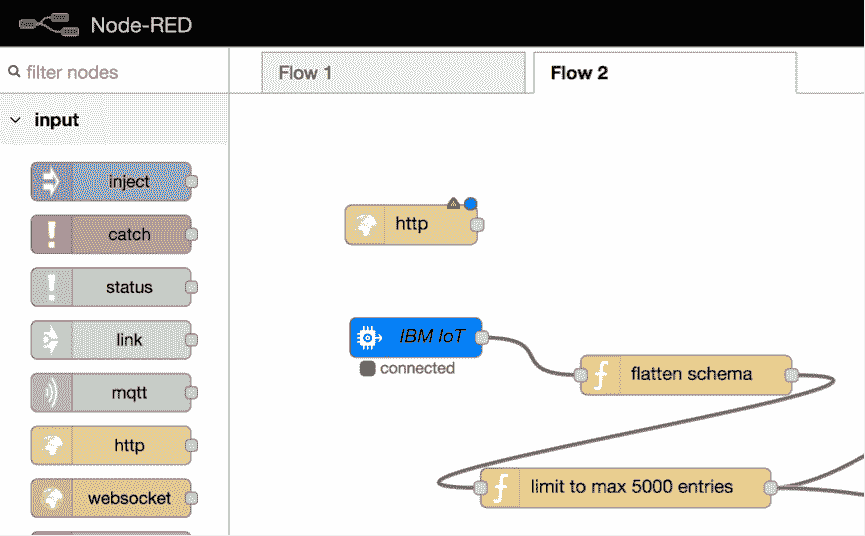

5.  每个请求需要一个响应，所以应将一个 **http** 响应节点连接到它。

    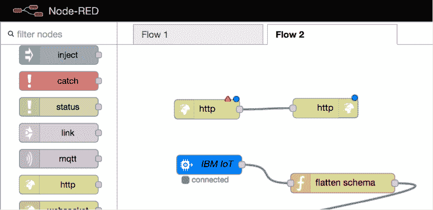

6.  双击 http 输入节点并在 **URL** 字段中键入 `/edgemodelupdate`，然后单击 **Done**。

    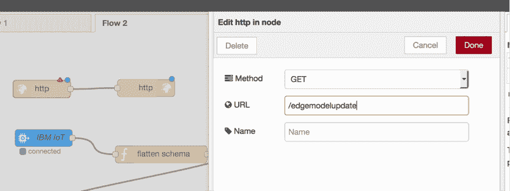

7.  从面板的输出部分，单击 **IBM IoT** 并将它拖到画布上。另外，将 **http** 节点连接到 **IBM IoT** 节点。

    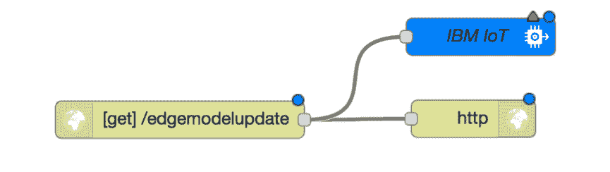

8.  双击 **IBM IoT** 节点并完成以下步骤：

    1.  为 **Authentication** 选择 **IBM Cloud Service**。此选项自动从 IBM Cloud（cloud foundry 服务代理）拉入 MQTT 消息代理的凭证。
    2.  选择 **Device Command** 作为 **Output Type**。此选项是您想从应用程序向设备或网关发送消息时选择的类型，这正是我们在这里所做的操作。
    3.  输入 `Washing01` 作为 **Device ID**。我们可以通过 MQTT 直接访问接收设备，因为系统使用了一种发布/订阅消息交付模型。
    4.  输入 `modelupdate` 作为 **Command Type**。因为我们使用了发布/订阅，所以定义一个命令类型使得设备能够订阅与它们相关的特定消息。
    5.  输入 `json` 作为 **Format**，因为 Node-RED 中的首要数据交付方式是基于 JSON 的。
    6.  输入 `payload` 作为 **Data** 属性，因为我们访问的是来自 HTTP 上游的消息的有效负载。

        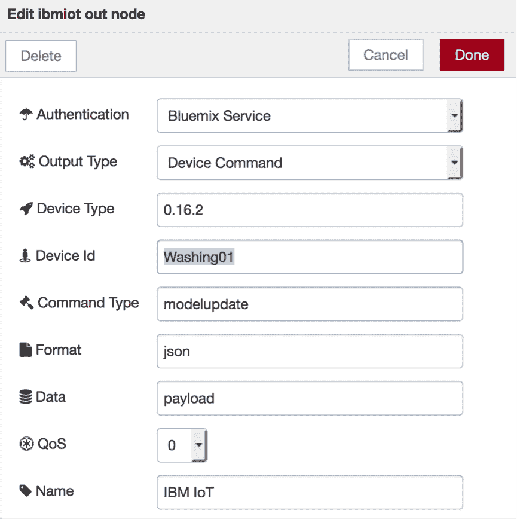

    7.  单击 **Done**。
9.  单击 **Deploy**。

现在，通过在云中使用 Node-RED 作为 HTTP 与 MQTT 之间的代理，我们可以使用 HTTP 从分析工作流向边缘网关发送消息。使用 Watson IoT Platform 的优势在于，我们不必担心对边缘网关的直接访问（这通常是不可能的），因为所有设备都被连接到 MQTT 消息代理，而且订阅网关是为了获得它们感兴趣的消息。借助此配置，我们可以确保需要的消息能够通过消息总线传输到边缘网关。

## 实现边缘网关上的消息流

现在，通过订阅这些消息并通过更新阈值来对它们做出反应，我们可以在边缘网关端实现消息流。例如，如果某个机器上的电流出现异常，我们可以关闭电动机来保护它。让我们实现此行为：

1.  单击 **Flow 1**，因为此流表示边缘网关。
2.  从面板中，将 **IBM IoT** 输入节点拖到画布上。

    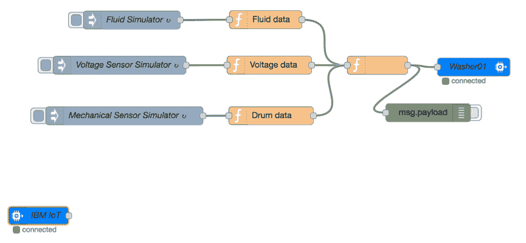

3.  双击 IBM IoT 节点并提供以下细节：

    1.  为 **Authentication** 选择 **IBM Cloud Service**。
    2.  选择 **Device Command** 作为 **Input Type**，因为我们需要通过 MQTT 从云向边缘网关发送一条命令。
    3.  对于 **Device Type、Device ID、Command** 和 **Format**，选择 **All**。

        为了简单性起见，我们订阅了 MQTT 消息总线上的所有命令，但在实际场景中，只会订阅我们感兴趣的命令并做出相应的反应。

        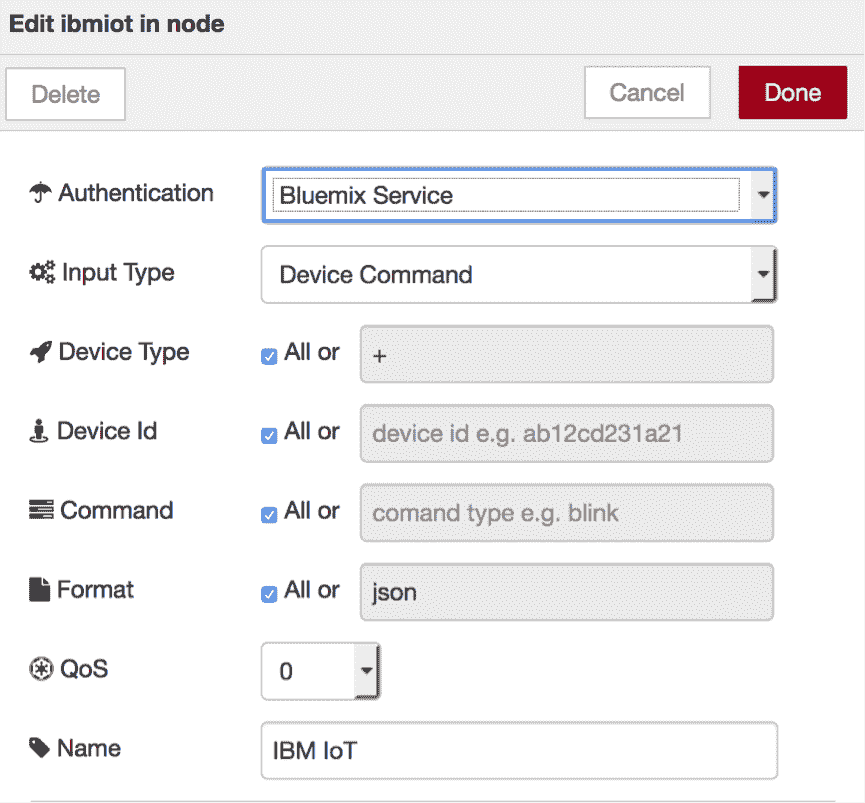

    4.  单击 **Done**。
4.  从面板中，将一个调试节点从输出部分拖到画布上，并将它连接到 **IBM IoT** 节点。

    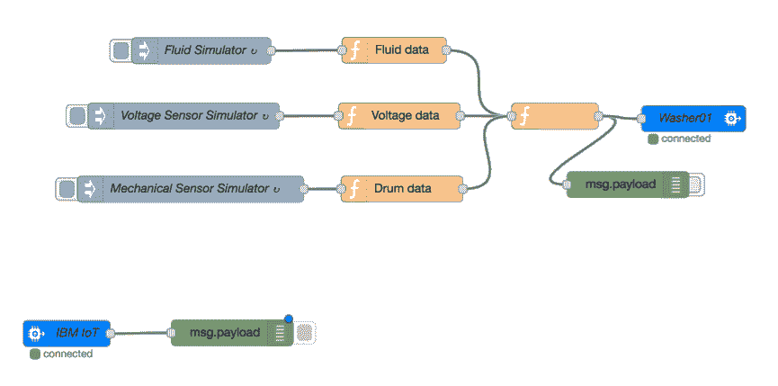

5.  单击 **Deploy**。

## 测试 HTTP 端点

我们创建了一个需要进行测试的 HTTP 端点。

1.  在 IBM Cloud 中，复制您的应用程序的 URL，将“red/#”替换为“edgemodelupdate”。例如，在我的用例中，HTTP 端点的 URL 是：`https://1234thisismyname.mybluemix.net/edgemodelupdate`

2.  因为我们使用的是 HTTP GET 端点，所以可以向 URL 附加一个参数，以便使用浏览器发出请求（打开一个新选项卡）： `https://1234thisismyname.mybluemix.net/edgemodelupdate?command=emergencyshutdown`

3.  在 Node-RED 流编辑器中的调试面板中，您会看到一条与下图所示消息类似的消息。

    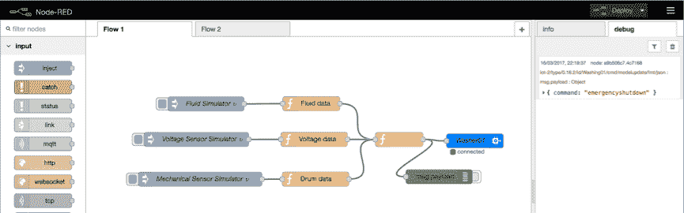

因为我们正在模拟一个边缘网关，所以没有实际的执行器，而在实际场景中，这可能导致洗衣机的电动机停用。

## 结束语

您已经了解了一个完整的认知 IoT 管道的结构。从分布式感知到在中央位置制定可操作的决策，再到在边缘位置立即执行一项操作。现在我们仅缺少两步：使用认知 API（比如 TTS、STT 或视觉识别）和在边缘上执行分析。

如果有兴趣学习更多相关知识，请加入我的 Coursera 课程[一个面向开发人员的 IoT 数据探索和可视化指南](https://www.coursera.org/learn/exploring-visualizing-iot-data)，可以帮助您使用 Apache Spark 实现有效的 IoT 数据分析。

如果您想关注我的最新动态，请订阅我的 [YouTube 频道](https://www.youtube.com/channel/UC_zIqSWu-yQcBAywLtHDAfg)。

### 离开前的最后一个练习……

在本教程的最后，我们提供了一个可选练习。它将展示如何使用一个简单的 Node-RED 函数，将 z 得分计算推向边缘。

我们希望将 z 得分计算推向离传感器尽可能近的地方。我们需要直接在边缘网关上的 Node-RED 实例上实现它，以省去在云中的整个环节。z 得分计算是使用 Node-RED 内的 JavaScript 函数完成的。您可以：

*   使用本节中的代码演练，自行在 Node-RED 流中实现这些节点
*   从 `edge_zscore.json` 文件复制整个函数，可以在我的 [CognitiveIoT](https://github.com/romeokienzler/developerWorks/tree/master/CognitiveIoT) GitHub 存储库中找到该文件，并使用从剪贴板导入功能将该函数粘贴到 Node-RED 流的画布中。

下面让我们来简要介绍一下源代码，帮助您了解发生了什么。

首先，初始化一个列表，该列表使用 `voltage` 参数存储最后 `n` 个电流值。在流计算中，此列表被称为“固定大小的滑动窗口”。

`var aggwindow = context.get('aggwindow')||[];`

然后向该列表添加值 – 到达此函数节点的每条消息对应一个值。

`aggwindow.push(msg.payload.d.voltage);`

我们继续向该列表添加值，直到值的总数超过 30 个，这基本上定义了滑动窗口的大小。

`if (aggwindow.length> 30) {`

如果不理解此代码，请查阅以下函数编程资源：

*   我的 Coursera 课程[一个面向开发人员的 IoT 数据探索和可视化指南](https://www.coursera.org/learn/exploring-visualizing-iot-data)介绍了 Apache Spark 上的函数式编程。
*   IBM Developer 文章“[使用函数式编程技术编写优雅的 JavaScript 代码](https://www.ibm.com/developerworks/library/wa-javascript/)”详细介绍了相关的基础知识。
*   要理解 JavaScript 中的 map/reduce 概念，请查阅文章“[在 JavaScript 函数式编程中使用 Map 和 Reduce](https://www.sitepoint.com/map-reduce-functional-javascript/)”。

要计算 z 得分，还需要获得均值和标准偏差。计算我们希望求和的窗口内的所有元素的总和，这绝对是个好主意。

`sum = aggwindow.reduce((a,b)=>a+b,0);`

除了求和之外，我们还需要获得元素数量，所以还需要计算它们。（**备注：**我们获得的数值应该始终为 31，但您从不知道这一点，对吧？）

`n = aggwindow.length;`

有了总和和计数值，就很容易计算均值。

`mean = sum/n;`

有了均值，就可以计算标准偏差。

`sd = Math.sqrt(aggwindow.map(x=>Math.pow(mean-x,2)).reduce((a,b)=>a+b,0));`

接下来，我们希望删除列表中最旧的元素，这类似于 LIFO。

`aggwindow.shift();`

现在，将均值和标准偏差值添加到 z 得分的计算公式中，大功告成。（**备注：**我们向标准偏差添加了一个非常小的值，因为标准偏差可能为 0，该值从数学上讲是未定义的。）

```
msg.zscore = (mean-msg.payload.d.voltage)/(sd+0.0001)
} 
```

最后，我们将此列表存储到一个全局上下文中，以便在各个消息的生存期中保存它。

`context.set('aggwindow',aggwindow);`

为了进行调试，我们同时跟踪了实际电流（或电压）和 z 得分。（在我们需要发出警报时，仍能在 `msg.zscore` 上访问各个 z 得分值。）

```
msg.payload=msg.payload.d.voltage+":"+msg.zscore;
return msg; 
```

让我们在此功能的最后发出警报。我们将向流中添加最后一个 JavaScript 函数。此警报由异常高的电流振荡（无论是升高还是降低）触发，因为这种振荡可能损坏我们电动机。我们忽略了在识别出异常高的得分前的所有消息，仅在发现异常时才通过发出警报来做出反应。

```
if (Math.abs(msg.zscore)>0.5) {
    msg.payload="ALERT ALERT ALERT!!!!!";
    return msg; 
```

您的 Node-RED 流应类似于下图中的流。

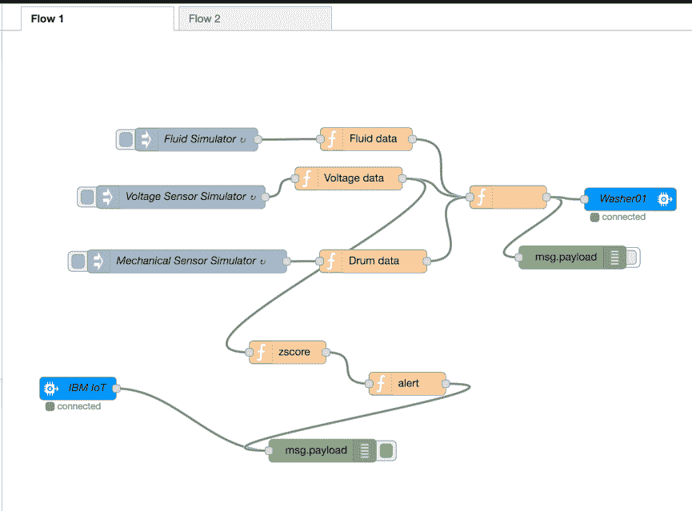

本文翻译自：[Build a cognitive IoT app in just 7 steps](https://developer.ibm.com/tutorials/iot-cognitive-iot-app-machine-learning/)（2018-03-14）