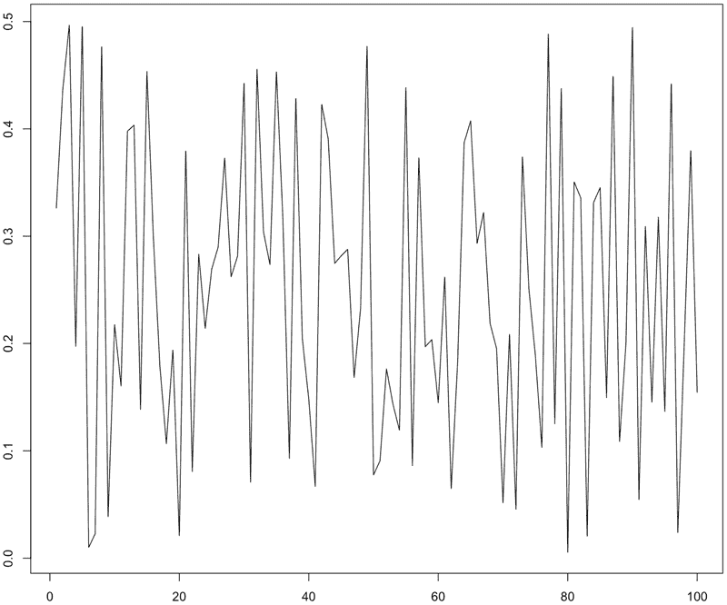

# 创建有趣且简单的 IoT 加速计游戏

> 原文：[`developer.ibm.com/zh/tutorials/iot-simple-iot-accelerometer-game/`](https://developer.ibm.com/zh/tutorials/iot-simple-iot-accelerometer-game/)

***注：**IBM Data Science Experience（DSX）目前是 IBM Watson Studio。虽然名称已经更改，一些图像可能显示先前的名称，但本教程中的步骤和过程仍然有效。*

您可以创建一个有趣的小游戏来与好友和同事一起玩。您可以和任何有智能手机的人一起玩这个游戏，我将该游戏称为“Harlem Shake”。


玩法很简单：为一些人提供一个 URL，让他们在智能手机上访问该 URL，然后让他们尽力摇动智能手机。摇动时最用力的人将获胜！

背后的原理非常简单：将智能手机加速计的数据传输到云中，将数据捕获到一个数据库中，然后通过一个脚本计算获胜者。这听起来简单而有趣。但是，首先您必须构建该游戏。在此过程中，您还会掌握 MQTT、NodeRED、ApacheCouchDB 和 ApacheSpark 的许多知识。

像所有 IoT 应用程序一样，这个 IoT 游戏需要一个完整的系统才能运行。在本教程中，我们使用以下 IBM Cloud 和 IBM Watson IoT Platform 服务：

*   Node-RED，我们使用它创建 IoT 应用程序，而且使用它将传感器的数据传输到数据库
*   IBM Watson IoT Platform，我们使用它作为 MQTT 消息代理，将所有内容集中在一起
*   Cloudant，这是一个 NoSQL 数据库系统，我们使用它存储数据
*   一个 ApacheSpark SQL 脚本，我们在 Watson Studio 中运行该脚本来确定谁获胜了

显然，所有智能手机都将充当传感器，将数据传入我们的 IoT 应用程序。

只需 6 步，就可以完成这个游戏的构建工作：

*   使用一键式部署来部署游戏应用程序。
*   替换 Internet of Things Platform 服务。
*   确保 MQTT 消息代理能接收数据。
*   设置 NoSQL 数据库存储数据。
*   使用 Node-RED 将数据传输到 Cloudant。
*   在 Data Science Notebook 中分析数据。

## 构建您的应用程序需要做的准备工作

*   一个 IBM Cloud 帐户。（注册一个 [IBM Cloud Lite 帐户](https://cocl.us/IBM_CLOUD_GCG)，这个免费帐户永不过期。）
*   一部智能手机。或者一位或多位有智能手机并且与您一起玩该游戏的朋友。
*   一个 IBM Watson Studio 帐户。可以使用您在注册 IBM Cloud 帐户时创建的 IBM ID。

    要开始使用 IBM Watson Studio，包括注册帐户，请观看 IBM Developer TV 上这个[视频集合](https://developer.ibm.com/tv/ibm-data-science-experience-basics/)中的视频。

1

## 使用一键式部署来部署游戏应用程序

有了 IBMCloud 帐户后，只需单击一次即可部署该应用程序。但是您必须手动设置部署。我为您创建了一个示例 IoT 游戏应用程序，并将它放在 Github 上供您下载。

**备注：**使用标准的免费增值帐户时，不能使用自动部署选项，因为您无法访问构建管道服务。

1.  [登录到您的 IBM Cloud 帐户。](https://cloud.ibm.com/?cm_sp=ibmdev-_-developer-tutorials-_-cloudreg)
2.  转到我[在 Github 中的 `discover-iot-sample` 存储库](https://github.com/romeokienzler/discover-iot-sample)，在 README 说明中，单击 **Deploy to IBM Cloud** 按钮。

    

3.  在 IBM Cloud 中，单击 **Deploy**。

    

4.  单击“Delivery Pipeline”。


1.  在 Deploy Stage 中，单击齿轮图标，然后选择 **Configure Stage**。


1.  选择 Input 选项卡，将 **Input Type** 更改为 `Git Repository`，然后单击 **Save**。


1.  在 Build Stage 磁贴中，单击“Run”图标（齿轮图标旁边）。


1.  在一段时间后，在 Deploy Stage 磁贴中，您应该在“Last Execution Result”部分中看到应用程序的 URL。单击 URL。显示在智能手机上玩游戏所需的 URL。

2.  复制 URL（并为 URL 创建一个简短的 URL 或 QR 代码），然后通过电子邮件发送给自己。您稍后将使用此链接来玩游戏。

 尽管现在可以将加速计数据发送到云，但不会存储这些数据。接下来，我们需要设置数据存储。

2

## 替换 Internet of Things Platform 服务

部署游戏应用程序后，需要一种方式来将加速计数据传输到云。要将该数据传输到云，可以使用 Node-RED，这是一个开源的图形流编辑器。使用 Node-RED 订阅 MQTT 数据，这些数据从智能手机传入并存储在云中的数据库内。但在使用 Node-RED 之前，我们需要将默认的平台服务替换为我包含在刚部署的应用程序中的服务。

2a

### 删除默认的 IoT Platform 服务

Internet of Things Platform Starter 样板包含一个 Node-RED 引擎，您将使用它来处理 IoT 消息。首先，需要从该 Starter 样板删除默认的 Watson IoT 服务。

1.  您应该已经登录到您的 IBM Cloud 帐户。如果没有，请[登录](https://cloud.ibm.com/?cm_sp=ibmdev-_-developer-tutorials-_-cloudreg)。
2.  转到 IBM Cloud 目录中的 [Internet of Things Platform Starter](https://cloud.ibm.com/catalog/starters/internet-of-things-platform-starter?env_id=ibm:yp:us-south&cm_sp=ibmdev-_-developer-tutorials-_-cloudreg)。（也可以选择 **Catalog > Boilerplates > Internet of Things Platform Starter** 导航到这个 Starter 样板。）
3.  在 **App name** 字段中，为应用程序输入一个唯一的名称，比如 *myharlemshake*，然后单击 **Create**。
4.  等待状态从 **Starting** 更改为 **Running**。

    

    

5.  从左侧菜单中，单击 **Connections**。

    

6.  对于默认的 Internet of Things Platform 服务，单击右上角的菜单，然后单击 **Unbind service**。
7.  在显示的弹出消息中，选择 **Delete this service instance** ，然后单击 **OK**。
8.  提示重新暂存您的应用程序时，单击 **Cancel**。

2b

### 连接到已部署的游戏应用程序的 IoT 服务

现在您已删除默认的 `iotf-service-free` 服务，接下来需要创建一个连接，以连接所部署的游戏应用程序的 IoT 服务，并设置正确的安全级别。

1.  单击 **Connect existing** 按钮。
2.  选择 **discover-iot-try-service** ，然后单击 **Connect**。
3.  提示重新暂存您的应用程序时，单击 **Restage**。
4.  等待状态变为 **Running**。
5.  单击 **discover-iot-try-service**，然后单击 **Launch**。这会在 IBM Cloud 中启动 IBM Watson IoT Platform。
6.  将鼠标悬停在左侧的图标列上。从左侧菜单中选择 **Security**。
7.  编辑 **Connection Security**。
8.  在 Default Rule 部分中的 **Security Level** 下，选择 **TLS Optional**，然后单击 **Refresh compliance**。
9.  在窗口的右上角，单击 **Save**。

3

## 确保 MQTT 消息代理能接收数据

现在我们已成功连接到我在游戏应用程序中提供的 IoT 服务，下面需要使用 Node-RED 将传感器（加速计）数据存储在云中。

3a

### 保护 Node-RED 流编辑器

在打开 Node-RED 之前，必须配置一个用户名和密码才能访问应用程序中的 Node-RED 流。

1.  您需要返回到游戏应用程序的 Cloud Foundry Apps 页面。在浏览器中，找到 Service Details 选项卡。从[汉堡包形状的菜单](https://en.wikipedia.org/wiki/Hamburger_button)中选择 **Cloud Foundry Apps**。
2.  从该表中，选择您的游戏应用程序的名称。
3.  从左侧菜单中选择 **Connections**。

    

4.  在状态的右侧，单击 **Visit App URL**。该 URL 应是您的应用程序名称，后跟 `mybluemix.net`（例如 `https://myharlemshake.mybluemix.net`）。

    **备注：**记下这个 URL，因为能使用它打开您的 Node-RED 实例。

5.  要保护 Node-RED 实例，可以单击 **Next**。
6.  选择用户名和密码。记下该信息。单击 **Next**。
7.  单击 **Finish**。
8.  单击 **Go to your Node-RED flow editor**。

    

9.  输入您的用户名和密码，登录 Node-RED。

现在已准备好捕获并存储该数据了。您已部署了游戏应用程序，而且已在游戏应用程序与消息代理之间建立了连接。通信渠道工作正常，但需要一个位置来存储要发送的数据。

3b

### 订阅该数据流

现在我们可以访问 Node-RED 了，让我们仔细检查一下从智能手机传入的数据是否已到达云中（MQTT 消息代理是 IBM Watson IoT Platform 中包含的一个服务）。

我们需要使用 Node-RED 订阅该数据流。我们将使用 Node-RED 调试面板执行该服务的所有调试工作。

1.  您应该已在上一节打开 Node-RED 实例。如果没有，使用 **Visit App URL** 打开 Node-RED 实例，您在保护 Node-RED 流编辑器中启动 Node-RED 引擎时已记下该链接。使用您自己分配的用户名和密码，登录游戏应用程序的 Node-RED 实例。

    

2.  要删除默认流中的所有现有节点，可以选中它们，然后按下 **Backspace** 或 **Delete** 键。（**备注：**无法使用键盘快捷键 CTRL-A 选择所有节点。）然后会显示一个空白画布。
3.  从左侧面板中，选择 **IBM IoT** 输入节点（不要使用输出节点）和 **debug** 输出节点并将其拖放到右侧窗格。连接它们，方法是选择一个节点上的一个连接圆圈，将它拖到另一个节点的连接圆圈。

    

4.  双击 **IBM IoT** 节点。
5.  对于 **Authentication**，选择 **IBM Cloud Service**，然后单击 **Done**。这会告诉该节点使用 Cloud Foundry 凭证注入特性来获取连接 MQTT 代理的凭证，这是一个非常方便的功能，因为在 IBM Cloud 中，您所部署的应用程序会连接到 MQTT 代理（也就是 Watson IoT Platform 服务）。
6.  单击 **Deploy** 按钮。
7.  在面板右侧的 **Deploy** 按钮下，选择 **debug** 选项卡。
8.  在您的智能手机上，使用第 1 节中创建的 **应用程序名称** 打开游戏应用程序。此处该名称为 `discover-iot-sample-romeokienzler-1412.mybluemix.net/iot-phone`。
9.  提供一个包含字母和数字的 8 字符名称；例如 *qwer1234*。
10.  提供一个仅包含 a 到 z 的字母的 8 字符密码。

    

    在 Node-RED 中的 **debug** 选项卡上，您应看到调试输出。

    

3c

### 检查 IBM Watson IoT Platform 仪表板中的传感器数据

查看加速计数据的另一种方法是查看所有游戏玩家的名单。

1.  打开 IBM Watson IoT Platform。在 Cloud Foundry Apps 视图中单击 **discover-iot-try-service**，然后单击 **Launch**。

    

2.  从左侧菜单中选择 **Devices**。

    

3.  单击一个设备，然后双击一个 `sensorData` 事件以查看更多细节。

    

基本完成了，祝贺您。您已验证能使用 Watson IoT Platform 中的 MQTT 消息代理将数据从智能手机传输到我们的 Node-RED 应用程序。下一步是将此数据传输到一个数据库并进行分析。

4

## 设置 NoSQL 数据库存储数据

当我们玩 Harlem Shake 时，会通过云中的 MQTT 消息代理发送 IoT 传感器数据。我们需要将该数据发送到 NoSQL 数据库。让我们添加数据库功能。

1.  您应该已在上一节打开 Node-RED 实例。如果没有，使用 **Visit App URL** 打开 Node-RED 实例，您在保护 Node-RED 流编辑器中启动 Node-RED 引擎时已记下该链接。使用您自己分配的用户名和密码，登录游戏应用程序的 Node-RED 实例。
2.  在左侧面板中，将 **function** 节点拖放到另外两个节点之间，这会自动将它连接到这些节点。

    

3.  我们首先需要将分层 JSON 消息扁平化为一种关系模式。双击 **function** 节点，粘贴以下 JavaScript 代码。

    ```
    msg.payload =
    {
    X : msg.payload.d.ax,
    Y : msg.payload.d.ax,
    Z : msg.payload.d.ax,
    SENSORID : msg.payload.d.id
    }
    return msg; 
    ```

    最终结果应该类似于下图。

    

4.  单击 **Done**。
5.  单击 **Deploy**。在 **debug** 选项卡上，输出应该类似于下图。

    

添加 NoSQL 函数后，我们就准备好将数据存储在 Cloudant 中了。

5

## 使用 Node-RED 将数据传输到 Cloudant

我们将使用由 IBM Cloudant 提供支持的 ApacheCouchDB，将数据传输到刚创建的 NoSQL 数据库函数。Cloudant 基于开源的 ApacheCouchDB，而且我们将使用它存储我们的中间传感器数据。

1.  在左侧面板的存储区域中，选择 **cloudant out** 存储连接器（云图标位于右侧），并将它连接到 function 节点的输出。

    

2.  双击 **cloudant out** 节点，然后选择您的数据库 **服务**。

    **备注：**除非您在 IBM Cloud 控制台中将多个 Cloudant 数据库连接到此应用程序，否则应该只有一个数据库服务。（同样，IBM Cloud 在这里使用 Cloud Foundry 凭证注入特性来为您配置数据库端点。）

3.  将该数据库命名为 `harlemshake`。
4.  选择 **Only store msg.payload object**。

    

5.  单击 **Done**。
6.  单击 **Deploy**。

现在是时候检查数据是否传入该表了。查看 Node-RED 中的调试窗格，确保智能手机上的游戏应用程序仍在发送数据。

6

## 在 Data Science Notebook 中分析数据。

所有功能应该都工作正常。摇动智能手机，数据传输到云，数据库保存该数据。但谁来保存分数？需要一个工具来分析该数据并公布获胜者。我们将使用 Watson Studio。

1.  登录到 [IBM Watson Studio](https://www.ibm.com/cloud/watson-studio)。
2.  向项目添加 Spark 服务。然后，创建一个 Notebook 并选择 Spark 服务。[按照本教程中的步骤](https://developer.ibm.com/tutorials/create-a-spark-service-for-ibm-watson-studio/)。
3.  单击 **From URL**，在 **Name** 字段中添加一个名称，在 **Notebook URL** 字段中粘贴以下 URL：

    `https://raw.githubusercontent.com/romeokienzler/developerWorks/master/boomboomshakeshakesparkv2.ipynb`

4.  单击 **Create Notebook**。
5.  要创建一个新的数据源连接，单击 **Find and Add Data** 图标 **> Connections > project page**。

    

6.  单击 **Connections > Create Connection**。
7.  在 **Name** 字段中指定一个名称，然后在 **Service Instance** 下选择数据库。单击 **Create**。

    **备注：**应该仅列出来自您之前安装的 Node-RED 样板的一个 Cloudant 数据库。

8.  返回 Notebook 并重新加载。现在可以看到该连接了。选择 Notebook 的第一个空单元，单击 **Insert to code**。现在已创建凭证，而且您可以开始运行该 Notebook 了。

    

9.  单击 **Cell > Run All**。

在您和朋友玩过该游戏后，就可以看看谁赢了。在 Notebook 中，查找 `spark.sql` 语句。看起来“Seb”是获胜者，拥有最高的能量输入。


## 理解结果背后的数据科学原理

`spark.sql` 语句的工作是通过计算所有 3 个维度的加速计数据的总体能量，估算玩家在玩游戏期间所生成的能量。

在一个轴上，震动数据的时间序列类似于下图：


如果想知道这个时间序列所代表的能量，可以[对该函数求积分](https://en.wikipedia.org/wiki/Integral)来估算此值。



请记住，我们删除了负值并将它们转换为正值。要估算积分，我们简单地对所有各个正值求和。


现在我们已了解如何对一个时间序列求积分，让我们使用下面的公式计算所有 3 个维度的总体能量（请记住，震动的每个维度都有 3 个不同的信号）：


我们对每个测量值求平方和，然后对和求平方根。

**备注：**要获得真实的能量值，我们还需要将设备质量考虑在内。

使用 SQL，通过以下语句表示此计算过程：

```
select
    id, // select ID of the device because we need to know who the winner is
    sqrt(sum(ax*ax+ay*ay+az*az)) //calculate energy
    as energy  // give this new feature a name
    from unconfshake // specify temporary query table of ApachSparkSQL
    group by id // calculate on a per device basis
    order by energy desc // make top performers appear on top 
```

## 结束语

您已完成了工作，构建了这个游戏。现在是时候玩一玩了。

1.  找一位有智能手机的朋友或同事。向朋友提供游戏应用程序的 URL。
2.  他们需要输入自己唯一的 8 位字母数字 ID，以及一个唯一的 8 位字母密码 (a-z)。
3.  让朋友们向所有方向摇动智能手机。这会将数据发送到云。可以使用您导入的 Notebook 中提供的 SQL 查询，在 Node-RED 和 Watson Studio 中验证这一结果。过一段时间后重新运行包含该 SQL 语句的单元，您会注意到获胜者名单也发生了变化。
4.  可以单击 Data Science Notebook 中的 **Cell > Run All** 来检查获胜者。

要想再玩一次，必须完成以下步骤：

1.  在 Node-RED 中重命名目标数据库 (harlemshake)，然后在 Notebook 中更新该名称。
2.  再次打开 IBM Watson IoT Platform，选择所有设备，然后选择 **Delete devices**。

    

**备注：**要想再玩一次，可以删除该数据库中的结果，但更轻松的方法是重命名该数据库并重置连接。

这个游戏可以保持运行，所以您可以在午餐休息期间玩乐，让您在饭后保持清醒！

本文翻译自：[Create a fun, simple IoT accelerometer game](https://developer.ibm.com/tutorials/iot-simple-iot-accelerometer-game/)（2018-03-14）